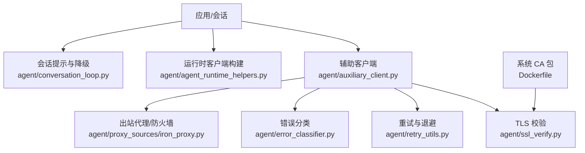
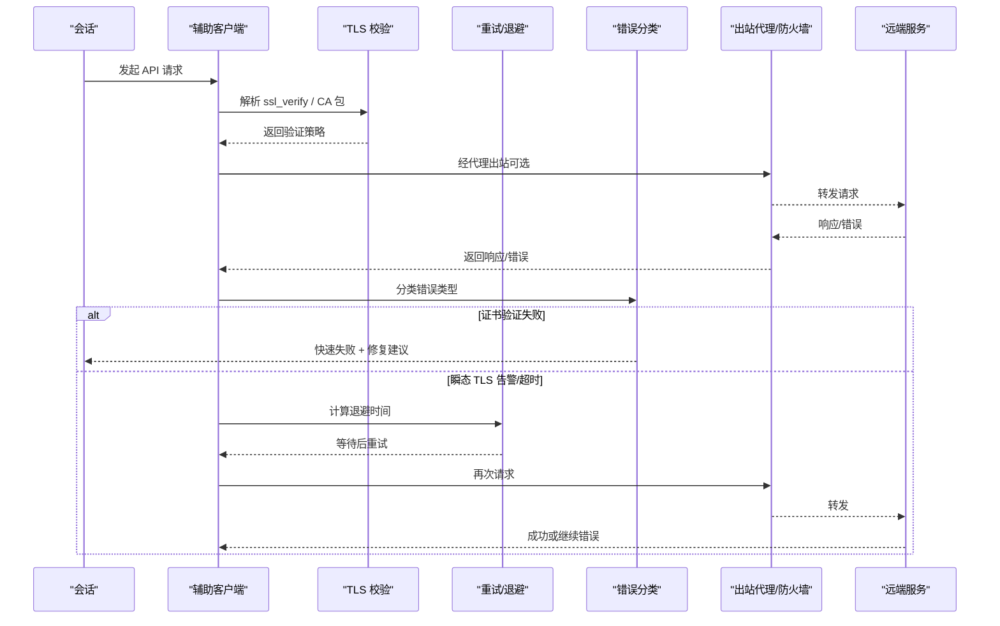
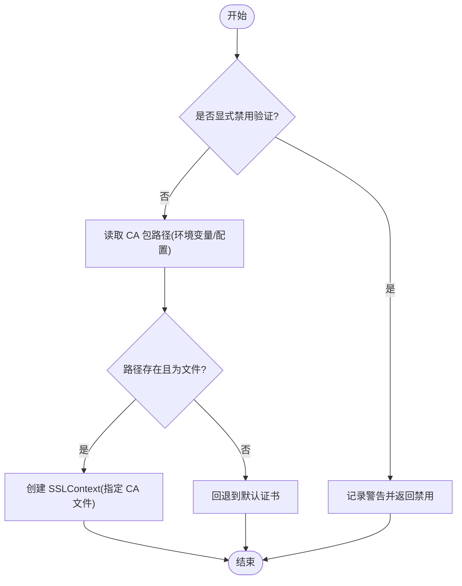
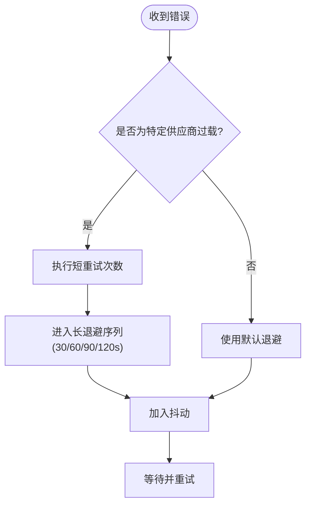
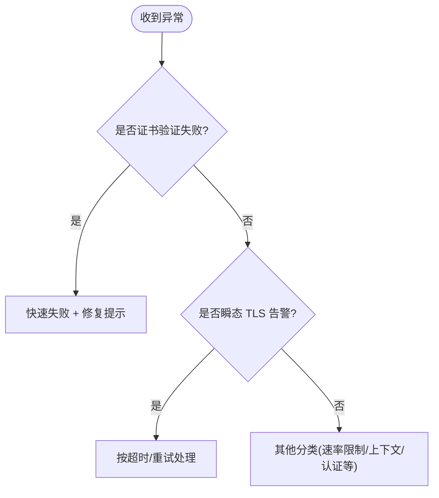
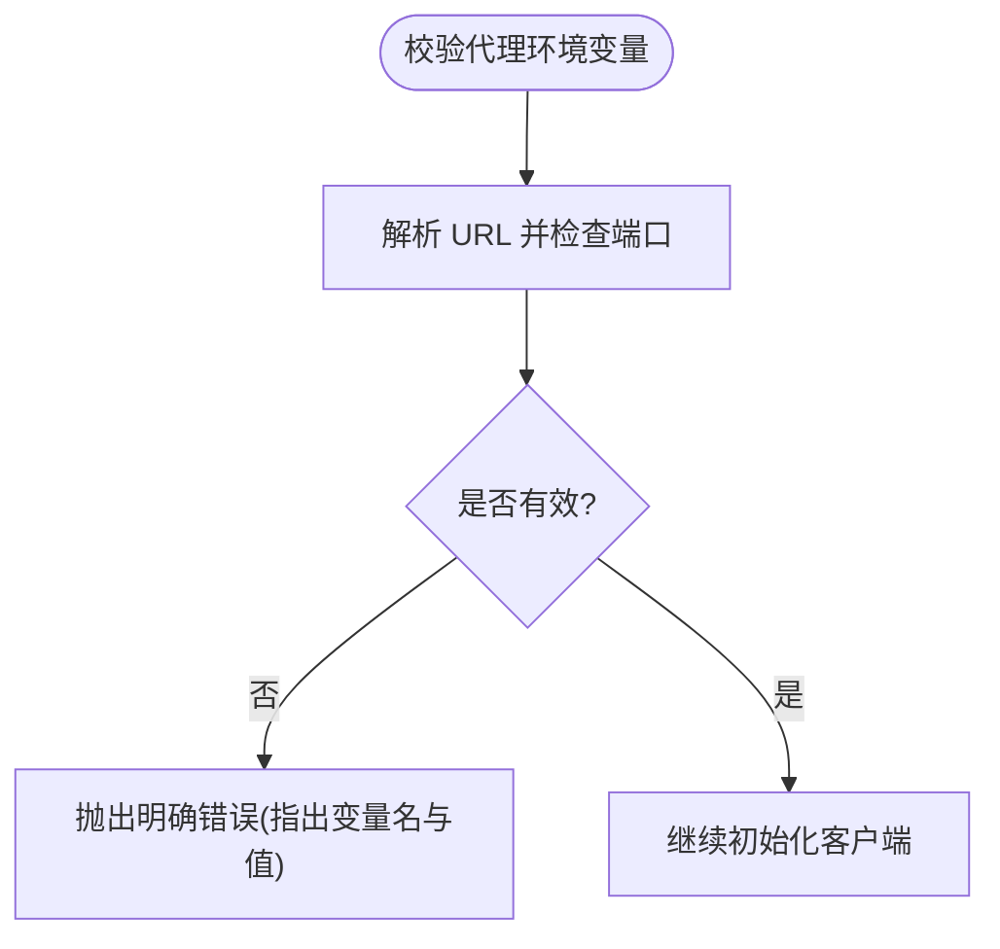
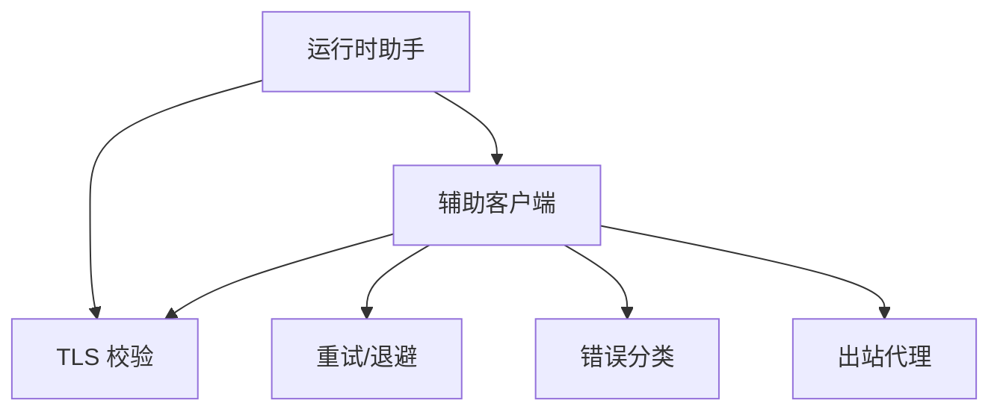

# 网络问题

<cite>
**本文引用的文件**
- [agent/ssl_verify.py](file://agent/ssl_verify.py)
- [agent/retry_utils.py](file://agent/retry_utils.py)
- [agent/proxy_sources/iron_proxy.py](file://agent/proxy_sources/iron_proxy.py)
- [agent/error_classifier.py](file://agent/error_classifier.py)
- [agent/auxiliary_client.py](file://agent/auxiliary_client.py)
- [agent/agent_runtime_helpers.py](file://agent/agent_runtime_helpers.py)
- [agent/conversation_loop.py](file://agent/conversation_loop.py)
- [Dockerfile](file://Dockerfile)
</cite>

## 目录
1. [简介](#简介)
2. [项目结构](#项目结构)
3. [核心组件](#核心组件)
4. [架构总览](#架构总览)
5. [详细组件分析](#详细组件分析)
6. [依赖关系分析](#依赖关系分析)
7. [性能考虑](#性能考虑)
8. [故障排查指南](#故障排查指南)
9. [结论](#结论)
10. [附录](#附录)

## 简介
本文件面向在生产与开发环境中遇到的各类网络连接问题，提供端到端的解决方案与最佳实践。覆盖范围包括：
- API 连接失败、超时与重连（OpenAI 及第三方服务）
- 代理配置（HTTP/HTTPS/SOCKS）与防火墙策略
- SSL/TLS 证书问题（验证失败、自签名证书、CA 更新）
- DNS 解析与连通性测试
- WebSocket 连接诊断与恢复
- 网络中断后的状态恢复与数据同步
- 网络性能优化与故障转移
- 监控与诊断工具使用

## 项目结构
本项目在网络层的关键实现集中在以下模块：
- TLS 证书校验与 CA 选择：agent/ssl_verify.py
- 重试与退避策略：agent/retry_utils.py
- 出站流量控制与凭据注入代理：agent/proxy_sources/iron_proxy.py
- 错误分类与快速失败策略：agent/error_classifier.py
- 辅助客户端与代理环境变量校验：agent/auxiliary_client.py
- 运行时客户端构建与超时设置：agent/agent_runtime_helpers.py
- 会话级 TLS 错误提示与降级流程：agent/conversation_loop.py
- 容器基础镜像中的系统 CA 包安装：Dockerfile



图表来源
- [agent/auxiliary_client.py:3315-3359](file://agent/auxiliary_client.py#L3315-L3359)
- [agent/ssl_verify.py:22-63](file://agent/ssl_verify.py#L22-L63)
- [agent/retry_utils.py:38-128](file://agent/retry_utils.py#L38-L128)
- [agent/error_classifier.py:564-619](file://agent/error_classifier.py#L564-L619)
- [agent/proxy_sources/iron_proxy.py:126-157](file://agent/proxy_sources/iron_proxy.py#L126-L157)
- [agent/agent_runtime_helpers.py:2253-2265](file://agent/agent_runtime_helpers.py#L2253-L2265)
- [agent/conversation_loop.py:5388-5501](file://agent/conversation_loop.py#L5388-L5501)
- [Dockerfile:10-10](file://Dockerfile#L10-L10)

章节来源
- [agent/ssl_verify.py:22-63](file://agent/ssl_verify.py#L22-L63)
- [agent/retry_utils.py:38-128](file://agent/retry_utils.py#L38-L128)
- [agent/proxy_sources/iron_proxy.py:126-157](file://agent/proxy_sources/iron_proxy.py#L126-L157)
- [agent/error_classifier.py:564-619](file://agent/error_classifier.py#L564-L619)
- [agent/auxiliary_client.py:3315-3359](file://agent/auxiliary_client.py#L3315-L3359)
- [agent/agent_runtime_helpers.py:2253-2265](file://agent/agent_runtime_helpers.py#L2253-L2265)
- [agent/conversation_loop.py:5388-5501](file://agent/conversation_loop.py#L5388-L5501)
- [Dockerfile:10-10](file://Dockerfile#L10-L10)

## 核心组件
- TLS 证书校验与 CA 选择：根据配置与环境变量决定启用默认验证、自定义 CA 或禁用验证（仅本地开发）。
- 重试与退避：基于抖动指数退避，避免“惊群”重试；针对特定供应商过载场景采用自适应长退避。
- 出站代理与防火墙：通过 iron-proxy 进行出站白名单、凭据替换与审计，支持管理端热重载。
- 错误分类：将 SSL/TLS 证书问题识别为确定性错误并快速失败，避免无意义重试；对瞬态 TLS 告警走重试路径。
- 辅助客户端与代理校验：在启动前校验代理环境变量格式，防止因拼写错误导致底层库报出难以定位的错误。
- 运行时客户端构建：统一注入超时、SSL 校验参数，确保各调用方一致的网络行为。
- 会话提示与降级：当检测到 TLS 证书链不可用时，给出明确提示并尝试回退策略。

章节来源
- [agent/ssl_verify.py:22-63](file://agent/ssl_verify.py#L22-L63)
- [agent/retry_utils.py:90-128](file://agent/retry_utils.py#L90-L128)
- [agent/proxy_sources/iron_proxy.py:126-157](file://agent/proxy_sources/iron_proxy.py#L126-L157)
- [agent/error_classifier.py:564-619](file://agent/error_classifier.py#L564-L619)
- [agent/auxiliary_client.py:3315-3359](file://agent/auxiliary_client.py#L3315-L3359)
- [agent/agent_runtime_helpers.py:2253-2265](file://agent/agent_runtime_helpers.py#L2253-L2265)
- [agent/conversation_loop.py:5388-5501](file://agent/conversation_loop.py#L5388-L5501)

## 架构总览
下图展示了从会话发起请求到远端服务的完整网络路径，包含代理、TLS 校验、重试与错误分类等关键节点。



图表来源
- [agent/auxiliary_client.py:3315-3359](file://agent/auxiliary_client.py#L3315-L3359)
- [agent/ssl_verify.py:22-63](file://agent/ssl_verify.py#L22-L63)
- [agent/retry_utils.py:90-128](file://agent/retry_utils.py#L90-L128)
- [agent/error_classifier.py:564-619](file://agent/error_classifier.py#L564-L619)
- [agent/proxy_sources/iron_proxy.py:126-157](file://agent/proxy_sources/iron_proxy.py#L126-L157)

## 详细组件分析

### TLS 证书校验与 CA 选择
- 优先级：显式禁用验证（仅本地开发）→ 指定 CA 包 → 环境变量指定的 CA → 默认系统 CA。
- 支持通过环境变量注入 CA 包路径，若路径不存在则回退到默认证书。
- 在运行时构建客户端时统一注入该策略，保证所有 HTTP 调用一致。



图表来源
- [agent/ssl_verify.py:22-63](file://agent/ssl_verify.py#L22-L63)
- [agent/agent_runtime_helpers.py:2253-2265](file://agent/agent_runtime_helpers.py#L2253-L2265)

章节来源
- [agent/ssl_verify.py:22-63](file://agent/ssl_verify.py#L22-L63)
- [agent/agent_runtime_helpers.py:2253-2265](file://agent/agent_runtime_helpers.py#L2253-L2265)

### 重试与退避策略
- 抖动指数退避：避免多会话同时重试导致的“惊群”。
- 针对特定供应商过载（如 Z.AI Coding Plan GLM-5.2）的 429，采用短重试后进入渐进式长退避表。
- 解析 Retry-After 头以尊重服务端限流指示。



图表来源
- [agent/retry_utils.py:90-128](file://agent/retry_utils.py#L90-L128)
- [agent/retry_utils.py:162-191](file://agent/retry_utils.py#L162-L191)
- [agent/retry_utils.py:38-87](file://agent/retry_utils.py#L38-L87)

章节来源
- [agent/retry_utils.py:38-128](file://agent/retry_utils.py#L38-L128)
- [agent/retry_utils.py:162-191](file://agent/retry_utils.py#L162-L191)

### 出站代理与防火墙（iron-proxy）
- 作用：出站白名单、凭据替换（Authorization 或其他头部）、审计日志、管理端热重载。
- 默认允许的主机列表包含主流 AI 推理服务域名。
- 支持多种认证头匹配（如 x-api-key、api-key），适配不同供应商。
- 管理端监听在隧道端口偏移位置，通过令牌保护，支持不重启重载配置。

```mermaid
graph LR
U["上游服务"] <- --> |HTTPS CONNECT/转发| P["iron-proxy 出站代理"]
P --> |白名单检查| U
P --> |凭据替换| U
P --> |审计日志| L["日志/审计"]
M["管理端(令牌保护)"] --> |POST /v1/reload| P
```

图表来源
- [agent/proxy_sources/iron_proxy.py:126-157](file://agent/proxy_sources/iron_proxy.py#L126-L157)
- [agent/proxy_sources/iron_proxy.py:108-124](file://agent/proxy_sources/iron_proxy.py#L108-L124)

章节来源
- [agent/proxy_sources/iron_proxy.py:126-157](file://agent/proxy_sources/iron_proxy.py#L126-L157)
- [agent/proxy_sources/iron_proxy.py:108-124](file://agent/proxy_sources/iron_proxy.py#L108-L124)

### 错误分类与快速失败
- 证书验证失败被识别为确定性错误，立即失败并给出修复建议，避免浪费重试预算。
- 瞬态 TLS 告警（如 bad record mac、ssl alert）归类为可重试的传输层问题。
- 结合供应商特定模式与消息体内容，细化分类结果，指导后续处理（重试、回退、终止）。



图表来源
- [agent/error_classifier.py:564-619](file://agent/error_classifier.py#L564-L619)

章节来源
- [agent/error_classifier.py:564-619](file://agent/error_classifier.py#L564-L619)

### 辅助客户端与代理环境变量校验
- 启动前校验 HTTP_PROXY/HTTPS_PROXY/ALL_PROXY 及其小写变体，发现畸形 URL（如端口含字母）即抛出清晰错误。
- 校验自定义 base_url 的合法性，避免传入无效地址导致底层库报出难以理解的错误。
- 辅助客户端支持 OpenAI 兼容与 Anthropic 兼容模式，自动选择合适客户端。



图表来源
- [agent/auxiliary_client.py:3315-3359](file://agent/auxiliary_client.py#L3315-L3359)

章节来源
- [agent/auxiliary_client.py:3315-3359](file://agent/auxiliary_client.py#L3315-L3359)

### 会话级 TLS 错误提示与降级
- 当检测到 TLS 证书链不可验证时，向用户输出明确提示，并尝试回退策略（例如切换验证方式或提示更新 CA）。
- 区分环境层面的证书问题与服务端问题，避免误判为临时错误。

章节来源
- [agent/conversation_loop.py:5388-5501](file://agent/conversation_loop.py#L5388-L5501)

## 依赖关系分析
- 辅助客户端依赖 TLS 校验模块与重试模块，并在错误发生时交由错误分类器决策。
- 运行时助手统一注入超时与 SSL 校验参数，确保各调用点行为一致。
- 出站代理作为独立进程运行，通过管理端接口动态重载配置，不影响现有连接。



图表来源
- [agent/auxiliary_client.py:3315-3359](file://agent/auxiliary_client.py#L3315-L3359)
- [agent/agent_runtime_helpers.py:2253-2265](file://agent/agent_runtime_helpers.py#L2253-L2265)
- [agent/retry_utils.py:90-128](file://agent/retry_utils.py#L90-L128)
- [agent/error_classifier.py:564-619](file://agent/error_classifier.py#L564-L619)
- [agent/proxy_sources/iron_proxy.py:126-157](file://agent/proxy_sources/iron_proxy.py#L126-L157)

章节来源
- [agent/auxiliary_client.py:3315-3359](file://agent/auxiliary_client.py#L3315-L3359)
- [agent/agent_runtime_helpers.py:2253-2265](file://agent/agent_runtime_helpers.py#L2253-L2265)
- [agent/retry_utils.py:90-128](file://agent/retry_utils.py#L90-L128)
- [agent/error_classifier.py:564-619](file://agent/error_classifier.py#L564-L619)
- [agent/proxy_sources/iron_proxy.py:126-157](file://agent/proxy_sources/iron_proxy.py#L126-L157)

## 性能考虑
- 使用抖动指数退避降低并发重试风暴风险，提升整体稳定性。
- 对特定供应商过载场景采用渐进式长退避，减少无效请求与资源消耗。
- 合理设置超时，避免长时间阻塞；在运行时助手处统一注入，便于调优。
- 通过铁墙代理的白名单与凭据替换减少不必要的跨域与鉴权开销。

[本节为通用指导，无需具体文件引用]

## 故障排查指南
- 代理环境变量错误
  - 现象：出现“Invalid port”等难以定位的错误。
  - 处理：检查 HTTP_PROXY/HTTPS_PROXY/ALL_PROXY 及其小写变体的 URL 格式，确保端口为纯数字。
  - 参考：[agent/auxiliary_client.py:3315-3359](file://agent/auxiliary_client.py#L3315-L3359)

- TLS 证书验证失败
  - 现象：证书链不可验证、自签名证书、过期证书。
  - 处理：优先更新系统 CA 包；如需自签名，配置 CA 包路径；仅在本地开发禁用验证。
  - 参考：
    - [agent/ssl_verify.py:22-63](file://agent/ssl_verify.py#L22-L63)
    - [agent/error_classifier.py:564-619](file://agent/error_classifier.py#L564-L619)
    - [Dockerfile:10-10](file://Dockerfile#L10-L10)

- 瞬态 TLS 告警
  - 现象：bad record mac、ssl/tls alert、handshake failure。
  - 处理：视为传输层瞬态问题，按超时/重试策略处理。
  - 参考：[agent/error_classifier.py:564-619](file://agent/error_classifier.py#L564-L619)

- 供应商过载限流
  - 现象：429 且特定供应商过载消息。
  - 处理：短重试后进入长退避序列，避免持续冲击。
  - 参考：[agent/retry_utils.py:162-191](file://agent/retry_utils.py#L162-L191)

- 自定义 base_url 无效
  - 现象：传入的地址无法解析或端口非法。
  - 处理：校验 base_url 格式，确保 http(s) 与合法端口。
  - 参考：[agent/auxiliary_client.py:3344-3359](file://agent/auxiliary_client.py#L3344-L3359)

- 会话级 TLS 提示
  - 现象：提示证书链不可验证并尝试回退。
  - 处理：根据提示更新 CA 或调整代理/防火墙策略。
  - 参考：[agent/conversation_loop.py:5388-5501](file://agent/conversation_loop.py#L5388-L5501)

章节来源
- [agent/auxiliary_client.py:3315-3359](file://agent/auxiliary_client.py#L3315-L3359)
- [agent/ssl_verify.py:22-63](file://agent/ssl_verify.py#L22-L63)
- [agent/error_classifier.py:564-619](file://agent/error_classifier.py#L564-L619)
- [agent/retry_utils.py:162-191](file://agent/retry_utils.py#L162-L191)
- [agent/conversation_loop.py:5388-5501](file://agent/conversation_loop.py#L5388-L5501)
- [Dockerfile:10-10](file://Dockerfile#L10-L10)

## 结论
通过统一的 TLS 校验、智能重试与错误分类、以及受控的出站代理与防火墙策略，系统能够在复杂网络环境下保持高可用与可观测性。遇到证书问题时优先修复环境配置，遇到瞬态问题则依靠退避与重试机制自愈。配合会话级提示与管理端热重载，运维与开发者可以快速定位与解决问题。

[本节为总结，无需具体文件引用]

## 附录
- 防火墙与代理配置要点
  - HTTP/HTTPS 代理：确保环境变量格式正确，端口为数字；必要时通过 iron-proxy 统一管理出站白名单与凭据替换。
  - SOCKS 代理：若需 SOCKS，请确保底层库与代理网关支持；在本项目中优先使用 HTTP/HTTPS 代理与 iron-proxy。
  - 白名单：在 iron-proxy 中配置允许的域名（如 openai、anthropic、google 等），减少不必要出站。
  - 管理端：通过管理端接口热重载配置，无需重启进程。

- 监控与诊断
  - 重试与退避：关注重试次数与退避时长，识别是否存在“惊群”或过度重试。
  - 错误分类：统计证书错误、瞬态 TLS 告警、速率限制等比例，指导容量与策略调整。
  - 代理审计：查看 iron-proxy 的审计日志，确认出站流量与凭据替换是否符合预期。
  - 会话提示：关注会话级 TLS 提示，及时更新 CA 或调整代理策略。

[本节为通用指导，无需具体文件引用]