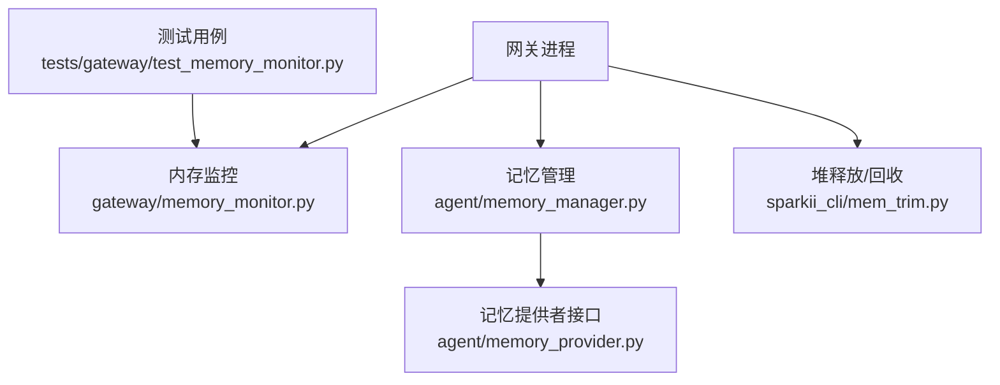
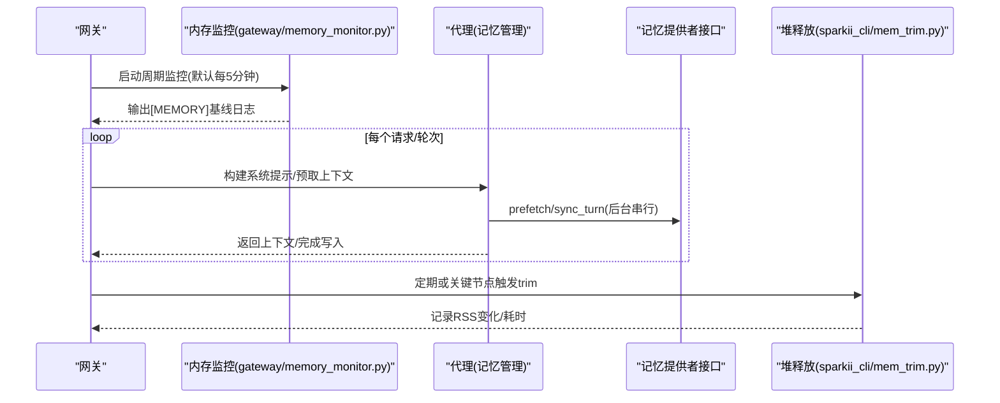
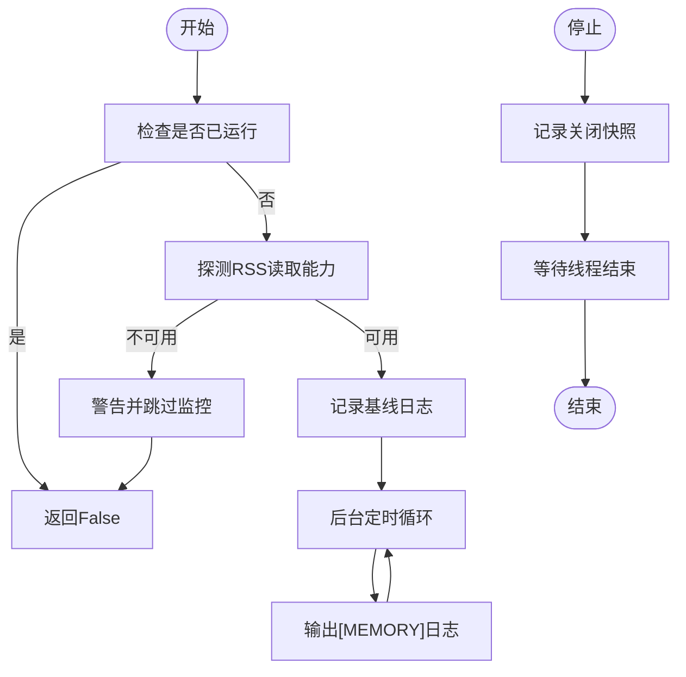
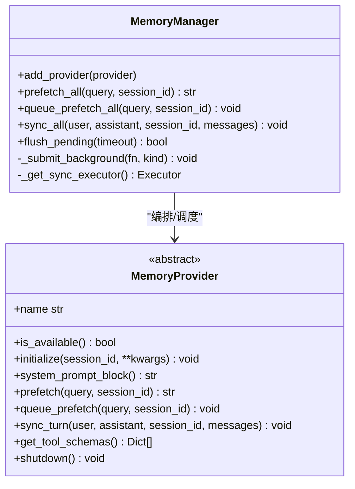
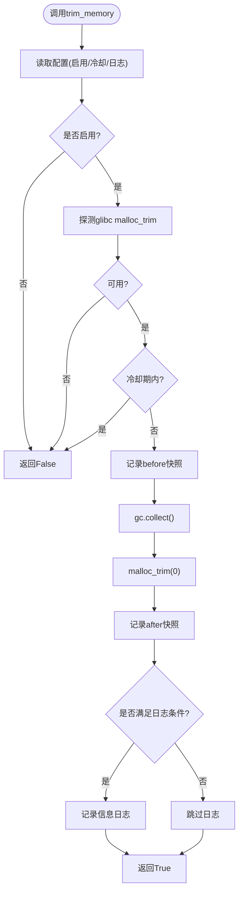
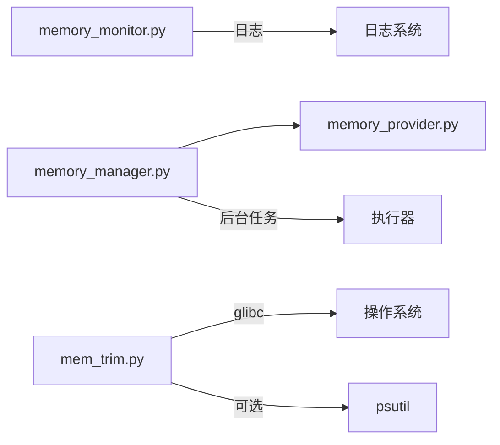

# 内存泄漏检测

<cite>
**本文引用的文件**
- [gateway/memory_monitor.py](file://gateway/memory_monitor.py)
- [agent/memory_manager.py](file://agent/memory_manager.py)
- [agent/memory_provider.py](file://agent/memory_provider.py)
- [sparkii_cli/mem_trim.py](file://sparkii_cli/mem_trim.py)
- [tests/gateway/test_memory_monitor.py](file://tests/gateway/test_memory_monitor.py)
</cite>

## 目录
1. [简介](#简介)
2. [项目结构](#项目结构)
3. [核心组件](#核心组件)
4. [架构总览](#架构总览)
5. [详细组件分析](#详细组件分析)
6. [依赖关系分析](#依赖关系分析)
7. [性能考量](#性能考量)
8. [故障排查指南](#故障排查指南)
9. [结论](#结论)
10. [附录](#附录)

## 简介
本指南面向长期运行的网关与代理进程，聚焦如何识别、定位并修复内存泄漏。内容涵盖：
- 常见泄漏迹象：内存持续增长、进程崩溃、性能下降
- 内存分析工具与实践：内存快照对比、对象引用分析、垃圾回收监控
- 常见泄漏场景与修复：未释放的文件句柄、循环引用、缓存无限增长等
- 监控与告警配置：基于日志的指标采集与阈值告警
- 优化最佳实践与代码审查要点

## 项目结构
本项目在“网关”和“代理”两个层面提供内存观测与治理：
- 网关侧：周期性记录进程 RSS、GC 计数、线程数，便于发现缓慢泄漏
- 代理侧：统一的记忆提供者编排，避免资源膨胀与阻塞导致的“假性泄漏”
- CLI 侧：在 Linux/glibc 上按需触发堆释放（malloc_trim），配合 GC 降低驻留内存

图表来源
- [gateway/memory_monitor.py:1-231](file://gateway/memory_monitor.py#L1-L231)
- [agent/memory_manager.py:1-800](file://agent/memory_manager.py#L1-L800)
- [agent/memory_provider.py:1-358](file://agent/memory_provider.py#L1-L358)
- [sparkii_cli/mem_trim.py:1-256](file://sparkii_cli/mem_trim.py#L1-L256)
- [tests/gateway/test_memory_monitor.py:1-70](file://tests/gateway/test_memory_monitor.py#L1-L70)

章节来源
- [gateway/memory_monitor.py:1-231](file://gateway/memory_monitor.py#L1-L231)
- [agent/memory_manager.py:1-800](file://agent/memory_manager.py#L1-L800)
- [agent/memory_provider.py:1-358](file://agent/memory_provider.py#L1-L358)
- [sparkii_cli/mem_trim.py:1-256](file://sparkii_cli/mem_trim.py#L1-L256)
- [tests/gateway/test_memory_monitor.py:1-70](file://tests/gateway/test_memory_monitor.py#L1-L70)

## 核心组件
- 网关内存监控器：以固定间隔输出结构化日志行，包含 RSS、GC 计数、线程数、运行时长，支持基线与关闭时快照
- 记忆管理器：统一编排内置与外部记忆提供者，限制仅一个外部提供者，后台串行化写入，防止慢/卡死提供者拖垮主流程
- 记忆提供者抽象：定义生命周期钩子（初始化、预取、同步、工具暴露、会话切换、压缩前处理等）
- 堆释放工具：在 Linux/glibc 上调用 malloc_trim 归还空闲页，配合 gc.collect 降低驻留内存；具备冷却、限频与可观测日志

章节来源
- [gateway/memory_monitor.py:1-231](file://gateway/memory_monitor.py#L1-L231)
- [agent/memory_manager.py:1-800](file://agent/memory_manager.py#L1-L800)
- [agent/memory_provider.py:1-358](file://agent/memory_provider.py#L1-L358)
- [sparkii_cli/mem_trim.py:1-256](file://sparkii_cli/mem_trim.py#L1-L256)

## 架构总览
下图展示从启动到运行期的内存观测与回收路径：

图表来源
- [gateway/memory_monitor.py:139-193](file://gateway/memory_monitor.py#L139-L193)
- [agent/memory_manager.py:525-694](file://agent/memory_manager.py#L525-L694)
- [agent/memory_provider.py:132-191](file://agent/memory_provider.py#L132-L191)
- [sparkii_cli/mem_trim.py:169-256](file://sparkii_cli/mem_trim.py#L169-L256)

## 详细组件分析

### 网关内存监控器（gateway/memory_monitor.py）
- 功能要点
  - 使用 resource.getrusage 优先获取 RSS，回退到 psutil
  - 输出单行结构化日志：rss、gc计数、线程数、运行时长
  - 启动即记录基线，停止时记录关闭快照
  - 后台守护线程，不阻塞进程退出
- 关键行为
  - start_memory_monitoring：校验能力、记录基线、启动定时器
  - log_memory_usage：收集指标并输出
  - stop_memory_monitoring：记录关闭快照、优雅停止线程
- 适用场景
  - 长时间运行的网关进程，用于发现缓慢增长的内存占用

图表来源
- [gateway/memory_monitor.py:139-231](file://gateway/memory_monitor.py#L139-L231)

章节来源
- [gateway/memory_monitor.py:1-231](file://gateway/memory_monitor.py#L1-L231)
- [tests/gateway/test_memory_monitor.py:1-70](file://tests/gateway/test_memory_monitor.py#L1-L70)

### 记忆管理器（agent/memory_manager.py）
- 设计目标
  - 统一注册与管理记忆提供者，限制仅一个外部提供者，避免工具 schema 膨胀与冲突
  - 将慢/阻塞的 provider 写入与预取放入后台，保证主流程不被拖垮
  - 通过单工作线程串行化写操作，确保顺序性与可恢复性
- 关键方法
  - add_provider：注册提供者，过滤保留的核心工具名，避免覆盖
  - prefetch_all/_prefetch_provider：并行/超时控制的外部预取
  - queue_prefetch_all/sync_all：后台队列化预取与同步
  - _submit_background/_get_sync_executor：懒创建单 worker 执行器，跟踪 Future 生命周期
  - flush_pending：等待队列排空，用于边界点一致性
- 风险点与防护
  - 外部 provider 可能阻塞网络/守护进程，采用超时与后台隔离
  - 关闭期拒绝新任务，避免悬挂任务导致进程无法退出

图表来源
- [agent/memory_manager.py:364-800](file://agent/memory_manager.py#L364-L800)
- [agent/memory_provider.py:81-191](file://agent/memory_provider.py#L81-L191)

章节来源
- [agent/memory_manager.py:1-800](file://agent/memory_manager.py#L1-L800)
- [agent/memory_provider.py:1-358](file://agent/memory_provider.py#L1-L358)

### 堆释放工具（sparkii_cli/mem_trim.py）
- 功能要点
  - 在 Linux/glibc 上调用 malloc_trim 归还空闲页，配合 gc.collect 降低驻留内存
  - 支持冷却时间、限频日志、最小增量阈值才记录信息日志
  - 失败安全：不支持平台或异常时直接返回 False，不影响调用方
- 关键流程
  - trim_memory：读取配置、探测 glibc、冷却判断、gc.collect、调用 malloc_trim、记录前后快照
  - collect_memory_snapshot：轻量级进程内存遥测（VmRSS/RssAnon/线程数）
- 适用场景
  - 长驻进程在批量关闭/清理阶段主动释放堆页，减少 OOM 风险

图表来源
- [sparkii_cli/mem_trim.py:169-256](file://sparkii_cli/mem_trim.py#L169-L256)

章节来源
- [sparkii_cli/mem_trim.py:1-256](file://sparkii_cli/mem_trim.py#L1-L256)

## 依赖关系分析
- 模块耦合
  - memory_monitor 独立于业务逻辑，仅依赖标准库与可选 psutil
  - memory_manager 依赖 memory_provider 抽象，屏蔽具体实现差异
  - mem_trim 与上层无强耦合，作为可插拔的释放手段
- 外部依赖
  - psutil：仅在 resource 不可用时回退
  - glibc：Linux 下通过 ctypes 动态加载 malloc_trim
- 潜在环路与风险
  - memory_manager 对 provider 的调用被隔离在后台线程，避免反向阻塞
  - 所有监控/释放操作均做异常保护，不会导致主流程崩溃

图表来源
- [gateway/memory_monitor.py:1-231](file://gateway/memory_monitor.py#L1-L231)
- [agent/memory_manager.py:1-800](file://agent/memory_manager.py#L1-L800)
- [agent/memory_provider.py:1-358](file://agent/memory_provider.py#L1-L358)
- [sparkii_cli/mem_trim.py:1-256](file://sparkii_cli/mem_trim.py#L1-L256)

章节来源
- [gateway/memory_monitor.py:1-231](file://gateway/memory_monitor.py#L1-L231)
- [agent/memory_manager.py:1-800](file://agent/memory_manager.py#L1-L800)
- [agent/memory_provider.py:1-358](file://agent/memory_provider.py#L1-L358)
- [sparkii_cli/mem_trim.py:1-256](file://sparkii_cli/mem_trim.py#L1-L256)

## 性能考量
- 监控开销
  - 内存监控为守护线程，低开销；日志格式固定，便于 grep
  - 建议合理设置间隔，避免过密日志影响 I/O
- 回收代价
  - gc.collect 与 malloc_trim 有 CPU/延迟成本，需结合冷却与限频策略
  - 在批量关闭或空闲时段触发更合适
- 并发与顺序
  - 记忆写入串行化，避免竞争与乱序；外部预取带超时，防止阻塞

章节来源
- [gateway/memory_monitor.py:139-193](file://gateway/memory_monitor.py#L139-L193)
- [agent/memory_manager.py:698-757](file://agent/memory_manager.py#L698-L757)
- [sparkii_cli/mem_trim.py:169-256](file://sparkii_cli/mem_trim.py#L169-L256)

## 故障排查指南
- 如何识别内存泄漏迹象
  - 观察日志中的 RSS 趋势：若持续上升且不回落，可能存在泄漏
  - 关注线程数与 GC 计数：线程数异常增长可能暗示线程泄漏；GC 频繁但内存不降可能暗示对象仍被引用
  - 性能下降：响应变慢、CPU 升高，可能是 GC 压力增大或锁竞争
- 如何使用现有工具
  - 内存快照对比：利用 mem_trim 的 before/after 快照，比较 VmRSS/RssAnon 变化
  - 对象引用分析：结合 Python 调试工具（如 objgraph、tracemalloc）定位强引用链
  - 垃圾回收监控：通过日志中的 gc 计数与 RSS 曲线判断回收效果
- 常见泄漏场景与修复建议
  - 未释放的文件句柄/连接：确保在 finally/with 中关闭；在 provider shutdown 中显式释放
  - 循环引用：避免持有父/子双向强引用；必要时使用弱引用或解绑
  - 缓存无限增长：增加上限、LRU/TTL、定期清理；对外部缓存设置过期策略
  - 后台任务堆积：检查队列大小与消费者速率；必要时限流或丢弃旧任务
- 监控与告警配置
  - 基于日志的阈值告警：当连续 N 条 [MEMORY] 日志显示 RSS 超过阈值则告警
  - 关键事件告警：关闭快照 RSS 高于基线一定比例时告警
  - 指标导出：可将 RSS/GC/线程数接入监控系统（Prometheus/OTLP）进行可视化与告警

章节来源
- [gateway/memory_monitor.py:83-127](file://gateway/memory_monitor.py#L83-L127)
- [sparkii_cli/mem_trim.py:106-146](file://sparkii_cli/mem_trim.py#L106-L146)
- [tests/gateway/test_memory_monitor.py:26-67](file://tests/gateway/test_memory_monitor.py#L26-L67)

## 结论
- 本项目提供了完善的内存观测与回收基础设施：网关侧周期性 RSS 监控、代理侧安全的后台写入、CLI 侧的堆释放能力
- 通过合理的监控、告警与回收策略，可有效识别并缓解内存泄漏带来的问题
- 建议在新增功能时遵循“可观测、可回收、可降级”的原则，并在代码审查中重点关注资源生命周期与并发安全

## 附录
- 快速上手
  - 启动网关后确认 [MEMORY] 基线日志出现
  - 在关键节点调用 trim_memory(reason="...") 触发堆释放
  - 结合日志与监控平台设置 RSS 阈值告警
- 参考实现路径
  - 网关内存监控：[gateway/memory_monitor.py](file://gateway/memory_monitor.py)
  - 记忆管理编排：[agent/memory_manager.py](file://agent/memory_manager.py)
  - 记忆提供者接口：[agent/memory_provider.py](file://agent/memory_provider.py)
  - 堆释放工具：[sparkii_cli/mem_trim.py](file://sparkii_cli/mem_trim.py)
  - 单元测试参考：[tests/gateway/test_memory_monitor.py](file://tests/gateway/test_memory_monitor.py)