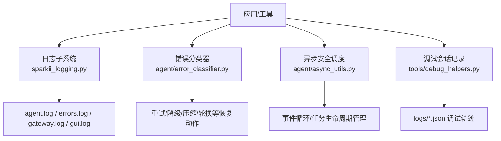
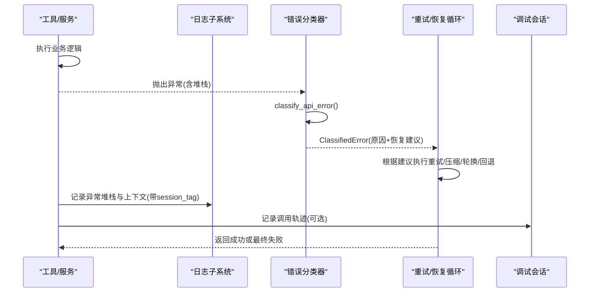
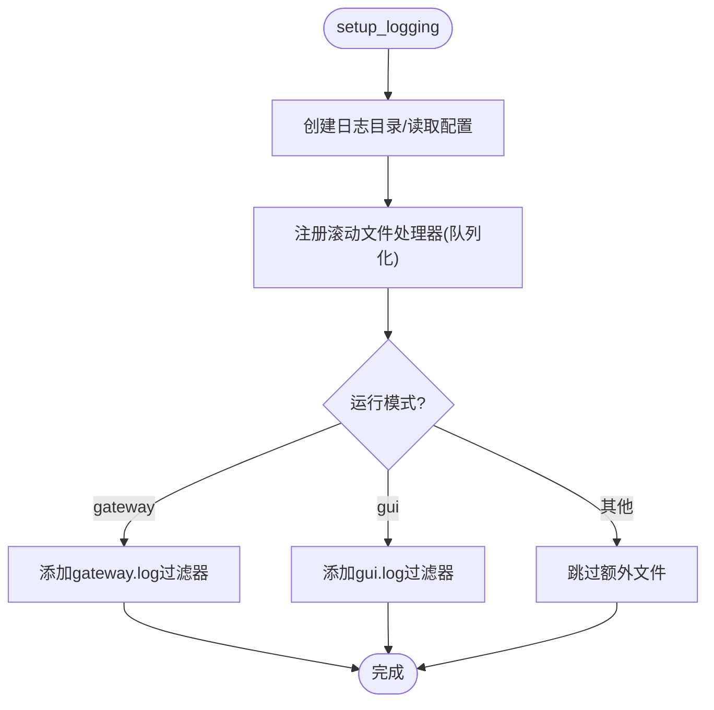
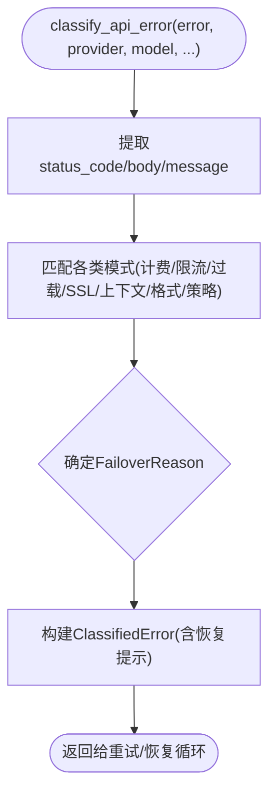
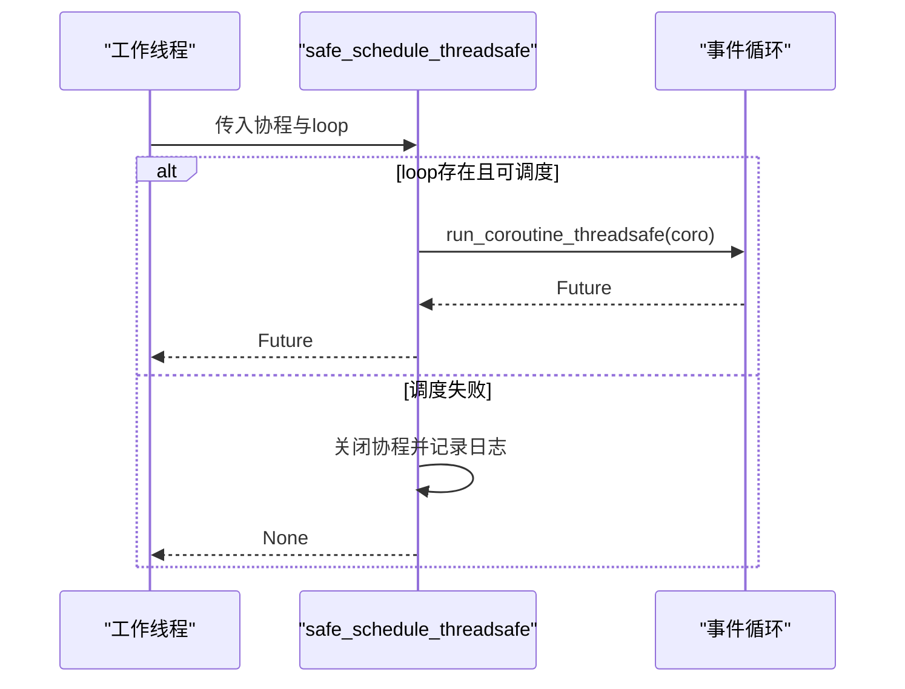
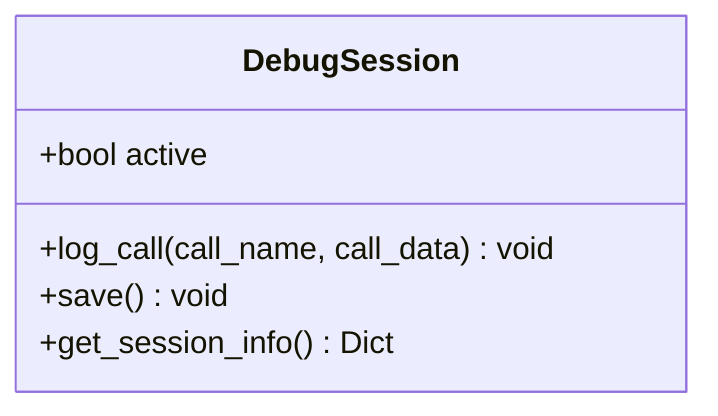
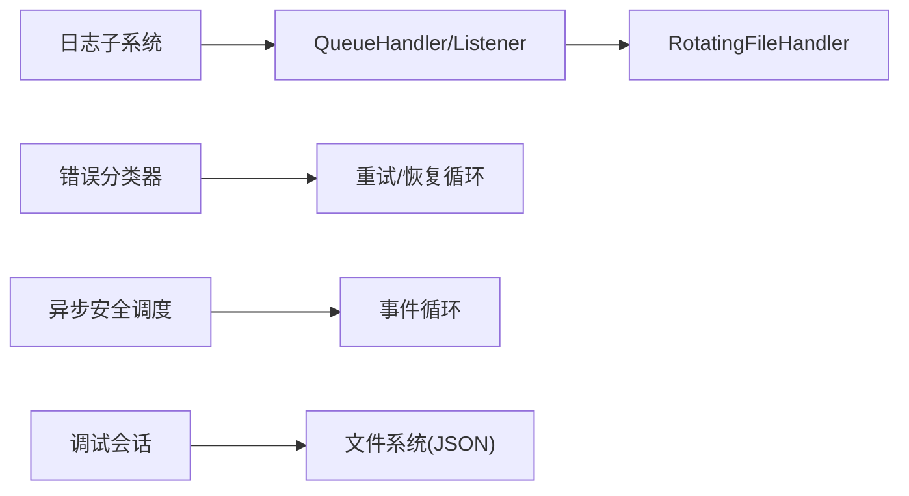

# 堆栈跟踪分析

<cite>
**本文引用的文件**
- [sparkii_logging.py](file://sparkii_logging.py)
- [agent/errors.py](file://agent/errors.py)
- [agent/error_classifier.py](file://agent/error_classifier.py)
- [agent/async_utils.py](file://agent/async_utils.py)
- [tools/debug_helpers.py](file://tools/debug_helpers.py)
</cite>

## 目录
1. [简介](#简介)
2. [项目结构](#项目结构)
3. [核心组件](#核心组件)
4. [架构总览](#架构总览)
5. [详细组件分析](#详细组件分析)
6. [依赖关系分析](#依赖关系分析)
7. [性能考量](#性能考量)
8. [故障排查指南](#故障排查指南)
9. [结论](#结论)
10. [附录](#附录)

## 简介
本指南面向在复杂系统中定位和解决Python异常问题的工程师，聚焦如何从堆栈跟踪中高效提取关键信息：异常类型、调用链与执行上下文。结合仓库中的日志系统、错误分类器、异步安全调度与调试会话工具，提供常见异常模式（如递归调用、资源竞争、超时）的识别与处置方法，并给出异步代码堆栈跟踪的分析要点与自动化报告思路。

## 项目结构
围绕“可观测性—错误分类—调试辅助”的主线，本项目提供了：
- 集中式日志与多进程安全写入（含Windows并发旋转处理），便于跨进程收集堆栈与上下文
- 结构化API错误分类体系，将原始异常映射为可执行的恢复策略
- 线程到事件循环的安全调度封装，避免协程泄漏与未等待警告
- 工具级调试会话记录，便于复现与回溯

**图表来源**
- [sparkii_logging.py:259-376](file://sparkii_logging.py#L259-L376)
- [agent/error_classifier.py:624-717](file://agent/error_classifier.py#L624-L717)
- [agent/async_utils.py:34-68](file://agent/async_utils.py#L34-L68)
- [tools/debug_helpers.py:36-105](file://tools/debug_helpers.py#L36-L105)

**章节来源**
- [sparkii_logging.py:1-800](file://sparkii_logging.py#L1-L800)
- [agent/error_classifier.py:1-800](file://agent/error_classifier.py#L1-L800)
- [agent/async_utils.py:1-85](file://agent/async_utils.py#L1-L85)
- [tools/debug_helpers.py:1-106](file://tools/debug_helpers.py#L1-L106)

## 核心组件
- 日志子系统：统一入口、按组件分流、滚动文件、队列化写入、会话上下文注入，确保堆栈与上下文可追踪且不影响主循环
- 错误分类器：将异常与HTTP状态/消息体/传输层特征综合判断，输出可操作的恢复建议（重试、轮换、压缩、回退、中止）
- 异步安全调度：线程到事件循环调度的安全封装，失败时关闭协程避免泄漏；消费分离任务结果避免“未获取异常”噪音
- 调试会话：按工具开启的轻量JSON轨迹记录，便于复现问题与定位调用序列

**章节来源**
- [sparkii_logging.py:259-376](file://sparkii_logging.py#L259-L376)
- [agent/error_classifier.py:22-99](file://agent/error_classifier.py#L22-L99)
- [agent/async_utils.py:34-85](file://agent/async_utils.py#L34-L85)
- [tools/debug_helpers.py:36-105](file://tools/debug_helpers.py#L36-L105)

## 架构总览
下图展示一次典型异常从发生到被捕获、分类、落盘与上报的流程，体现堆栈跟踪在各环节的作用。

**图表来源**
- [agent/error_classifier.py:624-717](file://agent/error_classifier.py#L624-L717)
- [sparkii_logging.py:165-212](file://sparkii_logging.py#L165-L212)
- [tools/debug_helpers.py:60-105](file://tools/debug_helpers.py#L60-L105)

## 详细组件分析

### 日志子系统：堆栈与上下文的可靠落盘
- 多文件分流：agent.log（全量）、errors.log（告警及以上）、gateway.log/gui.log（按组件前缀过滤）
- 会话上下文：通过线程本地存储注入session_tag，便于同一会话的多进程日志关联
- 异步队列化写入：避免事件循环阻塞于文件I/O或跨进程锁等待
- Windows并发旋转保护：屏蔽concurrent-log-handler锁超时导致的traceback噪音

**图表来源**
- [sparkii_logging.py:259-376](file://sparkii_logging.py#L259-L376)
- [sparkii_logging.py:575-644](file://sparkii_logging.py#L575-L644)

**章节来源**
- [sparkii_logging.py:1-800](file://sparkii_logging.py#L1-L800)

### 错误分类器：从堆栈到可执行恢复策略
- 输入：异常对象、provider/model、近似token数、上下文长度等
- 输出：结构化分类结果（reason、status_code、message、error_context）及恢复提示（retryable/should_compress/should_rotate_credential/should_fallback）
- 优先级：提供者特定模式 > HTTP状态+消息体 > 错误码 > 文本模式匹配 > SSL/TLS瞬态 > 服务端断开+大上下文 > 传输层启发 > 未知

**图表来源**
- [agent/error_classifier.py:624-717](file://agent/error_classifier.py#L624-L717)
- [agent/error_classifier.py:22-99](file://agent/error_classifier.py#L22-L99)

**章节来源**
- [agent/error_classifier.py:1-800](file://agent/error_classifier.py#L1-L800)

### 异步安全调度：避免协程泄漏与未等待警告
- safe_schedule_threadsafe：在线程侧将协程安全投递到事件循环；若失败则关闭协程并返回None，避免“coroutine was never awaited”
- consume_detached_task_result：消费分离任务的异常而不传播取消，消除事件循环噪音

**图表来源**
- [agent/async_utils.py:34-68](file://agent/async_utils.py#L34-L68)

**章节来源**
- [agent/async_utils.py:1-85](file://agent/async_utils.py#L1-L85)

### 调试会话：工具级调用轨迹
- DebugSession：按环境变量开关，记录工具调用时间戳与参数摘要，结束时保存为JSON
- 适合定位外部依赖调用顺序、参数组合与失败点

**图表来源**
- [tools/debug_helpers.py:36-105](file://tools/debug_helpers.py#L36-L105)

**章节来源**
- [tools/debug_helpers.py:1-106](file://tools/debug_helpers.py#L1-L106)

### 自定义异常：领域语义明确
- 示例：SSL配置错误、空流错误、预设不存在等，便于快速识别问题域

**章节来源**
- [agent/errors.py:1-14](file://agent/errors.py#L1-L14)

## 依赖关系分析
- 日志子系统依赖路径：setup_logging → _add_rotating_handler → QueueListener/QueueHandler → RotatingFileHandler（Windows使用并发实现）
- 错误分类器被上层重试/恢复循环调用，决定后续行为
- 异步安全调度被多线程场景广泛使用，保障事件循环健壮性
- 调试会话独立于主流程，按需启用

**图表来源**
- [sparkii_logging.py:575-644](file://sparkii_logging.py#L575-L644)
- [agent/error_classifier.py:624-717](file://agent/error_classifier.py#L624-L717)
- [agent/async_utils.py:34-68](file://agent/async_utils.py#L34-L68)
- [tools/debug_helpers.py:60-105](file://tools/debug_helpers.py#L60-L105)

**章节来源**
- [sparkii_logging.py:259-376](file://sparkii_logging.py#L259-L376)
- [agent/error_classifier.py:624-717](file://agent/error_classifier.py#L624-L717)
- [agent/async_utils.py:34-68](file://agent/async_utils.py#L34-L68)
- [tools/debug_helpers.py:60-105](file://tools/debug_helpers.py#L60-L105)

## 性能考量
- 日志写入走队列与后台监听线程，避免事件循环阻塞与跨进程锁等待
- 滚动文件在Windows下使用并发实现，降低锁争用导致的traceback噪音
- 错误分类采用模式匹配与轻量计算，开销可控
- 调试会话仅在显式环境变量开启时生效，默认零开销

[本节为通用指导，不直接分析具体文件]

## 故障排查指南

### 如何解读堆栈跟踪
- 定位根因帧：自底向上找到首次抛出异常的函数与模块
- 关注异常类型与消息：结合错误分类器的模式列表，快速归类（如超时、限流、SSL证书验证失败、上下文溢出等）
- 利用session_tag：在同一会话内聚合多进程日志，还原完整调用链
- 检查变量状态：在根因帧附近查看入参、中间变量与外部依赖返回值

**章节来源**
- [sparkii_logging.py:165-212](file://sparkii_logging.py#L165-L212)
- [agent/error_classifier.py:500-619](file://agent/error_classifier.py#L500-L619)

### 常见异常模式与处置
- 递归调用：观察重复帧，限制深度或改为迭代；必要时增加防护断言
- 资源竞争：关注锁/文件句柄/连接池；确认是否由并发写入导致（参考日志并发旋转处理）
- 超时异常：区分网络超时与服务端过载；优先重试/退避，必要时切换模型或提供商
- SSL证书验证失败：立即失败并提示修复（不重试），避免浪费预算
- 上下文过大：触发压缩或裁剪；注意与限流/超时的区分

**章节来源**
- [sparkii_logging.py:415-547](file://sparkii_logging.py#L415-L547)
- [agent/error_classifier.py:103-320](file://agent/error_classifier.py#L103-L320)
- [agent/error_classifier.py:564-619](file://agent/error_classifier.py#L564-L619)

### 使用调试器深入分析
- 在根因帧设置断点，检查局部变量与调用栈
- 对异步代码：在await前后分别断点，确认任务取消与异常传播
- 结合调试会话：打开工具级DEBUG环境变量，导出JSON轨迹对比正常与异常路径

**章节来源**
- [tools/debug_helpers.py:36-105](file://tools/debug_helpers.py#L36-L105)

### 从堆栈中提取关键信息
- 变量状态：在异常帧查看入参与中间值，结合错误分类器的上下文字段（如approx_tokens、context_length）
- 线程信息：通过日志session_tag与线程ID关联跨线程/跨进程调用
- 外部依赖调用：借助调试会话与错误分类器的provider/model字段，定位上游响应与错误码

**章节来源**
- [sparkii_logging.py:165-212](file://sparkii_logging.py#L165-L212)
- [agent/error_classifier.py:77-99](file://agent/error_classifier.py#L77-L99)
- [tools/debug_helpers.py:60-105](file://tools/debug_helpers.py#L60-L105)

### 异步代码的堆栈跟踪分析
- 使用safe_schedule_threadsafe确保协程在调度失败时被关闭，避免“未等待”警告干扰定位
- 对分离任务使用consume_detached_task_result消费异常，防止事件循环噪音掩盖真实错误
- 在回调与任务完成处记录堆栈，结合session_tag串联异步链路

**章节来源**
- [agent/async_utils.py:34-85](file://agent/async_utils.py#L34-L85)

### 自动化分析与报告生成
- 采集：统一通过日志子系统输出errors.log与agent.log，包含完整堆栈与session_tag
- 分类：调用错误分类器对异常进行结构化标注，生成可机读的报告字段（reason、status_code、provider、model、message、error_context）
- 轨迹：对工具调用启用DebugSession，导出JSON用于时序分析
- 建议：基于分类结果自动生成重试/压缩/轮换/回退策略的执行计划，并记录决策依据

**章节来源**
- [sparkii_logging.py:259-376](file://sparkii_logging.py#L259-L376)
- [agent/error_classifier.py:624-717](file://agent/error_classifier.py#L624-L717)
- [tools/debug_helpers.py:60-105](file://tools/debug_helpers.py#L60-L105)

## 结论
通过统一的日志系统、结构化的错误分类与安全异步调度，配合工具级调试会话，可在复杂系统中快速定位异常根因、还原调用链与执行上下文，并自动推导合适的恢复策略。遵循本指南的方法论，可显著提升排障效率与系统稳定性。

## 附录
- 术语
  - session_tag：会话标识，附加到每条日志以便关联
  - FailoverReason：错误分类枚举，驱动恢复策略
  - ClassifiedError：结构化异常分类结果，含恢复提示
- 最佳实践
  - 始终在异常路径记录完整堆栈与上下文
  - 对异步任务做好取消与异常消费
  - 对高频外部调用开启调试会话以留存轨迹
  - 利用错误分类器减少人工判断成本

[本节为补充说明，不直接分析具体文件]