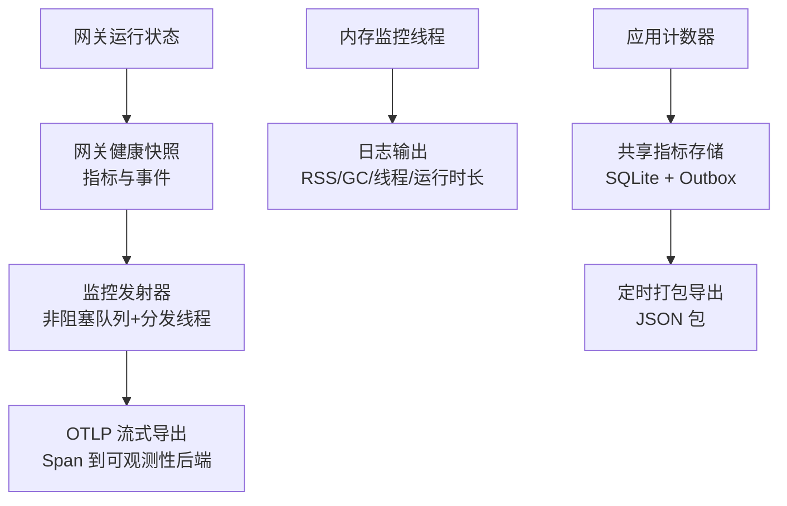
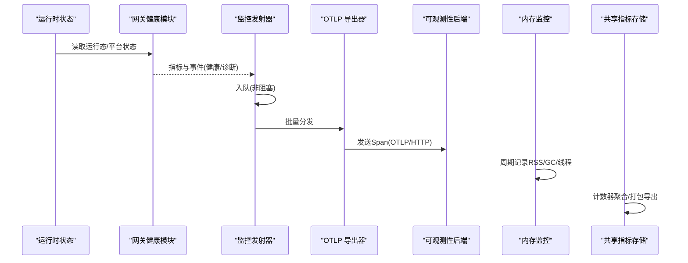
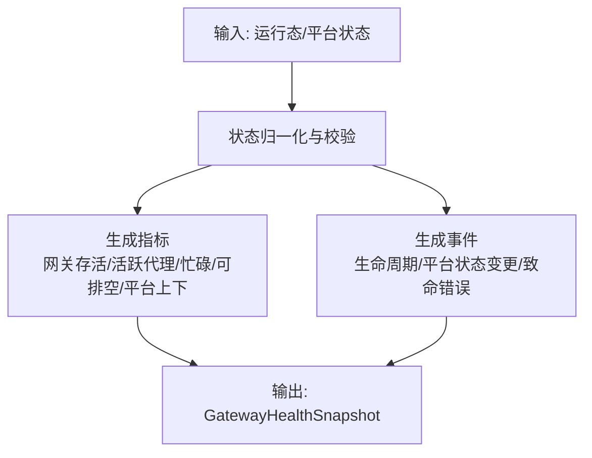
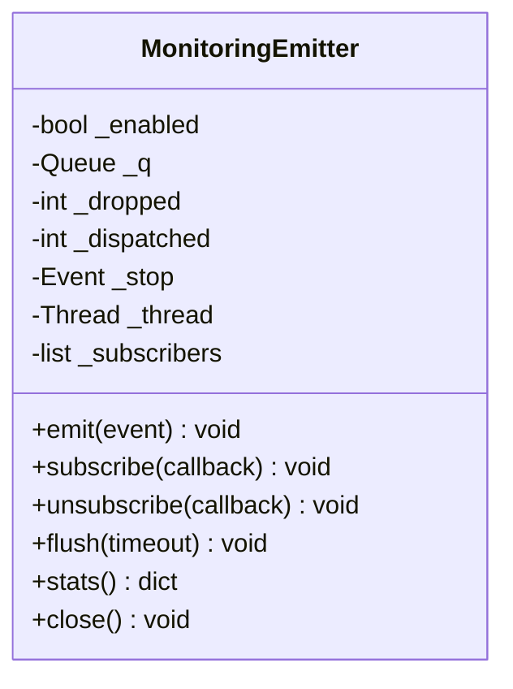
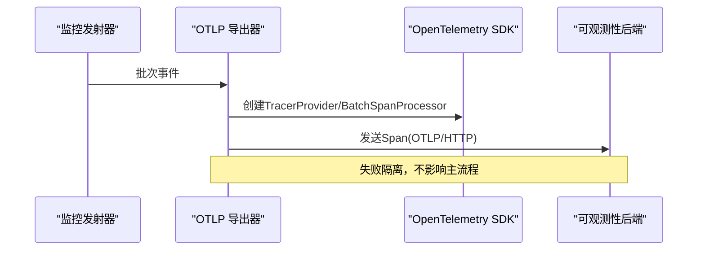
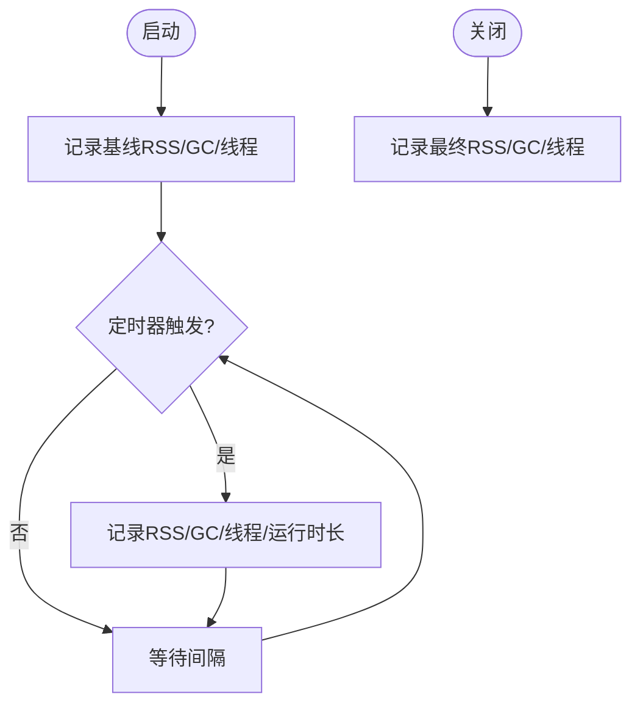
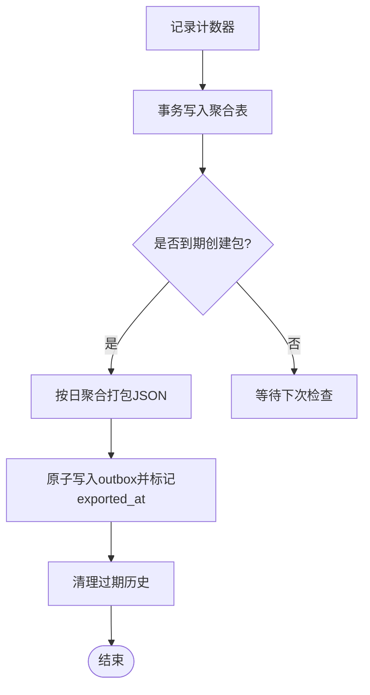
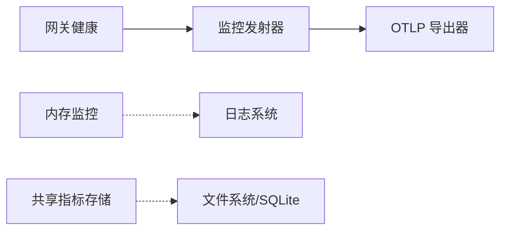

# 性能监控

<cite>
**本文引用的文件**
- [gateway_health.py](file://agent/monitoring/gateway_health.py)
- [emitter.py](file://agent/monitoring/emitter.py)
- [otlp_exporter.py](file://agent/monitoring/otlp_exporter.py)
- [memory_monitor.py](file://gateway/memory_monitor.py)
- [shared_metrics.py](file://sparkii_cli/observability/shared_metrics.py)
</cite>

## 目录
1. [简介](#简介)
2. [项目结构](#项目结构)
3. [核心组件](#核心组件)
4. [架构总览](#架构总览)
5. [详细组件分析](#详细组件分析)
6. [依赖关系分析](#依赖关系分析)
7. [性能考量](#性能考量)
8. [故障排查指南](#故障排查指南)
9. [结论](#结论)
10. [附录](#附录)

## 简介
本指南面向生产与运维团队，聚焦系统性能指标的含义、采集方法、基线与阈值告警设置、常见问题定位与优化策略、性能分析工具使用、负载均衡与水平扩展建议，以及性能测试与基准测试方法。内容基于仓库中已有的可观测性与监控实现进行说明，确保与实际代码一致且可直接落地。

## 项目结构
本项目在“可观测性”和“网关健康”两个层面提供性能监控能力：
- 网关健康与诊断事件：负责从运行时状态生成无敏感内容的指标与健康事件，并分类错误类型。
- 监控发射器：提供非阻塞的事件队列与后台分发线程，保证热路径零阻塞。
- OTLP 导出：将事件映射为 OpenTelemetry Span 并发送到外部可观测性后端。
- 内存监控：周期性记录进程 RSS、GC 计数与线程数，便于发现内存泄漏。
- 共享指标存储：本地持久化聚合计数器，按日打包导出，支持清理与幂等重放。

图表来源
- [gateway_health.py:210-291](file://agent/monitoring/gateway_health.py#L210-L291)
- [emitter.py:36-117](file://agent/monitoring/emitter.py#L36-L117)
- [otlp_exporter.py:107-133](file://agent/monitoring/otlp_exporter.py#L107-L133)
- [memory_monitor.py:139-193](file://gateway/memory_monitor.py#L139-L193)
- [shared_metrics.py:47-210](file://sparkii_cli/observability/shared_metrics.py#L47-L210)

章节来源
- [gateway_health.py:210-291](file://agent/monitoring/gateway_health.py#L210-L291)
- [emitter.py:36-117](file://agent/monitoring/emitter.py#L36-L117)
- [otlp_exporter.py:107-133](file://agent/monitoring/otlp_exporter.py#L107-L133)
- [memory_monitor.py:139-193](file://gateway/memory_monitor.py#L139-L193)
- [shared_metrics.py:47-210](file://sparkii_cli/observability/shared_metrics.py#L47-L210)

## 核心组件
- 网关健康快照：从运行时状态构建指标（如网关是否存活、活跃代理数、忙碌/可排空标志）与健康事件（生命周期变化、平台状态变更、致命错误）。
- 监控发射器：emit() 必须微秒级返回，不阻塞、不抛异常；内部使用固定容量环形队列与后台线程批量分发，失败隔离。
- OTLP 导出：将事件映射为 Span，支持可选依赖懒加载与环境变量头解析，具备可用性检查与启用开关。
- 内存监控：后台守护线程每 N 分钟记录一次 RSS、GC 计数、线程数与运行时长，启动时记录基线，关闭时记录最终值。
- 共享指标存储：以 SQLite 持久化计数器，按 UTC 日维度聚合，支持 outbox 打包导出与过期历史清理。

章节来源
- [gateway_health.py:210-291](file://agent/monitoring/gateway_health.py#L210-L291)
- [emitter.py:36-117](file://agent/monitoring/emitter.py#L36-L117)
- [otlp_exporter.py:107-133](file://agent/monitoring/otlp_exporter.py#L107-L133)
- [memory_monitor.py:139-193](file://gateway/memory_monitor.py#L139-L193)
- [shared_metrics.py:47-210](file://sparkii_cli/observability/shared_metrics.py#L47-L210)

## 架构总览
下图展示从运行时状态到可观测性后端的完整链路，包括内存监控与共享指标的独立路径。

图表来源
- [gateway_health.py:210-291](file://agent/monitoring/gateway_health.py#L210-L291)
- [emitter.py:53-117](file://agent/monitoring/emitter.py#L53-L117)
- [otlp_exporter.py:166-204](file://agent/monitoring/otlp_exporter.py#L166-L204)
- [memory_monitor.py:139-193](file://gateway/memory_monitor.py#L139-L193)
- [shared_metrics.py:199-210](file://sparkii_cli/observability/shared_metrics.py#L199-L210)

## 详细组件分析

### 网关健康与诊断事件
- 指标含义
  - 网关存活：布尔型，表示网关进程是否存活。
  - 活跃代理数：当前活跃的 agent 数量。
  - 忙碌/可排空：用于调度与扩缩容决策的负载信号。
  - 平台上下/降级：各平台子系统的可用性与降级状态。
- 事件含义
  - 生命周期事件：网关状态迁移（启动、停止、重启请求等）。
  - 平台状态变更：平台子系统状态变化与致命错误分类。
- 错误分类
  - 认证失败、速率限制、超时、网络错误、配置无效、启动失败、平台致命等。
- 数据脱敏
  - 对外导出的自由文本会经过统一脱敏函数并长度受限，避免泄露敏感信息。

图表来源
- [gateway_health.py:210-291](file://agent/monitoring/gateway_health.py#L210-L291)
- [gateway_health.py:70-124](file://agent/monitoring/gateway_health.py#L70-L124)

章节来源
- [gateway_health.py:210-291](file://agent/monitoring/gateway_health.py#L210-L291)
- [gateway_health.py:70-124](file://agent/monitoring/gateway_health.py#L70-L124)

### 监控发射器（非阻塞事件总线）
- 设计要点
  - emit() 必须微秒级返回，绝不阻塞或抛出异常。
  - 固定容量环形队列，满时丢弃最旧事件，保证内存可控。
  - 后台线程批量拉取并分发给订阅者（如 OTLP 导出器），单个订阅者失败不影响其他订阅者与热路径。
- 关键行为
  - 首次 emit 时启动分发线程。
  - flush() 可等待队列与飞行中批次完成。
  - stats() 暴露队列长度、已分发数、丢弃数与订阅者数量。

图表来源
- [emitter.py:36-117](file://agent/monitoring/emitter.py#L36-L117)
- [emitter.py:132-164](file://agent/monitoring/emitter.py#L132-L164)

章节来源
- [emitter.py:36-117](file://agent/monitoring/emitter.py#L36-L117)
- [emitter.py:132-164](file://agent/monitoring/emitter.py#L132-L164)

### OTLP 导出器（事件到 Span）
- 功能
  - 将监控事件映射为 OpenTelemetry Span，通过 HTTP 协议发送到配置的 OTLP 端点。
  - 支持可选依赖懒加载与环境变量头解析，具备可用性检查与启用开关。
- 关键流程
  - 构建 Provider/Processor，注册 BatchSpanProcessor。
  - 对每个事件提取白名单字段作为 Span 属性，并进行脱敏与长度限制。
  - 连续订阅模式：在发射器的分发线程中接收批次并批量发送。

图表来源
- [otlp_exporter.py:107-133](file://agent/monitoring/otlp_exporter.py#L107-L133)
- [otlp_exporter.py:166-204](file://agent/monitoring/otlp_exporter.py#L166-L204)

章节来源
- [otlp_exporter.py:107-133](file://agent/monitoring/otlp_exporter.py#L107-L133)
- [otlp_exporter.py:166-204](file://agent/monitoring/otlp_exporter.py#L166-L204)

### 内存监控（RSS/GC/线程）
- 目标
  - 长期运行的网关易出现缓慢内存增长，需通过时间序列发现泄漏。
- 机制
  - 后台守护线程每 N 分钟记录一次 RSS、GC 计数、线程数与运行时长。
  - 启动时记录基线，关闭时记录最终值，便于对比。
  - 优先使用标准库 resource，回退到 psutil；若均不可用则跳过监控并警告。
- 使用建议
  - 结合日志收集系统检索 “[MEMORY]” 行，绘制 RSS 趋势图。
  - 关注 GC 计数上升与线程数持续增长，辅助定位资源泄漏。

图表来源
- [memory_monitor.py:139-193](file://gateway/memory_monitor.py#L139-L193)
- [memory_monitor.py:196-224](file://gateway/memory_monitor.py#L196-L224)

章节来源
- [memory_monitor.py:139-193](file://gateway/memory_monitor.py#L139-L193)
- [memory_monitor.py:196-224](file://gateway/memory_monitor.py#L196-L224)

### 共享指标存储（计数器聚合与导出）
- 目标
  - 本地持久化聚合计数器，按 UTC 日维度统计，支持打包导出与过期清理。
- 机制
  - 使用 SQLite 存储聚合结果与 outbox 元数据。
  - 每日最多创建一个导出包，包含未打包的增量数据。
  - 导出后标记 exported_at，并按保留期清理历史。
- 适用场景
  - 客户端活跃度、模型调用路由等允许上报的计数器。
  - 离线分析与合规审计。

图表来源
- [shared_metrics.py:199-210](file://sparkii_cli/observability/shared_metrics.py#L199-L210)
- [shared_metrics.py:463-606](file://sparkii_cli/observability/shared_metrics.py#L463-L606)
- [shared_metrics.py:623-719](file://sparkii_cli/observability/shared_metrics.py#L623-L719)

章节来源
- [shared_metrics.py:199-210](file://sparkii_cli/observability/shared_metrics.py#L199-L210)
- [shared_metrics.py:463-606](file://sparkii_cli/observability/shared_metrics.py#L463-L606)
- [shared_metrics.py:623-719](file://sparkii_cli/observability/shared_metrics.py#L623-L719)

## 依赖关系分析
- 组件耦合
  - 网关健康模块依赖运行时状态与事件发射器。
  - 发射器与 OTLP 导出器通过订阅机制解耦，失败隔离。
  - 内存监控与共享指标存储为独立路径，互不影响。
- 外部依赖
  - OTLP 导出为可选依赖，按需懒加载，缺失时优雅降级。
  - 内存监控依赖 platform 标准库或可选 psutil。
- 潜在循环依赖
  - 通过延迟导入与回调接口避免循环引用。

图表来源
- [gateway_health.py:210-291](file://agent/monitoring/gateway_health.py#L210-L291)
- [emitter.py:36-117](file://agent/monitoring/emitter.py#L36-L117)
- [otlp_exporter.py:107-133](file://agent/monitoring/otlp_exporter.py#L107-L133)
- [memory_monitor.py:139-193](file://gateway/memory_monitor.py#L139-L193)
- [shared_metrics.py:47-210](file://sparkii_cli/observability/shared_metrics.py#L47-L210)

章节来源
- [gateway_health.py:210-291](file://agent/monitoring/gateway_health.py#L210-L291)
- [emitter.py:36-117](file://agent/monitoring/emitter.py#L36-L117)
- [otlp_exporter.py:107-133](file://agent/monitoring/otlp_exporter.py#L107-L133)
- [memory_monitor.py:139-193](file://gateway/memory_monitor.py#L139-L193)
- [shared_metrics.py:47-210](file://sparkii_cli/observability/shared_metrics.py#L47-L210)

## 性能考量
- CPU 使用率
  - 监控发射器采用非阻塞队列与后台线程，热路径开销极低。
  - 建议观察 OTLP 批处理大小与网络往返，避免频繁小包导致 CPU 抖动。
- 内存占用
  - 使用内存监控模块追踪 RSS 趋势，识别缓慢泄漏。
  - 关注 GC 计数与线程数，定位对象持有与线程泄漏。
- 网络带宽
  - OTLP 导出为批量发送，合理调整批大小与刷新间隔以降低带宽峰值。
  - 使用环境变量注入鉴权头，避免在配置中明文存放密钥。
- 磁盘 I/O
  - 共享指标存储使用 SQLite 与原子 JSON 写入，注意磁盘空间与保留期清理。
  - 定期评估 outbox 目录与数据库体积，避免磁盘耗尽。

[本节为通用指导，不直接分析具体文件]

## 故障排查指南
- 内存泄漏
  - 现象：RSS 持续上升，GC 计数增加但回收效果有限。
  - 步骤：查看 “[MEMORY]” 日志的时间序列，结合 GC 与线程数判断；必要时缩短采样间隔复现问题。
  - 参考：内存监控模块的基线与关闭快照。
- 连接池耗尽
  - 现象：请求排队、超时增多，平台状态出现降级或错误。
  - 步骤：检查网关健康事件中的平台状态与错误分类；结合 OTLP 事件定位具体平台。
- 数据库查询慢
  - 现象：共享指标存储写入变慢或打包延迟。
  - 步骤：检查 SQLite busy_timeout 与并发写入；确认 outbox 导出是否卡住。
- OTLP 导出失败
  - 现象：无法连接到可观测性后端或缺少可选依赖。
  - 步骤：确认 enabled 与 endpoint 配置；检查环境变量头是否正确；验证 SDK 是否可用。

章节来源
- [memory_monitor.py:139-193](file://gateway/memory_monitor.py#L139-L193)
- [gateway_health.py:70-124](file://agent/monitoring/gateway_health.py#L70-L124)
- [shared_metrics.py:266-282](file://sparkii_cli/observability/shared_metrics.py#L266-L282)
- [otlp_exporter.py:218-230](file://agent/monitoring/otlp_exporter.py#L218-L230)

## 结论
本项目提供了完善的性能监控基础能力：网关健康指标与事件、非阻塞事件总线、OTLP 导出、内存监控与共享指标存储。通过这些组件，可以建立稳定的性能基线与告警体系，快速定位常见性能问题，并为负载均衡与水平扩展提供可靠依据。建议在生产环境开启 OTLP 导出与内存监控，结合日志与指标系统进行可视化与告警。

[本节为总结，不直接分析具体文件]

## 附录

### 指标与告警建议
- CPU 使用率
  - 基线：在典型负载下采集一段时间的平均与 P95 值。
  - 阈值：超过基线的 80% 持续 5 分钟触发预警，超过 95% 触发严重告警。
- 内存占用
  - 基线：启动后的稳定 RSS 均值。
  - 阈值：RSS 较基线增长超过 20% 持续 10 分钟预警，超过 50% 严重告警。
- 网络带宽
  - 基线：正常流量下的上行/下行带宽。
  - 阈值：突发超过基线 2 倍持续 1 分钟预警，超过 5 倍严重告警。
- 磁盘 I/O
  - 基线：IOPS 与吞吐量的日常分布。
  - 阈值：IOPS 或吞吐超过基线 2 倍持续 5 分钟预警，超过 5 倍严重告警。

[本节为通用指导，不直接分析具体文件]

### 性能测试与基准测试方法
- 压测场景
  - 高并发会话：模拟大量并发请求，观察网关忙碌标志与平台状态。
  - 长时运行：持续运行 24-72 小时，观察 RSS 与 GC 趋势。
- 指标采集
  - 使用 OTLP 导出到可观测性后端，构建仪表盘与告警规则。
  - 结合内存监控日志，绘制 RSS 时间序列。
- 基准指标
  - 响应时延（P50/P95/P99）、吞吐（QPS）、错误率、资源利用率。
- 回归检测
  - 每次发布前执行相同压测脚本，对比关键指标是否退化。

[本节为通用指导，不直接分析具体文件]

### 负载均衡与水平扩展建议
- 水平扩展
  - 基于网关忙碌标志与活跃代理数进行自动扩缩容。
  - 多实例部署时，确保共享指标存储与 OTLP 后端具备足够容量。
- 负载均衡
  - 入口层根据实例健康状态与负载动态分配流量。
  - 对平台子系统故障进行快速摘除与恢复。
- 弹性策略
  - 冷启动预热：新实例启动后先消化部分流量，避免雪崩。
  - 优雅停机：在排空状态下下线实例，减少中断。

[本节为通用指导，不直接分析具体文件]