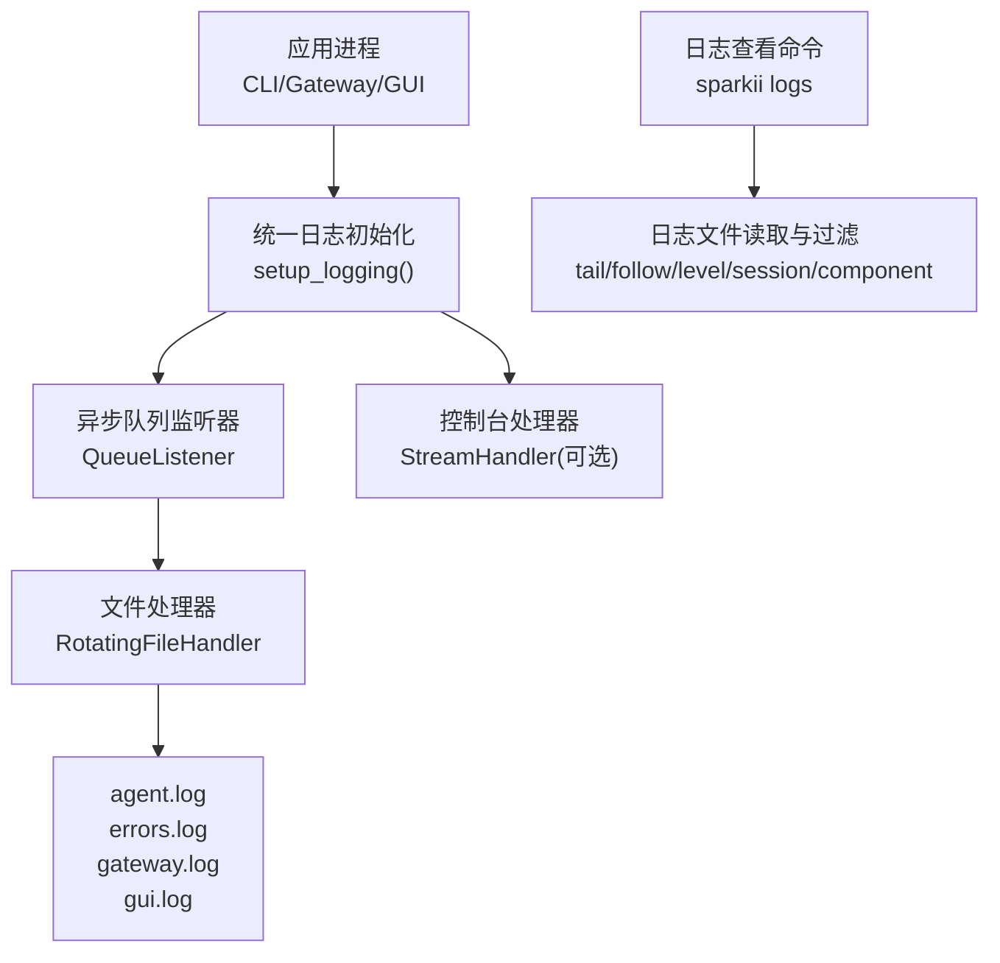
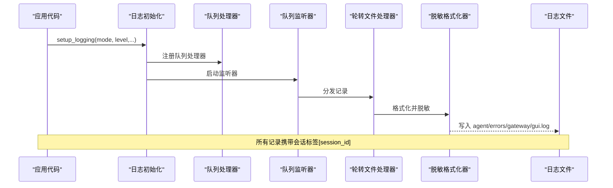
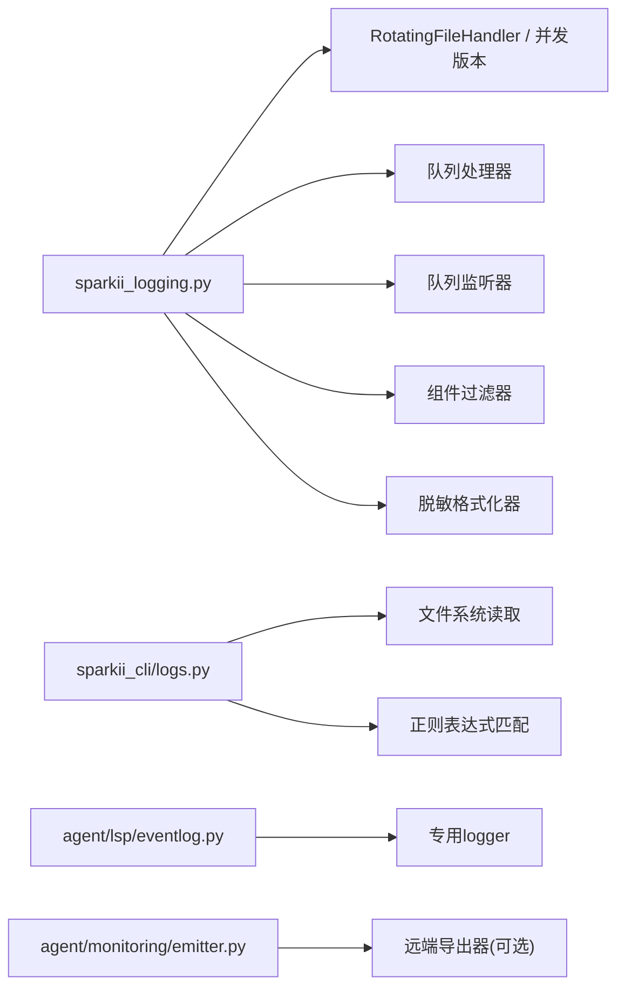

# 日志分析

<cite>
**本文引用的文件**
- [sparkii_logging.py](file://sparkii_logging.py)
- [logs.py](file://sparkii_cli/logs.py)
- [subcommands/logs.py](file://sparkii_cli/subcommands/logs.py)
- [redact.py](file://agent/redact.py)
- [eventlog.py](file://agent/lsp/eventlog.py)
- [emitter.py](file://agent/monitoring/emitter.py)
</cite>

## 目录
1. [简介](#简介)
2. [项目结构](#项目结构)
3. [核心组件](#核心组件)
4. [架构总览](#架构总览)
5. [详细组件分析](#详细组件分析)
6. [依赖关系分析](#依赖关系分析)
7. [性能注意事项](#性能注意事项)
8. [故障排查指南](#故障排查指南)
9. [结论](#结论)
10. [附录](#附录)

## 简介
本指南面向SparkiiDesktop的日志系统，系统性说明日志级别、输出格式、配置与路由、关键日志模式识别方法（AI代理对话、工具执行、网络请求等）、时间戳与会话关联、错误堆栈解读，以及自动化分析与性能监控技巧。文档基于仓库中的日志基础设施与CLI工具实现，提供可操作的排障与优化建议。

## 项目结构
SparkiiDesktop将日志能力集中在统一的初始化模块中，并通过命令行工具提供查看与过滤能力；同时为特定子系统（如LSP）提供结构化、降噪的日志接口。

图表来源
- [sparkii_logging.py:259-376](file://sparkii_logging.py#L259-L376)
- [sparkii_logging.py:575-644](file://sparkii_logging.py#L575-L644)
- [sparkii_logging.py:721-759](file://sparkii_logging.py#L721-L759)
- [logs.py:145-253](file://sparkii_cli/logs.py#L145-L253)

章节来源
- [sparkii_logging.py:1-800](file://sparkii_logging.py#L1-L800)
- [logs.py:1-398](file://sparkii_cli/logs.py#L1-L398)

## 核心组件
- 统一日志初始化：集中创建并管理日志文件、级别、轮转策略、组件路由与敏感信息脱敏。
- 会话上下文注入：通过全局记录工厂在每条日志中附加会话标签，便于按会话过滤与关联。
- 异步文件写入：使用队列+监听器避免事件循环阻塞与跨进程锁竞争。
- 组件过滤器：将不同子系统日志路由到对应文件（gateway.log、gui.log）。
- 日志查看工具：支持按级别、会话、组件、时间范围筛选与实时跟随。
- LSP结构化日志：针对高频事件进行去重与分级，保持默认静默、按需可见。
- 监控发射器：非阻塞地发送遥测/指标/日志事件，不影响主流程。

章节来源
- [sparkii_logging.py:165-212](file://sparkii_logging.py#L165-L212)
- [sparkii_logging.py:219-252](file://sparkii_logging.py#L219-L252)
- [sparkii_logging.py:575-644](file://sparkii_logging.py#L575-L644)
- [logs.py:31-61](file://sparkii_cli/logs.py#L31-L61)
- [eventlog.py:1-37](file://agent/lsp/eventlog.py#L1-L37)
- [emitter.py:1-20](file://agent/monitoring/emitter.py#L1-L20)

## 架构总览
下图展示了从应用调用到最终落盘的关键路径，包括会话上下文注入、组件过滤、异步队列与轮转文件处理。

图表来源
- [sparkii_logging.py:259-376](file://sparkii_logging.py#L259-L376)
- [sparkii_logging.py:575-644](file://sparkii_logging.py#L575-L644)
- [sparkii_logging.py:721-759](file://sparkii_logging.py#L721-L759)
- [redact.py:1189-1198](file://agent/redact.py#L1189-L1198)

## 详细组件分析

### 日志级别与输出格式
- 级别定义与用途
  - DEBUG：调试细节，默认不进入主日志（可通过verbose开启控制台DEBUG）。
  - INFO：主要活动与状态转换，默认写入agent.log。
  - WARNING：需要关注的异常或失败，写入errors.log与agent.log。
  - ERROR/CRITICAL：严重错误，写入errors.log与agent.log。
- 输出格式
  - 标准格式包含时间戳、级别、可选会话标签、logger名与消息。
  - 详细格式用于控制台调试，时间精度更高。
- 脱敏
  - 所有文件处理器均使用脱敏格式化器，自动隐藏密钥、令牌、URL凭据等敏感信息。

章节来源
- [sparkii_logging.py:82-86](file://sparkii_logging.py#L82-L86)
- [sparkii_logging.py:320-362](file://sparkii_logging.py#L320-L362)
- [sparkii_logging.py:379-408](file://sparkii_logging.py#L379-L408)
- [redact.py:1189-1198](file://agent/redact.py#L1189-L1198)

### 日志目的地与路由
- 文件
  - agent.log：全量活动日志（INFO+）。
  - errors.log：仅警告及以上（WARNING+），快速定位问题。
  - gateway.log：仅网关组件（INFO+），由组件前缀过滤。
  - gui.log：仅GUI/TUI相关组件（INFO+），由组件前缀过滤。
- 控制台
  - 通过verbose模式添加StreamHandler输出到stderr，便于开发调试。
- 远程服务
  - 监控发射器提供非阻塞的事件发射通道，可对接OTLP导出器等远端消费者。

章节来源
- [sparkii_logging.py:320-362](file://sparkii_logging.py#L320-L362)
- [sparkii_logging.py:379-408](file://sparkii_logging.py#L379-L408)
- [emitter.py:1-20](file://agent/monitoring/emitter.py#L1-L20)

### 会话ID关联与时间戳
- 会话标签注入
  - 通过替换全局LogRecord工厂，在所有记录上注入session_tag字段，格式为“[session_id]”。
  - 可在会话开始时设置，结束时清理，确保线程隔离。
- 时间戳格式
  - 标准日志行以“YYYY-MM-DD HH:MM:SS”开头，CLI支持解析相对时间范围筛选。
- 错误堆栈跟踪
  - 通过logging.exception等API输出的堆栈会经过脱敏格式化器，安全落盘。

章节来源
- [sparkii_logging.py:165-212](file://sparkii_logging.py#L165-L212)
- [logs.py:43-61](file://sparkii_cli/logs.py#L43-L61)
- [redact.py:1189-1198](file://agent/redact.py#L1189-L1198)

### 关键日志模式识别
- AI代理对话日志
  - 关注包含会话标签的行，结合组件前缀“agent”、“run_agent”、“model_tools”定位对话生命周期。
- 工具执行日志
  - 组件前缀“tools”，常见于工具调用、结果分类与输出限制等场景。
- 网络请求日志
  - 第三方库（httpx、openai等）默认降级至WARNING以减少噪音；如需更细粒度，可临时调整其级别。
- LSP事件日志
  - 专用logger“sparkii.lint.lsp”，对高频事件进行去重与分级，默认静默，适合grep定位问题。

章节来源
- [sparkii_logging.py:234-252](file://sparkii_logging.py#L234-L252)
- [eventlog.py:1-37](file://agent/lsp/eventlog.py#L1-L37)
- [eventlog.py:45-57](file://agent/lsp/eventlog.py#L45-L57)

### 配置与使用示例
- 基础配置
  - 通过setup_logging传入mode、log_level、max_size_mb、backup_count等参数控制行为。
  - 可从配置文件读取logging.*项覆盖默认值。
- CLI查看与过滤
  - 支持按级别、会话、组件、时间范围筛选，并提供实时跟随。
  - 支持列出可用日志文件及其大小与最近修改时间。

章节来源
- [sparkii_logging.py:259-376](file://sparkii_logging.py#L259-L376)
- [sparkii_logging.py:762-800](file://sparkii_logging.py#L762-L800)
- [subcommands/logs.py:13-79](file://sparkii_cli/subcommands/logs.py#L13-L79)
- [logs.py:145-253](file://sparkii_cli/logs.py#L145-L253)

### 异步写入与跨进程轮转
- 异步队列
  - 所有文件处理器经队列转发，避免事件循环阻塞与跨进程锁竞争。
- Windows兼容
  - 使用并发轮转处理器解决Windows下文件句柄占用导致的旋转失败问题。
- 外部轮转检测
  - 自定义处理器在每次写入前检测inode变化，必要时重新打开文件，防止日志丢失。

章节来源
- [sparkii_logging.py:42-69](file://sparkii_logging.py#L42-L69)
- [sparkii_logging.py:575-644](file://sparkii_logging.py#L575-L644)
- [sparkii_logging.py:415-548](file://sparkii_logging.py#L415-L548)

## 依赖关系分析

图表来源
- [sparkii_logging.py:259-376](file://sparkii_logging.py#L259-L376)
- [sparkii_logging.py:575-644](file://sparkii_logging.py#L575-L644)
- [logs.py:145-253](file://sparkii_cli/logs.py#L145-L253)
- [eventlog.py:45-57](file://agent/lsp/eventlog.py#L45-L57)
- [emitter.py:1-20](file://agent/monitoring/emitter.py#L1-L20)

章节来源
- [sparkii_logging.py:259-376](file://sparkii_logging.py#L259-L376)
- [logs.py:145-253](file://sparkii_cli/logs.py#L145-L253)
- [eventlog.py:45-57](file://agent/lsp/eventlog.py#L45-L57)
- [emitter.py:1-20](file://agent/monitoring/emitter.py#L1-L20)

## 性能注意事项
- 异步写入
  - 文件I/O走独立线程队列，避免阻塞事件循环与WebSocket客户端。
- 轮转锁竞争
  - 使用并发轮转处理器降低跨进程锁等待风险；若出现锁超时，已做静默处理。
- 第三方日志降噪
  - 默认将高噪声库降级至WARNING，减少磁盘与CPU开销。
- 监控发射器
  - 非阻塞入队，满队丢弃最旧事件，保证热路径稳定。

章节来源
- [sparkii_logging.py:550-644](file://sparkii_logging.py#L550-L644)
- [sparkii_logging.py:142-158](file://sparkii_logging.py#L142-L158)
- [emitter.py:1-20](file://agent/monitoring/emitter.py#L1-L20)

## 故障排查指南
- 常见问题
  - 权限错误：无法访问日志目录或文件时，检查用户权限与组设置。
  - 文件被占用：Windows下可能出现轮转失败，确认无其他进程独占句柄。
  - 日志缺失：确认setup_logging已调用且mode正确；检查队列监听器是否启动。
- 定位步骤
  - 使用CLI按级别、会话、组件筛选，缩小范围。
  - 关注errors.log中的WARNING及以上条目。
  - 对LSP问题，使用专用logger名称进行grep。
- 恢复措施
  - 重启服务后重试；必要时清理损坏的日志文件并重建。
  - 调整日志级别或关闭非必要组件以降低噪音。

章节来源
- [logs.py:174-223](file://sparkii_cli/logs.py#L174-L223)
- [sparkii_logging.py:521-535](file://sparkii_logging.py#L521-L535)
- [eventlog.py:100-188](file://agent/lsp/eventlog.py#L100-L188)

## 结论
SparkiiDesktop的日志系统通过统一初始化、会话上下文注入、组件路由与异步写入，提供了高可靠、低噪音、易分析的日志能力。配合CLI工具与结构化日志接口，能够快速定位问题、追踪会话与评估性能。建议在生产环境中保持默认级别，仅在调试时提升详细度，并结合监控发射器进行远端观测。

## 附录

### 时间戳与会话关联
- 时间戳格式：YYYY-MM-DD HH:MM:SS（毫秒级可通过verbose模式观察）。
- 会话标签：每行包含[session_id]，便于按会话过滤与关联。
- 错误堆栈：通过exception API输出，经脱敏后安全落盘。

章节来源
- [sparkii_logging.py:82-86](file://sparkii_logging.py#L82-L86)
- [sparkii_logging.py:165-212](file://sparkii_logging.py#L165-L212)
- [logs.py:43-61](file://sparkii_cli/logs.py#L43-L61)

### 关键日志模式与正则匹配示例
- 时间戳提取
  - 正则：^(\d{4}-\d{2}-\d{2}\s+\d{2}:\d{2}:\d{2})
- 级别提取
  - 正则：\s(DEBUG|INFO|WARNING|ERROR|CRITICAL)\s
- Logger名提取
  - 正则：\s(?:DEBUG|INFO|WARNING|ERROR|CRITICAL)(?:\s+\[.*?\])?\s+(\S+):
- 组件过滤
  - 使用组件前缀集合进行匹配（gateway、agent、tools、cli、cron、gui）。

章节来源
- [logs.py:43-61](file://sparkii_cli/logs.py#L43-L61)
- [logs.py:100-142](file://sparkii_cli/logs.py#L100-L142)

### 自动化日志分析脚本思路
- 读取指定日志文件尾部N行。
- 应用级别、会话、组件、时间范围过滤。
- 统计错误率、响应时间分布（需结合业务日志字段）。
- 输出摘要与告警阈值触发。

章节来源
- [logs.py:256-338](file://sparkii_cli/logs.py#L256-L338)
- [logs.py:341-363](file://sparkii_cli/logs.py#L341-L363)

### 性能相关日志分析技巧
- 响应时间统计
  - 在工具调用与网络请求处记录耗时，聚合计算P50/P95/P99。
- 资源使用监控
  - 结合监控发射器上报CPU、内存、队列长度等指标。
- 热点识别
  - 通过组件前缀与logger名定位高频路径，评估是否需要缓存或限流。

章节来源
- [emitter.py:1-20](file://agent/monitoring/emitter.py#L1-L20)
- [sparkii_logging.py:142-158](file://sparkii_logging.py#L142-L158)