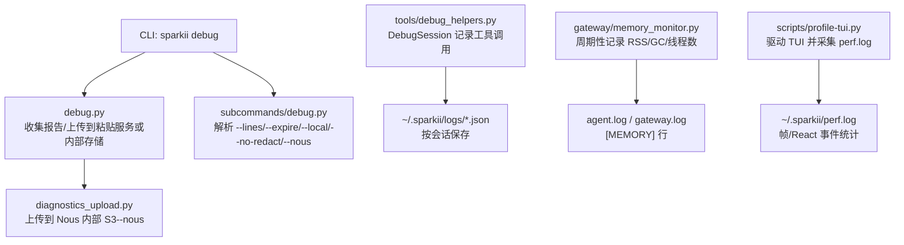
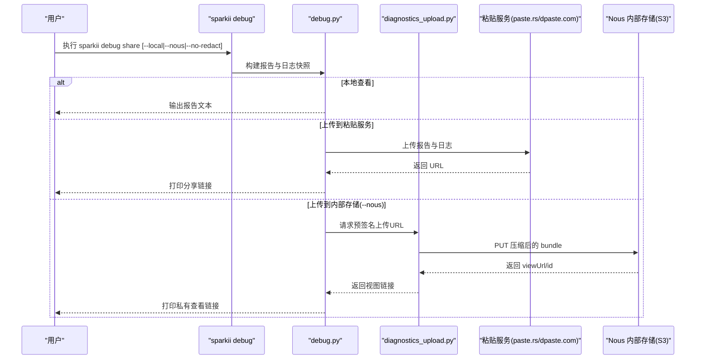
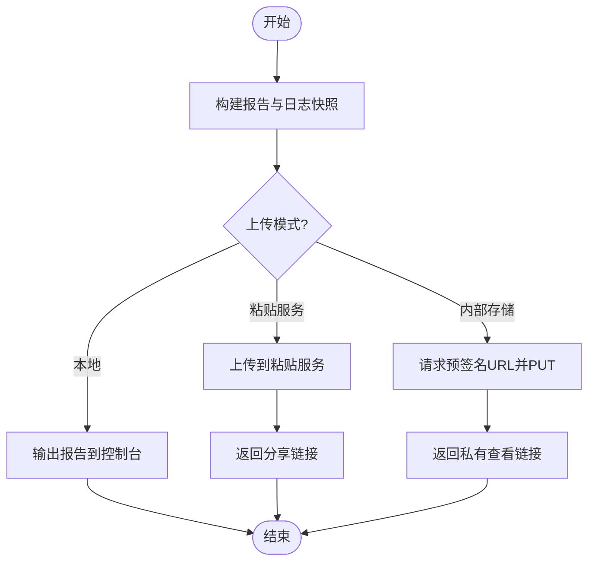
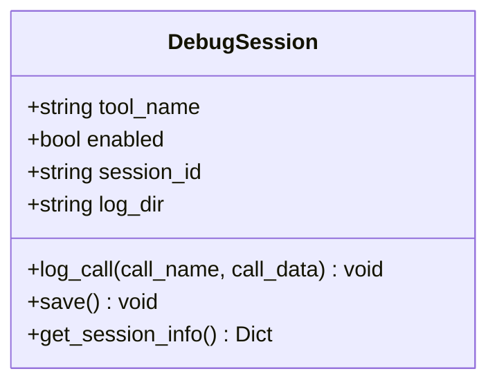
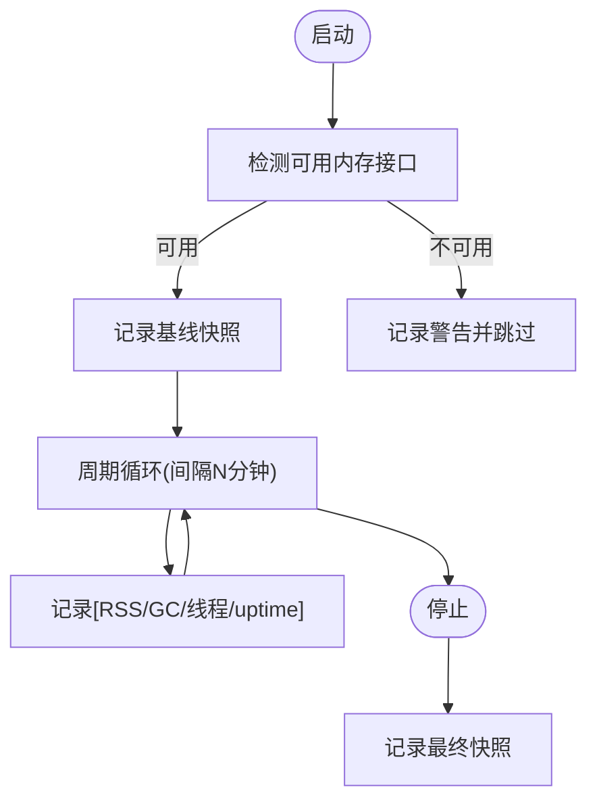
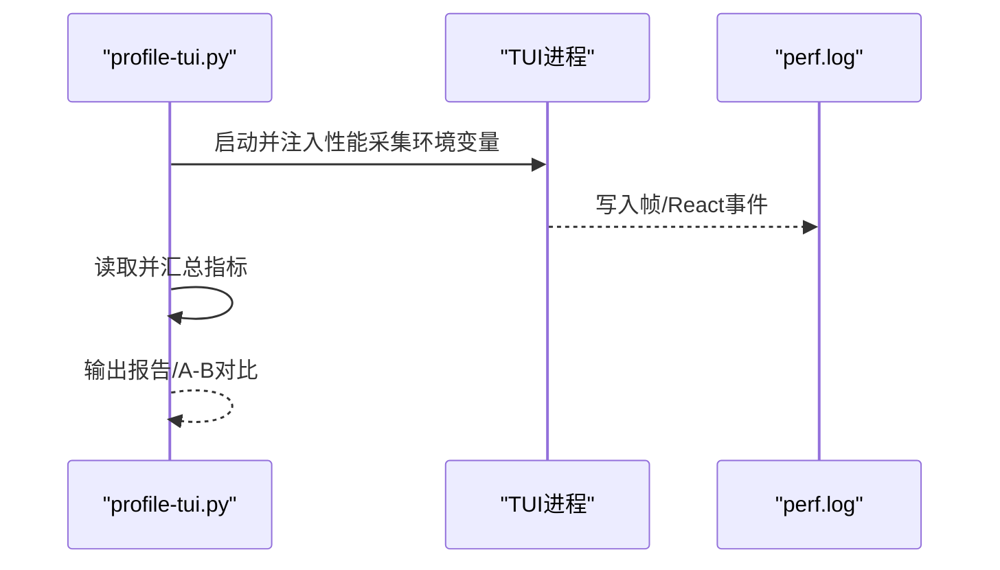
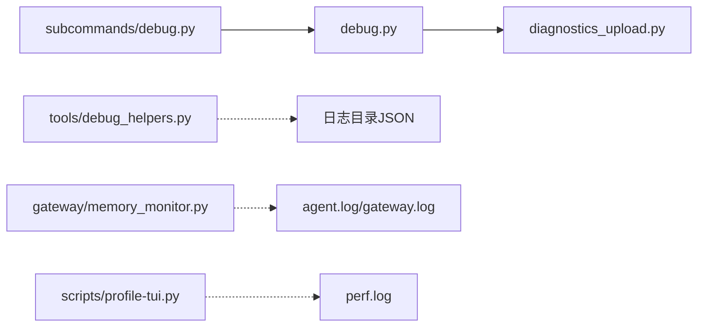

# 调试工具

<cite>
**本文引用的文件**
- [sparkii_cli/debug.py](file://sparkii_cli/debug.py)
- [sparkii_cli/subcommands/debug.py](file://sparkii_cli/subcommands/debug.py)
- [tools/debug_helpers.py](file://tools/debug_helpers.py)
- [scripts/profile-tui.py](file://scripts/profile-tui.py)
- [gateway/memory_monitor.py](file://gateway/memory_monitor.py)
- [sparkii_cli/diagnostics_upload.py](file://sparkii_cli/diagnostics_upload.py)
</cite>

## 目录
1. [简介](#简介)
2. [项目结构](#项目结构)
3. [核心组件](#核心组件)
4. [架构总览](#架构总览)
5. [详细组件分析](#详细组件分析)
6. [依赖关系分析](#依赖关系分析)
7. [性能考量](#性能考量)
8. [故障排查指南](#故障排查指南)
9. [结论](#结论)
10. [附录](#附录)

## 简介
本指南面向使用 Sparkii Agent 的开发者与运维人员，系统化介绍内置调试能力：日志收集与分享、工具级调试会话、内存监控、以及前端/终端性能剖析。文档覆盖如何启用详细调试模式、收集诊断信息、定位常见问题（工具执行失败、网络连接问题、内存泄漏等），并给出断点调试与变量检查的实践建议，最后提供扩展自定义调试工具的指引。

## 项目结构
围绕调试能力的相关代码主要分布在以下模块：
- CLI 调试命令与上传：sparkii_cli/debug.py、sparkii_cli/subcommands/debug.py、sparkii_cli/diagnostics_upload.py
- 工具级调试会话：tools/debug_helpers.py
- 内存监控：gateway/memory_monitor.py
- 性能剖析（TUI/Ink）：scripts/profile-tui.py

图示来源
- [sparkii_cli/debug.py:1-120](file://sparkii_cli/debug.py#L1-L120)
- [sparkii_cli/subcommands/debug.py:13-100](file://sparkii_cli/subcommands/debug.py#L13-L100)
- [sparkii_cli/diagnostics_upload.py:1-139](file://sparkii_cli/diagnostics_upload.py#L1-L139)
- [tools/debug_helpers.py:1-106](file://tools/debug_helpers.py#L1-L106)
- [gateway/memory_monitor.py:1-231](file://gateway/memory_monitor.py#L1-L231)
- [scripts/profile-tui.py:1-626](file://scripts/profile-tui.py#L1-L626)

章节来源
- [sparkii_cli/debug.py:1-120](file://sparkii_cli/debug.py#L1-L120)
- [sparkii_cli/subcommands/debug.py:13-100](file://sparkii_cli/subcommands/debug.py#L13-L100)
- [tools/debug_helpers.py:1-106](file://tools/debug_helpers.py#L1-L106)
- [gateway/memory_monitor.py:1-231](file://gateway/memory_monitor.py#L1-L231)
- [scripts/profile-tui.py:1-626](file://scripts/profile-tui.py#L1-L626)
- [sparkii_cli/diagnostics_upload.py:1-139](file://sparkii_cli/diagnostics_upload.py#L1-L139)

## 核心组件
- 调试报告与分享：通过 CLI 子命令收集系统信息与日志尾部，支持上传至公共粘贴服务或内部私有存储，默认对敏感信息进行强制脱敏。
- 工具级调试会话：为各工具提供统一的 DebugSession，按环境变量开关，记录调用序列并落盘 JSON。
- 内存监控：后台线程周期性输出结构化内存快照，便于发现缓慢增长与泄漏。
- 性能剖析：驱动 TUI 运行并采集 React/渲染管线指标，生成可对比的性能报告。

章节来源
- [sparkii_cli/debug.py:583-711](file://sparkii_cli/debug.py#L583-L711)
- [tools/debug_helpers.py:36-106](file://tools/debug_helpers.py#L36-L106)
- [gateway/memory_monitor.py:83-193](file://gateway/memory_monitor.py#L83-L193)
- [scripts/profile-tui.py:111-284](file://scripts/profile-tui.py#L111-L284)

## 架构总览
下图展示了从 CLI 触发到数据收集、上传与落盘的完整链路，包括公开粘贴服务与内部存储两条路径。

图示来源
- [sparkii_cli/debug.py:754-800](file://sparkii_cli/debug.py#L754-L800)
- [sparkii_cli/diagnostics_upload.py:42-139](file://sparkii_cli/diagnostics_upload.py#L42-L139)

## 详细组件分析

### 调试报告与分享（sparkii debug share）
- 功能要点
  - 收集系统 dump 与多类日志尾部（agent/errors/gateway/gui/desktop）。
  - 默认在上传时对日志进行强制脱敏，避免密钥泄露；可通过参数关闭。
  - 支持两种目标：公共粘贴服务（自动回退）与 Nous 内部存储（私有、带过期策略）。
  - 支持删除已上传的 paste.rs 链接。
- 常用参数
  - --lines：每份日志包含的行数
  - --expire：粘贴有效期（天）
  - --local：仅本地输出不上传
  - --no-redact：关闭上传时脱敏
  - --nous：上传到内部存储
  - delete：删除指定 paste.rs 链接
- 典型流程
  - 构建报告 → 选择目标（粘贴服务或内部存储）→ 上传 → 返回链接

图示来源
- [sparkii_cli/debug.py:583-711](file://sparkii_cli/debug.py#L583-L711)
- [sparkii_cli/debug.py:754-800](file://sparkii_cli/debug.py#L754-L800)
- [sparkii_cli/diagnostics_upload.py:42-139](file://sparkii_cli/diagnostics_upload.py#L42-L139)

章节来源
- [sparkii_cli/debug.py:1-120](file://sparkii_cli/debug.py#L1-L120)
- [sparkii_cli/debug.py:583-711](file://sparkii_cli/debug.py#L583-L711)
- [sparkii_cli/debug.py:754-800](file://sparkii_cli/debug.py#L754-L800)
- [sparkii_cli/subcommands/debug.py:13-100](file://sparkii_cli/subcommands/debug.py#L13-L100)
- [sparkii_cli/diagnostics_upload.py:1-139](file://sparkii_cli/diagnostics_upload.py#L1-L139)

### 工具级调试会话（DebugSession）
- 作用
  - 为每个工具提供独立的调试会话，按环境变量开启。
  - 记录每次调用的时间戳、工具名与入参摘要，最终落盘 JSON。
  - 暴露会话元信息，便于上层查询当前是否启用及日志路径。
- 使用方式
  - 设置工具专属环境变量（如 WEB_TOOLS_DEBUG=true）以启用。
  - 在工具中记录调用并保存，结束后在日志目录查找对应 JSON。
- 数据结构
  - 会话包含 session_id、start_time、end_time、total_calls、tool_calls 列表。

图示来源
- [tools/debug_helpers.py:36-106](file://tools/debug_helpers.py#L36-L106)

章节来源
- [tools/debug_helpers.py:1-106](file://tools/debug_helpers.py#L1-L106)

### 内存监控（Gateway Memory Monitor）
- 作用
  - 后台线程周期性输出结构化内存快照，便于发现缓慢增长与泄漏。
  - 输出格式以 [MEMORY] 开头，包含 RSS、GC 计数、线程数、运行时长等。
- 配置与行为
  - 启动时记录基线，停止时记录最终快照。
  - 优先使用标准库 resource，回退到 psutil；若均不可用则告警并禁用。
- 使用建议
  - 在长时间运行的网关中观察 RSS 趋势，结合 GC 与线程数判断异常。
  - 关注 shutdown 时的最终快照，辅助定位退出前状态。

图示来源
- [gateway/memory_monitor.py:83-193](file://gateway/memory_monitor.py#L83-L193)
- [gateway/memory_monitor.py:196-231](file://gateway/memory_monitor.py#L196-L231)

章节来源
- [gateway/memory_monitor.py:1-231](file://gateway/memory_monitor.py#L1-L231)

### 性能剖析（TUI/Ink Profiler）
- 作用
  - 驱动 TUI 运行，采集 React 与 Ink 渲染管线的事件，生成性能报告。
  - 支持关键指标汇总、A/B 对比、循环监听源码变化后自动重跑与对比。
- 关键指标
  - 帧耗时分布（p50/p95/p99/max）、吞吐 FPS、阶段耗时（renderer/yoga/diff/write 等）、补丁数量、写入字节、背压情况。
- 使用方式
  - 通过脚本参数控制会话、按键模拟、阈值、窗口大小、日志路径等。
  - 支持保存指标并与历史基线对比，快速评估改动影响。

图示来源
- [scripts/profile-tui.py:111-284](file://scripts/profile-tui.py#L111-L284)
- [scripts/profile-tui.py:405-525](file://scripts/profile-tui.py#L405-L525)

章节来源
- [scripts/profile-tui.py:1-626](file://scripts/profile-tui.py#L1-L626)

## 依赖关系分析
- 组件耦合
  - debug.py 依赖 subcommands/debug.py 提供的参数解析，并可选择调用 diagnostics_upload.py 完成内部存储上传。
  - tools/debug_helpers.py 独立于主流程，供各工具按需启用。
  - gateway/memory_monitor.py 作为后台任务，向日志系统输出结构化信息。
  - scripts/profile-tui.py 与 TUI 进程协作，产出性能数据。
- 外部依赖
  - 粘贴服务（paste.rs/dpaste.com）用于临时分享。
  - Nous 内部存储（S3）用于私有调试包上传。
  - 可选依赖 psutil（当 resource 不可用时）。

图示来源
- [sparkii_cli/subcommands/debug.py:13-100](file://sparkii_cli/subcommands/debug.py#L13-L100)
- [sparkii_cli/debug.py:754-800](file://sparkii_cli/debug.py#L754-L800)
- [sparkii_cli/diagnostics_upload.py:42-139](file://sparkii_cli/diagnostics_upload.py#L42-L139)
- [tools/debug_helpers.py:36-106](file://tools/debug_helpers.py#L36-L106)
- [gateway/memory_monitor.py:83-193](file://gateway/memory_monitor.py#L83-L193)
- [scripts/profile-tui.py:111-284](file://scripts/profile-tui.py#L111-L284)

章节来源
- [sparkii_cli/debug.py:754-800](file://sparkii_cli/debug.py#L754-L800)
- [sparkii_cli/diagnostics_upload.py:42-139](file://sparkii_cli/diagnostics_upload.py#L42-L139)
- [tools/debug_helpers.py:36-106](file://tools/debug_helpers.py#L36-L106)
- [gateway/memory_monitor.py:83-193](file://gateway/memory_monitor.py#L83-L193)
- [scripts/profile-tui.py:111-284](file://scripts/profile-tui.py#L111-L284)

## 性能考量
- 日志收集
  - 限制单文件读取大小，避免大日志导致内存峰值过高。
  - 采用“尾部+全量”双视图，兼顾可读性与完整性。
- 上传策略
  - 先尝试更快的粘贴服务，失败再回退到支持过期的服务。
  - 内部存储使用预签名 URL 直传，减少中间态复杂度。
- 内存监控
  - 后台线程最小化开销，仅在必要时读取 RSS/GC/线程数。
  - 不可用时优雅降级，不影响主流程。
- 性能剖析
  - 通过阈值过滤低价值事件，降低日志体积。
  - 指标聚合与 A/B 对比帮助快速识别回归。

## 故障排查指南
- 工具执行问题
  - 启用工具级调试：设置工具对应的环境变量（例如 WEB_TOOLS_DEBUG=true），运行后在日志目录查找生成的 JSON，查看调用链与入参。
  - 若问题复现困难，结合 sparkii debug share 收集上下文日志，注意默认会脱敏敏感信息。
- 网络连接问题
  - 使用 sparkii debug share 收集 agent/gateway 日志尾部，关注网络错误与重试信息。
  - 若使用 --nous 上传，确认内部存储服务可达与凭据正确。
- 内存泄漏检测
  - 观察 gateway 日志中的 [MEMORY] 行，关注 RSS 随时间的增长趋势。
  - 结合 GC 计数与线程数变化，定位可能的对象累积或线程泄漏。
- 断点调试与变量检查
  - 在 Python 环境中使用 pdb/ipdb 在关键函数入口设置断点，逐步检查变量与状态。
  - 对于异步流程，建议在回调或 await 前后插入断点，避免阻塞事件循环。
- 常见定位技巧
  - 优先查看 errors.log 与 gateway.log 的错误堆栈。
  - 使用 sparkii debug share --local 预览报告，确认脱敏是否符合预期。
  - 对性能问题，使用 profile-tui.py 采集 perf.log 并对比基线，定位瓶颈阶段。

章节来源
- [tools/debug_helpers.py:36-106](file://tools/debug_helpers.py#L36-L106)
- [sparkii_cli/debug.py:583-711](file://sparkii_cli/debug.py#L583-L711)
- [gateway/memory_monitor.py:83-193](file://gateway/memory_monitor.py#L83-L193)
- [scripts/profile-tui.py:111-284](file://scripts/profile-tui.py#L111-L284)

## 结论
本项目提供了完善的调试与诊断能力：从日志收集与分享、工具级会话追踪，到内存监控与性能剖析，覆盖了从开发到生产的关键场景。建议在日常工作中结合工具级调试与内存监控，配合性能剖析工具持续优化；在问题定位时优先使用内置分享与脱敏机制，确保数据安全与高效协作。

## 附录
- 常用命令速查
  - 本地查看报告：sparkii debug share --local
  - 调整日志行数：sparkii debug share --lines 500
  - 延长粘贴有效期：sparkii debug share --expire 30
  - 关闭脱敏（谨慎）：sparkii debug share --no-redact
  - 上传到内部存储：sparkii debug share --nous
  - 删除已上传链接：sparkii debug delete <url>
- 环境变量参考
  - 工具调试：WEB_TOOLS_DEBUG=true（示例）
  - 性能剖析：SPARKII_DEV_PERF=1、SPARKII_DEV_PERF_MS=<阈值>、SPARKII_PERF_LOG=<路径>
- 扩展自定义调试工具
  - 复用 DebugSession：在工具中初始化并按需记录调用，结束时保存日志。
  - 集成内存监控：在关键生命周期节点调用日志记录函数，输出结构化信息。
  - 接入性能剖析：遵循 profile-tui.py 的环境约定，采集并汇总指标。