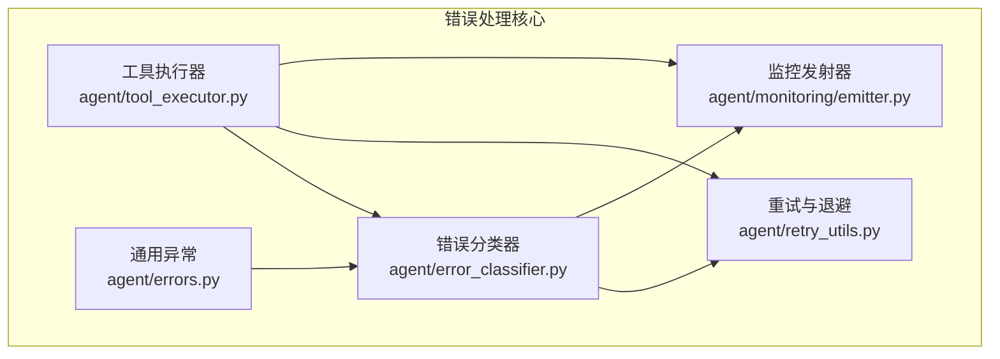
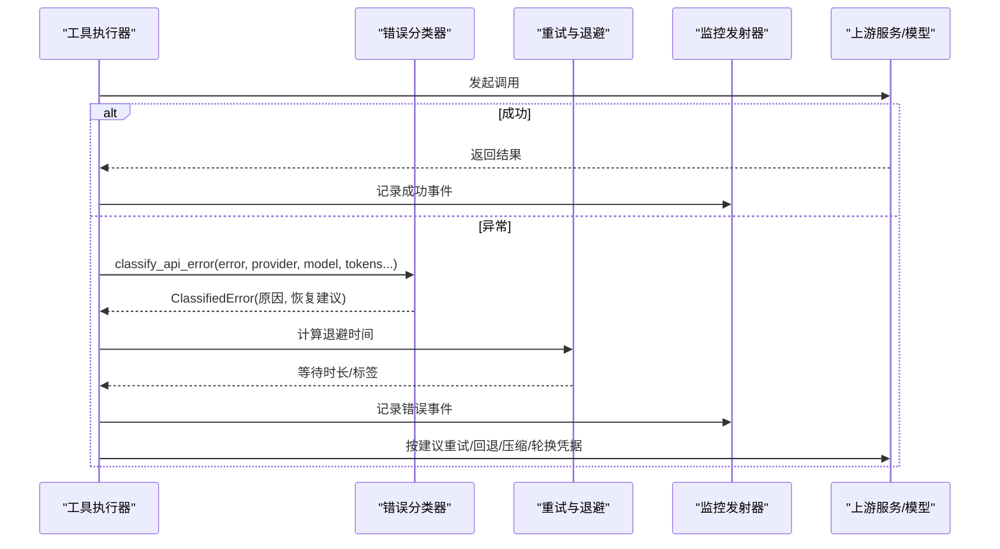
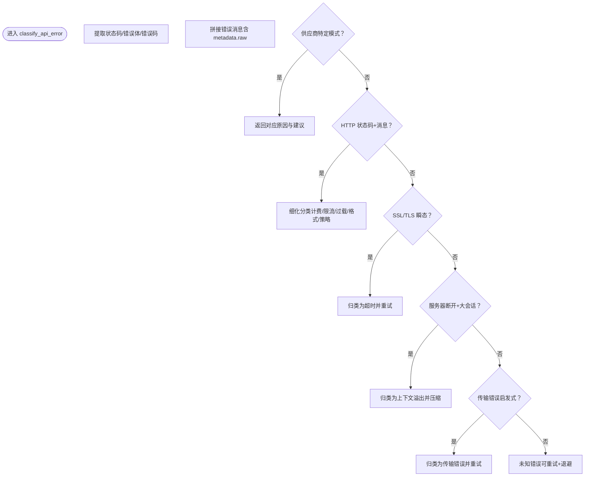
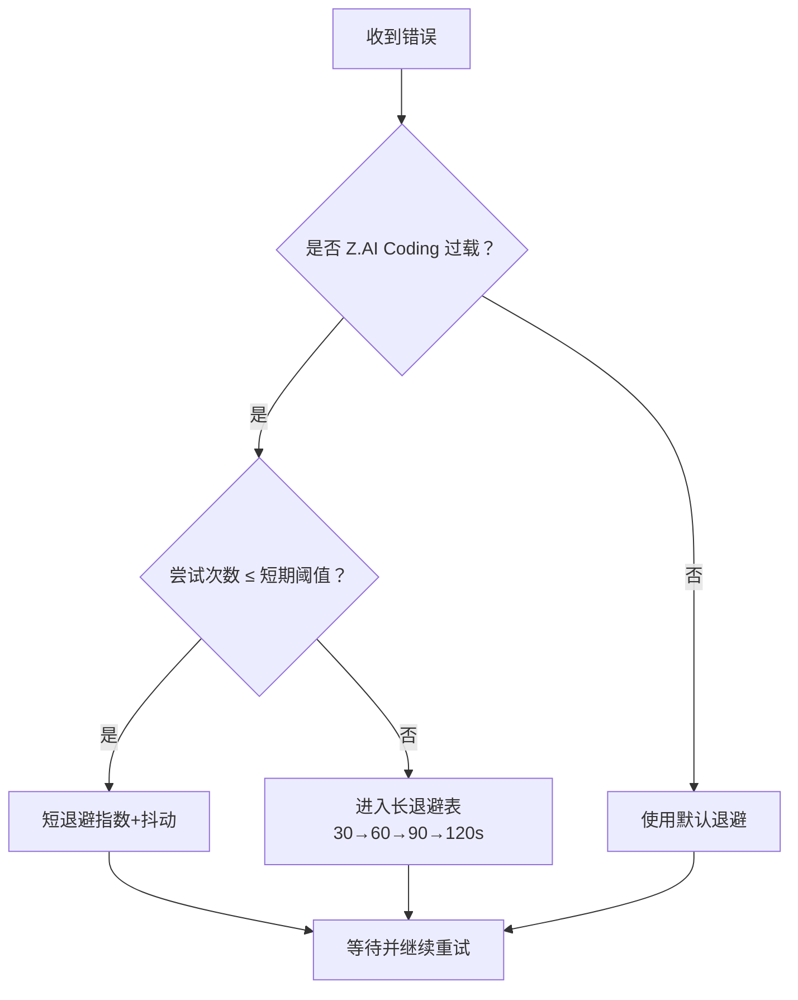
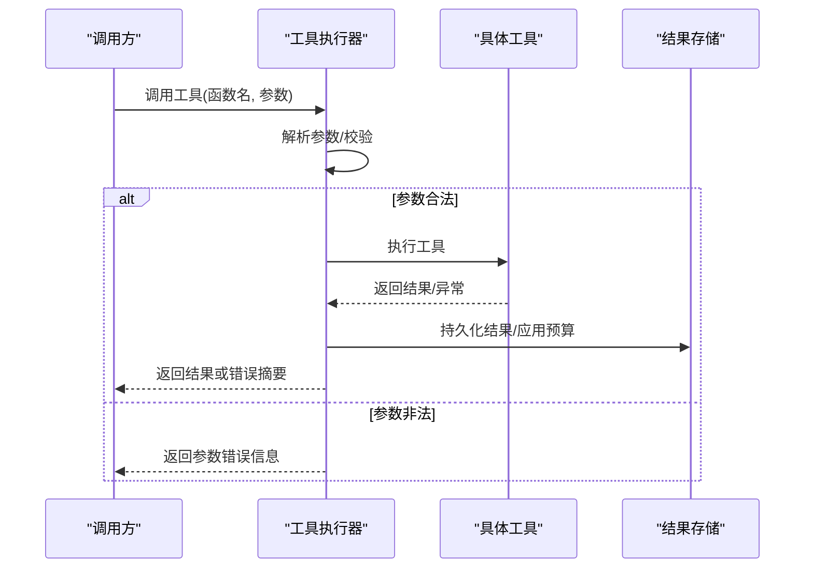
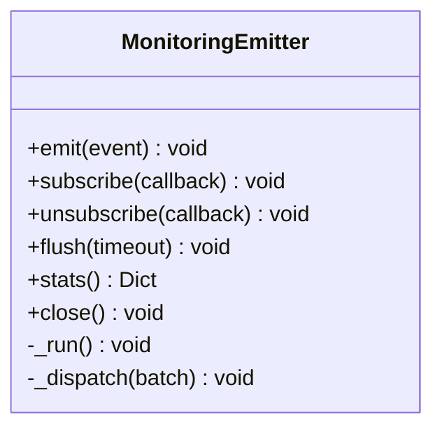
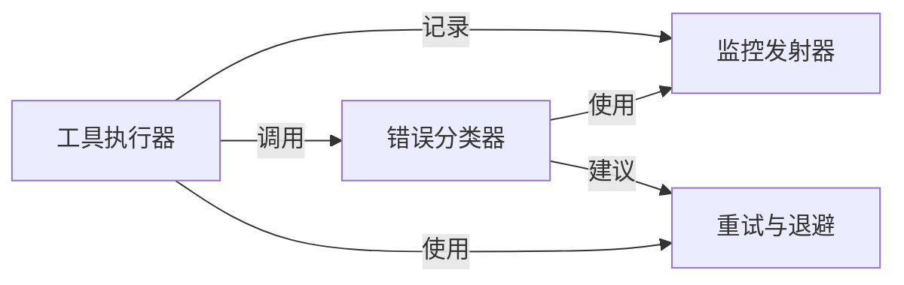

# 错误分类

<cite>
**本文引用的文件**
- [agent/error_classifier.py](file://agent/error_classifier.py)
- [agent/errors.py](file://agent/errors.py)
- [agent/retry_utils.py](file://agent/retry_utils.py)
- [agent/tool_executor.py](file://agent/tool_executor.py)
- [agent/monitoring/emitter.py](file://agent/monitoring/emitter.py)
</cite>

## 目录
1. [简介](#简介)
2. [项目结构](#项目结构)
3. [核心组件](#核心组件)
4. [架构总览](#架构总览)
5. [详细组件分析](#详细组件分析)
6. [依赖关系分析](#依赖关系分析)
7. [性能考量](#性能考量)
8. [故障排除指南](#故障排除指南)
9. [结论](#结论)
10. [附录](#附录)

## 简介
本文件系统化梳理 SparkiiDesktop 中的错误分类体系与处理机制，覆盖网络错误、工具执行错误、AI 模型调用错误、权限/认证错误等。文档说明每类错误的触发条件、错误码（或信号）、标准处理流程、恢复策略与重试配置，并给出错误分类器的实现原理、使用方法、监控告警接入方式，以及自定义工具/插件的错误处理建议。

## 项目结构
围绕错误分类与处理的代码主要分布在 agent 子模块中：
- 错误分类器：集中定义错误类型、匹配规则与恢复建议
- 重试与退避：提供抖动指数退避、特定供应商的自适应退避
- 工具执行：封装工具调用的超时、并发、结果存储与失败提示
- 监控发射器：非阻塞的事件队列与分发，用于错误与指标上报
- 通用异常：少量领域异常定义（如 SSL 配置错误、空流等）

**图表来源**
- [agent/error_classifier.py:22-117](file://agent/error_classifier.py#L22-L117)
- [agent/retry_utils.py:38-209](file://agent/retry_utils.py#L38-L209)
- [agent/tool_executor.py:1-200](file://agent/tool_executor.py#L1-L200)
- [agent/monitoring/emitter.py:36-200](file://agent/monitoring/emitter.py#L36-L200)
- [agent/errors.py:1-14](file://agent/errors.py#L1-L14)

**章节来源**
- [agent/error_classifier.py:22-117](file://agent/error_classifier.py#L22-L117)
- [agent/retry_utils.py:38-209](file://agent/retry_utils.py#L38-L209)
- [agent/tool_executor.py:1-200](file://agent/tool_executor.py#L1-L200)
- [agent/monitoring/emitter.py:36-200](file://agent/monitoring/emitter.py#L36-L200)
- [agent/errors.py:1-14](file://agent/errors.py#L1-L14)

## 核心组件
- 错误分类器：将任意 API 异常归类为结构化原因，并附带是否可重试、是否需要压缩上下文、是否轮换凭据、是否回退到其它模型/供应商等恢复建议。
- 重试与退避：提供抖动指数退避、解析 Retry-After 头、针对特定供应商（如 Z.AI Coding Plan）的自适应长退避策略。
- 工具执行器：负责工具调用的参数解析、并发控制、超时、结果持久化与失败展示；对工具侧错误进行统一包装与提示。
- 监控发射器：以非阻塞方式收集错误与事件，支持批量分发至 OTLP 等导出器，确保不影响主路径性能。
- 通用异常：SSL/TLS 配置错误、空流异常、预设不存在等基础异常类型。

**章节来源**
- [agent/error_classifier.py:22-117](file://agent/error_classifier.py#L22-L117)
- [agent/retry_utils.py:38-209](file://agent/retry_utils.py#L38-L209)
- [agent/tool_executor.py:1-200](file://agent/tool_executor.py#L1-L200)
- [agent/monitoring/emitter.py:36-200](file://agent/monitoring/emitter.py#L36-L200)
- [agent/errors.py:1-14](file://agent/errors.py#L1-L14)

## 架构总览
错误从各层抛出后，经分类器统一归因，再由上层重试循环根据恢复建议决定重试、压缩、轮换凭据或回退。工具执行过程中产生的错误同样被分类并记录到监控通道。

**图表来源**
- [agent/tool_executor.py:1-200](file://agent/tool_executor.py#L1-L200)
- [agent/error_classifier.py:624-800](file://agent/error_classifier.py#L624-L800)
- [agent/retry_utils.py:90-209](file://agent/retry_utils.py#L90-L209)
- [agent/monitoring/emitter.py:53-117](file://agent/monitoring/emitter.py#L53-L117)

## 详细组件分析

### 错误分类器（API 错误分类与恢复建议）
- 错误类型层次（FailoverReason）：
  - 认证/授权：auth、auth_permanent
  - 计费/配额：billing、rate_limit、upstream_rate_limit
  - 服务端：overloaded、server_error
  - 传输：timeout、ssl_cert_verification
  - 上下文/载荷：context_overflow、payload_too_large、image_too_large
  - 模型/供应商策略：model_not_found、provider_policy_blocked、content_policy_blocked
  - 请求格式：format_error、invalid_encrypted_content、multimodal_tool_content_unsupported
  - 供应商特定：thinking_signature、long_context_tier、oauth_long_context_beta_forbidden、llama_cpp_grammar_pattern
  - 兜底：unknown
- 分类流程要点：
  - 优先匹配供应商特定模式（如 Anthropic thinking 签名、长上下文层级限制、OAuth beta 禁用）
  - 基于 HTTP 状态码与消息体细化分类（如 402/429/413/400/5xx）
  - 提取结构化 error_code 与 body/message/metadata.raw 进行模式匹配
  - 区分计费耗尽 vs 速率限制 vs 上下文溢出 vs 认证失败
  - SSL/TLS 瞬态告警归类为可重试的超时类
  - 服务器断开 + 大会话 → 上下文溢出压缩路径
  - 传输错误启发式归类
  - 未知错误默认可重试并退避
- 恢复建议字段：
  - retryable：是否允许重试
  - should_compress：是否需要压缩上下文
  - should_rotate_credential：是否需要轮换凭据
  - should_fallback：是否需要回退到其他模型/供应商

**图表来源**
- [agent/error_classifier.py:624-800](file://agent/error_classifier.py#L624-L800)

**章节来源**
- [agent/error_classifier.py:22-117](file://agent/error_classifier.py#L22-L117)
- [agent/error_classifier.py:624-800](file://agent/error_classifier.py#L624-L800)

### 重试与退避（抖动指数退避与供应商自适应）
- 抖动指数退避：避免多会话同时重试导致的“惊群”效应，支持 base_delay、max_delay、jitter_ratio 配置。
- Retry-After 解析：兼容数值与 HTTP-date 格式，自动取正数秒。
- 供应商自适应：针对 Z.AI Coding Plan GLM-5.2 的 429 过载，前若干次短重试，随后进入渐进式长退避表（30/60/90/120s），并带轻抖动。
- 重试上限：提供 zai_coding_overload_retry_ceiling 保证完整退避序列可达。

**图表来源**
- [agent/retry_utils.py:90-209](file://agent/retry_utils.py#L90-L209)

**章节来源**
- [agent/retry_utils.py:38-209](file://agent/retry_utils.py#L38-L209)

### 工具执行器（工具调用、超时、并发与失败提示）
- 参数解析：严格 JSON 解析，非法参数直接返回错误信息，不执行工具。
- 并发与超时：支持最大并发工作线程、图片并行请求、统一超时上限，可通过环境变量调整。
- 结果持久化与预算：按上下文窗口动态设置结果大小预算，防止单次结果过大导致上下文溢出。
- 失败提示：通过显示层检测工具失败并生成友好提示，便于用户理解。

**图表来源**
- [agent/tool_executor.py:1-200](file://agent/tool_executor.py#L1-L200)

**章节来源**
- [agent/tool_executor.py:1-200](file://agent/tool_executor.py#L1-L200)

### 监控发射器（错误与事件上报）
- 非阻塞 emit：热路径永不阻塞、永不抛异常，队列满时丢弃最旧事件，保证系统稳定性。
- 后台分发：独立线程批量拉取并分发给订阅者（如 OTLP 导出器），单个订阅者失败隔离。
- 生命周期：支持启用/禁用、订阅/取消订阅、flush 等待完成、stats 统计。

**图表来源**
- [agent/monitoring/emitter.py:36-200](file://agent/monitoring/emitter.py#L36-L200)

**章节来源**
- [agent/monitoring/emitter.py:36-200](file://agent/monitoring/emitter.py#L36-L200)

### 通用异常
- SSLConfigurationError：SSL/TLS 证书包配置失败时抛出。
- EmptyStreamError：提供者关闭流且未返回响应时抛出。
- MoAPresetNotFoundError：持久化的 MoA 预设不再存在于配置中时抛出。

**章节来源**
- [agent/errors.py:1-14](file://agent/errors.py#L1-L14)

## 依赖关系分析
- 错误分类器依赖：
  - 供应商/模型元数据（如模型 ID 规范化）用于判断缺失前缀导致的 404
  - 消息体与结构化错误码提取，结合多种模式库进行精确分类
- 重试与退避依赖：
  - 错误文本扁平化与供应商识别（Z.AI Coding Plan）
- 工具执行器依赖：
  - 显示层（工具失败检测与提示）
  - 工具结果存储与预算配置
- 监控发射器：
  - 无外部强依赖，内部使用队列与线程，订阅者按需挂载

**图表来源**
- [agent/error_classifier.py:624-800](file://agent/error_classifier.py#L624-L800)
- [agent/retry_utils.py:90-209](file://agent/retry_utils.py#L90-L209)
- [agent/tool_executor.py:1-200](file://agent/tool_executor.py#L1-L200)
- [agent/monitoring/emitter.py:53-117](file://agent/monitoring/emitter.py#L53-L117)

**章节来源**
- [agent/error_classifier.py:624-800](file://agent/error_classifier.py#L624-L800)
- [agent/retry_utils.py:90-209](file://agent/retry_utils.py#L90-L209)
- [agent/tool_executor.py:1-200](file://agent/tool_executor.py#L1-L200)
- [agent/monitoring/emitter.py:53-117](file://agent/monitoring/emitter.py#L53-L117)

## 性能考量
- 分类器在热路径仅做轻量字符串匹配与字典访问，避免昂贵 I/O。
- 重试采用抖动指数退避，降低并发重试风暴风险；对特定供应商提供自适应长退避，减少无效重试。
- 监控发射器采用非阻塞队列与后台批处理，确保主路径零阻塞。
- 工具执行器通过并发上限与超时控制，避免资源耗尽；结果预算按上下文窗口缩放，防止单次结果过大影响整体吞吐。

[本节为通用指导，无需引用具体文件]

## 故障排除指南
- 认证/授权错误（auth/auth_permanent）
  - 触发条件：401/403、token 过期/吊销、网关鉴权失败
  - 处理流程：尝试刷新/轮换凭据；若仍失败则中止并提示用户检查账户与密钥
  - 参考：分类器中的认证模式与状态码路径
- 计费/配额错误（billing/rate_limit/upstream_rate_limit）
  - 触发条件：402、余额不足、配额耗尽、429 限流、上游聚合器限流
  - 处理流程：billing 立即轮换凭据；rate_limit 退避后重试；upstream_rate_limit 切换模型/供应商
  - 参考：计费与限流模式、Retry-After 解析、Z.AI 自适应退避
- 服务端过载/错误（overloaded/server_error）
  - 触发条件：503/529 过载、500/502 内部错误
  - 处理流程：退避重试；过载场景避免轮换凭据，保持同一键重试
- 传输错误（timeout/ssl_cert_verification）
  - 触发条件：连接/读取超时、SSL 证书验证失败
  - 处理流程：超时重试；证书验证失败快速失败并提示修复 CA/代理设置
- 上下文/载荷过大（context_overflow/payload_too_large/image_too_large）
  - 触发条件：上下文长度超限、413 请求体过大、图片尺寸/像素超限
  - 处理流程：压缩上下文、缩小图片、重试
- 模型/策略拒绝（model_not_found/provider_policy_blocked/content_policy_blocked）
  - 触发条件：模型不存在、供应商策略屏蔽、内容安全过滤
  - 处理流程：切换到支持的模型/供应商；内容策略拒绝不可重试相同请求
- 请求格式错误（format_error/invalid_encrypted_content/multimodal_tool_content_unsupported）
  - 触发条件：400 坏请求、加密内容无效、多模态工具内容不被支持
  - 处理流程：修正请求格式、降级为文本、重试
- 工具执行错误
  - 触发条件：参数非法、工具内部异常、超时、结果过大
  - 处理流程：参数校验失败直接返回错误；其他错误经分类器归类并按建议重试/回退；结果按预算截断或持久化
- 监控与告警
  - 使用监控发射器记录错误事件，订阅 OTLP 导出器进行指标/日志上报；队列满时丢弃最旧事件，保证系统稳定

**章节来源**
- [agent/error_classifier.py:22-117](file://agent/error_classifier.py#L22-L117)
- [agent/error_classifier.py:624-800](file://agent/error_classifier.py#L624-L800)
- [agent/retry_utils.py:38-209](file://agent/retry_utils.py#L38-L209)
- [agent/tool_executor.py:1-200](file://agent/tool_executor.py#L1-L200)
- [agent/monitoring/emitter.py:53-117](file://agent/monitoring/emitter.py#L53-L117)

## 结论
SparkiiDesktop 通过集中化的错误分类器与健壮的重试/退避机制，实现了跨供应商、跨场景的统一错误治理。结合工具执行器的容错设计与监控发射器的非阻塞上报，系统在可用性、可观测性与用户体验方面具备良好平衡。对于自定义工具与插件，建议遵循统一的错误分类与上报规范，以获得一致的恢复与排障体验。

[本节为总结性内容，无需引用具体文件]

## 附录

### 错误类型与处理流程对照表
- 认证/授权
  - 触发：401/403、token 过期/吊销
  - 处理：刷新/轮换凭据；失败则中止
- 计费/配额
  - 触发：402、余额不足、429 限流
  - 处理：billing 立即轮换；rate_limit 退避重试；upstream_rate_limit 切换模型/供应商
- 服务端
  - 触发：503/529 过载、500/502 内部错误
  - 处理：退避重试；过载不轮换凭据
- 传输
  - 触发：超时、SSL 证书验证失败
  - 处理：超时重试；证书失败快速失败并提示修复
- 上下文/载荷
  - 触发：上下文超限、413、图片过大
  - 处理：压缩上下文、缩小图片、重试
- 模型/策略
  - 触发：模型不存在、策略屏蔽、内容安全过滤
  - 处理：切换模型/供应商；内容策略拒绝不重试相同请求
- 请求格式
  - 触发：400 坏请求、加密内容无效、多模态工具内容不支持
  - 处理：修正格式、降级为文本、重试
- 工具执行
  - 触发：参数非法、工具异常、超时、结果过大
  - 处理：参数错误直接返回；其他错误分类并重试/回退；结果按预算处理

**章节来源**
- [agent/error_classifier.py:22-117](file://agent/error_classifier.py#L22-L117)
- [agent/error_classifier.py:624-800](file://agent/error_classifier.py#L624-L800)
- [agent/tool_executor.py:1-200](file://agent/tool_executor.py#L1-L200)

### 重试与退避配置选项
- 抖动指数退避
  - base_delay：初始退避秒数
  - max_delay：最大退避秒数
  - jitter_ratio：抖动比例
- 供应商自适应
  - Z.AI Coding Plan：短期重试后进入长退避表（30/60/90/120s）
  - 重试上限：zai_coding_overload_retry_ceiling 保证完整退避序列可达
- Retry-After 解析
  - 支持数值与 HTTP-date 格式，自动取正数秒

**章节来源**
- [agent/retry_utils.py:90-209](file://agent/retry_utils.py#L90-L209)

### 自定义工具与插件的错误处理建议
- 参数校验失败：直接返回结构化错误信息，避免执行工具
- 运行时异常：尽量抛出明确异常类型，便于分类器识别
- 超时与中断：遵循统一超时策略，避免长时间占用资源
- 结果大小：遵守预算配置，必要时分页或摘要输出
- 监控上报：通过监控发射器记录关键事件，便于问题定位

**章节来源**
- [agent/tool_executor.py:1-200](file://agent/tool_executor.py#L1-L200)
- [agent/monitoring/emitter.py:53-117](file://agent/monitoring/emitter.py#L53-L117)

### 错误监控与告警配置方法
- 启用监控：注册 OTLP 等导出器作为订阅者，自动启用发射器
- 事件采集：在工具执行与 API 调用路径中记录错误事件
- 队列管理：队列满时丢弃最旧事件，保证系统稳定
- 统计与诊断：通过 stats 获取队列长度、已分发数、丢弃数、订阅者数量

**章节来源**
- [agent/monitoring/emitter.py:53-117](file://agent/monitoring/emitter.py#L53-L117)