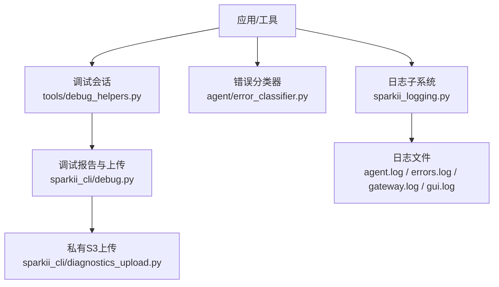
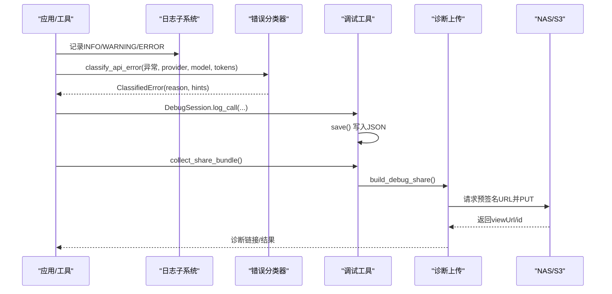
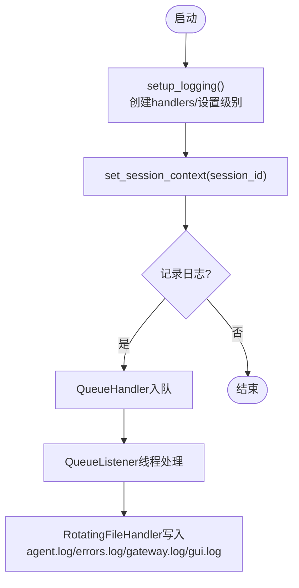
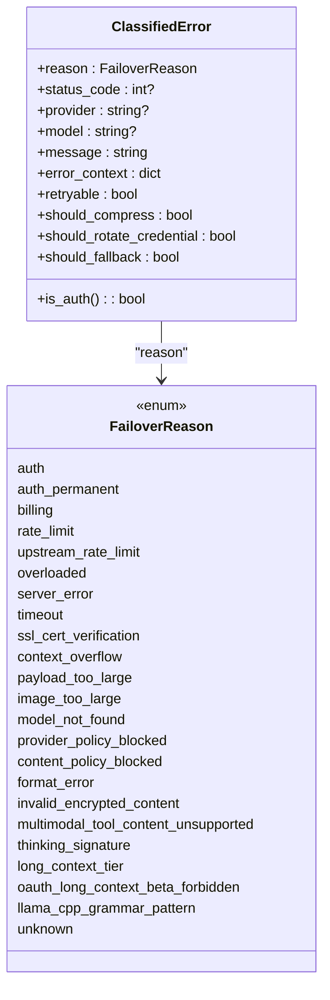
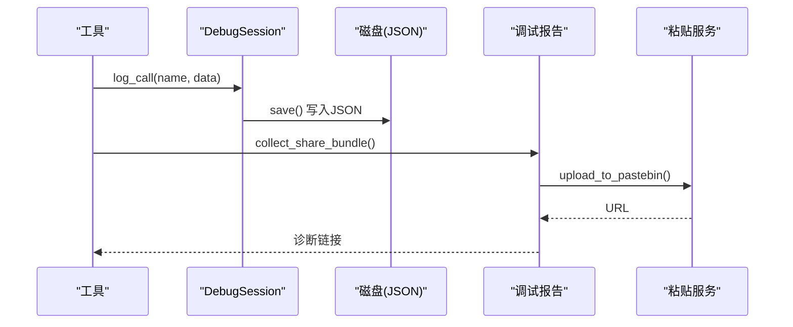
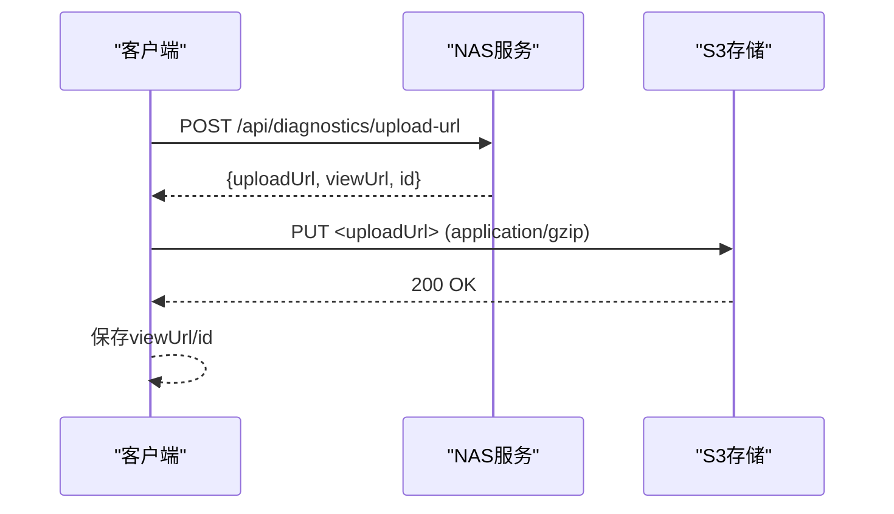
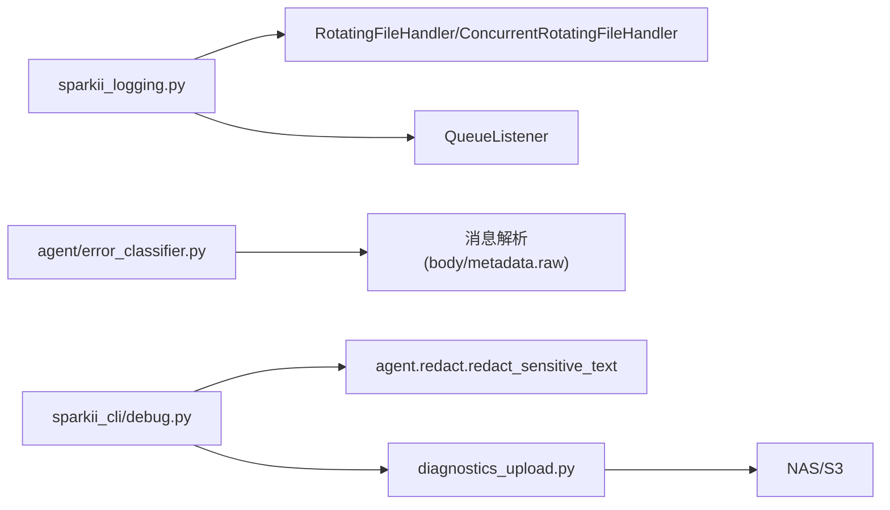

# 错误诊断

<cite>
**本文引用的文件**
- [agent/errors.py](file://agent/errors.py)
- [agent/error_classifier.py](file://agent/error_classifier.py)
- [sparkii_logging.py](file://sparkii_logging.py)
- [sparkii_cli/debug.py](file://sparkii_cli/debug.py)
- [sparkii_cli/diagnostics_upload.py](file://sparkii_cli/diagnostics_upload.py)
- [tools/debug_helpers.py](file://tools/debug_helpers.py)
</cite>

## 目录
1. [简介](#简介)
2. [项目结构](#项目结构)
3. [核心组件](#核心组件)
4. [架构总览](#架构总览)
5. [详细组件分析](#详细组件分析)
6. [依赖关系分析](#依赖关系分析)
7. [性能注意事项](#性能注意事项)
8. [故障排查指南](#故障排查指南)
9. [结论](#结论)
10. [附录](#附录)

## 简介
本指南面向系统运维与开发者，提供一套系统化、可操作的错误诊断方法。内容涵盖：
- 如何分析与解读系统日志（级别、关键信息提取、时间线分析）
- 系统化的错误分类与定位（AI代理核心错误、工具执行错误、网络通信错误等）
- 如何使用调试模式与详细日志追踪问题根源
- 错误代码对照表与对应解决步骤
- 高级诊断技术（内存泄漏检测、死锁检测、资源耗尽）
- 堆栈跟踪信息的收集与分析
- 性能监控指标解释与优化建议
- 自动化诊断脚本使用方法与自定义诊断工具的扩展指南

## 项目结构
本项目将错误诊断能力分散在多个模块中，形成“日志采集—错误分类—调试上报—上传归档”的闭环：
- 日志子系统：集中式日志配置、滚动文件、异步队列写入、会话上下文注入、组件路由
- 错误分类器：结构化API错误分类与恢复策略提示
- 调试工具：本地调试会话记录、报告生成、脱敏上传
- 诊断上传：私有S3上传通道（可选）

图表来源
- [sparkii_logging.py:259-376](file://sparkii_logging.py#L259-L376)
- [agent/error_classifier.py:624-717](file://agent/error_classifier.py#L624-L717)
- [tools/debug_helpers.py:36-106](file://tools/debug_helpers.py#L36-L106)
- [sparkii_cli/debug.py:583-711](file://sparkii_cli/debug.py#L583-L711)
- [sparkii_cli/diagnostics_upload.py:42-139](file://sparkii_cli/diagnostics_upload.py#L42-L139)

章节来源
- [sparkii_logging.py:259-376](file://sparkii_logging.py#L259-L376)
- [agent/error_classifier.py:624-717](file://agent/error_classifier.py#L624-L717)
- [tools/debug_helpers.py:36-106](file://tools/debug_helpers.py#L36-L106)
- [sparkii_cli/debug.py:583-711](file://sparkii_cli/debug.py#L583-L711)
- [sparkii_cli/diagnostics_upload.py:42-139](file://sparkii_cli/diagnostics_upload.py#L42-L139)

## 核心组件
- 日志子系统
  - 统一入口：setup_logging() 负责创建 agent.log、errors.log、gateway.log、gui.log 等滚动日志文件
  - 会话上下文：set_session_context()/clear_session_context() 为每条日志附加会话标签，便于关联
  - 异步写入：通过 QueueListener 避免事件循环阻塞；Windows 下使用并发日志处理器避免锁竞争
  - 组件路由：按 logger 名称前缀将日志分流到不同文件
- 错误分类器
  - 结构化分类：classify_api_error() 将异常归类为 FailoverReason，并附带 retryable、should_compress、should_rotate_credential、should_fallback 等恢复提示
  - 多源消息聚合：从异常字符串、结构化 body、metadata.raw 中提取完整错误信息，提高匹配准确率
  - 覆盖场景：认证失败、计费/配额、速率限制、上游过载、超时、SSL/TLS、上下文溢出、模型不存在、内容策略拦截、格式错误等
- 调试工具
  - DebugSession：按工具维度开启调试，记录调用序列并落盘 JSON，支持导出会话信息
  - 调试报告：collect_debug_report() 汇总系统 dump 与最近日志尾部，便于快速定位
  - 共享包：collect_share_bundle() 生成带脱敏的报告与完整日志，支持上传至公共粘贴服务或私有 S3
- 诊断上传
  - request_upload_url() + put_bundle()：向 NAS 申请预签名 PUT URL，然后上传压缩后的诊断包
  - share_to_nous()：编排两步流程，返回 viewUrl 等元数据

章节来源
- [sparkii_logging.py:259-376](file://sparkii_logging.py#L259-L376)
- [agent/error_classifier.py:624-717](file://agent/error_classifier.py#L624-L717)
- [tools/debug_helpers.py:36-106](file://tools/debug_helpers.py#L36-L106)
- [sparkii_cli/debug.py:583-711](file://sparkii_cli/debug.py#L583-L711)
- [sparkii_cli/diagnostics_upload.py:42-139](file://sparkii_cli/diagnostics_upload.py#L42-L139)

## 架构总览
下图展示了从错误发生到分类、上报与归档的整体流程。

图表来源
- [sparkii_logging.py:259-376](file://sparkii_logging.py#L259-L376)
- [agent/error_classifier.py:624-717](file://agent/error_classifier.py#L624-L717)
- [tools/debug_helpers.py:36-106](file://tools/debug_helpers.py#L36-L106)
- [sparkii_cli/debug.py:583-711](file://sparkii_cli/debug.py#L583-L711)
- [sparkii_cli/diagnostics_upload.py:42-139](file://sparkii_cli/diagnostics_upload.py#L42-L139)

## 详细组件分析

### 日志子系统（sparkii_logging.py）
- 日志级别与文件
  - agent.log：INFO+，主活动日志
  - errors.log：WARNING+，快速排障
  - gateway.log：INFO+，仅网关组件
  - gui.log：INFO+，GUI/TUI相关组件
- 会话上下文
  - set_session_context()/clear_session_context() 为当前线程所有日志附加 [session_id]
- 异步写入与跨进程安全
  - 通过 QueueListener 将文件写入放到独立线程，避免阻塞事件循环
  - Windows 下使用并发日志处理器避免旋转时的权限冲突
- 组件路由
  - COMPONENT_PREFIXES 定义各组件 logger 前缀，用于将日志分流到 gateway.log/gui.log

图表来源
- [sparkii_logging.py:259-376](file://sparkii_logging.py#L259-L376)
- [sparkii_logging.py:575-640](file://sparkii_logging.py#L575-L640)
- [sparkii_logging.py:721-760](file://sparkii_logging.py#L721-L760)

章节来源
- [sparkii_logging.py:259-376](file://sparkii_logging.py#L259-L376)
- [sparkii_logging.py:575-640](file://sparkii_logging.py#L575-L640)
- [sparkii_logging.py:721-760](file://sparkii_logging.py#L721-L760)

### 错误分类器（agent/error_classifier.py）
- 分类目标
  - 将 API 异常映射为 FailoverReason，并给出恢复动作提示（重试、压缩、轮换凭据、回退）
- 输入与输出
  - 输入：异常对象、provider、model、approx_tokens、context_length、num_messages
  - 输出：ClassifiedError，包含 reason、status_code、provider、model、message、error_context 及恢复提示
- 优先级与规则
  - 先匹配特定提供商模式（如 Anthropic thinking signature、长上下文层级门限）
  - 再根据 HTTP 状态码与消息体细化分类
  - 对传输层错误（超时、连接断开、SSL/TLS）进行区分
  - 对上下文溢出、载荷过大、图片过大等场景给出压缩/重试策略
  - 对内容策略拦截、模型不存在、格式错误等不可重试或需回退的场景快速失败

图表来源
- [agent/error_classifier.py:24-94](file://agent/error_classifier.py#L24-L94)

章节来源
- [agent/error_classifier.py:24-94](file://agent/error_classifier.py#L24-L94)
- [agent/error_classifier.py:624-717](file://agent/error_classifier.py#L624-L717)

### 调试工具与报告（tools/debug_helpers.py, sparkii_cli/debug.py）
- DebugSession
  - 通过环境变量启用，记录工具调用序列，保存为 JSON 文件
  - 暴露 get_session_info() 供外部查询
- 调试报告
  - collect_debug_report() 汇总系统 dump 与各日志尾部
  - collect_share_bundle() 生成带脱敏的报告与完整日志，支持上传
- 上传与清理
  - upload_to_pastebin() 尝试 paste.rs 与 dpaste.com
  - _sweep_expired_pastes() 定期删除过期粘贴

图表来源
- [tools/debug_helpers.py:36-106](file://tools/debug_helpers.py#L36-L106)
- [sparkii_cli/debug.py:583-711](file://sparkii_cli/debug.py#L583-L711)
- [sparkii_cli/debug.py:73-183](file://sparkii_cli/debug.py#L73-L183)

章节来源
- [tools/debug_helpers.py:36-106](file://tools/debug_helpers.py#L36-L106)
- [sparkii_cli/debug.py:583-711](file://sparkii_cli/debug.py#L583-L711)
- [sparkii_cli/debug.py:73-183](file://sparkii_cli/debug.py#L73-L183)

### 诊断上传（sparkii_cli/diagnostics_upload.py）
- 流程
  - request_upload_url() 向 NAS 请求预签名 PUT URL
  - put_bundle() 以 application/gzip 上传压缩后的诊断包
  - share_to_nous() 编排两步流程并返回 viewUrl 等元数据
- 特点
  - 无状态：NAS 不维护额外状态，仅依赖 S3 对象存在性
  - 安全：通过预签名 URL 控制上传范围与类型

图表来源
- [sparkii_cli/diagnostics_upload.py:42-139](file://sparkii_cli/diagnostics_upload.py#L42-L139)

章节来源
- [sparkii_cli/diagnostics_upload.py:42-139](file://sparkii_cli/diagnostics_upload.py#L42-L139)

## 依赖关系分析
- 日志子系统依赖
  - 平台差异：Windows 使用 concurrent_log_handler，POSIX 使用 stdlib RotatingFileHandler
  - 组件路由：COMPONENT_PREFIXES 决定 gateway.log/gui.log 接收哪些 logger
- 错误分类器依赖
  - 多源消息聚合：解析异常字符串、body.message、metadata.raw
  - 提供商特定模式：Anthropic、OpenRouter、xAI 等
- 调试工具依赖
  - 脱敏：agent.redact.redact_sensitive_text（上传时强制脱敏）
  - 系统信息：sparkii_cli.dump.run_dump
- 诊断上传依赖
  - 网络：urllib.request
  - 环境：SPARKII_DIAGNOSTICS_BASE_URL 可配置 NAS 地址

图表来源
- [sparkii_logging.py:259-376](file://sparkii_logging.py#L259-L376)
- [agent/error_classifier.py:624-717](file://agent/error_classifier.py#L624-L717)
- [sparkii_cli/debug.py:583-711](file://sparkii_cli/debug.py#L583-L711)
- [sparkii_cli/diagnostics_upload.py:42-139](file://sparkii_cli/diagnostics_upload.py#L42-L139)

章节来源
- [sparkii_logging.py:259-376](file://sparkii_logging.py#L259-L376)
- [agent/error_classifier.py:624-717](file://agent/error_classifier.py#L624-L717)
- [sparkii_cli/debug.py:583-711](file://sparkii_cli/debug.py#L583-L711)
- [sparkii_cli/diagnostics_upload.py:42-139](file://sparkii_cli/diagnostics_upload.py#L42-L139)

## 性能注意事项
- 日志写入路径
  - 使用 QueueListener 将文件 I/O 移出事件循环，避免 WebSocket 客户端掉线
  - Windows 下使用并发日志处理器避免旋转锁争用导致的阻塞
- 日志级别与噪声控制
  - 默认抑制第三方库噪音（openai、httpx、asyncio 等），减少无关日志
  - 通过 setup_verbose_logging() 仅在需要时开启 DEBUG 控制台输出
- 错误分类开销
  - 分类逻辑基于字符串与状态码匹配，计算开销低；注意避免频繁构造大对象
- 上传体积与带宽
  - 调试报告与日志上传有大小限制（例如 ~512KB 单文件），必要时分段或裁剪

[本节为通用指导，无需具体文件引用]

## 故障排查指南

### 日志级别与关键信息提取
- 推荐查看顺序
  - errors.log（WARNING+）：快速定位错误与警告
  - agent.log（INFO+）：主活动日志，结合会话标签过滤
  - gateway.log/gui.log：按组件分离，便于隔离问题域
- 关键字段
  - 会话标签：[session_id] 用于关联同一对话的多条日志
  - 时间戳：用于构建时间线，识别先后顺序与间隔
  - 组件名：logger 名称帮助定位来源模块

章节来源
- [sparkii_logging.py:259-376](file://sparkii_logging.py#L259-L376)

### 错误分类与定位方法
- AI代理核心错误
  - 认证失败：auth/auth_permanent → 刷新/轮换凭据或中止
  - 计费/配额：billing → 立即轮换或提示充值
  - 速率限制：rate_limit/upstream_rate_limit → 退避后重试或切换模型
  - 上下文溢出：context_overflow/payload_too_large/image_too_large → 压缩/缩小并重试
  - 模型不存在：model_not_found → 回退到其他模型/提供商
  - 内容策略拦截：content_policy_blocked → 不可重试，直接回退或提示用户
- 工具执行错误
  - 使用 DebugSession 记录工具调用序列，定位失败点
  - 结合 errors.log 与工具 JSON 调试日志交叉验证
- 网络通信错误
  - 超时/连接断开：timeout/server disconnect → 重建客户端并重试
  - SSL/TLS：ssl_cert_verification（确定性失败，立即失败并提示修复）；ssl transient（临时握手失败，重试）

章节来源
- [agent/error_classifier.py:24-94](file://agent/error_classifier.py#L24-L94)
- [agent/error_classifier.py:624-717](file://agent/error_classifier.py#L624-L717)

### 调试模式与详细日志
- 启用方式
  - 通过环境变量启用工具级调试（例如 WEB_TOOLS_DEBUG=true）
  - 使用 setup_verbose_logging() 开启控制台 DEBUG 输出
- 操作步骤
  - 复现问题 → 记录会话ID → 收集 agent.log/errors.log 尾部 → 生成调试报告 → 上传分享链接

章节来源
- [tools/debug_helpers.py:36-106](file://tools/debug_helpers.py#L36-L106)
- [sparkii_logging.py:379-409](file://sparkii_logging.py#L379-L409)
- [sparkii_cli/debug.py:583-711](file://sparkii_cli/debug.py#L583-L711)

### 错误代码对照表与解决步骤
- 认证类
  - 现象：401/403、invalid api key、unauthorized
  - 处理：刷新/轮换凭据；若仍失败则中止并提示用户
- 计费/配额类
  - 现象：insufficient credits、payment required、balance_depleted
  - 处理：轮换凭据或提示充值；避免继续重试消耗配额
- 速率限制类
  - 现象：rate limit、too many requests、throttled
  - 处理：退避重试；若为上游限速则切换模型而非轮换凭据
- 服务器过载类
  - 现象：overloaded、temporarily overloaded
  - 处理：退避重试，不轮换凭据
- 超时/连接类
  - 现象：timed out、connection reset by peer
  - 处理：重建客户端并重试
- SSL/TLS类
  - 现象：certificate verify failed、self-signed certificate
  - 处理：立即失败并提示修复证书链；临时握手失败则重试
- 上下文/载荷类
  - 现象：context length exceeded、request entity too large、image exceeds
  - 处理：压缩上下文/缩小图片并重试
- 模型/策略类
  - 现象：model not found、no endpoints available matching your data policy
  - 处理：回退到其他模型/提供商；检查账户隐私设置

章节来源
- [agent/error_classifier.py:24-94](file://agent/error_classifier.py#L24-L94)
- [agent/error_classifier.py:624-717](file://agent/error_classifier.py#L624-L717)

### 高级诊断技术
- 内存泄漏检测
  - 观察长时间运行的进程是否持续增长 RSS/虚拟内存
  - 结合工具级调试日志定位未释放的资源（文件句柄、网络连接）
- 死锁检测
  - 关注日志中长时间无输出的线程或任务
  - 检查并发日志处理器锁争用（Windows 下的 lock timeout）
- 资源耗尽
  - 磁盘空间不足：检查 errors.log 中的写入错误
  - 网络带宽/连接池耗尽：观察超时与连接重置频率
- 堆栈跟踪信息
  - 在 errors.log 中捕获异常堆栈，结合会话标签定位
  - 使用 collect_debug_report() 生成包含系统 dump 的报告，便于远程分析

章节来源
- [sparkii_logging.py:123-139](file://sparkii_logging.py#L123-L139)
- [sparkii_cli/debug.py:583-711](file://sparkii_cli/debug.py#L583-L711)

### 自动化诊断脚本与扩展指南
- 使用方法
  - 运行调试报告生成与上传：collect_share_bundle() → upload_to_pastebin() 或 share_to_nous()
  - 通过环境变量控制上传目的地与 NAS 地址
- 扩展自定义诊断工具
  - 复用 DebugSession 记录自定义工具调用
  - 在错误分类器中添加新的模式匹配以支持新错误类型
  - 在日志子系统中添加新的组件前缀以分流到新日志文件

章节来源
- [tools/debug_helpers.py:36-106](file://tools/debug_helpers.py#L36-L106)
- [agent/error_classifier.py:624-717](file://agent/error_classifier.py#L624-L717)
- [sparkii_logging.py:234-252](file://sparkii_logging.py#L234-L252)
- [sparkii_cli/diagnostics_upload.py:42-139](file://sparkii_cli/diagnostics_upload.py#L42-L139)

## 结论
本指南提供了从日志采集、错误分类到调试上报与归档的完整诊断链路。通过结构化错误分类与异步日志写入，系统能够在复杂环境下稳定运行并快速定位问题。结合调试工具与上传机制，可在保护隐私的前提下高效协作排障。建议在生产环境中持续完善错误模式库与日志规范，以提升整体可观测性与可维护性。

[本节为总结性内容，无需具体文件引用]

## 附录
- 常用命令与路径
  - 日志目录：~/.sparkii/logs/
  - 主要日志：agent.log、errors.log、gateway.log、gui.log
  - 调试会话日志：{tool_name}_debug_{session_id}.json
- 环境变量
  - SPARKII_DIAGNOSTICS_BASE_URL：配置 NAS 地址
  - 工具级调试开关：例如 WEB_TOOLS_DEBUG=true

[本节为补充信息，无需具体文件引用]