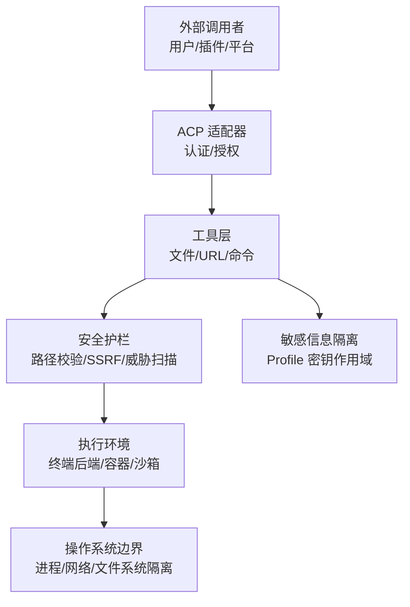
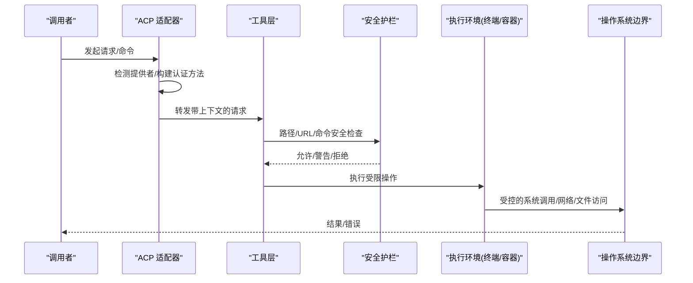
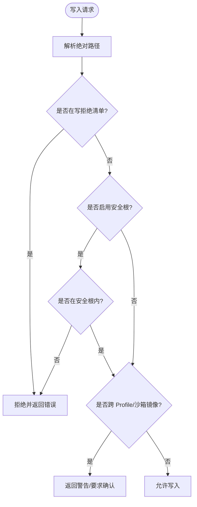
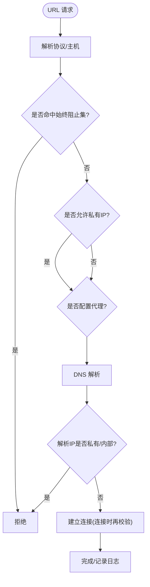
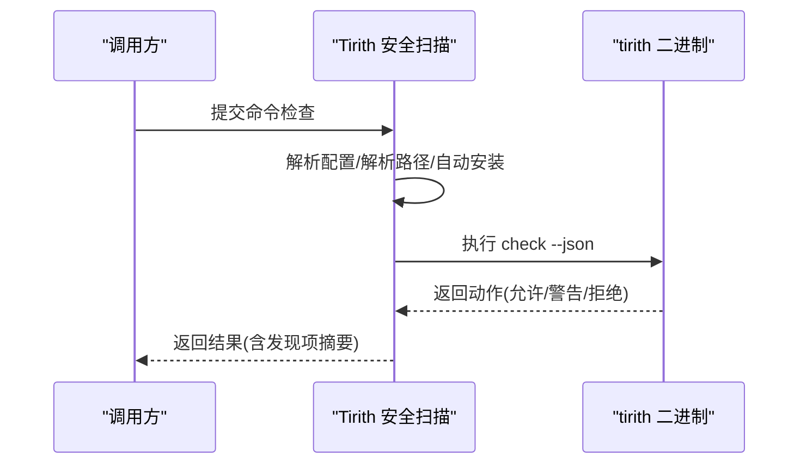
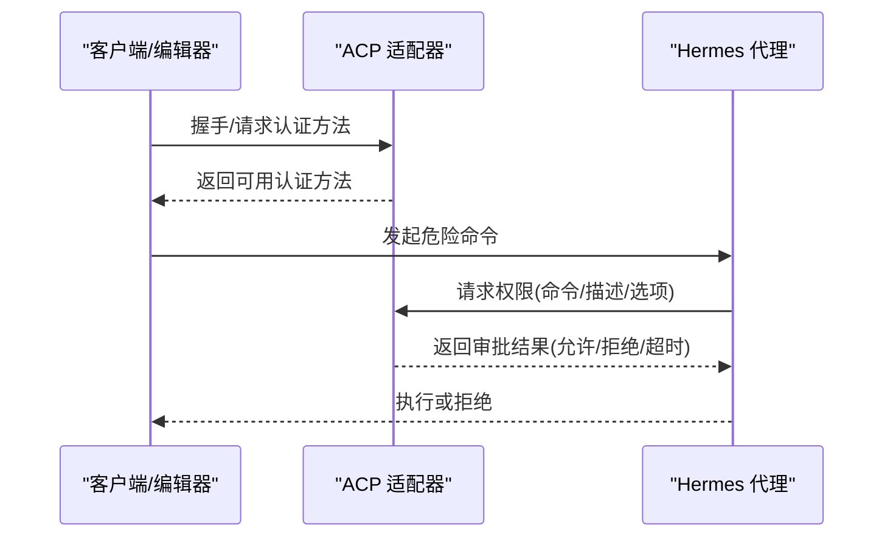
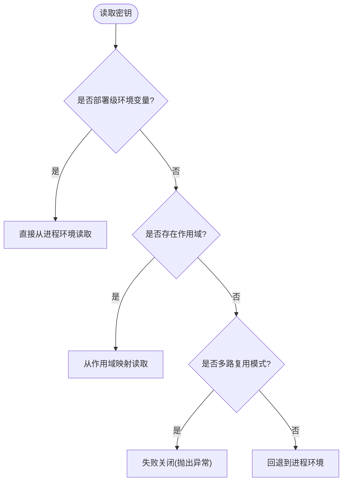
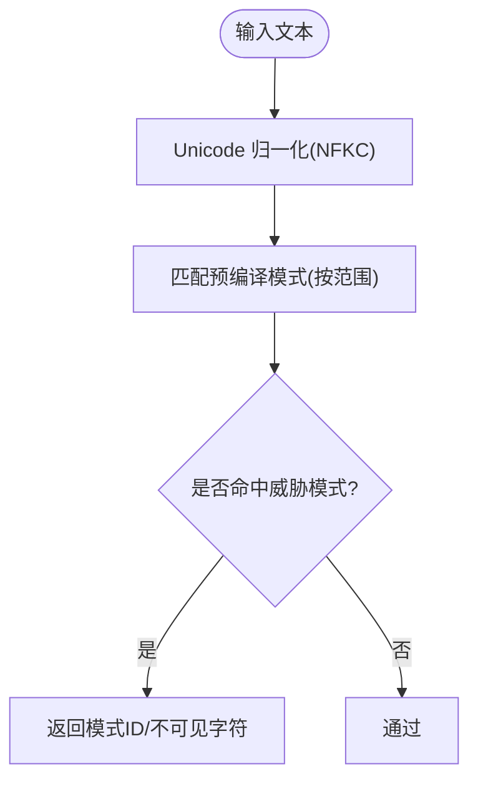
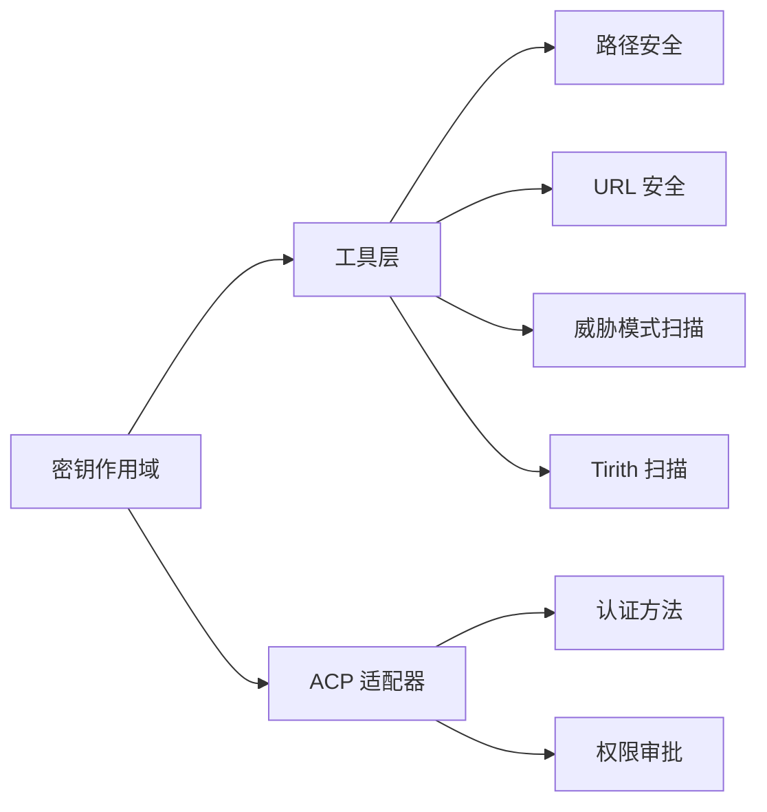

# 安全架构

<cite>
**本文引用的文件**
- [SECURITY.md](file://SECURITY.md)
- [agent/file_safety.py](file://agent/file_safety.py)
- [tools/path_security.py](file://tools/path_security.py)
- [tools/url_safety.py](file://tools/url_safety.py)
- [acp_adapter/auth.py](file://acp_adapter/auth.py)
- [acp_adapter/permissions.py](file://acp_adapter/permissions.py)
- [tools/threat_patterns.py](file://tools/threat_patterns.py)
- [agent/secret_scope.py](file://agent/secret_scope.py)
- [tools/tirith_security.py](file://tools/tirith_security.py)
</cite>

## 目录
1. [简介](#简介)
2. [项目结构](#项目结构)
3. [核心组件](#核心组件)
4. [架构总览](#架构总览)
5. [详细组件分析](#详细组件分析)
6. [依赖关系分析](#依赖关系分析)
7. [性能考虑](#性能考虑)
8. [故障排查指南](#故障排查指南)
9. [结论](#结论)
10. [附录](#附录)

## 简介
本安全架构文档面向系统的安全设计原则、威胁模型与安全控制措施，重点覆盖：
- 文件访问安全与路径验证机制
- 认证授权流程（ACP 适配器）
- 敏感信息保护与密钥隔离
- 沙箱隔离与权限控制
- 审计日志与可观测性
- 安全配置管理、密钥轮换与漏洞防护
- 安全最佳实践与合规性指导

本仓库将“操作系统级隔离”视为唯一承载安全的边界；进程内启发式策略作为辅助防线。对外暴露面（网关平台适配、HTTP 服务、编辑器/IDE 适配器、TUI 网关）均需强制鉴权与白名单控制。

**章节来源**
- [SECURITY.md:32-119](file://SECURITY.md#L32-L119)
- [SECURITY.md:171-223](file://SECURITY.md#L171-L223)

## 项目结构
安全相关能力分布在多个模块中，形成分层防御：
- 安全策略与信任模型：SECURITY.md
- 文件安全与读写限制：agent/file_safety.py
- 路径校验与遍历防护：tools/path_security.py
- URL 安全与 SSRF 防护：tools/url_safety.py
- 认证与授权桥接（ACP）：acp_adapter/auth.py, acp_adapter/permissions.py
- 威胁模式扫描（提示注入/外泄等）：tools/threat_patterns.py
- 多租户/多 Profile 的密钥作用域隔离：agent/secret_scope.py
- 命令执行前内容级威胁扫描（tirith 子进程）：tools/tirith_security.py

**图表来源**
- [SECURITY.md:58-119](file://SECURITY.md#L58-L119)
- [tools/url_safety.py:415-519](file://tools/url_safety.py#L415-L519)
- [agent/file_safety.py:161-178](file://agent/file_safety.py#L161-L178)
- [tools/tirith_security.py:731-800](file://tools/tirith_security.py#L731-L800)

**章节来源**
- [SECURITY.md:58-119](file://SECURITY.md#L58-L119)
- [SECURITY.md:171-223](file://SECURITY.md#L171-L223)

## 核心组件
- 信任模型与边界
  - 唯一承载边界为操作系统级隔离（容器/远程主机/云沙箱或全进程包裹）。
  - 进程内审批门、输出脱敏、技能守卫等为启发式辅助，非安全边界。
- 外部表面与统一规则
  - 所有跨信任边界的入口必须鉴权；网络暴露面需启用调用方白名单。
  - 会话标识仅用于路由，不替代鉴权。
- 文件安全
  - 写拒绝清单与只允许写入的安全根目录（SPARKII_WRITE_SAFE_ROOT）。
  - 读拒绝清单保护内部缓存、凭证存储与项目 .env 文件。
  - 跨 Profile 写入与沙箱镜像写入软保护，防止误写与状态分裂。
- URL 安全
  - 阻止私有/内部地址与云元数据端点，支持全局开关与可信主机例外。
  - 连接时二次校验，缓解 DNS 重绑定风险。
- 命令执行安全
  - 通过 tirith 子进程进行内容级威胁扫描（提示注入、管道注入、终端注入等），支持自动安装、签名校验与熔断。
- 认证与授权
  - ACP 适配器检测运行时提供者并通告可用认证方法。
  - 危险命令审批通过 ACP 权限请求桥接到前端/客户端决策。
- 敏感信息保护
  - 多 Profile 下使用上下文变量隔离密钥，避免泄露到子进程或跨 Profile。
  - 严格区分部署级环境变量与 Profile 级密钥。

**章节来源**
- [SECURITY.md:58-119](file://SECURITY.md#L58-L119)
- [SECURITY.md:171-223](file://SECURITY.md#L171-L223)
- [agent/file_safety.py:28-178](file://agent/file_safety.py#L28-L178)
- [tools/url_safety.py:415-519](file://tools/url_safety.py#L415-L519)
- [tools/tirith_security.py:731-800](file://tools/tirith_security.py#L731-L800)
- [acp_adapter/auth.py:11-79](file://acp_adapter/auth.py#L11-L79)
- [acp_adapter/permissions.py:110-183](file://acp_adapter/permissions.py#L110-L183)
- [agent/secret_scope.py:132-186](file://agent/secret_scope.py#L132-L186)

## 架构总览
下图展示从外部输入到执行环境的完整安全链路，强调“OS 级隔离”为唯一承载边界，其余均为辅助防线。

**图表来源**
- [acp_adapter/auth.py:11-79](file://acp_adapter/auth.py#L11-L79)
- [tools/path_security.py:15-44](file://tools/path_security.py#L15-L44)
- [tools/url_safety.py:415-519](file://tools/url_safety.py#L415-L519)
- [tools/tirith_security.py:731-800](file://tools/tirith_security.py#L731-L800)
- [SECURITY.md:58-119](file://SECURITY.md#L58-L119)

## 详细组件分析

### 文件访问安全与路径验证
- 写拒绝清单与只允许安全根
  - 明确禁止写入 SSH 密钥、OAuth 缓存、.env、sudoers 等敏感路径。
  - 当设置 SPARKII_WRITE_SAFE_ROOT 后，仅允许在该目录树内写入。
- 读拒绝清单
  - 阻止直接读取内部缓存、凭证存储与项目 .env 文件，降低凭据泄露面。
- 跨 Profile 与沙箱镜像写入软保护
  - 识别目标是否属于其他 Profile 或沙箱镜像，返回警告并要求显式确认。
- 路径校验工具
  - validate_within_dir 确保解析后的路径在允许根目录下，has_traversal_component 快速检测 .. 穿越。

**图表来源**
- [agent/file_safety.py:28-178](file://agent/file_safety.py#L28-L178)
- [agent/file_safety.py:364-506](file://agent/file_safety.py#L364-L506)
- [agent/file_safety.py:509-616](file://agent/file_safety.py#L509-L616)
- [tools/path_security.py:15-44](file://tools/path_security.py#L15-L44)

**章节来源**
- [agent/file_safety.py:28-178](file://agent/file_safety.py#L28-L178)
- [agent/file_safety.py:364-506](file://agent/file_safety.py#L364-L506)
- [agent/file_safety.py:509-616](file://agent/file_safety.py#L509-L616)
- [tools/path_security.py:15-44](file://tools/path_security.py#L15-L44)

### URL 安全与 SSRF 防护
- 始终阻止云元数据主机名与链接本地地址段。
- 默认阻止私有/内部 IP，可通过配置或环境变量开启例外（谨慎使用）。
- 连接时再次校验实际解析到的 IP，减少 DNS 重绑定窗口。
- 对含敏感查询参数的 URL 进行识别与告警。

**图表来源**
- [tools/url_safety.py:163-210](file://tools/url_safety.py#L163-L210)
- [tools/url_safety.py:415-519](file://tools/url_safety.py#L415-L519)
- [tools/url_safety.py:539-595](file://tools/url_safety.py#L539-L595)

**章节来源**
- [tools/url_safety.py:163-210](file://tools/url_safety.py#L163-L210)
- [tools/url_safety.py:415-519](file://tools/url_safety.py#L415-L519)
- [tools/url_safety.py:539-595](file://tools/url_safety.py#L539-L595)

### 命令执行前的内容级威胁扫描（Tirith）
- 以子进程方式运行 tirith，对命令进行内容级威胁检测（提示注入、管道注入、终端注入等）。
- 自动下载与安装，支持 SHA-256 校验与可选 cosign 供应链证明。
- 失败回退与熔断：连续失败触发熔断，避免卡死；fail_open 配置决定失败时的行为。

**图表来源**
- [tools/tirith_security.py:731-800](file://tools/tirith_security.py#L731-L800)
- [tools/tirith_security.py:386-483](file://tools/tirith_security.py#L386-L483)
- [tools/tirith_security.py:488-599](file://tools/tirith_security.py#L488-L599)

**章节来源**
- [tools/tirith_security.py:731-800](file://tools/tirith_security.py#L731-L800)
- [tools/tirith_security.py:386-483](file://tools/tirith_security.py#L386-L483)
- [tools/tirith_security.py:488-599](file://tools/tirith_security.py#L488-L599)

### 认证与授权流程（ACP 适配器）
- 认证
  - 检测当前运行时提供者与凭据可用性，通告可用的认证方法（包括终端设置向导）。
- 授权
  - 危险命令审批通过 ACP 权限请求桥接，映射为一次性/会话/永久允许或拒绝。
  - 超时或未响应默认拒绝，保障最小权限。

**图表来源**
- [acp_adapter/auth.py:11-79](file://acp_adapter/auth.py#L11-L79)
- [acp_adapter/permissions.py:110-183](file://acp_adapter/permissions.py#L110-L183)

**章节来源**
- [acp_adapter/auth.py:11-79](file://acp_adapter/auth.py#L11-L79)
- [acp_adapter/permissions.py:110-183](file://acp_adapter/permissions.py#L110-L183)

### 敏感信息保护与密钥隔离
- 多 Profile 密钥作用域
  - 通过上下文变量安装当前 Profile 的密钥映射，避免泄露到其他 Profile 或子进程。
  - 严格区分部署级环境变量（如 PATH、HOME、API_SERVER_*）与 Profile 级密钥。
  - 未安装作用域且处于多路复用模式时，读取密钥会失败关闭，防止跨 Profile 泄露。
- 配置文件与 .env 解析
  - 安全地解析 .env 文件，剥离注释与转义，不污染进程环境。

**图表来源**
- [agent/secret_scope.py:132-186](file://agent/secret_scope.py#L132-L186)
- [agent/secret_scope.py:226-294](file://agent/secret_scope.py#L226-L294)

**章节来源**
- [agent/secret_scope.py:132-186](file://agent/secret_scope.py#L132-L186)
- [agent/secret_scope.py:226-294](file://agent/secret_scope.py#L226-L294)

### 威胁模式扫描（提示注入/外泄/持久化）
- 集中化的正则模式库，按范围（all/context/strict）应用，平衡误报与漏报。
- 检测类别包括：经典提示注入、角色劫持、C2/Brainworm 特征、外泄指令、SSH 后门、硬编码密钥等。
- 提供首次威胁消息生成，便于上层阻断或告警。

**图表来源**
- [tools/threat_patterns.py:162-255](file://tools/threat_patterns.py#L162-L255)
- [tools/threat_patterns.py:258-276](file://tools/threat_patterns.py#L258-L276)

**章节来源**
- [tools/threat_patterns.py:162-255](file://tools/threat_patterns.py#L162-L255)
- [tools/threat_patterns.py:258-276](file://tools/threat_patterns.py#L258-L276)

## 依赖关系分析
- 组件耦合
  - 工具层依赖路径校验、URL 安全与威胁扫描，形成横向安全护栏。
  - ACP 适配器与审批流程与工具层解耦，通过回调桥接外部决策。
  - 密钥作用域贯穿各组件，确保多 Profile 下的隔离。
- 外部依赖
  - httpx/httpcore 用于网络请求，结合 SSRF 安全传输。
  - tirith 二进制用于命令内容级扫描，具备自动安装与签名校验。
- 潜在循环依赖
  - 通过延迟导入与局部导入避免循环依赖（例如 file_safety 中的常量模块）。

**图表来源**
- [tools/path_security.py:15-44](file://tools/path_security.py#L15-L44)
- [tools/url_safety.py:415-519](file://tools/url_safety.py#L415-L519)
- [tools/threat_patterns.py:162-255](file://tools/threat_patterns.py#L162-L255)
- [tools/tirith_security.py:731-800](file://tools/tirith_security.py#L731-L800)
- [acp_adapter/auth.py:11-79](file://acp_adapter/auth.py#L11-L79)
- [acp_adapter/permissions.py:110-183](file://acp_adapter/permissions.py#L110-L183)
- [agent/secret_scope.py:132-186](file://agent/secret_scope.py#L132-L186)

**章节来源**
- [tools/path_security.py:15-44](file://tools/path_security.py#L15-L44)
- [tools/url_safety.py:415-519](file://tools/url_safety.py#L415-L519)
- [tools/threat_patterns.py:162-255](file://tools/threat_patterns.py#L162-L255)
- [tools/tirith_security.py:731-800](file://tools/tirith_security.py#L731-L800)
- [acp_adapter/auth.py:11-79](file://acp_adapter/auth.py#L11-L79)
- [acp_adapter/permissions.py:110-183](file://acp_adapter/permissions.py#L110-L183)
- [agent/secret_scope.py:132-186](file://agent/secret_scope.py#L132-L186)

## 性能考虑
- URL 安全
  - DNS 解析可能阻塞事件循环，提供异步版本以避免主线程阻塞。
  - 连接时二次校验增加少量开销，但显著降低 SSRF 风险。
- 威胁模式扫描
  - 限制最大扫描长度，避免长文本导致的正则回溯开销。
- Tirith 扫描
  - 自动安装与签名校验在后台线程进行，避免启动阻塞。
  - 熔断机制防止持续失败导致的服务挂起。

[本节为通用性能建议，无需特定文件引用]

## 故障排查指南
- 文件写入被拒
  - 检查目标路径是否在写拒绝清单或安全根之外；必要时调整 SPARKII_WRITE_SAFE_ROOT。
  - 关注跨 Profile 或沙箱镜像写入警告，确认意图后再继续。
- URL 请求被拒
  - 若命中始终阻止集（云元数据/链接本地），无法通过配置放行。
  - 私有 IP 阻断可通过配置或环境变量放开，但需谨慎评估风险。
- 命令执行被阻断
  - 查看 tirith 返回的动作与摘要；若因二进制缺失或超时，检查安装状态与 fail_open 配置。
- 认证/授权问题
  - 确认 ACP 适配器已检测到有效提供者；若未配置，使用终端设置向导初始化。
  - 审批超时或未响应将被视为拒绝，检查客户端连接与超时设置。
- 密钥读取失败
  - 在多路复用模式下，确保每个任务都安装了正确的密钥作用域；否则将失败关闭。

**章节来源**
- [agent/file_safety.py:161-178](file://agent/file_safety.py#L161-L178)
- [tools/url_safety.py:415-519](file://tools/url_safety.py#L415-L519)
- [tools/tirith_security.py:731-800](file://tools/tirith_security.py#L731-L800)
- [acp_adapter/auth.py:11-79](file://acp_adapter/auth.py#L11-L79)
- [acp_adapter/permissions.py:110-183](file://acp_adapter/permissions.py#L110-L183)
- [agent/secret_scope.py:132-186](file://agent/secret_scope.py#L132-L186)

## 结论
本系统以“操作系统级隔离”为核心安全边界，辅以文件安全、URL 安全、命令内容级扫描、认证授权与密钥隔离等多层防护。生产部署应优先采用容器/远程主机/云沙箱或全进程包裹，并对所有网络暴露面启用调用方白名单与鉴权。通过严格的写拒绝清单、安全根、读拒绝清单与跨 Profile/沙箱镜像软保护，降低误用与泄露风险。密钥作用域在多 Profile 场景下确保最小可见性。建议持续审查第三方技能与插件，遵循最小权限与零信任原则。

[本节为总结性内容，无需特定文件引用]

## 附录
- 安全配置管理
  - 通过配置与环境变量控制私有 URL 允许、tirith 开关、超时与失败回退策略。
  - 多路复用模式下，确保每任务安装密钥作用域，避免跨 Profile 泄露。
- 密钥轮换
  - 将密钥存放于受保护的凭据文件或 Provider 存储，定期轮换并限制访问权限。
  - 更新 .env 或 Provider 后，确保作用域重新加载。
- 漏洞防护
  - 保持依赖与二进制更新，启用供应链校验（SHA-256/cosign）。
  - 对第三方技能与插件进行安装前审查，利用技能守卫与安装审计日志。
- 合规性指导
  - 遵循最小权限、零信任、纵深防御原则。
  - 对所有外部表面实施鉴权与白名单，避免公开暴露。
  - 记录并审计关键安全事件（拒绝、警告、超时、熔断）。

[本节为通用指导，无需特定文件引用]