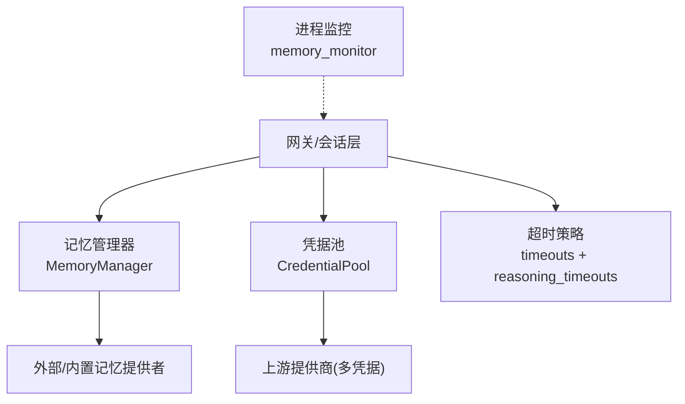
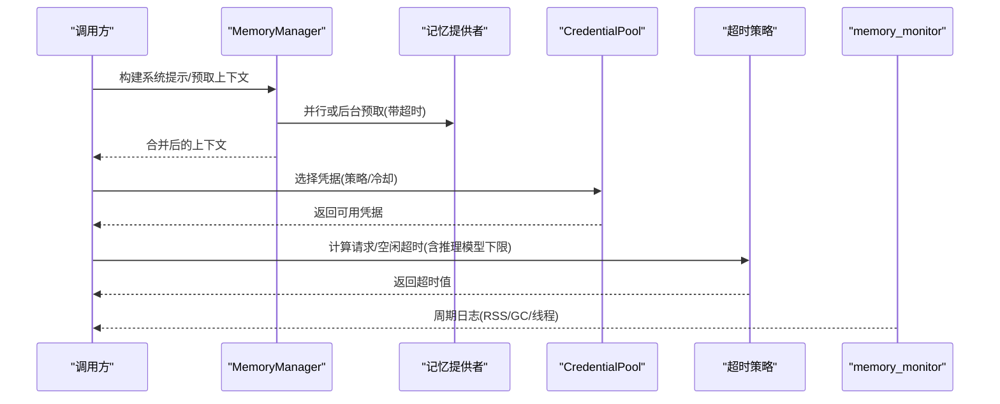
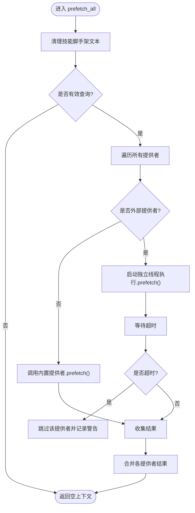
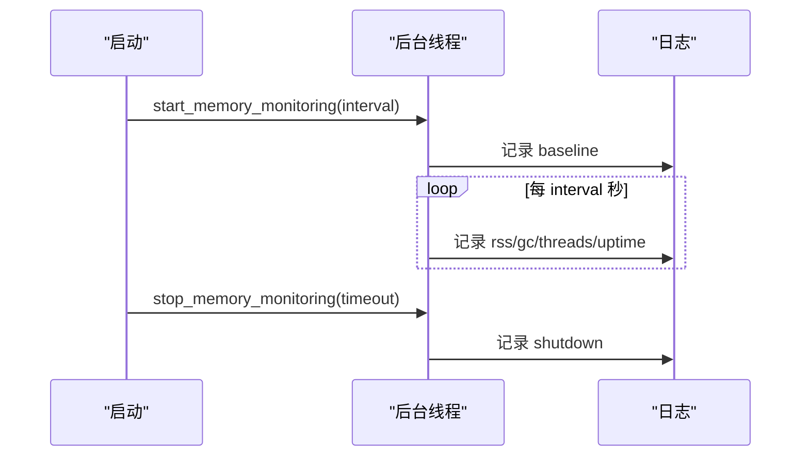
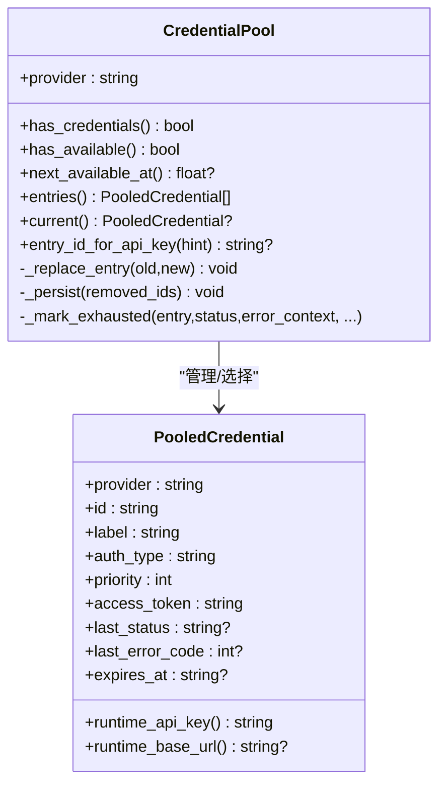
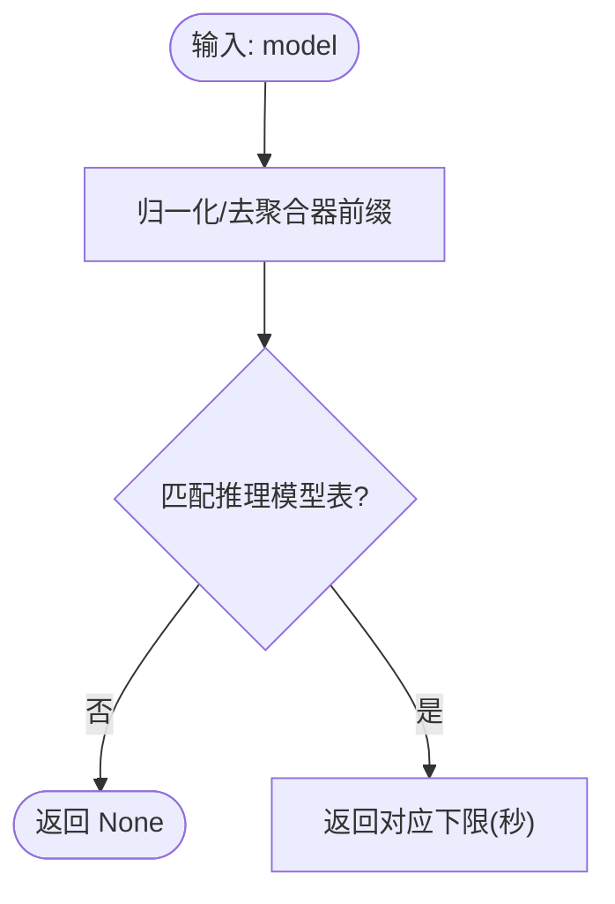
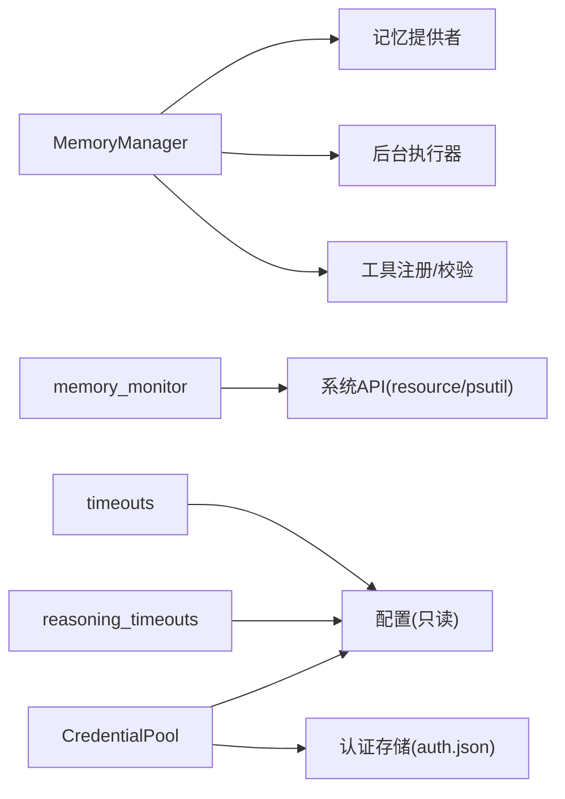

# 性能架构

<cite>
**本文引用的文件**
- [agent/memory_manager.py](file://agent/memory_manager.py)
- [gateway/memory_monitor.py](file://gateway/memory_monitor.py)
- [agent/credential_pool.py](file://agent/credential_pool.py)
- [agent/reasoning_timeouts.py](file://agent/reasoning_timeouts.py)
- [sparkii_cli/timeouts.py](file://sparkii_cli/timeouts.py)
</cite>

## 目录
1. [简介](#简介)
2. [项目结构](#项目结构)
3. [核心组件](#核心组件)
4. [架构总览](#架构总览)
5. [详细组件分析](#详细组件分析)
6. [依赖关系分析](#依赖关系分析)
7. [性能考量](#性能考量)
8. [故障排查指南](#故障排查指南)
9. [结论](#结论)
10. [附录](#附录)

## 简介
本性能架构文档聚焦于系统的资源管理、扩展性与稳定性，围绕内存管理、缓存策略、连接池与认证池、异步处理、超时控制、负载均衡与水平扩展、故障转移与优雅降级、监控指标与瓶颈分析、以及性能测试与调优方法展开。内容基于仓库中实际实现进行提炼，确保可追溯与可落地。

## 项目结构
与性能相关的关键模块分布在以下位置：
- 内存管理与后台任务调度：agent/memory_manager.py
- 进程级内存监控：gateway/memory_monitor.py
- 多凭据池与故障转移：agent/credential_pool.py
- 推理模型超时下限（防上游空闲断开）：agent/reasoning_timeouts.py
- 请求/空闲超时配置读取：sparkii_cli/timeouts.py

图表来源
- [agent/memory_manager.py:364-757](file://agent/memory_manager.py#L364-L757)
- [gateway/memory_monitor.py:139-224](file://gateway/memory_monitor.py#L139-L224)
- [agent/credential_pool.py:633-768](file://agent/credential_pool.py#L633-L768)
- [agent/reasoning_timeouts.py:177-232](file://agent/reasoning_timeouts.py#L177-L232)
- [sparkii_cli/timeouts.py:14-83](file://sparkii_cli/timeouts.py#L14-L83)

章节来源
- [agent/memory_manager.py:364-757](file://agent/memory_manager.py#L364-L757)
- [gateway/memory_monitor.py:139-224](file://gateway/memory_monitor.py#L139-L224)
- [agent/credential_pool.py:633-768](file://agent/credential_pool.py#L633-L768)
- [agent/reasoning_timeouts.py:177-232](file://agent/reasoning_timeouts.py#L177-L232)
- [sparkii_cli/timeouts.py:14-83](file://sparkii_cli/timeouts.py#L14-L83)

## 核心组件
- 记忆管理器（MemoryManager）
  - 统一编排内置与外部记忆提供者的预取与同步，使用单工作线程的后台执行器串行化写入，避免慢/卡死提供者阻塞主流程；对外部预取设置超时并隔离线程，防止长时间占用。
  - 工具模式注入时做名称规范化与冲突保护，避免污染请求的工具集。
- 进程内存监控（memory_monitor）
  - 周期性记录 RSS、GC 计数、线程数与运行时长，便于发现长驻进程的内存泄漏；支持优雅停止并在退出前输出最终快照。
- 凭据池（CredentialPool）
  - 多凭据选择、轮换与冷却（TTL），支持多种策略（填充优先、轮询、随机、最少使用）；对 401/429/402 等错误分类并设置不同冷却时间；在唯一凭据场景下缩短冷却窗口以尽快恢复；持久化状态并写回全局根存储以避免多实例竞争导致的刷新令牌失效。
- 推理模型超时下限（reasoning_timeouts）
  - 为已知“推理型”模型提供最小空闲超时下限，避免上游代理/负载均衡在思考阶段提前断开连接；仅作为下限，不覆盖用户显式配置。
- 超时配置读取（timeouts）
  - 从配置中解析 provider/model 级别的 request_timeout_seconds 与 stale_timeout_seconds，供上层调用方应用。

章节来源
- [agent/memory_manager.py:364-757](file://agent/memory_manager.py#L364-L757)
- [gateway/memory_monitor.py:139-224](file://gateway/memory_monitor.py#L139-L224)
- [agent/credential_pool.py:633-768](file://agent/credential_pool.py#L633-L768)
- [agent/reasoning_timeouts.py:177-232](file://agent/reasoning_timeouts.py#L177-L232)
- [sparkii_cli/timeouts.py:14-83](file://sparkii_cli/timeouts.py#L14-L83)

## 架构总览
系统通过“会话/网关”作为入口，将请求路由到记忆、凭据、超时等子系统。记忆管理器负责将上下文预取与同步卸载到后台，凭据池负责多凭据选择与故障转移，超时子系统保障上游链路不被空闲断开，进程监控提供可观测性。

图表来源
- [agent/memory_manager.py:525-595](file://agent/memory_manager.py#L525-L595)
- [agent/credential_pool.py:633-768](file://agent/credential_pool.py#L633-L768)
- [agent/reasoning_timeouts.py:177-232](file://agent/reasoning_timeouts.py#L177-L232)
- [sparkii_cli/timeouts.py:14-83](file://sparkii_cli/timeouts.py#L14-L83)
- [gateway/memory_monitor.py:139-224](file://gateway/memory_monitor.py#L139-L224)

## 详细组件分析

### 记忆管理器（MemoryManager）
- 设计要点
  - 单工作线程后台执行器：保证同一提供者的写入顺序（turn N 先于 turn N+1），避免并发写导致的数据不一致。
  - 外部预取隔离：每个外部提供者的预取在独立线程中进行，并设置超时，避免阻塞当前对话。
  - 工具模式注入安全：对工具 schema 做标准化与冲突检测，避免污染请求。
  - 优雅关闭：后台任务有超时与放弃机制，不会阻止进程退出。
- 关键流程（预取/同步）
  - 预取：清理技能脚手架文本 -> 遍历提供者 -> 外部提供者线程化并超时 -> 合并结果。
  - 同步：清理用户内容 -> 提交到单工作线程执行器 -> 异常被捕获并记录，不影响主流程。

图表来源
- [agent/memory_manager.py:525-595](file://agent/memory_manager.py#L525-L595)

章节来源
- [agent/memory_manager.py:364-757](file://agent/memory_manager.py#L364-L757)
- [agent/memory_manager.py:525-595](file://agent/memory_manager.py#L525-L595)

### 进程内存监控（memory_monitor）
- 功能
  - 周期性输出结构化日志行，包含 RSS、GC 计数、线程数与运行时长。
  - 启动时记录基线，停止时记录最终快照；失败不阻断主流程。
- 适用场景
  - 长驻进程（网关/代理）的内存泄漏定位与趋势观察。

图表来源
- [gateway/memory_monitor.py:139-224](file://gateway/memory_monitor.py#L139-L224)

章节来源
- [gateway/memory_monitor.py:139-224](file://gateway/memory_monitor.py#L139-L224)

### 凭据池（CredentialPool）
- 能力
  - 多凭据选择策略：填充优先、轮询、随机、最少使用。
  - 冷却与恢复：根据错误码与语义分类（如计费限制）设置不同冷却时间；在唯一凭据场景缩短冷却以快速恢复。
  - 持久化与写回：旋转刷新令牌后写回全局根存储，避免多实例共享时的令牌失效问题。
- 故障转移
  - 自动切换到下一个可用凭据；当全部耗尽时给出“下次可用时间”，供上层退避。

图表来源
- [agent/credential_pool.py:185-289](file://agent/credential_pool.py#L185-L289)
- [agent/credential_pool.py:633-768](file://agent/credential_pool.py#L633-L768)

章节来源
- [agent/credential_pool.py:633-768](file://agent/credential_pool.py#L633-L768)

### 推理模型超时下限（reasoning_timeouts）
- 目标
  - 为已知推理模型提供最小空闲超时下限，避免上游代理/负载均衡在“思考阶段”提前断开。
- 规则
  - 仅作为下限，不覆盖用户显式配置；非推理模型不受影响。
  - 匹配基于模型 slug 的正则边界匹配，避免误配。

图表来源
- [agent/reasoning_timeouts.py:177-232](file://agent/reasoning_timeouts.py#L177-L232)

章节来源
- [agent/reasoning_timeouts.py:177-232](file://agent/reasoning_timeouts.py#L177-L232)

### 超时配置读取（timeouts）
- 能力
  - 从配置中读取 provider/model 级别的 request_timeout_seconds 与 stale_timeout_seconds。
  - 用于上层决定请求超时与空闲超时阈值。

章节来源
- [sparkii_cli/timeouts.py:14-83](file://sparkii_cli/timeouts.py#L14-L83)

## 依赖关系分析
- MemoryManager 依赖：
  - 记忆提供者接口（内置/外部）
  - 工具注册与命名空间保护
  - 后台执行器（单工作线程）
- memory_monitor 依赖：
  - 系统资源 API（resource/psutil）
  - 日志系统
- CredentialPool 依赖：
  - 配置读取（只读路径优化）
  - 认证存储（读写 auth.json）
  - 错误分类与消息解析（提取重试延迟/重置时间）
- reasoning_timeouts 与 timeouts 依赖：
  - 配置与模型名解析

图表来源
- [agent/memory_manager.py:364-757](file://agent/memory_manager.py#L364-L757)
- [gateway/memory_monitor.py:139-224](file://gateway/memory_monitor.py#L139-L224)
- [agent/credential_pool.py:633-768](file://agent/credential_pool.py#L633-L768)
- [agent/reasoning_timeouts.py:177-232](file://agent/reasoning_timeouts.py#L177-L232)
- [sparkii_cli/timeouts.py:14-83](file://sparkii_cli/timeouts.py#L14-L83)

章节来源
- [agent/memory_manager.py:364-757](file://agent/memory_manager.py#L364-L757)
- [gateway/memory_monitor.py:139-224](file://gateway/memory_monitor.py#L139-L224)
- [agent/credential_pool.py:633-768](file://agent/credential_pool.py#L633-L768)
- [agent/reasoning_timeouts.py:177-232](file://agent/reasoning_timeouts.py#L177-L232)
- [sparkii_cli/timeouts.py:14-83](file://sparkii_cli/timeouts.py#L14-L83)

## 性能考量
- 内存管理
  - 后台任务与线程隔离：记忆预取/同步走后台线程与单工作线程执行器，避免阻塞主流程；外部预取带超时，防止卡死。
  - 进程级监控：周期性记录 RSS/GC/线程，便于发现泄漏与容量规划。
- 缓存策略
  - 记忆提供者可在其内部实现缓存；管理器层面只做调度与超时控制，不引入额外缓存层级，减少一致性风险。
- 连接池与认证池
  - 凭据池提供多凭据选择与冷却，降低单点失败影响；支持策略化负载分配（轮询/随机/最少使用）。
- 异步处理
  - 记忆同步/预取异步化；外部预取线程化并超时；后台执行器串行化写入，保证顺序与可控并发。
- 负载均衡与水平扩展
  - 凭据池策略天然具备横向扩展能力（增加更多凭据即可分摊压力）；结合上游多端点/多租户配置可实现更细粒度分流。
- 故障转移与优雅降级
  - 凭据池自动切换下一可用凭据；记忆提供者失败不阻塞其他提供者；推理模型超时下限避免上游空闲断开导致的频繁失败。
- 资源限制与超时控制
  - 外部预取超时、推理模型空闲超时下限、请求/空闲超时均可配置；凭据池按错误类型设置冷却时间，避免雪崩。
- 监控指标建议
  - 进程级：RSS、GC 计数、活跃线程数、运行时长（由 memory_monitor 提供）。
  - 业务级：凭据池选择次数、冷却触发次数、下次可用时间；记忆提供者预取/同步耗时与失败率；推理模型超时命中次数。
- 瓶颈分析与优化建议
  - 若记忆提供者响应慢：启用 queue_prefetch_all 与后台同步，调整外部预取超时；评估提供者自身缓存与索引。
  - 若凭据池频繁冷却：检查上游限流/计费限制，增加凭据数量或调整策略；关注 402/429 的冷却策略。
  - 若推理模型频繁中断：确认已启用推理模型超时下限，必要时提高用户配置的超时。

[本节为通用指导，无需特定文件引用]

## 故障排查指南
- 症状：对话完成后仍长时间处于“运行中”
  - 可能原因：某个记忆提供者 sync_turn 阻塞或网络挂起
  - 处理：确认后台执行器存在且未卡死；查看日志中“sync_turn failed”；必要时调整外部预取/同步超时
  - 参考
    - [agent/memory_manager.py:638-694](file://agent/memory_manager.py#L638-L694)
- 症状：进程内存持续增长
  - 可能原因：缓存/会话/连接未释放
  - 处理：查看 memory_monitor 输出的 RSS/GC/线程趋势；定位增长热点
  - 参考
    - [gateway/memory_monitor.py:139-224](file://gateway/memory_monitor.py#L139-L224)
- 症状：上游鉴权失败或限流
  - 可能原因：凭据过期/配额耗尽/服务端限流
  - 处理：查看凭据池冷却与轮换；必要时增加凭据或调整策略
  - 参考
    - [agent/credential_pool.py:633-768](file://agent/credential_pool.py#L633-L768)
- 症状：推理模型流式响应中途断开
  - 可能原因：上游空闲超时短于默认检测
  - 处理：启用推理模型超时下限，或提升用户配置的空闲超时
  - 参考
    - [agent/reasoning_timeouts.py:177-232](file://agent/reasoning_timeouts.py#L177-L232)
    - [sparkii_cli/timeouts.py:14-83](file://sparkii_cli/timeouts.py#L14-L83)

章节来源
- [agent/memory_manager.py:638-694](file://agent/memory_manager.py#L638-L694)
- [gateway/memory_monitor.py:139-224](file://gateway/memory_monitor.py#L139-L224)
- [agent/credential_pool.py:633-768](file://agent/credential_pool.py#L633-L768)
- [agent/reasoning_timeouts.py:177-232](file://agent/reasoning_timeouts.py#L177-L232)
- [sparkii_cli/timeouts.py:14-83](file://sparkii_cli/timeouts.py#L14-L83)

## 结论
本架构通过后台异步化、凭据池多活与冷却、推理模型超时下限与进程级监控，构建了高可用、可扩展且可观测的性能基线。建议在部署侧配合凭据规模与上游限流策略进行容量规划，并通过监控指标持续验证与调优。

[本节为总结，无需特定文件引用]

## 附录
- 性能测试方法建议
  - 压测维度：QPS、P95/P99 延迟、错误率、凭据池冷却频率、记忆提供者吞吐
  - 工具：使用现有测试框架构造并发请求，观察 memory_monitor 与凭据池日志
- 调优清单
  - 合理设置外部预取超时与后台同步队列长度
  - 依据上游限流策略调整凭据池冷却时间与策略
  - 针对推理模型启用超时下限并评估用户配置上限
  - 定期审查 memory_monitor 趋势，识别潜在泄漏与容量瓶颈

[本节为通用指导，无需特定文件引用]