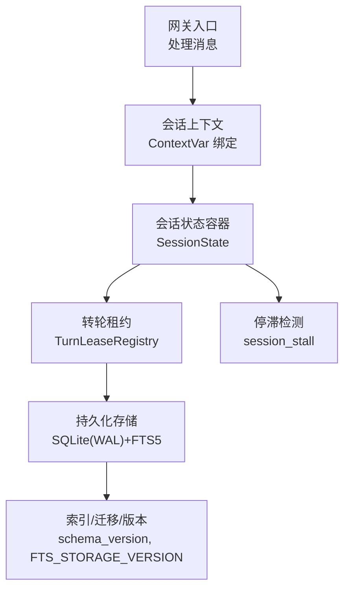
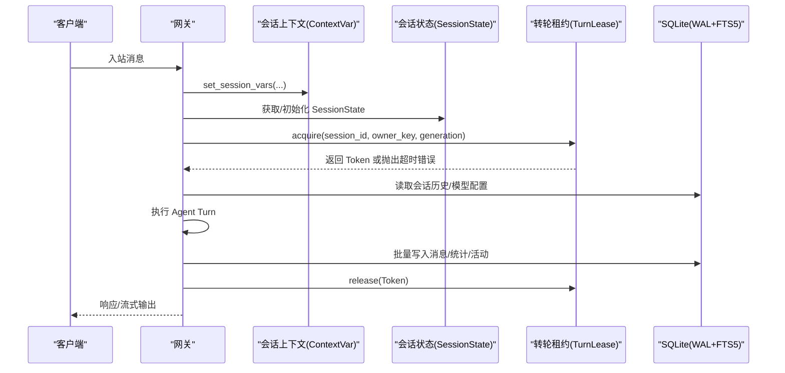
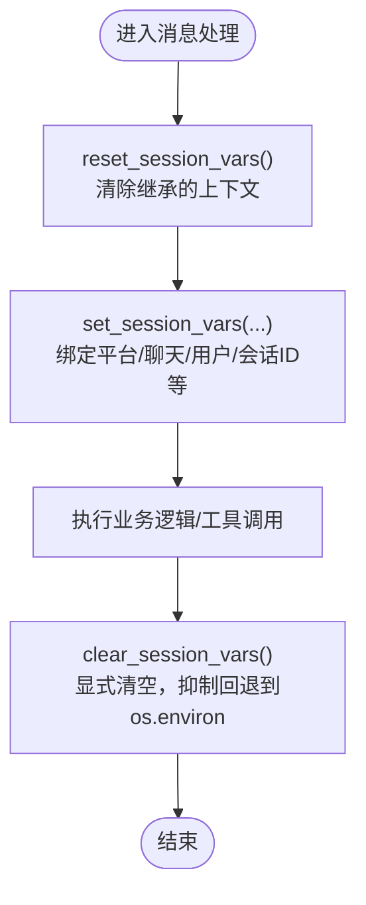
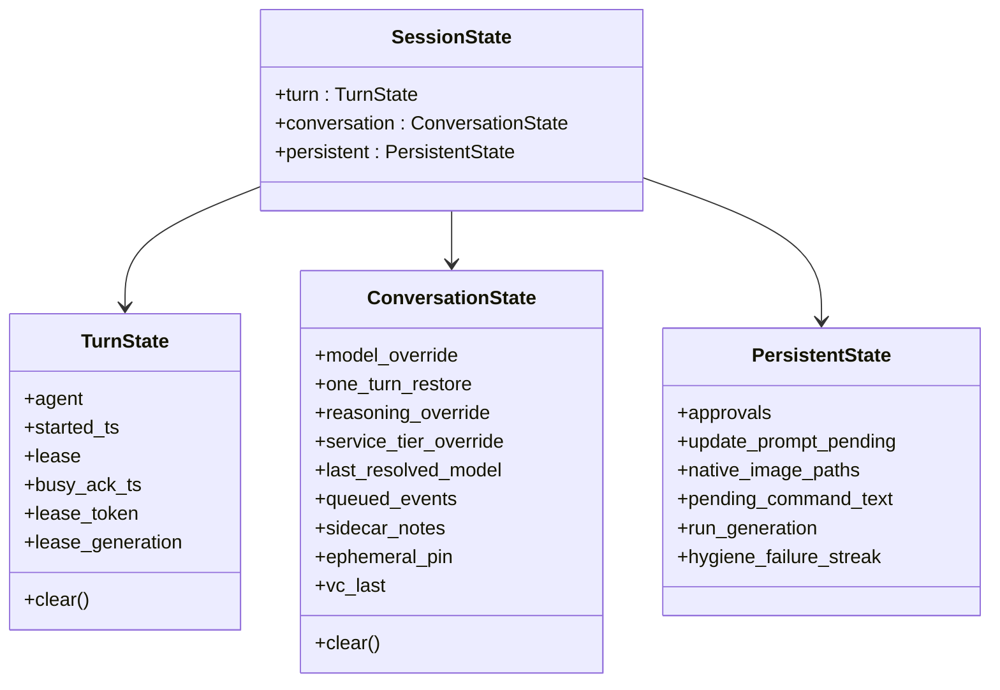
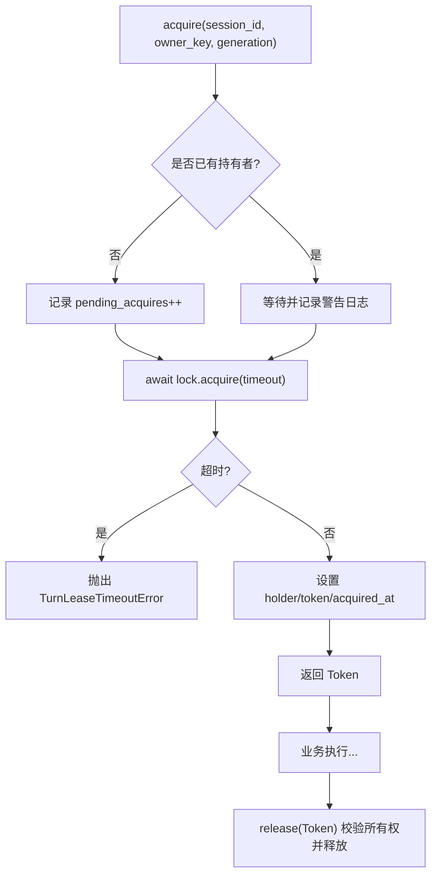
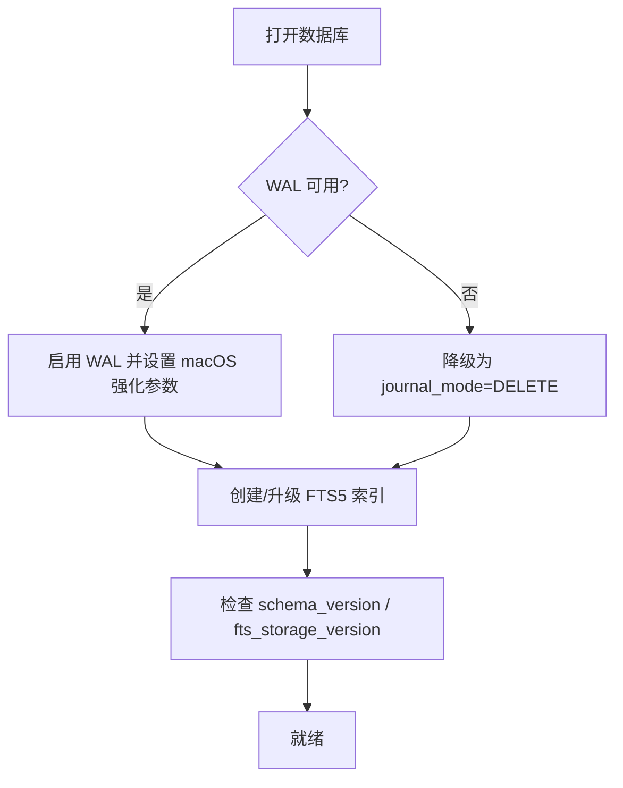
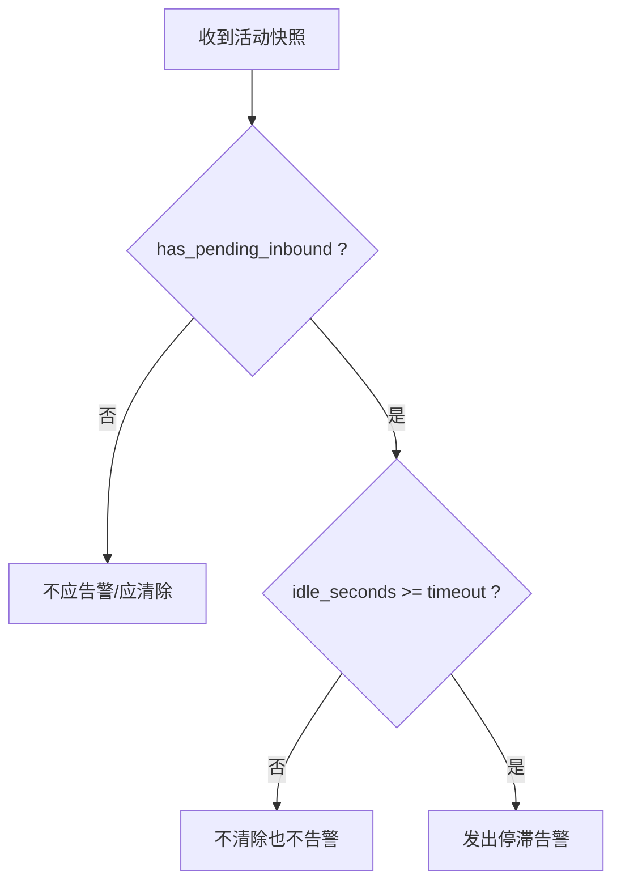
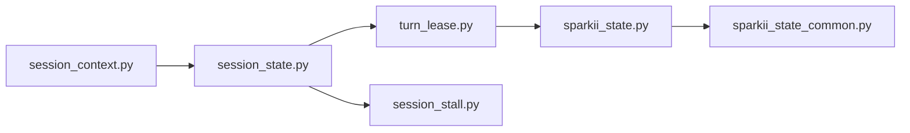

# 会话状态同步

<cite>
**本文引用的文件**
- [gateway/session.py](file://gateway/session.py)
- [gateway/session_state.py](file://gateway/session_state.py)
- [gateway/session_context.py](file://gateway/session_context.py)
- [gateway/turn_lease.py](file://gateway/turn_lease.py)
- [sparkii_state.py](file://sparkii_state.py)
- [sparkii_state_common.py](file://sparkii_state_common.py)
- [gateway/session_stall.py](file://gateway/session_stall.py)
</cite>

## 目录
1. [简介](#简介)
2. [项目结构](#项目结构)
3. [核心组件](#核心组件)
4. [架构总览](#架构总览)
5. [详细组件分析](#详细组件分析)
6. [依赖关系分析](#依赖关系分析)
7. [性能考量](#性能考量)
8. [故障恢复与一致性](#故障恢复与一致性)
9. [序列化、迁移与兼容性](#序列化迁移与兼容性)
10. [结论](#结论)

## 简介
本文件面向多进程、多线程环境下的“会话状态同步”主题，系统性说明：
- 会话上下文、用户状态与配置信息的同步策略
- 分布式锁（进程内异步锁）、乐观锁与冲突解决机制
- 状态同步流程图、数据一致性模型与故障恢复策略
- 会话状态的序列化格式、迁移方案与性能优化技术

该实现以网关为核心，结合进程内上下文变量、会话级状态容器、按会话的转轮租约以及 SQLite 持久化存储，确保在高并发、跨平台接入场景下会话的一致性与可恢复性。

## 项目结构
围绕会话状态同步的关键代码分布在以下模块：
- 会话上下文：使用 contextvars 提供任务级隔离，避免并发消息互相覆盖
- 会话状态容器：将运行期、对话期、持久化三类状态分层管理，统一生命周期
- 转轮租约：对每个已解析的 session_id 串行化“加载历史→运行→刷新”区域
- 持久化存储：SQLite WAL 模式 + FTS5 全文检索，支持高并发读与单写者
- 停滞检测：基于活动快照的策略，用于告警与超时控制

**图表来源**
- [gateway/session_context.py:74-148](file://gateway/session_context.py#L74-L148)
- [gateway/session_state.py:51-178](file://gateway/session_state.py#L51-L178)
- [gateway/turn_lease.py:152-264](file://gateway/turn_lease.py#L152-L264)
- [sparkii_state_common.py:197-374](file://sparkii_state_common.py#L197-L374)

**章节来源**
- [gateway/session_context.py:1-148](file://gateway/session_context.py#L1-L148)
- [gateway/session_state.py:1-178](file://gateway/session_state.py#L1-L178)
- [gateway/turn_lease.py:1-264](file://gateway/turn_lease.py#L1-L264)
- [sparkii_state_common.py:197-374](file://sparkii_state_common.py#L197-L374)

## 核心组件
- 会话上下文（ContextVar）：为每个 asyncio 任务提供独立的会话标识、平台、聊天、用户等元信息，避免进程全局环境变量导致的并发覆盖
- 会话状态容器（SessionState）：将状态按生命周期划分为 turn/conversation/persistent 三层，并提供统一的 clear() 语义，消除边界漂移和竞态重置
- 转轮租约（TurnLease）：按 session_id 串行化“读取历史→执行→写入”的关键路径，防止多路由键映射到同一会话导致的历史交错
- 持久化存储（SQLite）：WAL 模式提升并发读能力；FTS5 提供高效全文检索；压缩/分支通过 parent_session_id 链式组织
- 停滞检测（Stall Policy）：基于共享活动快照判定是否发送“会话停滞”通知，避免误报与重复告警

**章节来源**
- [gateway/session_context.py:74-148](file://gateway/session_context.py#L74-L148)
- [gateway/session_state.py:51-178](file://gateway/session_state.py#L51-L178)
- [gateway/turn_lease.py:152-264](file://gateway/turn_lease.py#L152-L264)
- [sparkii_state_common.py:197-374](file://sparkii_state_common.py#L197-L374)
- [gateway/session_stall.py:27-60](file://gateway/session_stall.py#L27-L60)

## 架构总览
下图展示一次请求从进入网关到落盘的关键流程，突出上下文绑定、状态分层、转轮串行化与持久化：

**图表来源**
- [gateway/session_context.py:206-271](file://gateway/session_context.py#L206-L271)
- [gateway/session_state.py:172-178](file://gateway/session_state.py#L172-L178)
- [gateway/turn_lease.py:191-264](file://gateway/turn_lease.py#L191-L264)
- [sparkii_state_common.py:197-374](file://sparkii_state_common.py#L197-L374)

## 详细组件分析

### 会话上下文（ContextVar）同步
- 设计目标：替代进程全局 os.environ，避免并发消息互相覆盖
- 关键特性：
  - 每个 asyncio 任务拥有独立副本，线程/子任务安全
  - 提供 set_session_vars/clear_session_vars/reset_session_vars 三套接口，分别对应绑定、显式清空、恢复到未设置状态
  - 兼容旧路径：get_session_env 在 ContextVar 未设置时回退到 os.environ
  - 支持声明“无后台投递能力”的会话，避免工具承诺无法兑现的异步结果

**图表来源**
- [gateway/session_context.py:315-360](file://gateway/session_context.py#L315-L360)
- [gateway/session_context.py:206-271](file://gateway/session_context.py#L206-L271)
- [gateway/session_context.py:363-386](file://gateway/session_context.py#L363-L386)

**章节来源**
- [gateway/session_context.py:1-148](file://gateway/session_context.py#L1-L148)
- [gateway/session_context.py:206-386](file://gateway/session_context.py#L206-L386)

### 会话状态容器（SessionState）
- 分层设计：
  - TurnState：每次运行清理（agent、开始时间、busy_ack、租约等）
  - ConversationState：对话边界清理（模型/推理覆盖、队列事件、侧边笔记、语音上下文等）
  - PersistentState：自身生命周期（审批、待更新提示、原生图片、挂起命令文本、运行代数、压缩失败计数等）
- 优势：
  - 消除“边界漂移”：新增字段只需加入 clear()，无需手工维护 pop 列表
  - 避免“整体重置竞态”：不再替换整个字典，而是修改单个字段
  - 提供遗留 dict 视图适配，兼容测试与少量混用点

**图表来源**
- [gateway/session_state.py:51-178](file://gateway/session_state.py#L51-L178)

**章节来源**
- [gateway/session_state.py:1-178](file://gateway/session_state.py#L1-L178)

### 转轮租约（TurnLease）——进程内分布式锁
- 作用域：按已解析的 session_id 串行化“加载历史→运行→刷新”
- 关键机制：
  - 生成号（generation）绑定的令牌，释放时校验所有权，防止陈旧释放
  - 等待超时：超过预算直接抛错，拒绝并发执行
  - 注册表容量上限：仅驱逐空闲条目，不破坏活跃租约
  - 中间旋转重绑定：压缩导致 session_id 变化时，将持有者重绑定到新 id，避免别名窗口

**图表来源**
- [gateway/turn_lease.py:191-264](file://gateway/turn_lease.py#L191-L264)
- [gateway/turn_lease.py:266-322](file://gateway/turn_lease.py#L266-L322)
- [gateway/turn_lease.py:324-353](file://gateway/turn_lease.py#L324-L353)

**章节来源**
- [gateway/turn_lease.py:1-353](file://gateway/turn_lease.py#L1-L353)

### 持久化存储（SQLite）与一致性
- WAL 模式：提高并发读能力，单写者保证顺序提交
- 文件系统兼容：在 NFS/SMB/FUSE/ZFS 等环境下自动降级为 DELETE 模式，避免协议错误与 SHM 损坏
- macOS 强化：checkpoint_fullfsync 与 synchronous=FULL 降低关机/重启期间的 WAL 损坏风险
- FTS5 全文检索：外部内容布局与 trigram 分词，支持 CJK 子串搜索
- 版本与迁移：SCHEMA_VERSION 与 FTS_STORAGE_VERSION 分离管理，延迟重建 FTs 索引

**图表来源**
- [sparkii_state.py:486-538](file://sparkii_state.py#L486-L538)
- [sparkii_state.py:718-780](file://sparkii_state.py#L718-L780)
- [sparkii_state_common.py:167-178](file://sparkii_state_common.py#L167-L178)
- [sparkii_state_common.py:416-535](file://sparkii_state_common.py#L416-L535)

**章节来源**
- [sparkii_state.py:486-780](file://sparkii_state.py#L486-L780)
- [sparkii_state_common.py:167-178](file://sparkii_state_common.py#L167-L178)
- [sparkii_state_common.py:416-535](file://sparkii_state_common.py#L416-L535)

### 停滞检测与告警
- 输入：共享活动快照（seconds_since_activity 或 last_activity_at/ts）
- 策略：当存在待处理入站且空闲时长超过阈值，发送一次告警；当空闲低于阈值或无待处理入站，清除告警
- 目的：避免误报与重复告警，保持用户体验

**图表来源**
- [gateway/session_stall.py:27-60](file://gateway/session_stall.py#L27-L60)
- [gateway/session_stall.py:72-122](file://gateway/session_stall.py#L72-L122)

**章节来源**
- [gateway/session_stall.py:1-122](file://gateway/session_stall.py#L1-L122)

## 依赖关系分析
- gateway/session_context.py 被网关各处理器调用，负责任务级会话上下文绑定与清理
- gateway/session_state.py 为 GatewayRunner 提供统一的状态容器，屏蔽历史字典分散问题
- gateway/turn_lease.py 在会话解析完成后、转轮开始前获取租约，确保转录写入串行
- sparkii_state*.py 提供持久化层，包含 schema、FTS、迁移、WAL 兼容与 macOS 加固
- gateway/session_stall.py 消费活动快照，决定告警策略

**图表来源**
- [gateway/session_context.py:206-271](file://gateway/session_context.py#L206-L271)
- [gateway/session_state.py:172-178](file://gateway/session_state.py#L172-L178)
- [gateway/turn_lease.py:191-264](file://gateway/turn_lease.py#L191-L264)
- [sparkii_state.py:486-780](file://sparkii_state.py#L486-L780)
- [sparkii_state_common.py:197-374](file://sparkii_state_common.py#L197-L374)
- [gateway/session_stall.py:27-60](file://gateway/session_stall.py#L27-L60)

**章节来源**
- [gateway/session_context.py:206-271](file://gateway/session_context.py#L206-L271)
- [gateway/session_state.py:172-178](file://gateway/session_state.py#L172-L178)
- [gateway/turn_lease.py:191-264](file://gateway/turn_lease.py#L191-L264)
- [sparkii_state.py:486-780](file://sparkii_state.py#L486-L780)
- [sparkii_state_common.py:197-374](file://sparkii_state_common.py#L197-L374)
- [gateway/session_stall.py:27-60](file://gateway/session_stall.py#L27-L60)

## 性能考量
- 上下文切换成本极低：ContextVar 读写为 O(1)，适合高频消息处理
- 会话状态容器：clear() 集中管理，减少边界清理开销与遗漏风险
- 转轮租约：仅在 session_id 冲突时产生等待，默认等待预算较长以降低误判；超时会快速失败，避免长时间阻塞
- SQLite WAL：高并发读场景下吞吐显著提升；在不可靠文件系统上自动降级，保证可用性
- FTS5：外部内容布局与 trigram 索引提升查询性能，但需定期优化存储布局

[本节为通用性能讨论，不直接分析具体文件]

## 故障恢复与一致性

### 数据一致性模型
- 事务一致性：SQLite 事务保证单条写入原子性；WAL 模式下读不阻塞写，写串行化
- 会话一致性：通过转轮租约保证同一 session_id 的“读历史→执行→写历史”串行，避免交错
- 上下文一致性：ContextVar 保证任务级隔离，避免并发覆盖；必要时 reset 后再 bind，防止继承泄漏

### 冲突解决机制
- 乐观重试：转轮租约采用“等待+超时”的乐观策略，超时即失败，由上层决定是否重试或提示
- 所有权校验：租约释放时校验 token 的所有权，防止陈旧释放导致并发
- 中间旋转重绑定：压缩导致 session_id 变化时，将持有者重绑定到新 id，避免别名窗口竞争

### 故障恢复策略
- WAL 不可用时降级为 DELETE 模式，保证基本功能可用
- macOS 强化 fsync 与 checkpoint_fullfsync，降低关机/重启期间损坏概率
- 压缩锁持有者存活探测：若原持有进程已死，允许回收锁，避免永久阻塞
- 停滞告警：长时间无活动且有入站待处理时提醒用户

**章节来源**
- [gateway/turn_lease.py:191-353](file://gateway/turn_lease.py#L191-L353)
- [sparkii_state.py:486-538](file://sparkii_state.py#L486-L538)
- [sparkii_state.py:718-780](file://sparkii_state.py#L718-L780)
- [gateway/session_stall.py:27-60](file://gateway/session_stall.py#L27-L60)

## 序列化、迁移与兼容性

### 会话上下文序列化
- SessionSource/SessionContext/SessionEntry 提供 to_dict/from_dict，用于持久化与传输
- PII 脱敏：在构建系统提示时可按平台策略对用户/聊天 ID 进行哈希脱敏
- 模型覆盖白名单：仅持久化非敏感字段（model/provider/base_url），避免密钥泄露

**章节来源**
- [gateway/session.py:250-309](file://gateway/session.py#L250-L309)
- [gateway/session.py:334-346](file://gateway/session.py#L334-L346)
- [gateway/session.py:748-770](file://gateway/session.py#L748-L770)

### 持久化存储迁移
- schema_version 与 FTS_STORAGE_VERSION 分离：主 schema 可在打开时自由前进，FTS 布局需用户主动优化
- 延迟重建：在后台重建 FTS 期间，通过 high_water 与 progress 标记保证读写一致
- 兼容旧版：保留 legacy FTS DDL，使老库仍可工作直到用户选择优化

**章节来源**
- [sparkii_state_common.py:167-178](file://sparkii_state_common.py#L167-L178)
- [sparkii_state_common.py:397-416](file://sparkii_state_common.py#L397-L416)
- [sparkii_state_common.py:552-587](file://sparkii_state_common.py#L552-L587)

### 迁移方案建议
- 新部署：直接使用最新 schema 与 FTS 外部内容布局
- 存量库：提供“优化存储”命令触发 FTS 重建，逐步迁移至 v23+ 布局
- 滚动升级：schema 向前兼容，FTS 布局可选升级，避免强制停机

[本节为通用迁移策略，不直接分析具体文件]

## 结论
本实现通过“上下文隔离 + 状态分层 + 转轮串行化 + 持久化增强”的组合策略，在多进程、多线程环境下实现了稳健的会话状态同步：
- 上下文隔离避免并发覆盖
- 状态分层简化生命周期管理
- 转轮租约保证转录写入顺序
- SQLite WAL/FTS5 提供高性能与可扩展性
- 停滞检测与故障恢复提升可用性

建议在后续演进中继续完善：
- 跨进程/跨实例的分布式锁（如基于 Redis/DB 的租约）
- 更细粒度的乐观锁版本号（行级 version）
- 自动化 FTS 重建与监控告警
- 更完善的压测与回归用例