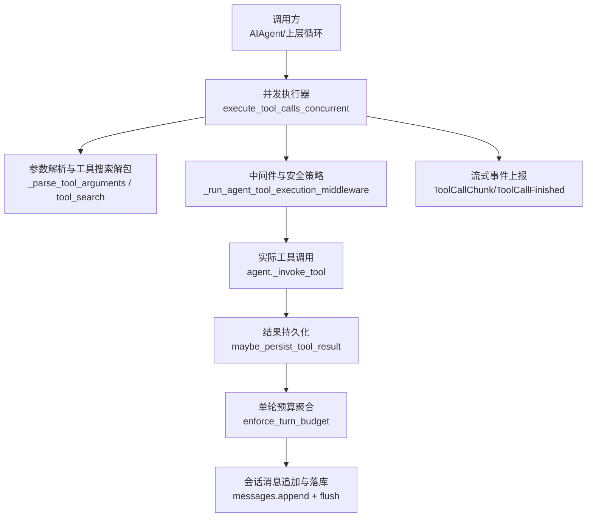
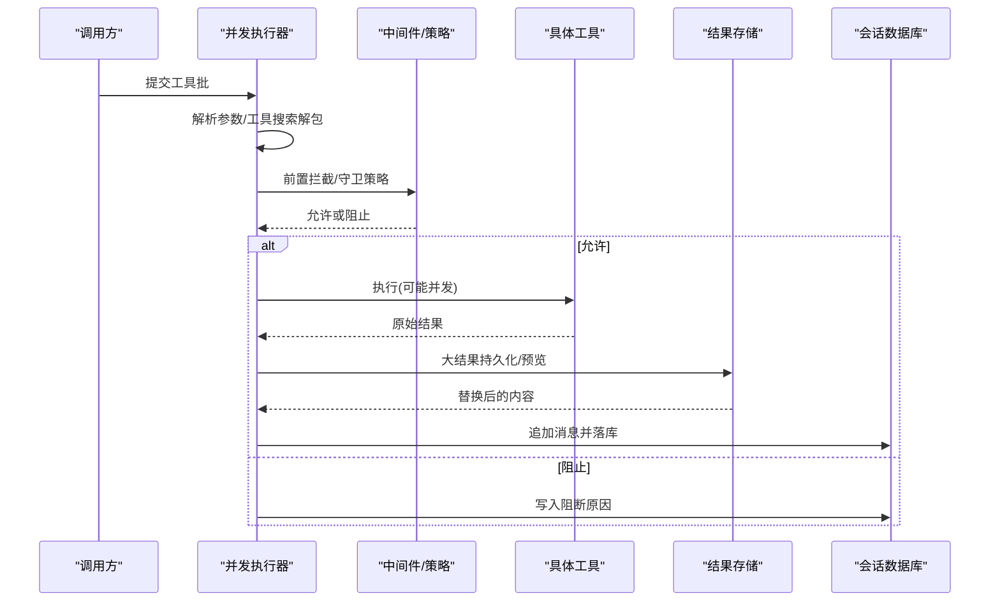
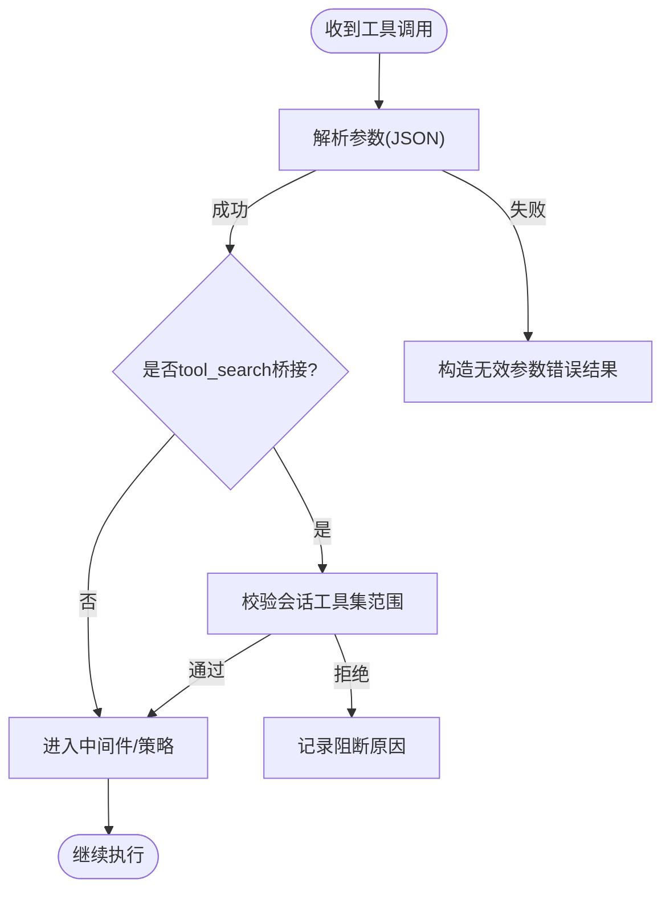
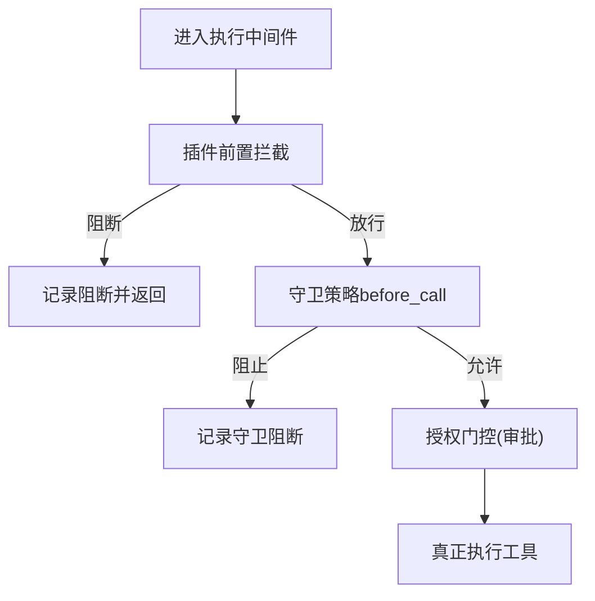
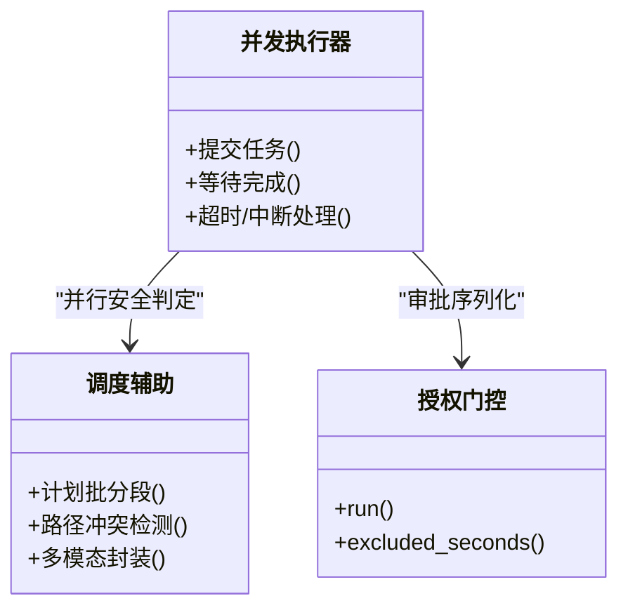
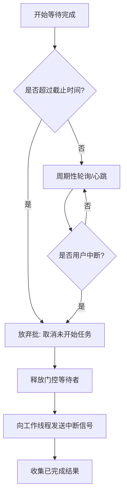
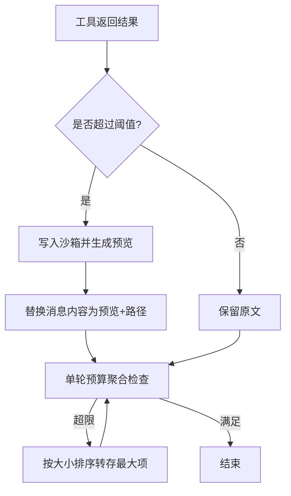
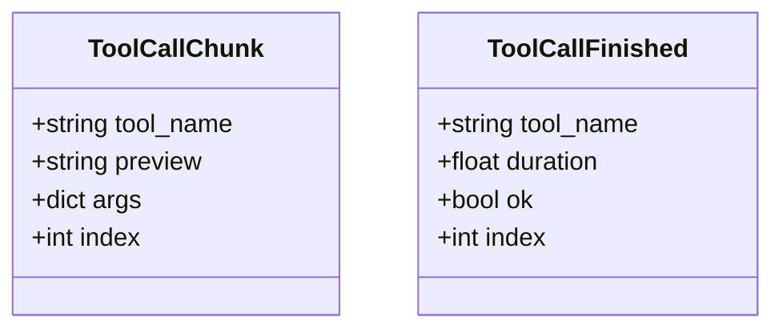
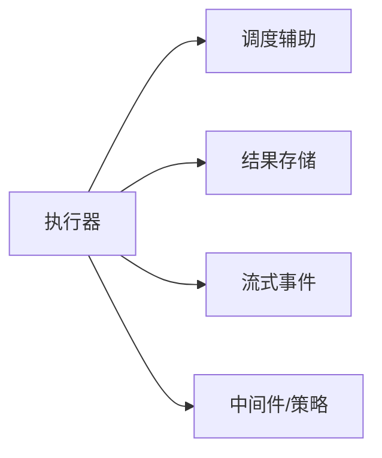

# 工具执行流

<cite>
**本文引用的文件**
- [agent/tool_executor.py](file://agent/tool_executor.py)
- [agent/tool_dispatch_helpers.py](file://agent/tool_dispatch_helpers.py)
- [tools/tool_result_storage.py](file://tools/tool_result_storage.py)
- [gateway/stream_events.py](file://gateway/stream_events.py)
</cite>

## 目录
1. [简介](#简介)
2. [项目结构](#项目结构)
3. [核心组件](#核心组件)
4. [架构总览](#架构总览)
5. [详细组件分析](#详细组件分析)
6. [依赖关系分析](#依赖关系分析)
7. [性能考虑](#性能考虑)
8. [故障排查指南](#故障排查指南)
9. [结论](#结论)
10. [附录](#附录)

## 简介
本文件面向“工具执行流”的完整生命周期，覆盖从工具发现、参数校验、安全与策略拦截、并发调度、沙箱持久化到结果落库与状态同步的全链路。重点说明 ToolCallChunk、ToolCallFinished 等事件的数据结构与处理机制；解释并发控制、超时与中断、错误恢复策略；给出资源隔离、性能优化、结果缓存与版本兼容性的实践建议。

## 项目结构
围绕工具执行的关键模块如下：
- agent/tool_executor.py：并发/顺序工具执行编排、批调度、超时与中断、进度与结果落盘、回调与审计。
- agent/tool_dispatch_helpers.py：并行安全判定、路径冲突检测、多模态结果封装、不可信输出包装、轨迹消息规范化。
- tools/tool_result_storage.py：大结果持久化（沙箱）、预览生成、单轮预算聚合控制。
- gateway/stream_events.py：结构化流式事件定义（含 ToolCallChunk、ToolCallFinished），用于网关侧呈现与消费。

**图表来源**
- [agent/tool_executor.py:758-1580](file://agent/tool_executor.py#L758-L1580)
- [agent/tool_dispatch_helpers.py:116-234](file://agent/tool_dispatch_helpers.py#L116-L234)
- [tools/tool_result_storage.py:144-255](file://tools/tool_result_storage.py#L144-L255)
- [gateway/stream_events.py:84-117](file://gateway/stream_events.py#L84-L117)

**章节来源**
- [agent/tool_executor.py:758-1580](file://agent/tool_executor.py#L758-L1580)
- [agent/tool_dispatch_helpers.py:116-234](file://agent/tool_dispatch_helpers.py#L116-L234)
- [tools/tool_result_storage.py:144-255](file://tools/tool_result_storage.py#L144-L255)
- [gateway/stream_events.py:84-117](file://gateway/stream_events.py#L84-L117)

## 核心组件
- 并发执行器：负责批内工具调度的线程池、启动顺序门控、授权门控、超时/中断、结果收集与顺序保证。
- 调度辅助：决定哪些工具可并行、路径冲突检测、多模态结果封装、不可信内容包装。
- 结果存储：对超大结果进行沙箱持久化并返回预览；在单轮结束时做聚合预算控制。
- 流式事件：以结构化数据描述工具开始与完成，供网关渲染与消费。

**章节来源**
- [agent/tool_executor.py:758-1580](file://agent/tool_executor.py#L758-L1580)
- [agent/tool_dispatch_helpers.py:116-234](file://agent/tool_dispatch_helpers.py#L116-L234)
- [tools/tool_result_storage.py:144-255](file://tools/tool_result_storage.py#L144-L255)
- [gateway/stream_events.py:84-117](file://gateway/stream_events.py#L84-L117)

## 架构总览
工具执行从“模型发出工具调用”到“结果进入会话历史”的关键阶段：
- 工具发现与解包：支持 tool_search 解包为真实工具名，并进行会话工具集范围校验。
- 参数验证：JSON 解析失败直接构造错误结果，避免误执行。
- 安全与策略：插件前置拦截、守卫策略 before_call、授权门控序列化审批。
- 并发调度：按并行安全规则切分批次，使用线程池执行，维护启动顺序门控。
- 结果处理：大结果持久化、多模态适配、风险扫描与不可信包裹、单轮预算聚合。
- 状态同步：逐条追加消息并即时落库，保障进程崩溃后仍可恢复可见状态。

**图表来源**
- [agent/tool_executor.py:807-873](file://agent/tool_executor.py#L807-L873)
- [agent/tool_executor.py:482-662](file://agent/tool_executor.py#L482-L662)
- [tools/tool_result_storage.py:144-200](file://tools/tool_result_storage.py#L144-L200)
- [agent/tool_executor.py:1469-1509](file://agent/tool_executor.py#L1469-L1509)

## 详细组件分析

### 工具发现与参数验证
- 工具搜索解包：当调用桥接工具时，解析出底层真实工具名与参数，并在会话工具集范围内校验，防止越权。
- 参数解析：严格 JSON 解析，失败即构造错误结果，不执行工具。
- 作用域与范围：基于会话启用/禁用的工具集计算可调用集合，缓存于代理实例以减少重复构建。

**图表来源**
- [agent/tool_executor.py:807-873](file://agent/tool_executor.py#L807-L873)
- [agent/tool_executor.py:333-379](file://agent/tool_executor.py#L333-L379)

**章节来源**
- [agent/tool_executor.py:807-873](file://agent/tool_executor.py#L807-L873)
- [agent/tool_executor.py:333-379](file://agent/tool_executor.py#L333-L379)

### 安全沙箱与策略拦截
- 插件前置拦截：pre_tool_call 钩子可阻断调用，返回阻断信息。
- 守卫策略：before_call 决策可阻止执行，统一转换为阻断结果。
- 授权门控：序列化审批提示，排除人类等待时间对批截止期的影响，避免死锁与饥饿。

**图表来源**
- [agent/tool_executor.py:482-662](file://agent/tool_executor.py#L482-L662)
- [agent/tool_executor.py:391-468](file://agent/tool_executor.py#L391-L468)

**章节来源**
- [agent/tool_executor.py:482-662](file://agent/tool_executor.py#L482-L662)
- [agent/tool_executor.py:391-468](file://agent/tool_executor.py#L391-L468)

### 并发控制与启动顺序门控
- 并行安全判定：根据工具类型、路径读写角色与路径重叠判断是否可并行。
- 批分段：将一批调用切分为“并行段”和“顺序段”，保持原顺序语义。
- 启动顺序门控：按提交顺序串行推进，避免审批/授权阻塞导致后续任务饥饿；设置门控超时，超时则允许越界执行以避免全局卡死。
- 线程池与守护：使用守护线程池，异常退出时快速释放，避免解释器关闭阻塞。

**图表来源**
- [agent/tool_dispatch_helpers.py:116-234](file://agent/tool_dispatch_helpers.py#L116-L234)
- [agent/tool_executor.py:391-468](file://agent/tool_executor.py#L391-L468)
- [agent/tool_executor.py:1154-1346](file://agent/tool_executor.py#L1154-L1346)

**章节来源**
- [agent/tool_dispatch_helpers.py:116-234](file://agent/tool_dispatch_helpers.py#L116-L234)
- [agent/tool_executor.py:1154-1346](file://agent/tool_executor.py#L1154-L1346)

### 超时处理与中断恢复
- 批级超时：可配置超时窗口，结合授权门控的人类等待排除时间，动态调整剩余等待。
- 中断传播：检测到用户中断或批超时时，取消未开始的任务，通知已运行任务的中断位，并释放门控等待者。
- 结果兜底：对未完成的工具生成超时/取消结果，确保消息角色交替不被破坏。

**图表来源**
- [agent/tool_executor.py:1229-1346](file://agent/tool_executor.py#L1229-L1346)
- [agent/tool_executor.py:1354-1415](file://agent/tool_executor.py#L1354-L1415)

**章节来源**
- [agent/tool_executor.py:1229-1346](file://agent/tool_executor.py#L1229-L1346)
- [agent/tool_executor.py:1354-1415](file://agent/tool_executor.py#L1354-L1415)

### 结果存储与单轮预算
- 大结果持久化：超过阈值的结果写入沙箱临时目录，返回包含预览与路径的占位文本，模型可通过 read_file 读取。
- 预览生成：按行边界截断，保留可读性。
- 单轮预算聚合：一轮结束后若总字符数超限，优先将最大非持久化结果转存，直到满足预算。

**图表来源**
- [tools/tool_result_storage.py:144-200](file://tools/tool_result_storage.py#L144-L200)
- [tools/tool_result_storage.py:203-255](file://tools/tool_result_storage.py#L203-L255)

**章节来源**
- [tools/tool_result_storage.py:144-200](file://tools/tool_result_storage.py#L144-L200)
- [tools/tool_result_storage.py:203-255](file://tools/tool_result_storage.py#L203-L255)

### 流式事件：ToolCallChunk 与 ToolCallFinished
- ToolCallChunk：工具开始或进行中状态变更，携带工具名、参数预览、完整参数与单调索引，便于网关去重与关联。
- ToolCallFinished：工具完成事件，携带耗时、是否成功与索引，用于清理进度气泡与触发一次性提示。
- 设计约束：事件仅描述传输层事实，不承载上下文；历史由代理维护，事件用于展示层消费。

**图表来源**
- [gateway/stream_events.py:84-117](file://gateway/stream_events.py#L84-L117)

**章节来源**
- [gateway/stream_events.py:84-117](file://gateway/stream_events.py#L84-L117)

### 多模态结果与不可信内容包装
- 多模态封装：工具可返回包含 content 列表与 text_summary 的结构，适配器可将其转为 OpenAI 风格内容列表。
- 不可信内容包装：来自高风险工具（如网页抓取、浏览器/MCP）的文本会被包裹在不可信标记中，降低间接提示注入风险。
- 轨迹消息规范化：保存轨迹时剥离图像等大体积内容，用占位符替代。

**章节来源**
- [agent/tool_dispatch_helpers.py:348-406](file://agent/tool_dispatch_helpers.py#L348-L406)
- [agent/tool_dispatch_helpers.py:533-706](file://agent/tool_dispatch_helpers.py#L533-L706)

## 依赖关系分析
- 执行器依赖调度辅助进行并行安全判定与路径冲突检测。
- 执行器依赖结果存储进行大结果持久化与预算控制。
- 执行器通过流式事件与网关交互，实现跨平台呈现。
- 工具执行前后通过中间件链与守卫策略进行安全与合规控制。

**图表来源**
- [agent/tool_executor.py:758-1580](file://agent/tool_executor.py#L758-L1580)
- [agent/tool_dispatch_helpers.py:116-234](file://agent/tool_dispatch_helpers.py#L116-L234)
- [tools/tool_result_storage.py:144-255](file://tools/tool_result_storage.py#L144-L255)
- [gateway/stream_events.py:84-117](file://gateway/stream_events.py#L84-L117)

**章节来源**
- [agent/tool_executor.py:758-1580](file://agent/tool_executor.py#L758-L1580)
- [agent/tool_dispatch_helpers.py:116-234](file://agent/tool_dispatch_helpers.py#L116-L234)
- [tools/tool_result_storage.py:144-255](file://tools/tool_result_storage.py#L144-L255)
- [gateway/stream_events.py:84-117](file://gateway/stream_events.py#L84-L117)

## 性能考虑
- 并发度上限：默认最大工作线程数限制，图片生成类工具进一步降低并发以避免后端突发限流。
- 批级超时与门控超时：批级超时可调，门控超时受批级超时与固定上限双重约束，避免饥饿。
- 活动心跳：长耗时批内定期心跳，避免网关空闲监控误杀。
- 结果持久化：大结果外置减少上下文占用，提升整体吞吐。
- 单轮预算：聚合控制避免单轮过大导致请求超限。

[本节提供通用指导，无需特定文件引用]

## 故障排查指南
- 参数解析失败：检查模型输出的工具参数是否为合法 JSON 对象。
- 工具被阻断：查看插件前置拦截与守卫策略返回的阻断原因。
- 批超时/中断：确认批级超时配置与授权门控的人类等待排除逻辑；检查是否有任务长时间无响应。
- 结果未落库：关注增量落库失败时的降级与错误原因分类。
- 大结果未持久化：检查沙箱写入是否可用，必要时回退为内联截断。

**章节来源**
- [agent/tool_executor.py:141-157](file://agent/tool_executor.py#L141-L157)
- [agent/tool_executor.py:178-206](file://agent/tool_executor.py#L178-L206)
- [tools/tool_result_storage.py:181-200](file://tools/tool_result_storage.py#L181-L200)

## 结论
该工具执行流通过严格的参数校验、多层安全策略、细粒度的并发控制与稳健的超时/中断处理，实现了高可靠、高性能的工具调用生命周期管理。结果持久化与单轮预算有效缓解上下文溢出问题；结构化流式事件使网关侧呈现与消费解耦，便于跨平台适配。建议在扩展新工具时遵循并行安全规则与不可信内容包装规范，并结合预算配置与沙箱能力优化性能与稳定性。

[本节为总结性内容，无需特定文件引用]

## 附录
- 关键常量与默认值：
  - 最大并发工作线程数：默认上限，图片生成类工具会进一步下调。
  - 批级超时：可通过环境变量配置，默认值足够覆盖慢速但合法的摘要任务。
  - 授权门控锁定超时：基于人类等待上限与余量计算，避免长期阻塞。
- 路径冲突检测：
  - 读/写角色区分，读者之间可并行，任何涉及写者的重叠都会关闭当前并行段。
- 多模态与不可信内容：
  - 多模态结果可被适配器转为标准内容列表；高风险工具输出将被包裹以降低注入风险。

[本节为补充说明，无需特定文件引用]