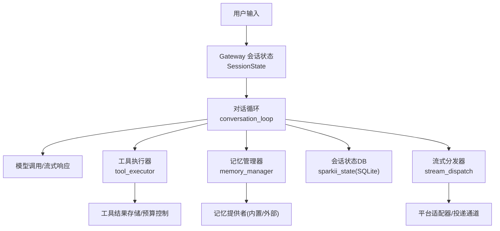
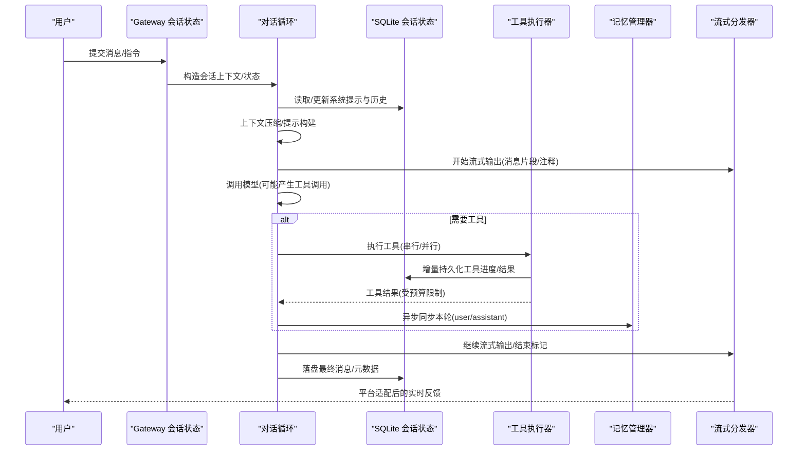
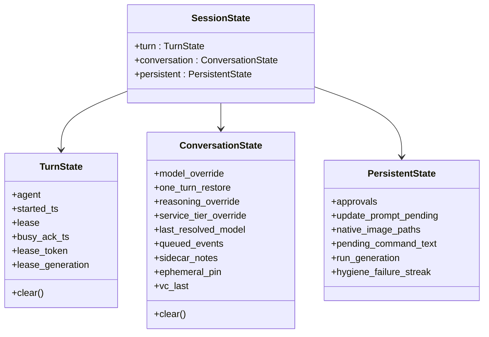
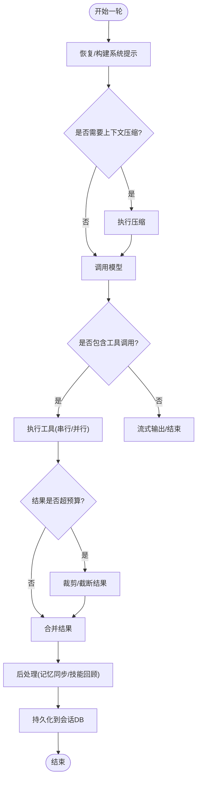
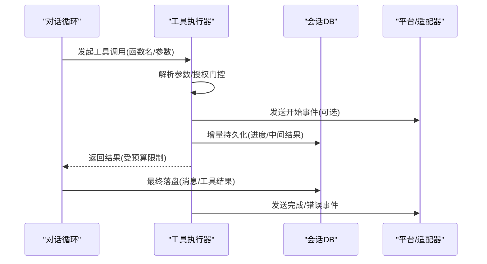
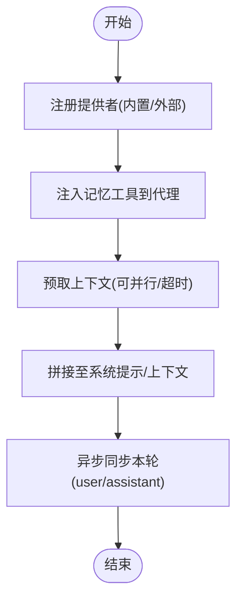
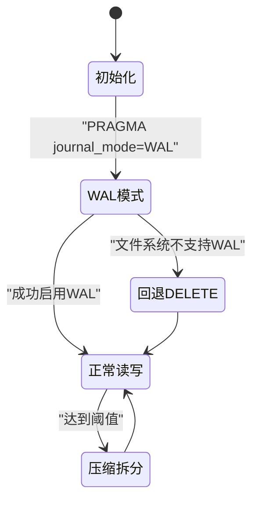
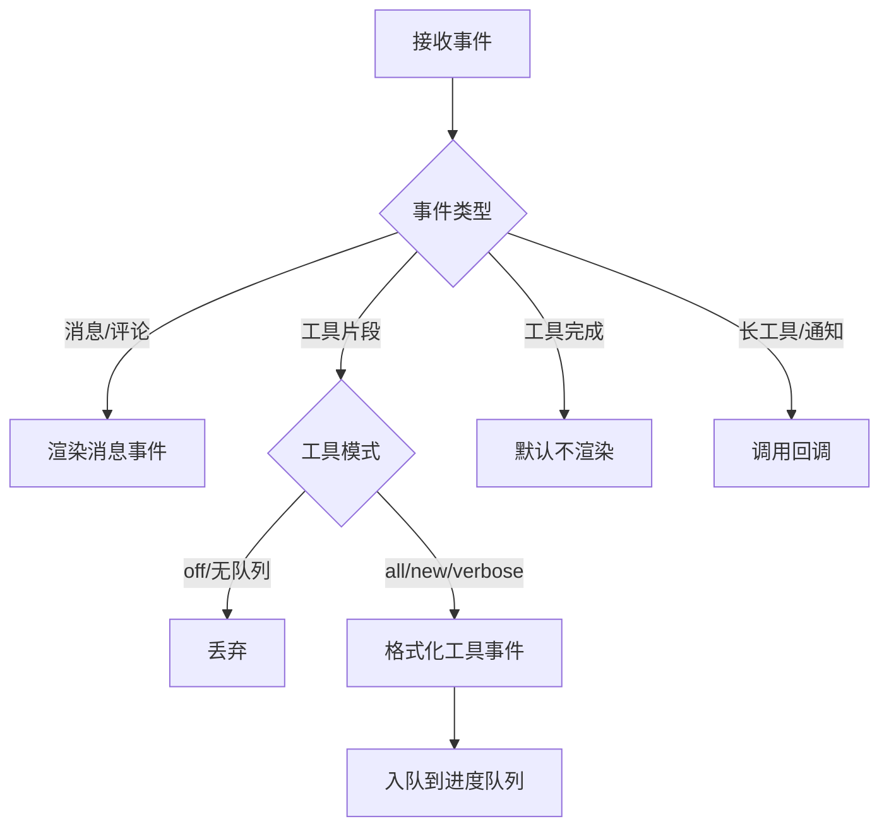
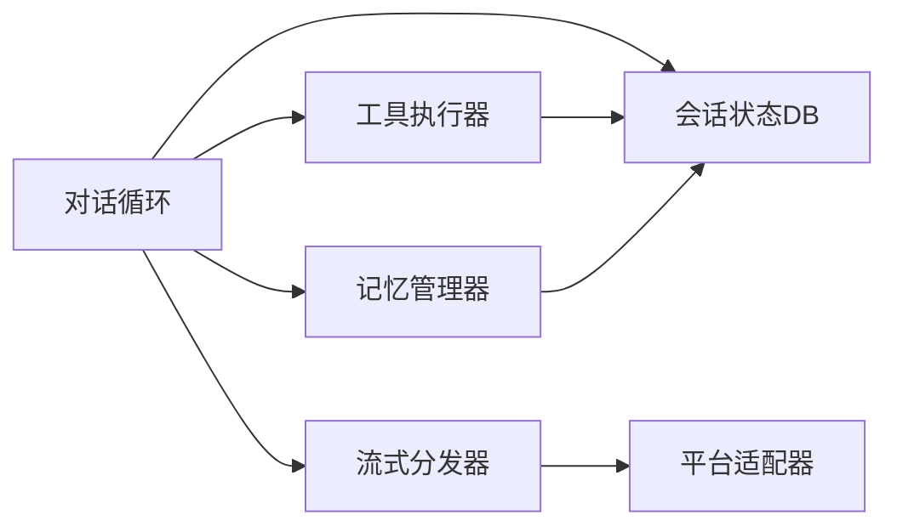

# 数据流设计

<cite>
**本文引用的文件**
- [sparkii_state.py](file://sparkii_state.py)
- [conversation_loop.py](file://agent/conversation_loop.py)
- [memory_manager.py](file://agent/memory_manager.py)
- [tool_executor.py](file://agent/tool_executor.py)
- [session_state.py](file://gateway/session_state.py)
- [stream_dispatch.py](file://gateway/stream_dispatch.py)
</cite>

## 目录
1. [简介](#简介)
2. [项目结构](#项目结构)
3. [核心组件](#核心组件)
4. [架构总览](#架构总览)
5. [详细组件分析](#详细组件分析)
6. [依赖关系分析](#依赖关系分析)
7. [性能与一致性](#性能与一致性)
8. [故障排查指南](#故障排查指南)
9. [结论](#结论)
10. [附录：数据格式与版本兼容](#附录数据格式与版本兼容)

## 简介
本设计文档聚焦于系统的数据流转路径、转换过程与存储策略，覆盖从用户输入到AI响应、工具执行结果传递、记忆系统持久化与会话状态同步的完整链路。同时说明数据格式规范、序列化方案与版本兼容性，并给出数据流图、状态转换图与缓存策略，解释一致性保证、事务处理与并发控制机制。

## 项目结构
系统围绕“会话状态（SQLite）—对话循环（Agent）—工具执行—记忆系统—网关状态/流式分发”展开：
- 会话状态：以 SQLite 作为持久化载体，支持 WAL 模式、FTS5 全文检索、压缩拆分与跨进程安全。
- 对话循环：编排一次用户轮次的模型调用、工具调度、重试与压缩、后处理钩子与后台记忆同步。
- 工具执行：串行/并行执行工具，维护预算、中间检查点、进度与结果持久化。
- 记忆系统：统一管理器协调内置/外部提供者，提供预取、同步与工具注入。
- 网关状态：按会话维度组织 Turn/Conversation/Persistent 三类状态，管理租约、队列与边车信息。
- 流式分发：将结构化事件路由到平台适配器与投递通道，屏蔽平台差异。

**图表来源**
- [session_state.py:51-178](file://gateway/session_state.py#L51-L178)
- [conversation_loop.py:1-120](file://agent/conversation_loop.py#L1-L120)
- [tool_executor.py:1-120](file://agent/tool_executor.py#L1-L120)
- [memory_manager.py:364-470](file://agent/memory_manager.py#L364-L470)
- [sparkii_state.py:1-80](file://sparkii_state.py#L1-L80)
- [stream_dispatch.py:40-133](file://gateway/stream_dispatch.py#L40-L133)

**章节来源**
- [session_state.py:1-178](file://gateway/session_state.py#L1-L178)
- [conversation_loop.py:1-120](file://agent/conversation_loop.py#L1-L120)
- [tool_executor.py:1-120](file://agent/tool_executor.py#L1-L120)
- [memory_manager.py:1-120](file://agent/memory_manager.py#L1-L120)
- [sparkii_state.py:1-80](file://sparkii_state.py#L1-L80)
- [stream_dispatch.py:1-133](file://gateway/stream_dispatch.py#L1-L133)

## 核心组件
- 会话状态容器（Gateway）：TurnState、ConversationState、PersistentState 三域隔离，明确生命周期与清理边界，避免历史散乱字典导致的漂移问题。
- 对话循环（Agent）：构建系统提示、上下文压缩、模型调用、工具调度、重试与回退、后处理与后台记忆同步。
- 工具执行器：解析参数、授权门控、并行执行、结果预算控制、增量持久化、进度回调与错误分类。
- 记忆管理器：注册提供者、注入工具、预取上下文、异步同步、流式清洗与线程安全调度。
- 会话状态存储（SQLite）：WAL 模式、FTS5、压缩拆分、迁移与兼容性、测试隔离保护。
- 流式分发器：事件类型路由、平台适配渲染、工具进度去重与队列入队。

**章节来源**
- [session_state.py:51-178](file://gateway/session_state.py#L51-L178)
- [conversation_loop.py:1-120](file://agent/conversation_loop.py#L1-L120)
- [tool_executor.py:1-120](file://agent/tool_executor.py#L1-L120)
- [memory_manager.py:364-470](file://agent/memory_manager.py#L364-L470)
- [sparkii_state.py:1-80](file://sparkii_state.py#L1-L80)
- [stream_dispatch.py:40-133](file://gateway/stream_dispatch.py#L40-L133)

## 架构总览
下图展示一次用户请求从进入网关到返回响应的数据流，包括工具执行与记忆系统的参与。

**图表来源**
- [conversation_loop.py:1-120](file://agent/conversation_loop.py#L1-L120)
- [tool_executor.py:758-800](file://agent/tool_executor.py#L758-L800)
- [memory_manager.py:638-695](file://agent/memory_manager.py#L638-L695)
- [sparkii_state.py:1-80](file://sparkii_state.py#L1-L80)
- [stream_dispatch.py:88-133](file://gateway/stream_dispatch.py#L88-L133)

## 详细组件分析

### 会话状态（Gateway）
- 作用：集中管理每个会话的 Turn、Conversation、Persistent 三类状态，定义清晰的 reset/clear 时机，避免历史散落字典带来的边界漂移。
- 关键要点：
  - TurnState：记录运行中的 Agent、启动时间、租约、忙确认等，每轮结束时清理。
  - ConversationState：保存模型/推理/服务层级覆盖、队列事件、侧车备注、临时钉住上下文等，会话边界重置。
  - PersistentState：审批、待处理命令文本、图像路径、运行代数等，独立生命周期，不随轮次/边界批量重置。
  - 遗留视图：为兼容测试与旧代码提供映射视图，确保向后兼容。

**图表来源**
- [session_state.py:51-178](file://gateway/session_state.py#L51-L178)

**章节来源**
- [session_state.py:1-178](file://gateway/session_state.py#L1-L178)

### 对话循环（Agent）
- 作用：驱动一次用户轮次，负责系统提示恢复、上下文压缩、模型调用、工具调度、重试/回退、后处理与后台记忆同步。
- 关键要点：
  - 系统提示恢复：优先复用持久化的系统提示，失败时重建并写回；考虑运行时标识漂移（模型/提供商/工作目录/平台）。
  - 上下文压缩：在必要时进行压缩，避免上下文过大导致失败或成本飙升。
  - 工具调度：解析工具调用，执行并收集结果，注入预算控制与增量持久化。
  - 重试与回退：识别 API 错误、配额耗尽、凭证过期等，进行自适应重试或降级。
  - 后处理：完成一轮后触发记忆同步、技能回顾等后台任务。

**图表来源**
- [conversation_loop.py:548-684](file://agent/conversation_loop.py#L548-L684)
- [tool_executor.py:758-800](file://agent/tool_executor.py#L758-L800)

**章节来源**
- [conversation_loop.py:1-120](file://agent/conversation_loop.py#L1-L120)
- [conversation_loop.py:548-684](file://agent/conversation_loop.py#L548-L684)

### 工具执行器
- 作用：解析工具参数、授权门控、并发执行、结果预算控制、增量持久化、进度回调与错误分类。
- 关键要点：
  - 参数解析：严格 JSON 解析，非法参数直接返回错误结果。
  - 授权门控：序列化审批提示，排除人类等待对批处理截止时间的干扰。
  - 并发执行：线程池并行，限制最大并发，图片生成有单独并发上限。
  - 预算控制：根据上下文窗口动态计算工具结果预算，防止单次结果撑爆上下文。
  - 增量持久化：在执行过程中及时落盘，避免破坏性工具导致进程终止而丢失进度。
  - 进度回调：向 UI/平台发送工具开始/完成/错误等事件。

**图表来源**
- [tool_executor.py:141-158](file://agent/tool_executor.py#L141-L158)
- [tool_executor.py:391-468](file://agent/tool_executor.py#L391-L468)
- [tool_executor.py:758-800](file://agent/tool_executor.py#L758-L800)

**章节来源**
- [tool_executor.py:1-120](file://agent/tool_executor.py#L1-L120)
- [tool_executor.py:141-158](file://agent/tool_executor.py#L141-L158)
- [tool_executor.py:391-468](file://agent/tool_executor.py#L391-L468)
- [tool_executor.py:758-800](file://agent/tool_executor.py#L758-L800)

### 记忆管理器
- 作用：统一管理内置/外部记忆提供者，提供系统提示块、预取上下文、异步同步与工具注入。
- 关键要点：
  - 提供者注册：仅允许一个外部提供者，避免工具 schema 膨胀与冲突。
  - 工具注入：将记忆提供者的工具 schema 注入到代理的工具表面，供模型调用。
  - 预取上下文：在每轮前拉取相关记忆，过滤技能脚手架内容，超时保护。
  - 异步同步：每轮结束后将 user/assistant 消息异步写入提供者，保证顺序且不影响主流程。
  - 流式清洗：对包含 <memory-context> 的流式内容进行状态机清洗，避免泄露内部上下文。

**图表来源**
- [memory_manager.py:364-470](file://agent/memory_manager.py#L364-L470)
- [memory_manager.py:525-595](file://agent/memory_manager.py#L525-L595)
- [memory_manager.py:638-695](file://agent/memory_manager.py#L638-L695)

**章节来源**
- [memory_manager.py:1-120](file://agent/memory_manager.py#L1-L120)
- [memory_manager.py:364-470](file://agent/memory_manager.py#L364-L470)
- [memory_manager.py:525-595](file://agent/memory_manager.py#L525-L595)
- [memory_manager.py:638-695](file://agent/memory_manager.py#L638-L695)

### 会话状态存储（SQLite）
- 作用：持久化会话元数据、消息历史、模型配置，支持 FTS5 全文检索、压缩拆分与跨进程安全。
- 关键要点：
  - WAL 模式：多读一写，提升并发能力；在不兼容文件系统上自动回退到 DELETE 模式。
  - 测试隔离：阻止测试误触生产数据库，保障数据安全。
  - 迁移与兼容：schema 版本、FTS 版本、历史数据清理与修复。
  - 压缩拆分：通过 parent_session_id 链实现会话拆分，避免单会话过大。

**图表来源**
- [sparkii_state.py:486-518](file://sparkii_state.py#L486-L518)
- [sparkii_state.py:360-484](file://sparkii_state.py#L360-L484)

**章节来源**
- [sparkii_state.py:1-80](file://sparkii_state.py#L1-L80)
- [sparkii_state.py:486-518](file://sparkii_state.py#L486-L518)
- [sparkii_state.py:360-484](file://sparkii_state.py#L360-L484)

### 流式分发器
- 作用：将结构化事件路由到平台适配器与投递通道，屏蔽平台差异，支持工具进度去重与队列入队。
- 关键要点：
  - 事件类型：消息片段、消息停止、评论、工具调用片段、工具完成、长工具提示、网关通知。
  - 平台适配：不同平台可选择丢弃无法渲染的事件，保持体验一致。
  - 工具进度：支持“全部/新/详细/关闭”模式，减少噪音。

**图表来源**
- [stream_dispatch.py:40-133](file://gateway/stream_dispatch.py#L40-L133)

**章节来源**
- [stream_dispatch.py:1-133](file://gateway/stream_dispatch.py#L1-L133)

## 依赖关系分析
- 组件耦合：
  - 对话循环依赖工具执行器、记忆管理器、会话状态存储与流式分发器。
  - 工具执行器依赖会话状态存储（增量持久化）、预算配置与平台回调。
  - 记忆管理器依赖提供者接口与线程池，注入工具到代理。
  - 网关状态容器被对话循环使用，管理会话级状态与租约。
- 外部依赖：
  - SQLite（WAL/FTS5）、线程池、平台适配器、模型提供方。
- 潜在环依赖：
  - 通过模块内延迟导入与弱引用避免加载期环依赖。

**图表来源**
- [conversation_loop.py:1-120](file://agent/conversation_loop.py#L1-L120)
- [tool_executor.py:1-120](file://agent/tool_executor.py#L1-L120)
- [memory_manager.py:364-470](file://agent/memory_manager.py#L364-L470)
- [sparkii_state.py:1-80](file://sparkii_state.py#L1-L80)
- [stream_dispatch.py:40-133](file://gateway/stream_dispatch.py#L40-L133)

**章节来源**
- [conversation_loop.py:1-120](file://agent/conversation_loop.py#L1-L120)
- [tool_executor.py:1-120](file://agent/tool_executor.py#L1-L120)
- [memory_manager.py:364-470](file://agent/memory_manager.py#L364-L470)
- [sparkii_state.py:1-80](file://sparkii_state.py#L1-L80)
- [stream_dispatch.py:40-133](file://gateway/stream_dispatch.py#L40-L133)

## 性能与一致性
- 并发控制：
  - SQLite WAL 模式允许多读一写；在不兼容文件系统上自动回退到 DELETE 模式，保证可用性。
  - 工具执行使用线程池，限制最大并发，图片生成有单独并发上限。
  - 记忆管理器使用单工作线程串行化写入，保证 turn N 先于 turn N+1 落地。
- 事务与一致性：
  - SQLite 事务保证消息与元数据的原子写入；增量持久化在工具执行中及时落盘，降低丢失风险。
  - 会话状态容器通过明确的 clear/reset 边界避免状态漂移。
- 缓存策略：
  - 系统提示缓存：优先复用持久化的系统提示，减少重复构建与缓存失效。
  - 工具结果预算：根据上下文窗口动态裁剪，避免单次结果撑爆上下文。
  - 流式事件去重：工具进度在“new”模式下仅在新工具切换时上报，减少噪音。
- 性能优化建议：
  - 合理设置工具并发与图片生成并发，避免后端限流。
  - 监控上下文压缩频率与大小，调整压缩阈值。
  - 关注 SQLite WAL 兼容性，必要时切换到 DELETE 模式。

[本节为通用指导，无需特定文件来源]

## 故障排查指南
- 会话数据库不可用：
  - 现象：/resume、/title、/history、/branch 等命令报错。
  - 原因：WAL 模式在 NFS/SMB/FUSE/ZFS 上不兼容；或 SQLite WAL-reset 漏洞。
  - 处理：查看最后初始化错误信息，必要时切换到 DELETE 模式或升级 SQLite。
- 工具执行卡住：
  - 现象：轮次长时间“运行中”，后续消息触发中断。
  - 原因：外部记忆提供者阻塞；审批提示挂起；工具结果过大。
  - 处理：检查记忆提供者超时与网络；缩短工具结果；调整审批超时。
- 流式输出异常：
  - 现象：平台未显示工具进度或消息片段。
  - 原因：适配器选择丢弃事件；工具模式设置为 off。
  - 处理：检查平台适配器的 render/format 逻辑与工具模式配置。

**章节来源**
- [sparkii_state.py:674-695](file://sparkii_state.py#L674-L695)
- [sparkii_state.py:486-518](file://sparkii_state.py#L486-L518)
- [memory_manager.py:525-595](file://agent/memory_manager.py#L525-L595)
- [stream_dispatch.py:88-133](file://gateway/stream_dispatch.py#L88-L133)

## 结论
本设计通过“会话状态容器—对话循环—工具执行—记忆系统—SQLite 存储—流式分发”的分层架构，实现了高可靠、可扩展的数据流。WAL 模式与增量持久化提升了并发与容错能力；记忆管理器提供了灵活的上下文增强；流式分发器屏蔽了平台差异。整体方案在保证一致性的同时，兼顾性能与可维护性。

[本节为总结，无需特定文件来源]

## 附录：数据格式与版本兼容
- 数据格式规范：
  - 消息结构：角色（user/system/assistant）、内容（字符串或多模态列表）、工具调用/结果、API 侧边内容等。
  - 工具参数：严格 JSON 对象，非法参数直接返回错误结果。
  - 记忆上下文：使用 fenced 块包裹，流式场景下由状态机清洗，避免泄露内部上下文。
- 序列化方案：
  - 会话状态使用 SQLite 存储，JSON 字段用于复杂结构；WAL 模式提升并发；FTS5 支持全文检索。
  - 工具结果与消息通过 JSON 序列化传输，注意字符集与长度限制。
- 版本兼容性：
  - SQLite schema 与 FTS 版本管理，支持历史数据迁移与修复。
  - 系统提示缓存考虑运行时标识漂移，避免缓存污染。
  - 记忆提供者工具 schema 标准化，避免重复包装导致请求失败。

**章节来源**
- [sparkii_state.py:1-80](file://sparkii_state.py#L1-L80)
- [conversation_loop.py:548-684](file://agent/conversation_loop.py#L548-L684)
- [memory_manager.py:50-81](file://agent/memory_manager.py#L50-L81)
- [tool_executor.py:141-158](file://agent/tool_executor.py#L141-L158)