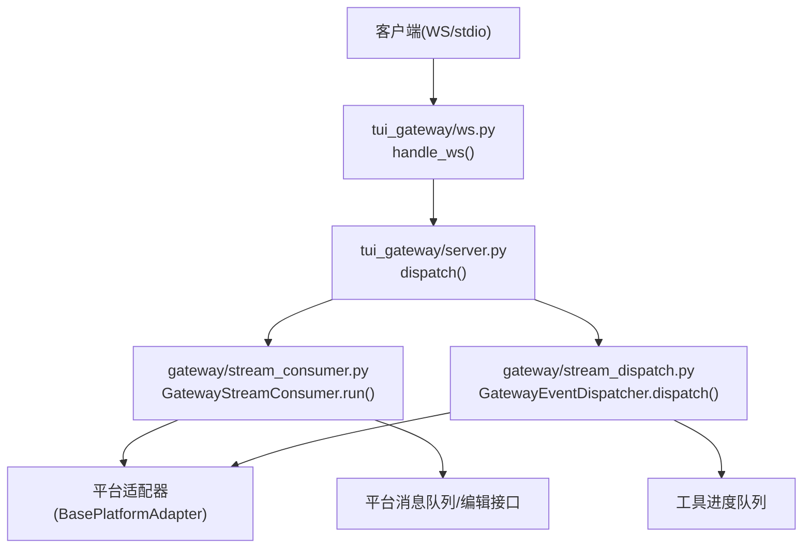
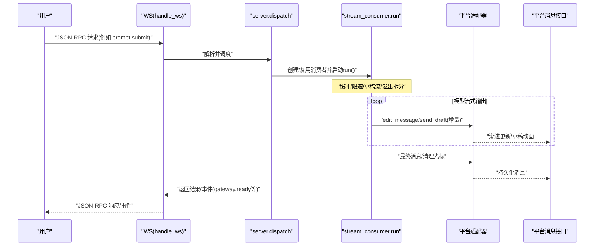
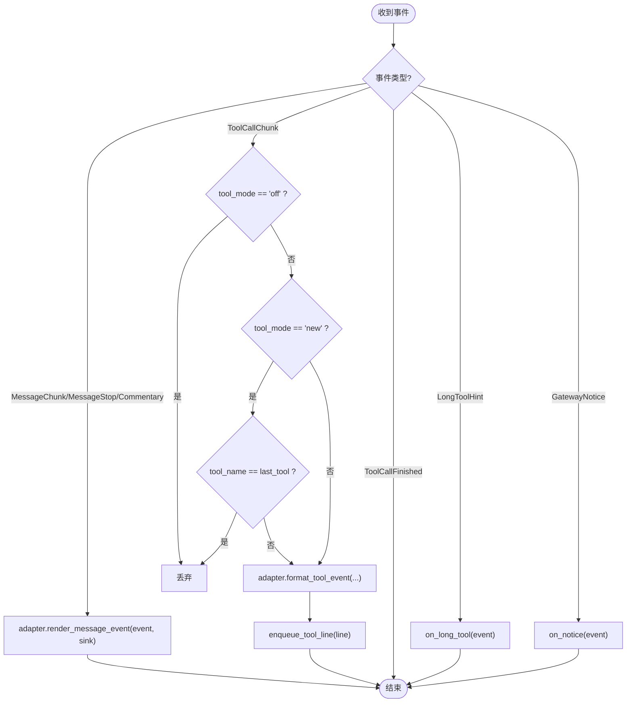
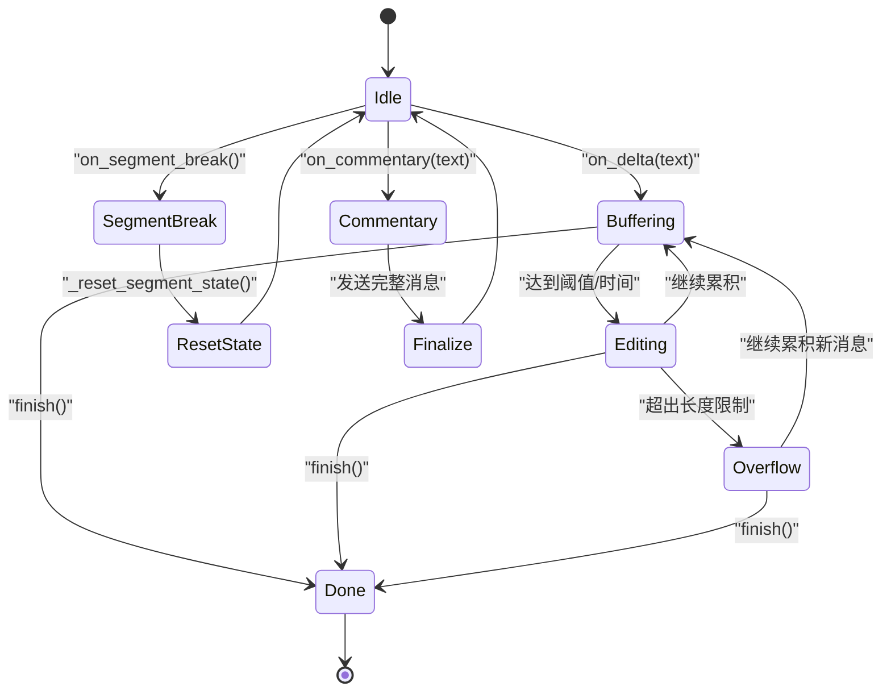
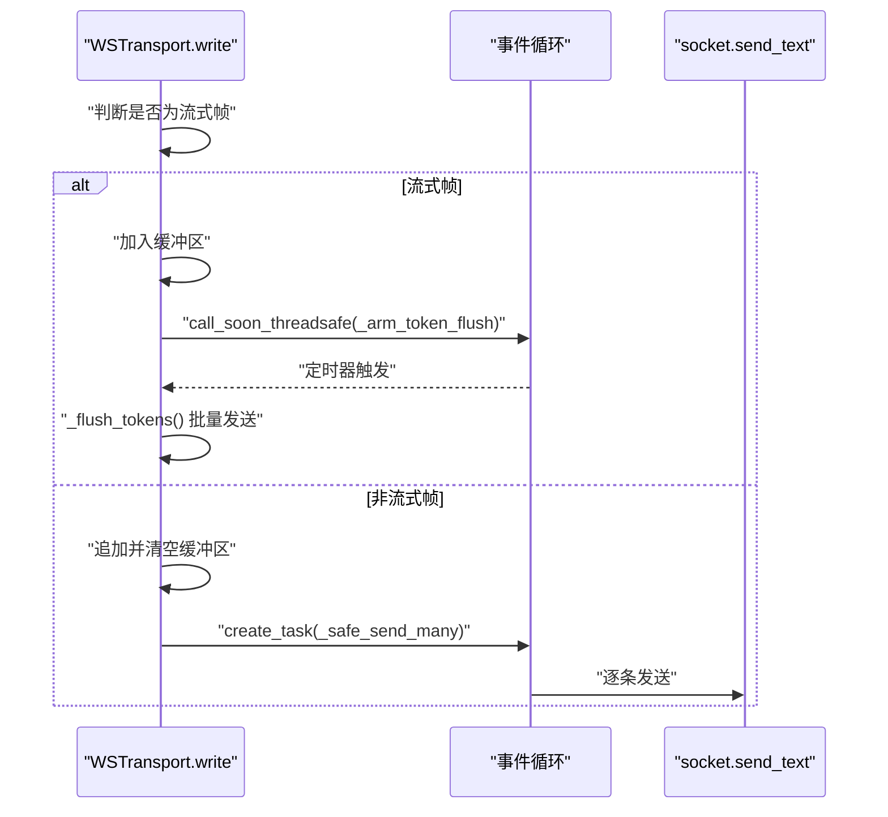
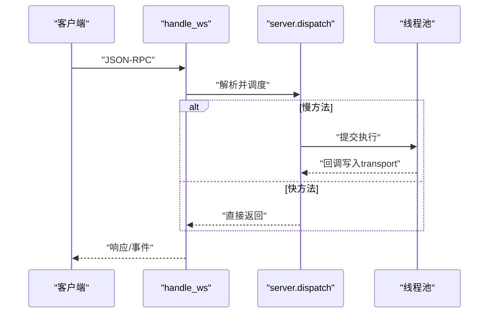
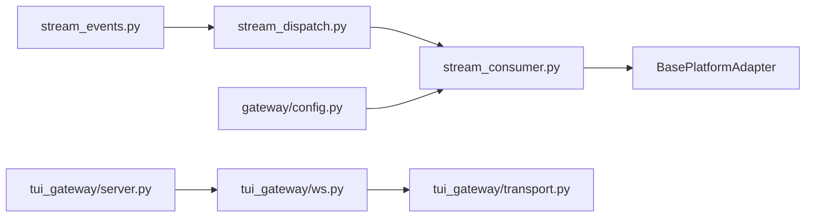
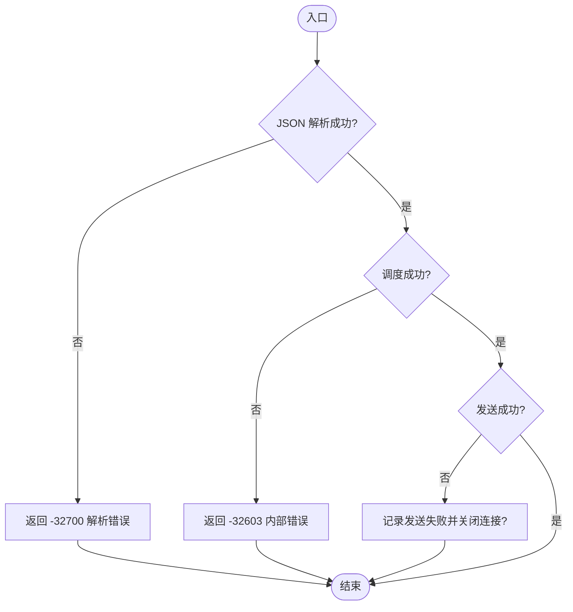

# 用户消息流

<cite>
**本文引用的文件**
- [gateway/stream_events.py](file://gateway/stream_events.py)
- [gateway/stream_dispatch.py](file://gateway/stream_dispatch.py)
- [gateway/stream_consumer.py](file://gateway/stream_consumer.py)
- [tui_gateway/ws.py](file://tui_gateway/ws.py)
- [tui_gateway/transport.py](file://tui_gateway/transport.py)
- [tui_gateway/server.py](file://tui_gateway/server.py)
- [gateway/config.py](file://gateway/config.py)
</cite>

## 目录
1. [简介](#简介)
2. [项目结构](#项目结构)
3. [核心组件](#核心组件)
4. [架构总览](#架构总览)
5. [详细组件分析](#详细组件分析)
6. [依赖关系分析](#依赖关系分析)
7. [性能考量](#性能考量)
8. [故障排查指南](#故障排查指南)
9. [结论](#结论)
10. [附录](#附录)

## 简介
本文件面向“从用户输入到AI响应”的完整消息流转，覆盖消息接收、解析、路由、处理与响应生成。重点说明：
- 结构化事件模型（MessageChunk、MessageStop、Commentary、ToolCallChunk、ToolCallFinished、LongToolHint、GatewayNotice）
- 事件分发与消费路径（stream_dispatch → stream_consumer → 平台适配器）
- 传输协议与序列化（JSON-RPC over WebSocket/stdio）
- 错误处理、去重、限流与缓存策略
- 时序图、状态转换图与异常流程图

## 项目结构
围绕消息流的关键模块分布如下：
- gateway/stream_events.py：定义结构化事件类型（纯数据类），描述“发生了什么”，不绑定具体投递方式
- gateway/stream_dispatch.py：将事件按类型路由到平台适配器的渲染钩子或工具进度队列
- gateway/stream_consumer.py：异步消费者，负责缓冲、限速、渐进式编辑消息、草稿流、溢出拆分等
- tui_gateway/ws.py：WebSocket 传输层，实现 JSON-RPC 帧收发、令牌合并、Nagle 禁用、连接生命周期管理
- tui_gateway/transport.py：传输抽象（StdioTransport/TeeTransport），统一 I/O 出口并处理“对端消失”语义
- tui_gateway/server.py：RPC 调度、会话管理、长任务线程池、皮肤/就绪事件广播等
- gateway/config.py：配置归一化（如 streaming transport/mode），影响消费者行为

图表来源
- [tui_gateway/ws.py:286-477](file://tui_gateway/ws.py#L286-L477)
- [tui_gateway/server.py:184-296](file://tui_gateway/server.py#L184-L296)
- [gateway/stream_consumer.py:156-800](file://gateway/stream_consumer.py#L156-L800)
- [gateway/stream_dispatch.py:40-133](file://gateway/stream_dispatch.py#L40-L133)

章节来源
- [tui_gateway/ws.py:1-477](file://tui_gateway/ws.py#L1-L477)
- [tui_gateway/server.py:1-800](file://tui_gateway/server.py#L1-L800)
- [gateway/stream_consumer.py:1-800](file://gateway/stream_consumer.py#L1-L800)
- [gateway/stream_dispatch.py:1-133](file://gateway/stream_dispatch.py#L1-L133)

## 核心组件
- 事件模型（gateway/stream_events.py）
  - MessageChunk：增量文本片段
  - MessageStop：当前助手消息段结束（final=True 表示整轮结束）
  - Commentary：工具迭代间的完整中间消息
  - ToolCallChunk / ToolCallFinished：工具调用开始/完成
  - LongToolHint / GatewayNotice：网关控制/提示事件
- 事件分发器（gateway/stream_dispatch.py）
  - GatewayEventDispatcher：按事件类型路由到渲染或工具进度队列；支持“new”模式去重
- 流消费者（gateway/stream_consumer.py）
  - GatewayStreamConsumer：异步任务，缓冲、限速、渐进编辑、草稿流、溢出拆分、去重、思考块过滤
- 传输层（tui_gateway/ws.py, tui_gateway/transport.py）
  - WSTransport：令牌合并、批量发送、超时保护、Nagle 禁用
  - StdioTransport/TeeTransport：跨 stdio/WS 的统一写口，处理“对端消失”
- 服务端（tui_gateway/server.py）
  - RPC 调度、长任务线程池、会话生命周期、就绪事件广播

章节来源
- [gateway/stream_events.py:41-159](file://gateway/stream_events.py#L41-L159)
- [gateway/stream_dispatch.py:40-133](file://gateway/stream_dispatch.py#L40-L133)
- [gateway/stream_consumer.py:127-800](file://gateway/stream_consumer.py#L127-L800)
- [tui_gateway/ws.py:70-256](file://tui_gateway/ws.py#L70-L256)
- [tui_gateway/transport.py:66-220](file://tui_gateway/transport.py#L66-L220)
- [tui_gateway/server.py:184-296](file://tui_gateway/server.py#L184-L296)

## 架构总览
下图展示从用户输入到 AI 响应的端到端流程，包括事件类型、传输协议与关键优化点。

图表来源
- [tui_gateway/ws.py:286-477](file://tui_gateway/ws.py#L286-L477)
- [tui_gateway/server.py:184-296](file://tui_gateway/server.py#L184-L296)
- [gateway/stream_consumer.py:760-800](file://gateway/stream_consumer.py#L760-L800)

## 详细组件分析

### 事件模型与数据结构
- MessageChunk：包含增量文本 text
- MessageStop：标志 final 是否结束整轮
- Commentary：完整的中间消息文本
- ToolCallChunk：tool_name、preview、args、index（用于去重与关联）
- ToolCallFinished：tool_name、duration、ok、index
- LongToolHint / GatewayNotice：网关控制/提示事件

这些事件是“纯数据类”，无平台知识，便于在 worker 线程安全构造并通过队列传递到异步消费端。

章节来源
- [gateway/stream_events.py:41-159](file://gateway/stream_events.py#L41-L159)

### 事件分发器（GatewayEventDispatcher）
职责：
- 将 MessageChunk/MessageStop/Commentary 交给适配器渲染到 sink
- 将 ToolCallChunk 根据 tool_mode 决定是否上报，并在“new”模式下仅当工具变化时上报（去重）
- 将 ToolCallFinished、LongToolHint、GatewayNotice 交由上层钩子处理

关键点：
- 永远不在 agent 工作线程抛出异常（捕获并记录）
- “new”模式通过 last_tool 字段去重

图表来源
- [gateway/stream_dispatch.py:88-133](file://gateway/stream_dispatch.py#L88-L133)

章节来源
- [gateway/stream_dispatch.py:40-133](file://gateway/stream_dispatch.py#L40-L133)

### 流消费者（GatewayStreamConsumer）
职责：
- 接收 on_delta/on_segment_break/on_commentary/finish
- 异步 run() 循环：缓冲、限速、渐进编辑、草稿流、溢出拆分、思考块过滤、去重
- 维护 message_id、预览消息集合、分段/评论历史，确保最终一致性

关键特性：
- 自适应退避：连续失败后降低编辑频率，最多 _MAX_FLOOD_STRIKES 次后禁用渐进编辑
- 草稿流：优先使用 send_draft 动画预览，失败回退 edit
- 溢出拆分：超长内容拆分为多条消息，避免平台限制
- 去重：跳过重复文本编辑（_last_sent_text）
- 思考块过滤：屏蔽 <think>...</think> 等标签内容
- 最终一致性：对比 delivered_final_text 与 final_response，避免重复发送

图表来源
- [gateway/stream_consumer.py:590-605](file://gateway/stream_consumer.py#L590-L605)
- [gateway/stream_consumer.py:760-800](file://gateway/stream_consumer.py#L760-L800)
- [gateway/stream_consumer.py:552-589](file://gateway/stream_consumer.py#L552-L589)

章节来源
- [gateway/stream_consumer.py:127-800](file://gateway/stream_consumer.py#L127-L800)

### 传输层（WSTransport 与 Transport）
- WSTransport：
  - 令牌合并：高频 token 帧（message.delta/reasoning.delta/thinking.delta）在 _TOKEN_COALESCE_S 内合并发送，减少事件循环唤醒
  - 非流式帧立即刷新，保证顺序
  - 超时保护：write 等待 _WS_WRITE_TIMEOUT_S，防止事件循环阻塞导致假死
  - Nagle 禁用：保持实时性
- Transport：
  - StdioTransport：处理 BrokenPipe/关闭管道等“对端消失”场景，返回 False 通知上层
  - TeeTransport：主通道 + 多个旁路，主成功即成功，旁路失败忽略

图表来源
- [tui_gateway/ws.py:118-226](file://tui_gateway/ws.py#L118-L226)
- [tui_gateway/ws.py:228-247](file://tui_gateway/ws.py#L228-L247)
- [tui_gateway/transport.py:100-183](file://tui_gateway/transport.py#L100-L183)

章节来源
- [tui_gateway/ws.py:70-256](file://tui_gateway/ws.py#L70-L256)
- [tui_gateway/transport.py:66-220](file://tui_gateway/transport.py#L66-L220)

### 服务端与 RPC 调度
- handle_ws：接受连接、发送 gateway.ready、读取 JSON-RPC、调度 server.dispatch、处理错误与断开
- server.dispatch：将慢方法放入线程池，保持快速路径响应性
- 会话生命周期：释放/回收、孤儿会话清理、插件钩子

图表来源
- [tui_gateway/ws.py:286-477](file://tui_gateway/ws.py#L286-L477)
- [tui_gateway/server.py:184-296](file://tui_gateway/server.py#L184-L296)

章节来源
- [tui_gateway/ws.py:286-477](file://tui_gateway/ws.py#L286-L477)
- [tui_gateway/server.py:184-296](file://tui_gateway/server.py#L184-L296)

## 依赖关系分析
- 事件模型与分发解耦：stream_events 只定义数据，stream_dispatch 决定如何呈现
- 消费者与适配器解耦：stream_consumer 通过 BasePlatformAdapter 抽象，可适配多平台
- 传输抽象：ws 与 transport 分离，支持 stdio/WS 统一调度
- 配置驱动：config.py 提供 streaming transport/mode 归一化，影响消费者行为

图表来源
- [gateway/stream_events.py:41-159](file://gateway/stream_events.py#L41-L159)
- [gateway/stream_dispatch.py:40-133](file://gateway/stream_dispatch.py#L40-L133)
- [gateway/stream_consumer.py:156-800](file://gateway/stream_consumer.py#L156-L800)
- [tui_gateway/ws.py:286-477](file://tui_gateway/ws.py#L286-L477)
- [tui_gateway/transport.py:66-220](file://tui_gateway/transport.py#L66-L220)
- [tui_gateway/server.py:184-296](file://tui_gateway/server.py#L184-L296)
- [gateway/config.py:77-91](file://gateway/config.py#L77-L91)

章节来源
- [gateway/stream_events.py:41-159](file://gateway/stream_events.py#L41-L159)
- [gateway/stream_dispatch.py:40-133](file://gateway/stream_dispatch.py#L40-L133)
- [gateway/stream_consumer.py:156-800](file://gateway/stream_consumer.py#L156-L800)
- [tui_gateway/ws.py:286-477](file://tui_gateway/ws.py#L286-L477)
- [tui_gateway/transport.py:66-220](file://tui_gateway/transport.py#L66-L220)
- [tui_gateway/server.py:184-296](file://tui_gateway/server.py#L184-L296)
- [gateway/config.py:77-91](file://gateway/config.py#L77-L91)

## 性能考量
- 令牌合并：高频 token 帧在 33ms 窗口内合并发送，显著降低事件循环唤醒次数
- 自适应退避：连续编辑失败后降低频率，避免雪崩
- 草稿流：优先使用原生草稿动画，提升用户体验
- 溢出拆分：避免单条消息过大导致失败
- 去重：跳过重复文本编辑，减少无效网络开销
- 思考块过滤：避免无用内容占用带宽与渲染资源
- 传输超时：write 超时保护，避免事件循环被长时间阻塞

[本节为通用性能讨论，无需特定文件引用]

## 故障排查指南
常见错误与处理：
- 解析错误：JSON 解析失败返回标准错误码 -32700
- 调度崩溃：内部错误返回 -32603，并记录堆栈
- 发送失败：记录 peer、错误类型，必要时关闭连接
- 对端消失：StdioTransport 识别 EPIPE/ECONNRESET 等 errno，返回 False 通知上层
- 流式卡顿：write 超时保护，避免假死；Nagle 禁用保持实时性

建议排查步骤：
- 检查 ws 日志中的 parse_errors/dispatch_crashes/send_failures
- 确认 transport 是否处于 closed 状态
- 查看消费者是否启用草稿流及失败回退
- 验证 tool_mode 与去重逻辑是否符合预期

章节来源
- [tui_gateway/ws.py:359-418](file://tui_gateway/ws.py#L359-L418)
- [tui_gateway/transport.py:114-183](file://tui_gateway/transport.py#L114-L183)
- [tui_gateway/server.py:184-296](file://tui_gateway/server.py#L184-L296)

## 结论
该消息流通过清晰的事件模型、解耦的分发与消费、健壮的传输层与完善的错误处理，实现了高吞吐、低延迟、可扩展的用户消息处理链路。结合去重、限流、草稿流与溢出拆分等机制，在保证一致性的同时提升了用户体验。

[本节为总结性内容，无需特定文件引用]

## 附录

### 消息序列化与传输协议
- 协议：JSON-RPC 2.0，行分隔（newline-delimited）
- 方向：双向，WS/stdio 均适用
- 事件：gateway.ready 等系统事件在连接建立后立即推送
- 帧：高频 token 帧合并发送，非流式帧立即刷新

章节来源
- [tui_gateway/ws.py:8-12](file://tui_gateway/ws.py#L8-L12)
- [tui_gateway/ws.py:286-337](file://tui_gateway/ws.py#L286-L337)

### 消息去重、限流与缓存策略
- 去重：
  - 工具进度：“new”模式基于 last_tool 去重
  - 文本编辑：跳过与上次相同的内容
- 限流：
  - 自适应退避：连续失败后降低编辑频率
  - 令牌合并：33ms 窗口合并高频 token 帧
- 缓存：
  - 本地缓冲区：pending_tokens 临时缓存
  - 预览消息集合：跟踪已发送预览，用于最终一致性清理

章节来源
- [gateway/stream_dispatch.py:85-114](file://gateway/stream_dispatch.py#L85-L114)
- [gateway/stream_consumer.py:244-262](file://gateway/stream_consumer.py#L244-L262)
- [tui_gateway/ws.py:97-142](file://tui_gateway/ws.py#L97-L142)

### 异常处理流程图

图表来源
- [tui_gateway/ws.py:359-418](file://tui_gateway/ws.py#L359-L418)