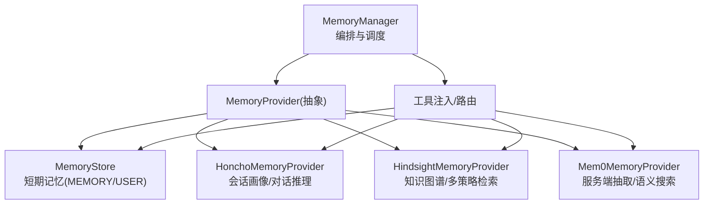
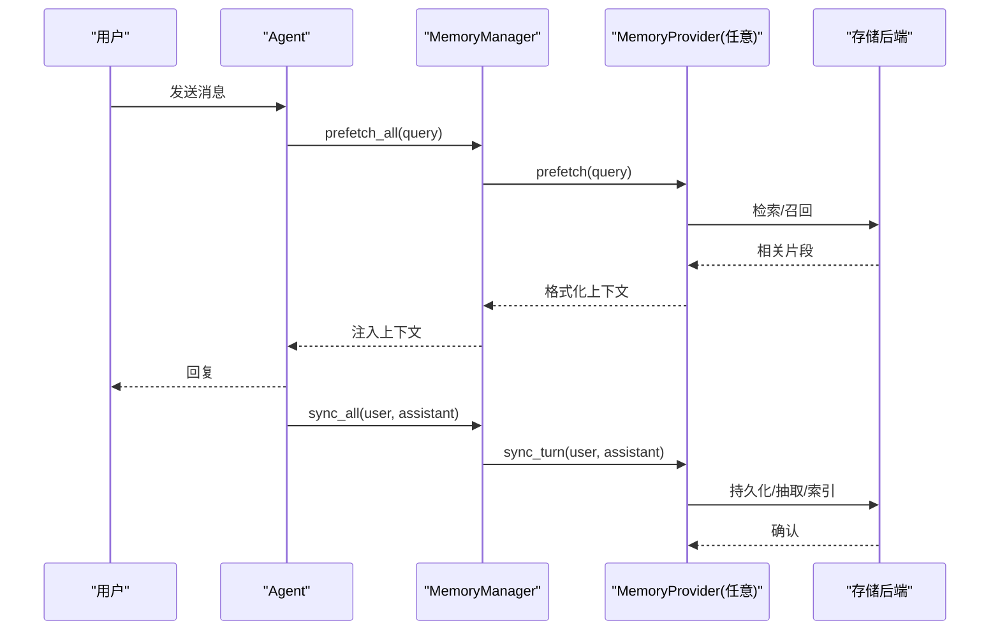
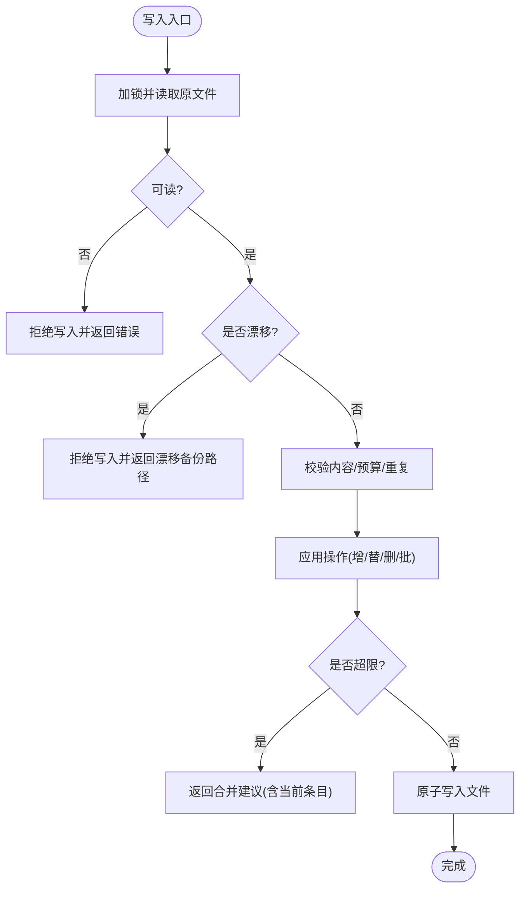
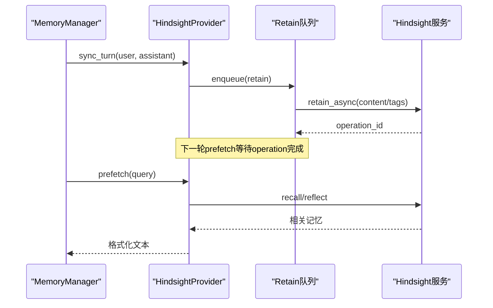
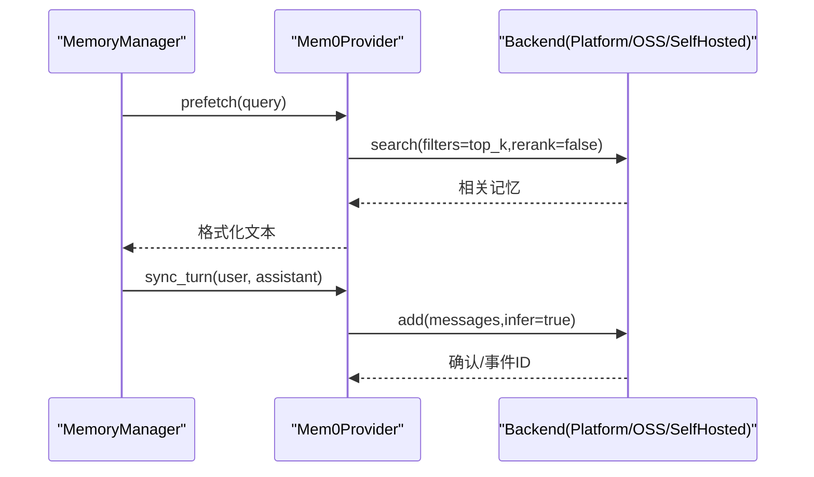
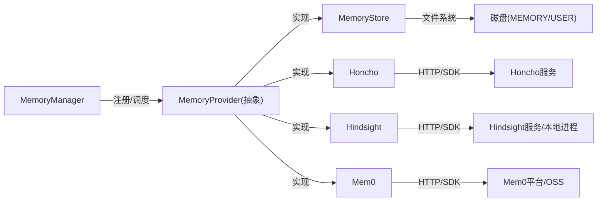
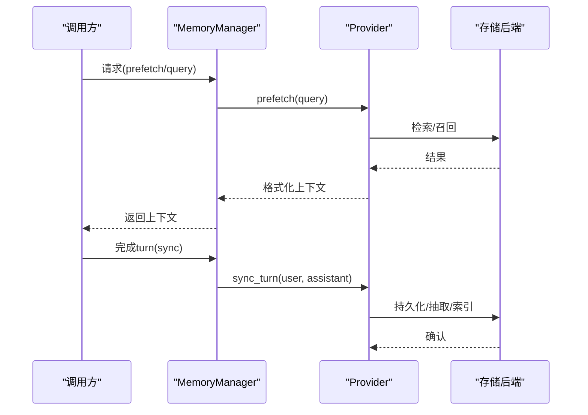

# 记忆持久化流

<cite>
**本文引用的文件**
- [agent/memory_manager.py](file://agent/memory_manager.py)
- [agent/memory_provider.py](file://agent/memory_provider.py)
- [tools/memory_tool.py](file://tools/memory_tool.py)
- [plugins/memory/honcho/__init__.py](file://plugins/memory/honcho/__init__.py)
- [plugins/memory/hindsight/__init__.py](file://plugins/memory/hindsight/__init__.py)
- [plugins/memory/mem0/__init__.py](file://plugins/memory/mem0/__init__.py)
</cite>

## 目录
1. [简介](#简介)
2. [项目结构](#项目结构)
3. [核心组件](#核心组件)
4. [架构总览](#架构总览)
5. [详细组件分析](#详细组件分析)
6. [依赖关系分析](#依赖关系分析)
7. [性能考量](#性能考量)
8. [故障排查指南](#故障排查指南)
9. [结论](#结论)
10. [附录](#附录)

## 简介
本文件系统性阐述记忆持久化流的存储、检索、更新与同步机制，覆盖短期记忆（本地文件）与长期记忆（外部后端），并说明索引方式、查询算法、压缩去重与版本管理策略。同时给出存取流程图、数据一致性保证、并发访问控制、加密存储、隐私保护与备份恢复机制的设计与实践要点。

## 项目结构
记忆系统由“编排层 + 抽象接口 + 多种提供者实现”构成：
- 编排层：MemoryManager 负责注册/调度多个 MemoryProvider，统一 prefetch/sync 生命周期，提供工具注入与后台任务串行化。
- 抽象接口：MemoryProvider 定义 initialize/prefetch/sync_turn/get_tool_schemas/handle_tool_call/shutdown 等标准方法，以及可选钩子（on_session_switch/on_pre_compress/on_memory_write/backup_paths）。
- 提供者实现：
  - 内置短期记忆：tools/memory_tool.py 中的 MemoryStore，基于 MEMORY.md/USER.md 的条目式持久化。
  - 长期记忆插件：Honcho、Hindsight、Mem0 等，通过 MemoryProvider 接入，支持语义检索、知识图谱、服务端抽取等能力。



图表来源
- [agent/memory_manager.py:364-470](file://agent/memory_manager.py#L364-L470)
- [agent/memory_provider.py:81-192](file://agent/memory_provider.py#L81-L192)
- [tools/memory_tool.py:148-178](file://tools/memory_tool.py#L148-L178)
- [plugins/memory/honcho/__init__.py:237-263](file://plugins/memory/honcho/__init__.py#L237-L263)
- [plugins/memory/hindsight/__init__.py:681-753](file://plugins/memory/hindsight/__init__.py#L681-L753)
- [plugins/memory/mem0/__init__.py:194-225](file://plugins/memory/mem0/__init__.py#L194-L225)

章节来源
- [agent/memory_manager.py:1-108](file://agent/memory_manager.py#L1-L108)
- [agent/memory_provider.py:1-32](file://agent/memory_provider.py#L1-L32)
- [tools/memory_tool.py:1-24](file://tools/memory_tool.py#L1-L24)

## 核心组件
- MemoryManager：单点集成入口，维护 provider 列表、工具路由表、后台执行器；提供 build_system_prompt/prefetch_all/sync_all/queue_prefetch_all/get_all_tool_schemas 等方法；对外部 provider 的 prefetch 设置超时与线程隔离，对 sync 使用单工作线程串行化以保证写入顺序。
- MemoryProvider：抽象基类，定义生命周期与可选钩子；提供 trivial prompt 过滤（is_trivial_prompt/TRIVIAL_PROMPT_RE）以避免无意义调用。
- MemoryStore（短期记忆）：以 § 为分隔符的条目式存储，MEMORY.md/USER.md 双目标；加载时生成系统提示冻结快照；提供 add/replace/remove/apply_batch；带字符预算限制、去重、漂移检测与原子写；通过文件锁保障并发安全。
- Honcho/Hindsight/Mem0（长期记忆）：分别提供会话画像/对话推理、知识图谱/多策略检索、服务端抽取/语义搜索；均暴露工具集合并支持 prefetch/sync 异步化。

章节来源
- [agent/memory_manager.py:364-800](file://agent/memory_manager.py#L364-L800)
- [agent/memory_provider.py:81-358](file://agent/memory_provider.py#L81-L358)
- [tools/memory_tool.py:148-800](file://tools/memory_tool.py#L148-L800)
- [plugins/memory/honcho/__init__.py:237-800](file://plugins/memory/honcho/__init__.py#L237-L800)
- [plugins/memory/hindsight/__init__.py:681-800](file://plugins/memory/hindsight/__init__.py#L681-L800)
- [plugins/memory/mem0/__init__.py:194-629](file://plugins/memory/mem0/__init__.py#L194-L629)

## 架构总览
记忆系统采用“编排+插件”的解耦设计：
- 统一入口：MemoryManager 屏蔽不同 provider 的差异，确保最多一个外部 provider 运行，避免工具冲突。
- 预取与同步：prefetch 在每轮前召回上下文；sync 在每轮后异步持久化；两者均非阻塞主流程。
- 工具注入：provider 可声明工具 schema，由 manager 统一注入到模型可用工具集，并由 manager 路由到对应 provider。
- 背景任务：使用单工作线程串行化 write 操作，防止乱序；外部 provider 的 prefetch 独立线程并带超时。



图表来源
- [agent/memory_manager.py:525-694](file://agent/memory_manager.py#L525-L694)
- [agent/memory_provider.py:132-170](file://agent/memory_provider.py#L132-L170)
- [plugins/memory/honcho/__init__.py:699-800](file://plugins/memory/honcho/__init__.py#L699-L800)
- [plugins/memory/hindsight/__init__.py:720-800](file://plugins/memory/hindsight/__init__.py#L720-L800)
- [plugins/memory/mem0/__init__.py:463-512](file://plugins/memory/mem0/__init__.py#L463-L512)

## 详细组件分析

### 短期记忆：MemoryStore（文件持久化）
- 数据结构
  - 两个目标：memory_entries（个人笔记）、user_entries（用户画像），均以 § 分隔的条目列表形式存在。
  - 冻结快照：_system_prompt_snapshot 在加载时生成，用于系统提示注入，会话期间不变更，保证 prefix cache 稳定。
- 索引与查询
  - 条目级精确匹配与子串匹配（replace/remove）；批量操作 apply_batch 支持原子性提交。
  - 去重：加载时按顺序去重，保持首次出现。
- 压缩与预算
  - 字符预算限制（memory/user 各自上限），超限时返回“合并建议”，并在单 turn 内限制重试次数，避免死循环。
- 版本管理与漂移检测
  - 写前读取原始内容，若检测到外部修改导致无法 round-trip，则拒绝写入并返回漂移备份路径，防止静默丢失。
  - 读失败保护：存在但不可读时拒绝写入，避免将未知状态视为空而覆盖。
- 并发与一致性
  - 文件锁：跨平台 fcntl/msvcrt 独占锁，读写分离（锁文件），原子替换写入。
  - 原子写：write 使用原子替换，读者始终看到完整旧文件或新文件。
- 隐私与安全
  - 加载时对进入系统提示的内容进行威胁模式扫描，命中则替换为占位符，阻断注入/泄露。
  - 输入校验：add/replace 内容同样扫描，阻止恶意载荷。
- 备份与恢复
  - 通过 provider 的 backup_paths 扩展外部路径；短期记忆位于 SPARKII_HOME/memories，随备份包含。



图表来源
- [tools/memory_tool.py:322-367](file://tools/memory_tool.py#L322-L367)
- [tools/memory_tool.py:390-518](file://tools/memory_tool.py#L390-L518)
- [tools/memory_tool.py:562-669](file://tools/memory_tool.py#L562-L669)
- [tools/memory_tool.py:750-789](file://tools/memory_tool.py#L750-L789)

章节来源
- [tools/memory_tool.py:148-800](file://tools/memory_tool.py#L148-L800)

### 长期记忆：Honcho（会话画像/对话推理）
- 数据与索引
  - 会话摘要、用户表征、卡片、AI 自我表征/身份卡、最近消息等多层上下文；支持混合检索（语义+关键词）与 RRF 排序。
  - 会话键解析：支持 per-session 或跨会话聚合策略。
- 预取与同步
  - 首回合等待基础上下文获取（带超时），后续按 context_cadence/dialectic_cadence 刷新缓存；支持 tools-only 模式延迟初始化。
  - 异步预取线程与结果消费，避免阻塞主流程。
- 工具与交互
  - 暴露 profile/search/reasoning/context/conclude 工具；reasoning 支持多级深度控制。
- 配置与备份
  - 配置文件优先级：$SPARKII_HOME/honcho.json > ~/.honcho/config.json > 环境变量；支持 save_config 原子写入。
  - backup_paths 返回 ~/.honcho 目录以便备份。

```mermaid
sequenceDiagram
participant MM as "MemoryManager"
participant HP as "HonchoProvider"
participant SM as "SessionManager"
MM->>HP : prefetch(query)
HP->>SM : get_prefetch_context(session_key, query)
SM-->>HP : 上下文(摘要/表征/卡片/最近消息)
HP-->>MM : 格式化文本
Note over HP,SM : 首回合可能等待网络/DB; 后续走缓存
```

图表来源
- [plugins/memory/honcho/__init__.py:699-800](file://plugins/memory/honcho/__init__.py#L699-L800)
- [plugins/memory/honcho/__init__.py:479-562](file://plugins/memory/honcho/__init__.py#L479-L562)

章节来源
- [plugins/memory/honcho/__init__.py:237-800](file://plugins/memory/honcho/__init__.py#L237-L800)

### 长期记忆：Hindsight（知识图谱/多策略检索）
- 数据与索引
  - 支持云/本地模式；具备实体解析、观察层（observations）与证据链；支持标签与观测范围配置。
  - 自动探测 API 能力（如 update_mode='append'），兼容旧版本降级。
- 预取与同步
  - 单事件循环线程处理异步 IO；retain 队列单写者模型，避免竞态；支持异步 retain 完成后等待服务端完成信号再召回。
  - 预取可等待 retain 队列排空与服务端操作完成，保证 read-after-write 可见性。
- 工具与交互
  - 暴露 retain/recall/reflect 工具；支持 tags、observation scopes、budget 等参数。
- 配置与备份
  - 配置文件优先级：$SPARKII_HOME/hindsight/config.json > ~/.hindsight/config.json > 环境变量；敏感信息通过 secret_scope 获取。
  - backup_paths 返回 ~/.hindsight 目录以便备份。



图表来源
- [plugins/memory/hindsight/__init__.py:681-800](file://plugins/memory/hindsight/__init__.py#L681-L800)
- [plugins/memory/hindsight/__init__.py:269-293](file://plugins/memory/hindsight/__init__.py#L269-L293)
- [plugins/memory/hindsight/__init__.py:177-252](file://plugins/memory/hindsight/__init__.py#L177-L252)

章节来源
- [plugins/memory/hindsight/__init__.py:1-800](file://plugins/memory/hindsight/__init__.py#L1-L800)

### 长期记忆：Mem0（服务端抽取/语义搜索）
- 数据与索引
  - 支持 Platform（云）与 OSS（自托管）两种后端；服务端 LLM 抽取事实，向量库检索；支持 rerank（平台模式）。
  - 用户标识跨网关统一（MEM0_USER_ID），否则回退到网关原生 ID。
- 预取与同步
  - on_turn_start 启动预取线程，prefetch 短等待热路径；sync_turn 异步 add 消息供服务端抽取。
  - 熔断器：连续失败达到阈值后暂停一段时间，降低雪崩风险。
- 工具与交互
  - 暴露 search/add/update/delete 工具；search 支持 top_k/rerank。
- 配置与备份
  - 配置优先顺序：mem0.json > 环境变量；save_config 原子写入；backup_paths 可扩展外部路径。



图表来源
- [plugins/memory/mem0/__init__.py:414-512](file://plugins/memory/mem0/__init__.py#L414-L512)
- [plugins/memory/mem0/__init__.py:514-609](file://plugins/memory/mem0/__init__.py#L514-L609)

章节来源
- [plugins/memory/mem0/__init__.py:1-629](file://plugins/memory/mem0/__init__.py#L1-L629)

## 依赖关系分析
- 耦合与内聚
  - MemoryManager 与 MemoryProvider 松耦合，通过标准接口通信；具体实现（Honcho/Hindsight/Mem0）仅依赖自身后端 SDK。
  - 短期记忆 MemoryStore 与外部 provider 解耦，通过 on_memory_write 钩子可镜像写入。
- 直接/间接依赖
  - MemoryManager 依赖工具集注册表与 daemon 线程池；provider 依赖各自的客户端/SDK。
- 外部依赖与集成点
  - Hindsight 支持云/本地嵌入进程；Mem0 支持平台/OSS；Honcho 支持 OAuth/远程会话。
- 接口契约
  - MemoryProvider 的 initialize/prefetch/sync_turn/get_tool_schemas/handle_tool_call/shutdown 为强契约；可选钩子增强生命周期管理。



图表来源
- [agent/memory_manager.py:364-470](file://agent/memory_manager.py#L364-L470)
- [agent/memory_provider.py:81-192](file://agent/memory_provider.py#L81-L192)
- [plugins/memory/honcho/__init__.py:237-336](file://plugins/memory/honcho/__init__.py#L237-L336)
- [plugins/memory/hindsight/__init__.py:681-753](file://plugins/memory/hindsight/__init__.py#L681-L753)
- [plugins/memory/mem0/__init__.py:194-261](file://plugins/memory/mem0/__init__.py#L194-L261)

章节来源
- [agent/memory_manager.py:364-800](file://agent/memory_manager.py#L364-L800)
- [agent/memory_provider.py:81-358](file://agent/memory_provider.py#L81-L358)

## 性能考量
- 预取与同步异步化
  - 外部 provider 的 prefetch 使用独立线程并设置超时，避免阻塞主流程；sync 通过单工作线程串行化，保证写入顺序且不影响响应时间。
- 缓存与刷新
  - Honcho 维护 base context 缓存并按 cadence 刷新；Mem0 预取结果短暂等待热路径；Hindsight 使用共享事件循环减少资源开销。
- 预算与节流
  - 短期记忆按字符预算限制，超限返回合并建议；Hindsight 支持 recall_max_tokens；Mem0 支持 top_k/rerank。
- 容错与降级
  - Mem0 熔断器避免雪崩；Hindsight 探测 API 能力并降级；Honcho 首回合等待有限时长，失败开放。

[本节为通用性能指导，无需特定文件引用]

## 故障排查指南
- 短期记忆写入失败
  - 读失败：文件存在但不可读（权限/编码/锁定），拒绝写入并提示稍后重试。
  - 漂移检测：外部修改导致无法 round-trip，返回 .bak 快照路径，需人工整合后再写入。
  - 预算超限：返回当前条目与使用量，指导在同一 turn 内合并/删除。
- 长期记忆不可用
  - Honcho：检查认证与 session 初始化；关注首次回合等待与 auth 失败通知。
  - Hindsight：检查云端/本地进程健康、端口健康宽限、API 版本兼容性。
  - Mem0：检查后端可用性、熔断器状态、向量库连通性。
- 工具注入异常
  - 工具名冲突会被忽略；core 工具名保留，provider 不得覆盖。

章节来源
- [tools/memory_tool.py:91-145](file://tools/memory_tool.py#L91-L145)
- [tools/memory_tool.py:322-367](file://tools/memory_tool.py#L322-L367)
- [plugins/memory/honcho/__init__.py:724-752](file://plugins/memory/honcho/__init__.py#L724-L752)
- [plugins/memory/hindsight/__init__.py:177-252](file://plugins/memory/hindsight/__init__.py#L177-L252)
- [plugins/memory/mem0/__init__.py:294-335](file://plugins/memory/mem0/__init__.py#L294-L335)

## 结论
该记忆持久化流通过统一的编排层与抽象接口，将短期文件型记忆与多种长期后端无缝集成。短期记忆强调原子性、预算与防注入；长期记忆侧重语义检索、知识图谱与服务端抽取。通过异步化、缓存、预算与熔断等机制，系统在性能与可靠性之间取得平衡。配合备份路径与隐私扫描，满足生产环境的稳定性与安全性要求。

[本节为总结性内容，无需特定文件引用]

## 附录

### 记忆存取流程图（端到端）


图表来源
- [agent/memory_manager.py:525-694](file://agent/memory_manager.py#L525-L694)
- [agent/memory_provider.py:132-170](file://agent/memory_provider.py#L132-L170)

### 数据一致性保证与并发控制
- 短期记忆：文件锁 + 原子写 + 漂移检测 + 读失败保护。
- 长期记忆：单写者模型（Hindsight retain 队列）、异步操作完成信号（operation_id 轮询）、线程隔离与超时控制（Honcho prefetch）。
- 编排层：单工作线程串行化所有 provider 的 sync 写入，保证 turn N 先于 turn N+1 落地。

章节来源
- [tools/memory_tool.py:278-313](file://tools/memory_tool.py#L278-L313)
- [tools/memory_tool.py:322-367](file://tools/memory_tool.py#L322-L367)
- [plugins/memory/hindsight/__init__.py:720-800](file://plugins/memory/hindsight/__init__.py#L720-L800)
- [agent/memory_manager.py:698-757](file://agent/memory_manager.py#L698-L757)

### 压缩、去重与版本管理
- 压缩：短期记忆按字符预算限制，超限引导合并；长期记忆通过 provider 的 on_pre_compress 钩子参与上下文压缩。
- 去重：短期记忆加载时去重；长期记忆由后端（如 Hindsight observations）负责去重与矛盾自愈。
- 版本管理：短期记忆通过 .bak 快照与漂移检测；长期记忆通过服务端版本探测与兼容降级。

章节来源
- [tools/memory_tool.py:223-239](file://tools/memory_tool.py#L223-L239)
- [agent/memory_provider.py:258-268](file://agent/memory_provider.py#L258-L268)
- [plugins/memory/hindsight/__init__.py:177-252](file://plugins/memory/hindsight/__init__.py#L177-L252)

### 加密存储、隐私保护与备份恢复
- 加密存储：短期记忆未显式加密，依赖文件系统权限；长期记忆凭据通过 secret_scope 管理，敏感文件（如 Hindsight 环境）以 0600 权限写入。
- 隐私保护：短期记忆加载时对系统提示内容进行威胁模式扫描并替换；输入内容同样扫描。
- 备份恢复：provider 通过 backup_paths 声明外部路径；sparkii backup/import 会捕获并恢复这些路径。

章节来源
- [plugins/memory/hindsight/__init__.py:565-620](file://plugins/memory/hindsight/__init__.py#L565-L620)
- [tools/memory_tool.py:242-276](file://tools/memory_tool.py#L242-L276)
- [agent/memory_provider.py:341-357](file://agent/memory_provider.py#L341-L357)