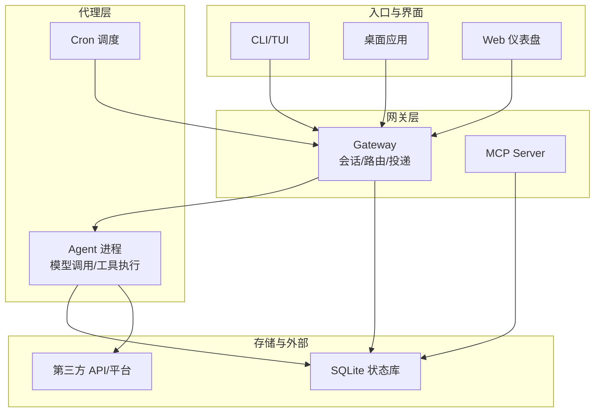
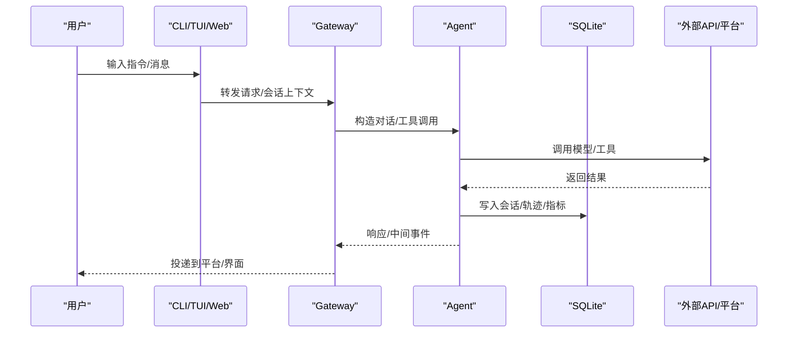
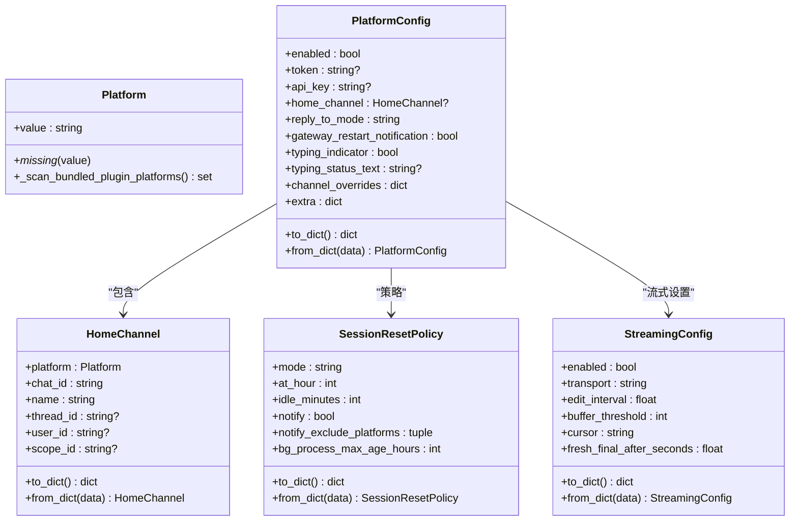
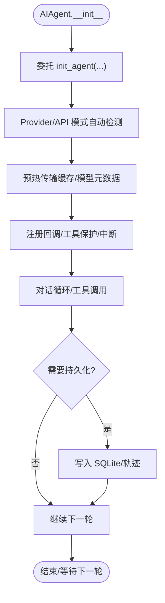
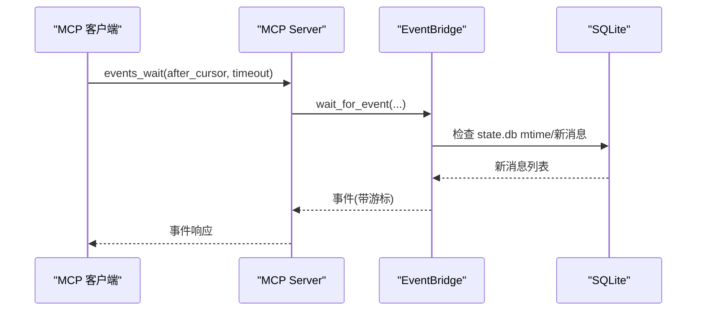
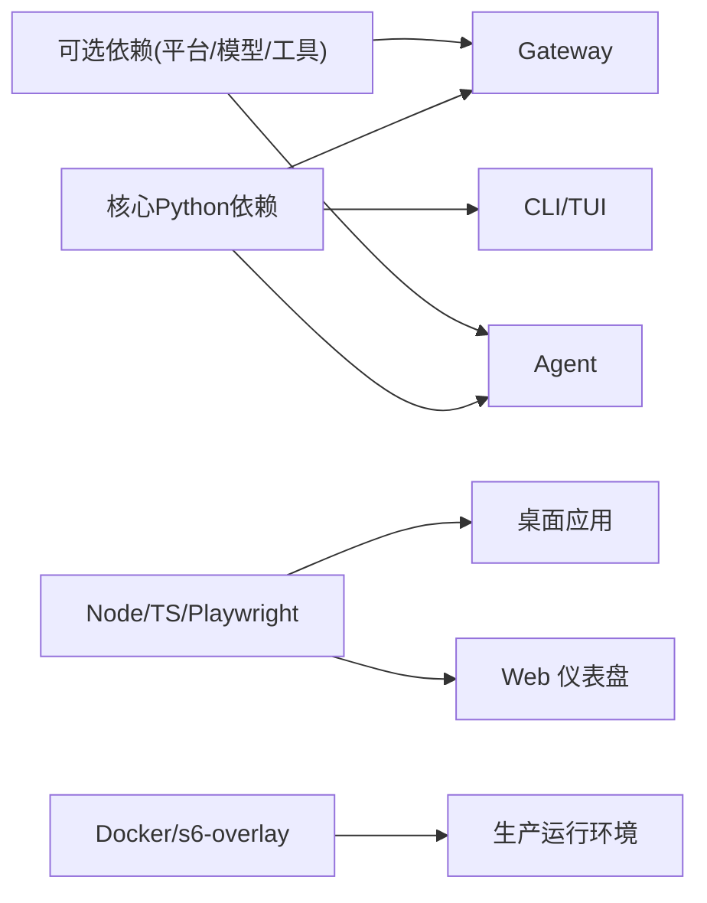

# 架构设计

<cite>
**本文引用的文件**
- [README.md](file://README.md)
- [pyproject.toml](file://pyproject.toml)
- [package.json](file://package.json)
- [Dockerfile](file://Dockerfile)
- [docker-compose.yml](file://docker-compose.yml)
- [gateway/__init__.py](file://gateway/__init__.py)
- [gateway/config.py](file://gateway/config.py)
- [agent/__init__.py](file://agent/__init__.py)
- [run_agent.py](file://run_agent.py)
- [agent/agent_init.py](file://agent/agent_init.py)
- [mcp_serve.py](file://mcp_serve.py)
- [sparkii_cli/main.py](file://sparkii_cli/main.py)
</cite>

## 目录
1. [简介](#简介)
2. [项目结构](#项目结构)
3. [核心组件](#核心组件)
4. [架构总览](#架构总览)
5. [详细组件分析](#详细组件分析)
6. [依赖关系分析](#依赖关系分析)
7. [性能与资源管理](#性能与资源管理)
8. [故障排查指南](#故障排查指南)
9. [结论](#结论)
10. [附录](#附录)

## 简介
本系统是一个自改进的 AI Agent 平台，提供 CLI、桌面端、Web 仪表盘以及多平台消息网关（Telegram、Discord、Slack、WhatsApp、Signal、Matrix 等），并通过 MCP 协议暴露对话能力给外部工具链。系统采用“网关 + 代理进程”分离的微服务式架构：CLI/TUI/Web/Dashboard 作为入口，Gateway 负责多平台接入与会话路由，Agent 进程执行模型调用与工具编排，Cron 调度后台任务，MCP Server 对外暴露统一工具接口。数据通过 SQLite 状态库持久化，事件驱动的消息流在 Gateway 与 Agent 之间流转，插件体系扩展平台、记忆、模型、工具与技能。

## 项目结构
- 顶层入口与命令分发：sparkii_cli/main.py
- 网关层：gateway/*（配置、会话、投递、平台适配）
- 代理层：agent/*（初始化、上下文压缩、工具执行、轨迹记录）
- 运行器：run_agent.py（AIAgent 主循环封装）
- 外部集成：mcp_serve.py（MCP 工具桥接）
- 前端与桌面：apps/desktop、web、ui-tui
- 容器化：Dockerfile、docker-compose.yml
- 依赖声明：pyproject.toml、package.json

图表来源
- [sparkii_cli/main.py:1-800](file://sparkii_cli/main.py#L1-L800)
- [gateway/__init__.py:1-36](file://gateway/__init__.py#L1-L36)
- [mcp_serve.py:1-800](file://mcp_serve.py#L1-L800)
- [run_agent.py:1-800](file://run_agent.py#L1-L800)

章节来源
- [README.md:1-265](file://README.md#L1-L265)
- [pyproject.toml:1-452](file://pyproject.toml#L1-L452)
- [package.json:1-81](file://package.json#L1-L81)

## 核心组件
- CLI/TUI/Web/Dashboard：用户交互与配置入口，启动 gateway、dashboard、mcp serve 等子命令。
- Gateway：多平台消息接入、会话上下文注入、投递路由、平台特定工具集、流式输出。
- Agent：对话循环、工具调用、上下文压缩、轨迹保存、错误分类与重试。
- MCP Server：将对话与事件以 MCP 工具形式暴露给 Claude Code、Cursor、Codex 等客户端。
- Cron：定时任务与平台投递。
- 存储：SQLite（state.db、sessions）、索引与路由信息。

章节来源
- [gateway/__init__.py:1-36](file://gateway/__init__.py#L1-L36)
- [run_agent.py:1-800](file://run_agent.py#L1-L800)
- [mcp_serve.py:1-800](file://mcp_serve.py#L1-L800)
- [sparkii_cli/main.py:1-800](file://sparkii_cli/main.py#L1-L800)

## 架构总览
系统采用分层与事件驱动相结合的微服务风格：
- 入口层：CLI/TUI/Web/Dashboard 提供统一入口，解析命令并启动对应服务。
- 网关层：Gateway 聚合多平台适配器，维护会话上下文与投递策略，协调 Agent 执行。
- 代理层：Agent 进程负责模型调用、工具执行、上下文压缩与轨迹记录。
- 集成层：MCP Server 暴露对话与事件；Cron 调度后台任务。
- 数据层：SQLite 持久化会话、路由、指标与轨迹。

图表来源
- [sparkii_cli/main.py:1-800](file://sparkii_cli/main.py#L1-L800)
- [gateway/__init__.py:1-36](file://gateway/__init__.py#L1-L36)
- [run_agent.py:1-800](file://run_agent.py#L1-L800)
- [mcp_serve.py:1-800](file://mcp_serve.py#L1-L800)

## 详细组件分析

### 网关（Gateway）
- 职责：加载平台配置、管理会话上下文、路由投递、流式输出、平台特性适配。
- 关键能力：
  - 平台枚举与动态发现（内置与插件平台）。
  - 会话重置策略（按日/空闲/组合/关闭）。
  - 流式传输模式（auto/draft/edit/off）与编辑间隔/缓冲阈值。
  - 端口绑定平台校验（避免多实例冲突）。
  - Home Channel 与通知控制。

图表来源
- [gateway/config.py:272-418](file://gateway/config.py#L272-L418)
- [gateway/config.py:420-541](file://gateway/config.py#L420-L541)
- [gateway/config.py:593-708](file://gateway/config.py#L593-L708)
- [gateway/config.py:720-800](file://gateway/config.py#L720-L800)

章节来源
- [gateway/__init__.py:1-36](file://gateway/__init__.py#L1-L36)
- [gateway/config.py:1-800](file://gateway/config.py#L1-L800)

### 代理（Agent）与运行器（AIAgent）
- 职责：对话循环、工具调用、上下文压缩、轨迹保存、错误分类与重试、回调机制。
- 关键能力：
  - 初始化参数众多，委托至 agent_init.init_agent，完成 provider 自动检测、传输缓存预热、上下文引擎生命周期。
  - 会话数据库懒创建与失败重试，支持恢复与分支。
  - 上下文引擎过渡钩子（on_session_end/on_session_reset/on_session_start/carry_over_new_session_context）。
  - 工具执行保护与中断机制。

图表来源
- [run_agent.py:412-800](file://run_agent.py#L412-L800)
- [agent/agent_init.py:459-800](file://agent/agent_init.py#L459-L800)

章节来源
- [run_agent.py:1-800](file://run_agent.py#L1-L800)
- [agent/agent_init.py:1-800](file://agent/agent_init.py#L1-L800)

### MCP 服务器（MCP Bridge）
- 职责：通过 MCP 协议暴露对话查询、消息读取、附件获取、事件轮询/等待、权限审批等工具。
- 关键能力：
  - 事件桥 EventBridge：后台线程轮询 state.db，维护内存队列与游标，支持 wait_for_event。
  - 会话索引构建：优先从 state.db 读取，回退到 sessions.json。
  - 工具集合：conversations_list、conversation_get、messages_read、attachments_fetch、events_poll、events_wait、messages_send、permissions_list_open、permissions_respond、channels_list。

图表来源
- [mcp_serve.py:316-584](file://mcp_serve.py#L316-L584)
- [mcp_serve.py:590-800](file://mcp_serve.py#L590-L800)

章节来源
- [mcp_serve.py:1-800](file://mcp_serve.py#L1-L800)

### CLI 与命令分发
- 职责：解析命令行、快速路径启动、日志与配置早期加载、子命令装配（gateway、dashboard、mcp、cron 等）。
- 关键能力：
  - 早期 TUI/CLI 决策与环境探测（Termux、容器、IPv4 偏好）。
  - 配置文件与 .env 加载、安全红字开关桥接。
  - 子命令构建与注册（gateway、model、setup、tools、plugins 等）。

章节来源
- [sparkii_cli/main.py:1-800](file://sparkii_cli/main.py#L1-L800)

## 依赖关系分析
- Python 运行时：要求 Python >=3.11,<3.14，严格版本锁定以避免供应链风险。
- 核心依赖：OpenAI SDK、httpx、fastapi/uvicorn、rich、tenacity、pydantic、Markdown、psutil、Pillow 等。
- 可选依赖：各平台适配器（telegram、discord、slack、matrix 等）、TTS/STT、图像生成、云提供商（Bedrock、Vertex、Azure Identity）。
- Node.js 生态：Electron、TypeScript、Vite、Playwright（浏览器自动化）。
- 容器化：Debian 13、SQLite 固定版本、s6-overlay 进程监督、Node 26 源镜像。

图表来源
- [pyproject.toml:1-452](file://pyproject.toml#L1-L452)
- [package.json:1-81](file://package.json#L1-L81)
- [Dockerfile:1-458](file://Dockerfile#L1-L458)

章节来源
- [pyproject.toml:1-452](file://pyproject.toml#L1-L452)
- [package.json:1-81](file://package.json#L1-L81)
- [Dockerfile:1-458](file://Dockerfile#L1-L458)

## 性能与资源管理
- 启动优化：
  - CLI 快速路径与早期配置读取，减少导入开销。
  - OpenRouter 模型元数据预热（进程级单例事件防止线程泄漏）。
  - 传输缓存预热，避免首次调用阻塞。
- 并发与限流：
  - 工具并行批处理与破坏性命令隔离。
  - 迭代预算与超时控制，防止无限循环。
- 上下文与记忆：
  - 上下文压缩与截断策略，支持 Codex gpt-5.x 自动提升阈值。
  - 会话数据库懒创建与失败重试，保障健壮性。
- 资源限制：
  - 大输出落盘、附件提取与媒体裁剪（Pillow）。
  - Windows 日志旋转使用 concurrent-log-handler 避免锁竞争。
- 容器与部署：
  - s6-overlay 监督主进程与 dashboard，PID 1 接管与僵尸回收。
  - 只读代码层 + 可写数据卷 /opt/data，lazy-packages 重定向到数据卷。

章节来源
- [run_agent.py:1-800](file://run_agent.py#L1-L800)
- [agent/agent_init.py:1-800](file://agent/agent_init.py#L1-L800)
- [Dockerfile:1-458](file://Dockerfile#L1-L458)

## 故障排查指南
- 常见问题定位：
  - 会话数据库不可用：MCP EventBridge 会降级为无事件轮询，需检查 state.db 可用性与权限。
  - 平台令牌缺失：Gateway 配置校验会提示未配置的 token 环境变量。
  - 流式输出异常：检查 streaming.enabled/transport 与平台是否支持 draft 模式。
  - 容器内权限问题：确保 /opt/data 挂载正确，hermes 用户 UID/GID 映射无误。
- 诊断命令：
  - sparkii doctor：检查配置与依赖。
  - sparkii status：查看组件状态。
  - docker exec hermes hermes logs：查看日志。
- 恢复策略：
  - 会话恢复：支持 resume/branch，注意上下文引擎过渡钩子。
  - 配置回滚：config.yaml 与 .env 优先级明确，必要时清理 active_profile。

章节来源
- [mcp_serve.py:316-584](file://mcp_serve.py#L316-L584)
- [gateway/config.py:577-708](file://gateway/config.py#L577-L708)
- [sparkii_cli/main.py:1-800](file://sparkii_cli/main.py#L1-L800)

## 结论
本系统通过“网关 + 代理进程”的清晰边界实现了多平台接入与可扩展的 AI 能力。Gateway 负责会话与投递，Agent 专注模型与工具执行，MCP 提供标准化工具接口，Cron 支撑自动化。依赖严格锁定与容器化部署保障了稳定性与可移植性。未来可在插件体系上进一步扩展平台、记忆与工具，同时持续优化上下文压缩与流式体验。

## 附录
- 基础设施需求：
  - Python 3.11–3.13，Node 26，SQLite 固定版本，可选 GPU/浏览器环境。
  - 容器：Debian 13 + s6-overlay，/opt/data 数据卷。
- 可扩展性考虑：
  - 平台插件扫描与动态成员（Platform._missing_）。
  - 工具集与技能 Hub，按需懒安装。
  - 多租户/多 Profile 支持（active_profile、SPARKII_HOME）。
- 部署拓扑：
  - 单机：CLI/TUI + Gateway + Dashboard。
  - 容器：Gateway + Dashboard 作为独立服务，共享 /opt/data。
  - 云端：结合 Modal/Daytona/Vercel Sandbox 实现无服务器持久化。
- 横切关注点：
  - 安全性：命令审批、DM 配对、容器隔离、敏感信息脱敏。
  - 监控：OTLP 导出、健康检查、指标采集。
  - 灾难恢复：会话快照、轨迹回放、状态库迁移兼容。
- 技术栈与兼容性：
  - Python 包：openai、httpx、fastapi、uvicorn、pydantic、rich、tenacity、Markdown、psutil、Pillow。
  - Node/TS：electron、vite、playwright。
  - 容器：debian:13.4、node:26-bookworm-slim、s6-overlay 3.2.3.0。

章节来源
- [pyproject.toml:1-452](file://pyproject.toml#L1-L452)
- [package.json:1-81](file://package.json#L1-L81)
- [Dockerfile:1-458](file://Dockerfile#L1-L458)
- [docker-compose.yml:1-77](file://docker-compose.yml#L1-L77)
- [README.md:1-265](file://README.md#L1-L265)