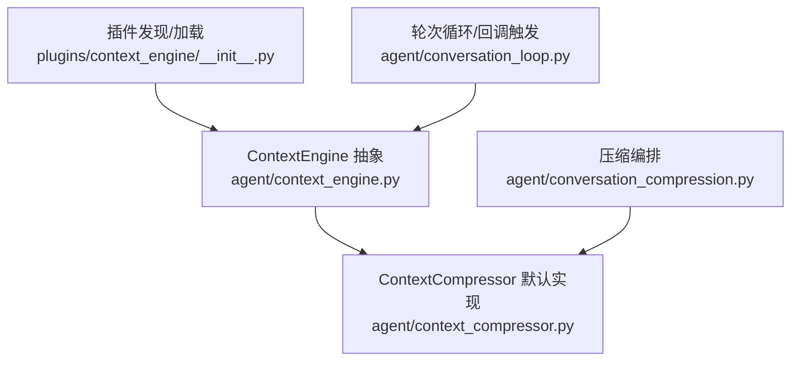
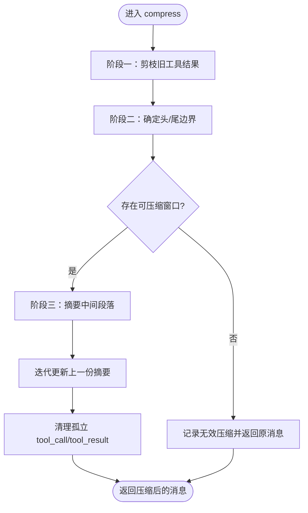
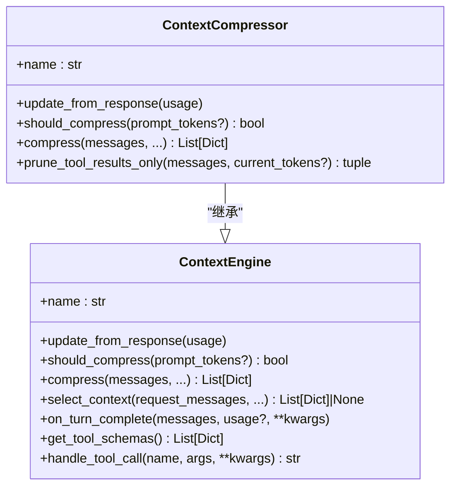
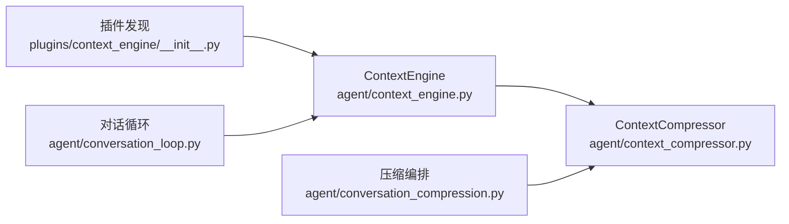

# 上下文引擎模块

<cite>
**本文引用的文件**
- [agent/context_engine.py](file://agent/context_engine.py)
- [plugins/context_engine/__init__.py](file://plugins/context_engine/__init__.py)
- [agent/context_compressor.py](file://agent/context_compressor.py)
- [agent/conversation_compression.py](file://agent/conversation_compression.py)
- [agent/conversation_loop.py](file://agent/conversation_loop.py)
</cite>

## 目录
1. [简介](#简介)
2. [项目结构](#项目结构)
3. [核心组件](#核心组件)
4. [架构总览](#架构总览)
5. [详细组件分析](#详细组件分析)
6. [依赖关系分析](#依赖关系分析)
7. [性能考量](#性能考量)
8. [故障排查指南](#故障排查指南)
9. [结论](#结论)
10. [附录](#附录)

## 简介
本模块提供可插拔的“上下文引擎”抽象，用于在对话接近模型上下文限制时进行压缩、选择与生命周期管理。内置默认实现为基于摘要的压缩器；第三方可通过插件机制替换。引擎负责：
- 决定何时触发压缩
- 执行压缩（摘要、DAG构建等）
- 可选暴露工具供代理调用
- 跟踪来自 API 响应的令牌用量

典型生命周期：实例化并注册 → 会话开始 → 每次响应后更新用量 → 每轮检查是否压缩 → 必要时执行压缩 → 会话结束时清理。

## 项目结构
- 抽象基类与通用能力定义位于 agent/context_engine.py
- 默认实现 ContextCompressor 位于 agent/context_compressor.py
- 插件发现与加载逻辑位于 plugins/context_engine/__init__.py
- 压缩编排与状态协调位于 agent/conversation_compression.py
- 轮次完成回调触发点位于 agent/conversation_loop.py



**图示来源**
- [agent/context_engine.py:89-490](file://agent/context_engine.py#L89-L490)
- [agent/context_compressor.py:1577-1769](file://agent/context_compressor.py#L1577-L1769)
- [plugins/context_engine/__init__.py:33-196](file://plugins/context_engine/__init__.py#L33-L196)
- [agent/conversation_compression.py:2150-2339](file://agent/conversation_compression.py#L2150-L2339)
- [agent/conversation_loop.py:1330-1365](file://agent/conversation_loop.py#L1330-L1365)

**章节来源**
- [agent/context_engine.py:1-26](file://agent/context_engine.py#L1-L26)
- [plugins/context_engine/__init__.py:1-17](file://plugins/context_engine/__init__.py#L1-L17)

## 核心组件
- ContextEngine 抽象基类：定义 name、update_from_response、should_compress、compress、select_context、on_turn_complete 等关键接口，以及预检查、手动压缩前检查、会话生命周期、工具暴露、状态展示与模型切换支持等可选扩展点。
- ContextCompressor 默认实现：基于摘要的压缩策略，包含旧工具结果剪枝、头尾保护、中间段摘要、迭代更新、反抖动与失败冷却、微压缩等。
- 插件系统：扫描 plugins/context_engine/<name>/ 目录，支持 register(ctx) 或顶层子类两种注册方式，统一通过 load_context_engine(name) 获取实例。
- 压缩编排：集中处理自动/手动压缩流程、可行性检查、状态通知、事务围栏与回滚等。
- 轮次回调：在标准最终化路径中调用 on_turn_complete，便于引擎记录实际发生的事件以影响下一轮的 select_context。

**章节来源**
- [agent/context_engine.py:89-490](file://agent/context_engine.py#L89-L490)
- [agent/context_compressor.py:1577-1769](file://agent/context_compressor.py#L1577-L1769)
- [plugins/context_engine/__init__.py:33-196](file://plugins/context_engine/__init__.py#L33-L196)
- [agent/conversation_compression.py:2150-2339](file://agent/conversation_compression.py#L2150-L2339)
- [agent/conversation_loop.py:1330-1365](file://agent/conversation_loop.py#L1330-L1365)

## 架构总览
上下文引擎通过“选择—压缩—观察”三段式协作：
- 选择：select_context 在请求生成前按主题/角色/分支等策略挑选本轮上下文
- 压缩：should_compress + compress 在超过阈值时执行摘要/剪枝
- 观察：on_turn_complete 在轮次完成后记录实际发生的事件，驱动下一次选择

```mermaid
sequenceDiagram
participant Host as "宿主"
participant Engine as "ContextEngine"
participant Compressor as "ContextCompressor"
participant Loop as "对话循环"
participant Comp as "压缩编排"
Host->>Loop : 组装请求消息
Loop->>Engine : select_context(request_messages, ...)
Engine-->>Loop : 返回请求级上下文(可替换/不变)
Loop->>Engine : should_compress(prompt_tokens?)
alt 需要压缩
Loop->>Comp : compress_context(...)
Comp->>Compressor : compress(messages, ...)
Compressor-->>Comp : 返回压缩后的消息
Comp-->>Loop : 提交/回滚并通知
else 不需要压缩
Loop-->>Host : 直接发送请求
end
Loop->>Engine : on_turn_complete(messages, usage, ...)
```

**图示来源**
- [agent/context_engine.py:215-328](file://agent/context_engine.py#L215-L328)
- [agent/context_compressor.py:6400-6589](file://agent/context_compressor.py#L6400-L6589)
- [agent/conversation_compression.py:2150-2339](file://agent/conversation_compression.py#L2150-L2339)
- [agent/conversation_loop.py:1330-1365](file://agent/conversation_loop.py#L1330-L1365)

## 详细组件分析

### ContextEngine 抽象基类
- 身份与状态
  - name：短标识符
  - last_prompt_tokens / last_completion_tokens / last_total_tokens / threshold_tokens / context_length / compression_count：由 run_agent 读取用于显示/日志
- 核心接口
  - update_from_response(usage)：从 API 响应更新令牌用量（兼容新旧字段）
  - should_compress(prompt_tokens?)：判断本轮是否需要压缩
  - should_compress_info(prompt_tokens?)：返回 (bool, reason)，便于上层解释跳过原因
  - compress(messages, current_tokens?, focus_topic?, force?, memory_context?)：主入口，返回符合 OpenAI 格式的更短消息列表
- 可选扩展
  - prune_tool_results_only(messages, current_tokens?)：低成本剪枝旧工具结果，独立于 should_compress
  - select_context(request_messages, conversation_messages?, incoming_message?, budget_tokens?)：请求级上下文选择（不持久化）
  - on_turn_complete(messages, usage?, **kwargs)：轮次完成观察（读快照，不修改持久历史）
  - should_compress_preflight(messages)：API 调用前的快速估算
  - should_defer_preflight_to_real_usage(rough_tokens)：将预检延迟到真实用量
  - get_automatic_compaction_status_message(phase, default_message, **context)：控制自动压缩的用户可见状态
  - has_content_to_compress(messages)：/compress 命令的前置检查
  - on_session_start/on_session_end/on_session_reset：会话生命周期
  - get_tool_schemas/handle_tool_call：暴露引擎工具
  - get_status/update_model：状态展示与模型切换时的阈值重算

**章节来源**
- [agent/context_engine.py:89-490](file://agent/context_engine.py#L89-L490)

### ContextCompressor 默认实现
- 算法要点
  - 阶段一：低成本剪枝旧工具结果（无 LLM 调用）
  - 阶段二：保护头部（系统提示 + 首条交互），按 token 预算保护尾部
  - 阶段三：对中间段落进行结构化摘要，并在后续压缩中迭代更新
  - 阶段四：异常恢复与冷却（摘要失败冷却、反抖动、微压缩）
- 关键方法
  - update_from_response：同步真实 prompt_tokens，维护防抖/投影基线，判定压缩是否有效
  - should_compress / should_compress_info：阈值比较 + 冷却/反抖动保护，返回跳过原因
  - compress：完整压缩流程，含可行性跳过、摘要失败回退、清理孤立 tool_call/tool_result 等
  - prune_tool_results_only：低成本剪枝，配合大窗口引擎提前回收已重发的工具输出
  - should_compress_preflight / should_defer_preflight_to_real_usage：预检优化，避免粗糙估计导致的误触发
  - get_automatic_compaction_status_message：控制自动压缩的用户可见状态
  - on_session_reset：重置会话内状态（摘要缓存、冷却、指标等）



**图示来源**
- [agent/context_compressor.py:6400-6589](file://agent/context_compressor.py#L6400-L6589)

**章节来源**
- [agent/context_compressor.py:1577-1769](file://agent/context_compressor.py#L1577-L1769)
- [agent/context_compressor.py:2741-2950](file://agent/context_compressor.py#L2741-L2950)
- [agent/context_compressor.py:6400-6589](file://agent/context_compressor.py#L6400-L6589)

### 插件发现与自定义引擎开发
- 插件目录约定：plugins/context_engine/<name>/__init__.py
- 两种注册方式
  - register(ctx)：通过虚拟 ctx.register_context_engine(engine) 注册
  - 顶层类：继承 ContextEngine 并实例化
- 发现与加载
  - discover_context_engines()：扫描并返回可用引擎元数据
  - load_context_engine(name)：按名称加载引擎实例
- 命令注册：_EngineCollector 转发 register_command 到全局插件命令注册表，避免与内置命令冲突



**图示来源**
- [agent/context_engine.py:89-490](file://agent/context_engine.py#L89-L490)
- [agent/context_compressor.py:1577-1769](file://agent/context_compressor.py#L1577-L1769)
- [plugins/context_engine/__init__.py:100-196](file://plugins/context_engine/__init__.py#L100-L196)

**章节来源**
- [plugins/context_engine/__init__.py:33-196](file://plugins/context_engine/__init__.py#L33-L196)

### 自动压缩触发与预检查优化
- 自动触发：should_compress 基于阈值与冷却/反抖动策略决定是否压缩
- 预检查优化
  - should_compress_preflight：在 API 调用前做粗略估算
  - should_defer_preflight_to_real_usage：当粗糙估计噪声较大时，延迟到真实用量后再决策，避免误触发
  - note_request_rough_estimate：记录即将发送请求的粗糙 token 数，与真实 prompt_tokens 配对形成投影基线
- 有效性验证：update_from_response 中根据真实 prompt_tokens 判定上次压缩是否清除了阈值，否则记录无效压缩计数并触发反抖动

**章节来源**
- [agent/context_compressor.py:2741-2950](file://agent/context_compressor.py#L2741-L2950)
- [agent/context_engine.py:332-347](file://agent/context_engine.py#L332-L347)

### 工具结果剪枝（低成本）
- prune_tool_results_only：在不调用 LLM 的情况下，按保护尾部策略裁剪旧工具结果，返回 (messages, n_pruned)
- 适用场景：大窗口引擎可在 full compaction 之前更早回收已重发的工具输出，降低开销

**章节来源**
- [agent/context_engine.py:194-211](file://agent/context_engine.py#L194-L211)
- [agent/context_compressor.py:6400-6589](file://agent/context_compressor.py#L6400-L6589)

### 上下文选择 select_context 与轮次完成 on_turn_complete
- select_context：在请求生成前按主题/角色/分支等策略选择本轮上下文，不影响持久历史
- on_turn_complete：在轮次完成后接收最终化的内存快照与用量信息，用于索引/总结/路由状态更新，影响下一次 select_context
- 调用位置：对话循环的标准最终化路径中触发

```mermaid
sequenceDiagram
participant Loop as "对话循环"
participant Engine as "ContextEngine"
Loop->>Engine : select_context(request_messages, ...)
Engine-->>Loop : 返回请求级上下文
Loop->>Engine : on_turn_complete(messages, usage, ...)
```

**图示来源**
- [agent/context_engine.py:215-328](file://agent/context_engine.py#L215-L328)
- [agent/conversation_loop.py:1330-1365](file://agent/conversation_loop.py#L1330-L1365)

**章节来源**
- [agent/context_engine.py:215-328](file://agent/context_engine.py#L215-L328)
- [agent/conversation_loop.py:1330-1365](file://agent/conversation_loop.py#L1330-L1365)

### 会话生命周期管理
- on_session_start：会话开始时加载持久状态（如 DAG/存储）
- on_session_end：会话真正结束时刷新状态、关闭连接等
- on_session_reset：/new 或 /reset 时重置压缩计数与令牌追踪
- 模型切换 update_model：更新 context_length 与 threshold_tokens，支持 per-model 阈值覆盖

**章节来源**
- [agent/context_engine.py:387-490](file://agent/context_engine.py#L387-L490)

## 依赖关系分析
- ContextEngine 被 ContextCompressor 继承实现
- 插件发现模块动态加载用户提供的引擎实现
- 压缩编排模块协调自动/手动压缩流程，并与引擎状态交互
- 对话循环在合适时机调用 select_context 与 on_turn_complete



**图示来源**
- [agent/context_engine.py:89-490](file://agent/context_engine.py#L89-L490)
- [agent/context_compressor.py:1577-1769](file://agent/context_compressor.py#L1577-L1769)
- [plugins/context_engine/__init__.py:33-196](file://plugins/context_engine/__init__.py#L33-L196)
- [agent/conversation_compression.py:2150-2339](file://agent/conversation_compression.py#L2150-L2339)
- [agent/conversation_loop.py:1330-1365](file://agent/conversation_loop.py#L1330-L1365)

**章节来源**
- [agent/context_engine.py:89-490](file://agent/context_engine.py#L89-L490)
- [plugins/context_engine/__init__.py:33-196](file://plugins/context_engine/__init__.py#L33-L196)
- [agent/conversation_compression.py:2150-2339](file://agent/conversation_compression.py#L2150-L2339)
- [agent/conversation_loop.py:1330-1365](file://agent/conversation_loop.py#L1330-L1365)

## 性能考量
- 低成本剪枝优先：prune_tool_results_only 在无 LLM 调用的情况下回收旧工具结果，适合大窗口引擎提前释放空间
- 预检优化：should_defer_preflight_to_real_usage 使用最近一次 (rough, real) 配对投影真实用量，减少因粗糙估计导致的误触发
- 反抖动与冷却：无效压缩计数与摘要失败冷却避免频繁压缩与重试风暴
- 微压缩：在多次失败或低收益场景下尝试增量压缩，提高整体效率
- 尾部保护：按 token 预算保护最近消息，确保最新上下文不被过度压缩

[本节为通用指导，无需特定文件引用]

## 故障排查指南
- 压缩未生效
  - 检查 should_compress_info 返回的原因（冷却/反抖动/不可压缩窗口）
  - 确认 update_from_response 是否正确更新了 last_prompt_tokens 与阈值
- 反复压缩但效果不佳
  - 查看无效压缩计数与冷却状态，可能系统提示/工具模式已占满阈值
  - 考虑启用/调整 micro-compaction 或外部工具结果剪枝
- 自动压缩状态不显示
  - 检查 emit_automatic_compaction_status 与 get_automatic_compaction_status_message 的实现
- 插件未加载
  - 确认插件目录结构与 __init__.py 是否存在，register 或顶层类是否正确
  - 查看 discover_context_engines 与 load_context_engine 的返回值与日志

**章节来源**
- [agent/context_compressor.py:2741-2950](file://agent/context_compressor.py#L2741-L2950)
- [agent/context_engine.py:349-383](file://agent/context_engine.py#L349-L383)
- [plugins/context_engine/__init__.py:33-196](file://plugins/context_engine/__init__.py#L33-L196)

## 结论
上下文引擎模块通过清晰的抽象与可扩展的插件体系，实现了灵活的上下文选择、压缩与生命周期管理。默认实现提供了稳健的摘要压缩策略与多种优化（预检、剪枝、反抖动、冷却、微压缩）。开发者可基于该框架定制策略，并通过 select_context 与 on_turn_complete 实现“选择—压缩—观察”的闭环，从而在不同模型与负载下保持高效稳定的对话体验。

[本节为总结性内容，无需特定文件引用]

## 附录
- 自定义上下文引擎开发步骤
  - 在 plugins/context_engine/<name>/ 创建 __init__.py
  - 实现 ContextEngine 子类或提供 register(ctx) 函数
  - 实现 update_from_response、should_compress、compress 等核心方法
  - 可选实现 select_context、on_turn_complete、prune_tool_results_only 等扩展点
  - 通过 load_context_engine("your_name") 加载并配置使用
- 使用示例（概念性说明）
  - select_context：根据 incoming_message 的主题或 conversation_messages 的历史，返回仅包含相关上下文的请求消息列表
  - on_turn_complete：记录本轮实际使用的 tokens 与关键事件，用于下次 select_context 的决策
  - 插件注册：在 register(ctx) 中调用 ctx.register_context_engine(engine) 或通过顶层类实例化

[本节为概念性说明，无需特定文件引用]