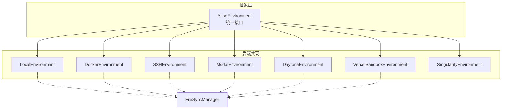
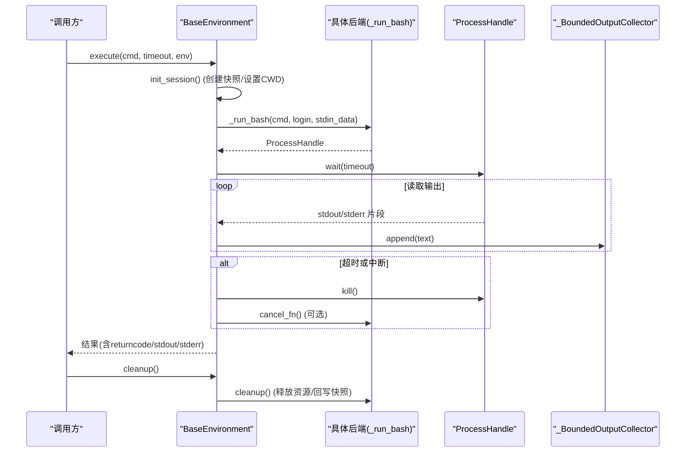
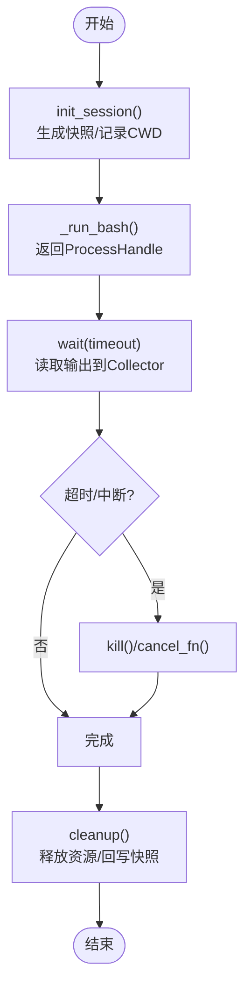
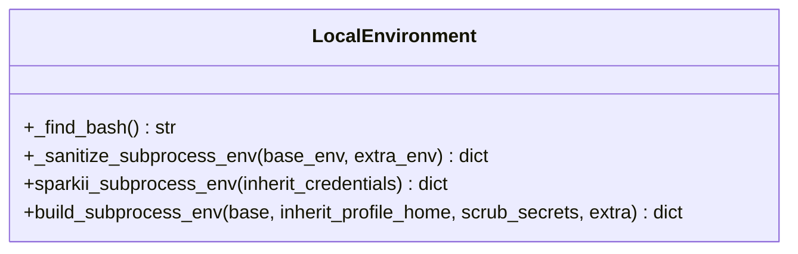
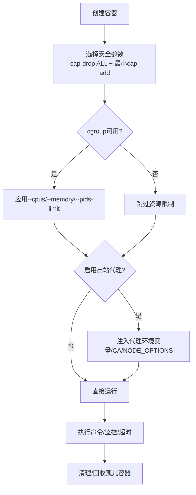
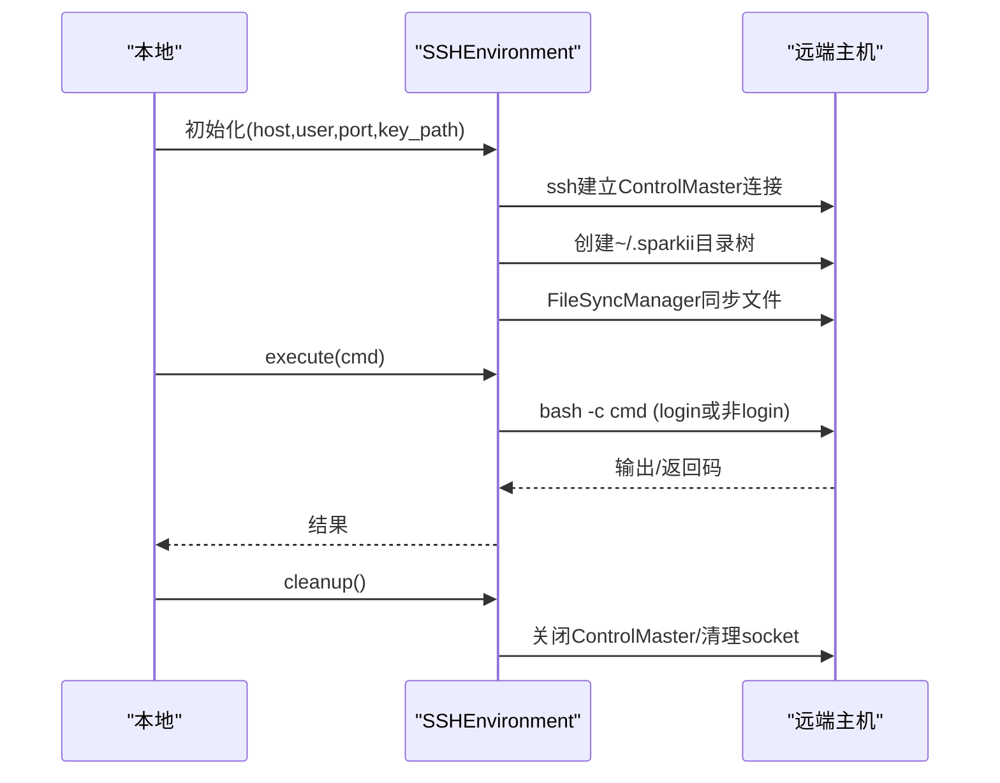
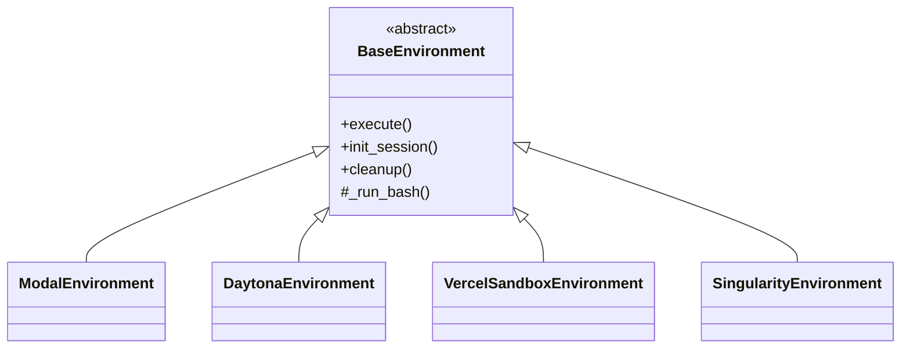
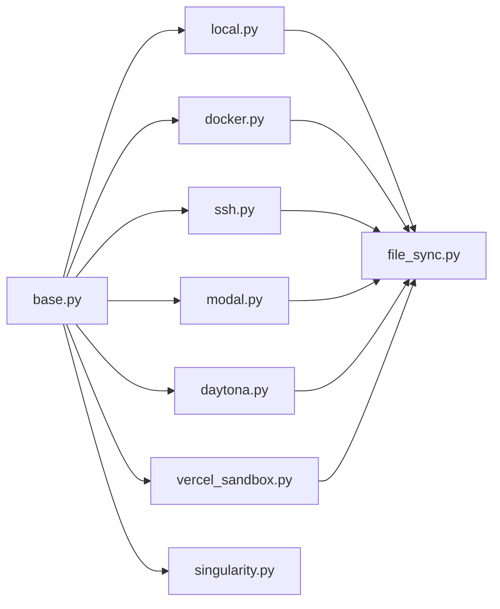

# 工具执行环境模块

<cite>
**本文引用的文件**
- [tools/environments/base.py](file://tools/environments/base.py)
- [tools/environments/local.py](file://tools/environments/local.py)
- [tools/environments/docker.py](file://tools/environments/docker.py)
- [tools/environments/ssh.py](file://tools/environments/ssh.py)
- [tools/environments/modal.py](file://tools/environments/modal.py)
- [tools/environments/daytona.py](file://tools/environments/daytona.py)
- [tools/environments/singularity.py](file://tools/environments/singularity.py)
- [tools/environments/vercel_sandbox.py](file://tools/environments/vercel_sandbox.py)
- [tools/environments/file_sync.py](file://tools/environments/file_sync.py)
- [tools/environments/__init__.py](file://tools/environments/__init__.py)
</cite>

## 目录
1. [简介](#简介)
2. [项目结构](#项目结构)
3. [核心组件](#核心组件)
4. [架构总览](#架构总览)
5. [详细组件分析](#详细组件分析)
6. [依赖关系分析](#依赖关系分析)
7. [性能考量](#性能考量)
8. [故障排查指南](#故障排查指南)
9. [结论](#结论)
10. [附录：自定义执行环境开发指南](#附录自定义执行环境开发指南)

## 简介
本模块提供统一的“工具执行环境”抽象与多种后端实现，用于在本地、容器、远程主机或云端沙箱中安全地运行命令。其核心设计包括：
- 统一抽象基类：所有后端均实现相同的接口，屏蔽底层差异。
- 会话快照与CWD持久化：通过登录Shell环境快照和CWD标记，保证跨调用状态一致。
- 沙箱隔离与安全约束：容器/远端/云沙箱提供强隔离；本地环境具备严格的凭据过滤与环境清理策略。
- 资源管理与超时控制：统一的进程等待、中断处理、输出截断与溢出转储机制。
- 文件同步：对远端/云环境提供增量/批量文件同步能力。
- 动态加载与版本兼容：按需安装SDK、懒加载依赖、兼容不同平台与运行时。

## 项目结构
- base.py：定义统一抽象基类、进程句柄协议、输出收集器、CWD标记、活动回调等通用能力。
- local.py：本地执行环境，负责bash查找、路径转换、环境变量清洗、子进程环境构建。
- docker.py：Docker/Podman容器执行环境，包含安全参数、资源限制、代理出站控制、孤儿容器回收。
- ssh.py：SSH远端执行环境，使用ControlMaster复用连接，支持批量文件传输。
- modal.py / daytona.py / vercel_sandbox.py / singularity.py：云端/容器化执行环境，封装各自SDK，提供快照与持久化能力。
- file_sync.py：文件同步管理器（被多个后端复用）。
- __init__.py：对外暴露BaseEnvironment。

图表来源
- [tools/environments/base.py:581-648](file://tools/environments/base.py#L581-L648)
- [tools/environments/local.py:1-120](file://tools/environments/local.py#L1-L120)
- [tools/environments/docker.py:1-120](file://tools/environments/docker.py#L1-L120)
- [tools/environments/ssh.py:40-86](file://tools/environments/ssh.py#L40-L86)
- [tools/environments/modal.py:164-191](file://tools/environments/modal.py#L164-L191)
- [tools/environments/daytona.py:30-52](file://tools/environments/daytona.py#L30-L52)
- [tools/environments/vercel_sandbox.py:243-276](file://tools/environments/vercel_sandbox.py#L243-L276)
- [tools/environments/singularity.py:161-198](file://tools/environments/singularity.py#L161-L198)

章节来源
- [tools/environments/__init__.py:1-15](file://tools/environments/__init__.py#L1-L15)

## 核心组件
- BaseEnvironment：定义execute生命周期（初始化会话快照、source快照、执行命令、捕获CWD）、超时与中断、输出收集与截断、清理钩子。
- ProcessHandle/_ThreadedProcessHandle：统一进程句柄接口，适配本地subprocess与云端SDK的阻塞调用。
- _BoundedOutputCollector：内存受限的输出收集器，支持溢出时转储到磁盘文件，避免OOM。
- LocalEnvironment：本地bash执行、路径与权限修复、环境变量清洗（严格屏蔽敏感键）、子进程环境工厂。
- DockerEnvironment：容器启动参数、安全能力裁剪、cgroup资源限制探测、出站代理强制、孤儿容器回收。
- SSHEnvironment：ControlMaster长连接、批量tar流式传输、远程目录准备与删除。
- Modal/Daytona/Vercel/Singularity：云端/容器化执行，封装SDK，提供快照/恢复、持久化文件系统、资源配额、重试与退避。

章节来源
- [tools/environments/base.py:81-231](file://tools/environments/base.py#L81-L231)
- [tools/environments/base.py:410-495](file://tools/environments/base.py#L410-L495)
- [tools/environments/base.py:581-800](file://tools/environments/base.py#L581-L800)
- [tools/environments/local.py:456-719](file://tools/environments/local.py#L456-L719)
- [tools/environments/docker.py:322-395](file://tools/environments/docker.py#L322-L395)
- [tools/environments/ssh.py:87-103](file://tools/environments/ssh.py#L87-L103)
- [tools/environments/modal.py:164-191](file://tools/environments/modal.py#L164-L191)
- [tools/environments/daytona.py:30-52](file://tools/environments/daytona.py#L30-L52)
- [tools/environments/vercel_sandbox.py:243-276](file://tools/environments/vercel_sandbox.py#L243-L276)
- [tools/environments/singularity.py:161-198](file://tools/environments/singularity.py#L161-L198)

## 架构总览
下图展示了从调用方到具体后端的执行流程，包括会话快照、命令执行、输出收集、超时与中断、以及清理阶段。

图表来源
- [tools/environments/base.py:581-800](file://tools/environments/base.py#L581-L800)
- [tools/environments/base.py:410-495](file://tools/environments/base.py#L410-L495)
- [tools/environments/modal.py:408-441](file://tools/environments/modal.py#L408-L441)
- [tools/environments/daytona.py:219-243](file://tools/environments/daytona.py#L219-L243)
- [tools/environments/vercel_sandbox.py:597-638](file://tools/environments/vercel_sandbox.py#L597-L638)

## 详细组件分析

### 抽象基类与执行流程
- 会话快照：首次执行前以登录shell导出env/函数/别名，原子写入快照文件，后续命令直接source，避免重复登录开销。
- CWD持久化：通过带session_id的标记字符串在stdout中传递当前工作目录，确保远程/容器内CWD一致性。
- 输出收集：_BoundedOutputCollector维护头尾窗口，超过阈值时转储到spill文件，防止内存膨胀。
- 超时与中断：统一wait_for_process循环，支持周期性心跳回调与中断信号传播。
- 清理：子类实现cleanup释放容器/实例/连接，并回写持久化数据（如快照/overlay）。

图表来源
- [tools/environments/base.py:581-800](file://tools/environments/base.py#L581-L800)
- [tools/environments/base.py:81-231](file://tools/environments/base.py#L81-L231)

章节来源
- [tools/environments/base.py:581-800](file://tools/environments/base.py#L581-L800)
- [tools/environments/base.py:81-231](file://tools/environments/base.py#L81-L231)

### 本地执行环境（Local）
- Bash发现与路径转换：Windows下MSYS/Git-Bash路径互转，避免驱动盘符导致的错误。
- 安全的环境构建：
  - 严格屏蔽Sparkii内部密钥、第三方API密钥、网关令牌等。
  - 剥离活跃虚拟环境标记（VIRTUAL_ENV/CONDA_PREFIX），防止污染其他项目。
  - 注入SPARKII_HOME与子进程HOME契约，保持配置一致性。
  - 跨会话上下文变量防护，避免多会话并发下的泄漏。
- 子进程环境工厂：build_subprocess_env/sparkii_subprocess_env提供统一入口，支持是否继承凭据的策略。

图表来源
- [tools/environments/local.py:722-800](file://tools/environments/local.py#L722-L800)
- [tools/environments/local.py:456-719](file://tools/environments/local.py#L456-L719)

章节来源
- [tools/environments/local.py:25-138](file://tools/environments/local.py#L25-L138)
- [tools/environments/local.py:155-198](file://tools/environments/local.py#L155-L198)
- [tools/environments/local.py:225-337](file://tools/environments/local.py#L225-L337)
- [tools/environments/local.py:352-513](file://tools/environments/local.py#L352-L513)
- [tools/environments/local.py:574-719](file://tools/environments/local.py#L574-L719)
- [tools/environments/local.py:722-800](file://tools/environments/local.py#L722-L800)

### Docker执行环境
- 安全加固：默认丢弃全部能力，仅添加最小必要能力；no-new-privileges；/tmp与/var/tmp大小限制；/run按镜像类型挂载exec/noexec。
- 资源限制：探测cgroup可用性，启用CPU/内存/PID限制；共享内存大小可配。
- 出站代理：可选iron-proxy强制出站，自动注入CA证书、代理环境变量与NODE_OPTIONS追加；检测冲突参数并告警。
- 孤儿容器回收：扫描并清理长时间未使用的已退出容器，避免资源泄露。
- 可插拔CLI：优先SPARKII_DOCKER_BINARY，其次PATH中的docker/podman，最后尝试已知安装路径。

图表来源
- [tools/environments/docker.py:322-395](file://tools/environments/docker.py#L322-L395)
- [tools/environments/docker.py:397-556](file://tools/environments/docker.py#L397-L556)
- [tools/environments/docker.py:720-770](file://tools/environments/docker.py#L720-L770)
- [tools/environments/docker.py:148-240](file://tools/environments/docker.py#L148-L240)

章节来源
- [tools/environments/docker.py:148-240](file://tools/environments/docker.py#L148-L240)
- [tools/environments/docker.py:277-320](file://tools/environments/docker.py#L277-L320)
- [tools/environments/docker.py:322-395](file://tools/environments/docker.py#L322-L395)
- [tools/environments/docker.py:397-556](file://tools/environments/docker.py#L397-L556)
- [tools/environments/docker.py:558-636](file://tools/environments/docker.py#L558-L636)
- [tools/environments/docker.py:638-696](file://tools/environments/docker.py#L638-L696)
- [tools/environments/docker.py:720-770](file://tools/environments/docker.py#L720-L770)

### SSH执行环境
- 连接复用：ControlMaster+ControlPersist减少握手开销。
- 文件同步：单文件scp与批量tar管道传输，避免N次网络往返。
- 远程目录准备：一次性mkdir创建~/.sparkii/{skills,credentials,cache}。
- 错误处理：连接失败/超时/批量传输失败均抛出明确异常并提供重试提示。

图表来源
- [tools/environments/ssh.py:40-86](file://tools/environments/ssh.py#L40-L86)
- [tools/environments/ssh.py:87-103](file://tools/environments/ssh.py#L87-L103)
- [tools/environments/ssh.py:160-173](file://tools/environments/ssh.py#L160-L173)
- [tools/environments/ssh.py:211-341](file://tools/environments/ssh.py#L211-L341)
- [tools/environments/ssh.py:394-405](file://tools/environments/ssh.py#L394-L405)
- [tools/environments/ssh.py:406-427](file://tools/environments/ssh.py#L406-L427)

章节来源
- [tools/environments/ssh.py:28-38](file://tools/environments/ssh.py#L28-L38)
- [tools/environments/ssh.py:40-86](file://tools/environments/ssh.py#L40-L86)
- [tools/environments/ssh.py:87-103](file://tools/environments/ssh.py#L87-L103)
- [tools/environments/ssh.py:160-173](file://tools/environments/ssh.py#L160-L173)
- [tools/environments/ssh.py:211-341](file://tools/environments/ssh.py#L211-L341)
- [tools/environments/ssh.py:394-405](file://tools/environments/ssh.py#L394-L405)
- [tools/environments/ssh.py:406-427](file://tools/environments/ssh.py#L406-L427)

### 云端/容器化执行环境（Modal/Daytona/Vercel/Singularity）
- 共同点：
  - 基于BaseEnvironment，实现_run_bash与cleanup。
  - 使用_ThreadedProcessHandle将SDK阻塞调用包装为进程句柄，支持kill/cancel。
  - 支持快照/恢复与持久化文件系统（可选）。
  - 文件同步：通过FileSyncManager进行增量/批量上传下载。
- 差异点：
  - Modal：原生SDK异步调用，需事件循环线程桥接；stdin分块写入避免缓冲限制。
  - Daytona：资源配额（CPU/内存/磁盘）受平台上限限制；支持暂停/恢复。
  - Vercel：最小运行超时保护；重试退避；禁止配置容器磁盘；快照存储于SPARKII_HOME。
  - Singularity：apptainer/singularity实例管理；SIF缓存与构建；overlay持久化。

图表来源
- [tools/environments/base.py:581-648](file://tools/environments/base.py#L581-L648)
- [tools/environments/modal.py:164-191](file://tools/environments/modal.py#L164-L191)
- [tools/environments/daytona.py:30-52](file://tools/environments/daytona.py#L30-L52)
- [tools/environments/vercel_sandbox.py:243-276](file://tools/environments/vercel_sandbox.py#L243-L276)
- [tools/environments/singularity.py:161-198](file://tools/environments/singularity.py#L161-L198)

章节来源
- [tools/environments/modal.py:83-125](file://tools/environments/modal.py#L83-L125)
- [tools/environments/modal.py:127-163](file://tools/environments/modal.py#L127-L163)
- [tools/environments/modal.py:164-191](file://tools/environments/modal.py#L164-L191)
- [tools/environments/modal.py:295-399](file://tools/environments/modal.py#L295-L399)
- [tools/environments/modal.py:408-479](file://tools/environments/modal.py#L408-L479)
- [tools/environments/daytona.py:30-52](file://tools/environments/daytona.py#L30-L52)
- [tools/environments/daytona.py:154-201](file://tools/environments/daytona.py#L154-L201)
- [tools/environments/daytona.py:206-243](file://tools/environments/daytona.py#L206-L243)
- [tools/environments/daytona.py:244-271](file://tools/environments/daytona.py#L244-L271)
- [tools/environments/vercel_sandbox.py:47-76](file://tools/environments/vercel_sandbox.py#L47-L76)
- [tools/environments/vercel_sandbox.py:114-135](file://tools/environments/vercel_sandbox.py#L114-L135)
- [tools/environments/vercel_sandbox.py:243-276](file://tools/environments/vercel_sandbox.py#L243-L276)
- [tools/environments/vercel_sandbox.py:306-343](file://tools/environments/vercel_sandbox.py#L306-L343)
- [tools/environments/vercel_sandbox.py:597-638](file://tools/environments/vercel_sandbox.py#L597-L638)
- [tools/environments/vercel_sandbox.py:639-663](file://tools/environments/vercel_sandbox.py#L639-L663)
- [tools/environments/singularity.py:30-62](file://tools/environments/singularity.py#L30-L62)
- [tools/environments/singularity.py:108-159](file://tools/environments/singularity.py#L108-L159)
- [tools/environments/singularity.py:161-198](file://tools/environments/singularity.py#L161-L198)
- [tools/environments/singularity.py:200-234](file://tools/environments/singularity.py#L200-L234)
- [tools/environments/singularity.py:235-269](file://tools/environments/singularity.py#L235-L269)

## 依赖关系分析
- 后端对base的依赖：所有后端继承BaseEnvironment，复用执行流程、输出收集、超时与中断。
- 文件同步：多数后端依赖FileSyncManager进行高效文件传输。
- 平台/运行时：
  - Windows路径与Git-Bash兼容性由local.py处理。
  - Docker/Podman CLI探测与参数组合由docker.py处理。
  - SSH依赖OpenSSH客户端。
  - 云端SDK按需懒加载（modal/daytona/vercel）。

图表来源
- [tools/environments/base.py:581-648](file://tools/environments/base.py#L581-L648)
- [tools/environments/local.py:1-120](file://tools/environments/local.py#L1-L120)
- [tools/environments/docker.py:1-120](file://tools/environments/docker.py#L1-L120)
- [tools/environments/ssh.py:1-24](file://tools/environments/ssh.py#L1-L24)
- [tools/environments/modal.py:1-31](file://tools/environments/modal.py#L1-L31)
- [tools/environments/daytona.py:1-26](file://tools/environments/daytona.py#L1-L26)
- [tools/environments/vercel_sandbox.py:1-37](file://tools/environments/vercel_sandbox.py#L1-L37)
- [tools/environments/singularity.py:1-24](file://tools/environments/singularity.py#L1-L24)

章节来源
- [tools/environments/__init__.py:1-15](file://tools/environments/__init__.py#L1-L15)

## 性能考量
- 输出收集：_BoundedOutputCollector限制内存占用，溢出时转储到磁盘，避免大输出导致OOM。
- 文件同步：批量上传/下载（tar管道、SDK批量接口）显著降低网络往返与TLS握手开销。
- 连接复用：SSH ControlMaster减少握手成本；Docker/Podman复用容器或标签管理。
- 资源限制：Docker cgroup限制CPU/内存/PID，Singularity支持内存/CPU限制，避免资源争用。
- 懒加载：云端SDK按需安装与导入，减少冷启动时间。

[本节为通用指导，不直接分析具体文件]

## 故障排查指南
- 基础设施不可达：
  - SSH连接失败/超时：检查主机可达性、端口、密钥认证；查看EnvironmentConnectionError的重试提示。
  - Docker不可用：确认CLI存在且可执行；若未找到，安装Docker或修正PATH。
- 会话快照失败：
  - 登录shell不可用：自动降级为非登录bash；检查Git-Bash/MSYS路径与ASLR问题。
- 输出过大：
  - 检查Collector的max_chars与spill_path；必要时调整阈值或清理历史输出。
- 云端沙箱异常：
  - Vercel/Modal/Daytona：关注重试退避、临时状态码、快照恢复失败时的回退逻辑。
  - Singularity：SIF构建失败时回退到docker:// URL；检查APPTAINER_CACHEDIR与网络。

章节来源
- [tools/environments/base.py:55-79](file://tools/environments/base.py#L55-L79)
- [tools/environments/base.py:764-800](file://tools/environments/base.py#L764-L800)
- [tools/environments/ssh.py:104-133](file://tools/environments/ssh.py#L104-L133)
- [tools/environments/docker.py:772-800](file://tools/environments/docker.py#L772-L800)
- [tools/environments/vercel_sandbox.py:114-135](file://tools/environments/vercel_sandbox.py#L114-L135)
- [tools/environments/singularity.py:108-159](file://tools/environments/singularity.py#L108-L159)

## 结论
本模块通过统一的抽象基类与多后端实现，提供了安全、可移植、可扩展的工具执行环境。其关键优势包括：
- 一致的接口与生命周期管理，简化新增后端。
- 强大的沙箱隔离与安全策略，保护敏感凭据与系统资源。
- 高效的文件同步与输出收集，优化大规模任务执行。
- 完善的错误处理与可观测性，便于定位与恢复。

[本节为总结，不直接分析具体文件]

## 附录：自定义执行环境开发指南
- 实现要求：
  - 继承BaseEnvironment，实现_run_bash与cleanup。
  - 如需支持stdin作为heredoc，设置_stdin_mode = "heredoc"。
  - 使用_ThreadedProcessHandle包装SDK阻塞调用，提供cancel_fn以支持中断。
- 资源清理：
  - 在cleanup中释放容器/实例/连接，并回写持久化数据（快照/overlay）。
  - 对于云端环境，注意快照保存与停止沙箱的顺序，避免资源泄露。
- 监控集成：
  - 通过set_activity_callback注册心跳回调，上报执行进度。
  - 利用touch_activity_if_due控制上报频率，避免日志风暴。
- 安全与环境：
  - 遵循本地环境的凭据过滤策略，避免敏感信息泄露。
  - 对远程/云环境，合理配置出站代理与资源限制。
- 测试建议：
  - 覆盖快照创建失败、非登录shell回退、输出溢出转储、超时中断、文件同步失败等场景。
  - 验证Windows路径转换、SSH连接复用、Docker cgroup限制可用性。

章节来源
- [tools/environments/base.py:581-648](file://tools/environments/base.py#L581-L648)
- [tools/environments/base.py:233-273](file://tools/environments/base.py#L233-L273)
- [tools/environments/modal.py:164-191](file://tools/environments/modal.py#L164-L191)
- [tools/environments/daytona.py:206-243](file://tools/environments/daytona.py#L206-L243)
- [tools/environments/vercel_sandbox.py:597-638](file://tools/environments/vercel_sandbox.py#L597-L638)
- [tools/environments/singularity.py:200-234](file://tools/environments/singularity.py#L200-L234)
- [tools/environments/local.py:456-719](file://tools/environments/local.py#L456-L719)