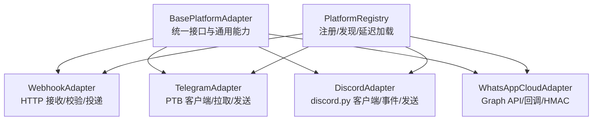
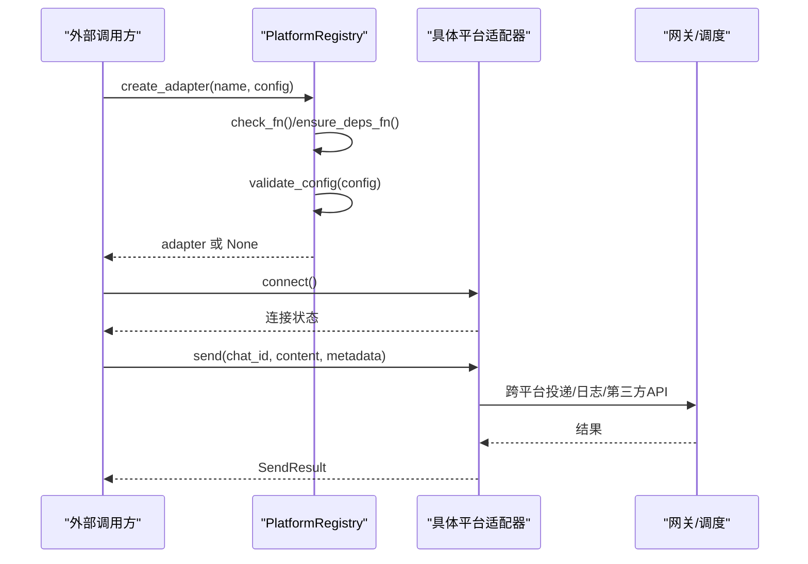
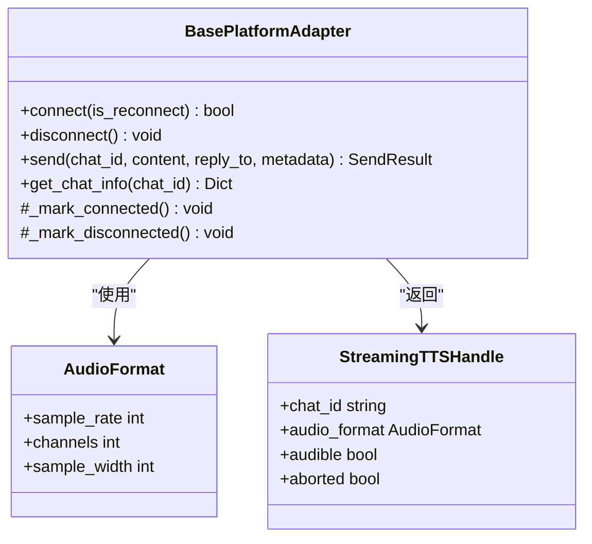
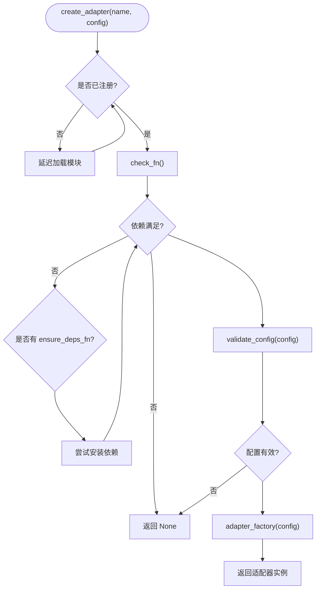
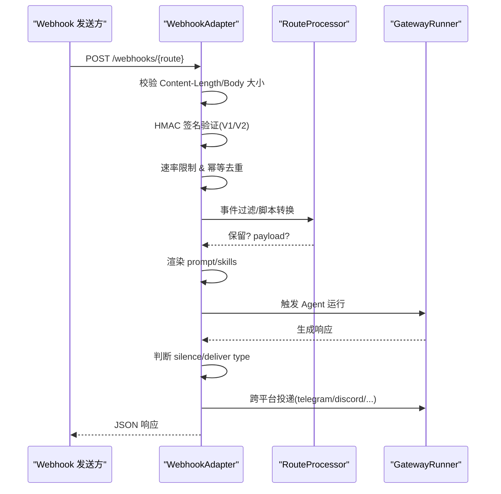
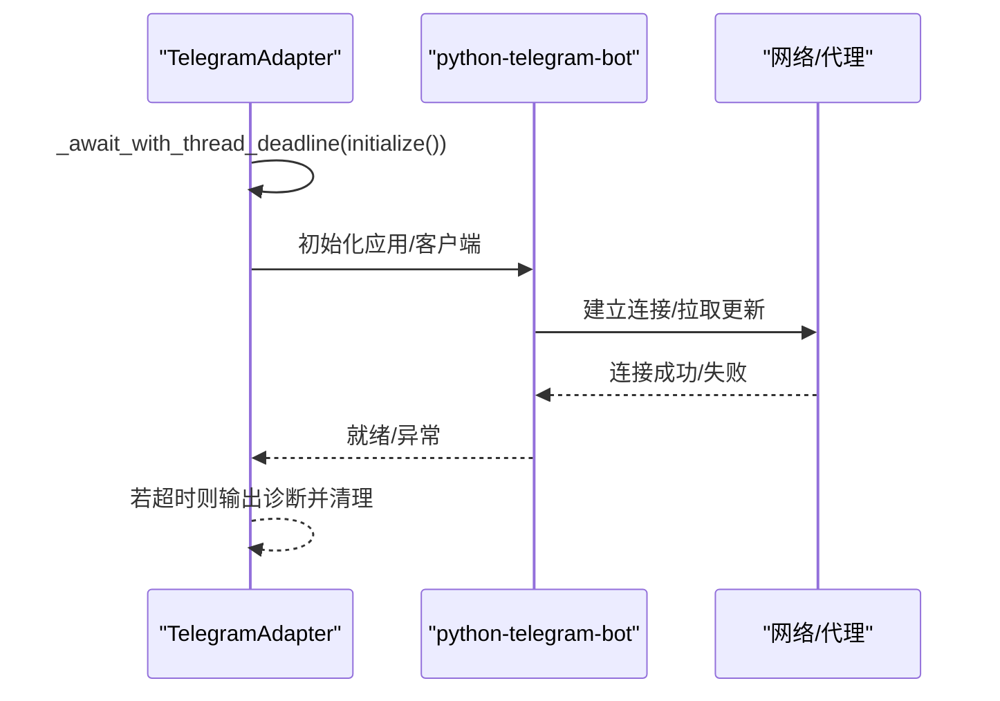
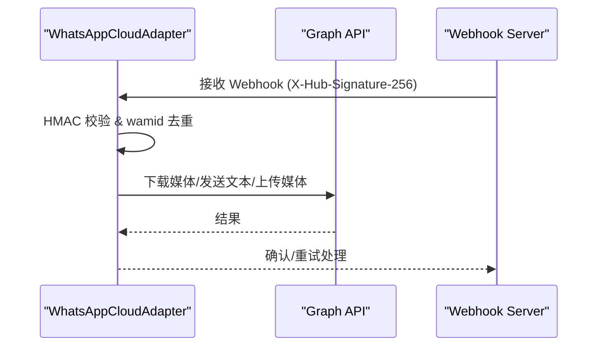
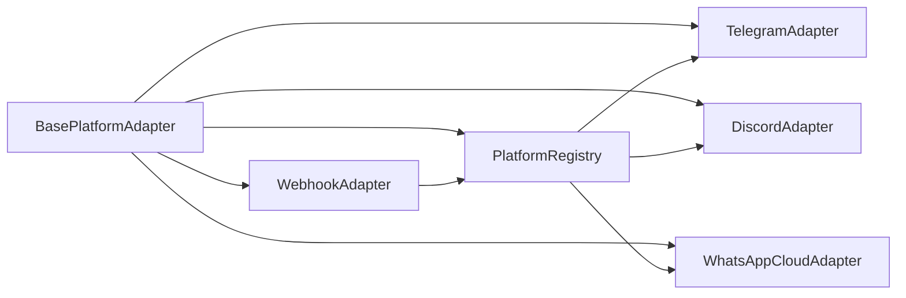

# 平台适配器模块

<cite>
**本文引用的文件**
- [gateway/platforms/base.py](file://gateway/platforms/base.py)
- [gateway/platforms/webhook.py](file://gateway/platforms/webhook.py)
- [gateway/platform_registry.py](file://gateway/platform_registry.py)
- [plugins/platforms/telegram/adapter.py](file://plugins/platforms/telegram/adapter.py)
- [plugins/platforms/discord/__init__.py](file://plugins/platforms/discord/__init__.py)
- [gateway/platforms/whatsapp_cloud.py](file://gateway/platforms/whatsapp_cloud.py)
</cite>

## 目录
1. [简介](#简介)
2. [项目结构](#项目结构)
3. [核心组件](#核心组件)
4. [架构总览](#架构总览)
5. [详细组件分析](#详细组件分析)
6. [依赖关系分析](#依赖关系分析)
7. [性能考量](#性能考量)
8. [故障排查指南](#故障排查指南)
9. [结论](#结论)
10. [附录：新平台适配器开发指南](#附录新平台适配器开发指南)

## 简介
本模块为多平台消息网关的“平台适配器”层，提供统一的抽象基类与接口规范，屏蔽不同平台（Webhook、Telegram、Discord、WhatsApp Cloud 等）的差异，实现消息格式转换、认证校验、连接管理、媒体处理、用户身份与权限控制，以及跨平台路由与投递。通过注册中心机制，平台适配器可被插件化扩展，支持按需加载与延迟初始化，降低启动开销并提升可扩展性。

## 项目结构
- 抽象基类与通用能力：位于 gateway/platforms/base.py，定义统一接口、媒体缓存、代理与网络工具、流式 TTS、入站媒体大小限制等。
- 通用 Webhook 适配器：位于 gateway/platforms/webhook.py，提供 HTTP 接收、HMAC 签名校验、速率限制、幂等去重、动态路由与跨平台投递。
- 平台注册中心：位于 gateway/platform_registry.py，集中管理平台元数据、依赖检查、配置校验、工厂创建与延迟加载。
- 具体平台适配：
  - Telegram：plugins/platforms/telegram/adapter.py
  - Discord：plugins/platforms/discord/__init__.py（入口注册）
  - WhatsApp Cloud：gateway/platforms/whatsapp_cloud.py

**图示来源**
- [gateway/platforms/base.py:1-1200](file://gateway/platforms/base.py#L1-L1200)
- [gateway/platforms/webhook.py:177-350](file://gateway/platforms/webhook.py#L177-L350)
- [plugins/platforms/telegram/adapter.py:1-200](file://plugins/platforms/telegram/adapter.py#L1-L200)
- [plugins/platforms/discord/__init__.py:1-4](file://plugins/platforms/discord/__init__.py#L1-L4)
- [gateway/platforms/whatsapp_cloud.py:1-200](file://gateway/platforms/whatsapp_cloud.py#L1-L200)
- [gateway/platform_registry.py:183-382](file://gateway/platform_registry.py#L183-L382)

**章节来源**
- [gateway/platforms/base.py:1-1200](file://gateway/platforms/base.py#L1-L1200)
- [gateway/platforms/webhook.py:177-350](file://gateway/platforms/webhook.py#L177-L350)
- [gateway/platform_registry.py:183-382](file://gateway/platform_registry.py#L183-L382)
- [plugins/platforms/telegram/adapter.py:1-200](file://plugins/platforms/telegram/adapter.py#L1-L200)
- [plugins/platforms/discord/__init__.py:1-4](file://plugins/platforms/discord/__init__.py#L1-L4)
- [gateway/platforms/whatsapp_cloud.py:1-200](file://gateway/platforms/whatsapp_cloud.py#L1-L200)

## 核心组件
- BasePlatformAdapter（抽象基类）
  - 统一接口：connect/disconnect/send/get_chat_info 等
  - 通用能力：代理解析、SSRF 防护、入站媒体大小限制、图片/音频/视频/文档缓存、流式 TTS、UTF-16 长度计算与截断、线程/回复锚点处理
- PlatformRegistry（平台注册中心）
  - 元数据：name/label/factory/check_fn/validate_config/ensure_deps_fn/is_connected/env 变量/安装提示/emoji/平台提示/独立发送器钩子等
  - 生命周期：延迟加载、依赖检查、配置校验、实例创建、错误处理
- WebhookAdapter（通用 Webhook）
  - HTTP 服务：健康检查、路由匹配、多 Profile 复用
  - 安全：HMAC V1/V2、Body 大小限制、速率限制、幂等去重、脚本过滤
  - 投递：日志、GitHub Comment、跨平台投递（内置与插件平台）
- 具体平台适配器
  - Telegram：基于 python-telegram-bot，负责长轮询/事件处理、媒体下载与上传、主题/话题路由、错误信息脱敏、超时与死锁诊断
  - Discord：基于 discord.py，事件驱动、消息/媒体发送、代理与连接管理
  - WhatsApp Cloud：Meta Graph API + Webhook，HMAC 校验、wamid 去重、媒体上传/下载、语音转码（ffmpeg）、模板消息与 24 小时会话窗口

**章节来源**
- [gateway/platforms/base.py:1-1200](file://gateway/platforms/base.py#L1-L1200)
- [gateway/platform_registry.py:38-181](file://gateway/platform_registry.py#L38-L181)
- [gateway/platforms/webhook.py:177-350](file://gateway/platforms/webhook.py#L177-L350)
- [plugins/platforms/telegram/adapter.py:1-200](file://plugins/platforms/telegram/adapter.py#L1-L200)
- [plugins/platforms/discord/__init__.py:1-4](file://plugins/platforms/discord/__init__.py#L1-L4)
- [gateway/platforms/whatsapp_cloud.py:1-200](file://gateway/platforms/whatsapp_cloud.py#L1-L200)

## 架构总览
平台适配器采用“抽象基类 + 注册中心 + 具体实现”的分层架构：
- 抽象层：统一接口与通用能力，确保各平台行为一致
- 注册层：集中管理平台元数据与生命周期，支持插件扩展与延迟加载
- 实现层：各平台特定逻辑（协议、认证、媒体、路由）

**图示来源**
- [gateway/platform_registry.py:299-377](file://gateway/platform_registry.py#L299-L377)
- [gateway/platforms/webhook.py:248-350](file://gateway/platforms/webhook.py#L248-L350)
- [gateway/platforms/base.py:1-1200](file://gateway/platforms/base.py#L1-L1200)

## 详细组件分析

### 抽象基类与统一接口（BasePlatformAdapter）
- 统一接口
  - connect/disconnect：建立/断开与平台的连接
  - send：发送消息，支持 reply_to、metadata（线程/通知标记/平台特定字段）
  - get_chat_info：获取聊天信息
- 通用能力
  - 代理与网络：系统代理检测、NO_PROXY 匹配、aiohttp/discord 客户端代理参数构造
  - 媒体处理：入站媒体大小限制、图片/音频/视频/文档缓存、清理策略、容器嗅探与扩展映射
  - 流式 TTS：AudioFormat/StreamingTTSHandle、按 turn 抑制重复合成
  - 文本长度：UTF-16 长度计算与截断，适配平台限制（如 Telegram 4096）
  - 线程与回复：根据平台特性决定 reply_to 与 thread_id 元数据

**图示来源**
- [gateway/platforms/base.py:574-604](file://gateway/platforms/base.py#L574-L604)
- [gateway/platforms/base.py:153-253](file://gateway/platforms/base.py#L153-L253)
- [gateway/platforms/base.py:813-1122](file://gateway/platforms/base.py#L813-L1122)

**章节来源**
- [gateway/platforms/base.py:1-1200](file://gateway/platforms/base.py#L1-L1200)

### 平台注册中心（PlatformRegistry）
- 职责
  - 注册/注销平台条目（名称、标签、工厂函数、依赖检查、配置校验、环境要求、安装提示等）
  - 延迟加载：避免在 CLI/chat 等非网关路径导入重型 SDK
  - 创建适配器：依赖检查→可选自动安装→配置校验→工厂实例化
- 关键流程
  - register_deferred/register/unregister
  - get/all_entries/plugin_entries/is_registered
  - create_adapter：check_fn → ensure_deps_fn → validate_config → adapter_factory

**图示来源**
- [gateway/platform_registry.py:183-382](file://gateway/platform_registry.py#L183-L382)

**章节来源**
- [gateway/platform_registry.py:38-181](file://gateway/platform_registry.py#L38-L181)
- [gateway/platform_registry.py:299-377](file://gateway/platform_registry.py#L299-L377)

### Webhook 适配器（WebhookAdapter）
- 功能
  - HTTP 服务器：健康检查、路由匹配、多 Profile 复用
  - 安全：HMAC V1/V2、Body 大小限制、速率限制、幂等去重、脚本过滤
  - 投递：日志、GitHub Comment、跨平台投递（内置与插件平台）
- 关键流程（请求处理）
  - 读取 Content-Length → 限制 Body → HMAC 校验 → 速率限制 → 事件过滤 → 脚本处理 → 渲染 Prompt → 构建 delivery_id → 触发 Agent → 响应投递

**图示来源**
- [gateway/platforms/webhook.py:584-800](file://gateway/platforms/webhook.py#L584-L800)
- [gateway/platforms/webhook.py:248-350](file://gateway/platforms/webhook.py#L248-L350)

**章节来源**
- [gateway/platforms/webhook.py:177-350](file://gateway/platforms/webhook.py#L177-L350)
- [gateway/platforms/webhook.py:584-800](file://gateway/platforms/webhook.py#L584-L800)

### Telegram 适配器
- 特点
  - 基于 python-telegram-bot，长轮询/事件驱动
  - 媒体：下载/上传、语音/图片/视频/文档
  - 主题/话题：DM Topic、群组话题、回复锚点
  - 错误处理：敏感信息脱敏、超时与死锁诊断、任务放弃清理
- 关键流程（初始化与就绪）
  - 带墙钟截止时间的等待，避免 PTB/httpcore 阻塞导致无超时
  - 失败时输出线程堆栈以定位阻塞帧

**图示来源**
- [plugins/platforms/telegram/adapter.py:97-197](file://plugins/platforms/telegram/adapter.py#L97-L197)

**章节来源**
- [plugins/platforms/telegram/adapter.py:1-200](file://plugins/platforms/telegram/adapter.py#L1-L200)

### Discord 适配器
- 特点
  - 基于 discord.py，事件驱动
  - 注册入口：__init__.py 暴露 register，供注册中心发现
  - 支持代理、连接管理与消息/媒体发送
- 关键点
  - 通过注册中心进行依赖检查与实例化
  - 遵循 BasePlatformAdapter 的统一接口

**章节来源**
- [plugins/platforms/discord/__init__.py:1-4](file://plugins/platforms/discord/__init__.py#L1-L4)
- [gateway/platform_registry.py:299-377](file://gateway/platform_registry.py#L299-L377)

### WhatsApp Cloud 适配器
- 特点
  - Meta Graph API + Webhook
  - HMAC 校验（X-Hub-Signature-256）、wamid 去重
  - 媒体：上传/下载、语音转码（ffmpeg）、文档注入可读内容
  - 会话：24 小时窗口、模板消息
- 关键流程（入站与出站）
  - 入站：Webhook 接收 → HMAC 校验 → wamid 去重 → 转换为内部事件
  - 出站：Graph API 发送文本/媒体，必要时转码与回退

**图示来源**
- [gateway/platforms/whatsapp_cloud.py:1-200](file://gateway/platforms/whatsapp_cloud.py#L1-L200)

**章节来源**
- [gateway/platforms/whatsapp_cloud.py:1-200](file://gateway/platforms/whatsapp_cloud.py#L1-L200)

## 依赖关系分析
- 耦合与内聚
  - BasePlatformAdapter 高内聚：封装通用能力，降低具体平台实现复杂度
  - PlatformRegistry 解耦：通过元数据与工厂函数隔离平台实现细节
  - WebhookAdapter 作为通用入口，聚合多种投递目标，降低与具体平台的直接耦合
- 外部依赖
  - aiohttp（Webhook/WhatsApp Cloud）
  - httpx（媒体下载/SSRF 防护）
  - python-telegram-bot（Telegram）
  - discord.py（Discord）
  - ffmpeg（WhatsApp 语音转码）
- 潜在循环依赖
  - 通过延迟加载与条件导入避免启动期循环导入
  - 注册中心在首次使用时才加载具体平台模块

**图示来源**
- [gateway/platform_registry.py:183-382](file://gateway/platform_registry.py#L183-L382)
- [gateway/platforms/webhook.py:177-350](file://gateway/platforms/webhook.py#L177-L350)
- [gateway/platforms/base.py:1-1200](file://gateway/platforms/base.py#L1-L1200)

**章节来源**
- [gateway/platform_registry.py:183-382](file://gateway/platform_registry.py#L183-L382)
- [gateway/platforms/webhook.py:177-350](file://gateway/platforms/webhook.py#L177-L350)
- [gateway/platforms/base.py:1-1200](file://gateway/platforms/base.py#L1-L1200)

## 性能考量
- 延迟加载：注册中心对平台模块采用延迟加载，减少 CLI/chat 等非网关路径的启动时间
- 媒体入站限制：统一限制入站媒体大小，防止 OOM；流式读取与 Content-Length 双重保护
- 缓存与清理：图片/音频/视频/文档/截图缓存，按过期时间清理，避免磁盘膨胀
- 代理优化：优先使用 connector 方式（aiohttp-socks），支持 SOCKS/HTTP 代理，绕过 DNS 污染
- 速率限制与幂等：Webhook 每路由固定窗口限速与 delivery_id 去重，避免重复执行与资源浪费
- 超时与诊断：Telegram 初始化使用墙钟截止时间与线程守护，避免事件循环阻塞导致的假死

[本节为通用指导，不直接分析具体文件]

## 故障排查指南
- Webhook 无法启动
  - 检查端口绑定与主机设置（默认双栈），确认未与其他进程冲突
  - 检查 HMAC 密钥是否配置，INSECURE_NO_AUTH 仅允许本地回环
- 消息未送达
  - 检查 deliver 类型是否已知（内置或插件注册）
  - 检查跨平台投递是否可用（gateway_runner 是否存在）
- 媒体下载失败
  - 检查 SSRF 防护是否拦截了目标 URL
  - 检查入站媒体大小限制是否触发
- Telegram 初始化超时
  - 查看线程堆栈输出，定位同步阻塞点
  - 检查代理配置与网络连通性
- WhatsApp Cloud 回调无效
  - 检查 X-Hub-Signature-256 与 wamid 去重缓存
  - 检查 Graph API 令牌与会话窗口（24 小时）

**章节来源**
- [gateway/platforms/webhook.py:248-350](file://gateway/platforms/webhook.py#L248-L350)
- [gateway/platforms/webhook.py:584-800](file://gateway/platforms/webhook.py#L584-L800)
- [plugins/platforms/telegram/adapter.py:97-197](file://plugins/platforms/telegram/adapter.py#L97-L197)
- [gateway/platforms/base.py:866-927](file://gateway/platforms/base.py#L866-L927)
- [gateway/platforms/base.py:1008-1068](file://gateway/platforms/base.py#L1008-L1068)

## 结论
平台适配器模块通过抽象基类与注册中心实现了多平台消息网关的统一接口与可扩展架构。Webhook 适配器提供了通用的 HTTP 接入与跨平台投递能力；Telegram、Discord、WhatsApp Cloud 等平台适配器分别实现了各自的协议、认证与媒体处理逻辑。整体设计注重安全性（SSRF、HMAC、速率限制）、可靠性（超时与诊断、幂等去重）与性能（延迟加载、媒体限制与缓存）。新增平台可通过注册中心快速集成，遵循统一接口即可无缝融入现有体系。

[本节为总结，不直接分析具体文件]

## 附录：新平台适配器开发指南
- 适配器注册
  - 在平台模块中实现 register 函数，向 platform_registry.register 提交 PlatformEntry
  - 提供 name/label/adapter_factory/check_fn/validate_config/ensure_deps_fn/is_connected 等元数据
  - 可选：required_env/install_hint/setup_fn/apply_yaml_config_fn/standalone_sender_fn/cron_deliver_env_var
- 消息路由
  - 遵循 BasePlatformAdapter 的 send/get_chat_info/connect/disconnect 接口
  - 使用 metadata 传递线程/通知/平台特定字段（如 Slack scope_id、Telegram DM topic）
  - 对于 Webhook 场景，参考 WebhookAdapter 的 deliver 类型与跨平台投递机制
- 错误处理
  - 依赖检查失败时提供 install_hint
  - 配置校验失败时记录警告并返回 None
  - 工厂异常捕获并记录错误上下文
- 性能优化
  - 使用延迟加载避免启动期导入重型 SDK
  - 入站媒体使用流式读取与大小限制
  - 合理设置缓存清理策略与超时阈值
  - 使用代理 connector 与 NO_PROXY 规则优化网络访问

**章节来源**
- [gateway/platform_registry.py:38-181](file://gateway/platform_registry.py#L38-L181)
- [gateway/platform_registry.py:299-377](file://gateway/platform_registry.py#L299-L377)
- [gateway/platforms/webhook.py:177-350](file://gateway/platforms/webhook.py#L177-L350)
- [gateway/platforms/base.py:1-1200](file://gateway/platforms/base.py#L1-L1200)