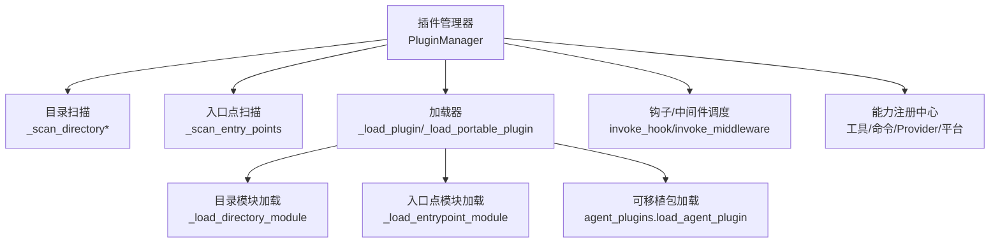
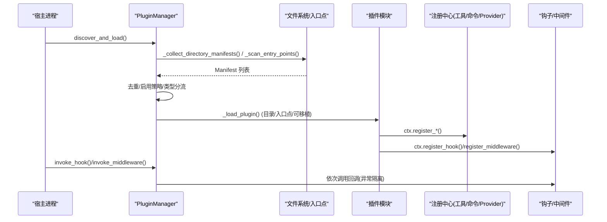
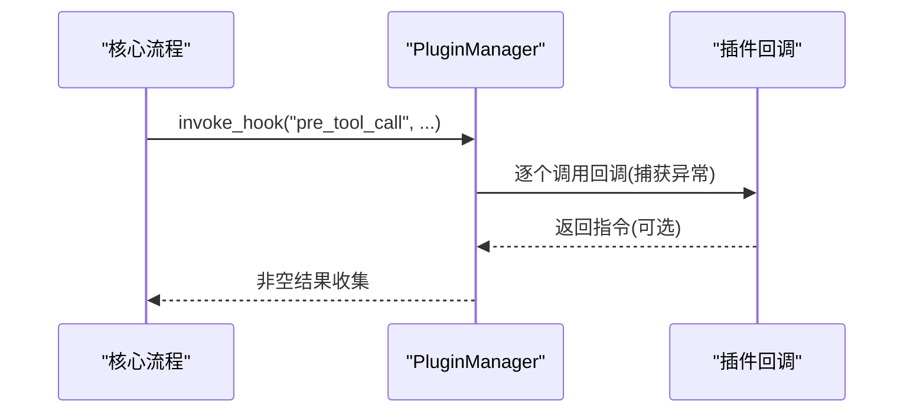
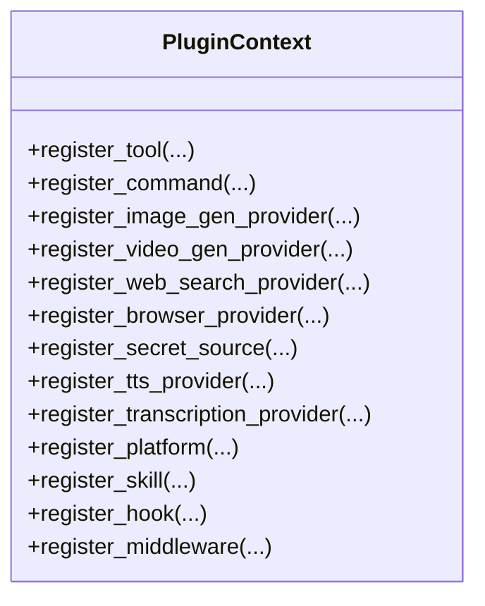
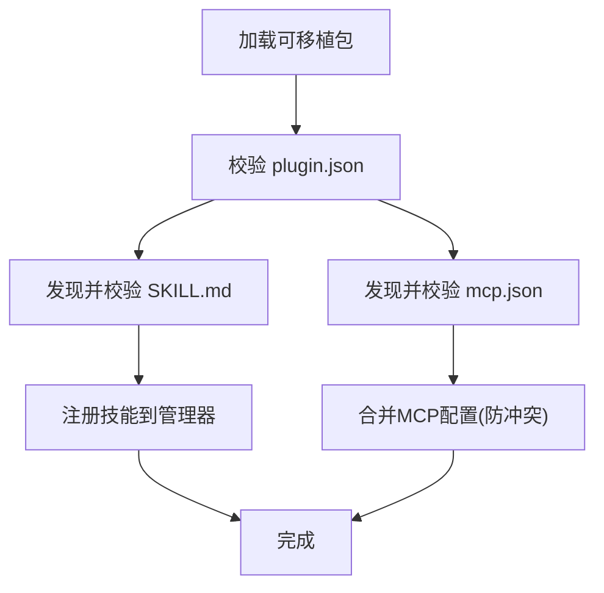
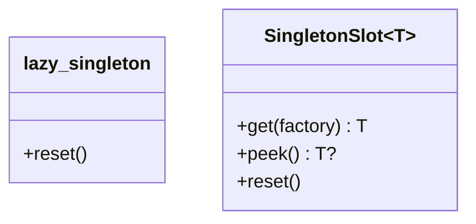
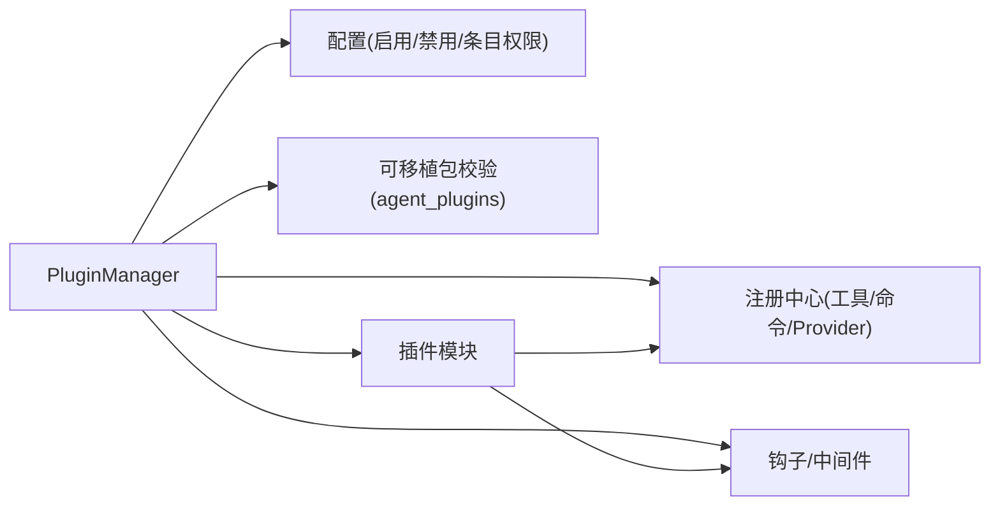

# 插件系统模块

<cite>
**本文引用的文件**
- [sparkii_cli/plugins.py](file://sparkii_cli/plugins.py)
- [sparkii_cli/agent_plugins.py](file://sparkii_cli/agent_plugins.py)
- [plugins/plugin_utils.py](file://plugins/plugin_utils.py)
- [plugins/disk-cleanup/__init__.py](file://plugins/disk-cleanup/__init__.py)
</cite>

## 目录
1. [简介](#简介)
2. [项目结构](#项目结构)
3. [核心组件](#核心组件)
4. [架构总览](#架构总览)
5. [详细组件分析](#详细组件分析)
6. [依赖关系分析](#依赖关系分析)
7. [性能考量](#性能考量)
8. [故障排查指南](#故障排查指南)
9. [结论](#结论)
10. [附录：插件开发完整指南](#附录：插件开发完整指南)

## 简介
本模块为系统的插件化扩展机制，提供插件发现、验证、加载、生命周期钩子与中间件、能力注册（工具、命令、平台适配器、各类 Provider）、以及可移植插件包（Agent Plugins v1）的集成。其设计目标是：
- 支持多来源插件：内置、用户目录、项目目录、Pip 入口点
- 安全可控：启用/禁用白名单、工具覆盖权限门控、沙箱隔离的可移植包
- 可扩展：丰富的生命周期钩子和中间件，便于审计、拦截、改写
- 高性能：延迟加载平台插件、懒初始化单例、最小启动开销

## 项目结构
- 插件管理器与上下文：位于 sparkii_cli/plugins.py，负责扫描、解析、加载、调用钩子与中间件，并提供 PluginContext 供插件注册能力
- 可移植插件兼容层：位于 sparkii_cli/agent_plugins.py，校验并翻译 Agent Plugins v1 包（plugin.json + skills/mcp），不导入 Python 代码
- 并发工具：位于 plugins/plugin_utils.py，提供线程安全的懒单例与槽位，避免插件常见并发陷阱
- 示例插件：plugins/disk-cleanup 展示 hook、slash 命令、会话清理等用法



图表来源
- [sparkii_cli/plugins.py:1309-1599](file://sparkii_cli/plugins.py#L1309-L1599)
- [sparkii_cli/plugins.py:1607-1837](file://sparkii_cli/plugins.py#L1607-L1837)
- [sparkii_cli/plugins.py:1903-2097](file://sparkii_cli/plugins.py#L1903-L2097)
- [sparkii_cli/agent_plugins.py:451-485](file://sparkii_cli/agent_plugins.py#L451-L485)

章节来源
- [sparkii_cli/plugins.py:1-800](file://sparkii_cli/plugins.py#L1-L800)
- [sparkii_cli/plugins.py:1309-1599](file://sparkii_cli/plugins.py#L1309-L1599)
- [sparkii_cli/agent_plugins.py:1-499](file://sparkii_cli/agent_plugins.py#L1-L499)
- [plugins/plugin_utils.py:1-136](file://plugins/plugin_utils.py#L1-L136)

## 核心组件
- PluginManifest：描述插件元数据（名称、版本、来源、类型、键、是否可移植等）
- LoadedPlugin：运行时记录插件状态（模块、已注册能力、错误信息、是否延迟加载）
- PluginContext：插件运行时的“门面”，暴露注册工具、命令、Hook、Middleware、Provider、平台适配器等接口
- PluginManager：插件系统中枢，负责发现、加载、调度、查询
- AgentPlugins v1 兼容层：对 plugin.json/skills/mcp.json 进行本地校验与转换，不执行任意代码

章节来源
- [sparkii_cli/plugins.py:307-362](file://sparkii_cli/plugins.py#L307-L362)
- [sparkii_cli/plugins.py:368-1303](file://sparkii_cli/plugins.py#L368-L1303)
- [sparkii_cli/plugins.py:1309-2399](file://sparkii_cli/plugins.py#L1309-L2399)
- [sparkii_cli/agent_plugins.py:47-77](file://sparkii_cli/agent_plugins.py#L47-L77)

## 架构总览
插件系统采用“声明式清单 + 动态加载”的模式：
- 声明式清单：每个插件通过 plugin.yaml 或可移植包的 plugin.json 声明元数据、能力与依赖
- 动态加载：按优先级扫描目录与入口点，去重后按需加载；平台类插件延迟加载以减少冷启动时间
- 生命周期：通过 Hook 和 Middleware 在关键阶段注入行为（如 pre_tool_call、on_session_end）
- 能力注册：插件通过 PluginContext 注册工具、命令、Provider、平台适配器等，统一纳入宿主注册表
- 安全与隔离：启用/禁用白名单、工具覆盖需显式授权、可移植包仅配置驱动且路径受限



图表来源
- [sparkii_cli/plugins.py:1341-1487](file://sparkii_cli/plugins.py#L1341-L1487)
- [sparkii_cli/plugins.py:1903-2097](file://sparkii_cli/plugins.py#L1903-L2097)
- [sparkii_cli/plugins.py:2103-2169](file://sparkii_cli/plugins.py#L2103-L2169)

## 详细组件分析

### 插件发现与加载流程
- 多源扫描：内置目录、用户目录、项目目录（需环境变量开启）、Pip 入口点
- 清单解析：支持 plugin.yaml/yml 与可移植 plugin.json；自动识别类别命名空间 key
- 去重与优先级：同 key 时后者覆盖前者；exclusive/model-provider/backend/platform 特殊分流
- 延迟加载：内置 platform 插件以 deferred 形式注册，首次使用时才导入重型 SDK
- 可移植包：仅读取配置与资源，不执行 Python 代码；skills/mcp 经严格校验

```mermaid
flowchart TD
Start(["开始"]) --> Scan["扫描目录与入口点"]
Scan --> Parse["解析清单(plugin.yaml/plugin.json)"]
Parse --> Dedup{"去重/优先级"}
Dedup --> Type{"插件类型?"}
Type --> |exclusive| SkipE["跳过通用加载(由分类管理)"]
Type --> |model-provider| SkipM["跳过通用加载(由providers管理)"]
Type --> |backend(bundled)| LoadB["直接加载"]
Type --> |platform(bundled)| Defer["注册延迟加载器"]
Type --> |其他| Enable{"是否在启用列表?"}
Enable --> |否| SkipN["记录未启用"]
Enable --> |是| Load["加载插件模块"]
Load --> Register["调用 register(ctx)"]
Register --> Done(["完成"])
SkipE --> Done
SkipM --> Done
LoadB --> Done
Defer --> Done
SkipN --> Done
```

图表来源
- [sparkii_cli/plugins.py:1380-1487](file://sparkii_cli/plugins.py#L1380-L1487)
- [sparkii_cli/plugins.py:1496-1545](file://sparkii_cli/plugins.py#L1496-L1545)
- [sparkii_cli/plugins.py:1607-1716](file://sparkii_cli/plugins.py#L1607-L1716)
- [sparkii_cli/plugins.py:1813-1837](file://sparkii_cli/plugins.py#L1813-L1837)
- [sparkii_cli/plugins.py:1862-1901](file://sparkii_cli/plugins.py#L1862-L1901)

章节来源
- [sparkii_cli/plugins.py:1341-1599](file://sparkii_cli/plugins.py#L1341-L1599)
- [sparkii_cli/plugins.py:1607-1837](file://sparkii_cli/plugins.py#L1607-L1837)
- [sparkii_cli/plugins.py:1862-1901](file://sparkii_cli/plugins.py#L1862-L1901)

### 生命周期钩子与中间件
- 钩子集合：包括工具调用前后、LLM 调用前后、会话生命周期、网关前置分发、审批流、看板任务等
- 中间件：允许改写请求负载或包装执行逻辑，未知类型会告警但保留向前兼容
- 调用隔离：每个回调独立 try/except，确保单个插件异常不影响宿主主循环



图表来源
- [sparkii_cli/plugins.py:136-219](file://sparkii_cli/plugins.py#L136-L219)
- [sparkii_cli/plugins.py:2103-2169](file://sparkii_cli/plugins.py#L2103-L2169)

章节来源
- [sparkii_cli/plugins.py:136-219](file://sparkii_cli/plugins.py#L136-L219)
- [sparkii_cli/plugins.py:2103-2169](file://sparkii_cli/plugins.py#L2103-L2169)

### 能力注册与冲突处理
- 工具注册：通过 registry.register 统一登记，支持异步、环境变量要求、覆盖策略
- 覆盖控制：覆盖内置工具需显式授权（allow_tool_override），内置插件默认信任，第三方需配置开关
- Provider 注册：图像生成、视频生成、网页搜索/抓取、浏览器云后端、TTS/STT、Secret Source、平台适配器等
- 冲突策略：同名 Provider 通常被拒绝或警告；平台类使用唯一 name；技能名带命名空间避免冲突



图表来源
- [sparkii_cli/plugins.py:439-1303](file://sparkii_cli/plugins.py#L439-L1303)

章节来源
- [sparkii_cli/plugins.py:439-1303](file://sparkii_cli/plugins.py#L439-L1303)

### 可移植插件（Agent Plugins v1）集成
- 清单校验：plugin.json 必须声明受支持的 schema，字段约束严格（name/version/author/keywords/extensions）
- 技能发现：skills/<name>/SKILL.md 前缀 YAML 校验，限制字符长度与格式
- MCP 服务器：mcp.json 仅支持 stdio 传输，远程类型不被支持；命令与路径受限，环境变量替换安全
- 数据根隔离：PLUGIN_ROOT/PLUGIN_DATA 占位符展开，路径必须在各自根内，防止逃逸



图表来源
- [sparkii_cli/agent_plugins.py:97-155](file://sparkii_cli/agent_plugins.py#L97-L155)
- [sparkii_cli/agent_plugins.py:158-252](file://sparkii_cli/agent_plugins.py#L158-L252)
- [sparkii_cli/agent_plugins.py:310-448](file://sparkii_cli/agent_plugins.py#L310-L448)
- [sparkii_cli/plugins.py:1991-2041](file://sparkii_cli/plugins.py#L1991-L2041)

章节来源
- [sparkii_cli/agent_plugins.py:97-448](file://sparkii_cli/agent_plugins.py#L97-L448)
- [sparkii_cli/plugins.py:1991-2041](file://sparkii_cli/plugins.py#L1991-L2041)

### 并发与单例模式
- 懒单例装饰器：线程安全地缓存零参工厂实例，支持测试重置
- 单例槽位：针对带参数的构建场景，保证“首次成功即缓存”的语义
- 适用场景：外部客户端、连接池、重型对象初始化，避免 TOCTOU 竞态



图表来源
- [plugins/plugin_utils.py:43-81](file://plugins/plugin_utils.py#L43-L81)
- [plugins/plugin_utils.py:84-136](file://plugins/plugin_utils.py#L84-L136)

章节来源
- [plugins/plugin_utils.py:1-136](file://plugins/plugin_utils.py#L1-L136)

### 示例插件：磁盘清理
- 行为：监听 post_tool_call 自动追踪临时/测试文件；on_session_end 触发快速清理
- 命令：提供 /disk-cleanup 子命令用于状态查看、干跑、深度清理、手动跟踪/遗忘
- 并发：使用锁保护每任务的追踪集合，避免并行写入竞争

章节来源
- [plugins/disk-cleanup/__init__.py:1-317](file://plugins/disk-cleanup/__init__.py#L1-L317)

## 依赖关系分析
- 插件管理器依赖：
  - 配置读取：启用/禁用列表、条目级权限（如 allow_tool_override）
  - 注册中心：工具、命令、Provider、平台适配器、技能、辅助任务等
  - 可移植包校验：agent_plugins 模块
- 插件间耦合：
  - 通过共享注册表与钩子协作，避免直接相互引用
  - 同名能力冲突由管理器或注册中心处理（拒绝/警告/覆盖策略）
- 外部依赖：
  - 平台 SDK（如 slack_bolt、discord.py）仅在平台适配器首次使用时导入，降低启动成本



图表来源
- [sparkii_cli/plugins.py:1309-1599](file://sparkii_cli/plugins.py#L1309-L1599)
- [sparkii_cli/plugins.py:1903-2097](file://sparkii_cli/plugins.py#L1903-L2097)

章节来源
- [sparkii_cli/plugins.py:1309-1599](file://sparkii_cli/plugins.py#L1309-L1599)
- [sparkii_cli/plugins.py:1903-2097](file://sparkii_cli/plugins.py#L1903-L2097)

## 性能考量
- 延迟加载平台插件：避免一次性导入多个重型 SDK，显著缩短冷启动时间
- 懒单例与槽位：减少重复初始化开销，保证线程安全
- 最小化导入：可移植包仅读取配置与资源，不执行 Python 代码
- 扫描优化：目录扫描限制深度，跳过特定目录；入口点扫描失败静默降级

[本节为通用指导，无需源码引用]

## 故障排查指南
- 插件未加载：
  - 检查是否在启用列表或被禁用列表排除
  - 查看 manifest 解析日志与诊断信息
  - 确认 register() 存在且无异常
- 工具覆盖失败：
  - 第三方插件需设置 allow_tool_override: true
  - 内置插件默认允许覆盖
- 钩子无效：
  - 确认 hook_name 属于 VALID_HOOKS
  - 检查回调签名与参数
- 可移植包问题：
  - 检查 plugin.json schema 与字段约束
  - 检查 SKILL.md frontmatter 与 mcp.json 配置合法性
  - 关注 diagnostics 中的范围化错误

章节来源
- [sparkii_cli/plugins.py:1380-1487](file://sparkii_cli/plugins.py#L1380-L1487)
- [sparkii_cli/plugins.py:1718-1807](file://sparkii_cli/plugins.py#L1718-L1807)
- [sparkii_cli/plugins.py:2103-2169](file://sparkii_cli/plugins.py#L2103-L2169)
- [sparkii_cli/agent_plugins.py:97-155](file://sparkii_cli/agent_plugins.py#L97-L155)

## 结论
该插件系统以清晰的清单声明与严格的加载流程为核心，结合钩子与中间件实现强大的扩展能力，并通过延迟加载、权限门控与可移植包隔离保障安全性与性能。开发者可通过 PluginContext 注册丰富能力，遵循规范即可无缝集成到宿主生态中。

[本节为总结性内容，无需源码引用]

## 附录：插件开发完整指南

### 插件结构规范
- 目录型插件：
  - 必需：plugin.yaml（或 plugin.yml）、__init__.py（含 register(ctx)）
  - 可选：provides_tools、provides_hooks、requires_env、kind、key
- 可移植插件（v1）：
  - 必需：plugin.json（声明 schema、name、version 等）
  - 可选：skills/<name>/SKILL.md（frontmatter 校验）、mcp.json（仅 stdio 支持）

章节来源
- [sparkii_cli/plugins.py:1607-1716](file://sparkii_cli/plugins.py#L1607-L1716)
- [sparkii_cli/agent_plugins.py:97-155](file://sparkii_cli/agent_plugins.py#L97-L155)

### API 接口定义
- 注册工具：ctx.register_tool(name, toolset, schema, handler, ...), 支持 is_async、override（需授权）
- 注册命令：ctx.register_command(name, handler, description, args_hint)
- 注册钩子：ctx.register_hook(hook_name, callback)
- 注册中间件：ctx.register_middleware(kind, callback)
- 注册 Provider：image/video/web-search/browser/tts/stt/secret-source
- 注册平台适配器：ctx.register_platform(name, label, adapter_factory, check_fn, ...)
- 注册技能：ctx.register_skill(name, path, description, frontmatter)

章节来源
- [sparkii_cli/plugins.py:439-1303](file://sparkii_cli/plugins.py#L439-L1303)

### 事件处理与最佳实践
- 使用 pre_tool_call 实施策略（block/approve/rule_key）
- 使用 on_session_end 做收尾清理（如磁盘清理）
- 钩子回调应幂等、健壮、异常隔离
- 避免在钩子中进行阻塞 IO 或长时间计算

章节来源
- [sparkii_cli/plugins.py:136-219](file://sparkii_cli/plugins.py#L136-L219)
- [plugins/disk-cleanup/__init__.py:128-189](file://plugins/disk-cleanup/__init__.py#L128-L189)

### 错误处理最佳实践
- 插件加载失败：记录 error 字段与日志，不影响宿主
- 钩子/中间件异常：捕获并记录，继续执行其他回调
- 可移植包诊断：将 component 级错误作为 diagnostics 上报，不中断整体加载

章节来源
- [sparkii_cli/plugins.py:1983-1989](file://sparkii_cli/plugins.py#L1983-L1989)
- [sparkii_cli/plugins.py:2103-2169](file://sparkii_cli/plugins.py#L2103-L2169)
- [sparkii_cli/agent_plugins.py:451-485](file://sparkii_cli/agent_plugins.py#L451-L485)

### 权限控制与沙箱隔离
- 启用/禁用：plugins.enabled/disabled 控制加载
- 工具覆盖：plugins.entries.<plugin_id>.allow_tool_override 显式授权
- 可移植包：路径限制（PLUGIN_ROOT/PLUGIN_DATA）、命令白名单、头部校验、不支持远程传输

章节来源
- [sparkii_cli/plugins.py:231-274](file://sparkii_cli/plugins.py#L231-L274)
- [sparkii_cli/plugins.py:498-520](file://sparkii_cli/plugins.py#L498-L520)
- [sparkii_cli/agent_plugins.py:255-365](file://sparkii_cli/agent_plugins.py#L255-L365)
- [sparkii_cli/agent_plugins.py:368-448](file://sparkii_cli/agent_plugins.py#L368-L448)

### 依赖解析与冲突处理
- 依赖探测：平台适配器提供 check_fn 进行被动依赖检测
- 冲突处理：同名 Provider 被拒绝或警告；技能名带命名空间；MCP server 内部名加前缀防冲突
- 优先级：用户/项目插件覆盖内置；exclusive/model-provider 由专门子系统管理

章节来源
- [sparkii_cli/plugins.py:979-1039](file://sparkii_cli/plugins.py#L979-L1039)
- [sparkii_cli/plugins.py:1415-1443](file://sparkii_cli/plugins.py#L1415-L1443)
- [sparkii_cli/plugins.py:2027-2036](file://sparkii_cli/plugins.py#L2027-L2036)