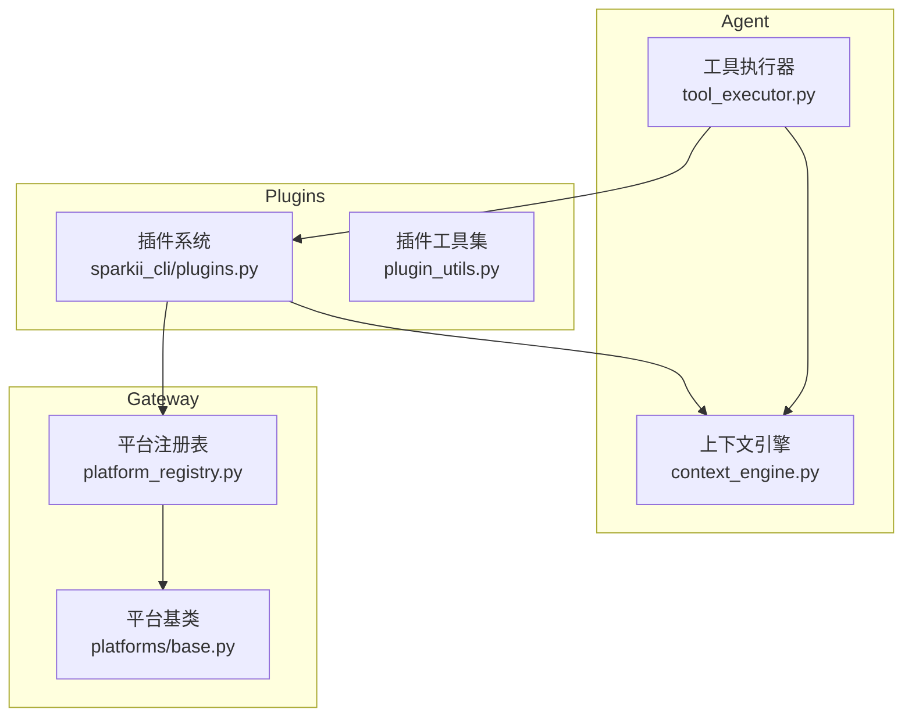
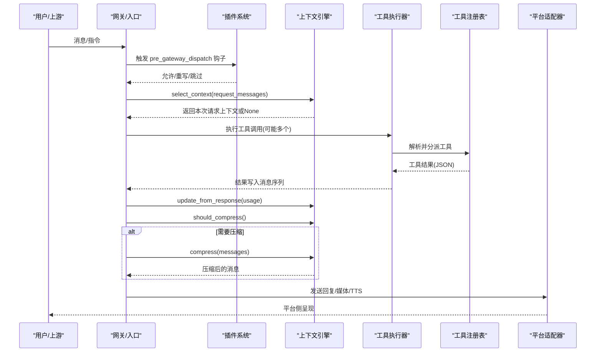
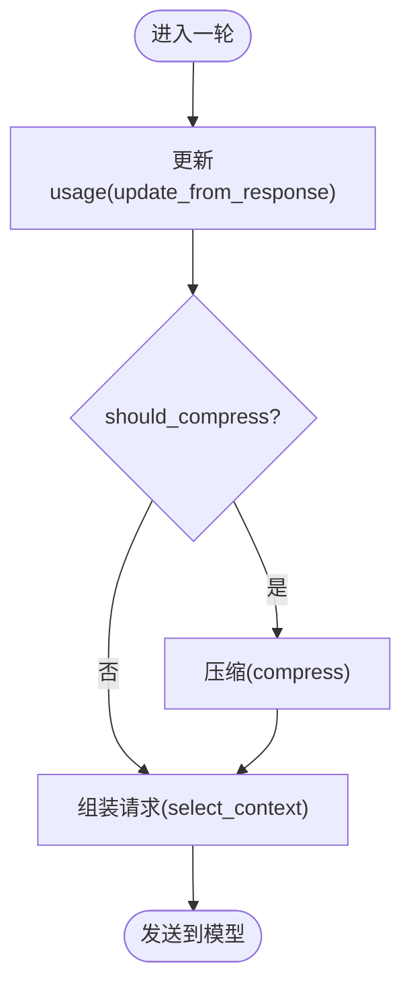
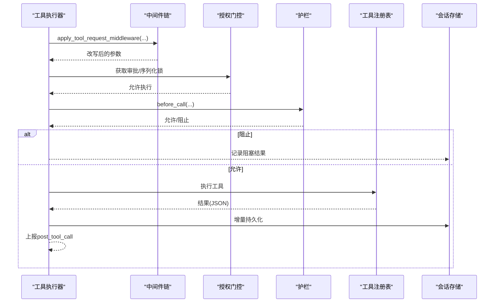
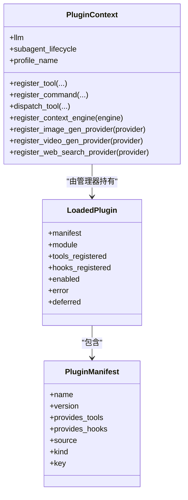
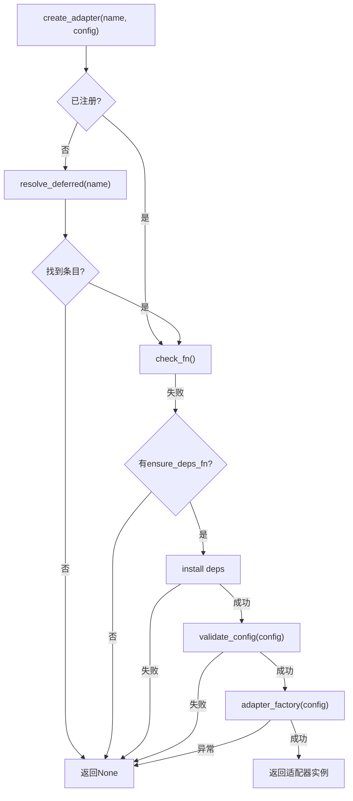
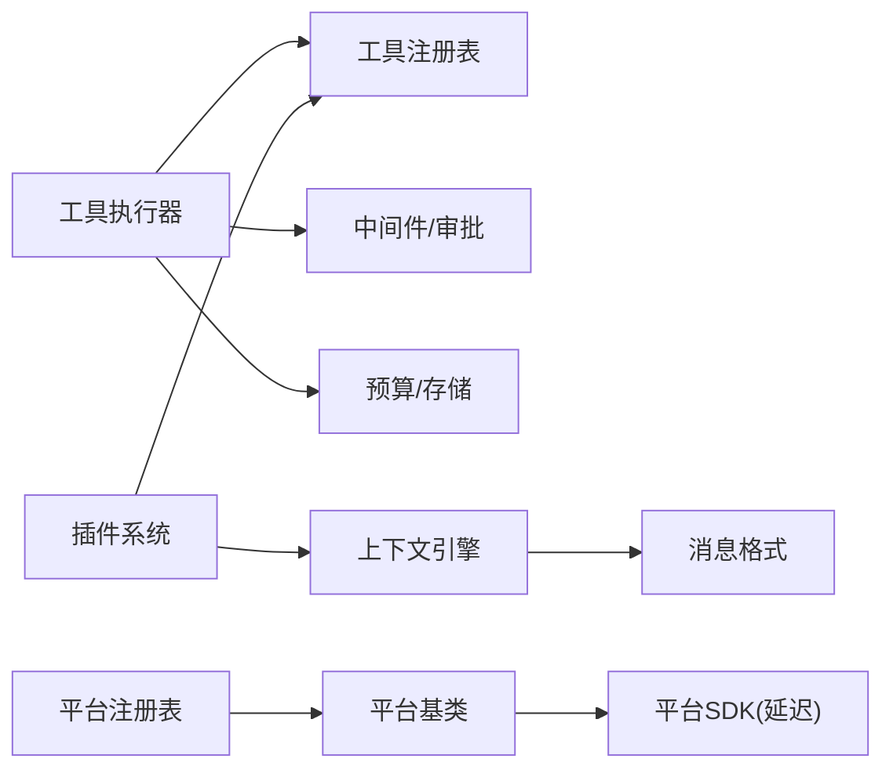

# 模块设计

<cite>
**本文引用的文件**
- [agent/context_engine.py](file://agent/context_engine.py)
- [agent/tool_executor.py](file://agent/tool_executor.py)
- [plugins/plugin_utils.py](file://plugins/plugin_utils.py)
- [gateway/platform_registry.py](file://gateway/platform_registry.py)
- [gateway/platforms/base.py](file://gateway/platforms/base.py)
- [sparkii_cli/plugins.py](file://sparkii_cli/plugins.py)
- [agent/errors.py](file://agent/errors.py)
</cite>

## 目录
1. [引言](#引言)
2. [项目结构](#项目结构)
3. [核心组件](#核心组件)
4. [架构总览](#架构总览)
5. [详细组件分析](#详细组件分析)
6. [依赖关系分析](#依赖关系分析)
7. [性能考量](#性能考量)
8. [故障排查指南](#故障排查指南)
9. [结论](#结论)
10. [附录：接口规范与扩展点](#附录接口规范与扩展点)

## 引言
本设计文档聚焦以下四大模块的职责、接口、通信机制与生命周期管理：
- 上下文引擎模块：负责对话上下文的压缩、选择与状态跟踪，提供可插拔的上下文策略。
- 工具执行环境模块：负责工具调用的串行/并发调度、权限与安全护栏、结果持久化与预算控制。
- 插件系统：负责插件发现、加载、注册与钩子分发，支持工具、命令、平台适配器等多种扩展点。
- 平台适配器：面向不同消息平台的统一接入层，通过注册表动态发现与实例化，具备依赖检查、配置校验与可选自动安装能力。

文档同时说明模块间通信方式（函数调用、回调、事件钩子）、数据传递格式（OpenAI 风格消息、JSON 参数/结果）、错误处理策略（分类异常、降级与超时）以及资源清理方案（会话边界、进程退出）。

## 项目结构
围绕目标模块的关键位置如下：
- 上下文引擎：抽象基类与默认行为在 agent/context_engine.py；插件可通过注册替换内置实现。
- 工具执行：集中式调度与中间件在 agent/tool_executor.py；与工具注册表、预算、显示等协作。
- 插件系统：发现与生命周期在 sparkii_cli/plugins.py；线程安全单例工具在 plugins/plugin_utils.py。
- 平台适配器：统一接口与通用逻辑在 gateway/platforms/base.py；注册与延迟加载在 gateway/platform_registry.py。

图表来源
- [agent/context_engine.py:89-490](file://agent/context_engine.py#L89-L490)
- [agent/tool_executor.py:482-662](file://agent/tool_executor.py#L482-L662)
- [sparkii_cli/plugins.py:136-221](file://sparkii_cli/plugins.py#L136-L221)
- [gateway/platform_registry.py:183-382](file://gateway/platform_registry.py#L183-L382)
- [gateway/platforms/base.py:1-120](file://gateway/platforms/base.py#L1-L120)

章节来源
- [agent/context_engine.py:89-490](file://agent/context_engine.py#L89-L490)
- [agent/tool_executor.py:482-662](file://agent/tool_executor.py#L482-L662)
- [sparkii_cli/plugins.py:136-221](file://sparkii_cli/plugins.py#L136-L221)
- [gateway/platform_registry.py:183-382](file://gateway/platform_registry.py#L183-L382)
- [gateway/platforms/base.py:1-120](file://gateway/platforms/base.py#L1-L120)

## 核心组件
- 上下文引擎（ContextEngine）
  - 职责：决定何时压缩、执行压缩、维护 token 使用统计、可选提供工具、按请求选择上下文。
  - 关键接口：update_from_response、should_compress、compress、select_context、on_turn_complete、get_tool_schemas/handle_tool_call、on_session_start/end/reset、update_model。
  - 生命周期：会话开始→每次响应更新→每轮判断是否压缩→必要时压缩→会话结束清理。
- 工具执行器（Tool Executor）
  - 职责：解析参数、中间件链（请求改写、前置拦截、后置上报）、并发调度、预算与输出限制、结果持久化、中断与取消。
  - 关键流程：_run_agent_tool_execution_middleware → 授权门控 → 执行 → 结果封装与上报。
  - 并发：线程池 + 启动顺序门限 + 授权序列化锁，避免审批提示交错与死锁。
- 插件系统（Plugin System）
  - 职责：多源插件发现（内置/用户/项目/pip）、清单解析、注册工具/命令/钩子/提供者、延迟加载重型依赖。
  - 钩子：pre/post tool call、LLM 前后、API 前后、会话生命周期、网关分发前、审批生命周期、看板任务等。
  - 线程安全：提供 lazy_singleton、SingletonSlot 防止竞态与资源泄漏。
- 平台适配器（Platform Adapters）
  - 职责：统一消息收发、媒体处理、代理与网络策略、TTS 流式输出、入站媒体大小限制。
  - 注册表：延迟加载、被动探测、主动安装依赖、配置校验、工厂创建实例。
  - 基类：提供通用工具（代理、长度计算、URL 安全、媒体缓存等），具体平台继承实现细节。

章节来源
- [agent/context_engine.py:89-490](file://agent/context_engine.py#L89-L490)
- [agent/tool_executor.py:482-662](file://agent/tool_executor.py#L482-L662)
- [sparkii_cli/plugins.py:136-221](file://sparkii_cli/plugins.py#L136-L221)
- [plugins/plugin_utils.py:43-136](file://plugins/plugin_utils.py#L43-L136)
- [gateway/platform_registry.py:183-382](file://gateway/platform_registry.py#L183-L382)
- [gateway/platforms/base.py:1-120](file://gateway/platforms/base.py#L1-L120)

## 架构总览
下图展示模块间的交互与数据流向：

图表来源
- [sparkii_cli/plugins.py:136-221](file://sparkii_cli/plugins.py#L136-L221)
- [agent/context_engine.py:215-279](file://agent/context_engine.py#L215-L279)
- [agent/context_engine.py:133-190](file://agent/context_engine.py#L133-L190)
- [agent/tool_executor.py:482-662](file://agent/tool_executor.py#L482-L662)
- [gateway/platforms/base.py:1-120](file://gateway/platforms/base.py#L1-L120)

## 详细组件分析

### 上下文引擎模块
- 设计模式
  - 抽象基类 + 默认实现：所有引擎必须实现 name、update_from_response、should_compress、compress；其他方法提供无副作用默认值，便于向后兼容。
  - 插件替换：通过插件系统注册唯一 ContextEngine 实例，覆盖内置压缩器。
- 关键接口与语义
  - update_from_response：标准化 usage 字段，兼容新旧键。
  - should_compress / should_compress_info：决定是否压缩及原因。
  - compress：将消息列表压缩为符合 OpenAI 格式的序列，支持 focus_topic、force、memory_context。
  - select_context：按请求选择上下文（检索/路由/角色切换），不影响持久历史。
  - on_turn_complete：观察本轮完成，用于索引/摘要/路由状态更新。
  - get_tool_schemas/handle_tool_call：引擎暴露的工具（如 lcm_grep）。
  - on_session_start/end/reset：会话级资源管理与状态重置。
  - update_model：模型切换时重算阈值与上下文长度。
- 数据流
  - 每轮 LLM 响应后更新 usage → 判断压缩 → 必要时压缩 → 下次请求前 select_context。
- 错误处理
  - 压缩状态消息可被引擎抑制；未实现的可选钩子保持 no-op，避免 AttributeError。
- 性能
  - prune_tool_results_only：低成本裁剪旧工具结果，减少大窗口引擎的重复传输。
  - 预检 with should_compress_preflight：快速估算，避免不必要 API 调用。

图表来源
- [agent/context_engine.py:133-190](file://agent/context_engine.py#L133-L190)
- [agent/context_engine.py:215-279](file://agent/context_engine.py#L215-L279)
- [agent/context_engine.py:145-160](file://agent/context_engine.py#L145-L160)

章节来源
- [agent/context_engine.py:89-490](file://agent/context_engine.py#L89-L490)

### 工具执行环境模块
- 设计模式
  - 中间件管道：请求改写、前置拦截（插件/护栏）、执行、后置上报，保证只执行一次且可观测。
  - 并发调度：线程池 + 启动顺序门 + 授权序列化锁，兼顾吞吐与用户体验（审批不交错）。
- 关键流程
  - _run_agent_tool_execution_middleware：串联 relay 重写、middleware、授权门控、guardrails、执行。
  - 预算与输出限制：根据上下文窗口缩放工具结果预算，避免单次结果撑爆上下文。
  - 结果持久化：增量持久化失败时记录原因，确保破坏性但合法的工具调用可恢复。
  - 中断与取消：支持用户中断，批量内每个工具均可被取消并上报。
- 数据传递
  - 参数：JSON 对象；错误：结构化 JSON 字符串（含 error/status/message）。
  - 元数据：task_id、turn_id、api_request_id、tool_call_id 贯穿全链路。
- 错误处理
  - 授权门控超时：若持有者卡住，释放锁以避免批次饥饿。
  - 中间件异常：捕获并记录，不阻断主流程。
  - 持久化失败：标记并分类错误原因，便于诊断。

图表来源
- [agent/tool_executor.py:482-662](file://agent/tool_executor.py#L482-L662)
- [agent/tool_executor.py:758-800](file://agent/tool_executor.py#L758-L800)

章节来源
- [agent/tool_executor.py:482-662](file://agent/tool_executor.py#L482-L662)
- [agent/tool_executor.py:758-800](file://agent/tool_executor.py#L758-L800)

### 插件系统
- 设计模式
  - 多源发现与优先级：内置 > 用户 > 项目 > pip；同名冲突后者覆盖前者。
  - 延迟加载：重型 SDK 按需导入，降低冷启动开销。
  - 钩子系统：丰富的生命周期钩子，支持对工具、LLM、API、会话、网关、审批、看板等阶段的扩展。
- 注册能力
  - 工具：register_tool（支持覆盖需显式授权）。
  - 命令：CLI 子命令与会话斜杠命令。
  - 提供者：图像/视频生成、网页搜索/提取、仪表盘认证等。
  - 上下文引擎：仅允许一个插件注册。
- 线程安全
  - lazy_singleton、SingletonSlot：避免竞态导致的资源泄漏与重复初始化。
- 错误处理
  - 类型校验：注册时严格类型检查，错误降级为警告并忽略。
  - 覆盖保护：非内置插件覆盖内置工具需显式配置授权。

图表来源
- [sparkii_cli/plugins.py:307-362](file://sparkii_cli/plugins.py#L307-L362)
- [sparkii_cli/plugins.py:368-800](file://sparkii_cli/plugins.py#L368-L800)

章节来源
- [sparkii_cli/plugins.py:136-221](file://sparkii_cli/plugins.py#L136-L221)
- [sparkii_cli/plugins.py:307-800](file://sparkii_cli/plugins.py#L307-L800)
- [plugins/plugin_utils.py:43-136](file://plugins/plugin_utils.py#L43-L136)

### 平台适配器
- 设计模式
  - 统一接口：BasePlatformAdapter 定义通用能力（代理、媒体、TTS、长度计算、URL 安全等）。
  - 注册表驱动：PlatformRegistry 提供延迟加载、依赖检查、配置校验、工厂创建。
- 关键能力
  - 依赖检查：check_fn 轻量探测；ensure_deps_fn 仅在连接前尝试安装。
  - 配置校验：validate_config 提前拒绝错误配置。
  - 独立发送：standalone_sender_fn 支持跨进程发送（cron 场景）。
  - 媒体与 TTS：入站媒体大小限制、流式 TTS 句柄、格式约定。
- 错误处理
  - 依赖缺失：记录提示并返回 None，避免启动期硬失败。
  - 工厂异常：捕获并记录，返回 None。
  - 网络/代理：NO_PROXY/no_proxy 匹配、SOCKS/HTTP 适配。

图表来源
- [gateway/platform_registry.py:299-382](file://gateway/platform_registry.py#L299-L382)

章节来源
- [gateway/platform_registry.py:183-382](file://gateway/platform_registry.py#L183-L382)
- [gateway/platforms/base.py:1-120](file://gateway/platforms/base.py#L1-L120)

## 依赖关系分析
- 耦合与内聚
  - 上下文引擎与工具执行器松耦合：通过标准接口与消息格式交互，引擎不感知工具细节。
  - 插件系统与上层解耦：通过钩子和注册表扩展，不侵入核心流程。
  - 平台适配器与网关：通过注册表与基类抽象，屏蔽平台差异。
- 直接/间接依赖
  - 工具执行器依赖工具注册表、预算配置、显示模块、中间件、审批模块。
  - 插件系统依赖 CLI 配置、日志、工具注册表、各提供者接口。
  - 平台注册表依赖平台基类与具体平台 SDK（延迟导入）。
- 循环依赖
  - 通过延迟导入（如 from agent.context_engine import ContextEngine）避免循环。
- 外部集成点
  - LLM 提供商（通过 usage 与消息格式）、消息平台 SDK、文件系统、网络代理。

图表来源
- [agent/tool_executor.py:482-662](file://agent/tool_executor.py#L482-L662)
- [agent/context_engine.py:89-490](file://agent/context_engine.py#L89-L490)
- [sparkii_cli/plugins.py:307-800](file://sparkii_cli/plugins.py#L307-L800)
- [gateway/platform_registry.py:183-382](file://gateway/platform_registry.py#L183-L382)

章节来源
- [agent/tool_executor.py:482-662](file://agent/tool_executor.py#L482-L662)
- [agent/context_engine.py:89-490](file://agent/context_engine.py#L89-L490)
- [sparkii_cli/plugins.py:307-800](file://sparkii_cli/plugins.py#L307-L800)
- [gateway/platform_registry.py:183-382](file://gateway/platform_registry.py#L183-L382)

## 性能考量
- 上下文引擎
  - 低成本裁剪：prune_tool_results_only 在不调用 LLM 的情况下回收旧工具结果。
  - 预检优化：should_compress_preflight 快速估算，避免不必要的压缩。
- 工具执行
  - 并发上限：最大工作线程数与图片生成并行度受配置限制，避免后端风暴。
  - 审批等待排除：授权门控中 human_wait_seconds 从批次截止时间中排除，避免死锁。
  - 预算自适应：根据上下文窗口缩放工具结果预算，防止小模型被大结果撑爆。
- 插件系统
  - 延迟加载：重型 SDK 仅在首次使用时导入，缩短启动时间。
  - 线程安全单例：避免重复初始化昂贵资源。
- 平台适配器
  - 入站媒体限制：防止恶意上传导致 OOM。
  - 代理与 NO_PROXY：智能选择代理，提升连通性与安全性。

[本节为通用指导，不直接分析具体文件]

## 故障排查指南
- 常见错误与定位
  - 空流错误：当提供商关闭流且未产出响应时抛出 EmptyStreamError，检查网络与提供商状态。
  - SSL 配置错误：证书包配置失败时抛出 SSLConfigurationError，检查 CA 路径与环境变量。
  - 工具执行被阻断：检查 pre_tool_call 钩子与护栏决策，确认授权与策略。
  - 平台依赖缺失：PlatformRegistry.create_adapter 返回 None 并记录提示，按 install_hint 安装依赖。
- 调试建议
  - 启用插件调试：设置 SPARKII_PLUGINS_DEBUG=1 查看插件发现与加载详情。
  - 检查中间件追踪：工具执行中间件会记录 trace，便于定位改写与拦截点。
  - 审查会话持久化失败：工具执行器会记录 _last_persistence_error_cause，结合日志定位。

章节来源
- [agent/errors.py:1-14](file://agent/errors.py#L1-L14)
- [agent/tool_executor.py:482-662](file://agent/tool_executor.py#L482-L662)
- [gateway/platform_registry.py:299-382](file://gateway/platform_registry.py#L299-L382)
- [sparkii_cli/plugins.py:83-130](file://sparkii_cli/plugins.py#L83-L130)

## 结论
本设计通过清晰的抽象与注册机制，实现了上下文引擎、工具执行、插件系统与平台适配器的模块化与可扩展性。模块间以标准接口与消息格式通信，配合中间件与钩子实现灵活扩展。生命周期管理覆盖会话与进程边界，错误处理与资源清理策略稳健可靠。遵循本文档的接口规范与扩展点，可高效开发自定义上下文引擎、工具、插件与平台适配器。

[本节为总结，不直接分析具体文件]

## 附录：接口规范与扩展点

### 上下文引擎接口规范
- 必填接口
  - name: str
  - update_from_response(usage: Dict[str, Any]) -> None
  - should_compress(prompt_tokens: int = None) -> bool
  - compress(messages: List[Dict[str, Any]], current_tokens: Optional[int], focus_topic: Optional[str], force: bool, memory_context: str) -> List[Dict[str, Any]]
- 可选接口
  - should_compress_info(prompt_tokens: int = None) -> tuple[bool, str | None]
  - prune_tool_results_only(messages, current_tokens) -> (messages, n_pruned)
  - select_context(request_messages, conversation_messages, incoming_message, budget_tokens) -> List[Dict[str, Any]] | None
  - on_turn_complete(messages, usage, **kwargs) -> None
  - should_compress_preflight(messages) -> bool
  - should_defer_preflight_to_real_usage(rough_tokens) -> bool
  - get_automatic_compaction_status_message(phase, default_message, **context) -> str | None
  - has_content_to_compress(messages) -> bool
  - on_session_start(session_id, **kwargs) -> None
  - on_session_end(session_id, messages) -> None
  - on_session_reset() -> None
  - get_tool_schemas() -> List[Dict[str, Any]]
  - handle_tool_call(name, args, **kwargs) -> str
  - get_status() -> Dict[str, Any]
  - update_model(model, context_length, base_url, api_key, provider, api_mode) -> None

章节来源
- [agent/context_engine.py:89-490](file://agent/context_engine.py#L89-L490)

### 工具执行器扩展点
- 中间件链：apply_tool_request_middleware、run_tool_execution_middleware
- 授权门控：_ConcurrentToolAuthorizationGate（序列化审批、排除人类等待）
- 预算：budget_for_context_window、DEFAULT_BUDGET
- 结果持久化：maybe_persist_tool_result、enforce_turn_budget
- 回调：tool_progress_callback、tool_start_callback、post_tool_call 上报

章节来源
- [agent/tool_executor.py:482-662](file://agent/tool_executor.py#L482-L662)
- [agent/tool_executor.py:758-800](file://agent/tool_executor.py#L758-L800)

### 插件系统扩展点
- 钩子集合：pre_tool_call、post_tool_call、transform_terminal_output、transform_tool_result、transform_llm_output、pre_llm_call、post_llm_call、pre_verify、pre_api_request、post_api_request、api_request_error、on_session_start/end/finalize/reset、on_skill_lifecycle、subagent_start/stop、pre_gateway_dispatch、pre_approval_request、post_approval_response、kanban_task_claimed/completed/blocked
- 注册能力：register_tool、register_command、register_cli_command、dispatch_tool、register_context_engine、register_image_gen_provider、register_video_gen_provider、register_web_search_provider、register_dashboard_auth_provider
- 线程安全：lazy_singleton、SingletonSlot

章节来源
- [sparkii_cli/plugins.py:136-221](file://sparkii_cli/plugins.py#L136-L221)
- [sparkii_cli/plugins.py:368-800](file://sparkii_cli/plugins.py#L368-L800)
- [plugins/plugin_utils.py:43-136](file://plugins/plugin_utils.py#L43-L136)

### 平台适配器扩展点
- 注册项 PlatformEntry 字段：name、label、adapter_factory、check_fn、validate_config、ensure_deps_fn、is_connected、required_env、install_hint、setup_fn、source、plugin_name、allowed_users_env、allow_all_env、max_message_length、pii_safe、emoji、allow_update_command、platform_hint、env_enablement_fn、apply_yaml_config_fn、cron_deliver_env_var、standalone_sender_fn
- 注册表方法：register、unregister、get、all_entries、plugin_entries、is_registered、create_adapter
- 基类能力：代理、媒体、TTS、长度计算、URL 安全、入站媒体限制

章节来源
- [gateway/platform_registry.py:38-181](file://gateway/platform_registry.py#L38-L181)
- [gateway/platform_registry.py:183-382](file://gateway/platform_registry.py#L183-L382)
- [gateway/platforms/base.py:1-120](file://gateway/platforms/base.py#L1-L120)