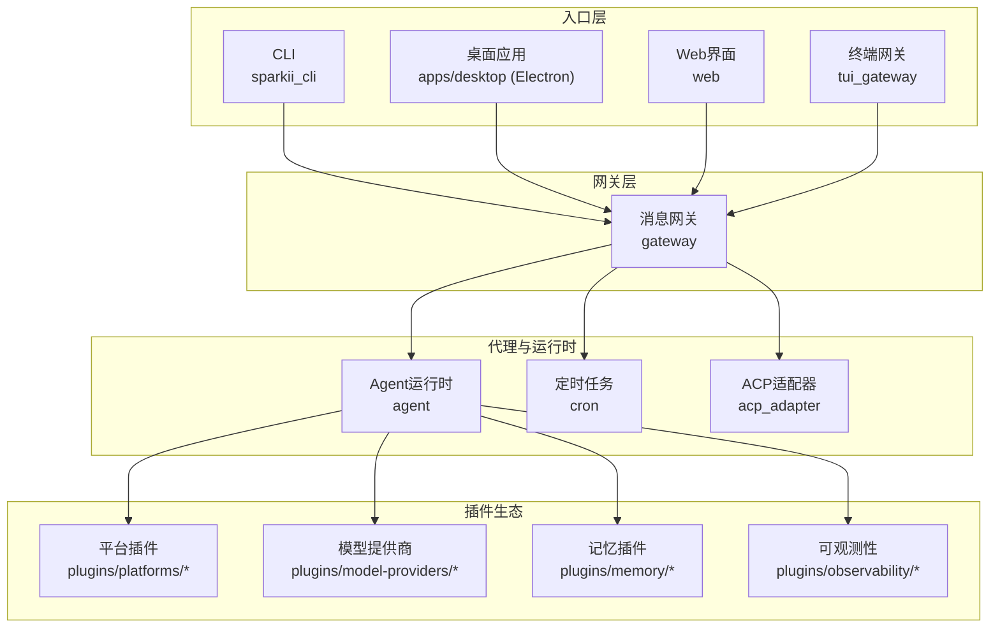
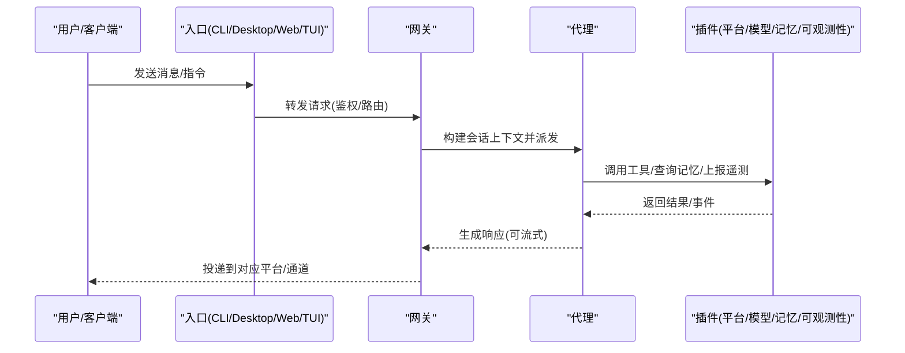
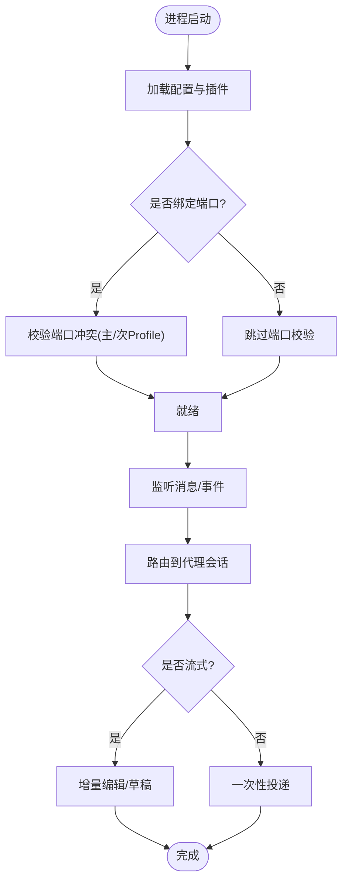
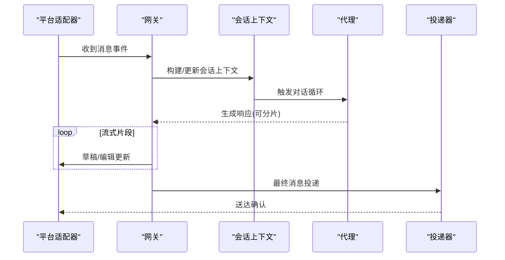
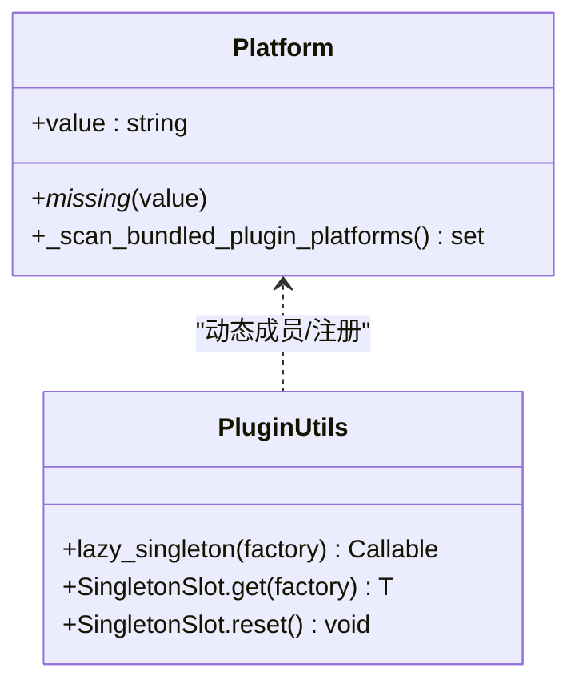
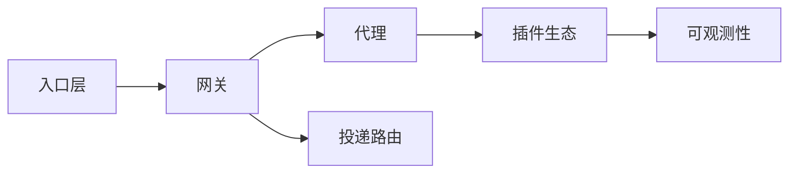
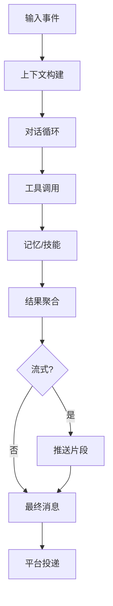
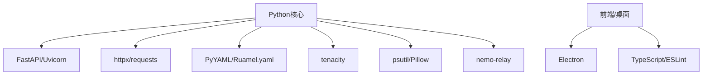

# 系统架构概览

<cite>
**本文引用的文件**
- [README.md](file://README.md)
- [pyproject.toml](file://pyproject.toml)
- [package.json](file://package.json)
- [gateway/__init__.py](file://gateway/__init__.py)
- [gateway/config.py](file://gateway/config.py)
- [sparkii_cli/main.py](file://sparkii_cli/main.py)
- [plugins/plugin_utils.py](file://plugins/plugin_utils.py)
</cite>

## 目录
1. [简介](#简介)
2. [项目结构](#项目结构)
3. [核心组件](#核心组件)
4. [架构总览](#架构总览)
5. [详细组件分析](#详细组件分析)
6. [依赖关系分析](#依赖关系分析)
7. [性能考量](#性能考量)
8. [故障排查指南](#故障排查指南)
9. [结论](#结论)
10. [附录](#附录)

## 简介
本概览面向SparkiiDesktop（基于Sparkii Agent生态）的整体架构，聚焦以下目标：
- 微服务化边界：网关与代理进程分离、桌面/CLI/TUI/Web多入口统一接入。
- 事件驱动：消息平台到Agent的异步事件流、流式输出与投递路由。
- 插件扩展：平台、模型、记忆、可观测性等插件化机制与生命周期。
- 横切关注点：安全、监控、灾难恢复、部署拓扑与可扩展性权衡。
- 技术栈与兼容性：Python/Node版本约束、关键第三方依赖与可选能力。

## 项目结构
仓库采用“多语言、多进程、多入口”的分层组织：
- Python后端核心：agent、gateway、cron、acp_adapter、tools等模块，提供会话、工具执行、调度、协议适配。
- CLI与启动器：sparkii_cli负责命令解析、配置加载、进程编排、服务管理。
- 桌面端：apps/desktop基于Electron，提供本地GUI与系统集成。
- Web与TUI：web为Web界面，tui_gateway提供终端交互网关。
- 插件体系：plugins下按领域划分（platforms、model-providers、memory、observability等），通过注册表与清单动态发现。

**图表来源**
- [gateway/__init__.py:1-36](file://gateway/__init__.py#L1-L36)
- [sparkii_cli/main.py:1-800](file://sparkii_cli/main.py#L1-L800)

**章节来源**
- [README.md:1-265](file://README.md#L1-L265)
- [pyproject.toml:358-410](file://pyproject.toml#L358-L410)
- [package.json:1-81](file://package.json#L1-L81)

## 核心组件
- 网关（Gateway）：统一接入多平台消息（Telegram/Discord/Slack/WhatsApp/Matrix等），负责会话上下文、投递路由、流式编辑、平台能力探测与配置管理。
- 代理（Agent）：会话循环、工具调用、上下文压缩、记忆与学习回路、子代理委派、重试与预算控制。
- CLI与启动器：命令分发、环境准备、配置文件加载、服务启停、日志与诊断。
- 插件系统：平台、模型、记忆、可观测性等以插件形式热插拔，支持清单描述与运行时注册。
- 定时任务（Cron）：内置调度器，支持自然语言任务与多渠道投递。
- ACP适配器：编辑器集成协议适配，使IDE/编辑器可作为客户端接入。

**章节来源**
- [gateway/__init__.py:1-36](file://gateway/__init__.py#L1-L36)
- [gateway/config.py:272-418](file://gateway/config.py#L272-L418)
- [sparkii_cli/main.py:1-800](file://sparkii_cli/main.py#L1-L800)
- [pyproject.toml:358-410](file://pyproject.toml#L358-L410)

## 架构总览
整体采用“多入口—网关—代理—插件”的分层架构：
- 入口层：CLI、桌面、Web、TUI作为用户或外部系统的接入面，均通过网关进行鉴权、路由与会话管理。
- 网关层：抽象平台差异，维护会话状态、上下文注入、流式响应、投递策略与平台能力。
- 代理层：实现对话循环、工具执行、记忆与技能、计划与调度、子代理委派与并行工作流。
- 插件层：平台、模型、记忆、可观测性等通过注册表与清单动态加载，支持按需启用与隔离。

**图表来源**
- [gateway/__init__.py:1-36](file://gateway/__init__.py#L1-L36)
- [sparkii_cli/main.py:1-800](file://sparkii_cli/main.py#L1-L800)

## 详细组件分析

### 网关与代理进程的分离设计
- 职责边界清晰：网关专注接入、会话与投递；代理专注推理、工具与记忆。
- 进程隔离：CLI/桌面/Web/TUI均可独立启动，通过网关统一协调，便于横向扩展与故障隔离。
- 配置与能力解耦：平台能力、流式传输、投递策略由网关配置驱动，不影响代理核心逻辑。

**图表来源**
- [gateway/config.py:376-418](file://gateway/config.py#L376-L418)
- [gateway/config.py:720-800](file://gateway/config.py#L720-L800)

**章节来源**
- [gateway/config.py:376-418](file://gateway/config.py#L376-L418)
- [gateway/config.py:720-800](file://gateway/config.py#L720-L800)

### 事件驱动架构的实现方式
- 消息事件：各平台消息经网关转换为统一事件，注入会话上下文后进入代理处理。
- 流式输出：支持草稿/编辑两种模式，按平台能力选择最优路径，提升用户体验。
- 投递路由：根据Home Channel、渠道覆盖、订阅与调度结果进行定向投递。

**图表来源**
- [gateway/__init__.py:1-36](file://gateway/__init__.py#L1-L36)
- [gateway/config.py:720-800](file://gateway/config.py#L720-L800)

**章节来源**
- [gateway/__init__.py:1-36](file://gateway/__init__.py#L1-L36)
- [gateway/config.py:720-800](file://gateway/config.py#L720-L800)

### 插件架构的扩展机制
- 插件类型：平台、模型提供商、记忆、可观测性、仪表盘认证等。
- 发现与注册：通过文件系统扫描与运行时注册表，动态创建枚举成员与能力。
- 并发安全：提供线程安全的懒加载单例与槽位，避免竞态条件导致的资源泄漏。

**图表来源**
- [gateway/config.py:272-369](file://gateway/config.py#L272-L369)
- [plugins/plugin_utils.py:1-136](file://plugins/plugin_utils.py#L1-L136)

**章节来源**
- [gateway/config.py:272-369](file://gateway/config.py#L272-L369)
- [plugins/plugin_utils.py:1-136](file://plugins/plugin_utils.py#L1-L136)

### 系统边界与组件交互关系
- 边界：入口层仅负责接入与鉴权；网关负责协议抽象与会话；代理负责业务逻辑；插件提供能力扩展。
- 交互：入口→网关→代理→插件；数据流向单向为主，偶有回调（如平台事件）。
- 数据：消息、工具调用结果、记忆检索、遥测指标在组件间传递，保持最小必要暴露。

[本节为概念性说明，不直接分析具体文件]

### 数据流向与处理逻辑
- 输入：平台消息/命令/事件。
- 处理：会话上下文构建→代理推理→工具调用→记忆读写→结果聚合。
- 输出：流式/非流式响应→平台投递→审计与遥测上报。

[本节为概念性说明，不直接分析具体文件]

## 依赖关系分析
- Python核心依赖：FastAPI/Uvicorn用于Web与Dashboard；httpx/requests用于HTTP通信；PyYAML/Ruamel.yaml用于配置；tenacity用于重试；rich用于终端渲染；psutil用于进程管理；Pillow用于图像处理；nemo-relay用于共享指标与中继。
- Node/前端依赖：Electron用于桌面端；TypeScript/ESLint用于工程化；workspaces管理多包。
- 可选能力：messaging、voice、wake、mcp、otlp等通过extras按需安装，降低默认体积与攻击面。

**图表来源**
- [pyproject.toml:19-155](file://pyproject.toml#L19-L155)
- [package.json:37-79](file://package.json#L37-L79)

**章节来源**
- [pyproject.toml:19-155](file://pyproject.toml#L19-L155)
- [pyproject.toml:157-352](file://pyproject.toml#L157-L352)
- [package.json:1-81](file://package.json#L1-L81)

## 性能考量
- 流式优化：自动选择草稿/编辑路径，减少平台限频风险，提升首字节延迟。
- 懒加载与可选依赖：通过extras与lazy_deps将重型依赖延后至首次使用，缩短冷启动时间。
- 进程与资源隔离：CLI/网关/代理可独立运行，结合系统级守护与看门狗保障稳定性。
- 内存与上下文压缩：会话上下文压缩与记忆摘要，降低长对话开销。

[本节提供通用指导，不直接分析具体文件]

## 故障排查指南
- 启动失败：检查端口绑定冲突（主/次Profile）、环境变量与密钥、平台令牌有效性。
- 流式异常：确认平台是否支持草稿/编辑模式，调整streaming配置。
- 插件加载：验证插件清单与注册表，确保依赖满足且无导入错误。
- 日志与诊断：使用CLI诊断命令查看配置、依赖与环境；集中日志便于跨进程问题定位。

**章节来源**
- [gateway/config.py:376-418](file://gateway/config.py#L376-L418)
- [gateway/config.py:720-800](file://gateway/config.py#L720-L800)
- [sparkii_cli/main.py:1-800](file://sparkii_cli/main.py#L1-L800)

## 结论
SparkiiDesktop采用清晰的“入口—网关—代理—插件”分层架构，通过事件驱动与插件化扩展实现高内聚、低耦合的系统设计。网关与代理的分离提升了可维护性与可扩展性；插件生态覆盖了平台、模型、记忆与可观测性等关键领域；配合严格的依赖管理与可选能力，兼顾了性能、安全与部署灵活性。

[本节为总结性内容，不直接分析具体文件]

## 附录

### 横切关注点
- 安全性：
  - 严格依赖版本锁定与CVE修复基线，减少供应链风险。
  - 平台鉴权与渠道覆盖控制，限制未授权访问。
  - Windows日志旋转与权限隔离，避免跨进程竞争。
- 监控与可观测性：
  - 可选OTLP导出、Nemo Relay共享指标，支持健康检查与告警。
  - 流式编辑与投递审计，便于问题回溯。
- 灾难恢复：
  - 会话重置策略（每日/空闲/组合/关闭），防止长期占用。
  - 看门狗与服务重启，保障网关可用性。
  - 备份与迁移工具，支持从其他Agent生态平滑迁移。

[本节为概念性说明，不直接分析具体文件]

### 部署拓扑建议
- 单机桌面：CLI/桌面/网关/代理同机运行，适合个人开发。
- 服务器部署：网关与代理分离，容器化部署，结合看门狗与日志轮转。
- 多Profile：主Profile绑定端口，次Profile复用监听，避免端口冲突。
- 云原生：利用Serverless/托管平台（Modal/Daytona/Vercel）实现按需唤醒与低成本闲置。

[本节为概念性说明，不直接分析具体文件]

### 技术栈与兼容性
- Python：>=3.11,<3.14；核心依赖精确锁定，可选能力通过extras按需安装。
- Node/前端：Node >=22.22.0，npm版本约束；Electron用于桌面端。
- 第三方：FastAPI/Uvicorn、httpx/requests、PyYAML/Ruamel.yaml、tenacity、psutil、Pillow、nemo-relay等。
- 可选：messaging、voice、wake、mcp、otlp、google、teams、matrix等。

**章节来源**
- [pyproject.toml:15-155](file://pyproject.toml#L15-L155)
- [pyproject.toml:157-352](file://pyproject.toml#L157-L352)
- [package.json:65-79](file://package.json#L65-L79)