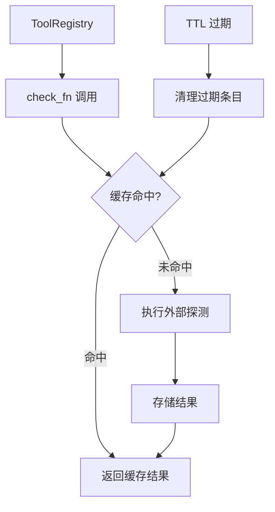
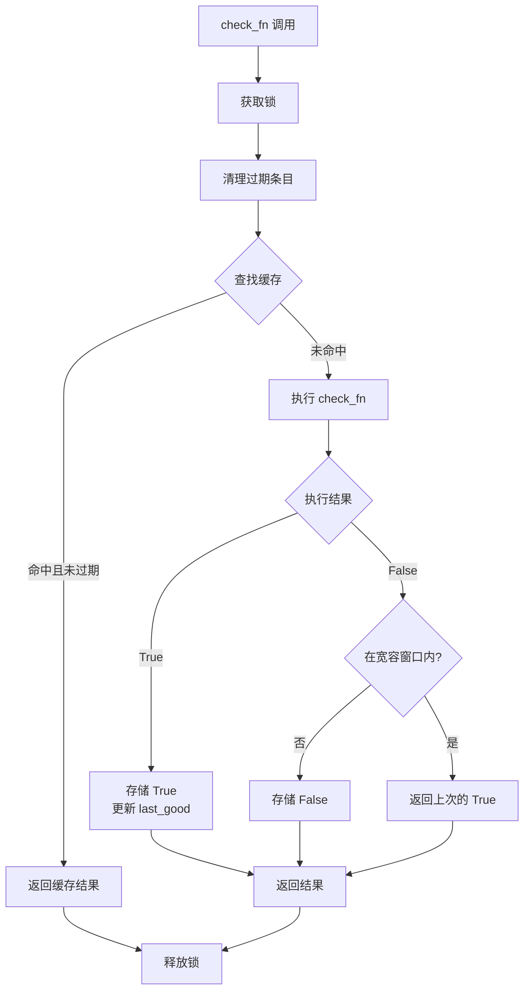

# 检查函数缓存系统

<cite>
**本文引用的文件**
- [tools/registry.py](file://tools/registry.py)
</cite>

## 目录
1. [简介](#简介)
2. [项目结构](#项目结构)
3. [核心组件](#核心组件)
4. [架构总览](#架构总览)
5. [详细组件分析](#详细组件分析)
6. [依赖关系分析](#依赖关系分析)
7. [性能考量](#性能考量)
8. [故障排查指南](#故障排查指南)
9. [结论](#结论)

## 简介
本文详细阐述 Hermes Agent 工具系统中的检查函数（check_fn）TTL 缓存机制。check_fn 用于探测工具的运行时可用性（如 Docker 是否安装、Playwright 是否就绪），其结果通过 TTL 缓存避免频繁的外部探测，同时通过故障宽容窗口吸收瞬态失败。

缓存系统是工具注册中心的关键优化组件，直接影响 Agent 的启动速度和工具列表的准确性。

## 项目结构
check_fn 缓存系统完全实现在 `tools/registry.py` 中，包括缓存数据结构、TTL 管理和故障恢复逻辑。

## 核心组件
- **_CHECK_FN_TTL_SECONDS**（registry.py:257）：缓存 TTL，默认 30 秒。
- **_CHECK_FN_FAILURE_GRACE_SECONDS**（registry.py:261）：故障宽容窗口，默认 60 秒。
- **_CHECK_FN_CACHE_MAX**（registry.py:262）：缓存最大条目数，默认 512。
- **_check_fn_cache**（registry.py:263）：主缓存字典，键为 (check_fn, scope) 元组。
- **_check_fn_last_good**（registry.py:265）：最近成功时间戳记录。
- **_check_fn_cache_lock**（registry.py:266）：线程安全锁。
- **_prune_check_fn_caches**（registry.py:270）：缓存清理函数。

## 架构总览

## 详细组件分析
### TTL 缓存机制
- 缓存键由 (check_fn 引用, profile scope) 组成，支持多 profile 隔离。
- 每个缓存条目包含时间戳和结果布尔值。
- TTL 过期后条目被惰性清理（下次访问时）或主动清理（_prune_check_fn_caches）。

### 故障宽容窗口
- 当 check_fn 返回 True 后，在 60 秒的宽容窗口内，如果后续调用返回 False，系统仍返回 True。
- 这是为了吸收瞬态故障（如 Docker daemon 偶尔超时）。
- 宽容窗口过后，真正的 False 结果会被正常缓存。

### 多 Profile 隔离
- 通过 check_fn_cache_scope() 获取当前 profile 标识。
- 不同 profile 的缓存结果互不影响。
- 单 profile 进程使用 process-wide 缓存。

### 缓存大小控制
- 最大条目数 512，超过时淘汰最旧的条目。
- _check_fn_cache 和 _check_fn_last_good 分别独立控制。
- 清理操作在锁内执行，保证线程安全。

## 依赖关系分析
- **注册中心**：`tools/registry.py` — 完整缓存实现
- **工具入口**：ToolEntry — check_fn 字段
- **Kanban 工具**：`tools/kanban_tools.py` — 使用缓存的示例

## 性能考量
- 缓存命中时开销仅为字典查找，O(1) 时间复杂度。
- 锁粒度控制在缓存操作级别，不包含外部探测。
- 清理操作是批量的，减少锁持有时间。
- 缓存最大条目数限制内存使用。

## 故障排查指南
- **工具突然不可用**：检查 TTL 是否过短，导致频繁探测。
- **缓存不生效**：确认 check_fn_cache_scope() 返回正确的 profile。
- **内存增长**：检查 _CHECK_FN_CACHE_MAX 是否合理。
- **瞬态故障未被吸收**：确认 _CHECK_FN_FAILURE_GRACE_SECONDS 配置。

## 结论
检查函数缓存系统是工具注册中心的关键优化组件。通过 TTL 缓存和故障宽容窗口的双重机制，系统在保证工具可用性准确性的同时，显著减少了外部探测的频率。开发者应根据实际环境调整 TTL 和宽容窗口参数。

