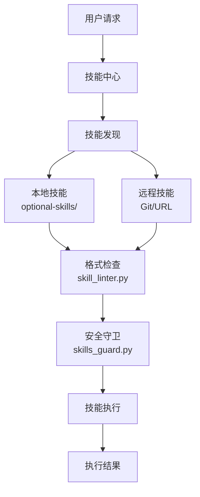
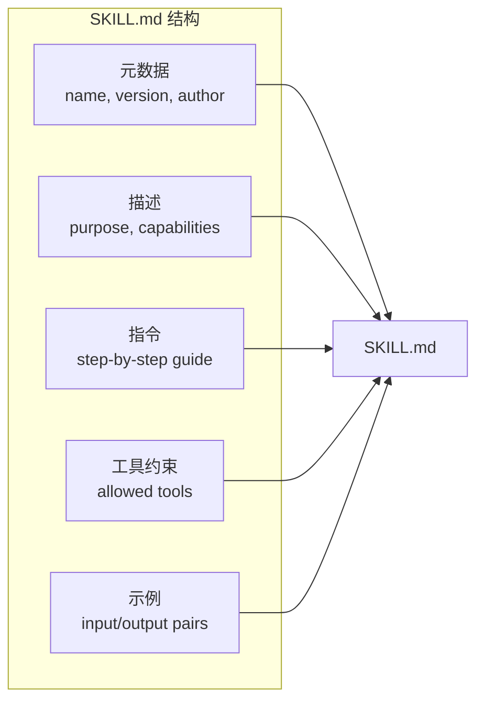

# 技能开发指南

<cite>
**本文引用的文件**
- [optional-skills/creative/concept-diagrams/SKILL.md](file://optional-skills/creative/concept-diagrams/SKILL.md)
- [optional-skills/finance/dcf-model/SKILL.md](file://optional-skills/finance/dcf-model/SKILL.md)
- [tools/skill_linter.py](file://tools/skill_linter.py)
- [tools/skills_guard.py](file://tools/skills_guard.py)
</cite>

## 目录
1. [简介](#简介)
2. [项目结构](#项目结构)
3. [核心组件](#核心组件)
4. [架构总览](#架构总览)
5. [详细组件分析](#详细组件分析)
6. [依赖关系分析](#依赖关系分析)
7. [性能考量](#性能考量)
8. [故障排查指南](#故障排查指南)
9. [结论](#结论)

## 简介
本文提供 Hermes Agent 技能（Skill）开发的完整指南。技能是 Agent 的可插拔能力扩展——每个技能是一个独立的 SKILL.md 文件，定义了特定任务的执行指令、工具使用规范和输出格式。

技能系统支持从本地目录或远程仓库加载技能包，通过技能守卫（Skills Guard）确保安全执行，并通过技能检查器（Skill Linter）验证格式正确性。

## 项目结构
技能系统的实现涉及多个模块：
- `optional-skills/`：内置技能目录
- `tools/skill_linter.py`：技能格式检查器
- `tools/skills_guard.py`：技能安全守卫
- `optional-skills/*/SKILL.md`：技能定义文件



## 核心组件
- **SKILL.md 格式**：技能定义文件，包含元数据、指令和示例。
- **技能检查器**（skill_linter.py）：验证 SKILL.md 的格式正确性和完整性。
- **技能守卫**（skills_guard.py）：检查技能的安全约束，防止危险操作。
- **技能发现**：从本地目录和远程仓库自动发现可用技能。
- **技能执行环境**：沙箱化的执行环境，限制技能的系统访问。

## 架构总览


## 详细组件分析
### SKILL.md 文件格式
```markdown
---
name: my-skill
version: 1.0.0
author: developer
description: 技能描述
tools: [read_file, write_file]
---

## 指令
1. 步骤一...
2. 步骤二...

## 示例
输入: ...
输出: ...
```

### 技能开发模板
1. 创建技能目录：`optional-skills/<category>/<skill-name>/`
2. 编写 SKILL.md 文件，遵循格式规范。
3. 使用 skill_linter 验证格式。
4. 测试技能执行效果。
5. 提交代码审查。

### 安全约束
- 技能只能使用声明的工具列表。
- 文件操作限制在指定目录范围内。
- 网络请求需要显式声明域名白名单。
- 禁止访问系统敏感路径。

### 调试技巧
- 使用 skill_linter 检查格式问题。
- 通过日志查看技能执行过程。
- 使用模拟环境测试技能行为。

## 依赖关系分析
- **技能检查**：`tools/skill_linter.py` — 格式验证
- **安全守卫**：`tools/skills_guard.py` — 安全约束
- **创意技能**：`optional-skills/creative/concept-diagrams/SKILL.md` — 示例
- **金融技能**：`optional-skills/finance/dcf-model/SKILL.md` — 示例

## 性能考量
- 技能文件使用 Markdown 格式，解析开销极小。
- 技能发现使用目录扫描，支持增量更新。
- 技能加载使用缓存，避免重复读取文件。
- 安全检查在技能加载时完成，不在执行时检查。

## 故障排查指南
- **技能格式错误**：运行 skill_linter 检查具体问题。
- **安全约束被拒**：确认技能声明的工具和路径在允许范围内。
- **技能未被发现**：检查技能目录结构和 SKILL.md 文件名。
- **执行超时**：优化技能指令，减少不必要的工具调用。

## 结论
技能开发是扩展 Hermes Agent 能力的最轻量方式。通过标准化的 SKILL.md 格式和安全约束机制，开发者可以快速创建和分享技能，而无需修改系统核心代码。

