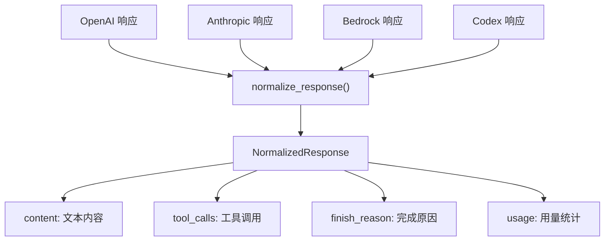
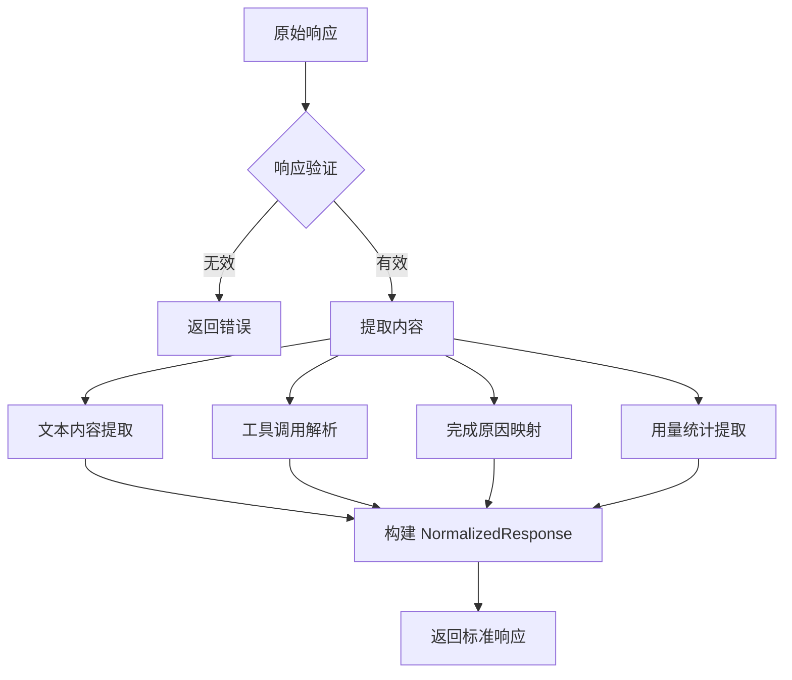

# 响应标准化处理

<cite>
**本文引用的文件**
- [agent/transports/base.py](file://agent/transports/base.py)
- [agent/transports/types.py](file://agent/transports/types.py)
- [agent/transports/chat_completions.py](file://agent/transports/chat_completions.py)
- [agent/transports/anthropic.py](file://agent/transports/anthropic.py)
- [agent/transports/bedrock.py](file://agent/transports/bedrock.py)
</cite>

## 目录
1. [简介](#简介)
2. [项目结构](#项目结构)
3. [核心组件](#核心组件)
4. [架构总览](#架构总览)
5. [详细组件分析](#详细组件分析)
6. [依赖关系分析](#依赖关系分析)
7. [性能考量](#性能考量)
8. [故障排查指南](#故障排查指南)
9. [结论](#结论)

## 简介
本文详细阐述 Sparkii Agent 的响应标准化处理机制，即将不同 LLM 提供商的原始响应统一转换为 NormalizedResponse 标准格式的核心技术。由于不同提供商（OpenAI、Anthropic、Bedrock、Codex 等）的响应格式各异，标准化处理是系统多提供商支持的关键。

标准化机制涵盖文本内容提取、工具调用解析、流式响应处理、完成原因映射和性能指标收集。

## 项目结构
响应标准化涉及传输层的所有提供商实现：
- `agent/transports/base.py`：基类定义 normalize_response 接口
- `agent/transports/types.py`：NormalizedResponse 数据类定义
- `agent/transports/chat_completions.py`：OpenAI 格式标准化
- `agent/transports/anthropic.py`：Anthropic 格式标准化
- `agent/transports/bedrock.py`：AWS Bedrock 格式标准化
- `agent/transports/codex.py`：Codex 格式标准化

## 核心组件
- **NormalizedResponse**（types.py:90）：标准化响应数据类，包含 content、tool_calls、finish_reason、reasoning、usage、provider_data 字段。
- **normalize_response 基类方法**（base.py:60）：定义标准化接口，各提供商实现具体转换逻辑。
- **Chat Completions 标准化**（chat_completions.py:749）：处理 OpenAI 格式的响应。
- **Anthropic 标准化**（anthropic.py:80）：处理 Anthropic Claude 格式的响应。
- **Bedrock 标准化**（bedrock.py:67）：处理 AWS Bedrock 格式的响应。
- **Codex 标准化**（codex.py:543）：处理 Codex 格式的响应。

## 架构总览

## 详细组件分析
### 文本内容提取
- OpenAI：从 choices[0].message.content 提取。
- Anthropic：从 content 数组中提取 text 类型的块。
- Bedrock：从 output.message.content 提取。
- 各提供商的文本格式差异通过统一接口屏蔽。

### 工具调用解析
- OpenAI：解析 tool_calls 数组，提取 function name 和 arguments。
- Anthropic：解析 content 中的 tool_use 块。
- 工具调用参数统一为 JSON 字符串格式。

### 完成原因映射
- 各提供商的 stop reason 统一映射为：stop、tool_calls、length、content_filter。
- 未知原因映射为 unknown，并记录原始值。

### 流式响应处理
- 流式模式下，每个 chunk 独立标准化。
- 增量内容通过 content_delta 字段传递。
- 工具调用通过 tool_calls_delta 字段增量更新。

### 提供商特定扩展
- reasoning_content：推理内容（如 o1 模型的思维链）。
- anthropic_content_blocks：Anthropic 特有的内容块格式。
- codex_reasoning_items：Codex 的推理项格式。

## 依赖关系分析
- **基类定义**：`agent/transports/base.py` — normalize_response 接口
- **类型定义**：`agent/transports/types.py` — NormalizedResponse
- **OpenAI**：`agent/transports/chat_completions.py` — Chat Completions 格式
- **Anthropic**：`agent/transports/anthropic.py` — Claude 格式
- **Bedrock**：`agent/transports/bedrock.py` — AWS 格式
- **Codex**：`agent/transports/codex.py` — Codex 格式

## 性能考量
- 标准化处理是零拷贝的，不创建额外的字符串副本。
- 流式模式下，每个 chunk 的标准化开销极小。
- 工具调用参数的 JSON 解析使用惰性方式，只在需要时解析。
- 用量统计的提取使用轻量级的字段访问。

## 故障排查指南
- **响应格式异常**：检查提供商 API 版本是否与适配器匹配。
- **工具调用解析失败**：确认工具调用参数是有效的 JSON。
- **完成原因未知**：查看原始响应的 stop_reason 字段。
- **流式 chunk 丢失**：检查网络连接和 SSE 事件完整性。

## 结论
响应标准化处理是 Sparkii Agent 多提供商支持的基石。通过统一的 NormalizedResponse 格式，上层逻辑无需关心具体提供商的实现细节，实现了真正的提供商无关架构。

