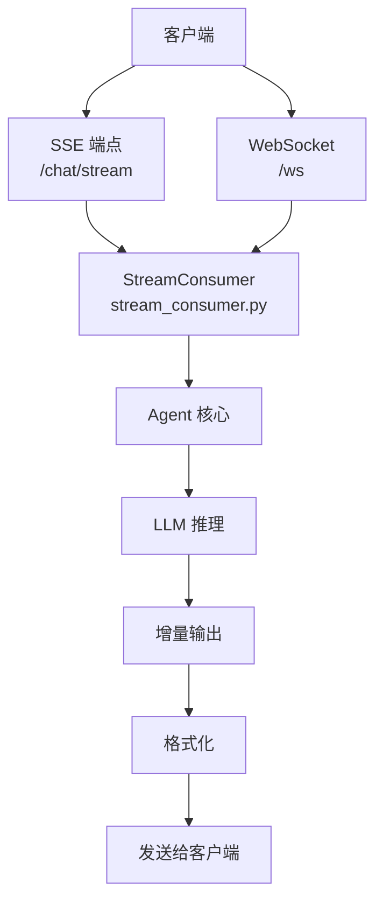
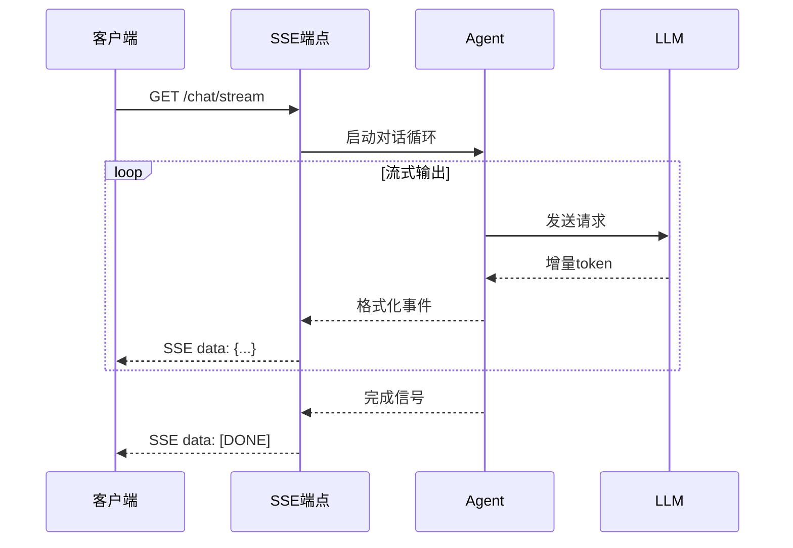

# 流式响应

<cite>
**本文引用的文件**
- [agent/transports/chat_completions.py](file://agent/transports/chat_completions.py)
- [gateway/stream_consumer.py](file://gateway/stream_consumer.py)
- [gateway/platforms/api_server.py](file://gateway/platforms/api_server.py)
- [sparkii_cli/web_routers/sessions.py](file://sparkii_cli/web_routers/sessions.py)
</cite>

## 目录
1. [简介](#简介)
2. [项目结构](#项目结构)
3. [核心组件](#核心组件)
4. [架构总览](#架构总览)
5. [详细组件分析](#详细组件分析)
6. [依赖关系分析](#依赖关系分析)
7. [性能考量](#性能考量)
8. [故障排查指南](#故障排查指南)
9. [结论](#结论)

## 简介
本文详细阐述 Sparkii Agent 的流式响应功能，即通过 SSE（Server-Sent Events）和 WebSocket 实现实时增量输出的技术实现。流式响应是提升用户体验的关键特性——用户无需等待完整响应，即可实时看到 Agent 的推理过程、工具调用进度和文本输出。

系统支持多种流式传输协议，包括 HTTP SSE、WebSocket 和自定义流式端点，兼容不同客户端的接入方式。

## 项目结构
流式响应的实现涉及传输层和网关层：
- `agent/transports/chat_completions.py`：Chat Completions 格式的流式响应
- `gateway/stream_consumer.py`：流式消费者配置和管理
- `gateway/platforms/api_server.py`：流式端点处理器
- `sparkii_cli/web_routers/sessions.py`：CLI 流式会话

## 核心组件
- **StreamConsumerConfig**（stream_consumer.py:128）：流式消费者的配置管理，包括缓冲大小、超时设置等。
- **流式端点处理器**（_handle_session_chat_stream, api_server.py:3767）：处理 SSE 流式请求。
- **流式 TTS**（base.py:4514-4536）：流式文本转语音支持，包括 begin/write/finish/abort 四个阶段。
- **增量文本输出**：LLM 推理过程中的逐 token 输出。
- **工具调用进度**：工具执行过程中的状态更新。

## 架构总览

## 详细组件分析
### SSE 协议实现
- 使用 HTTP 长连接，Content-Type 为 text/event-stream。
- 每个事件以 `data:` 前缀开头，以空行分隔。
- 事件类型包括：text_delta、tool_call、tool_result、error、done。
- 支持事件 ID 和重连时间设置。

### WebSocket 协议实现
- 全双工通信，支持客户端和服务端同时发送消息。
- 消息格式为 JSON，包含 type 和 data 字段。
- 支持心跳机制保持连接活跃。

### 增量文本输出
- LLM 推理产生的每个 token 立即发送给客户端。
- 客户端可以实时渲染文本，提供打字机效果。
- 支持中断信号，客户端可以取消正在进行的推理。

### 工具调用进度
- 工具开始执行时发送 tool_call_start 事件。
- 工具执行过程中发送进度更新。
- 工具执行完成时发送 tool_call_end 事件和结果。

### 背压处理
- 当客户端处理速度跟不上发送速度时，自动降低发送频率。
- 使用缓冲区暂存待发送数据，防止内存溢出。
- 连接断开时自动清理资源。

## 依赖关系分析
- **传输层**：`agent/transports/chat_completions.py` — 流式响应格式化
- **流式消费者**：`gateway/stream_consumer.py` — 消费者配置
- **API 端点**：`gateway/platforms/api_server.py` — SSE/WebSocket 端点
- **CLI 路由**：`sparkii_cli/web_routers/sessions.py` — CLI 流式
- **流式 TTS**：`gateway/streaming_tts_consumer.py` — 语音流式

## 性能考量
- 流式输出使用异步生成器，不阻塞事件循环。
- 缓冲区大小可配置，平衡延迟和吞吐量。
- WebSocket 连接使用心跳检测，及时清理死连接。
- SSE 连接使用 TCP_NODELAY 减少传输延迟。
- 流式 TTS 使用分块处理，支持大文本的实时语音合成。

## 故障排查指南
- **连接中断**：检查网络稳定性，确认客户端支持自动重连。
- **输出延迟**：调整缓冲区大小，检查 LLM 响应时间。
- **内存溢出**：限制缓冲区最大大小，及时清理已发送数据。
- **协议不匹配**：确认客户端使用的协议与服务端一致。

## 结论
流式响应是 Sparkii Agent 提供实时交互体验的核心技术。通过 SSE 和 WebSocket 双协议支持，系统兼容各种客户端场景。开发者应根据具体需求选择合适的协议和配置参数。

