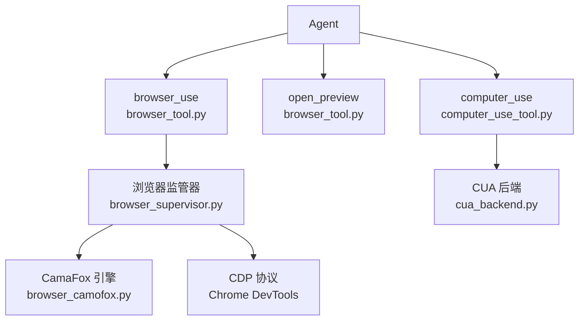
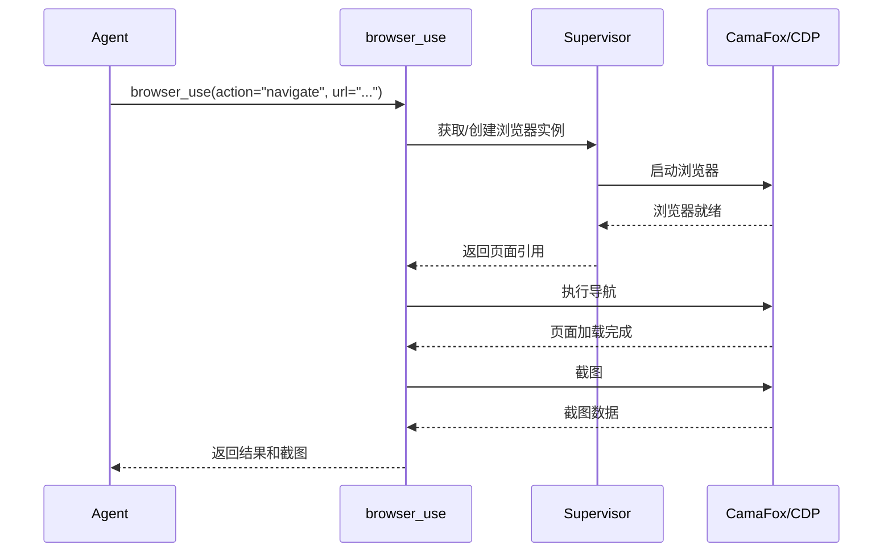

# 浏览器自动化工具

<cite>
**本文引用的文件**
- [tools/browser_tool.py](file://tools/browser_tool.py)
- [tools/browser_camofox.py](file://tools/browser_camofox.py)
- [tools/browser_supervisor.py](file://tools/browser_supervisor.py)
- [tools/computer_use_tool.py](file://tools/computer_use_tool.py)
- [tools/computer_use/schema.py](file://tools/computer_use/schema.py)
</cite>

## 目录
1. [简介](#简介)
2. [项目结构](#项目结构)
3. [核心组件](#核心组件)
4. [架构总览](#架构总览)
5. [详细组件分析](#详细组件分析)
6. [依赖关系分析](#依赖关系分析)
7. [性能考量](#性能考量)
8. [故障排查指南](#故障排查指南)
9. [结论](#结论)

## 简介
本文详细阐述 Sparkii Agent 的浏览器自动化工具集，即 browser_use、open_preview、computer_use 等工具的完整功能。浏览器自动化是 Agent 与 Web 交互的核心能力，支持页面导航、元素操作、截图捕获、表单填写等丰富的浏览器控制操作。

系统集成了 CamaFox 浏览器引擎和 CDP（Chrome DevTools Protocol）协议，提供跨平台的浏览器自动化能力。

## 项目结构
浏览器自动化工具的实现涉及多个模块：
- `tools/browser_tool.py`：主浏览器工具
- `tools/browser_camofox.py`：CamaFox 浏览器集成
- `tools/browser_supervisor.py`：浏览器实例管理
- `tools/computer_use_tool.py`：Computer Use 工具
- `tools/computer_use/schema.py`：Computer Use Schema 定义

## 核心组件
- **browser_use 工具**：核心浏览器操作工具，支持页面导航、元素点击、文本输入、截图等。
- **open_preview 工具**：打开本地文件或 URL 的预览窗口。
- **computer_use 工具**：计算机使用工具，支持屏幕截图、鼠标操作、键盘输入。
- **浏览器监管器**（browser_supervisor.py）：管理浏览器实例的生命周期，包括启动、监控和清理。
- **CamaFox 集成**（browser_camofox.py）：CamaFox 浏览器引擎的 Python 绑定。
- **CUA 后端**（cua_backend.py:1907）：Computer Use Agent 的驱动后端。

## 架构总览

## 详细组件分析
### browser_use 工具功能
- **页面导航**：打开 URL，等待页面加载完成。
- **元素操作**：点击按钮、填写表单、选择下拉菜单。
- **文本输入**：在输入框中键入文本，支持特殊键。
- **截图捕获**：捕获当前页面或指定区域的截图。
- **页面滚动**：上下左右滚动页面。
- **JavaScript 执行**：在页面上下文中执行 JavaScript 代码。

### CamaFox 浏览器集成
- 基于 Firefox 的自定义浏览器引擎。
- 支持 CDP 协议，兼容 Chrome DevTools 工具链。
- 内置反检测机制，适合网页抓取场景。
- 支持无头模式和有头模式切换。

### Computer Use 工具
- 屏幕截图：捕获整个屏幕或指定窗口。
- 鼠标操作：点击、双击、拖拽、移动。
- 键盘输入：键入文本、快捷键组合。
- 支持多显示器环境。

### 浏览器会话管理
- 每个浏览器实例关联一个会话 ID。
- 会话超时后自动清理资源。
- 支持多会话并行，每个会话独立的浏览器上下文。

## 依赖关系分析
- **浏览器工具**：`tools/browser_tool.py` — 主工具
- **CamaFox**：`tools/browser_camofox.py` — 浏览器引擎
- **监管器**：`tools/browser_supervisor.py` — 实例管理
- **Computer Use**：`tools/computer_use_tool.py` — 计算机操作
- **CUA 后端**：`tools/computer_use/cua_backend.py` — 驱动后端
- **Schema**：`tools/computer_use/schema.py` — 参数定义

## 性能考量
- 浏览器实例使用连接池管理，避免频繁启动/关闭。
- 截图使用 JPEG 压缩，减少数据传输量。
- 页面操作使用等待机制，确保元素就绪后再操作。
- Computer Use 截图使用增量更新，只传输变化区域。
- 浏览器资源在会话结束时自动清理。

## 故障排查指南
- **浏览器启动失败**：检查 CamaFox 或 Chrome 是否正确安装。
- **页面加载超时**：调整超时设置，检查网络连接。
- **元素未找到**：确认选择器正确，等待页面完全加载。
- **截图失败**：检查显示器配置和权限。
- **Computer Use 操作无效**：确认屏幕坐标正确，检查目标窗口。

## 结论
浏览器自动化工具是 Sparkii Agent 与 Web 交互的核心能力。通过 browser_use 和 computer_use 两种工具模式，Agent 可以完成从简单的网页浏览到复杂的 UI 自动化测试等各种任务。开发者应根据具体场景选择合适的工具和配置。

