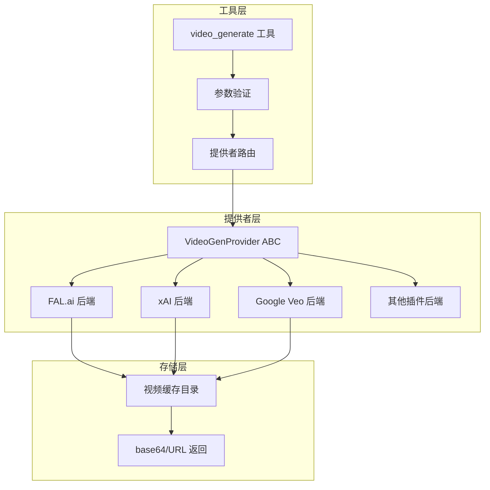
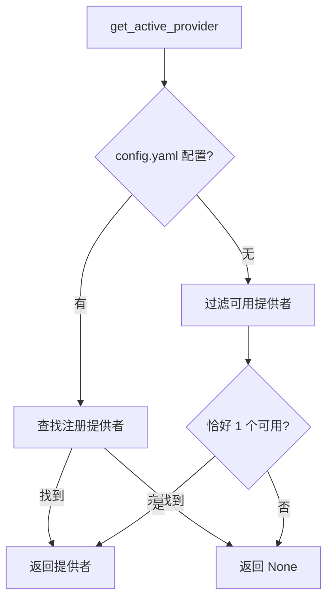

# 视频处理

## 概述

Sparkii Agent 的视频处理系统提供统一的视频生成接口，支持文本到视频（text-to-video）和图像到视频（image-to-video）两种模态。系统采用插件化架构，通过 `VideoGenProvider` 抽象基类定义后端接口，通过 `VideoGenRegistry` 管理提供者注册和选择。

## 架构总览



## 统一接口设计

`video_generate` 工具覆盖三种用例，通过参数组合路由：

| 模态 | 触发条件 | 说明 |
|------|----------|------|
| 文本到视频 | 仅 `prompt` | 从文本描述生成视频 |
| 图像到视频 | `prompt` + `image_url` | 将静态图像动画化 |
| 参考图到视频 | `prompt` + `reference_image_urls` | 使用参考图指导生成 |

### 工具 Schema

```python
VIDEO_GENERATE_SCHEMA = {
    "name": "video_generate",
    "parameters": {
        "type": "object",
        "properties": {
            "prompt": {"type": "string", "description": "视频描述文本"},
            "image_url": {"type": "string", "description": "静态图像 URL（驱动图像到视频）"},
            "reference_image_urls": {
                "type": "array", "items": {"type": "string"},
                "description": "参考图像 URL 列表"
            },
            "duration": {"type": "integer", "description": "视频时长（秒）"},
            "aspect_ratio": {"type": "string", "enum": ["16:9","9:16","1:1","4:3","3:4","3:2","2:3"]},
            "resolution": {"type": "string", "enum": ["480p","540p","720p","1080p"]},
            "negative_prompt": {"type": "string", "description": "负面提示词"},
            "audio": {"type": "boolean", "description": "是否生成音频"},
            "seed": {"type": "integer", "description": "随机种子"},
            "model": {"type": "string", "description": "覆盖默认模型"},
        },
        "required": ["prompt"],
    },
}
```

## VideoGenProvider 抽象基类

所有视频生成后端必须继承 `VideoGenProvider` ABC（`agent/video_gen_provider.py`）：

```python
class VideoGenProvider(abc.ABC):
    @property
    @abc.abstractmethod
    def name(self) -> str:
        """稳定短标识符，如 'xai', 'fal', 'google'"""

    def is_available(self) -> bool:
        """检查此提供者是否可服务调用（默认 True）"""

    def list_models(self) -> List[Dict[str, Any]]:
        """返回模型目录，用于 sparkii tools 选择器"""

    def capabilities(self) -> Dict[str, Any]:
        """返回支持的能力（模态、宽高比、分辨率、时长范围等）"""

    @abc.abstractmethod
    def generate(self, prompt, *, model=None, image_url=None,
                 duration=None, aspect_ratio="16:9", resolution="720p",
                 negative_prompt=None, audio=None, seed=None, **kwargs):
        """生成视频的核心方法"""
```

### 通用配置

```python
# agent/video_gen_provider.py
COMMON_ASPECT_RATIOS = ("16:9", "9:16", "1:1", "4:3", "3:4", "3:2", "2:3")
DEFAULT_ASPECT_RATIO = "16:9"
COMMON_RESOLUTIONS = ("480p", "540p", "720p", "1080p")
DEFAULT_RESOLUTION = "720p"
```

### 响应格式

所有提供者返回统一的响应字典：

```python
# 成功响应
{
    "success": True,
    "video": "https://... 或 /path/to/video.mp4",
    "model": "veo-3.1",
    "prompt": "用户输入的提示词",
    "modality": "text",          # "text" 或 "image"
    "aspect_ratio": "16:9",
    "duration": 5,
    "provider": "google",
}

# 错误响应
{
    "success": False,
    "error": "错误描述",
    "error_type": "provider_error",
    "provider": "google",
}
```

## 提供者注册表

`VideoGenRegistry`（`agent/video_gen_registry.py`）管理提供者的注册和选择：

### 注册流程

```python
# 插件在导入时注册提供者
from agent.video_gen_registry import register_provider

register_provider(MyVideoGenProvider())
```

### 活动提供者选择

`get_active_provider()` 的选择逻辑：

1. 读取 `config.yaml` 中 `video_gen.provider` 配置
2. 如果配置了提供者名称，直接查找并返回
3. 如果未配置，回退逻辑：恰好一个 *可用* 提供者时自动选择
4. 否则返回 `None`（工具层报错提示用户通过 `sparkii tools` 配置）



## 视频缓存管理

生成的视频文件缓存在 `$SPARKII_HOME/cache/videos/` 目录下：

```python
# agent/video_gen_provider.py
def save_b64_video(b64_data, prefix="video", extension="mp4") -> Path:
    """解码 base64 视频数据并保存到缓存目录"""
    raw = base64.b64decode(b64_data)
    ts = datetime.datetime.now().strftime("%Y%m%d_%H%M%S")
    short = uuid.uuid4().hex[:8]
    path = _videos_cache_dir() / f"{prefix}_{ts}_{short}.{extension}"
    path.write_bytes(raw)
    return path

def save_bytes_video(raw, prefix="video", extension="mp4") -> Path:
    """保存原始视频字节（如 HTTP 下载响应）"""
```

文件命名格式：`<prefix>_<YYYYMMDD_HHMMSS>_<short-uuid>.<ext>`

## 动态 Schema 生成

工具层在运行时根据活动后端的实际能力动态重建 schema：

```python
# tools/video_generation_tool.py
def _build_dynamic_video_schema() -> dict:
    """根据活动提供者的能力动态构建工具 schema"""
    provider = get_active_provider()
    if provider is None:
        return VIDEO_GENERATE_SCHEMA  # 返回默认 schema
    
    caps = provider.capabilities()
    # 根据 caps 调整 enum、description 等
    ...
```

这确保了 `sparkii tools` 显示的能力与后端实际支持的能力一致。

## 提供者插件开发

### 插件目录结构

```
plugins/video_gen/<name>/
    __init__.py          # 导入时注册提供者
    provider.py          # VideoGenProvider 子类实现
    README.md            # 插件文档
```

### 启用插件

```bash
# 启用视频生成插件
sparkii plugins enable video_gen/<name>

# 在 sparkii tools 中选择提供者
sparkii tools  # -> Video Generation -> 选择提供者
```

## 设计决策

1. **不暴露视频编辑/扩展**：各后端的编辑 API 差异过大，无法统一为一个工具。如有需要，可作为独立工具发布。
2. **后端无关的工具层**：工具层只做轻量验证（类型/必需参数），具体参数裁剪由每个提供者在 `generate()` 内部完成。
3. **镜像 image_gen 设计**：视频生成的设计与图像生成保持一致，降低学习成本。

## 源文件参考

| 文件 | 职责 |
|------|------|
| `tools/video_generation_tool.py` | video_generate 工具实现（606 行） |
| `agent/video_gen_provider.py` | VideoGenProvider ABC 和辅助函数（597 行） |
| `agent/video_gen_registry.py` | 提供者注册表（134 行） |
