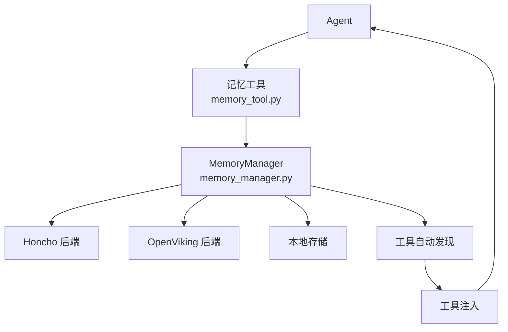
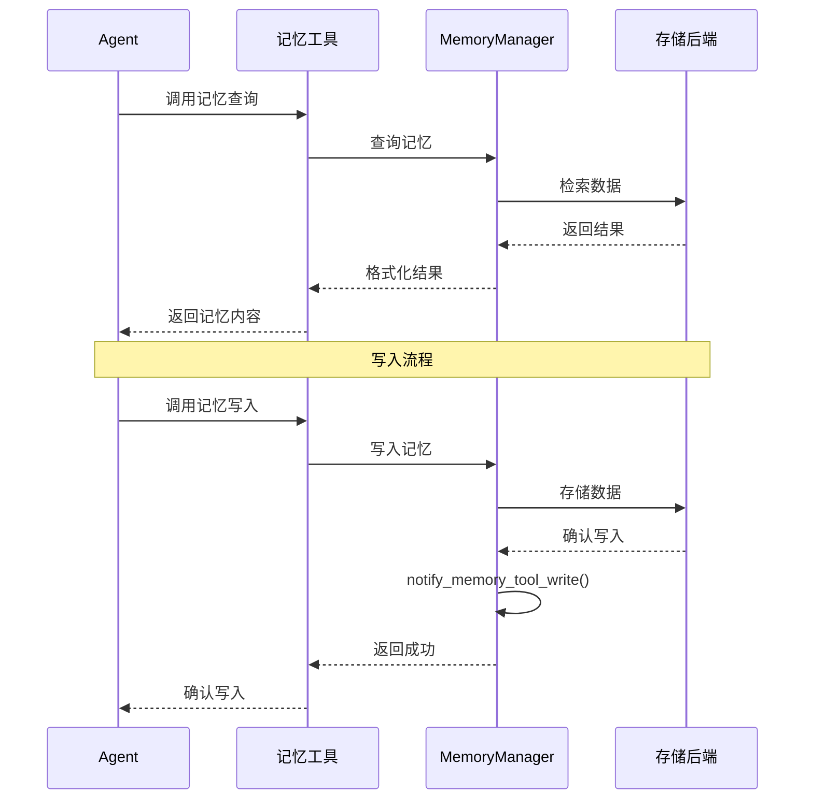

# 记忆工具API

<cite>
**本文引用的文件**
- [agent/memory_manager.py](file://agent/memory_manager.py)
- [tools/memory_tool.py](file://tools/memory_tool.py)
</cite>

## 目录
1. [简介](#简介)
2. [项目结构](#项目结构)
3. [核心组件](#核心组件)
4. [架构总览](#架构总览)
5. [详细组件分析](#详细组件分析)
6. [依赖关系分析](#依赖关系分析)
7. [性能考量](#性能考量)
8. [故障排查指南](#故障排查指南)
9. [结论](#结论)

## 简介
本文详细阐述 Sparkii Agent 的记忆工具 API，即记忆管理器（MemoryManager）对外暴露的工具接口。记忆工具允许 Agent 进行长期记忆的查询、写入和管理，支持多后端存储（Honcho、OpenViking 等）和自动工具发现注册机制。

记忆系统是 Agent 实现个性化和上下文保持的关键组件，通过工具化的接口设计，Agent 可以像调用其他工具一样操作记忆。

## 项目结构
记忆工具 API 的实现涉及两个核心模块：
- `agent/memory_manager.py`：记忆管理器，提供记忆生命周期管理
- `tools/memory_tool.py`：记忆工具，封装为标准工具接口

## 核心组件
- **MemoryManager**（memory_manager.py:364）：记忆管理器单例，管理记忆提供者的生命周期。
- **记忆工具注入**（inject_memory_provider_tools, memory_manager.py:110）：自动将记忆工具注入 Agent。
- **工具可用性检查**（memory_provider_tools_enabled, memory_manager.py:83）：检查记忆提供者是否可用。
- **记忆工具结果检查**（_memory_tool_result_succeeded, memory_manager.py:1056）：验证工具执行结果。
- **写入通知**（notify_memory_tool_write, memory_manager.py:1073）：记忆写入后的通知机制。
- **Schema 标准化**（normalize_tool_schema）：处理工具 schema 的双层包装问题。

## 架构总览

## 详细组件分析
### 可用的记忆操作工具
- **记忆查询**：根据关键词或语义搜索历史记忆，返回匹配的记忆条目。
- **记忆写入**：将新的信息存储到记忆系统，支持分类和标签。
- **记忆删除**：删除指定的记忆条目，支持批量删除。
- **记忆列表**：列出所有记忆条目，支持分页和过滤。

### 工具自动发现和注册
- MemoryManager 在初始化时扫描所有已注册的记忆提供者。
- 每个提供者暴露的工具通过 normalize_tool_schema 标准化后注入 Agent。
- 工具注入使用惰性方式，只在 Agent 首次需要时注入。

### Schema 标准化
- 某些记忆提供者的工具 schema 存在双层包装问题。
- normalize_tool_schema 函数自动检测并修复这种问题。
- 确保所有记忆工具的 schema 格式一致。

### 安全限制
- 记忆操作受权限控制，某些操作需要用户确认。
- 敏感记忆条目支持加密存储。
- 记忆查询结果经过脱敏处理。

## 依赖关系分析
- **记忆管理器**：`agent/memory_manager.py` — 核心管理逻辑
- **记忆工具**：`tools/memory_tool.py` — 工具接口
- **Honcho 后端**：`plugins/memory/honcho/` — 云端存储
- **OpenViking 后端**：`plugins/memory/openviking/` — 本地存储

## 性能考量
- 记忆查询使用索引加速，避免全表扫描。
- 记忆写入使用批量操作，减少网络往返。
- 记忆管理器是单例模式，避免重复初始化。
- 工具注入使用缓存，避免重复 schema 处理。
- 预取机制（prefetch_all）在 Agent 启动时预加载常用记忆。

## 故障排查指南
- **记忆工具不可用**：检查记忆提供者是否正确配置和初始化。
- **查询无结果**：确认记忆已正确写入，检查搜索关键词。
- **写入失败**：检查存储后端连接和权限。
- **Schema 注入失败**：运行 normalize_tool_schema 检查问题。
- **同步问题**：调用 sync_all() 强制同步记忆状态。

## 结论
记忆工具 API 通过标准化的工具接口将记忆管理能力无缝集成到 Agent 的工具生态中。自动发现和注册机制使得添加新的记忆后端变得简单，而 Schema 标准化确保了工具接口的一致性。

