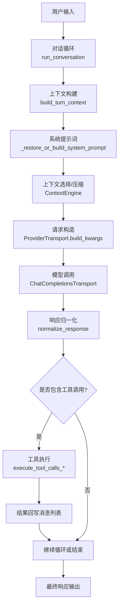
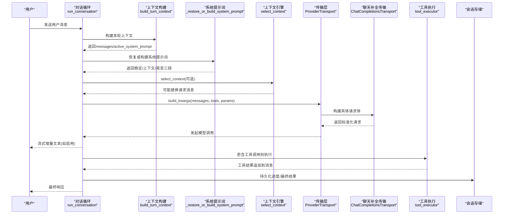
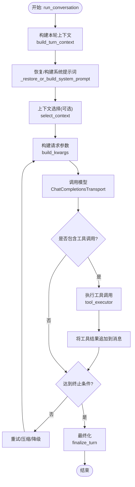
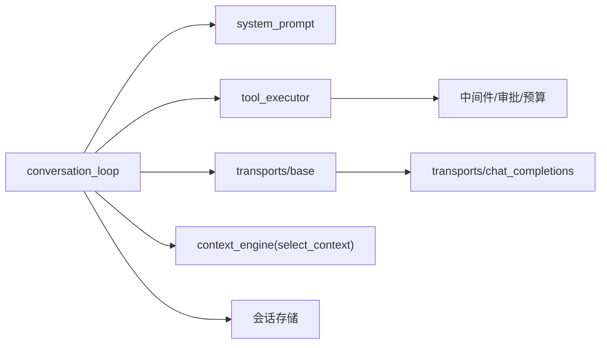

# AI代理工作原理

<cite>
**本文引用的文件**
- [conversation_loop.py](file://agent/conversation_loop.py)
- [system_prompt.py](file://agent/system_prompt.py)
- [tool_executor.py](file://agent/tool_executor.py)
- [transports/base.py](file://agent/transports/base.py)
- [transports/chat_completions.py](file://agent/transports/chat_completions.py)
</cite>

## 目录
1. [简介](#简介)
2. [项目结构](#项目结构)
3. [核心组件](#核心组件)
4. [架构总览](#架构总览)
5. [详细组件分析](#详细组件分析)
6. [依赖关系分析](#依赖关系分析)
7. [性能考量](#性能考量)
8. [故障排查指南](#故障排查指南)
9. [结论](#结论)
10. [附录](#附录)

## 简介
本文件面向Sparkii Agent的AI代理工作原理，聚焦对话循环的核心机制：会话生命周期管理、消息处理流程、工具调用协调与错误恢复策略。重点解释run_conversation函数从用户输入到最终响应的完整链路，包括上下文构建、系统提示词管理、流式响应处理与中断机制，并说明代理如何与不同AI模型提供商交互以及异常处理路径。文档同时提供初学者友好的概念说明与高级实现细节。

## 项目结构
围绕对话循环的关键模块组织如下：
- 对话循环与主控制流：conversation_loop.py
- 系统提示词组装与缓存：system_prompt.py
- 工具调用执行（串行/并发）：tool_executor.py
- 模型传输抽象与具体实现：transports/base.py、transports/chat_completions.py

图表来源
- [conversation_loop.py:1371-1599](file://agent/conversation_loop.py#L1371-L1599)
- [system_prompt.py:152-595](file://agent/system_prompt.py#L152-L595)
- [transports/base.py:16-90](file://agent/transports/base.py#L16-L90)
- [transports/chat_completions.py:207-597](file://agent/transports/chat_completions.py#L207-L597)
- [tool_executor.py:758-800](file://agent/tool_executor.py#L758-L800)

章节来源
- [conversation_loop.py:1371-1599](file://agent/conversation_loop.py#L1371-L1599)
- [system_prompt.py:152-595](file://agent/system_prompt.py#L152-L595)
- [transports/base.py:16-90](file://agent/transports/base.py#L16-L90)
- [transports/chat_completions.py:207-597](file://agent/transports/chat_completions.py#L207-L597)
- [tool_executor.py:758-800](file://agent/tool_executor.py#L758-L800)

## 核心组件
- 对话循环（run_conversation）
  - 负责单轮用户请求的完整编排：预处理、上下文构建、系统提示词恢复/构建、预检压缩、插件钩子、外部记忆预取、重试与降级、工具调用、流式输出、终态收尾。
  - 关键状态：api_call_count、iteration_budget、compression_attempts、interrupted、failed等。
- 系统提示词（system_prompt）
  - 三层结构：stable（身份/行为指导）、context（工作区快照/上下文文件）、volatile（技能索引/记忆/时间戳）。
  - 支持按会话持久化与重建，保证前缀缓存命中。
- 工具执行（tool_executor）
  - 支持并发执行工具调用，具备授权门控、预算限制、中断处理、结果持久化与回调。
- 传输层（transports）
  - 抽象接口ProviderTransport定义消息/工具转换、参数构建、响应归一化。
  - ChatCompletionsTransport适配OpenAI兼容API，处理多提供商差异、推理配置、缓存键注入等。

章节来源
- [conversation_loop.py:1371-1599](file://agent/conversation_loop.py#L1371-L1599)
- [system_prompt.py:152-595](file://agent/system_prompt.py#L152-L595)
- [tool_executor.py:758-800](file://agent/tool_executor.py#L758-L800)
- [transports/base.py:16-90](file://agent/transports/base.py#L16-L90)
- [transports/chat_completions.py:207-597](file://agent/transports/chat_completions.py#L207-L597)

## 架构总览
下图展示一次用户请求在代理中的端到端流转：从输入到模型调用、工具执行、再到最终响应。

图表来源
- [conversation_loop.py:1371-1599](file://agent/conversation_loop.py#L1371-L1599)
- [system_prompt.py:152-595](file://agent/system_prompt.py#L152-L595)
- [transports/base.py:16-90](file://agent/transports/base.py#L16-L90)
- [transports/chat_completions.py:207-597](file://agent/transports/chat_completions.py#L207-L597)
- [tool_executor.py:758-800](file://agent/tool_executor.py#L758-L800)

## 详细组件分析

### 对话循环 run_conversation
- 入口职责
  - 解析MoA配置、刷新凭据、建立每轮状态（计数器、预算、压缩尝试次数、中断标志等）。
  - 调用build_turn_context完成stdio保护、用户消息清洗、系统提示词恢复/构建、预检压缩、插件钩子、外部记忆预取等一次性准备。
  - 主循环：检查中断、消费迭代预算、触发step_callback、构建请求、调用模型、处理响应、工具执行、压缩与重试、最终化。
- 上下文构建
  - 通过build_turn_context聚合user_message、conversation_history、active_system_prompt、effective_task_id、turn_id等，供后续步骤使用。
- 系统提示词管理
  - _restore_or_build_system_prompt优先从会话数据库恢复已缓存的系统提示词；若缺失或不匹配运行时环境则重建，并写入数据库。
  - 重建时触发on_session_start钩子与冷启动积分种子。
- 上下文选择与压缩
  - 通过ContextEngine.select_context进行每轮上下文选择/路由；失败时回退为原始请求。
  - 压缩尝试受max_compression_attempts限制，并在锁竞争时延迟而非视为耗尽。
- 模型调用与重试
  - 通过ProviderTransport.build_kwargs构建请求；对OpenAI兼容模式由ChatCompletionsTransport处理。
  - 支持prompt_cache_key注入、推理配置、温度、extra_body拼装等。
  - 错误分类与重试：内容策略拦截、配额耗尽、网络超时、本地处理错误等分支分别处理。
- 工具调用协调
  - 若助手消息包含工具调用，进入tool_executor执行（并发/串行），结果追加到消息列表，必要时触发验证门控与最终化。
- 流式响应与中断
  - 支持stream_callback推送增量文本；中断发生时记录状态并安全退出工具循环。
- 最终化
  - finalize_turn统一收尾：持久化、统计、通知上下文引擎on_turn_complete等。

图表来源
- [conversation_loop.py:1371-1599](file://agent/conversation_loop.py#L1371-L1599)
- [system_prompt.py:152-595](file://agent/system_prompt.py#L152-L595)
- [transports/chat_completions.py:207-597](file://agent/transports/chat_completions.py#L207-L597)
- [tool_executor.py:758-800](file://agent/tool_executor.py#L758-L800)

章节来源
- [conversation_loop.py:1371-1599](file://agent/conversation_loop.py#L1371-L1599)
- [system_prompt.py:152-595](file://agent/system_prompt.py#L152-L595)
- [transports/chat_completions.py:207-597](file://agent/transports/chat_completions.py#L207-L597)
- [tool_executor.py:758-800](file://agent/tool_executor.py#L758-L800)

### 系统提示词管理
- 三层结构
  - stable：身份、任务完成指导、并行工具调用指导、工具使用强制、平台与环境提示、编码指导等。
  - context：工作区快照、上下文文件（AGENTS.md/.cursorrules等）、调用方system_message。
  - volatile：技能索引、记忆快照、USER.md、外部记忆块、日期/会话/模型/提供者行。
- 缓存与重建
  - 首次构建后缓存于agent._cached_system_prompt；会话恢复或压缩后按需重建。
  - reconstruct_static_prefix用于恢复静态前缀以维持前缀缓存命中。
- 平台与特性注入
  - 根据平台key应用默认或覆盖提示；Telegram富消息、TUI嵌入式终端面板澄清等。
  - 针对特定模型族（Google/OpenAI/xAI）注入操作指导。

章节来源
- [system_prompt.py:152-595](file://agent/system_prompt.py#L152-L595)

### 工具调用协调
- 并发执行
  - execute_tool_calls_concurrent使用线程池并发执行工具，维护顺序与预算。
  - 授权门控序列化审批提示，避免交错；排除人类等待时间计入批处理截止时间。
- 中断与取消
  - 检测到中断时跳过剩余工具调用，生成取消结果并记录事件。
- 结果持久化
  - 在执行前后进行增量持久化，确保破坏性但合法的工具调用可被恢复。
- 中间件与钩子
  - 通过_run_agent_tool_execution_middleware串联请求中间件、执行中间件、前置阻断、护栏决策等。

章节来源
- [tool_executor.py:758-800](file://agent/tool_executor.py#L758-L800)

### 模型传输与提供商交互
- 抽象接口
  - ProviderTransport定义convert_messages、convert_tools、build_kwargs、normalize_response等。
- OpenAI兼容传输
  - ChatCompletionsTransport处理消息清理（去除内部字段、Gemini thought_signature等）、工具定义、推理配置、温度、extra_body、prompt_cache_key注入。
  - 支持provider_profile路径统一构建参数，兼容多提供商差异。
- 响应归一化
  - normalize_response将不同提供商响应转换为统一的NormalizedResponse，保留provider_data（如extra_content）以便后续回放。

章节来源
- [transports/base.py:16-90](file://agent/transports/base.py#L16-L90)
- [transports/chat_completions.py:207-597](file://agent/transports/chat_completions.py#L207-L597)

## 依赖关系分析
- 模块耦合
  - conversation_loop依赖system_prompt、tool_executor、transports与上下文引擎。
  - system_prompt依赖运行时环境与插件钩子，产出稳定的提示词字符串。
  - tool_executor依赖中间件、审批、预算与持久化。
  - transports抽象解耦具体提供商实现，便于扩展新模型后端。
- 外部依赖
  - 各提供商SDK/HTTP客户端通过transport层封装。
  - 会话数据库用于系统提示词与消息持久化。

图表来源
- [conversation_loop.py:1371-1599](file://agent/conversation_loop.py#L1371-L1599)
- [system_prompt.py:152-595](file://agent/system_prompt.py#L152-L595)
- [tool_executor.py:758-800](file://agent/tool_executor.py#L758-L800)
- [transports/base.py:16-90](file://agent/transports/base.py#L16-L90)
- [transports/chat_completions.py:207-597](file://agent/transports/chat_completions.py#L207-L597)

章节来源
- [conversation_loop.py:1371-1599](file://agent/conversation_loop.py#L1371-L1599)
- [system_prompt.py:152-595](file://agent/system_prompt.py#L152-L595)
- [tool_executor.py:758-800](file://agent/tool_executor.py#L758-L800)
- [transports/base.py:16-90](file://agent/transports/base.py#L16-L90)
- [transports/chat_completions.py:207-597](file://agent/transports/chat_completions.py#L207-L597)

## 性能考量
- 系统提示词前缀缓存
  - 通过stable/context/volatile分层与静态前缀重建，最大化跨轮次缓存命中。
- 上下文选择与压缩
  - 每轮可选select_context优化请求大小；压缩失败时延迟而非立即耗尽，避免误杀健康会话。
- 工具执行并发
  - 并发执行减少往返次数；图像生成等慢操作有独立并发上限，避免后端突发限流。
- 请求参数优化
  - prompt_cache_key注入、推理配置最小化、温度与max_tokens优先级明确，减少无效开销。
- 内存与拷贝
  - 消息克隆采用浅拷贝共享不可变对象，降低大负载成本；工具调用参数规范化带FIFO缓存与字节预算。

[本节提供通用指导，不直接分析具体文件]

## 故障排查指南
- 内容策略拦截
  - 当模型返回content_filter或提供商审核错误时，统一走_content_policy_blocked_result，不再重试。
- 配额与计费问题
  - 针对Anthropic订阅耗尽、Nous付费能力、通用提供商余额不足，给出可操作指引与链接。
- 凭据过期/降级
  - Copilot 400识别为凭据失效场景，触发单次重新交换；其他提供商凭据池自动刷新计数限制防止死循环。
- 上下文过小（Ollama）
  - 检测runtime context太小导致工具使用不可靠，提示调整num_ctx。
- 压缩锁竞争
  - 若压缩锁被其他路径持有，本轮软延迟而非标记为耗尽，避免误删会话。
- 工具执行中断
  - 用户中断时跳过剩余工具调用，生成取消结果并记录事件；增量持久化保障可恢复性。

章节来源
- [conversation_loop.py:800-1599](file://agent/conversation_loop.py#L800-L1599)
- [tool_executor.py:758-800](file://agent/tool_executor.py#L758-L800)

## 结论
Sparkii Agent的对话循环以run_conversation为核心，结合系统提示词分层缓存、上下文选择与压缩、传输层抽象与提供商适配、工具执行并发与中断处理，形成稳健且高性能的AI代理工作流。通过细粒度的错误分类与降级策略，系统在多种异常场景下仍能保持可用性与可恢复性。对于初学者，建议从对话循环与系统提示词入手理解整体流程；对于高级用户，可深入传输层与工具执行中间件以实现定制化扩展。

[本节总结性内容，不直接分析具体文件]

## 附录
- 关键函数与路径参考
  - 对话循环入口：[conversation_loop.py:1371-1599](file://agent/conversation_loop.py#L1371-L1599)
  - 系统提示词构建：[system_prompt.py:152-595](file://agent/system_prompt.py#L152-L595)
  - 工具执行并发：[tool_executor.py:758-800](file://agent/tool_executor.py#L758-L800)
  - 传输抽象接口：[transports/base.py:16-90](file://agent/transports/base.py#L16-L90)
  - OpenAI兼容传输：[transports/chat_completions.py:207-597](file://agent/transports/chat_completions.py#L207-L597)

[本节为参考索引，不直接分析具体文件]