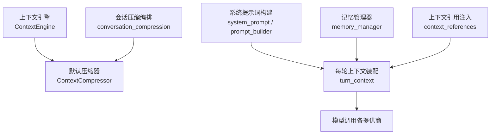
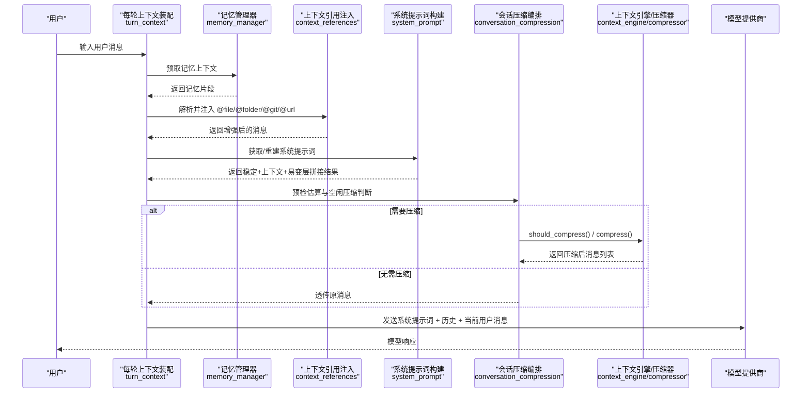
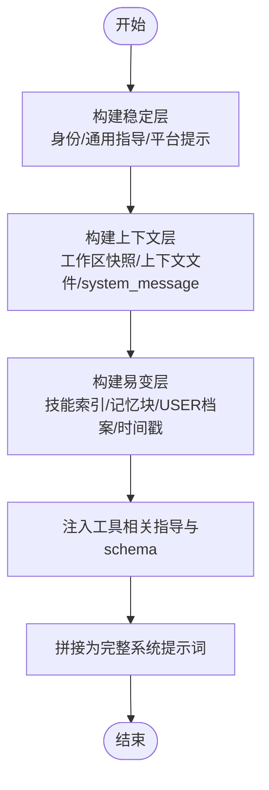
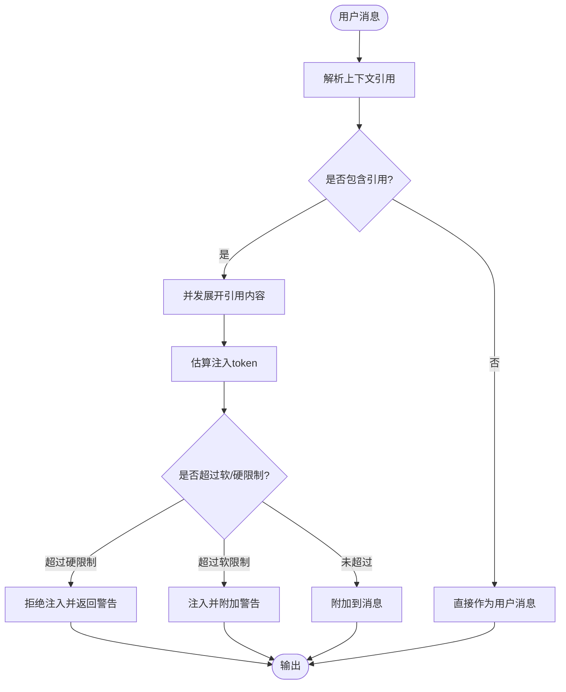
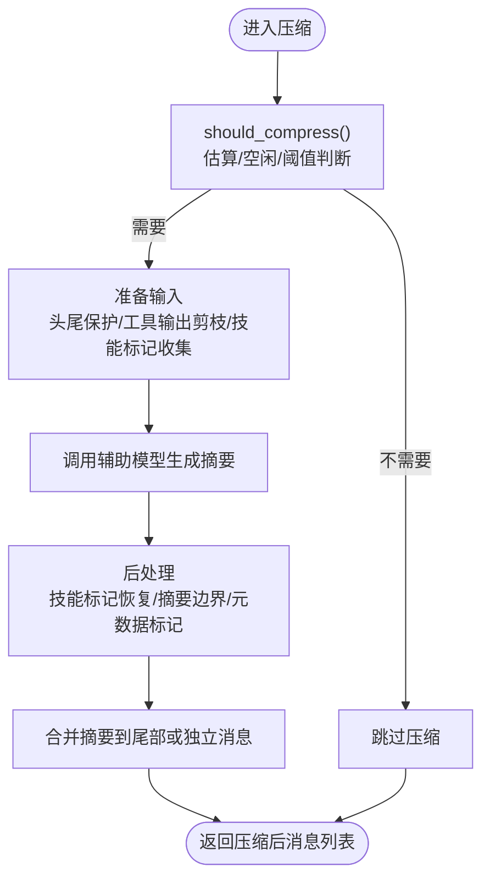
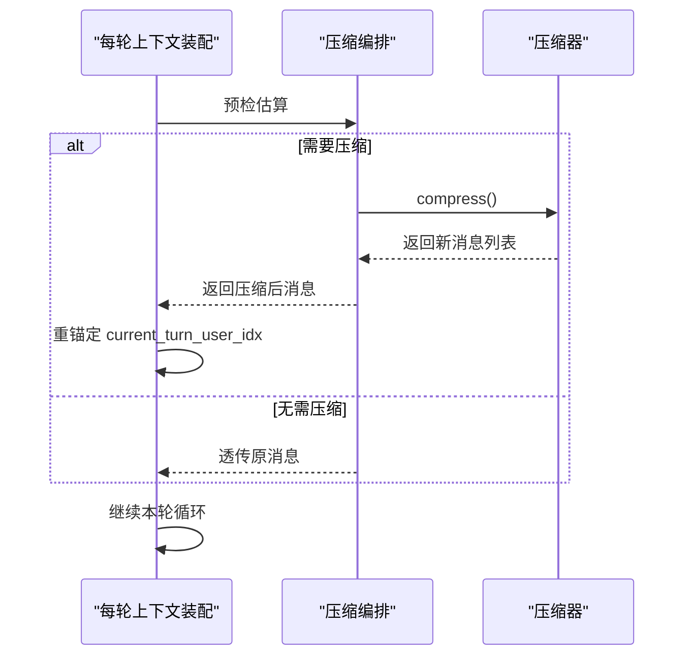
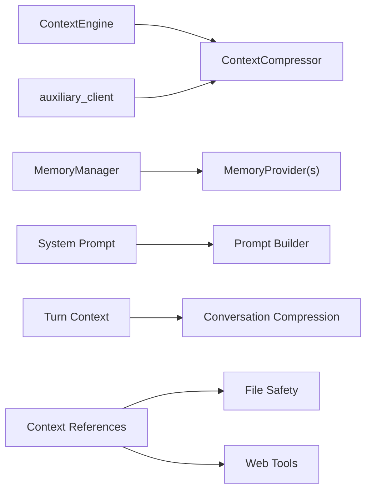

# 上下文管理机制

<cite>
**本文引用的文件**
- [agent/context_compressor.py](file://agent/context_compressor.py)
- [agent/context_engine.py](file://agent/context_engine.py)
- [agent/system_prompt.py](file://agent/system_prompt.py)
- [agent/prompt_builder.py](file://agent/prompt_builder.py)
- [agent/conversation_compression.py](file://agent/conversation_compression.py)
- [agent/turn_context.py](file://agent/turn_context.py)
- [agent/memory_manager.py](file://agent/memory_manager.py)
- [agent/context_references.py](file://agent/context_references.py)
</cite>

## 目录
1. [简介](#简介)
2. [项目结构](#项目结构)
3. [核心组件](#核心组件)
4. [架构总览](#架构总览)
5. [详细组件分析](#详细组件分析)
6. [依赖关系分析](#依赖关系分析)
7. [性能考虑](#性能考虑)
8. [故障排查指南](#故障排查指南)
9. [结论](#结论)
10. [附录](#附录)

## 简介
本文件系统性阐述 Hermes Agent 的上下文管理机制，覆盖从系统提示词构建、用户消息处理、工具定义注入，到上下文压缩算法、窗口管理、内存优化与性能调优策略。同时说明多轮对话中的上下文继承与状态维护机制，并给出与不同模型提供商适配的策略建议。文档兼顾初学者概念理解与高级实现细节，帮助读者在工程实践中高效使用与扩展上下文能力。

## 项目结构
Hermes Agent 将“上下文”拆分为多个职责清晰的模块：
- 上下文引擎抽象与默认实现：提供压缩触发、压缩执行、每轮上下文选择等接口
- 系统提示词组装：按稳定层/上下文层/易变层组织，保证缓存友好
- 会话级压缩编排：负责压缩生命周期、超时控制、提交围栏、状态恢复
- 每轮上下文装配：用户消息合成、侧车字段、索引重锚定
- 记忆系统：外部/内置记忆提供者聚合、预取、同步、流式清理
- 上下文引用注入：@file/@folder/@git/@url 等安全注入与预算限制

**图表来源**
- [agent/context_engine.py:89-190](file://agent/context_engine.py#L89-L190)
- [agent/system_prompt.py:152-595](file://agent/system_prompt.py#L152-L595)
- [agent/conversation_compression.py:183-246](file://agent/conversation_compression.py#L183-L246)
- [agent/turn_context.py:412-800](file://agent/turn_context.py#L412-L800)
- [agent/memory_manager.py:364-503](file://agent/memory_manager.py#L364-L503)
- [agent/context_references.py:123-236](file://agent/context_references.py#L123-L236)

**章节来源**
- [agent/context_engine.py:1-190](file://agent/context_engine.py#L1-L190)
- [agent/system_prompt.py:1-595](file://agent/system_prompt.py#L1-L595)
- [agent/conversation_compression.py:1-246](file://agent/conversation_compression.py#L1-L246)
- [agent/turn_context.py:1-800](file://agent/turn_context.py#L1-L800)
- [agent/memory_manager.py:1-503](file://agent/memory_manager.py#L1-L503)
- [agent/context_references.py:1-236](file://agent/context_references.py#L1-L236)

## 核心组件
- 上下文引擎（ContextEngine）：定义压缩决策、压缩执行、每轮上下文选择、工具暴露、会话生命周期钩子等统一接口；默认由内置压缩器实现
- 上下文压缩器（ContextCompressor）：自动压缩长对话，使用辅助模型对中间轮次摘要，保护头部和尾部，支持微压缩、失败冷却、技能丢失标记恢复等
- 系统提示词构建：分层拼装身份、平台提示、工具指导、编码工作区快照、记忆块、时间戳等，保持跨轮稳定前缀以利于缓存命中
- 会话压缩编排：负责压缩入口、超时与总上限、提交围栏、锁释放、重试与恢复、状态持久化与回滚
- 每轮上下文装配：用户消息合成、api_content 侧车、索引重锚定、空闲压缩触发、预检估算
- 记忆管理器：聚合内置/外部记忆提供者，预取上下文、后台同步、流式清理、工具注入
- 上下文引用注入：解析并安全注入 @file/@folder/@git/@url 等内容，带软/硬预算限制与安全白名单

**章节来源**
- [agent/context_engine.py:89-190](file://agent/context_engine.py#L89-L190)
- [agent/context_compressor.py:1-800](file://agent/context_compressor.py#L1-L800)
- [agent/system_prompt.py:152-595](file://agent/system_prompt.py#L152-L595)
- [agent/conversation_compression.py:445-691](file://agent/conversation_compression.py#L445-L691)
- [agent/turn_context.py:412-800](file://agent/turn_context.py#L412-L800)
- [agent/memory_manager.py:364-503](file://agent/memory_manager.py#L364-L503)
- [agent/context_references.py:123-236](file://agent/context_references.py#L123-L236)

## 架构总览
下图展示一次典型请求的上下文构建与压缩流程，包括系统提示词组装、用户消息合成、记忆预取、引用注入、压缩决策与执行、以及最终发送给模型提供商的消息序列。

**图表来源**
- [agent/turn_context.py:412-800](file://agent/turn_context.py#L412-L800)
- [agent/memory_manager.py:525-595](file://agent/memory_manager.py#L525-L595)
- [agent/context_references.py:123-236](file://agent/context_references.py#L123-L236)
- [agent/system_prompt.py:152-595](file://agent/system_prompt.py#L152-L595)
- [agent/conversation_compression.py:736-800](file://agent/conversation_compression.py#L736-L800)
- [agent/context_engine.py:133-190](file://agent/context_engine.py#L133-L190)

## 详细组件分析

### 系统提示词生成与工具定义注入
- 分层构建：稳定层（身份、通用指导、平台提示）、上下文层（工作区快照、上下文文件、调用方 system_message）、易变层（技能索引、记忆块、USER 档案、时间戳/会话信息）
- 缓存友好：稳定层与上下文层尽量不变，易变层放在末尾，利于最长前缀缓存命中
- 工具相关指导：根据可用工具集动态注入并行工具调用、任务完成、计算机使用等指导；针对特定模型家族（如 Gemini/Gemma、GPT/Codex/Grok）注入执行纪律
- 工具定义注入：通过 memory_manager 将外部记忆提供者的工具 schema 归一化并注入 agent 的工具表，避免重复或冲突

**图表来源**
- [agent/system_prompt.py:152-595](file://agent/system_prompt.py#L152-L595)
- [agent/prompt_builder.py:144-498](file://agent/prompt_builder.py#L144-L498)
- [agent/memory_manager.py:110-156](file://agent/memory_manager.py#L110-L156)

**章节来源**
- [agent/system_prompt.py:152-595](file://agent/system_prompt.py#L152-L595)
- [agent/prompt_builder.py:144-498](file://agent/prompt_builder.py#L144-L498)
- [agent/memory_manager.py:110-156](file://agent/memory_manager.py#L110-L156)

### 用户消息处理与上下文引用注入
- 用户消息合成：将外部记忆预取结果与插件上下文追加到 API 副本，保留干净存储内容
- 上下文引用注入：解析 @file/@folder/@git/@url 等引用，并发展开并估算 token，超过软/硬限制时发出警告或拒绝注入；路径访问受安全白名单与敏感目录/文件阻断
- 多模态兼容：对于非字符串内容，采用侧车字段 api_content 保持 wire 与转录一致

**图表来源**
- [agent/turn_context.py:53-130](file://agent/turn_context.py#L53-L130)
- [agent/context_references.py:123-236](file://agent/context_references.py#L123-L236)

**章节来源**
- [agent/turn_context.py:53-130](file://agent/turn_context.py#L53-L130)
- [agent/context_references.py:123-236](file://agent/context_references.py#L123-L236)

### 上下文压缩算法与智能保留
- 触发条件：基于阈值百分比、粗略估算、空闲时长等多维度判断是否需要压缩
- 摘要模板与边界：使用结构化摘要模板，明确“参考仅用”的前缀与结尾分隔符，防止模型误读为活跃指令
- 头尾保护：保护最近若干条消息与开头若干条消息，避免关键上下文被丢弃
- 工具输出剪枝：在 LLM 摘要前进行低成本预处理，裁剪旧工具输出，减少输入大小
- 技能丢失恢复：检测即将丢失的技能指令，插入可恢复标记并在摘要中重新注入，避免“幽灵技能”
- 微压缩与失败冷却：连续失败时跳过卡住交换，避免忙循环；失败冷却防止频繁重试
- 降级与回退：当摘要 LLM 不可用时，使用轻量回退策略保留连续性锚点

**图表来源**
- [agent/context_compressor.py:1-800](file://agent/context_compressor.py#L1-L800)
- [agent/conversation_compression.py:736-800](file://agent/conversation_compression.py#L736-L800)

**章节来源**
- [agent/context_compressor.py:1-800](file://agent/context_compressor.py#L1-L800)
- [agent/conversation_compression.py:736-800](file://agent/conversation_compression.py#L736-L800)

### 上下文窗口管理与内存优化
- 窗口管理：通过 ContextEngine 跟踪 last_prompt_tokens、threshold_tokens、context_length，结合 estimate_request_tokens_rough 做预检
- 内存优化：
  - 系统提示词分层与缓存：稳定层与上下文层尽量不变，易变层放末尾，最大化前缀缓存命中
  - 记忆上下文截断：对 provider 返回的记忆上下文进行长度限制与脱敏
  - 引用注入预算：对 @ 注入设置软/硬限制，避免一次性撑爆上下文
  - 工具输出剪枝：压缩前裁剪旧工具输出，降低输入体积
- 性能调优：
  - 空闲压缩：会话长时间空闲后主动压缩，避免后续每轮重复读取大上下文
  - 提交围栏与超时：压缩过程使用围栏与超时控制，避免阻塞主线程
  - 并发与限流：压缩池限定最大并发，避免资源耗尽

**章节来源**
- [agent/context_engine.py:99-190](file://agent/context_engine.py#L99-L190)
- [agent/system_prompt.py:152-595](file://agent/system_prompt.py#L152-L595)
- [agent/memory_manager.py:40-53](file://agent/memory_manager.py#L40-L53)
- [agent/context_references.py:196-216](file://agent/context_references.py#L196-L216)
- [agent/conversation_compression.py:693-773](file://agent/conversation_compression.py#L693-L773)

### 多轮对话中的上下文继承与状态维护
- 每轮装配：TurnContext 保存 user_message、messages、active_system_prompt、current_turn_user_idx 等，确保每轮一致性
- 索引重锚定：压缩后重建 messages，需重新定位当前用户消息索引，避免注入错位
- 会话恢复：支持从旋转的子会话恢复历史，保证压缩后的会话连续性
- 状态持久化：压缩尝试状态快照与回滚，确保失败时不污染会话状态

**图表来源**
- [agent/turn_context.py:242-271](file://agent/turn_context.py#L242-L271)
- [agent/conversation_compression.py:445-691](file://agent/conversation_compression.py#L445-L691)

**章节来源**
- [agent/turn_context.py:242-271](file://agent/turn_context.py#L242-L271)
- [agent/conversation_compression.py:445-691](file://agent/conversation_compression.py#L445-L691)

### 与不同模型提供商的适配策略
- 角色与模板差异：某些提供商（如 Mistral 系列）对 role 交替有严格检查，压缩器会计算可见 role 以避免模板渲染错误
- 工具模式差异：部分提供商要求 function schema 为裸函数形式，memory_manager 会归一化避免嵌套导致 400 错误
- 上下文长度与阈值：ContextEngine.update_model 根据模型上下文长度与配置阈值动态调整 threshold_tokens
- 提供商特性提示：针对不同模型家族注入执行纪律与操作指导，提升工具使用质量

**章节来源**
- [agent/context_compressor.py:201-227](file://agent/context_compressor.py#L201-L227)
- [agent/memory_manager.py:50-80](file://agent/memory_manager.py#L50-L80)
- [agent/context_engine.py:458-490](file://agent/context_engine.py#L458-L490)
- [agent/prompt_builder.py:400-498](file://agent/prompt_builder.py#L400-L498)

## 依赖关系分析
- ContextEngine 作为抽象基类，被 conversation_compression 与 run_agent 等上层模块调用
- ContextCompressor 依赖 auxiliary_client 调用辅助模型进行摘要，依赖 model_metadata 估算 token
- system_prompt 依赖 prompt_builder 提供的常量与工具指导，依赖 runtime_cwd 与工作区快照
- turn_context 依赖 conversation_compression 的压缩恢复与状态提示，依赖 memory_manager 的预取结果
- memory_manager 聚合多个 MemoryProvider，注入工具 schema，提供后台同步与预取
- context_references 依赖 file_safety 与 web_tools 进行安全路径校验与 URL 内容提取

**图表来源**
- [agent/context_engine.py:89-190](file://agent/context_engine.py#L89-L190)
- [agent/context_compressor.py:28-44](file://agent/context_compressor.py#L28-L44)
- [agent/system_prompt.py:33-53](file://agent/system_prompt.py#L33-L53)
- [agent/turn_context.py:34-48](file://agent/turn_context.py#L34-L48)
- [agent/memory_manager.py:36-38](file://agent/memory_manager.py#L36-L38)
- [agent/context_references.py:14-16](file://agent/context_references.py#L14-L16)

**章节来源**
- [agent/context_engine.py:89-190](file://agent/context_engine.py#L89-L190)
- [agent/context_compressor.py:28-44](file://agent/context_compressor.py#L28-L44)
- [agent/system_prompt.py:33-53](file://agent/system_prompt.py#L33-L53)
- [agent/turn_context.py:34-48](file://agent/turn_context.py#L34-L48)
- [agent/memory_manager.py:36-38](file://agent/memory_manager.py#L36-L38)
- [agent/context_references.py:14-16](file://agent/context_references.py#L14-L16)

## 性能考虑
- 前缀缓存：系统提示词分层与稳定前缀设计，最大化缓存命中，减少重复计算
- 预检与估算：使用 estimate_messages_tokens_rough 与 estimate_request_tokens_rough 快速判断是否需要压缩，避免昂贵的全量估算
- 并发与限流：压缩池限定最大并发，避免资源耗尽；外部记忆预取超时控制，防止阻塞主线程
- 空闲压缩：会话长时间空闲后主动压缩，降低后续每轮成本
- 工具输出剪枝：压缩前裁剪旧工具输出，减少输入体积与 LLM 调用成本
- 技能丢失恢复：避免“幽灵技能”导致的无效工具调用与重复加载

[本节为通用性能建议，不直接分析具体文件]

## 故障排查指南
- 压缩失败冷却：当摘要 LLM 出现认证/配额错误时，进入冷却期，避免频繁重试；可通过日志观察 _summary_failure_cooldown_until 与 _last_summary_error
- 提交围栏与超时：压缩过程使用 CompressionCommitFence 控制提交边界，若超时或取消，确保不会污染会话状态；可观察 commit_in_flight 与 is_cancelled
- 索引重锚定失败：压缩后 current_turn_user_idx 可能失效，需通过 reanchor_current_turn_user_idx 重新定位；若失败，可能导致注入错位
- 引用注入被阻断：路径不在允许范围或命中敏感目录/文件会被拒绝；检查 allowed_root 与 get_read_block_error 的结果
- 工具 schema 不兼容：provider 返回的 schema 形状不一致会导致 400 错误；使用 normalize_tool_schema 归一化

**章节来源**
- [agent/context_compressor.py:73-94](file://agent/context_compressor.py#L73-L94)
- [agent/conversation_compression.py:445-691](file://agent/conversation_compression.py#L445-L691)
- [agent/turn_context.py:242-271](file://agent/turn_context.py#L242-L271)
- [agent/context_references.py:385-434](file://agent/context_references.py#L385-L434)
- [agent/memory_manager.py:50-80](file://agent/memory_manager.py#L50-L80)

## 结论
Hermes Agent 的上下文管理机制通过分层系统提示词、智能压缩算法、严格的窗口与内存管理、以及健壮的多轮状态维护，实现了在高负载对话场景下的稳定与高效。其模块化设计与可扩展接口便于适配不同模型提供商与业务需求。建议在工程中优先利用预检估算、空闲压缩与工具输出剪枝等手段优化性能，并通过失败冷却与提交围栏保障鲁棒性。

[本节为总结性内容，不直接分析具体文件]

## 附录
- 代码示例路径（用于理解实现细节）：
  - 系统提示词构建：[agent/system_prompt.py:152-595](file://agent/system_prompt.py#L152-L595)
  - 上下文压缩触发与执行：[agent/conversation_compression.py:736-800](file://agent/conversation_compression.py#L736-L800)
  - 用户消息合成与引用注入：[agent/turn_context.py:53-130](file://agent/turn_context.py#L53-L130), [agent/context_references.py:123-236](file://agent/context_references.py#L123-L236)
  - 记忆预取与同步：[agent/memory_manager.py:525-595](file://agent/memory_manager.py#L525-L595)
  - 上下文引擎接口与默认实现：[agent/context_engine.py:89-190](file://agent/context_engine.py#L89-L190)

[本节为参考路径，不直接分析具体文件]