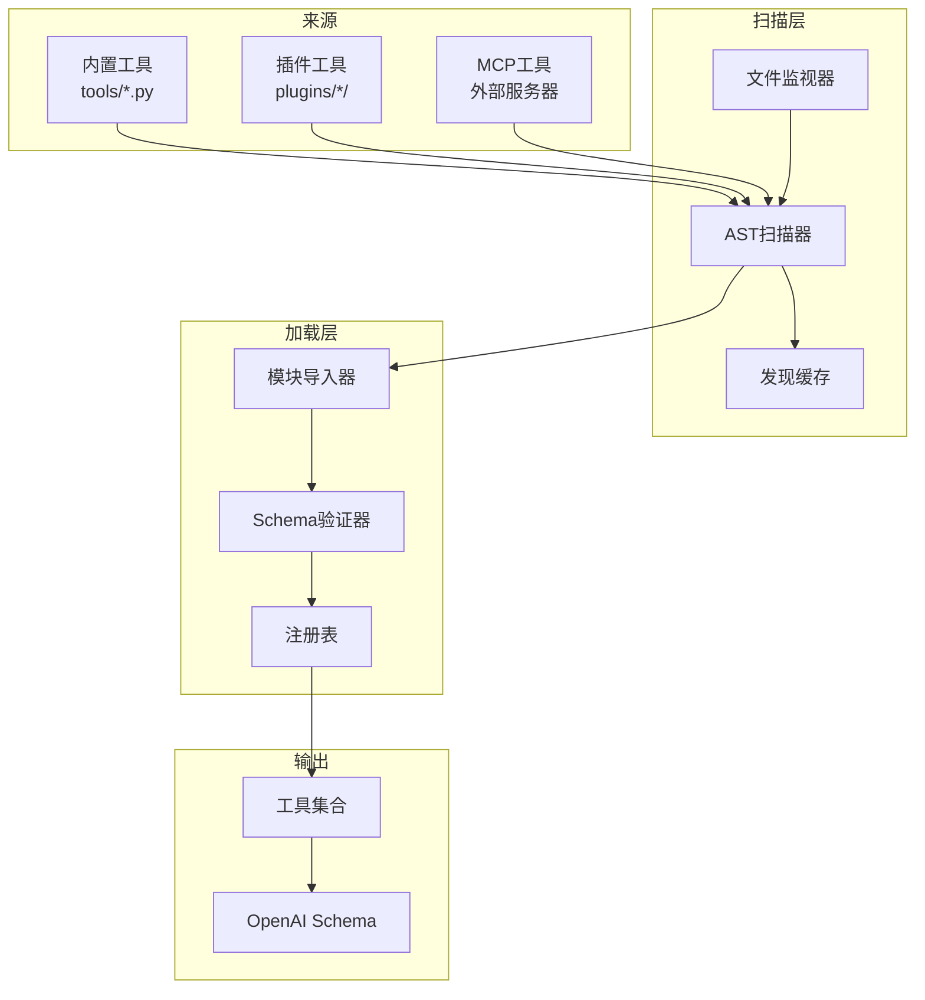

# 工具发现系统

<cite>
**本文引用的文件**
- [tools/registry.py](file://tools/registry.py)
- [plugins/__init__.py](file://plugins/__init__.py)
</cite>

## 目录
1. [简介](#简介)
2. [发现架构](#发现架构)
3. [内置工具发现](#内置工具发现)
4. [插件系统集成](#插件系统集成)
5. [缓存机制](#缓存机制)
6. [冲突检测](#冲突检测)
7. [性能优化](#性能优化)

## 简介

工具发现系统是Sparkii Agent工具生态的基础，负责自动识别、加载和注册所有可用工具。本文档详细说明内置工具的自动扫描机制、插件系统的集成方式，以及工具冲突检测和解决策略。

**核心特性：**
- **自动扫描**：通过AST解析自动发现工具模块
- **增量更新**：基于文件变更的智能缓存
- **插件支持**：动态加载外部插件工具
- **冲突解决**：完善的命名空间管理

## 发现架构



**图示来源**
- [tools/registry.py:108-159](file://tools/registry.py#L108-L159)
- [plugins/__init__.py](file://plugins/__init__.py)

## 内置工具发现

### 1. 扫描流程

```python
def discover_builtin_tools(tools_dir: Optional[Path] = None) -> List[str]:
    """Import built-in self-registering tool modules and return their module names."""
    tools_path = Path(tools_dir) if tools_dir is not None else Path(__file__).resolve().parent
    
    # 加载缓存
    cache = _load_discovery_cache()
    fresh_cache: Dict[str, list] = {}
    cache_dirty = False
    
    module_names: List[str] = []
    for path in sorted(tools_path.glob("*.py")):
        # 排除特殊文件
        if path.name in {"__init__.py", "registry.py", "mcp_tool.py"}:
            continue
        
        # 获取文件状态
        try:
            st = path.stat()
            stat_key = (st.st_mtime_ns, st.st_size)
        except OSError:
            continue
        
        # 缓存验证
        abs_path = str(path.resolve())
        cached = cache.get(abs_path)
        if (isinstance(cached, (list, tuple)) 
            and len(cached) == 3 
            and (cached[0], cached[1]) == stat_key):
            registers = bool(cached[2])
        else:
            registers = _module_registers_tools(path)
            cache_dirty = True
        
        fresh_cache[abs_path] = [stat_key[0], stat_key[1], registers]
        if registers:
            module_names.append(f"tools.{path.stem}")
    
    # 更新缓存
    if cache_dirty or set(fresh_cache) != set(cache):
        _save_discovery_cache(fresh_cache)
    
    # 导入模块
    imported: List[str] = []
    for mod_name in module_names:
        try:
            importlib.import_module(mod_name)
            imported.append(mod_name)
        except Exception as e:
            logger.warning("Could not import tool module %s: %s", mod_name, e)
    
    return imported
```

### 2. AST扫描检测

```python
def _module_registers_tools(module_path: Path) -> bool:
    """Return True when the module contains a top-level registry.register() call."""
    try:
        source = module_path.read_text(encoding="utf-8")
    except OSError:
        return False
    
    # 快速文本预过滤
    if "registry" not in source or "register" not in source:
        return False
    
    # AST解析
    try:
        tree = ast.parse(source, filename=str(module_path))
    except SyntaxError:
        return False
    
    return any(_is_registry_register_call(stmt) for stmt in tree.body)

def _is_registry_register_call(node: ast.AST) -> bool:
    """Return True when node is a registry.register(...) call expression."""
    if not isinstance(node, ast.Expr) or not isinstance(node.value, ast.Call):
        return False
    func = node.value.func
    return (
        isinstance(func, ast.Attribute)
        and func.attr == "register"
        and isinstance(func.value, ast.Name)
        and func.value.id == "registry"
    )
```

**扫描优化：**
- 文本预过滤避免不必要的AST解析
- 只检查顶层语句，忽略函数内的register调用
- 缓存AST解析结果

### 3. 缓存格式

```json
{
  "/path/to/tools/file_tools.py": [1234567890123456789, 12345, true],
  "/path/to/tools/terminal_tool.py": [1234567890123456789, 67890, false],
  "/path/to/tools/helper.py": [1234567890123456789, 23456, false]
}
```

**缓存键：** 文件绝对路径
**缓存值：** `[mtime_ns, size, registers]`

## 插件系统集成

### 1. 插件目录结构

```
plugins/
├── __init__.py           # 插件加载器
├── browser/
│   ├── __init__.py
│   └── chrome.py
├── memory/
│   ├── __init__.py
│   └── honcho.py
└── web/
    ├── __init__.py
    └── extract.py
```

### 2. 插件加载流程

```python
# plugins/__init__.py
def load_plugins():
    """Load all plugin modules."""
    plugins_dir = Path(__file__).parent
    
    for plugin_path in plugins_dir.iterdir():
        if plugin_path.is_dir() and not plugin_path.name.startswith("_"):
            plugin_init = plugin_path / "__init__.py"
            if plugin_init.exists():
                try:
                    importlib.import_module(f"plugins.{plugin_path.name}")
                except Exception as e:
                    logger.warning("Failed to load plugin %s: %s", plugin_path.name, e)
```

### 3. MCP工具集成

MCP（Model Context Protocol）工具通过外部服务器动态注册：

```python
# tools/mcp_tool.py
def refresh_mcp_tools(server_name: str):
    """Refresh tools from an MCP server."""
    # 获取服务器工具列表
    tools = mcp_client.list_tools(server_name)
    
    # 注销旧工具
    for tool_name in get_mcp_tool_names(server_name):
        registry.deregister(tool_name)
    
    # 注册新工具
    for tool in tools:
        registry.register(
            name=f"mcp_{server_name}_{tool.name}",
            toolset=f"mcp-{server_name}",
            schema=convert_mcp_schema(tool),
            handler=create_mcp_handler(server_name, tool.name),
            is_async=True
        )
```

## 缓存机制

### 1. 缓存路径

```python
def _discovery_cache_path() -> Optional[Path]:
    """Path of the tool-discovery verdict cache."""
    try:
        from sparkii_constants import get_sparkii_home
        return Path(get_sparkii_home()) / "cache" / "tool_discovery_cache.json"
    except Exception:
        return None
```

### 2. 缓存加载

```python
def _load_discovery_cache() -> Dict[str, list]:
    """Read the discovery cache; any error → empty dict (full scan)."""
    path = _discovery_cache_path()
    if path is None:
        return {}
    try:
        with open(path, "r", encoding="utf-8") as fh:
            data = json.load(fh)
        return data if isinstance(data, dict) else {}
    except (OSError, ValueError):
        return {}
```

### 3. 缓存保存

```python
def _save_discovery_cache(cache: Dict[str, list]) -> None:
    """Best-effort atomic write of the discovery cache. Never raises."""
    path = _discovery_cache_path()
    if path is None:
        return
    try:
        from utils import atomic_json_write
        path.parent.mkdir(parents=True, exist_ok=True)
        atomic_json_write(path, cache, indent=0)
    except Exception as e:
        logger.debug("Could not write tool discovery cache %s: %s", path, e)
```

**缓存策略：**
- 基于文件修改时间和大小的验证
- 原子写入保证一致性
- 最佳努力写入，失败不影响主流程

## 冲突检测

### 1. 命名冲突

```python
def register(self, name: str, toolset: str, **kwargs):
    with self._lock:
        existing = self._tools.get(name)
        if existing and existing.toolset != toolset:
            if override:
                # 允许覆盖
                pass
            else:
                # 拒绝覆盖
                logger.error(
                    "Tool registration REJECTED: '%s' (toolset '%s') would "
                    "shadow existing tool from toolset '%s'.",
                    name, toolset, existing.toolset,
                )
                return
```

### 2. 工具集冲突

```python
# 同一工具集内的同名工具会覆盖
registry.register(name="read_file", toolset="file", ...)  # 第一次注册
registry.register(name="read_file", toolset="file", ...)  # 覆盖（允许）

# 不同工具集的同名工具需要显式覆盖
registry.register(name="browser", toolset="browser", ...)  # 内置
registry.register(name="browser", toolset="custom", ..., override=True)  # 插件覆盖
```

### 3. 插件权限验证

```python
def _plugin_owner_of(self, handler: Callable) -> Optional[str]:
    """Return the plugin module namespace that defined handler."""
    try:
        mod = handler.__globals__.get("__name__", "")
    except AttributeError:
        return None
    
    if mod in self._plugin_override_policy:
        return mod
    
    if isinstance(mod, str) and mod.startswith("sparkii_plugins."):
        return mod
    
    return None
```

## 性能优化

### 1. 增量扫描

```python
# 只扫描变更的文件
cached = cache.get(abs_path)
if (isinstance(cached, (list, tuple)) 
    and len(cached) == 3 
    and (cached[0], cached[1]) == stat_key):
    registers = bool(cached[2])
else:
    registers = _module_registers_tools(path)
    cache_dirty = True
```

### 2. 文本预过滤

```python
def _module_registers_tools(module_path: Path) -> bool:
    # 快速文本预过滤
    if "registry" not in source or "register" not in source:
        return False
    
    # 只有通过预过滤才进行AST解析
    tree = ast.parse(source, filename=str(module_path))
    return any(_is_registry_register_call(stmt) for stmt in tree.body)
```

### 3. 并发安全

```python
class ToolRegistry:
    def __init__(self):
        self._lock = threading.RLock()
        self._generation: int = 0
    
    def register(self, name: str, **kwargs):
        with self._lock:
            # 注册逻辑
            self._generation += 1
    
    def get_entry(self, name: str) -> Optional[ToolEntry]:
        with self._lock:
            return self._tools.get(name)
```

## 最佳实践

### 1. 工具模块结构

```python
# tools/my_tool.py

"""My custom tool module."""

from tools.registry import registry, tool_error, tool_result

# Schema定义
MY_TOOL_SCHEMA = {
    "name": "my_tool",
    "description": "Tool description",
    "parameters": {
        "type": "object",
        "properties": {
            "param1": {"type": "string"}
        },
        "required": ["param1"]
    }
}

# 处理函数
def my_tool_handler(args: dict, **kwargs) -> str:
    try:
        result = do_something(args["param1"])
        return tool_result({"success": True, "data": result})
    except Exception as e:
        return tool_error(f"Failed: {e}")

# 自动注册（模块导入时执行）
registry.register(
    name="my_tool",
    toolset="custom",
    schema=MY_TOOL_SCHEMA,
    handler=my_tool_handler,
    emoji="🔧"
)
```

### 2. 插件开发

```python
# plugins/my_plugin/__init__.py

"""My custom plugin."""

from tools.registry import registry

def setup_plugin():
    """Plugin setup function."""
    # 注册插件工具
    registry.register(
        name="plugin_tool",
        toolset="plugin",
        schema=PLUGIN_TOOL_SCHEMA,
        handler=plugin_tool_handler,
        override=True  # 允许覆盖
    )

# 自动执行
setup_plugin()
```

### 3. 工具集组织

```python
# 按功能分组
registry.register(name="read_file", toolset="file", ...)
registry.register(name="write_file", toolset="file", ...)
registry.register(name="search_files", toolset="file", ...)

# 使用别名
registry.register_toolset_alias("fs", "file")
registry.register_toolset_alias("filesystem", "file")
```

## 结论

工具发现系统通过智能扫描、缓存机制和插件集成，为Sparkii Agent提供了强大而灵活的工具管理能力。系统能够自动发现和加载数百个工具，同时保持高性能和线程安全。
