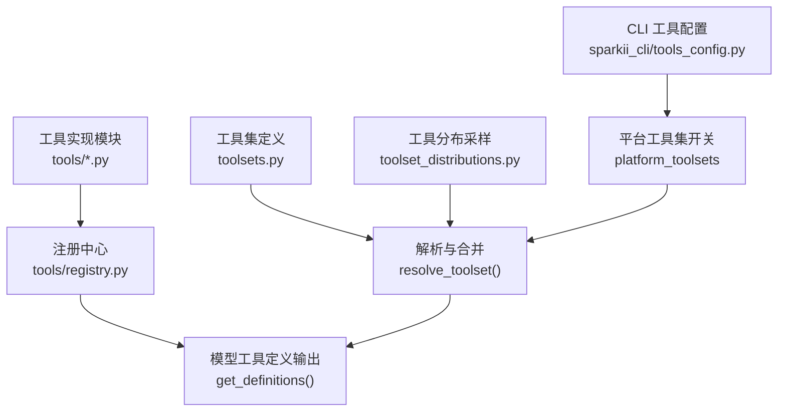
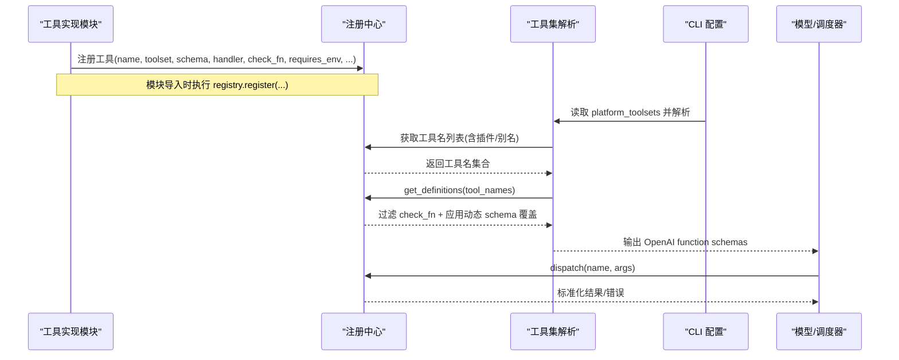
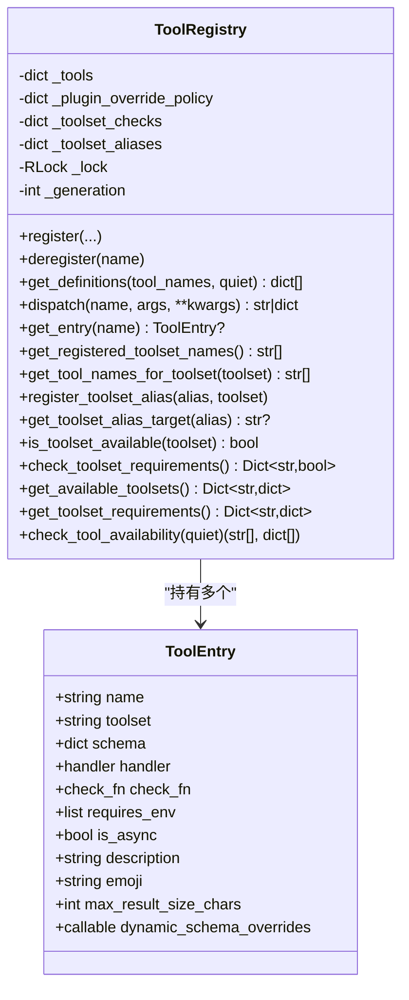
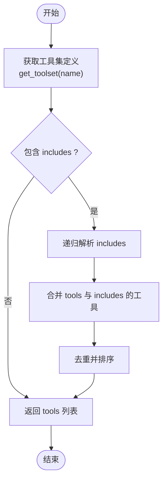
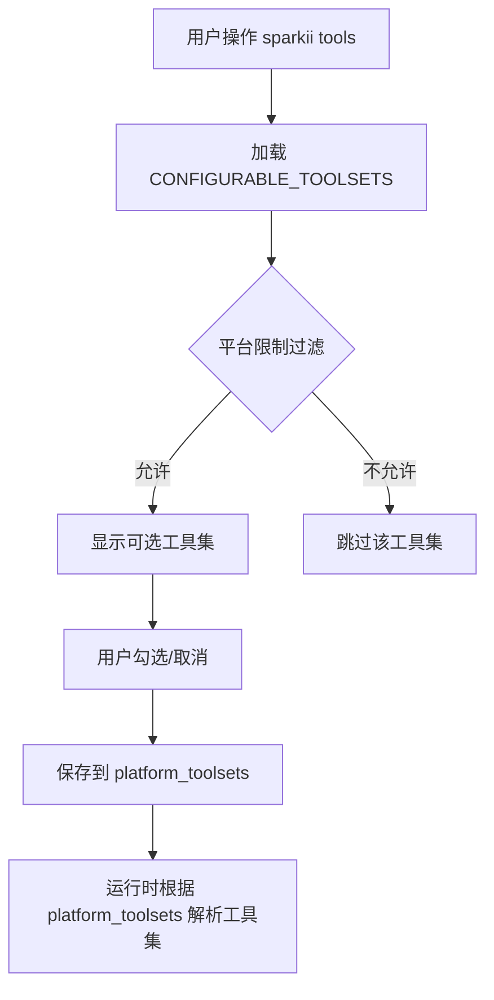
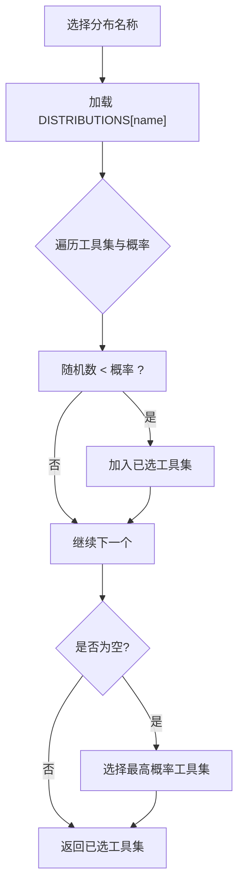
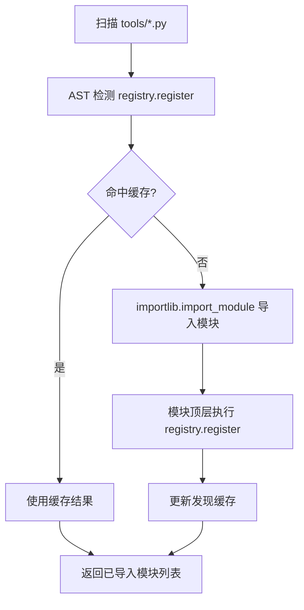
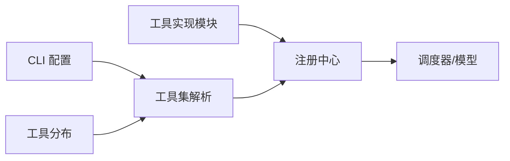

# 工具注册系统

<cite>
**本文引用的文件**
- [toolsets.py](file://toolsets.py)
- [tools/registry.py](file://tools/registry.py)
- [sparkii_cli/tools_config.py](file://sparkii_cli/tools_config.py)
- [toolset_distributions.py](file://toolset_distributions.py)
- [tools/web_tools.py](file://tools/web_tools.py)
- [tools/file_tools.py](file://tools/file_tools.py)
</cite>

## 目录
1. [简介](#简介)
2. [项目结构](#项目结构)
3. [核心组件](#核心组件)
4. [架构总览](#架构总览)
5. [详细组件分析](#详细组件分析)
6. [依赖关系分析](#依赖关系分析)
7. [性能考量](#性能考量)
8. [故障排查指南](#故障排查指南)
9. [结论](#结论)
10. [附录](#附录)

## 简介
本文件面向 Sparkii Agent 的工具注册系统，系统性阐述工具发现、动态加载与生命周期管理；解释工具定义的结构化格式（参数验证、类型检查、默认值处理）；说明工具集（Toolsets）的概念与管理方式（启用/禁用机制）；描述工具元数据的处理方式（描述信息、权限要求、版本兼容性检查）；并提供自定义工具注册、工具集配置与工具发现的实践示例。同时说明工具注册与插件系统的集成方式，以及如何通过配置文件动态管理工具的可用性。

## 项目结构
Sparkii Agent 的工具注册体系由以下关键部分组成：
- 工具注册中心：集中维护工具元数据、处理器、可用性与分发能力
- 工具集定义：将工具按场景组合为可复用的“工具集”，支持包含与派生
- CLI 工具配置：提供用户交互与持久化的平台级工具开关
- 工具分布采样：在批量或数据生成场景中按概率选择工具集
- 工具实现模块：每个工具以独立模块声明 schema、处理器与可用性探针

**图表来源**
- [tools/registry.py:414-764](file://tools/registry.py#L414-L764)
- [toolsets.py:101-641](file://toolsets.py#L101-L641)
- [sparkii_cli/tools_config.py:91-157](file://sparkii_cli/tools_config.py#L91-L157)
- [toolset_distributions.py:27-214](file://toolset_distributions.py#L27-L214)

**章节来源**
- [tools/registry.py:108-159](file://tools/registry.py#L108-L159)
- [toolsets.py:101-641](file://toolsets.py#L101-L641)
- [sparkii_cli/tools_config.py:91-157](file://sparkii_cli/tools_config.py#L91-L157)
- [toolset_distributions.py:27-214](file://toolset_distributions.py#L27-L214)

## 核心组件
- 工具注册中心（ToolRegistry）
  - 负责工具注册、去重、覆盖策略、别名映射、快照一致性、并发安全
  - 提供 get_definitions、dispatch、查询工具/工具集等接口
  - 内置 check_fn 缓存与失败宽限，避免瞬时抖动导致工具丢失
- 工具集（Toolsets）
  - 静态定义工具集合与包含关系，支持运行时合并插件注册的工具
  - 提供 resolve_toolset 递归解析、bundle_non_core_tools 计算平台增量
- CLI 工具配置（tools_config）
  - 维护 CONFIGURABLE_TOOLSETS、默认关闭项、平台限制、类别配置
  - 保存 per-platform 的 platform_toolsets 到配置文件
- 工具分布（toolset_distributions）
  - 定义不同场景下的工具集概率分布，用于采样激活工具集
- 工具实现（tools/*）
  - 每个工具模块在模块顶层调用 registry.register 声明 schema、处理器、check_fn、requires_env、emoji、max_result_size_chars 等

**章节来源**
- [tools/registry.py:201-230](file://tools/registry.py#L201-L230)
- [tools/registry.py:414-764](file://tools/registry.py#L414-L764)
- [toolsets.py:645-715](file://toolsets.py#L645-L715)
- [toolsets.py:718-800](file://toolsets.py#L718-L800)
- [sparkii_cli/tools_config.py:91-157](file://sparkii_cli/tools_config.py#L91-L157)
- [toolset_distributions.py:217-282](file://toolset_distributions.py#L217-L282)
- [tools/web_tools.py:1213-1237](file://tools/web_tools.py#L1213-L1237)

## 架构总览
下图展示了从工具发现到最终暴露给模型的完整流程，包括静态工具集、插件注册、MCP 别名、以及 CLI 配置对可用性的影响。

**图表来源**
- [tools/registry.py:562-644](file://tools/registry.py#L562-L644)
- [tools/registry.py:717-764](file://tools/registry.py#L717-L764)
- [tools/registry.py:801-834](file://tools/registry.py#L801-L834)
- [toolsets.py:645-715](file://toolsets.py#L645-L715)
- [toolsets.py:746-800](file://toolsets.py#L746-L800)

## 详细组件分析

### 工具注册中心（ToolRegistry）
- 设计要点
  - 线程安全：读写锁保护注册表与快照
  - 覆盖策略：跨工具集覆盖需显式 opt-in，防止误替换
  - 插件治理：基于 handler 定义模块命名空间绑定覆盖策略
  - 别名系统：支持工具集别名映射，便于 MCP 动态刷新
  - 快照一致性：对外提供稳定快照，避免并发读不一致
- 关键能力
  - register/deregister：注册与注销工具，维护工具集检查函数映射
  - get_definitions：按工具名生成 OpenAI function schema，过滤不可用工具，应用动态 schema 覆盖
  - dispatch：统一执行同步/异步处理器，规范化结果与错误
  - 查询接口：工具名、工具集、schema、emoji、最大结果大小等

**图表来源**
- [tools/registry.py:201-230](file://tools/registry.py#L201-L230)
- [tools/registry.py:414-764](file://tools/registry.py#L414-L764)
- [tools/registry.py:801-834](file://tools/registry.py#L801-L834)

**章节来源**
- [tools/registry.py:201-230](file://tools/registry.py#L201-L230)
- [tools/registry.py:414-764](file://tools/registry.py#L414-L764)
- [tools/registry.py:801-834](file://tools/registry.py#L801-L834)

### 工具集（Toolsets）与解析
- 概念
  - 工具集是工具的组合视图，既可直接列出工具，也可通过 includes 引用其他工具集
  - 支持“姿态”工具集（posture），如 coding，按会话上下文自动选择
  - 平台专属工具集（sparkii-*）复用核心工具集并叠加平台扩展
- 解析与合并
  - get_toolset：返回工具集定义，可选择是否合并插件注册的工具
  - resolve_toolset：递归展开 includes，支持 all/* 别名，防环检测
  - bundle_non_core_tools：计算平台包的非核心增量，避免禁用整个包时误删核心工具

**图表来源**
- [toolsets.py:645-715](file://toolsets.py#L645-L715)
- [toolsets.py:746-800](file://toolsets.py#L746-L800)

**章节来源**
- [toolsets.py:101-641](file://toolsets.py#L101-L641)
- [toolsets.py:645-715](file://toolsets.py#L645-L715)
- [toolsets.py:718-800](file://toolsets.py#L718-L800)

### CLI 工具配置与启用/禁用
- 可配置工具集清单：CONFIGURABLE_TOOLSETS 定义 UI 展示与默认分组
- 默认关闭项：_DEFAULT_OFF_TOOLSETS 控制新安装时的默认勾选
- 平台限制：_TOOLSET_PLATFORM_RESTRICTIONS 限定某些工具集仅在特定平台显示
- 类别配置：TOOL_CATEGORIES 提供按供应商的配置向导与环境变量提示
- 持久化：保存 per-platform 的 platform_toolsets 到配置文件，驱动运行时工具可用性

**图表来源**
- [sparkii_cli/tools_config.py:91-157](file://sparkii_cli/tools_config.py#L91-L157)
- [sparkii_cli/tools_config.py:222-242](file://sparkii_cli/tools_config.py#L222-L242)
- [sparkii_cli/tools_config.py:245-303](file://sparkii_cli/tools_config.py#L245-L303)

**章节来源**
- [sparkii_cli/tools_config.py:91-157](file://sparkii_cli/tools_config.py#L91-L157)
- [sparkii_cli/tools_config.py:222-242](file://sparkii_cli/tools_config.py#L222-L242)
- [sparkii_cli/tools_config.py:245-303](file://sparkii_cli/tools_config.py#L245-L303)

### 工具分布采样（Data Generation）
- 用途：在批量任务中按概率随机激活工具集，模拟真实使用分布
- 机制：sample_toolsets_from_distribution 对每个工具集独立掷骰子，保证至少一个被选中
- 校验：validate_toolset 确保工具集存在，否则警告并跳过

**图表来源**
- [toolset_distributions.py:241-282](file://toolset_distributions.py#L241-L282)

**章节来源**
- [toolset_distributions.py:27-214](file://toolset_distributions.py#L27-L214)
- [toolset_distributions.py:241-282](file://toolset_distributions.py#L241-L282)

### 工具定义与参数验证
- Schema 结构：每个工具声明 JSON Schema，包含 type、properties、required 等字段
- 类型检查：由上层调用方依据 schema 进行参数校验（例如 required 字段缺失时报错）
- 默认值处理：Schema 中的 default 可由调用方填充；工具内部也常提供默认逻辑（如 limit、char_limit）
- 结果大小限制：max_result_size_chars 控制返回内容长度，避免上下文溢出
- 动态 schema 覆盖：dynamic_schema_overrides 可在运行时注入依赖配置的字段（如委托任务限制）

示例路径（不直接粘贴代码）：
- web_search/web_extract 工具注册与 schema 定义：[tools/web_tools.py:1213-1237](file://tools/web_tools.py#L1213-L1237)
- 文件读取大小限制与截断逻辑：[tools/file_tools.py:52-129](file://tools/file_tools.py#L52-L129)

**章节来源**
- [tools/web_tools.py:1213-1237](file://tools/web_tools.py#L1213-L1237)
- [tools/file_tools.py:52-129](file://tools/file_tools.py#L52-L129)
- [tools/registry.py:201-230](file://tools/registry.py#L201-L230)

### 工具发现与动态加载
- 内置工具发现：discover_builtin_tools 扫描 tools/*.py，AST 检测顶层 registry.register 调用，仅导入实际注册的工具模块
- 缓存机制：基于文件 mtime+size 的发现缓存，减少重复扫描开销
- 插件与 MCP：
  - 插件可通过注册中心添加工具与工具集别名
  - MCP 动态刷新可 deregister/register 工具，保持工具集一致

**图表来源**
- [tools/registry.py:108-159](file://tools/registry.py#L108-L159)
- [tools/registry.py:162-199](file://tools/registry.py#L162-L199)

**章节来源**
- [tools/registry.py:108-159](file://tools/registry.py#L108-L159)
- [tools/registry.py:162-199](file://tools/registry.py#L162-L199)

### 生命周期管理与可用性检查
- check_fn 缓存：TTL 约 30 秒，失败宽限 60 秒，避免瞬时抖动导致工具丢失
- 多进程/多 profile：支持按 profile 隔离缓存键，避免交叉污染
- 工具可用性：is_toolset_available 与 check_toolset_requirements 聚合工具级 check_fn 结果
- 动态刷新：MCP 工具变更通过 deregister/register 触发，注册中心维护 generation 计数供外部缓存失效

**章节来源**
- [tools/registry.py:233-388](file://tools/registry.py#L233-L388)
- [tools/registry.py:877-951](file://tools/registry.py#L877-L951)

## 依赖关系分析
- 工具实现模块 → 注册中心：通过 registry.register 声明工具
- 工具集解析 → 注册中心：通过 get_tool_names_for_toolset 获取工具名
- CLI 配置 → 工具集解析：platform_toolsets 决定最终启用的工具集
- 工具分布 → 工具集解析：按概率采样工具集
- 注册中心 → 调度器：提供 get_definitions 与 dispatch

**图表来源**
- [tools/registry.py:414-764](file://tools/registry.py#L414-L764)
- [toolsets.py:645-800](file://toolsets.py#L645-L800)
- [sparkii_cli/tools_config.py:91-157](file://sparkii_cli/tools_config.py#L91-L157)
- [toolset_distributions.py:241-282](file://toolset_distributions.py#L241-L282)

**章节来源**
- [tools/registry.py:414-764](file://tools/registry.py#L414-L764)
- [toolsets.py:645-800](file://toolsets.py#L645-L800)
- [sparkii_cli/tools_config.py:91-157](file://sparkii_cli/tools_config.py#L91-L157)
- [toolset_distributions.py:241-282](file://toolset_distributions.py#L241-L282)

## 性能考量
- 工具发现缓存：基于文件 mtime+size 的缓存显著降低扫描成本
- check_fn 缓存与失败宽限：避免频繁探测外部状态（Docker、Playwright、网络）
- 快照一致性：注册中心使用锁与快照，减少并发读冲突
- 结果大小限制：max_result_size_chars 控制输出体积，防止上下文爆炸
- 动态 schema 覆盖：按需读取配置，结合外部缓存（config.yaml mtime+size）避免重复计算

[本节为通用指导，无需具体文件引用]

## 故障排查指南
- 工具不可用
  - 检查 check_fn 是否失败（网络超时、依赖未安装、环境变量缺失）
  - 查看日志中关于 check_fn 失败的告警与宽限行为
  - 确认 platform_toolsets 是否包含对应工具集
- 工具被意外覆盖
  - 跨工具集覆盖需要 override=True 且插件具备 operator opt-in
  - 若出现覆盖拒绝错误，检查插件配置 allow_tool_override
- 工具结果过大
  - 调整 max_result_size_chars 或工具内部 char_limit
- MCP 动态刷新异常
  - 确认 deregister/register 顺序正确，避免遗留别名指向无效工具集

**章节来源**
- [tools/registry.py:233-388](file://tools/registry.py#L233-L388)
- [tools/registry.py:562-644](file://tools/registry.py#L562-L644)
- [tools/registry.py:801-834](file://tools/registry.py#L801-L834)

## 结论
Sparkii Agent 的工具注册系统通过“注册中心 + 工具集 + CLI 配置 + 分布采样”的分层设计，实现了工具的可发现、可扩展、可配置与可观测。注册中心提供强一致的并发安全与健壮的生命周期管理；工具集抽象了复杂场景的工具组合；CLI 配置使非技术用户也能便捷启用/禁用功能；分布采样支持数据生成与评测场景。整体架构兼顾灵活性与安全性，适合大规模扩展与多平台部署。

[本节为总结性内容，无需具体文件引用]

## 附录

### 快速上手：注册自定义工具
- 步骤
  - 在 tools/ 下创建新模块，定义 JSON Schema 与处理器函数
  - 在模块顶层调用 registry.register，指定 name、toolset、schema、handler、check_fn、requires_env、emoji、max_result_size_chars 等
  - 将工具纳入某个工具集（直接在 TOOLSETS 中添加，或通过 includes 组合）
  - 通过 sparkii tools 启用相关工具集，或在配置中设置 platform_toolsets
- 参考路径
  - 工具注册示例：[tools/web_tools.py:1213-1237](file://tools/web_tools.py#L1213-L1237)
  - 工具集定义与组合：[toolsets.py:101-641](file://toolsets.py#L101-L641)
  - CLI 配置入口：[sparkii_cli/tools_config.py:91-157](file://sparkii_cli/tools_config.py#L91-L157)

**章节来源**
- [tools/web_tools.py:1213-1237](file://tools/web_tools.py#L1213-L1237)
- [toolsets.py:101-641](file://toolsets.py#L101-L641)
- [sparkii_cli/tools_config.py:91-157](file://sparkii_cli/tools_config.py#L91-L157)

### 工具集启用/禁用机制
- 通过 sparkii tools 勾选/取消工具集，保存至 platform_toolsets
- 运行时 resolve_toolset 根据 platform_toolsets 解析最终工具集
- 对于平台专属工具集，仅在该平台显示与生效
- 默认关闭项在新安装时不会预勾选，需手动启用

**章节来源**
- [sparkii_cli/tools_config.py:91-157](file://sparkii_cli/tools_config.py#L91-L157)
- [sparkii_cli/tools_config.py:222-242](file://sparkii_cli/tools_config.py#L222-L242)
- [toolsets.py:645-800](file://toolsets.py#L645-L800)

### 工具发现与插件集成
- 内置工具发现：AST 扫描 + 缓存，仅导入实际注册的工具模块
- 插件集成：插件可通过注册中心添加工具与工具集别名，支持覆盖策略与权限控制
- MCP 动态刷新：支持 nuke-and-repave，保持工具集一致

**章节来源**
- [tools/registry.py:108-159](file://tools/registry.py#L108-L159)
- [tools/registry.py:162-199](file://tools/registry.py#L162-L199)
- [tools/registry.py:562-644](file://tools/registry.py#L562-L644)

### 工具元数据处理
- 描述信息：description 来自 schema 或注册时传入，用于 UI 展示与模型理解
- 权限要求：requires_env 列出所需环境变量，check_fn 做运行时可用性检查
- 版本兼容性：通过 dynamic_schema_overrides 注入运行时依赖的配置字段，确保模型看到最新约束

**章节来源**
- [tools/registry.py:201-230](file://tools/registry.py#L201-L230)
- [tools/registry.py:717-764](file://tools/registry.py#L717-L764)