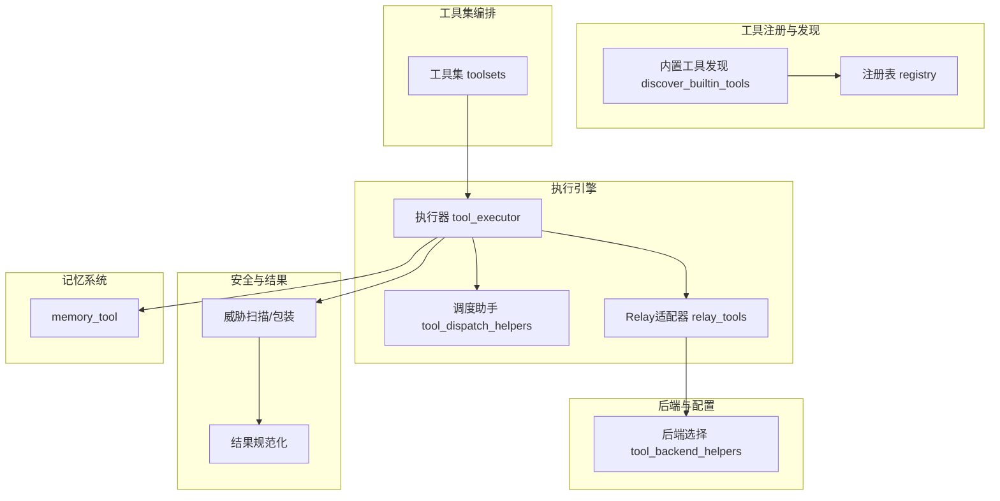
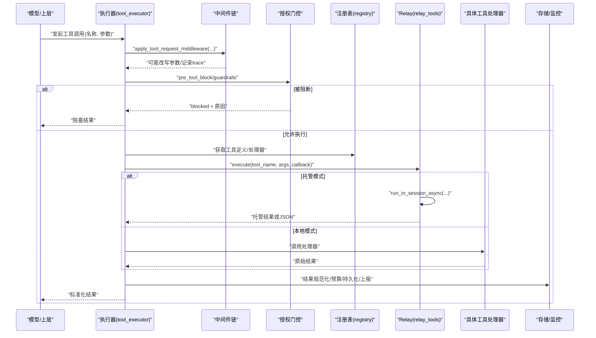
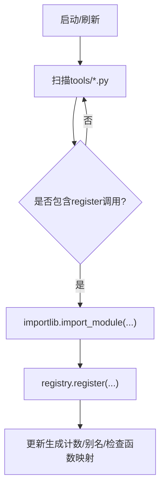
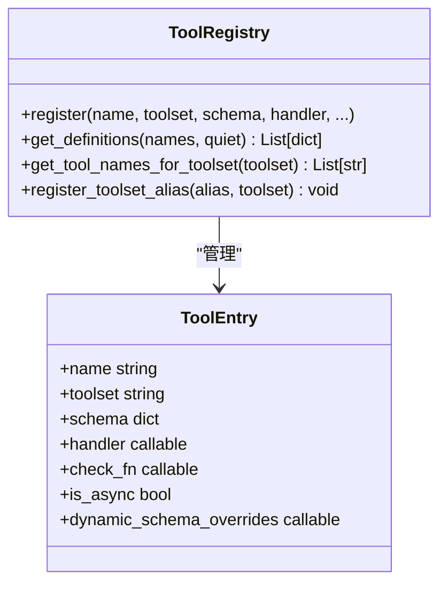
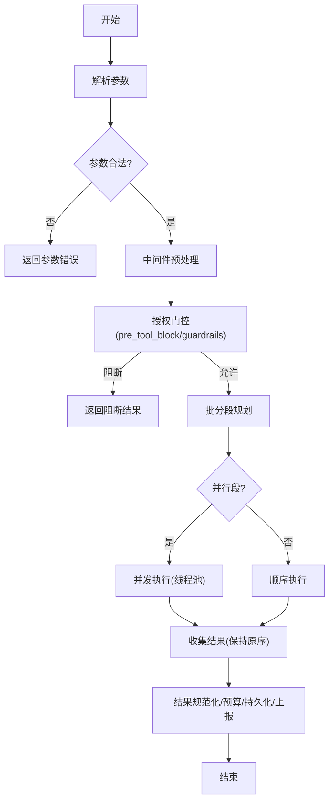
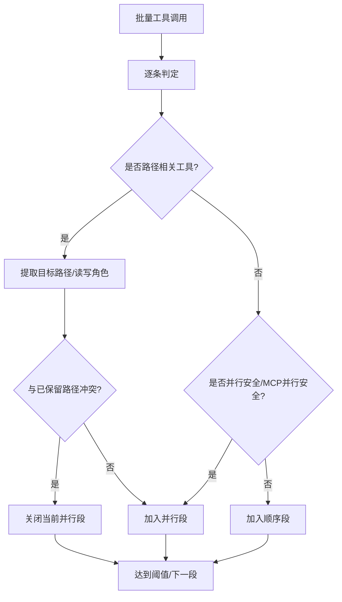
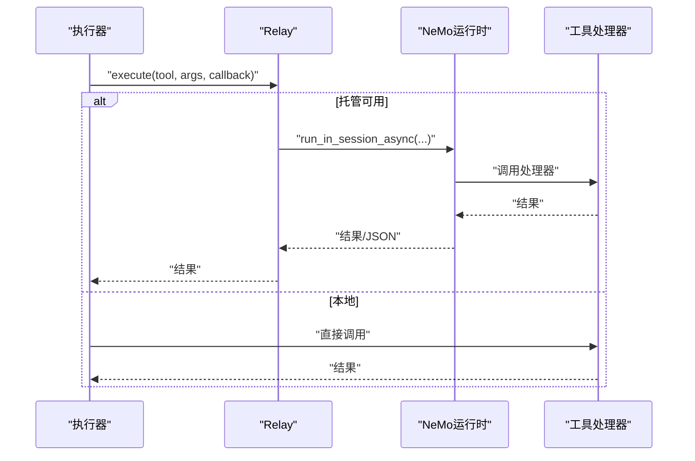
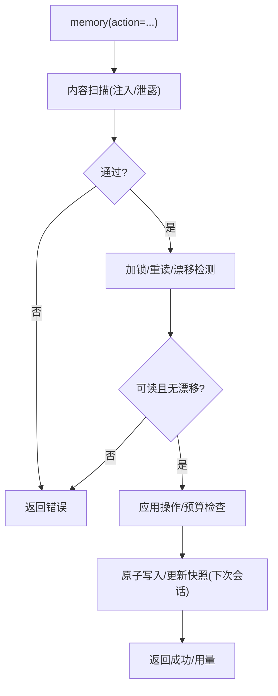
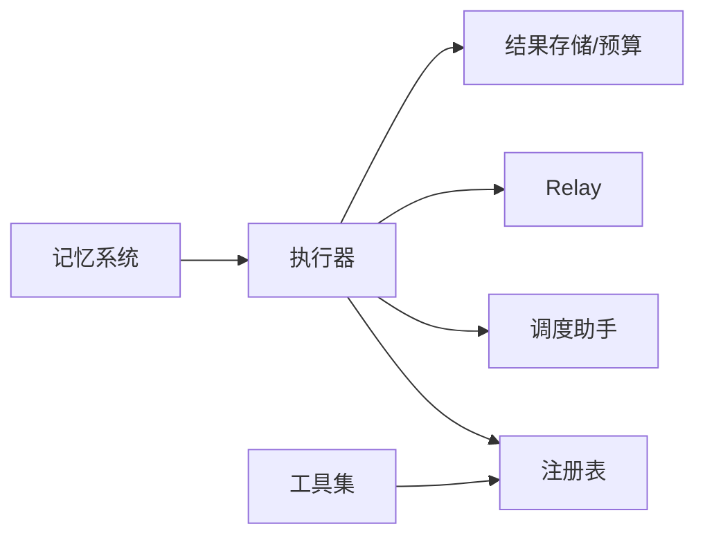

# 工具系统架构

<cite>
**本文引用的文件**
- [agent/tool_executor.py](file://agent/tool_executor.py)
- [tools/registry.py](file://tools/registry.py)
- [toolsets.py](file://toolsets.py)
- [agent/tool_dispatch_helpers.py](file://agent/tool_dispatch_helpers.py)
- [agent/relay_tools.py](file://agent/relay_tools.py)
- [tools/tool_backend_helpers.py](file://tools/tool_backend_helpers.py)
- [tools/memory_tool.py](file://tools/memory_tool.py)
- [tools/file_tools.py](file://tools/file_tools.py)
</cite>

## 目录
1. [简介](#简介)
2. [项目结构](#项目结构)
3. [核心组件](#核心组件)
4. [架构总览](#架构总览)
5. [详细组件分析](#详细组件分析)
6. [依赖关系分析](#依赖关系分析)
7. [性能考量](#性能考量)
8. [故障排查指南](#故障排查指南)
9. [结论](#结论)
10. [附录](#附录)

## 简介
本文件面向Hermes Agent的工具系统，系统性阐述工具注册、动态加载、执行调度、并行与串行策略、资源与超时控制、权限与安全、错误处理、以及工具与记忆系统的集成方式。文档同时提供初学者使用指南与开发者扩展要点，帮助快速上手并安全扩展代理能力。

## 项目结构
工具系统由“注册与发现”“工具集编排”“执行引擎”“中间件与沙箱”“结果封装与安全”“持久化与监控”等模块组成：
- 注册与发现：集中式注册表负责工具元数据、处理器绑定、可用性检查与动态刷新（MCP）。
- 工具集编排：按场景组合工具集合，支持平台/会话级启用/禁用。
- 执行引擎：顺序与并发执行、批分段规划、授权门控、中断与超时。
- 中间件与沙箱：请求/执行中间件链、NeMo Relay托管执行、进程隔离与上下文传播。
- 结果封装与安全：统一结果形状、不可信内容包装、威胁扫描。
- 持久化与监控：增量落盘、预算限制、后调用钩子与指标上报。

图表来源
- [tools/registry.py:108-159](file://tools/registry.py#L108-L159)
- [toolsets.py:103-641](file://toolsets.py#L103-L641)
- [agent/tool_executor.py:758-800](file://agent/tool_executor.py#L758-L800)
- [agent/tool_dispatch_helpers.py:116-234](file://agent/tool_dispatch_helpers.py#L116-L234)
- [agent/relay_tools.py:18-83](file://agent/relay_tools.py#L18-L83)
- [tools/tool_backend_helpers.py:20-141](file://tools/tool_backend_helpers.py#L20-L141)
- [tools/memory_tool.py:148-240](file://tools/memory_tool.py#L148-L240)

章节来源
- [tools/registry.py:108-159](file://tools/registry.py#L108-L159)
- [toolsets.py:103-641](file://toolsets.py#L103-L641)
- [agent/tool_executor.py:758-800](file://agent/tool_executor.py#L758-L800)
- [agent/tool_dispatch_helpers.py:116-234](file://agent/tool_dispatch_helpers.py#L116-L234)
- [agent/relay_tools.py:18-83](file://agent/relay_tools.py#L18-L83)
- [tools/tool_backend_helpers.py:20-141](file://tools/tool_backend_helpers.py#L20-L141)
- [tools/memory_tool.py:148-240](file://tools/memory_tool.py#L148-L240)

## 核心组件
- 工具注册表：维护工具名到元数据与处理器的映射；支持覆盖保护、别名、TTL缓存的check_fn、MCP动态刷新。
- 工具集：将工具按场景分组，支持包含其他工具集，平台/会话级解析与合并。
- 执行引擎：解析参数、中间件预处理、授权门控、顺序/并发执行、批分段、超时与中断、结果归一化与持久化。
- 调度助手：决定哪些调用可并行、路径冲突检测、多模态结果封装、不可信输出包装。
- Relay适配器：在托管模式下将工具调用路由至NeMo运行时，保持上下文与异常透传。
- 后端选择：根据凭据与配置选择本地/托管/Modal等执行后端。
- 记忆系统：跨会话持久化、快照注入系统提示、防注入扫描、原子写入与漂移保护。

章节来源
- [tools/registry.py:201-800](file://tools/registry.py#L201-L800)
- [toolsets.py:645-800](file://toolsets.py#L645-L800)
- [agent/tool_executor.py:482-662](file://agent/tool_executor.py#L482-L662)
- [agent/tool_dispatch_helpers.py:42-234](file://agent/tool_dispatch_helpers.py#L42-L234)
- [agent/relay_tools.py:18-83](file://agent/relay_tools.py#L18-L83)
- [tools/tool_backend_helpers.py:20-141](file://tools/tool_backend_helpers.py#L20-L141)
- [tools/memory_tool.py:148-240](file://tools/memory_tool.py#L148-L240)

## 架构总览
下图展示一次工具调用的端到端流程：从模型发起调用，经中间件与授权门控，进入执行引擎的顺序/并发分支，必要时通过Relay托管执行，最终返回标准化结果并持久化。

图表来源
- [agent/tool_executor.py:482-662](file://agent/tool_executor.py#L482-L662)
- [agent/relay_tools.py:18-83](file://agent/relay_tools.py#L18-L83)
- [tools/registry.py:717-764](file://tools/registry.py#L717-L764)

## 详细组件分析

### 工具注册与动态加载
- 自动发现：扫描tools目录下含顶层register调用的模块，导入并自注册；带磁盘缓存加速。
- 注册表：维护ToolEntry（名称、工具集、schema、处理器、check_fn、异步标记、描述、emoji、结果大小上限、动态schema覆盖）；支持插件覆盖策略与版本代计数。
- check_fn缓存：对可用性探测进行TTL与失败宽限缓存，避免瞬时抖动导致工具静默消失。
- MCP动态刷新：支持nukes-and-repave式的工具列表更新，受同工具集约束。

图表来源
- [tools/registry.py:108-159](file://tools/registry.py#L108-L159)
- [tools/registry.py:201-230](file://tools/registry.py#L201-L230)
- [tools/registry.py:233-380](file://tools/registry.py#L233-L380)
- [tools/registry.py:562-644](file://tools/registry.py#L562-L644)
- [tools/registry.py:646-711](file://tools/registry.py#L646-L711)

章节来源
- [tools/registry.py:108-159](file://tools/registry.py#L108-L159)
- [tools/registry.py:201-230](file://tools/registry.py#L201-L230)
- [tools/registry.py:233-380](file://tools/registry.py#L233-L380)
- [tools/registry.py:562-644](file://tools/registry.py#L562-L644)
- [tools/registry.py:646-711](file://tools/registry.py#L646-L711)

### 工具集与权限控制
- 工具集定义：按场景聚合工具，支持includes组合；平台/会话层可启用/禁用特定工具集。
- 权限边界：通过enabled/disabled工具集过滤；Tool Search解包时校验底层工具是否在会话范围内；插件覆盖需显式opt-in。
- 安全策略：guardrails.before_call拦截高风险操作；pre_tool_block插件可拒绝执行。

图表来源
- [tools/registry.py:201-230](file://tools/registry.py#L201-L230)
- [tools/registry.py:414-445](file://tools/registry.py#L414-L445)
- [tools/registry.py:562-644](file://tools/registry.py#L562-L644)
- [tools/registry.py:717-764](file://tools/registry.py#L717-L764)

章节来源
- [toolsets.py:103-641](file://toolsets.py#L103-L641)
- [agent/tool_executor.py:333-379](file://agent/tool_executor.py#L333-L379)
- [tools/registry.py:562-644](file://tools/registry.py#L562-L644)

### 执行引擎：顺序与并发、批分段与授权门控
- 参数解析：严格解析JSON参数，非法则直接返回错误并跳过执行。
- 中间件链：先应用请求中间件，再进入授权门控（pre_tool_block与guardrails），最后才真正执行。
- 批分段：基于工具类型、路径范围与读写角色，将一批调用切分为“并行段”和“顺序段”，保证顺序一致性与无冲突。
- 授权门控：序列化用户审批/策略提示，排除人类等待时间计入批次超时；锁超时保护防止死锁饥饿。
- 并发执行：线程池并发，限制最大工作线程数；图像生成等慢操作有独立并发上限。
- 超时与中断：支持环境变量配置并发工具超时；支持用户中断提前终止并记录取消结果。
- 进度与持久化：执行前创建文件/终端破坏性操作的检查点；执行中增量落盘消息，确保崩溃恢复。

图表来源
- [agent/tool_executor.py:141-157](file://agent/tool_executor.py#L141-L157)
- [agent/tool_executor.py:482-662](file://agent/tool_executor.py#L482-L662)
- [agent/tool_executor.py:758-800](file://agent/tool_executor.py#L758-L800)
- [agent/tool_dispatch_helpers.py:116-234](file://agent/tool_dispatch_helpers.py#L116-L234)

章节来源
- [agent/tool_executor.py:141-157](file://agent/tool_executor.py#L141-L157)
- [agent/tool_executor.py:482-662](file://agent/tool_executor.py#L482-L662)
- [agent/tool_executor.py:758-800](file://agent/tool_executor.py#L758-L800)
- [agent/tool_dispatch_helpers.py:116-234](file://agent/tool_dispatch_helpers.py#L116-L234)

### 并行执行机制与资源管理
- 并行安全工具集：只读/无共享状态工具可直接并行；MCP工具可通过接口声明并行安全。
- 路径范围冲突：read_file/search_files为读者，write_file/patch为写者；同一子树内写者与任何读者冲突，关闭当前并行段。
- 并发上限：默认最大工作线程数；图像生成类工具单独限制并发请求数。
- 资源与上下文：线程间传播任务上下文；活动回调用于环境感知；破坏性命令触发检查点。

图表来源
- [agent/tool_dispatch_helpers.py:116-234](file://agent/tool_dispatch_helpers.py#L116-L234)
- [agent/tool_executor.py:209-246](file://agent/tool_executor.py#L209-L246)

章节来源
- [agent/tool_dispatch_helpers.py:116-234](file://agent/tool_dispatch_helpers.py#L116-L234)
- [agent/tool_executor.py:209-246](file://agent/tool_executor.py#L209-L246)

### 超时控制与中断
- 并发超时：通过环境变量配置单次并发工具超时；无效值回退默认。
- 授权门控锁超时：防止卡住的插件或审批客户端导致整批饥饿。
- 中断：检测到中断请求时，跳过剩余工具调用并记录取消结果。

章节来源
- [agent/tool_executor.py:160-175](file://agent/tool_executor.py#L160-L175)
- [agent/tool_executor.py:114-130](file://agent/tool_executor.py#L114-L130)
- [agent/tool_executor.py:775-800](file://agent/tool_executor.py#L775-L800)

### 沙箱隔离与托管执行
- 本地模式：直接在进程内调用工具处理器。
- 托管模式：通过Relay将工具调用投递到NeMo运行时，在会话上下文中执行，异常与结果经回调桥接回主进程。
- 后端选择：依据凭据与配置选择local/modal/managed等后端，支持auto直降策略。

图表来源
- [agent/relay_tools.py:18-83](file://agent/relay_tools.py#L18-L83)
- [tools/tool_backend_helpers.py:20-141](file://tools/tool_backend_helpers.py#L20-L141)

章节来源
- [agent/relay_tools.py:18-83](file://agent/relay_tools.py#L18-L83)
- [tools/tool_backend_helpers.py:20-141](file://tools/tool_backend_helpers.py#L20-L141)

### 结果封装、安全检查与错误处理
- 结果规范化：仅允许字符串或多模态信封；其他类型转为错误并截断过长error字段。
- 不可信内容包装：web_search/web_extract/browser_*/mcp_*等外部数据以分隔块包裹，提示模型将其视为数据而非指令。
- 威胁扫描：对工具输出进行威胁模式扫描，附加风险元数据供下游决策。
- 错误边界：参数非法、处理器异常、持久化失败均有明确分类与降级策略。

章节来源
- [tools/registry.py:770-800](file://tools/registry.py#L770-L800)
- [agent/tool_dispatch_helpers.py:533-707](file://agent/tool_dispatch_helpers.py#L533-L707)
- [agent/tool_executor.py:178-206](file://agent/tool_executor.py#L178-L206)

### 工具与记忆系统集成
- 记忆存储：MEMORY.md与USER.md作为持久化载体，会话启动时冻结快照注入系统提示，会话内写入不改变快照以保持缓存稳定。
- 安全扫描：写入与加载时对内容进行严格威胁扫描，命中则替换为占位并从系统提示移除。
- 原子性与漂移保护：文件锁+原子写入；外部漂移检测避免覆盖未解析内容；读取失败拒绝写入以防丢失。
- 批量操作：支持add/replace/remove的原子批处理，最终预算检查，减少往返。

图表来源
- [tools/memory_tool.py:148-240](file://tools/memory_tool.py#L148-L240)
- [tools/memory_tool.py:390-670](file://tools/memory_tool.py#L390-L670)

章节来源
- [tools/memory_tool.py:148-240](file://tools/memory_tool.py#L148-L240)
- [tools/memory_tool.py:390-670](file://tools/memory_tool.py#L390-L670)

### 自定义工具开发指南（步骤与要点）
- 在tools目录下新增模块，并在模块顶层调用注册表register声明schema、处理器、工具集、check_fn等。
- 遵循结果契约：返回字符串或多模态信封；避免返回不支持的类型。
- 如需动态schema：提供dynamic_schema_overrides回调，在每次获取定义时合并运行时信息。
- 若涉及外部依赖：实现check_fn并依赖TTL缓存，避免频繁探测造成抖动。
- 安全与审计：对敏感输入做校验；对高可信度输出进行必要包装；必要时接入中间件链。

章节来源
- [tools/registry.py:201-230](file://tools/registry.py#L201-L230)
- [tools/registry.py:562-644](file://tools/registry.py#L562-L644)
- [tools/registry.py:717-764](file://tools/registry.py#L717-L764)
- [tools/registry.py:770-800](file://tools/registry.py#L770-L800)

### 工具集配置与执行监控
- 工具集配置：通过工具集定义与平台/会话级启用/禁用组合，得到最终可用工具集合。
- 执行监控：post_tool_call钩子上报工具调用详情（耗时、状态、错误类型、中间件trace）；增量持久化保障崩溃恢复。
- 预算与限制：按上下文窗口缩放工具结果预算；大结果截断与多模态摘要。

章节来源
- [toolsets.py:645-800](file://toolsets.py#L645-L800)
- [agent/tool_executor.py:259-330](file://agent/tool_executor.py#L259-L330)
- [agent/tool_executor.py:78-91](file://agent/tool_executor.py#L78-L91)

## 依赖关系分析
- 松耦合：注册表与工具处理器通过schema与处理器函数解耦；执行引擎通过中间件链与授权门控扩展行为。
- 关键依赖：
  - 执行器依赖调度助手（并行规则）、注册表（工具定义）、Relay（托管执行）、工具结果存储（预算/持久化）。
  - 工具集依赖注册表以合并插件/动态工具。
  - 记忆系统独立于执行流，但通过工具调用参与代理能力扩展。

图表来源
- [agent/tool_executor.py:482-662](file://agent/tool_executor.py#L482-L662)
- [tools/registry.py:717-764](file://tools/registry.py#L717-L764)
- [toolsets.py:645-800](file://toolsets.py#L645-L800)
- [tools/memory_tool.py:148-240](file://tools/memory_tool.py#L148-L240)

章节来源
- [agent/tool_executor.py:482-662](file://agent/tool_executor.py#L482-L662)
- [tools/registry.py:717-764](file://tools/registry.py#L717-L764)
- [toolsets.py:645-800](file://toolsets.py#L645-L800)
- [tools/memory_tool.py:148-240](file://tools/memory_tool.py#L148-L240)

## 性能考量
- 并发上限与细分：默认最大工作线程数，图像生成等慢操作单独限制并发，避免后端限流。
- TTL与缓存：check_fn结果TTL与失败宽限，减少外部探测开销；工具发现缓存降低扫描成本。
- 结果预算：按上下文窗口缩放工具结果预算，避免单条结果撑爆上下文。
- 批分段优化：尽可能将安全调用并行化，减少整体延迟；路径冲突最小化关闭并行段的频率。

[本节为通用指导，无需引用具体文件]

## 故障排查指南
- 工具不可用：检查check_fn是否失败（网络/依赖/权限），查看TTL与失败宽限；确认工具集未被禁用。
- 工具被阻断：查看pre_tool_block与guardrails返回的原因；确认会话工具集范围。
- 并发异常：检查路径冲突与写者冲突；确认MCP工具是否声明并行安全。
- 超时/中断：调整并发超时；确认授权门控锁是否被卡住；检查中断标志。
- 结果过大：关注结果预算与截断；必要时拆分调用或使用分页。
- 记忆写入失败：检查文件锁定、漂移备份与读取失败；按错误提示修复后再试。

章节来源
- [tools/registry.py:233-380](file://tools/registry.py#L233-L380)
- [agent/tool_executor.py:160-175](file://agent/tool_executor.py#L160-L175)
- [agent/tool_executor.py:114-130](file://agent/tool_executor.py#L114-L130)
- [tools/memory_tool.py:91-145](file://tools/memory_tool.py#L91-L145)
- [tools/memory_tool.py:322-361](file://tools/memory_tool.py#L322-L361)

## 结论
Hermes工具系统通过“注册-编排-执行-安全-持久化”的分层设计，实现了可扩展、安全可控、高性能的工具执行框架。其并行策略、授权门控、结果规范化与记忆集成，既保障了稳定性与安全性，又为开发者提供了清晰的扩展点。建议在实践中结合工具集与中间件，按需启用能力，并充分利用监控与预算机制，获得最佳体验。

[本节为总结，无需引用具体文件]

## 附录
- 初学者使用指南
  - 选择合适工具集：根据场景启用web、browser、terminal、memory等工具集。
  - 理解并行与顺序：非路径相关只读工具可并行；涉及文件写入需谨慎。
  - 监控与调试：关注post_tool_call上报与增量持久化日志。
- 开发者扩展要点
  - 注册工具：在模块顶层register，遵循schema与结果契约。
  - 安全优先：对输入校验、输出包装、威胁扫描；必要时实现check_fn。
  - 性能优化：合理使用并行安全工具、避免路径冲突、控制结果大小。
  - 集成记忆：通过memory工具沉淀知识，注意快照与预算。

[本节为补充说明，无需引用具体文件]