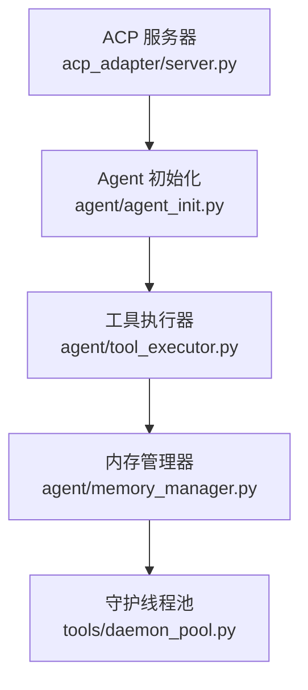
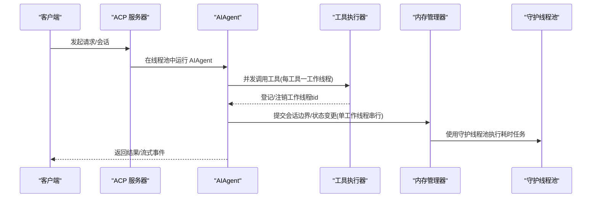
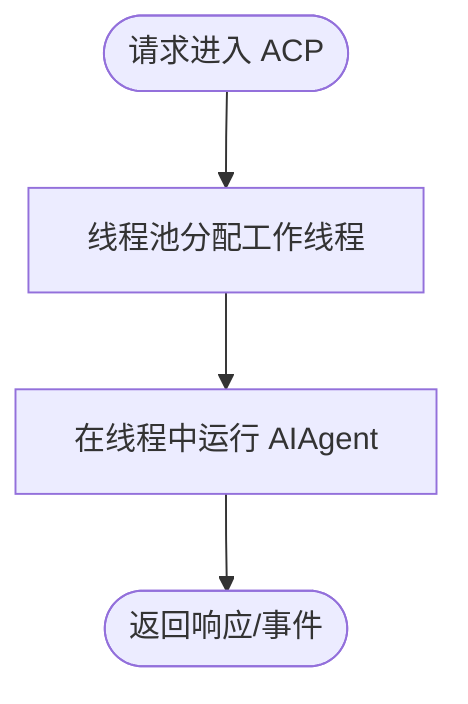
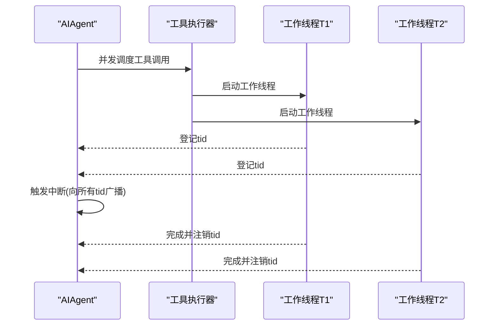
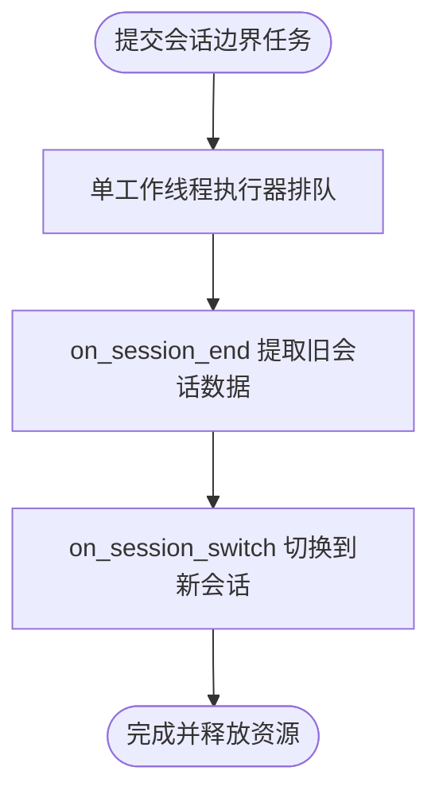
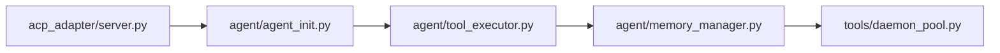

# 并行处理机制

<cite>
**本文引用的文件**
- [acp_adapter/server.py](file://acp_adapter/server.py)
- [agent/agent_init.py](file://agent/agent_init.py)
- [agent/tool_executor.py](file://agent/tool_executor.py)
- [agent/memory_manager.py](file://agent/memory_manager.py)
- [tools/daemon_pool.py](file://tools/daemon_pool.py)
</cite>

## 目录
1. [简介](#简介)
2. [项目结构](#项目结构)
3. [核心组件](#核心组件)
4. [架构总览](#架构总览)
5. [详细组件分析](#详细组件分析)
6. [依赖关系分析](#依赖关系分析)
7. [性能考量](#性能考量)
8. [故障排查指南](#故障排查指南)
9. [结论](#结论)
10. [附录：配置与示例路径](#附录：配置与示例路径)

## 简介
本文件聚焦 Hermes Agent 的并行处理机制，围绕“多线程工具执行”的实现原理展开，涵盖线程池配置、任务分配与同步、并发控制策略（最大并发数、资源竞争避免、死锁预防）、任务优先级与调度、内存管理与资源清理、性能监控与优化、以及与外部服务的并发交互（限流、连接池、错误恢复）。文档既为初学者提供并行基础概念，也为开发者在高并发场景下的调优与排障提供技术细节。

## 项目结构
Hermes Agent 的并行能力由多个模块协作实现：
- ACP 适配器层使用进程级线程池承载多会话/多请求的并行执行。
- Agent 初始化阶段建立中断传播、子代理跟踪、工具工作线程追踪等并发原语。
- 工具执行器在并发调用工具时，将工作线程 tid 登记到 Agent，以便中断信号能正确下发到各工作线程。
- 内存管理器通过单工作线程后台执行器串行化关键状态变更，避免竞态并保证顺序性。
- 守护线程池用于确保网络阻塞不会阻止解释器退出。

**图示来源**
- [acp_adapter/server.py:193-212](file://acp_adapter/server.py#L193-L212)
- [agent/agent_init.py:790-831](file://agent/agent_init.py#L790-L831)
- [agent/tool_executor.py:981-982](file://agent/tool_executor.py#L981-L982)
- [agent/memory_manager.py:736-757](file://agent/memory_manager.py#L736-L757)
- [tools/daemon_pool.py](file://tools/daemon_pool.py)

**章节来源**
- [acp_adapter/server.py:193-212](file://acp_adapter/server.py#L193-L212)
- [agent/agent_init.py:790-831](file://agent/agent_init.py#L790-L831)
- [agent/tool_executor.py:981-982](file://agent/tool_executor.py#L981-L982)
- [agent/memory_manager.py:736-757](file://agent/memory_manager.py#L736-L757)
- [tools/daemon_pool.py](file://tools/daemon_pool.py)

## 核心组件
- 进程级线程池：用于在 ACP 层并行运行多个 AIAgent 实例，隔离不同会话/请求的执行上下文。
- 工具并发执行：每个工具调用在独立的工作线程中执行，并通过 Agent 内部集合记录工作线程 tid，以支持中断传播。
- 后台串行执行器：内存管理器使用单工作线程执行器串行化关键操作（如会话边界切换），避免并发写入导致的竞态。
- 守护线程池：确保即使提供者被网络调用卡住，也不会阻塞解释器退出。

**章节来源**
- [acp_adapter/server.py:193-212](file://acp_adapter/server.py#L193-L212)
- [agent/agent_init.py:818-831](file://agent/agent_init.py#L818-L831)
- [agent/memory_manager.py:736-757](file://agent/memory_manager.py#L736-L757)
- [tools/daemon_pool.py](file://tools/daemon_pool.py)

## 架构总览
下图展示了从 ACP 请求进入，到工具并发执行、中断传播、以及后台串行化的整体流程。

**图示来源**
- [acp_adapter/server.py:193-212](file://acp_adapter/server.py#L193-L212)
- [agent/tool_executor.py:981-982](file://agent/tool_executor.py#L981-L982)
- [agent/memory_manager.py:736-757](file://agent/memory_manager.py#L736-L757)
- [tools/daemon_pool.py](file://tools/daemon_pool.py)

## 详细组件分析

### 线程池配置与任务分配（ACP 层）
- 使用进程级 ThreadPoolExecutor 承载 AIAgent 的并行执行，限制最大工作线程数以控制并发度。
- 该线程池名称前缀便于日志与调试定位。
- 适用于多会话/多请求的并行处理，避免阻塞主事件循环。

**图示来源**
- [acp_adapter/server.py:193-212](file://acp_adapter/server.py#L193-L212)

**章节来源**
- [acp_adapter/server.py:193-212](file://acp_adapter/server.py#L193-L212)

### 工具并发执行与中断传播
- 每个工具调用在独立的工作线程中执行，避免阻塞主执行路径。
- 工具执行器在工作线程启动时登记其 tid，并在结束时注销，使中断信号可精确下发到所有工作线程。
- 通过 Lock 保护工作线程集合，避免并发修改导致的不一致。

**图示来源**
- [agent/agent_init.py:818-831](file://agent/agent_init.py#L818-L831)
- [agent/tool_executor.py:981-982](file://agent/tool_executor.py#L981-L982)

**章节来源**
- [agent/agent_init.py:818-831](file://agent/agent_init.py#L818-L831)
- [agent/tool_executor.py:981-982](file://agent/tool_executor.py#L981-L982)

### 并发控制策略
- 最大并发数限制：通过线程池 max_workers 控制 ACP 层并发；工具并发由调度逻辑与系统资源共同决定。
- 资源竞争避免：对共享状态（如工作线程集合）使用 Lock 保护；内存管理器的关键操作通过单工作线程执行器串行化。
- 死锁预防：避免嵌套锁与长持有锁；后台任务使用守护线程池，防止阻塞解释器退出。

**章节来源**
- [acp_adapter/server.py:193-212](file://acp_adapter/server.py#L193-L212)
- [agent/agent_init.py:818-831](file://agent/agent_init.py#L818-L831)
- [agent/memory_manager.py:736-757](file://agent/memory_manager.py#L736-L757)
- [tools/daemon_pool.py](file://tools/daemon_pool.py)

### 任务优先级与调度算法
- 当前代码未显式实现基于优先级的调度队列；工具调用按并发调度模型执行。
- 若需引入优先级，可在工具执行器层增加优先级队列，并结合信号量或令牌桶进行流量整形。

[本节为概念性说明，不直接分析具体文件]

### 内存管理与资源清理
- 内存管理器使用单工作线程执行器串行化会话边界操作（on_session_end → on_session_switch），确保顺序性与一致性。
- flush_pending 方法通过提交哨兵任务等待队列清空，用于测试或边界点断言。
- 使用守护线程池确保即使提供者阻塞，也能安全退出。

**图示来源**
- [agent/memory_manager.py:736-757](file://agent/memory_manager.py#L736-L757)
- [agent/memory_manager.py:877-924](file://agent/memory_manager.py#L877-L924)

**章节来源**
- [agent/memory_manager.py:736-757](file://agent/memory_manager.py#L736-L757)
- [agent/memory_manager.py:877-924](file://agent/memory_manager.py#L877-L924)
- [tools/daemon_pool.py](file://tools/daemon_pool.py)

### 性能监控与优化
- 建议指标：
  - 执行时间统计：记录工具调用耗时分布（P50/P95/P99）。
  - 吞吐量：单位时间内完成的工具调用数量。
  - 瓶颈识别：热点线程、锁等待、I/O 阻塞。
- 优化方向：
  - 调整线程池大小以匹配 I/O/CPU 特性。
  - 合并小任务以减少调度开销。
  - 使用缓存减少重复计算。
  - 对慢速外部服务实施超时与重试。

[本节为通用指导，不直接分析具体文件]

### 与外部服务的并发交互
- API 调用限流：结合速率限制器或令牌桶，避免超过外部服务配额。
- 连接池管理：复用 HTTP 连接，降低握手开销。
- 错误恢复：实现指数退避重试、熔断与降级策略。

[本节为通用指导，不直接分析具体文件]

## 依赖关系分析
- ACP 服务器依赖线程池执行 AIAgent。
- Agent 初始化设置中断与工具工作线程追踪。
- 工具执行器依赖 Agent 的并发原语进行 tid 登记。
- 内存管理器依赖守护线程池执行后台任务。

**图示来源**
- [acp_adapter/server.py:193-212](file://acp_adapter/server.py#L193-L212)
- [agent/agent_init.py:818-831](file://agent/agent_init.py#L818-L831)
- [agent/tool_executor.py:981-982](file://agent/tool_executor.py#L981-L982)
- [agent/memory_manager.py:736-757](file://agent/memory_manager.py#L736-L757)
- [tools/daemon_pool.py](file://tools/daemon_pool.py)

**章节来源**
- [acp_adapter/server.py:193-212](file://acp_adapter/server.py#L193-L212)
- [agent/agent_init.py:818-831](file://agent/agent_init.py#L818-L831)
- [agent/tool_executor.py:981-982](file://agent/tool_executor.py#L981-L982)
- [agent/memory_manager.py:736-757](file://agent/memory_manager.py#L736-L757)
- [tools/daemon_pool.py](file://tools/daemon_pool.py)

## 性能考量
- 线程池规模：根据 CPU 核数与 I/O 比例调整，I/O 密集型可适当增大。
- 锁粒度：尽量缩小临界区，避免长时间持锁。
- 任务拆分：将大任务拆分为可并行的小任务，提高吞吐。
- 背压与限流：在高负载下主动限流，防止雪崩。
- 监控与告警：对关键指标设置阈值告警，及时发现问题。

[本节为通用指导，不直接分析具体文件]

## 故障排查指南
- 现象：工具执行缓慢或无响应
  - 检查是否发生锁竞争或外部服务超时。
  - 查看工作线程 tid 登记/注销是否正常。
- 现象：会话切换后状态不一致
  - 确认内存管理器的单工作线程执行器是否正常工作。
  - 检查 flush_pending 是否能成功清空队列。
- 现象：进程无法退出
  - 确认是否使用了守护线程池，避免阻塞退出。

**章节来源**
- [agent/tool_executor.py:981-982](file://agent/tool_executor.py#L981-L982)
- [agent/memory_manager.py:736-757](file://agent/memory_manager.py#L736-L757)
- [tools/daemon_pool.py](file://tools/daemon_pool.py)

## 结论
Hermes Agent 通过分层并行设计实现了高吞吐与强一致性：ACP 层使用线程池并行执行 Agent，工具执行器以工作线程并发调用工具并通过 tid 登记支持中断传播，内存管理器以单工作线程执行器保证关键操作的顺序性，配合守护线程池确保资源安全释放。在此基础上，可通过限流、连接池、超时重试等手段进一步提升稳定性与性能。

[本节为总结性内容，不直接分析具体文件]

## 附录：配置与示例路径
- 线程池配置（ACP 层）
  - 参考路径：[acp_adapter/server.py:193-212](file://acp_adapter/server.py#L193-L212)
- 工具工作线程登记/注销（中断传播）
  - 参考路径：[agent/tool_executor.py:981-982](file://agent/tool_executor.py#L981-L982)
- 会话边界串行化（内存管理器）
  - 参考路径：[agent/memory_manager.py:736-757](file://agent/memory_manager.py#L736-L757)
  - 参考路径：[agent/memory_manager.py:877-924](file://agent/memory_manager.py#L877-L924)
- 守护线程池（确保退出安全）
  - 参考路径：[tools/daemon_pool.py](file://tools/daemon_pool.py)

[本节为路径指引，不直接分析具体文件]