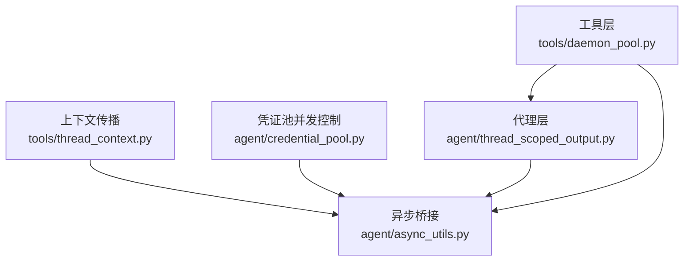
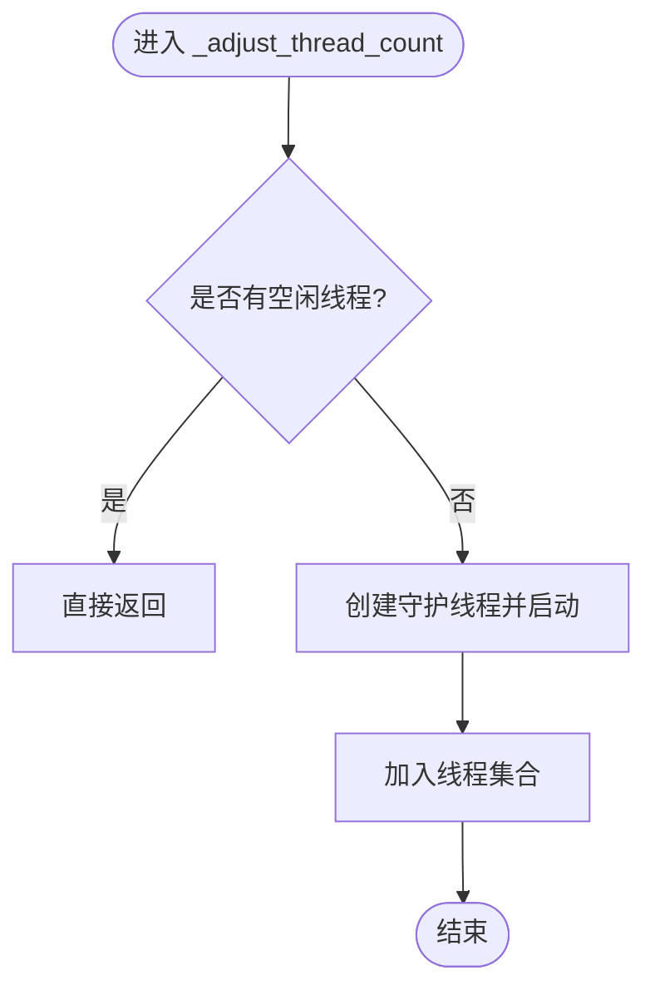
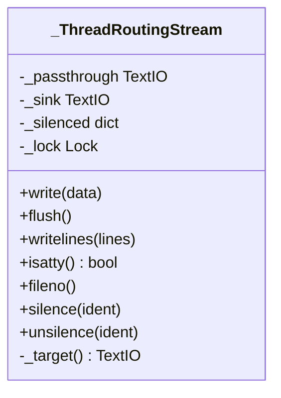
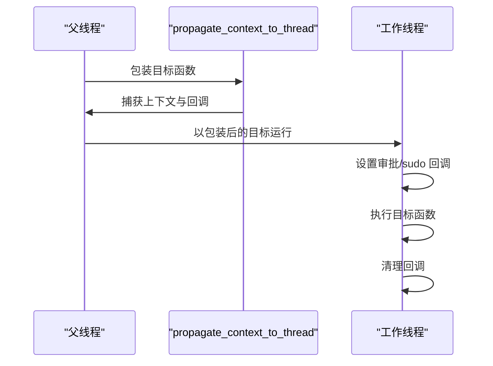
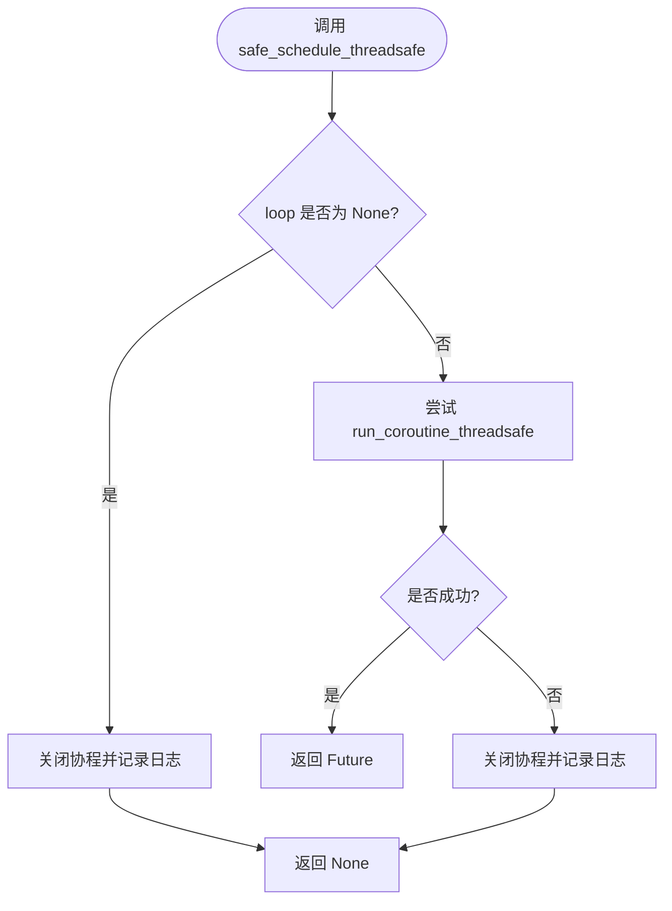
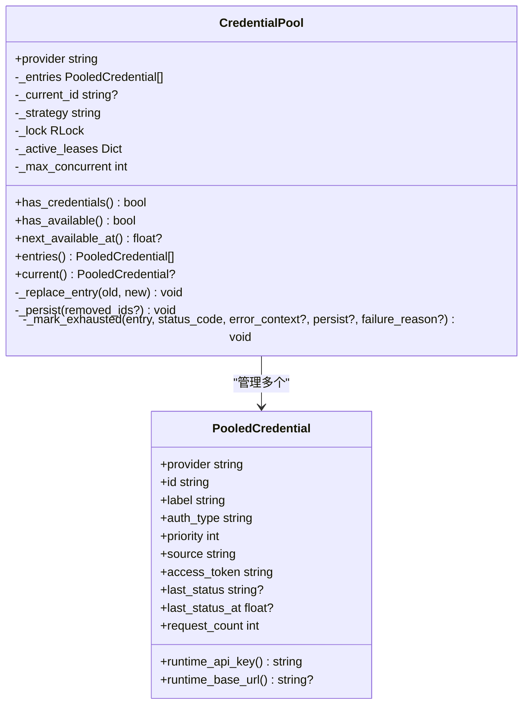
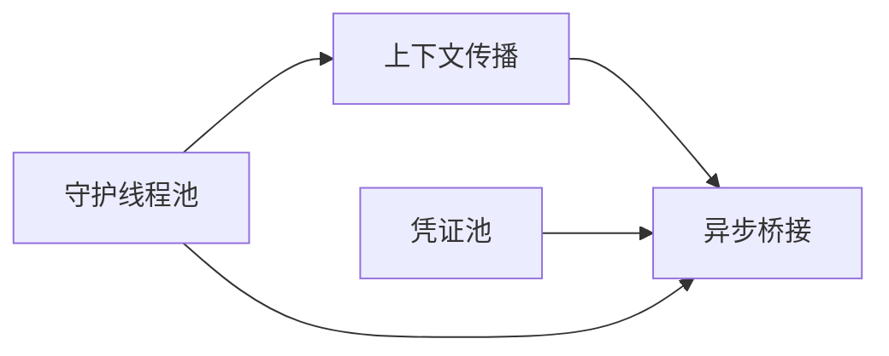

# 并行执行机制

<cite>
**本文引用的文件**
- [daemon_pool.py](file://tools/daemon_pool.py)
- [thread_scoped_output.py](file://agent/thread_scoped_output.py)
- [thread_context.py](file://tools/thread_context.py)
- [async_utils.py](file://agent/async_utils.py)
- [credential_pool.py](file://agent/credential_pool.py)
</cite>

## 目录
1. [简介](#简介)
2. [项目结构](#项目结构)
3. [核心组件](#核心组件)
4. [架构总览](#架构总览)
5. [详细组件分析](#详细组件分析)
6. [依赖关系分析](#依赖关系分析)
7. [性能考量](#性能考量)
8. [故障排查指南](#故障排查指南)
9. [结论](#结论)
10. [附录：配置与优化示例](#附录：配置与优化示例)

## 简介
本文件聚焦 Hermes Agent 的并行执行机制，围绕线程池管理、任务调度、并发控制、结果收集与处理、上下文传递、监控与调试等维度进行系统化说明。文档既为初学者提供并行编程基础概念，也为开发者提供可落地的调优与排障方法。

## 项目结构
与并行执行直接相关的核心模块分布在以下位置：
- 线程池与进程退出安全：tools/daemon_pool.py
- 线程级输出隔离：agent/thread_scoped_output.py
- 跨线程上下文传播：tools/thread_context.py
- 异步桥接与任务安全：agent/async_utils.py
- 凭证池与并发限制：agent/credential_pool.py



图表来源
- [daemon_pool.py:1-65](file://tools/daemon_pool.py#L1-L65)
- [thread_scoped_output.py:1-143](file://agent/thread_scoped_output.py#L1-L143)
- [thread_context.py:1-121](file://tools/thread_context.py#L1-L121)
- [async_utils.py:1-85](file://agent/async_utils.py#L1-L85)
- [credential_pool.py:633-714](file://agent/credential_pool.py#L633-L714)

章节来源
- [daemon_pool.py:1-65](file://tools/daemon_pool.py#L1-L65)
- [thread_scoped_output.py:1-143](file://agent/thread_scoped_output.py#L1-L143)
- [thread_context.py:1-121](file://tools/thread_context.py#L1-L121)
- [async_utils.py:1-85](file://agent/async_utils.py#L1-L85)
- [credential_pool.py:633-714](file://agent/credential_pool.py#L633-L714)

## 核心组件
- 守护线程池（DaemonThreadPoolExecutor）：基于标准库线程池实现，但使用守护线程并避免注册到全局退出队列，确保后台任务不会阻塞解释器退出。适用于“尽力而为”的任务，如并发工具调用、后台记忆同步、目录扇出、子代理超时包装等。
- 线程级输出隔离（thread_scoped_silence）：通过替换 sys.stdout/stderr 为按线程路由的代理，使后台工作线程的输出被静音，不影响其他线程（如事件循环线程）的终端输出。
- 上下文传播（propagate_context_to_thread）：在父线程捕获 contextvars 和审批/sudo 回调，并在子线程中恢复；线程结束时清理回调，防止回收线程持有过期引用。
- 异步桥接（safe_schedule_threadsafe / consume_detached_task_result）：从同步线程将协程安全地投递到事件循环，失败时关闭协程避免泄漏；对已取消或分离任务的异常进行静默消费，避免事件循环噪音。
- 凭证池并发控制（CredentialPool）：维护多凭证选择策略、冷却期、最大并发数（默认每凭证 1），并通过 RLock 保护状态变更，支持持久化与回退。

章节来源
- [daemon_pool.py:1-65](file://tools/daemon_pool.py#L1-L65)
- [thread_scoped_output.py:1-143](file://agent/thread_scoped_output.py#L1-L143)
- [thread_context.py:1-121](file://tools/thread_context.py#L1-L121)
- [async_utils.py:1-85](file://agent/async_utils.py#L1-L85)
- [credential_pool.py:633-714](file://agent/credential_pool.py#L633-L714)

## 架构总览
下图展示了从上层任务提交到执行、上下文传播、异步桥接以及结果处理的完整链路。

```mermaid
sequenceDiagram
participant Caller as "调用方"
participant Pool as "守护线程池<br/>DaemonThreadPoolExecutor"
participant Worker as "工作线程"
participant Ctx as "上下文传播<br/>propagate_context_to_thread"
participant Loop as "事件循环"
participant Task as "协程任务"
participant Result as "结果收集"
Caller->>Pool : 提交任务
Pool->>Worker : 分配工作线程
Worker->>Ctx : 捕获父线程上下文并包裹目标函数
Ctx-->>Worker : 带上下文的执行体
Worker->>Loop : safe_schedule_threadsafe(协程)
Loop->>Task : 调度执行
Task-->>Result : 返回结果或异常
Result-->>Caller : 回调/Future 结果
```

图表来源
- [daemon_pool.py:37-65](file://tools/daemon_pool.py#L37-L65)
- [thread_context.py:64-121](file://tools/thread_context.py#L64-L121)
- [async_utils.py:34-68](file://agent/async_utils.py#L34-L68)

## 详细组件分析

### 守护线程池（DaemonThreadPoolExecutor）
- 设计动机：标准库 ThreadPoolExecutor 的工作线程非守护且注册到全局退出队列，导致单个卡住的任务会阻止解释器退出。守护线程池通过创建守护线程并跳过注册，保证后台任务不阻塞进程退出。
- 关键行为：
  - 复用空闲线程，按需扩容至最大工作线程数。
  - 使用弱引用在工作对象销毁时将终止信号放入工作队列，避免僵尸线程。
  - 保持与标准库一致的初始化参数与工作队列语义。
- 适用场景：并发工具执行、后台记忆同步、目录扇出、子代理超时包装等“尽力而为”的任务。



图表来源
- [daemon_pool.py:40-65](file://tools/daemon_pool.py#L40-L65)

章节来源
- [daemon_pool.py:1-65](file://tools/daemon_pool.py#L1-L65)

### 线程级输出隔离（thread_scoped_silence）
- 问题背景：使用 contextlib.redirect_stdout/stderr 会修改进程级流，影响所有线程，导致事件循环线程或其他线程的打印丢失。
- 解决方案：安装一个按线程路由的代理，将“被静音”的线程写入空设备，其他线程直通原始流。通过登记/注销当前线程 ID 实现嵌套安全。
- 特性：
  - 幂等安装，永不卸载以避免竞态。
  - 对未注册线程仅增加一次属性查找开销。
  - 兼容 isatty/fileno/encoding 等属性访问。



图表来源
- [thread_scoped_output.py:35-104](file://agent/thread_scoped_output.py#L35-L104)

章节来源
- [thread_scoped_output.py:1-143](file://agent/thread_scoped_output.py#L1-L143)

### 上下文传播（propagate_context_to_thread）
- 作用：将父线程的 contextvars 与 CLI 审批/sudo 回调传播到工作线程，确保工具执行时的审批流程与网关会话上下文一致。
- 生命周期：
  - 在父线程捕获上下文与回调。
  - 在工作线程设置回调，执行完成后清理回调，避免回收线程持有过期引用。
  - 若回调安装失败，采用“失败关闭”策略，拒绝危险命令或阻塞网关审批队列。



图表来源
- [thread_context.py:64-121](file://tools/thread_context.py#L64-L121)

章节来源
- [thread_context.py:1-121](file://tools/thread_context.py#L1-L121)

### 异步桥接（safe_schedule_threadsafe / consume_detached_task_result）
- 安全调度：从同步线程将协程投递到事件循环，若失败（例如循环关闭）则关闭协程并返回 None，避免协程泄漏与警告。
- 结果消费：对已取消或分离的任务，读取异常但不抛出，避免事件循环日志噪音。
- 使用建议：调用方根据返回值分支处理；成功时自行决定等待或附加完成回调。



图表来源
- [async_utils.py:34-68](file://agent/async_utils.py#L34-L68)

章节来源
- [async_utils.py:1-85](file://agent/async_utils.py#L1-L85)

### 凭证池并发控制（CredentialPool）
- 并发限制：默认每个凭证的最大并发数为 1，可通过内部字段调整；适合需要串行化的认证令牌使用场景。
- 选择策略：支持填充优先、轮询、随机、最少使用等策略，由配置驱动。
- 冷却与回退：根据错误码与分类原因计算冷却时间；当唯一凭证被限流时缩短冷却窗口，避免长时间阻塞。
- 锁与持久化：使用 RLock 保护状态变更，支持延迟刷新路径下的序列化写回；失败关闭，避免破坏主流程。



图表来源
- [credential_pool.py:185-290](file://agent/credential_pool.py#L185-L290)
- [credential_pool.py:633-714](file://agent/credential_pool.py#L633-L714)

章节来源
- [credential_pool.py:185-290](file://agent/credential_pool.py#L185-L290)
- [credential_pool.py:633-714](file://agent/credential_pool.py#L633-L714)

## 依赖关系分析
- 守护线程池依赖标准库线程模型，避免全局退出钩子干扰。
- 上下文传播依赖 contextvars 与工具层的审批回调接口，采用惰性导入避免循环依赖。
- 异步桥接依赖 asyncio 事件循环，封装 run_coroutine_threadsafe 的安全边界。
- 凭证池依赖配置加载、认证存储与错误分类，使用 RLock 保证并发安全。



图表来源
- [daemon_pool.py:37-65](file://tools/daemon_pool.py#L37-L65)
- [thread_context.py:64-121](file://tools/thread_context.py#L64-L121)
- [async_utils.py:34-68](file://agent/async_utils.py#L34-L68)
- [credential_pool.py:633-714](file://agent/credential_pool.py#L633-L714)

章节来源
- [daemon_pool.py:1-65](file://tools/daemon_pool.py#L1-L65)
- [thread_context.py:1-121](file://tools/thread_context.py#L1-L121)
- [async_utils.py:1-85](file://agent/async_utils.py#L1-L85)
- [credential_pool.py:633-714](file://agent/credential_pool.py#L633-L714)

## 性能考量
- 线程池规模：守护线程池按需扩容，建议根据 CPU 核数与 I/O 密集型任务比例设置最大工作线程数，避免过度切换。
- 输出隔离开销：线程级输出代理引入额外属性查找，建议在高频路径中减少不必要的 print 或 stderr 写入。
- 异步桥接失败率：事件循环关闭或不可用时，调度失败会返回 None，应结合业务逻辑降级或重试。
- 凭证池并发：默认每凭证并发为 1，适合令牌串行化；在高吞吐场景下可评估放宽并发，但需考虑上游限流与计费限制。
- 日志风暴防护：凭证池对“无可用条目”的日志进行了节流，避免共享日志锁争用导致事件循环卡顿。

[本节为通用指导，无需具体文件来源]

## 故障排查指南
- 进程无法退出：检查是否存在非守护线程或仍在运行的前台任务；确认后台任务使用守护线程池。
- 输出丢失：确认后台任务使用 thread_scoped_silence 而非全局重定向；检查是否误将事件循环线程纳入静音范围。
- 审批失效：验证 propagate_context_to_thread 是否正确包裹目标函数；检查回调安装失败时的失败关闭路径。
- 协程泄漏：确认 safe_schedule_threadsafe 的失败路径是否关闭了协程；对 detached 任务使用 consume_detached_task_result 消费异常。
- 凭证耗尽：查看凭证池的冷却时间与策略；关注 401/429/402 的错误分类与重置时间；必要时扩展凭证数量或调整策略。

章节来源
- [daemon_pool.py:1-25](file://tools/daemon_pool.py#L1-L25)
- [thread_scoped_output.py:1-17](file://agent/thread_scoped_output.py#L1-L17)
- [thread_context.py:21-32](file://tools/thread_context.py#L21-L32)
- [async_utils.py:1-22](file://agent/async_utils.py#L1-L22)
- [credential_pool.py:120-152](file://agent/credential_pool.py#L120-L152)

## 结论
Hermes Agent 的并行执行机制通过守护线程池、线程级输出隔离、上下文传播、异步桥接与凭证池并发控制，构建了安全、可控且可扩展的并发基座。合理配置线程池规模、并发限制与日志节流，可有效提升吞吐与稳定性；借助内置的失败关闭与资源清理策略，可在复杂场景中保持系统健壮性。

[本节为总结，无需具体文件来源]

## 附录：配置与优化示例
以下为常见配置与优化实践（以代码片段路径代替具体代码内容）：
- 使用守护线程池执行后台任务
  - 参考路径：[daemon_pool.py:37-65](file://tools/daemon_pool.py#L37-L65)
- 在后台线程中静音输出，避免影响事件循环线程
  - 参考路径：[thread_scoped_output.py:125-143](file://agent/thread_scoped_output.py#L125-L143)
- 将审批与 sudo 回调传播到工作线程
  - 参考路径：[thread_context.py:64-121](file://tools/thread_context.py#L64-L121)
- 安全地将协程投递到事件循环
  - 参考路径：[async_utils.py:34-68](file://agent/async_utils.py#L34-L68)
- 调整凭证池并发与策略
  - 参考路径：[credential_pool.py:521-534](file://agent/credential_pool.py#L521-L534)、[credential_pool.py:633-647](file://agent/credential_pool.py#L633-L647)

章节来源
- [daemon_pool.py:37-65](file://tools/daemon_pool.py#L37-L65)
- [thread_scoped_output.py:125-143](file://agent/thread_scoped_output.py#L125-L143)
- [thread_context.py:64-121](file://tools/thread_context.py#L64-L121)
- [async_utils.py:34-68](file://agent/async_utils.py#L34-L68)
- [credential_pool.py:521-534](file://agent/credential_pool.py#L521-L534)
- [credential_pool.py:633-647](file://agent/credential_pool.py#L633-L647)