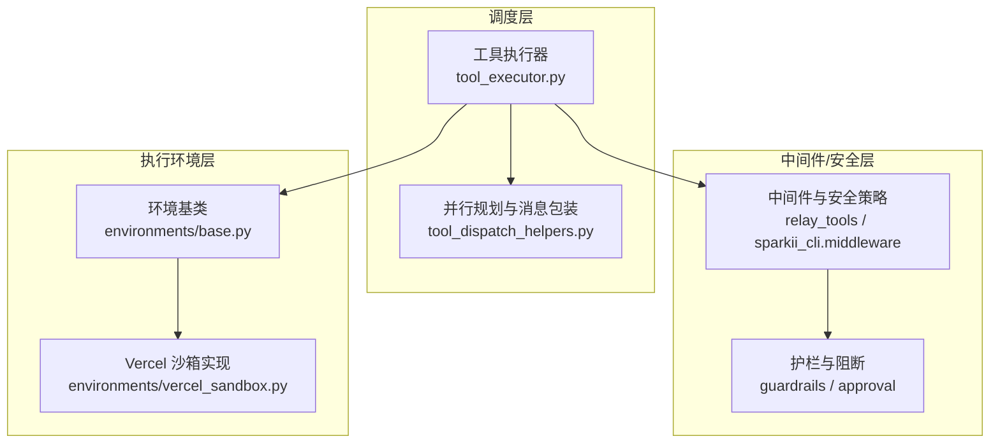
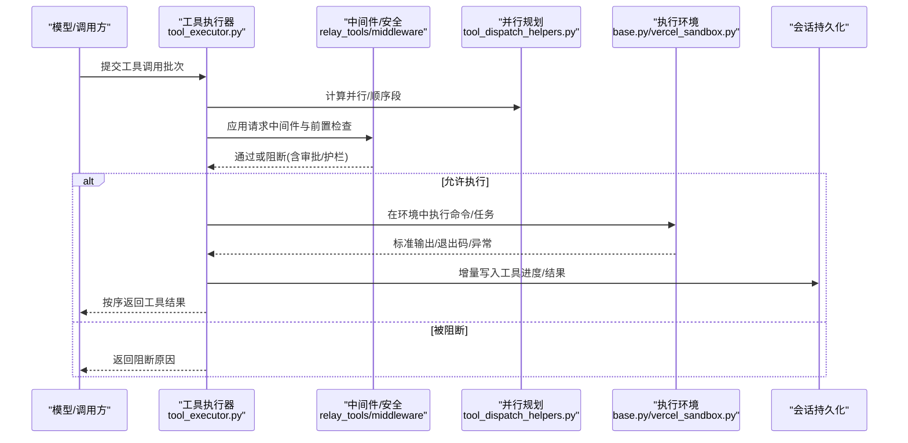
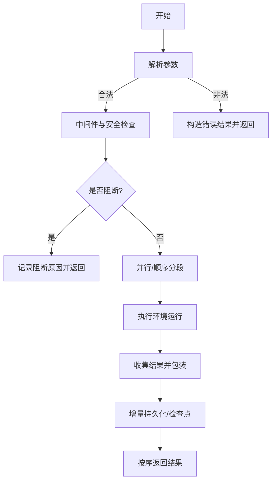
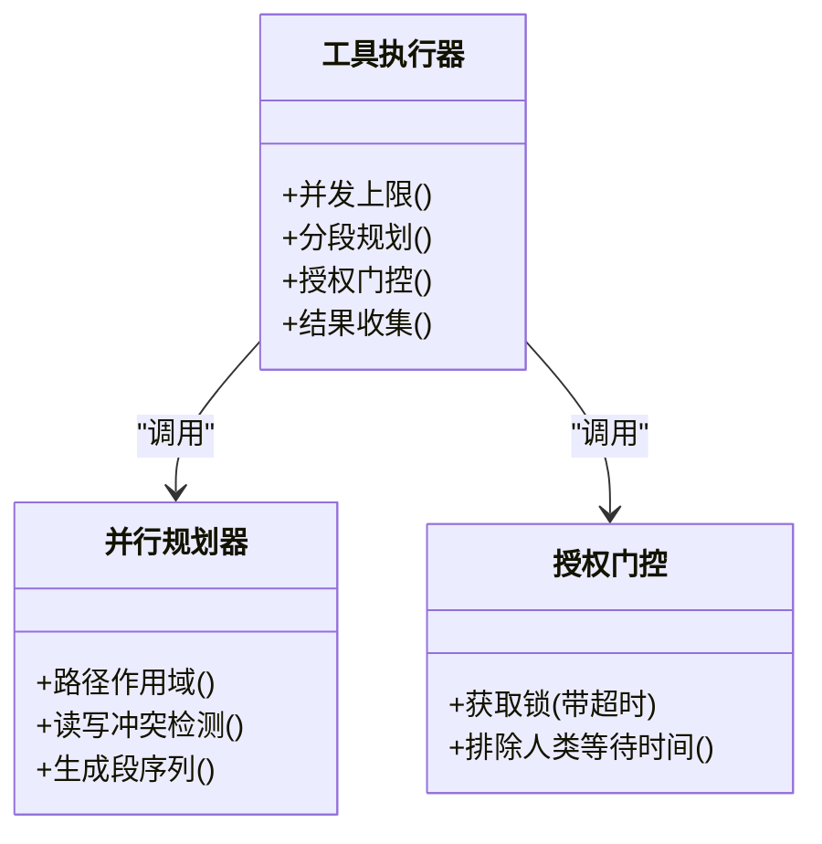
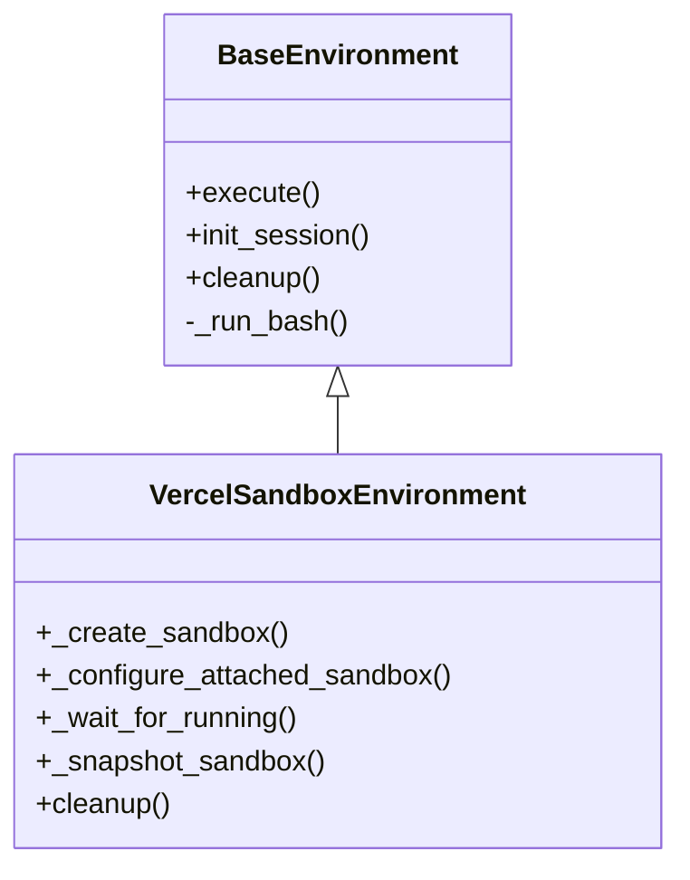
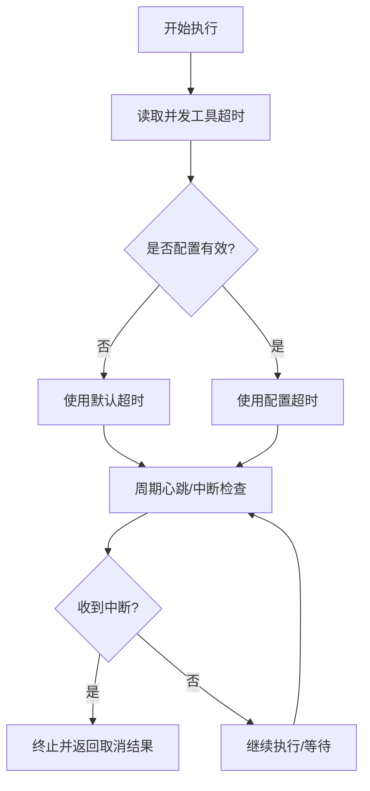
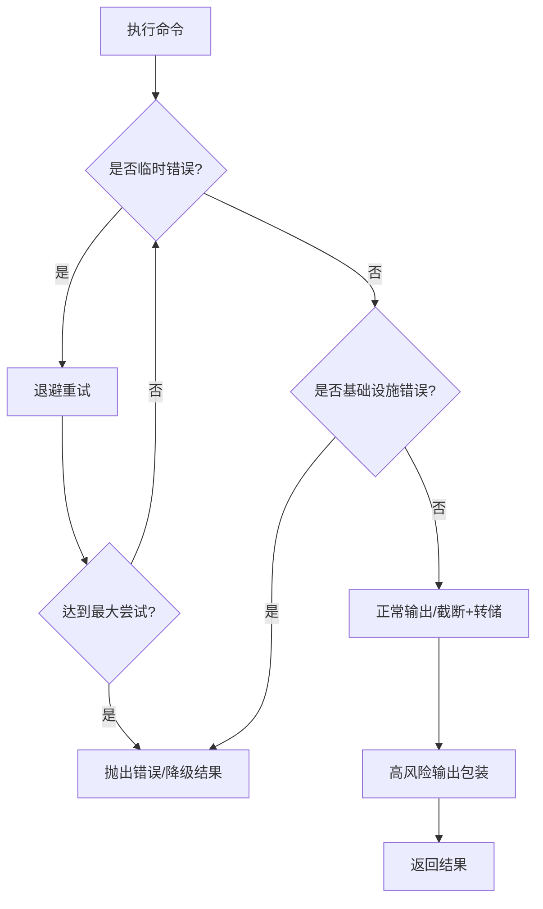
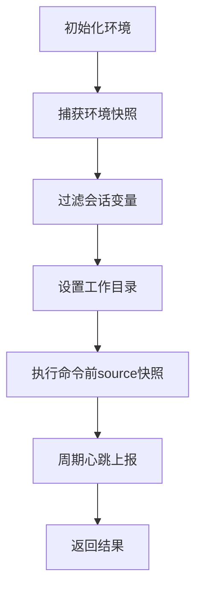
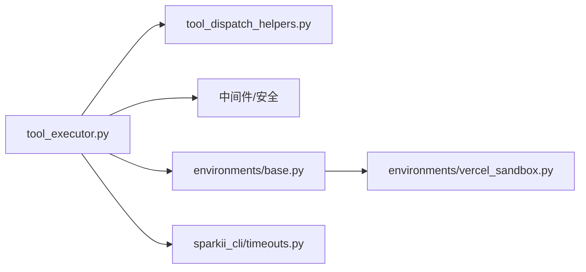

# 执行引擎

<cite>
**本文引用的文件**
- [agent/tool_executor.py](file://agent/tool_executor.py)
- [agent/tool_dispatch_helpers.py](file://agent/tool_dispatch_helpers.py)
- [tools/environments/base.py](file://tools/environments/base.py)
- [tools/environments/vercel_sandbox.py](file://tools/environments/vercel_sandbox.py)
- [sparkii_cli/timeouts.py](file://sparkii_cli/timeouts.py)
</cite>

## 目录
1. [简介](#简介)
2. [项目结构](#项目结构)
3. [核心组件](#核心组件)
4. [架构总览](#架构总览)
5. [详细组件分析](#详细组件分析)
6. [依赖关系分析](#依赖关系分析)
7. [性能考量](#性能考量)
8. [故障排查指南](#故障排查指南)
9. [结论](#结论)
10. [附录](#附录)

## 简介
本文件面向 Hermes Agent 的执行引擎，系统性说明工具调用的完整执行流程（从参数解析到结果返回）、并行执行机制、执行环境隔离、超时与中断处理、错误处理与重试策略，以及执行上下文管理。文档同时提供初学者友好的概念说明与开发者级别的高级定制与排错细节，并给出可定位的代码片段路径以便深入阅读实现。

## 项目结构
执行引擎由“调度层 + 中间件/安全层 + 执行环境层”构成：
- 调度层：负责工具调用批次的顺序规划、并发调度、结果收集与持久化。
- 中间件/安全层：负责请求改写、前置拦截、权限与安全策略、结果包装与风险标注。
- 执行环境层：统一封装不同后端（本地 shell、云端沙箱等）的命令执行、资源限制、快照与同步、清理与恢复。

**图表来源**
- [agent/tool_executor.py:758-800](file://agent/tool_executor.py#L758-L800)
- [agent/tool_dispatch_helpers.py:116-234](file://agent/tool_dispatch_helpers.py#L116-L234)
- [tools/environments/base.py:581-648](file://tools/environments/base.py#L581-L648)
- [tools/environments/vercel_sandbox.py:243-342](file://tools/environments/vercel_sandbox.py#L243-L342)

**章节来源**
- [agent/tool_executor.py:758-800](file://agent/tool_executor.py#L758-L800)
- [agent/tool_dispatch_helpers.py:116-234](file://agent/tool_dispatch_helpers.py#L116-L234)
- [tools/environments/base.py:581-648](file://tools/environments/base.py#L581-L648)
- [tools/environments/vercel_sandbox.py:243-342](file://tools/environments/vercel_sandbox.py#L243-L342)

## 核心组件
- 工具执行器：负责解析参数、构建任务段、并发调度、结果收集、预算控制、进度与持久化。
- 并行规划器：基于工具类型、路径作用域与互斥规则，将批次切分为“并行段”和“顺序段”，保证结果顺序与副作用边界。
- 执行环境抽象：统一命令执行接口，支持进程/SDK 适配、输出截断与溢出转储、活动心跳上报、CWD 跟踪与环境快照。
- 沙箱实现：以 Vercel Sandbox 为例，展示云沙箱的创建、状态等待、文件同步、快照保存与清理。
- 超时配置：提供提供者级请求/陈旧超时读取能力，便于上层统一治理。

**章节来源**
- [agent/tool_executor.py:141-176](file://agent/tool_executor.py#L141-L176)
- [agent/tool_dispatch_helpers.py:116-234](file://agent/tool_dispatch_helpers.py#L116-L234)
- [tools/environments/base.py:81-231](file://tools/environments/base.py#L81-L231)
- [tools/environments/vercel_sandbox.py:306-342](file://tools/environments/vercel_sandbox.py#L306-L342)
- [sparkii_cli/timeouts.py:14-40](file://sparkii_cli/timeouts.py#L14-L40)

## 架构总览
下图展示了从模型发起工具调用到最终结果返回的关键路径，包括中间件链、授权门控、并行调度、环境执行与结果包装。

**图表来源**
- [agent/tool_executor.py:482-662](file://agent/tool_executor.py#L482-L662)
- [agent/tool_dispatch_helpers.py:116-234](file://agent/tool_dispatch_helpers.py#L116-L234)
- [tools/environments/base.py:688-800](file://tools/environments/base.py#L688-L800)
- [tools/environments/vercel_sandbox.py:398-421](file://tools/environments/vercel_sandbox.py#L398-L421)

## 详细组件分析

### 工具调用执行流程（参数解析 → 中间件 → 调度 → 执行 → 结果）
- 参数解析：对模型输出的原始参数进行 JSON 解析与校验，非法时直接构造错误结果并跳过执行。
- 中间件与安全：依次执行请求改写、前置拦截（插件/护栏/审批），确保仅一次真实派发；若被阻断则记录追踪并返回。
- 并行规划：根据工具类型与作用域（读/写路径）将批次拆分为并行段与顺序段，避免冲突并保持顺序。
- 执行与监控：进入具体执行环境，启动命令/任务；期间周期性上报活动心跳，支持 UI 与网关侧感知。
- 结果收集与持久化：按原顺序收集结果，必要时进行多模态摘要与不可信内容包装，增量写入会话数据库，保障破坏性操作前的检查点。

**图表来源**
- [agent/tool_executor.py:141-176](file://agent/tool_executor.py#L141-L176)
- [agent/tool_executor.py:482-662](file://agent/tool_executor.py#L482-L662)
- [agent/tool_dispatch_helpers.py:116-234](file://agent/tool_dispatch_helpers.py#L116-L234)
- [tools/environments/base.py:688-800](file://tools/environments/base.py#L688-L800)

**章节来源**
- [agent/tool_executor.py:141-176](file://agent/tool_executor.py#L141-L176)
- [agent/tool_executor.py:482-662](file://agent/tool_executor.py#L482-L662)
- [agent/tool_dispatch_helpers.py:116-234](file://agent/tool_dispatch_helpers.py#L116-L234)

### 并行执行机制（线程池、任务调度、结果收集）
- 工作线程上限：默认最大并发工作线程数固定，图像生成等慢速工具会进一步降低并发以避免后端限流。
- 任务分段：依据工具类型与作用域（读/写路径）划分并行段；同一并行段内保留原顺序语义，跨段之间串行。
- 授权门控：对需要人类审批或策略提示的请求进行序列化，避免界面交错；同时排除人类等待时间对批截止的影响。
- 结果收集：使用有序容器收集各任务结果，确保 API 看到的顺序与模型期望一致。

**图表来源**
- [agent/tool_executor.py:93-111](file://agent/tool_executor.py#L93-L111)
- [agent/tool_executor.py:391-468](file://agent/tool_executor.py#L391-L468)
- [agent/tool_dispatch_helpers.py:116-234](file://agent/tool_dispatch_helpers.py#L116-L234)

**章节来源**
- [agent/tool_executor.py:93-111](file://agent/tool_executor.py#L93-L111)
- [agent/tool_executor.py:391-468](file://agent/tool_executor.py#L391-L468)
- [agent/tool_dispatch_helpers.py:116-234](file://agent/tool_dispatch_helpers.py#L116-L234)

### 执行环境隔离（沙箱安全、资源限制、进程隔离）
- 统一接口：所有后端继承 BaseEnvironment，暴露 execute/init_session/cleanup 等统一方法，屏蔽底层差异。
- 进程/SDK 适配：本地通过子进程执行 bash；云端 SDK（如 Vercel）通过 _ThreadedProcessHandle 适配为进程句柄，支持 kill/wait。
- 资源限制：沙箱创建时可指定 CPU/内存/磁盘等资源；云端沙箱具备最小运行时长与状态等待，失败自动重建。
- 快照与同步：初始化时捕获登录 Shell 环境（函数、别名、选项），后续命令 source 该快照；文件通过 FileSyncManager 双向同步。
- 清理与恢复：结束时回写变更、保存快照、停止沙箱并关闭客户端，防止资源泄漏。

**图表来源**
- [tools/environments/base.py:581-648](file://tools/environments/base.py#L581-L648)
- [tools/environments/vercel_sandbox.py:243-342](file://tools/environments/vercel_sandbox.py#L243-L342)
- [tools/environments/vercel_sandbox.py:398-421](file://tools/environments/vercel_sandbox.py#L398-L421)
- [tools/environments/vercel_sandbox.py:639-663](file://tools/environments/vercel_sandbox.py#L639-L663)

**章节来源**
- [tools/environments/base.py:581-648](file://tools/environments/base.py#L581-L648)
- [tools/environments/vercel_sandbox.py:243-342](file://tools/environments/vercel_sandbox.py#L243-L342)
- [tools/environments/vercel_sandbox.py:398-421](file://tools/environments/vercel_sandbox.py#L398-L421)
- [tools/environments/vercel_sandbox.py:639-663](file://tools/environments/vercel_sandbox.py#L639-L663)

### 超时控制与中断处理
- 并发工具超时：可通过环境变量配置并发工具批次的整体超时；无效值回退到默认值。
- 提供者超时：可从配置中读取特定提供者/模型的请求超时与陈旧超时，用于网络与长轮询场景。
- 中断与心跳：执行过程中周期性上报活动心跳；支持用户中断，中断后快速终止并返回取消结果。
- 沙箱超时：云端沙箱具备最小运行等待与状态检查，超时或进入终态则抛出明确错误并重建。

**图表来源**
- [agent/tool_executor.py:160-176](file://agent/tool_executor.py#L160-L176)
- [sparkii_cli/timeouts.py:14-40](file://sparkii_cli/timeouts.py#L14-L40)
- [tools/environments/base.py:233-273](file://tools/environments/base.py#L233-L273)
- [tools/environments/vercel_sandbox.py:398-421](file://tools/environments/vercel_sandbox.py#L398-L421)

**章节来源**
- [agent/tool_executor.py:160-176](file://agent/tool_executor.py#L160-L176)
- [sparkii_cli/timeouts.py:14-40](file://sparkii_cli/timeouts.py#L14-L40)
- [tools/environments/base.py:233-273](file://tools/environments/base.py#L233-L273)
- [tools/environments/vercel_sandbox.py:398-421](file://tools/environments/vercel_sandbox.py#L398-L421)

### 错误处理与重试机制
- 网络与临时错误：云端沙箱对特定 HTTP 状态码与网络异常识别为临时错误，采用指数退避重试。
- 基础设施错误：当后端不可达（连接/同步失败）时抛出结构化错误，工具层将其转为降级结果并提示重试。
- 输出限制与溢出：大输出采用头尾窗口保留，超出阈值时转储至 spill 文件，避免内存膨胀与磁盘耗尽。
- 结果分类与包装：对高风险工具输出进行不可信数据包装，降低间接提示注入风险。

**图表来源**
- [tools/environments/vercel_sandbox.py:98-135](file://tools/environments/vercel_sandbox.py#L98-L135)
- [tools/environments/base.py:55-79](file://tools/environments/base.py#L55-L79)
- [tools/environments/base.py:81-231](file://tools/environments/base.py#L81-L231)
- [agent/tool_dispatch_helpers.py:533-707](file://agent/tool_dispatch_helpers.py#L533-L707)

**章节来源**
- [tools/environments/vercel_sandbox.py:98-135](file://tools/environments/vercel_sandbox.py#L98-L135)
- [tools/environments/base.py:55-79](file://tools/environments/base.py#L55-L79)
- [tools/environments/base.py:81-231](file://tools/environments/base.py#L81-L231)
- [agent/tool_dispatch_helpers.py:533-707](file://agent/tool_dispatch_helpers.py#L533-L707)

### 执行上下文管理（环境变量、工作目录、状态共享）
- 环境变量传递：初始化时捕获登录 Shell 的环境快照（函数、别名、选项），每次命令前 source 该快照；过滤掉每会话桥接变量，避免跨会话泄露。
- 工作目录设置：通过标记与临时文件在远程/本地保持 CWD 一致性；云端沙箱支持自定义 cwd 与 home 探测。
- 状态共享：通过活动回调与心跳机制，将长时间运行的执行状态上报给网关/UI；中间件链路携带 task_id/turn_id/api_request_id/tool_call_id 等上下文元数据。

**图表来源**
- [tools/environments/base.py:688-800](file://tools/environments/base.py#L688-L800)
- [tools/environments/base.py:506-573](file://tools/environments/base.py#L506-L573)
- [tools/environments/vercel_sandbox.py:344-367](file://tools/environments/vercel_sandbox.py#L344-L367)
- [agent/tool_executor.py:665-756](file://agent/tool_executor.py#L665-L756)

**章节来源**
- [tools/environments/base.py:688-800](file://tools/environments/base.py#L688-L800)
- [tools/environments/base.py:506-573](file://tools/environments/base.py#L506-L573)
- [tools/environments/vercel_sandbox.py:344-367](file://tools/environments/vercel_sandbox.py#L344-L367)
- [agent/tool_executor.py:665-756](file://agent/tool_executor.py#L665-L756)

## 依赖关系分析
- 工具执行器依赖并行规划器与安全中间件，决定何时并行、何时顺序，以及是否放行。
- 执行环境抽象被多种后端复用，Vercel 沙箱作为典型云端实现，提供状态机与文件同步。
- 超时配置模块为上层提供统一的超时读取入口，便于集中治理。

**图表来源**
- [agent/tool_executor.py:758-800](file://agent/tool_executor.py#L758-L800)
- [agent/tool_dispatch_helpers.py:116-234](file://agent/tool_dispatch_helpers.py#L116-L234)
- [tools/environments/base.py:581-648](file://tools/environments/base.py#L581-L648)
- [tools/environments/vercel_sandbox.py:243-342](file://tools/environments/vercel_sandbox.py#L243-L342)
- [sparkii_cli/timeouts.py:14-40](file://sparkii_cli/timeouts.py#L14-L40)

**章节来源**
- [agent/tool_executor.py:758-800](file://agent/tool_executor.py#L758-L800)
- [agent/tool_dispatch_helpers.py:116-234](file://agent/tool_dispatch_helpers.py#L116-L234)
- [tools/environments/base.py:581-648](file://tools/environments/base.py#L581-L648)
- [tools/environments/vercel_sandbox.py:243-342](file://tools/environments/vercel_sandbox.py#L243-L342)
- [sparkii_cli/timeouts.py:14-40](file://sparkii_cli/timeouts.py#L14-L40)

## 性能考量
- 并发度调优：根据工具类型（尤其是图像生成）动态调整最大工作线程数，避免后端限流与 TTFB 抖动。
- 输出截断与转储：大输出采用头尾窗口与 spill 文件，既控制内存占用又保留完整日志以供回溯。
- 快照与同步：云端沙箱的文件同步批量上传/下载，减少往返次数；快照原子替换避免并发读取不一致。
- 超时与重试：合理设置并发工具超时与提供者超时，结合临时错误重试，提升鲁棒性与吞吐。

[本节为通用指导，不直接分析具体文件]

## 故障排查指南
- 工具参数非法：检查模型输出的参数是否为合法 JSON 对象；非法将被拒绝并返回错误信息。
- 工具被阻断：查看中间件与护栏返回的阻断原因（插件阻断、护栏策略、审批未通过）。
- 沙箱不可用：确认云端沙箱状态与网络连接；若进入终态或无法到达 RUNNING，将触发重建。
- 输出过大：检查 spill 文件路径与大小限制；必要时调整输出限制或分批处理。
- 超时问题：核对并发工具超时、提供者超时配置；必要时延长或拆分任务。

**章节来源**
- [agent/tool_executor.py:141-176](file://agent/tool_executor.py#L141-L176)
- [agent/tool_executor.py:482-662](file://agent/tool_executor.py#L482-L662)
- [tools/environments/vercel_sandbox.py:398-421](file://tools/environments/vercel_sandbox.py#L398-L421)
- [tools/environments/base.py:81-231](file://tools/environments/base.py#L81-L231)
- [sparkii_cli/timeouts.py:14-40](file://sparkii_cli/timeouts.py#L14-L40)

## 结论
Hermes Agent 的执行引擎通过“调度层 + 中间件/安全层 + 执行环境层”的分层设计，实现了高可靠、可扩展的工具执行能力。其并行规划、授权门控、环境隔离、超时与中断、错误重试与输出控制共同保障了复杂工作负载下的稳定性与可观测性。开发者可基于统一接口扩展新的执行后端，并通过中间件与策略增强安全性与可定制性。

[本节为总结，不直接分析具体文件]

## 附录
- 关键代码片段路径（便于深入阅读）：
  - 参数解析与并发超时：[agent/tool_executor.py:141-176](file://agent/tool_executor.py#L141-L176)
  - 中间件与安全策略：[agent/tool_executor.py:482-662](file://agent/tool_executor.py#L482-L662)
  - 并行规划与路径作用域：[agent/tool_dispatch_helpers.py:116-234](file://agent/tool_dispatch_helpers.py#L116-L234)
  - 环境基类与快照：[tools/environments/base.py:688-800](file://tools/environments/base.py#L688-L800)
  - Vercel 沙箱创建与状态等待：[tools/environments/vercel_sandbox.py:306-421](file://tools/environments/vercel_sandbox.py#L306-L421)
  - 提供者超时读取：[sparkii_cli/timeouts.py:14-40](file://sparkii_cli/timeouts.py#L14-L40)

[本节为索引，不直接分析具体文件]