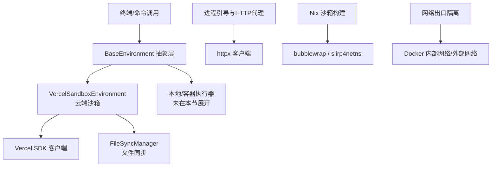
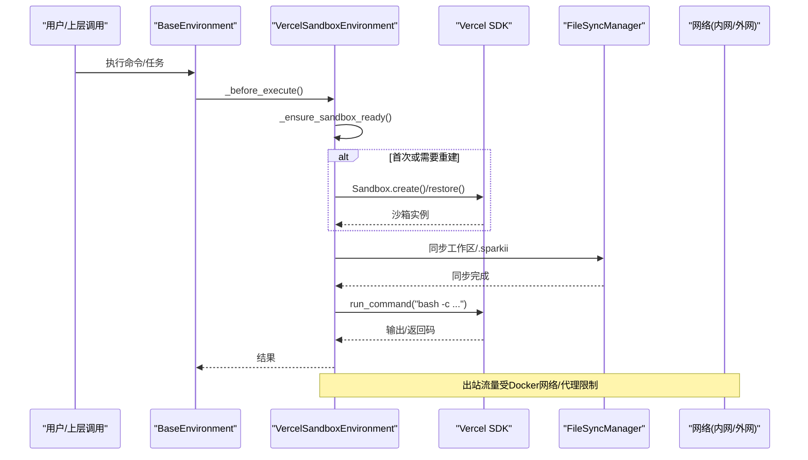
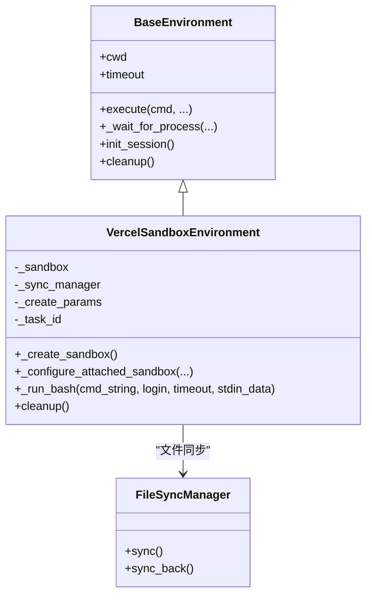
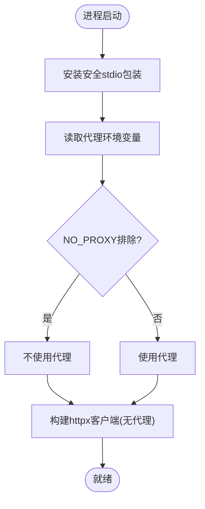
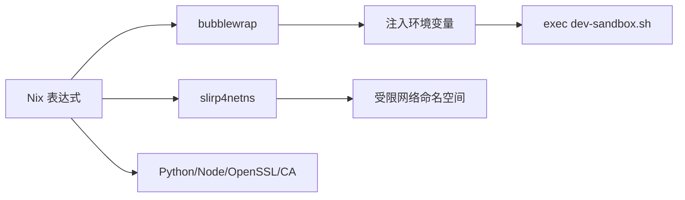
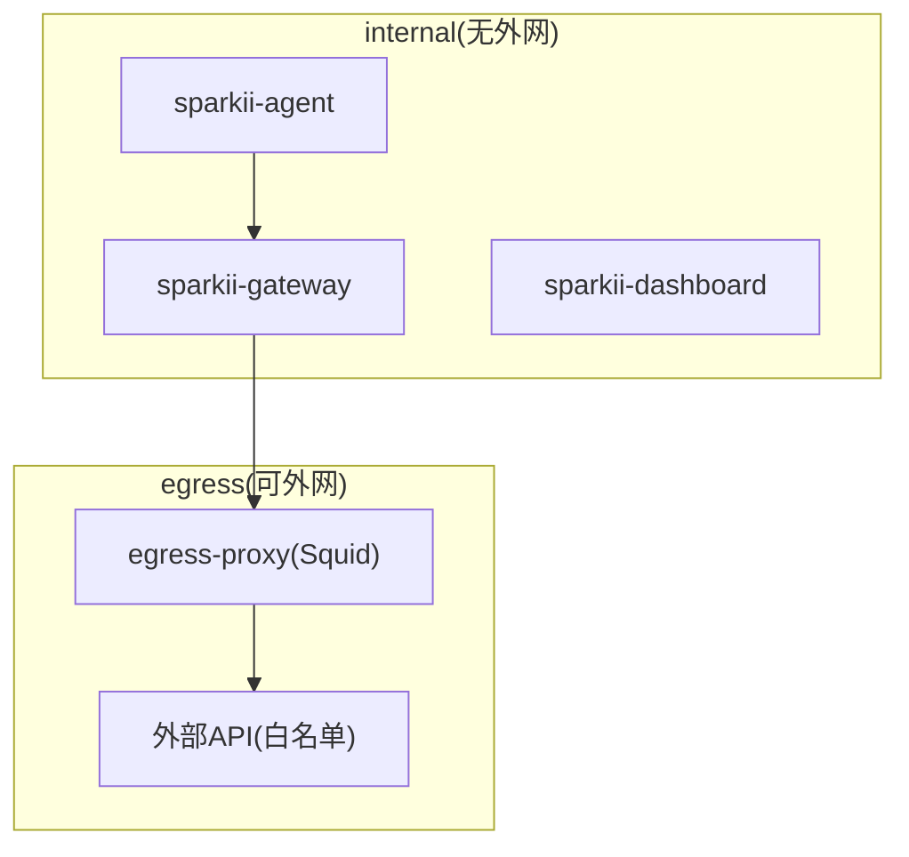
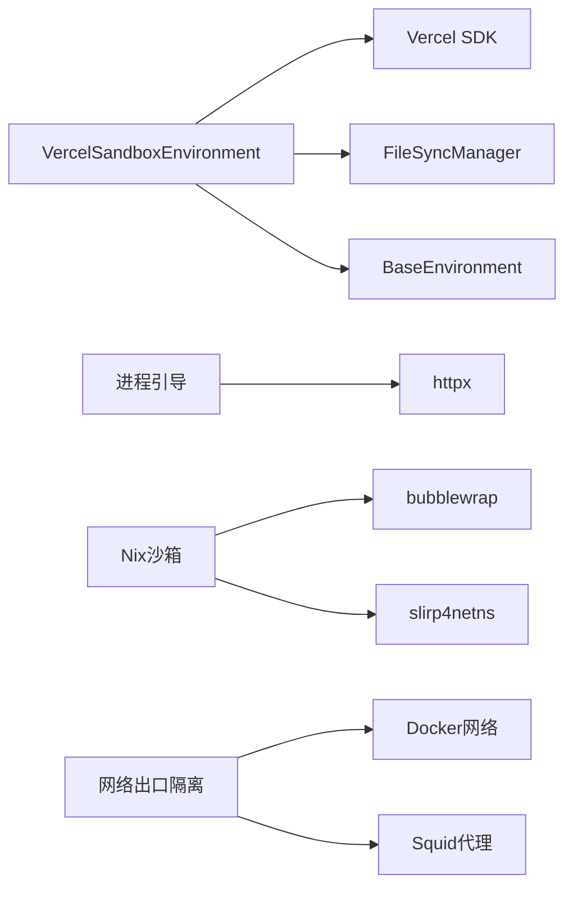

# 执行环境隔离

<cite>
**本文引用的文件**
- [tools/environments/vercel_sandbox.py](file://tools/environments/vercel_sandbox.py)
- [agent/process_bootstrap.py](file://agent/process_bootstrap.py)
- [nix/sandbox.nix](file://nix/sandbox.nix)
- [docs/security/network-egress-isolation.md](file://docs/security/network-egress-isolation.md)
- [tools/path_security.py](file://tools/path_security.py)
- [agent/file_safety.py](file://agent/file_safety.py)
</cite>

## 目录
1. [简介](#简介)
2. [项目结构](#项目结构)
3. [核心组件](#核心组件)
4. [架构总览](#架构总览)
5. [详细组件分析](#详细组件分析)
6. [依赖关系分析](#依赖关系分析)
7. [性能考量](#性能考量)
8. [故障排查指南](#故障排查指南)
9. [结论](#结论)
10. [附录](#附录)

## 简介
本文件面向Sparkii Agent的执行环境隔离系统，系统性阐述沙箱安全机制、进程隔离策略、环境变量管理、工作目录与路径解析、内存隔离与资源共享、以及安全审计与监控。内容既适合初学者理解“什么是执行环境隔离”，也为开发者提供可落地的自定义隔离策略与安全加固细节。

## 项目结构
围绕执行环境隔离的关键代码与配置分布在以下位置：
- 云端沙箱后端实现：tools/environments/vercel_sandbox.py
- 进程启动与网络代理：agent/process_bootstrap.py
- 本地开发沙箱构建（Nix + bubblewrap）：nix/sandbox.nix
- 容器网络出口隔离指南：docs/security/network-egress-isolation.md
- 路径安全校验工具：tools/path_security.py
- 文件系统安全策略：agent/file_safety.py

图表来源
- [tools/environments/vercel_sandbox.py:243-663](file://tools/environments/vercel_sandbox.py#L243-L663)
- [agent/process_bootstrap.py:145-201](file://agent/process_bootstrap.py#L145-L201)
- [nix/sandbox.nix:89-123](file://nix/sandbox.nix#L89-L123)
- [docs/security/network-egress-isolation.md:23-154](file://docs/security/network-egress-isolation.md#L23-L154)

章节来源
- [tools/environments/vercel_sandbox.py:243-663](file://tools/environments/vercel_sandbox.py#L243-L663)
- [agent/process_bootstrap.py:145-201](file://agent/process_bootstrap.py#L145-L201)
- [nix/sandbox.nix:89-123](file://nix/sandbox.nix#L89-L123)
- [docs/security/network-egress-isolation.md:23-154](file://docs/security/network-egress-isolation.md#L23-L154)

## 核心组件
- VercelSandboxEnvironment：基于Vercel SDK的云端沙箱后端，负责创建/恢复沙箱、资源限制、工作目录设置、文件同步、命令执行与清理。
- 进程引导与HTTP代理：为Agent进程提供安全的stdio包装、代理解析与keepalive HTTP客户端构建，确保网络访问受控。
- Nix沙箱构建：通过bubblewrap和slirp4netns等工具在本地构建受限运行环境，注入必要运行时与证书。
- 网络出口隔离：通过Docker网络分段与可选HTTP代理（如Squid）限制出站流量，仅允许白名单主机。
- 路径与文件系统安全：对相对路径、符号链接、跨平台兼容进行校验与保护；结合会话级文件镜像与同步。

章节来源
- [tools/environments/vercel_sandbox.py:243-663](file://tools/environments/vercel_sandbox.py#L243-L663)
- [agent/process_bootstrap.py:112-201](file://agent/process_bootstrap.py#L112-L201)
- [nix/sandbox.nix:89-123](file://nix/sandbox.nix#L89-L123)
- [docs/security/network-egress-isolation.md:23-154](file://docs/security/network-egress-isolation.md#L23-L154)
- [tools/path_security.py](file://tools/path_security.py)
- [agent/file_safety.py](file://agent/file_safety.py)

## 架构总览
下图展示了从命令到沙箱执行的端到端流程，包括网络出口控制与文件同步。

图表来源
- [tools/environments/vercel_sandbox.py:477-637](file://tools/environments/vercel_sandbox.py#L477-L637)
- [docs/security/network-egress-isolation.md:23-154](file://docs/security/network-egress-isolation.md#L23-L154)

## 详细组件分析

### VercelSandboxEnvironment（云端沙箱）
- 生命周期管理
  - 创建/恢复：支持按task_id恢复快照，失败时回退新建；具备重试与临时错误识别。
  - 状态等待：等待RUNNING状态，遇到终止态抛出明确异常。
  - 清理：停止沙箱、关闭客户端、可选快照持久化。
- 资源限制
  - CPU/内存/Disk：通过Resources配置vcpus与memory；Disk使用默认共享设置，不支持自定义容器磁盘大小。
- 工作目录与Home
  - 自动检测workspace_root与remote_home；支持~与默认工作目录映射。
- 文件同步
  - 通过FileSyncManager将宿主机的“.sparkii”目录与沙箱内对应目录双向同步，批量上传/下载并清理临时文件。
- 命令执行
  - 以bash -c/-lc方式执行；stdin采用heredoc模式由基类处理；超时通过基类取消函数终止沙箱。

图表来源
- [tools/environments/vercel_sandbox.py:243-663](file://tools/environments/vercel_sandbox.py#L243-L663)

章节来源
- [tools/environments/vercel_sandbox.py:243-663](file://tools/environments/vercel_sandbox.py#L243-L663)

### 进程引导与HTTP代理（进程隔离与网络控制）
- 安全stdio包装：捕获OSError/ValueError避免管道断裂导致崩溃。
- 代理解析：读取HTTPS_PROXY/HTTP_PROXY/ALL_PROXY及其小写变体；尊重NO_PROXY排除列表。
- keepalive HTTP客户端：显式配置连接池、超时与传输挂载，禁用默认trust_env时的系统代理差异问题，保证SSL验证一致。

图表来源
- [agent/process_bootstrap.py:63-143](file://agent/process_bootstrap.py#L63-L143)
- [agent/process_bootstrap.py:145-201](file://agent/process_bootstrap.py#L145-L201)

章节来源
- [agent/process_bootstrap.py:63-201](file://agent/process_bootstrap.py#L63-L201)

### Nix沙箱构建（本地受限环境）
- 通过bubblewrap与slirp4netns构建最小化运行环境，注入Python、Node、OpenSSL、CA证书等依赖。
- 导出关键环境变量指向动态链接器、Node目录、Electron库路径与沙箱资源目录，最终执行dev-sandbox.sh。

图表来源
- [nix/sandbox.nix:89-123](file://nix/sandbox.nix#L89-L123)

章节来源
- [nix/sandbox.nix:89-123](file://nix/sandbox.nix#L89-L123)

### 网络出口隔离（Docker部署）
- 双网络模型：internal（无默认路由）与egress（可访问互联网），gateway双网卡桥接两者。
- 可选HTTP代理（如Squid）实现严格白名单出站控制。
- 提供验证脚本与常见限制说明（DNS解析、平台适配器需求）。

图表来源
- [docs/security/network-egress-isolation.md:23-154](file://docs/security/network-egress-isolation.md#L23-L154)

章节来源
- [docs/security/network-egress-isolation.md:23-154](file://docs/security/network-egress-isolation.md#L23-L154)

### 路径与文件系统安全
- 路径安全：对相对路径、符号链接等进行校验，防止越权访问与路径穿越。
- 文件安全策略：结合会话级文件镜像与同步，确保沙箱内外数据一致性且可控。

章节来源
- [tools/path_security.py](file://tools/path_security.py)
- [agent/file_safety.py](file://agent/file_safety.py)

## 依赖关系分析
- VercelSandboxEnvironment依赖：
  - Vercel SDK（懒加载，按需安装）
  - FileSyncManager（文件同步）
  - BaseEnvironment（统一执行接口）
- 进程引导依赖：
  - httpx（HTTP客户端）
  - 环境变量（代理与NO_PROXY）
- Nix沙箱依赖：
  - bubblewrap、slirp4netns、Python/Node/OpenSSL/CA证书
- 网络出口隔离依赖：
  - Docker网络、可选Squid代理

图表来源
- [tools/environments/vercel_sandbox.py:243-663](file://tools/environments/vercel_sandbox.py#L243-L663)
- [agent/process_bootstrap.py:145-201](file://agent/process_bootstrap.py#L145-L201)
- [nix/sandbox.nix:89-123](file://nix/sandbox.nix#L89-L123)
- [docs/security/network-egress-isolation.md:23-154](file://docs/security/network-egress-isolation.md#L23-L154)

章节来源
- [tools/environments/vercel_sandbox.py:243-663](file://tools/environments/vercel_sandbox.py#L243-L663)
- [agent/process_bootstrap.py:145-201](file://agent/process_bootstrap.py#L145-L201)
- [nix/sandbox.nix:89-123](file://nix/sandbox.nix#L89-L123)
- [docs/security/network-egress-isolation.md:23-154](file://docs/security/network-egress-isolation.md#L23-L154)

## 性能考量
- 懒加载与缓存：Vercel SDK按需导入，状态类型与方法缓存减少重复开销。
- 重试与退避：针对临时网络错误进行指数退避重试，提高鲁棒性。
- 连接池与超时：httpx客户端配置合理的连接池与超时，避免长连接耗尽与握手阻塞。
- 文件同步批量化：bulk upload/download减少往返次数，提升大文件场景效率。
- 资源限制：CPU/内存限制避免沙箱过度占用宿主资源。

[本节为通用指导，不直接分析具体文件]

## 故障排查指南
- 沙箱无法进入RUNNING状态
  - 检查是否处于终止态（ABORTED/FAILED/STOPPED），必要时重建沙箱。
  - 参考：等待状态与异常抛出的逻辑。
- 快照恢复失败
  - 记录警告日志并回退新建沙箱；确认task_id与快照存储。
- 文件同步失败
  - 检查上传/删除命令返回码；确认远程路径与工作目录。
- 网络不可达
  - 验证Docker网络配置与代理白名单；使用提供的验证命令测试连通性。
- 代理不生效
  - 检查HTTPS_PROXY/HTTP_PROXY/ALL_PROXY及NO_PROXY；确认base_url主机名未被排除。

章节来源
- [tools/environments/vercel_sandbox.py:398-421](file://tools/environments/vercel_sandbox.py#L398-L421)
- [tools/environments/vercel_sandbox.py:448-475](file://tools/environments/vercel_sandbox.py#L448-L475)
- [tools/environments/vercel_sandbox.py:537-589](file://tools/environments/vercel_sandbox.py#L537-L589)
- [docs/security/network-egress-isolation.md:156-172](file://docs/security/network-egress-isolation.md#L156-L172)
- [agent/process_bootstrap.py:112-143](file://agent/process_bootstrap.py#L112-L143)

## 结论
Sparkii Agent在执行环境隔离方面提供了多层次的防护：云端沙箱后端（Vercel）提供资源限制与文件同步；进程引导与HTTP代理确保网络访问受控；Nix沙箱与Docker网络出口隔离进一步收敛攻击面；路径与文件系统安全强化了对敏感资源的保护。建议在生产环境中组合使用云端沙箱、网络分段与代理白名单，以实现强隔离与高可用。

[本节为总结性内容，不直接分析具体文件]

## 附录
- 配置示例（参考路径）
  - Vercel沙箱初始化与参数：[tools/environments/vercel_sandbox.py:248-304](file://tools/environments/vercel_sandbox.py#L248-L304)
  - 命令执行与超时控制：[tools/environments/vercel_sandbox.py:597-637](file://tools/environments/vercel_sandbox.py#L597-L637)
  - 代理与HTTP客户端构建：[agent/process_bootstrap.py:145-201](file://agent/process_bootstrap.py#L145-L201)
  - Docker网络与代理配置：[docs/security/network-egress-isolation.md:62-154](file://docs/security/network-egress-isolation.md#L62-L154)
  - Nix沙箱环境与依赖：[nix/sandbox.nix:89-123](file://nix/sandbox.nix#L89-L123)

[本节为参考指引，不直接分析具体文件]