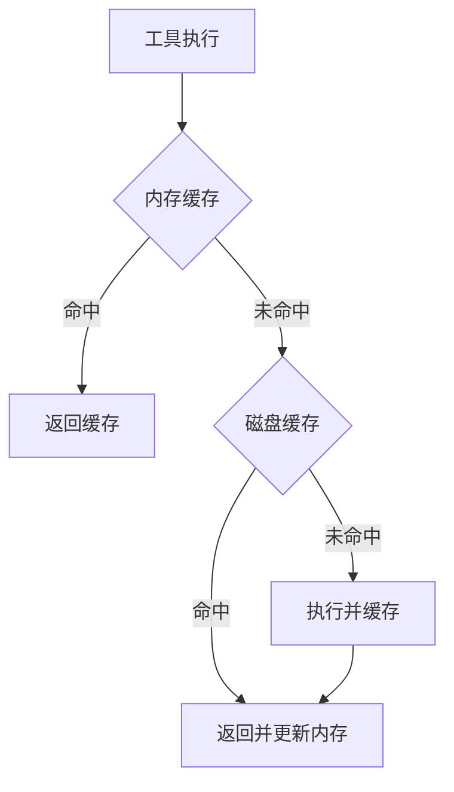

# 结果处理与存储

<cite>
**本文引用的文件**
- [tools/tool_result_storage.py](file://tools/tool_result_storage.py)
- [tools/hook_output_spill.py](file://tools/hook_output_spill.py)
- [tools/tool_output_limits.py](file://tools/tool_output_limits.py)
</cite>

## 目录
1. [简介](#简介)
2. [结果格式标准化](#结果格式标准化)
3. [结果缓存机制](#结果缓存机制)
4. [大小限制与溢出](#大小限制与溢出)
5. [结果压缩与序列化](#结果压缩与序列化)
6. [结果钩子系统](#结果钩子系统)
7. [结论](#结论)

## 简介
本文档解释工具执行结果的处理流程，包括格式标准化、缓存策略和存储机制。

## 结果格式标准化

### 统一结果格式
```python
{
    "success": true,
    "result": {...},          # 结果数据
    "error": null,            # 错误信息
    "metadata": {
        "tool": "read_file",
        "duration_ms": 123,
        "timestamp": "2026-08-10T14:30:00Z"
    }
}
```

### 数据类型支持
- **结构化数据**：JSON对象
- **二进制数据**：Base64编码
- **流式响应**：SSE流
- **文件引用**：临时文件路径

## 结果缓存机制

### 多级缓存


### 缓存策略
- **LRU淘汰**：最近最少使用
- **TTL过期**：基于时间过期
- **大小限制**：控制缓存内存使用

## 大小限制与溢出

### 限制配置
```yaml
tools:
  output:
    max_size_mb: 10        # 单个结果最大10MB
    max_memory_mb: 100     # 内存缓存最大100MB
    spill_to_disk: true    # 超限时溢出到磁盘
    disk_limit_gb: 1       # 磁盘缓存最大1GB
```

### 溢出处理
- 超过内存限制时写入临时文件
- 自动清理过期临时文件
- 监控磁盘使用量

## 结果压缩与序列化

### 序列化格式
| 格式 | 特点 | 适用场景 |
|------|------|----------|
| JSON | 可读性强 | 通用场景 |
| MessagePack | 紧凑高效 | 高性能场景 |
| Protobuf | 强类型 | 跨语言场景 |

### 压缩策略
- 大于1KB的结果自动压缩
- 使用gzip压缩
- 压缩率通常60-80%

## 结果钩子系统

### 钩子类型
```python
# 结果前处理钩子
def before_result(tool_name, params):
    pass

# 结果后处理钩子
def after_result(tool_name, result):
    # 记录审计日志
    audit_log(tool_name, result)
    # 脱敏敏感信息
    return sanitize(result)
```

### 钩子应用场景
- 审计日志记录
- 结果脱敏处理
- 性能监控
- 结果转换

## 结论
结果处理与存储系统确保工具执行结果的标准化、缓存和安全存储。通过多级缓存和压缩策略，优化存储空间和访问性能。

