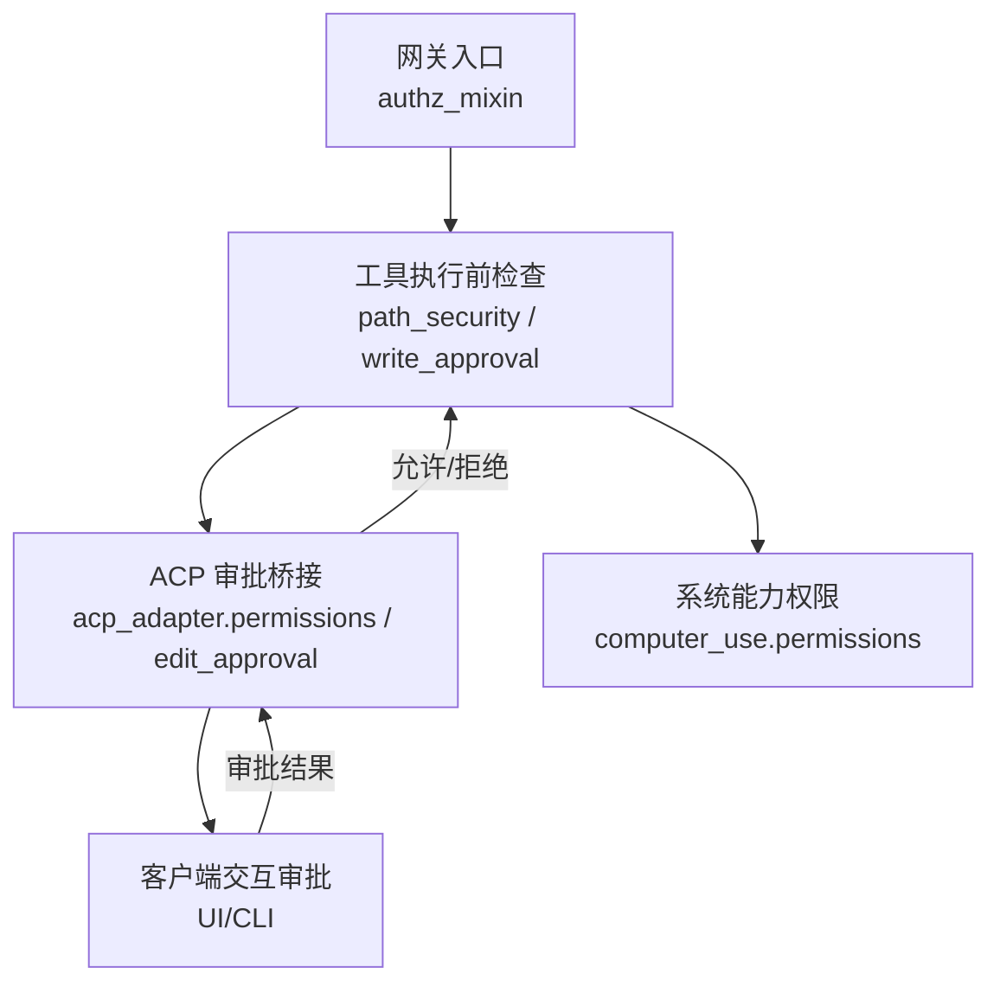
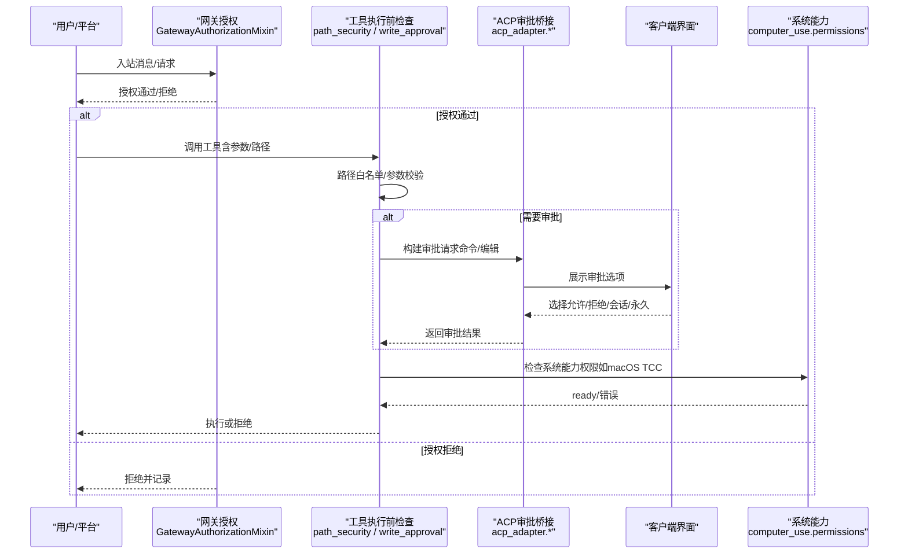
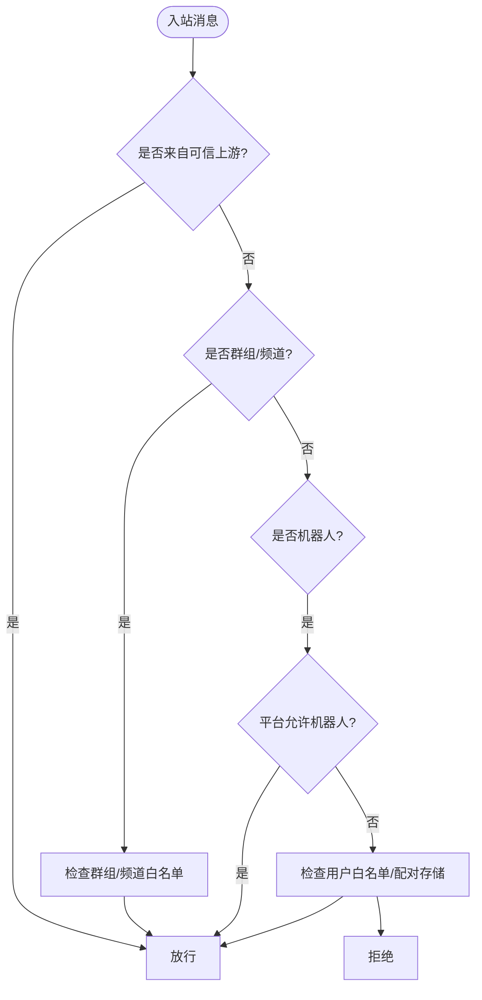
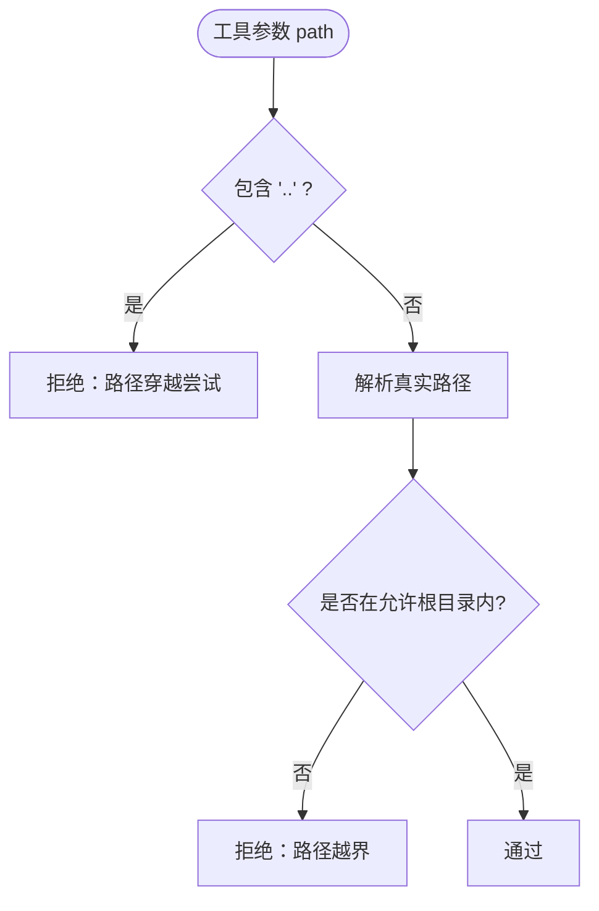
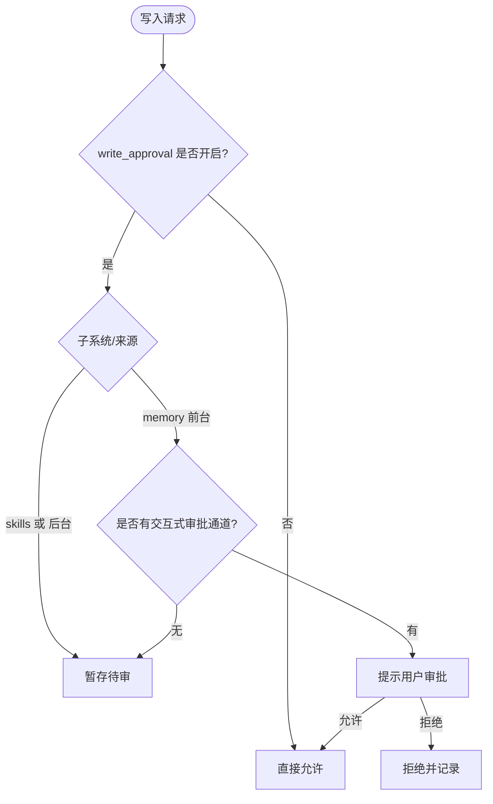
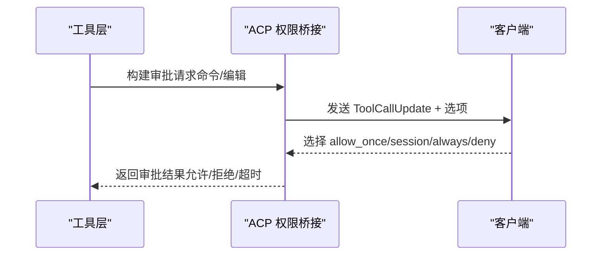
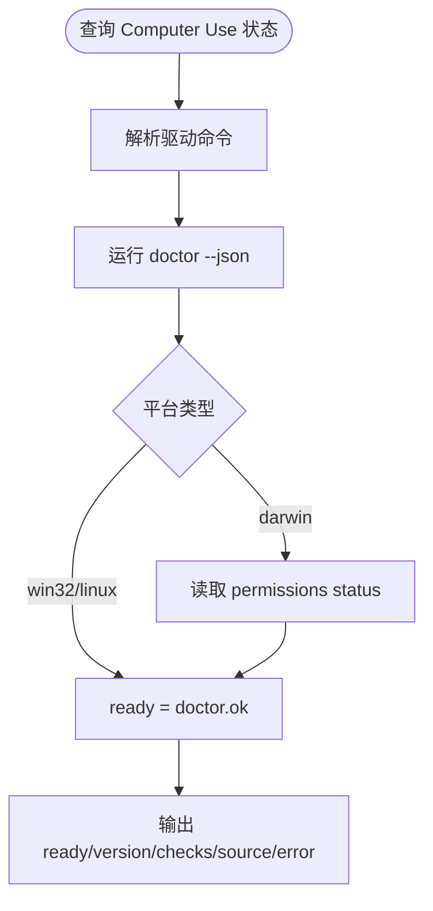
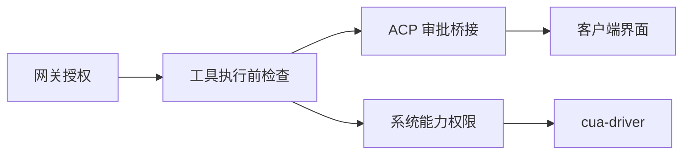

# 权限控制系统

<cite>
**本文引用的文件**
- [acp_adapter/permissions.py](file://acp_adapter/permissions.py)
- [acp_adapter/edit_approval.py](file://acp_adapter/edit_approval.py)
- [tools/write_approval.py](file://tools/write_approval.py)
- [gateway/authz_mixin.py](file://gateway/authz_mixin.py)
- [tools/path_security.py](file://tools/path_security.py)
- [tools/computer_use/permissions.py](file://tools/computer_use/permissions.py)
- [sparkii_cli/approval_mode.py](file://sparkii_cli/approval_mode.py)
</cite>

## 目录
1. [简介](#简介)
2. [项目结构](#项目结构)
3. [核心组件](#核心组件)
4. [架构总览](#架构总览)
5. [详细组件分析](#详细组件分析)
6. [依赖关系分析](#依赖关系分析)
7. [性能与安全考量](#性能与安全考量)
8. [故障排查指南](#故障排查指南)
9. [结论](#结论)
10. [附录：配置与示例路径](#附录配置与示例路径)

## 简介
本文件面向Hermes Agent的权限控制系统，聚焦工具调用前的安全检查、基于角色与上下文的访问控制、敏感操作审批流程、策略配置（全局/会话/用户级）、审计日志以及与用户界面的集成。文档既提供初学者友好的概念说明，也给出开发者可落地的安全策略定制与合规实现要点。

## 项目结构
权限相关能力分布在多个模块中，形成“网关准入 + 工具执行前检查 + 审批桥接 + 持久化待审”的分层体系：
- 网关层：负责入站消息的用户授权与平台白名单控制
- 工具层：在工具执行前进行参数校验、路径白名单与资源访问控制
- 审批桥接：将危险命令与编辑变更通过ACP协议向客户端发起交互式审批
- 持久化待审：对记忆与技能等持久化写入进行暂存与批量审批
- 系统能力：跨平台计算机使用权限检测与授予

**图示来源**
- [gateway/authz_mixin.py:386-783](file://gateway/authz_mixin.py#L386-L783)
- [tools/path_security.py:15-44](file://tools/path_security.py#L15-L44)
- [tools/write_approval.py:230-312](file://tools/write_approval.py#L230-L312)
- [acp_adapter/permissions.py:110-182](file://acp_adapter/permissions.py#L110-L182)
- [acp_adapter/edit_approval.py:233-338](file://acp_adapter/edit_approval.py#L233-L338)
- [tools/computer_use/permissions.py:121-161](file://tools/computer_use/permissions.py#L121-L161)

**章节来源**
- [gateway/authz_mixin.py:386-783](file://gateway/authz_mixin.py#L386-L783)
- [tools/path_security.py:15-44](file://tools/path_security.py#L15-L44)
- [tools/write_approval.py:230-312](file://tools/write_approval.py#L230-L312)
- [acp_adapter/permissions.py:110-182](file://acp_adapter/permissions.py#L110-L182)
- [acp_adapter/edit_approval.py:233-338](file://acp_adapter/edit_approval.py#L233-L338)
- [tools/computer_use/permissions.py:121-161](file://tools/computer_use/permissions.py#L121-L161)

## 核心组件
- 网关用户授权：根据平台、会话来源、环境变量与配对存储决定用户是否被允许与Agent交互
- 工具路径安全：统一的路径解析与越界检查，防止目录穿越与越权访问
- 写操作审批门控：记忆与技能写入的审批开关、暂存与回滚机制
- ACP 审批桥接：将危险命令与编辑变更以工具调用形式提交给客户端进行交互式审批
- 计算机使用权限：跨平台驱动健康检查与macOS TCC权限状态获取与授予
- 审批模式管理：持久化的审批模式设置（手动/智能/关闭）

**章节来源**
- [gateway/authz_mixin.py:386-783](file://gateway/authz_mixin.py#L386-L783)
- [tools/path_security.py:15-44](file://tools/path_security.py#L15-L44)
- [tools/write_approval.py:74-103](file://tools/write_approval.py#L74-L103)
- [tools/write_approval.py:230-312](file://tools/write_approval.py#L230-L312)
- [acp_adapter/permissions.py:110-182](file://acp_adapter/permissions.py#L110-L182)
- [acp_adapter/edit_approval.py:233-338](file://acp_adapter/edit_approval.py#L233-L338)
- [tools/computer_use/permissions.py:121-161](file://tools/computer_use/permissions.py#L121-L161)
- [sparkii_cli/approval_mode.py:34-87](file://sparkii_cli/approval_mode.py#L34-L87)

## 架构总览
下图展示从入站到工具执行的完整权限链路，包括网关授权、工具前置检查、ACP审批与系统能力权限。

**图示来源**
- [gateway/authz_mixin.py:386-783](file://gateway/authz_mixin.py#L386-L783)
- [tools/path_security.py:15-44](file://tools/path_security.py#L15-L44)
- [tools/write_approval.py:230-312](file://tools/write_approval.py#L230-L312)
- [acp_adapter/permissions.py:110-182](file://acp_adapter/permissions.py#L110-L182)
- [acp_adapter/edit_approval.py:233-338](file://acp_adapter/edit_approval.py#L233-L338)
- [tools/computer_use/permissions.py:121-161](file://tools/computer_use/permissions.py#L121-L161)

## 详细组件分析

### 网关用户授权（基于上下文与平台策略）
- 支持上游认证委托（Relay/平台适配器已鉴权）直接放行
- 支持群组/频道级别的聊天ID白名单
- 支持机器人流量按平台开关放行
- 支持每平台的全局允许标志与环境变量白名单
- 支持配对存储（PairingStore）作为强授权凭证
- 当未配置任何白名单时，默认拒绝；仅在适配器明确声明“allowlist”策略时才信任其放行

**图示来源**
- [gateway/authz_mixin.py:386-783](file://gateway/authz_mixin.py#L386-L783)

**章节来源**
- [gateway/authz_mixin.py:386-783](file://gateway/authz_mixin.py#L386-L783)

### 工具路径安全与参数校验
- 统一路径验证：解析真实路径并限制在允许的根目录下，阻止目录穿越
- 快速穿越检测：提前识别包含“..”的路径片段
- 结合工具参数校验，确保必要字段存在且类型正确

**图示来源**
- [tools/path_security.py:15-44](file://tools/path_security.py#L15-L44)

**章节来源**
- [tools/path_security.py:15-44](file://tools/path_security.py#L15-L44)

### 写操作审批门控（记忆与技能）
- 配置开关：每个子系统（memory/skills）独立启用/禁用审批
- 决策矩阵：
  - 关闭审批：直接允许
  - 开启审批且为技能或后台任务：暂存到待审队列
  - 开启审批且为前台记忆：优先尝试交互式审批，失败则暂存
- 暂存与回滚：所有待审记录持久化，支持列出、查看差异、丢弃或批准
- 审计信息：记录来源（前台/后台）、摘要、时间戳与载荷

**图示来源**
- [tools/write_approval.py:74-103](file://tools/write_approval.py#L74-L103)
- [tools/write_approval.py:230-312](file://tools/write_approval.py#L230-L312)
- [tools/write_approval.py:114-151](file://tools/write_approval.py#L114-L151)

**章节来源**
- [tools/write_approval.py:74-103](file://tools/write_approval.py#L74-L103)
- [tools/write_approval.py:230-312](file://tools/write_approval.py#L230-L312)
- [tools/write_approval.py:114-151](file://tools/write_approval.py#L114-L151)

### ACP 审批桥接（危险命令与编辑）
- 危险命令：将命令与描述包装为工具调用更新，附带一次性/会话/永久允许与拒绝选项
- 编辑变更：针对write_file与patch构建diff视图，支持自动审批策略（会话/工作区/询问）
- 超时与异常：超时视为“无响应”，异常默认拒绝，避免静默放行
- 映射规则：将ACP返回的option_id映射为内部审批结果

**图示来源**
- [acp_adapter/permissions.py:41-107](file://acp_adapter/permissions.py#L41-L107)
- [acp_adapter/permissions.py:110-182](file://acp_adapter/permissions.py#L110-L182)
- [acp_adapter/edit_approval.py:264-338](file://acp_adapter/edit_approval.py#L264-L338)

**章节来源**
- [acp_adapter/permissions.py:41-107](file://acp_adapter/permissions.py#L41-L107)
- [acp_adapter/permissions.py:110-182](file://acp_adapter/permissions.py#L110-L182)
- [acp_adapter/edit_approval.py:264-338](file://acp_adapter/edit_approval.py#L264-L338)

### 计算机使用权限（跨平台）
- 统一状态：通过驱动健康检查与平台特定权限（macOS TCC）综合判断“就绪”
- macOS：可请求Accessibility与Screen Recording授权，并通过LaunchServices显示系统对话框
- 其他平台：以驱动健康为准，无TCC模型

**图示来源**
- [tools/computer_use/permissions.py:39-83](file://tools/computer_use/permissions.py#L39-L83)
- [tools/computer_use/permissions.py:121-161](file://tools/computer_use/permissions.py#L121-L161)

**章节来源**
- [tools/computer_use/permissions.py:39-83](file://tools/computer_use/permissions.py#L39-L83)
- [tools/computer_use/permissions.py:121-161](file://tools/computer_use/permissions.py#L121-L161)

### 审批模式管理（全局/会话/用户级）
- 模式值：manual（手动）、smart（智能）、off（关闭）
- 持久化：通过受管配置接口保存，支持受管策略保护
- 生效范围：立即影响后续终端守卫检查

**章节来源**
- [sparkii_cli/approval_mode.py:34-87](file://sparkii_cli/approval_mode.py#L34-L87)

## 依赖关系分析
- 网关授权依赖平台适配器与配对存储，决定入站消息是否进入Agent
- 工具执行前检查依赖路径安全与写审批门控，确保工具调用安全
- ACP审批桥接依赖事件循环调度与客户端交互，完成动态授权
- 计算机使用权限依赖外部驱动二进制，封装平台差异

**图示来源**
- [gateway/authz_mixin.py:386-783](file://gateway/authz_mixin.py#L386-L783)
- [tools/path_security.py:15-44](file://tools/path_security.py#L15-L44)
- [tools/write_approval.py:230-312](file://tools/write_approval.py#L230-L312)
- [acp_adapter/permissions.py:110-182](file://acp_adapter/permissions.py#L110-L182)
- [tools/computer_use/permissions.py:121-161](file://tools/computer_use/permissions.py#L121-L161)

**章节来源**
- [gateway/authz_mixin.py:386-783](file://gateway/authz_mixin.py#L386-L783)
- [tools/path_security.py:15-44](file://tools/path_security.py#L15-L44)
- [tools/write_approval.py:230-312](file://tools/write_approval.py#L230-L312)
- [acp_adapter/permissions.py:110-182](file://acp_adapter/permissions.py#L110-L182)
- [tools/computer_use/permissions.py:121-161](file://tools/computer_use/permissions.py#L121-L161)

## 性能与安全考量
- 默认拒绝原则：未配置白名单时拒绝入站与敏感操作
- 最小权限：仅暴露必要的工具与路径，严格限制目录边界
- 超时与异常安全：审批超时与异常均视为拒绝，避免静默放行
- 隔离性：多租户/多Profile下，授权与配对存储隔离，避免泄露
- 可观测性：审批与拒绝均有日志记录，便于审计与排障

[本节为通用指导，不直接分析具体文件]

## 故障排查指南
- 入站被拒：检查平台允许标志、环境变量白名单、配对存储与适配器策略
- 工具路径报错：确认路径是否越界或包含穿越组件
- 审批超时：确认客户端连接与事件循环是否正常，必要时调整超时
- 计算机使用不可用：检查驱动安装与健康状态，macOS需授予TCC权限
- 写操作未生效：查看待审队列，确认是否处于暂存状态或被拒绝

**章节来源**
- [gateway/authz_mixin.py:386-783](file://gateway/authz_mixin.py#L386-L783)
- [tools/path_security.py:15-44](file://tools/path_security.py#L15-L44)
- [acp_adapter/permissions.py:110-182](file://acp_adapter/permissions.py#L110-L182)
- [tools/computer_use/permissions.py:121-161](file://tools/computer_use/permissions.py#L121-L161)
- [tools/write_approval.py:230-312](file://tools/write_approval.py#L230-L312)

## 结论
Hermes Agent的权限控制系统通过网关授权、工具前置检查、ACP审批桥接与系统能力权限的多层防护，实现了细粒度、可审计、可扩展的安全策略。结合审批模式管理与待审队列，既能满足日常自动化需求，也能保障敏感操作的合规性与可控性。

[本节为总结，不直接分析具体文件]

## 附录：配置与示例路径
- 全局/平台白名单与允许标志：参考网关授权中的环境变量映射
- 会话级策略：通过ACP审批选项（once/session/always）实现
- 用户级策略：通过配对存储与平台适配器策略实现
- 审批模式：通过CLI命令设置并持久化
- 待审队列：通过CLI或Dashboard查看与处理

**章节来源**
- [gateway/authz_mixin.py:386-783](file://gateway/authz_mixin.py#L386-L783)
- [acp_adapter/permissions.py:41-107](file://acp_adapter/permissions.py#L41-L107)
- [tools/write_approval.py:114-151](file://tools/write_approval.py#L114-L151)
- [sparkii_cli/approval_mode.py:34-87](file://sparkii_cli/approval_mode.py#L34-L87)