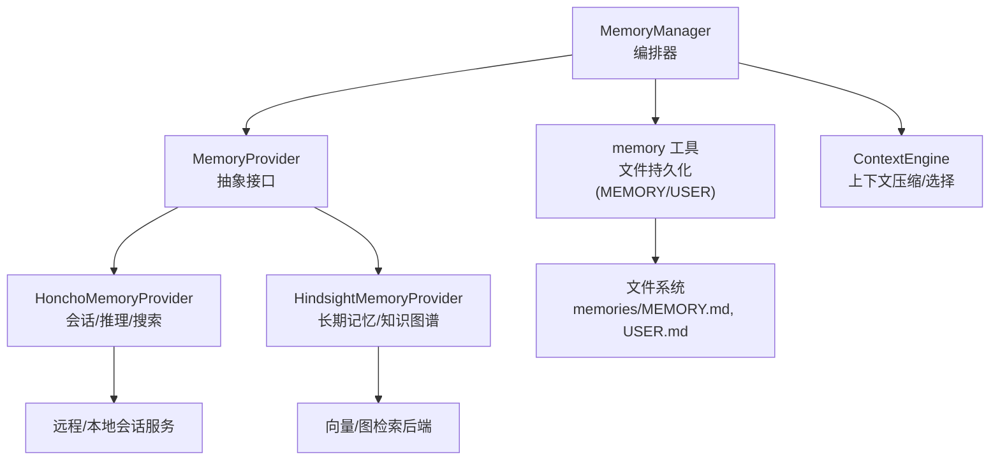
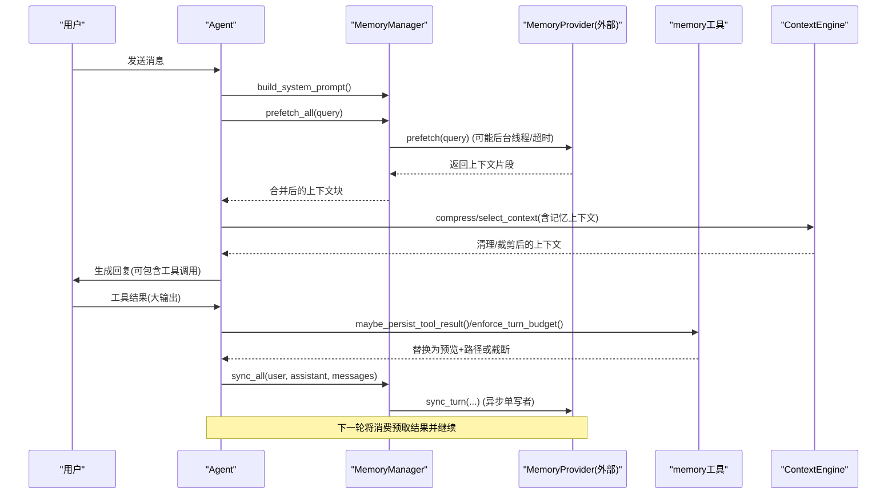
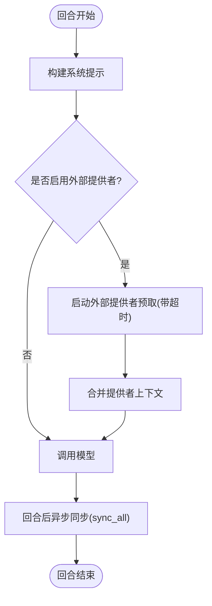
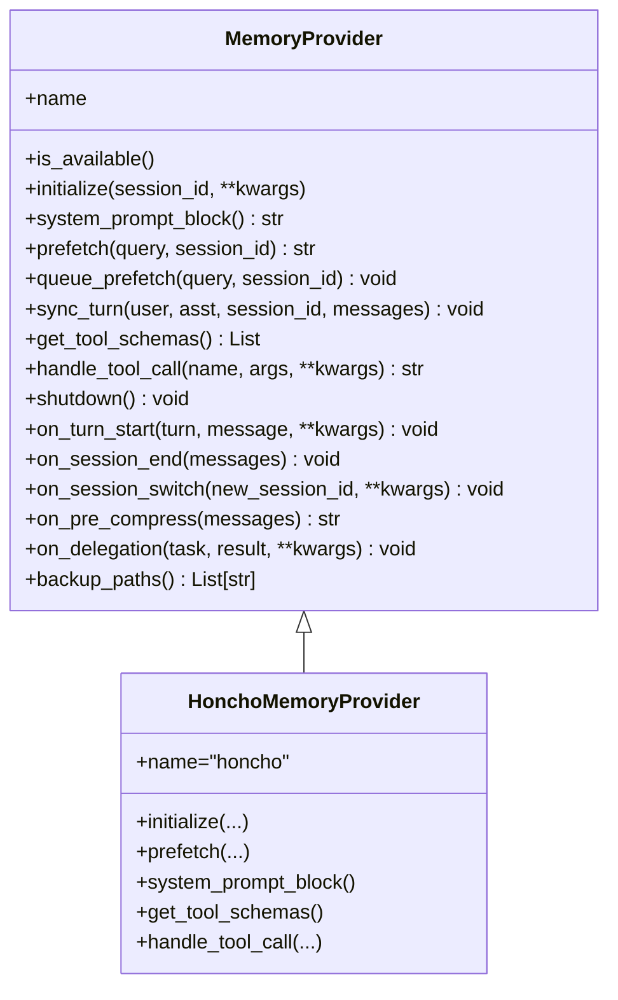
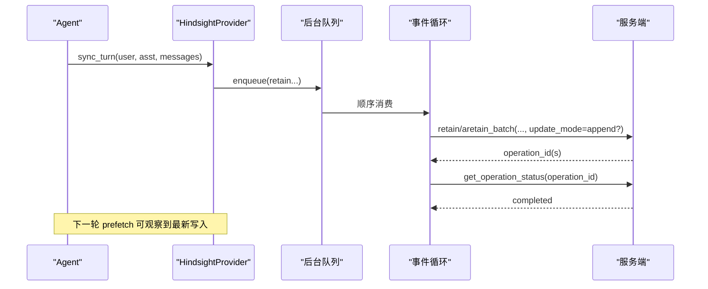
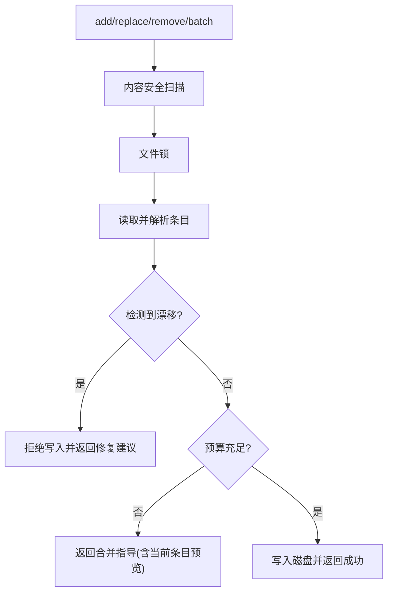
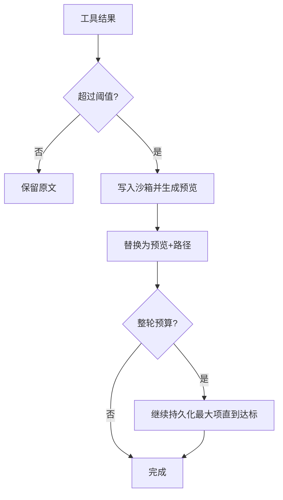
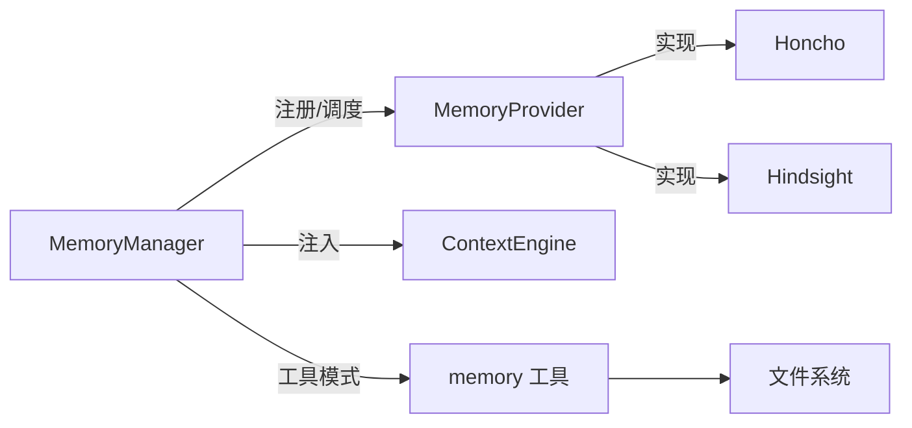

# 记忆系统集成

<cite>
**本文引用的文件**
- [agent/memory_manager.py](file://agent/memory_manager.py)
- [agent/memory_provider.py](file://agent/memory_provider.py)
- [tools/memory_tool.py](file://tools/memory_tool.py)
- [plugins/memory/honcho/__init__.py](file://plugins/memory/honcho/__init__.py)
- [plugins/memory/hindsight/__init__.py](file://plugins/memory/hindsight/__init__.py)
- [tools/tool_result_storage.py](file://tools/tool_result_storage.py)
- [agent/context_engine.py](file://agent/context_engine.py)
</cite>

## 目录
1. [简介](#简介)
2. [项目结构](#项目结构)
3. [核心组件](#核心组件)
4. [架构总览](#架构总览)
5. [详细组件分析](#详细组件分析)
6. [依赖关系分析](#依赖关系分析)
7. [性能考量](#性能考量)
8. [故障排查指南](#故障排查指南)
9. [结论](#结论)
10. [附录：配置与示例路径](#附录：配置与示例路径)

## 简介
本文件面向Sparkii Agent的记忆系统集成，系统性说明工具执行结果如何被存储、检索与关联分析；语义索引的构建过程；短期与长期记忆的区分管理；记忆更新策略（增量、冲突解决、版本控制）；查询接口（自然语言、结构化、相似度匹配）；以及与对话历史的整合方式。文档同时为初学者提供基础概念，并为开发者提供高级策略与个性化定制的技术细节。

## 项目结构
记忆系统由“编排层 + 提供者抽象 + 具体插件 + 持久化工具 + 上下文引擎”构成：
- 编排层：MemoryManager 负责注册/调度多个 MemoryProvider，统一注入系统提示、预取上下文、回合后同步。
- 提供者抽象：MemoryProvider 定义生命周期与工具暴露契约。
- 具体插件：Honcho（会话级用户建模与推理）、Hindsight（长期知识图谱与多策略检索）。
- 持久化工具：内置 memory 工具（MEMORY.md/USER.md），用于受控的短/中期经验沉淀。
- 上下文引擎：ContextEngine 在压缩前对记忆上下文进行清洗与截断，保障提示稳定与缓存友好。

图表来源
- [agent/memory_manager.py:364-800](file://agent/memory_manager.py#L364-L800)
- [agent/memory_provider.py:81-188](file://agent/memory_provider.py#L81-L188)
- [plugins/memory/honcho/__init__.py:237-800](file://plugins/memory/honcho/__init__.py#L237-L800)
- [plugins/memory/hindsight/__init__.py:681-800](file://plugins/memory/hindsight/__init__.py#L681-L800)
- [tools/memory_tool.py:148-800](file://tools/memory_tool.py#L148-L800)
- [agent/context_engine.py:89-190](file://agent/context_engine.py#L89-L190)

章节来源
- [agent/memory_manager.py:364-800](file://agent/memory_manager.py#L364-L800)
- [agent/memory_provider.py:81-188](file://agent/memory_provider.py#L81-L188)
- [tools/memory_tool.py:148-800](file://tools/memory_tool.py#L148-L800)
- [plugins/memory/honcho/__init__.py:237-800](file://plugins/memory/honcho/__init__.py#L237-L800)
- [plugins/memory/hindsight/__init__.py:681-800](file://plugins/memory/hindsight/__init__.py#L681-L800)
- [agent/context_engine.py:89-190](file://agent/context_engine.py#L89-L190)

## 核心组件
- MemoryManager：单点集成，限制仅一个外部提供者，统一注入系统提示、预取上下文、回合后异步同步，并提供工具模式开关与超时保护。
- MemoryProvider：抽象出 initialize/prefetch/sync_turn/get_tool_schemas/handle_tool_call 等生命周期，支持可选钩子（on_session_end/on_pre_compress 等）。
- HonchoMemoryProvider：提供 profile/search/reasoning/context/conclude 工具；支持 context/tools/hybrid 三种召回模式；具备首轮预热、上下文缓存、推理深度控制。
- HindsightMemoryProvider：提供 retain/recall/reflect 工具；支持云/本地模式、标签/观察范围、增量追加写入能力探测；具备后台事件循环与单写者队列。
- memory 工具（MemoryStore）：以文件形式维护 MEMORY.md/USER.md，带字符预算、去重、漂移检测、批量操作、安全扫描与快照隔离。
- ContextEngine：在压缩前对记忆上下文做敏感信息脱敏与长度裁剪，保证提示稳定与缓存命中。

章节来源
- [agent/memory_manager.py:364-800](file://agent/memory_manager.py#L364-L800)
- [agent/memory_provider.py:81-188](file://agent/memory_provider.py#L81-L188)
- [plugins/memory/honcho/__init__.py:237-800](file://plugins/memory/honcho/__init__.py#L237-L800)
- [plugins/memory/hindsight/__init__.py:681-800](file://plugins/memory/hindsight/__init__.py#L681-L800)
- [tools/memory_tool.py:148-800](file://tools/memory_tool.py#L148-L800)
- [agent/context_engine.py:89-190](file://agent/context_engine.py#L89-L190)

## 架构总览
下图展示一次典型对话回合中，记忆系统与工具执行的交互流程：系统提示组装、回合前预取、模型调用、回合后同步、工具结果持久化与上下文压缩。

图表来源
- [agent/memory_manager.py:486-694](file://agent/memory_manager.py#L486-L694)
- [tools/tool_result_storage.py:144-255](file://tools/tool_result_storage.py#L144-L255)
- [agent/context_engine.py:89-190](file://agent/context_engine.py#L89-L190)

## 详细组件分析

### 记忆管理器 MemoryManager
- 职责：注册/路由提供者、注入系统提示、回合前预取、回合后同步、工具模式开关、外部提供者超时保护、后台串行化写入。
- 关键机制：
  - 仅允许一个外部提供者，避免工具名冲突与后端竞争。
  - 外部提供者 prefetch 使用独立线程并设置超时，避免阻塞主流程。
  - sync_all 通过单工作线程串行化，确保 turn N 先于 turn N+1 落地。
  - 工具模式：根据 enabled/disabled toolsets 决定是否暴露外部记忆工具。

图表来源
- [agent/memory_manager.py:486-694](file://agent/memory_manager.py#L486-L694)

章节来源
- [agent/memory_manager.py:364-800](file://agent/memory_manager.py#L364-L800)

### 提供者抽象 MemoryProvider
- 生命周期：initialize → system_prompt_block → prefetch → sync_turn → get_tool_schemas → handle_tool_call → shutdown。
- 可选钩子：on_turn_start、on_session_end、on_session_switch、on_pre_compress、on_delegation、backup_paths。
- 设计要点：
  - prefetch 应快速返回缓存结果，实际召回走后台。
  - sync_turn 非阻塞，适合网络/守护进程调用。
  - get_tool_schemas/handle_tool_call 暴露可被模型调用的记忆工具。

章节来源
- [agent/memory_provider.py:81-188](file://agent/memory_provider.py#L81-L188)

### Honcho 记忆插件
- 工具集：profile（读/写卡片）、search（混合检索）、reasoning（问答式综合）、context（当前会话快照）、conclude（持久结论）。
- 召回模式：context（自动注入）、tools（仅工具）、hybrid（两者兼具）。
- 首轮预热：首次对话时后台运行 dialectic 预热，提升后续召回质量。
- 上下文缓存：按 cadence 刷新 base context，减少频繁网络开销。
- 推理深度：支持 minimal/low/medium/high/max 分级控制成本与深度。

图表来源
- [agent/memory_provider.py:81-188](file://agent/memory_provider.py#L81-L188)
- [plugins/memory/honcho/__init__.py:237-800](file://plugins/memory/honcho/__init__.py#L237-L800)

章节来源
- [plugins/memory/honcho/__init__.py:237-800](file://plugins/memory/honcho/__init__.py#L237-L800)

### Hindsight 记忆插件
- 工具集：retain（保留到长期记忆）、recall（语义/关键词/实体图检索）、reflect（跨记忆综合回答）。
- 模式：cloud/local；支持标签、观察范围、预算级别、超时与空闲关闭。
- 写入策略：单写者队列 + 后台事件循环；支持 append 模式（当服务端版本满足时）以减少覆盖风险。
- 预取等待：当开启异步 retain 时，预取会等待服务端操作完成信号，避免读到旧状态。

图表来源
- [plugins/memory/hindsight/__init__.py:681-800](file://plugins/memory/hindsight/__init__.py#L681-L800)

章节来源
- [plugins/memory/hindsight/__init__.py:681-800](file://plugins/memory/hindsight/__init__.py#L681-L800)

### 内置 memory 工具（短期/中期经验）
- 存储：memories/MEMORY.md（个人笔记）、memories/USER.md（用户画像）。
- 特性：
  - 字符预算与去重，超限提示合并/删除。
  - 漂移检测：外部修改导致无法 round-trip 时拒绝写入并给出修复指引。
  - 批量操作：原子性 apply_batch，最终状态才检查预算。
  - 安全扫描：加载与写入均扫描威胁模式，进入系统提示的快照会被净化。
  - 快照隔离：系统提示使用加载时的冻结快照，会话内变更不破坏缓存前缀。

图表来源
- [tools/memory_tool.py:148-800](file://tools/memory_tool.py#L148-L800)

章节来源
- [tools/memory_tool.py:148-800](file://tools/memory_tool.py#L148-L800)

### 工具结果持久化与上下文压缩
- 工具结果持久化：超过阈值的结果被保存到沙箱临时目录，并在上下文中以预览+路径替代；若整轮仍超预算，则按大小逐步持久化。
- 上下文压缩：在压缩前对记忆上下文进行敏感信息脱敏与长度裁剪，保证提示稳定与缓存命中。

图表来源
- [tools/tool_result_storage.py:144-255](file://tools/tool_result_storage.py#L144-L255)
- [agent/context_engine.py:34-53](file://agent/context_engine.py#L34-L53)

章节来源
- [tools/tool_result_storage.py:144-255](file://tools/tool_result_storage.py#L144-L255)
- [agent/context_engine.py:34-53](file://agent/context_engine.py#L34-L53)

## 依赖关系分析
- MemoryManager 依赖 MemoryProvider 抽象，聚合多个实现（最多一个外部）。
- Honcho/Hindsight 作为 MemoryProvider 的具体实现，分别对接各自的客户端/后端。
- memory 工具直接操作文件系统，并通过安全扫描与文件锁保证一致性。
- ContextEngine 在压缩阶段消费记忆上下文，确保输出安全与长度可控。
- 工具结果持久化模块与执行环境交互，将大结果落盘并回传引用。

图表来源
- [agent/memory_manager.py:364-800](file://agent/memory_manager.py#L364-L800)
- [agent/memory_provider.py:81-188](file://agent/memory_provider.py#L81-L188)
- [tools/memory_tool.py:148-800](file://tools/memory_tool.py#L148-L800)
- [agent/context_engine.py:89-190](file://agent/context_engine.py#L89-L190)

章节来源
- [agent/memory_manager.py:364-800](file://agent/memory_manager.py#L364-L800)
- [agent/memory_provider.py:81-188](file://agent/memory_provider.py#L81-L188)
- [tools/memory_tool.py:148-800](file://tools/memory_tool.py#L148-L800)
- [agent/context_engine.py:89-190](file://agent/context_engine.py#L89-L190)

## 性能考量
- 外部提供者预取超时：避免慢/卡死的外部调用阻塞主流程。
- 单写者串行化：所有 provider 的 sync_turn 通过单工作线程串行，保证顺序且降低并发写竞争。
- 首轮预热与缓存：Honcho 的首轮背景预热与 base context 缓存减少重复网络开销。
- 工具结果持久化：将大输出移出上下文，降低 token 消耗与溢出风险。
- 上下文压缩前处理：对记忆上下文进行脱敏与裁剪，提高缓存命中率与安全性。

[本节为通用性能讨论，无需特定文件来源]

## 故障排查指南
- 外部提供者不可用或认证失败：
  - 现象：prefetch 超时或返回空；系统提示中显示内存暂停通知。
  - 排查：检查配置与凭据；确认 is_available 返回；查看后台初始化日志。
- 文件读写异常（memory 工具）：
  - 现象：replace/remove 报错“文件存在但无法读取”或“漂移备份”。
  - 排查：检查权限与编码；根据 .bak 恢复；重新通过 add 逐条导入。
- 工具结果过大：
  - 现象：上下文被截断或提示“已持久化到沙箱”。
  - 排查：确认沙箱路径可写；使用 read_file 访问完整输出。
- 压缩未触发或效果不佳：
  - 现象：上下文过长导致响应缓慢或被截断。
  - 排查：检查 ContextEngine 阈值与保护策略；必要时手动 /compress。

章节来源
- [plugins/memory/honcho/__init__.py:306-410](file://plugins/memory/honcho/__init__.py#L306-L410)
- [tools/memory_tool.py:91-146](file://tools/memory_tool.py#L91-L146)
- [tools/tool_result_storage.py:144-255](file://tools/tool_result_storage.py#L144-L255)
- [agent/context_engine.py:89-190](file://agent/context_engine.py#L89-L190)

## 结论
Sparkii 的记忆系统通过统一的编排器与抽象接口，将多种记忆后端（Honcho、Hindsight）与内置文件型 memory 工具有机结合，形成“短期/中期经验 + 长期知识”的分层体系。借助异步预取、单写者同步、工具结果持久化与上下文压缩，系统在可用性、一致性与性能之间取得平衡。开发者可按需扩展新的 MemoryProvider 或自定义索引/检索策略，以满足不同场景的知识管理与个性化需求。

[本节为总结性内容，无需特定文件来源]

## 附录：配置与示例路径
- 启用/禁用记忆工具：
  - 通过 enabled_toolsets/disabled_toolsets 控制是否暴露外部记忆工具。
  - 参考：[agent/memory_manager.py:83-156](file://agent/memory_manager.py#L83-L156)
- Honcho 配置：
  - 配置文件位置：$SPARKII_HOME/honcho.json；环境变量 HONCHO_API_KEY/base_url。
  - 参考：[plugins/memory/honcho/__init__.py:315-341](file://plugins/memory/honcho/__init__.py#L315-L341)
- Hindsight 配置：
  - 配置文件位置：$SPARKII_HOME/hindsight/config.json；环境变量 HINDSIGHT_*。
  - 参考：[plugins/memory/hindsight/__init__.py:361-404](file://plugins/memory/hindsight/__init__.py#L361-L404)
- 记忆文件位置：
  - memories/MEMORY.md、memories/USER.md。
  - 参考：[tools/memory_tool.py:49-67](file://tools/memory_tool.py#L49-L67)
- 工具结果持久化目录：
  - 默认 /tmp/sparkii-results（可通过环境 temp dir 解析）。
  - 参考：[tools/tool_result_storage.py:41-61](file://tools/tool_result_storage.py#L41-L61)

章节来源
- [agent/memory_manager.py:83-156](file://agent/memory_manager.py#L83-L156)
- [plugins/memory/honcho/__init__.py:315-341](file://plugins/memory/honcho/__init__.py#L315-L341)
- [plugins/memory/hindsight/__init__.py:361-404](file://plugins/memory/hindsight/__init__.py#L361-L404)
- [tools/memory_tool.py:49-67](file://tools/memory_tool.py#L49-L67)
- [tools/tool_result_storage.py:41-61](file://tools/tool_result_storage.py#L41-L61)