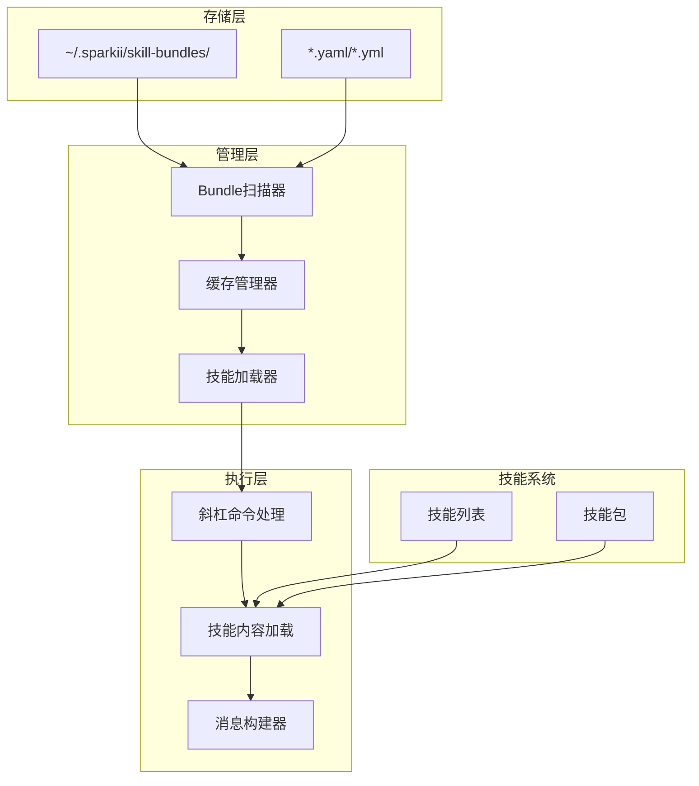

# 技能包管理

<cite>
**本文引用的文件**
- [agent/skill_bundles.py](file://agent/skill_bundles.py)
- [sparkii_cli/subcommands/bundles.py](file://sparkii_cli/subcommands/bundles.py)
</cite>

## 目录
1. [简介](#简介)
2. [技能包架构](#技能包架构)
3. [YAML格式规范](#yaml格式规范)
4. [发现与加载机制](#发现与加载机制)
5. [冲突解决](#冲突解决)
6. [生命周期管理](#生命周期管理)
7. [CLI命令](#cli命令)
8. [最佳实践](#最佳实践)

## 简介

技能包（Skill Bundles）是Sparkii Agent的技能组织机制，允许用户通过单个斜杠命令同时加载多个相关技能。技能包通过YAML文件定义，支持灵活的配置和管理。

**核心特性：**
- **批量加载**：一次加载多个相关技能
- **灵活配置**：YAML格式定义技能组合
- **智能缓存**：基于文件变更的自动刷新
- **冲突解决**：技能包优先于同名技能

## 技能包架构



**图示来源**
- [agent/skill_bundles.py:1-50](file://agent/skill_bundles.py#L1-L50)

## YAML格式规范

### 基本结构

```yaml
name: backend-dev
description: Backend feature work — code review, testing, PR workflow.
skills:
  - github-code-review
  - test-driven-development
  - github-pr-workflow
instruction: |
  Optional extra guidance to inject above the skill bodies.
```

### 字段说明

| 字段 | 类型 | 必需 | 描述 |
|------|------|------|------|
| `name` | string | 否 | 技能包名称（默认使用文件名） |
| `description` | string | 否 | 技能包描述 |
| `skills` | list | 是 | 技能名称列表 |
| `instruction` | string | 否 | 额外指导文本 |

### 完整示例

```yaml
name: full-stack-dev
description: Full-stack development workflow with React frontend and Node.js backend.
skills:
  - react-component-development
  - node-api-development
  - database-design
  - docker-deployment
  - github-pr-workflow
instruction: |
  This bundle covers the complete full-stack development workflow.
  Start with database design, then build the API, followed by the frontend.
  Use Docker for deployment and GitHub PRs for code review.
```

### 多个技能包示例

```yaml
# ~/.sparkii/skill-bundles/data-science.yaml
name: data-science
description: Data science and machine learning workflow.
skills:
  - pandas-data-analysis
  - scikit-learn-modeling
  - jupyter-notebook-workflow
  - data-visualization
instruction: |
  Follow the data science lifecycle:
  1. Data collection and cleaning
  2. Exploratory data analysis
  3. Feature engineering
  4. Model training and evaluation
  5. Deployment and monitoring
```

## 发现与加载机制

### 1. 目录扫描

```python
def _bundles_dir() -> Path:
    """Return the canonical bundles directory under SPARKII_HOME."""
    override = os.environ.get("SPARKII_BUNDLES_DIR")
    if override:
        return Path(override).expanduser()
    return get_sparkii_home() / "skill-bundles"

def _iter_bundle_files() -> List[Path]:
    base = _bundles_dir()
    if not base.exists():
        return []
    files: List[Path] = []
    for ext in ("*.yaml", "*.yml"):
        files.extend(sorted(base.glob(ext)))
    return files
```

### 2. 文件解析

```python
def _load_bundle_file(path: Path) -> Optional[Dict[str, Any]]:
    """Parse a single bundle YAML file."""
    try:
        raw = path.read_text(encoding="utf-8")
    except OSError as exc:
        logger.warning("Could not read bundle %s: %s", path, exc)
        return None
    
    try:
        data = yaml.safe_load(raw)
    except yaml.YAMLError as exc:
        logger.warning("Invalid YAML in bundle %s: %s", path, exc)
        return None
    
    if not isinstance(data, dict):
        logger.warning("Bundle %s is not a mapping; skipping", path)
        return None
    
    # 提取字段
    name = str(data.get("name") or path.stem).strip()
    skills = data.get("skills") or []
    description = str(data.get("description") or "").strip()
    instruction = str(data.get("instruction") or "").strip()
    
    # 生成slug
    slug = _slugify(name)
    
    return {
        "name": name,
        "slug": slug,
        "description": description or f"Load {len(skills)} skills as a bundle",
        "skills": skills,
        "instruction": instruction,
        "path": str(path),
    }
```

### 3. Slug生成

```python
_BUNDLE_INVALID_CHARS = re.compile(r"[^a-z0-9-]")
_BUNDLE_MULTI_HYPHEN = re.compile(r"-{2,}")

def _slugify(name: str) -> str:
    """Convert name to URL-friendly slug."""
    cmd = name.lower().replace(" ", "-").replace("_", "-")
    cmd = _BUNDLE_INVALID_CHARS.sub("", cmd)
    cmd = _BUNDLE_MULTI_HYPHEN.sub("-", cmd).strip("-")
    return cmd
```

**示例：**
- `"Backend Dev"` → `"backend-dev"`
- `"Data Science 101"` → `"data-science-101"`
- `"My_Bundle_Name"` → `"my-bundle-name"`

### 4. 缓存机制

```python
_bundles_cache: Dict[str, Dict[str, Any]] = {}
_bundles_cache_mtime: Optional[float] = None

def _max_mtime(files: List[Path]) -> float:
    """Highest mtime across the bundle files plus the dir itself."""
    base = _bundles_dir()
    mtimes = []
    if base.exists():
        try:
            mtimes.append(base.stat().st_mtime)
        except OSError:
            pass
    for f in files:
        try:
            mtimes.append(f.stat().st_mtime)
        except OSError:
            continue
    return max(mtimes) if mtimes else 0.0

def get_skill_bundles() -> Dict[str, Dict[str, Any]]:
    """Return the current bundle mapping, rescanning when disk changed."""
    files = _iter_bundle_files()
    current_mtime = _max_mtime(files)
    if not _bundles_cache or _bundles_cache_mtime != current_mtime:
        scan_bundles()
    return _bundles_cache
```

## 冲突解决

### 1. 命名冲突

```python
def scan_bundles() -> Dict[str, Dict[str, Any]]:
    """Scan the bundles directory and rebuild the cache."""
    global _bundles_cache, _bundles_cache_mtime
    files = _iter_bundle_files()
    out: Dict[str, Dict[str, Any]] = {}
    
    for f in files:
        info = _load_bundle_file(f)
        if not info:
            continue
        key = f"/{info['slug']}"
        if key in out:
            logger.warning(
                "Duplicate bundle slug %s from %s; keeping %s",
                key, f, out[key]["path"],
            )
            continue
        out[key] = info
    
    _bundles_cache = out
    _bundles_cache_mtime = _max_mtime(files)
    return out
```

**规则：**
- 同一slug的多个技能包，第一个加载的优先
- 后续的重复slug会被忽略并记录警告

### 2. 技能包与技能冲突

```python
# 斜杠命令处理流程
def resolve_bundle_command_key(command: str) -> Optional[str]:
    """Resolve a user-typed command to its canonical bundle slash key."""
    if not command:
        return None
    cmd_key = f"/{command.replace('_', '-')}"
    return cmd_key if cmd_key in get_skill_bundles() else None

# 在命令处理中
def handle_slash_command(command: str):
    # 1. 首先检查技能包
    bundle_key = resolve_bundle_command_key(command)
    if bundle_key:
        return handle_bundle(bundle_key)
    
    # 2. 然后检查技能
    skill_key = resolve_skill_command_key(command)
    if skill_key:
        return handle_skill(skill_key)
    
    return None
```

**规则：**
- 技能包优先于同名技能
- 用户可以通过命名技能包来覆盖技能行为

## 生命周期管理

### 1. 创建技能包

```python
def save_bundle(
    name: str,
    skills: List[str],
    description: str = "",
    instruction: str = "",
    overwrite: bool = False,
) -> Path:
    """Write a bundle to disk and invalidate the cache."""
    name = (name or "").strip()
    if not name:
        raise ValueError("Bundle name is required")
    
    cleaned_skills = [str(s).strip() for s in skills if str(s).strip()]
    if not cleaned_skills:
        raise ValueError("Bundle must reference at least one skill")
    
    path = bundle_path_for(name)
    if path.exists() and not overwrite:
        raise FileExistsError(f"Bundle already exists at {path}")
    
    path.parent.mkdir(parents=True, exist_ok=True)
    payload: Dict[str, Any] = {"name": name, "skills": cleaned_skills}
    if description:
        payload["description"] = description
    if instruction:
        payload["instruction"] = instruction
    
    path.write_text(
        yaml.safe_dump(payload, sort_keys=False, allow_unicode=True),
        encoding="utf-8",
    )
    scan_bundles()  # 刷新缓存
    return path
```

### 2. 删除技能包

```python
def delete_bundle(name: str) -> Path:
    """Delete a bundle by name. Returns the deleted path."""
    path = bundle_path_for(name)
    if not path.exists():
        raise FileNotFoundError(f"No bundle at {path}")
    path.unlink()
    scan_bundles()  # 刷新缓存
    return path
```

### 3. 查询技能包

```python
def get_bundle(name: str) -> Optional[Dict[str, Any]]:
    """Look up a bundle by name (slug-normalized)."""
    slug = _slugify(name)
    return get_skill_bundles().get(f"/{slug}")

def list_bundles() -> List[Dict[str, Any]]:
    """Return a sorted list of bundle info dicts for display."""
    bundles = get_skill_bundles()
    return sorted(bundles.values(), key=lambda b: b["slug"])
```

## CLI命令

### 1. 查看所有技能包

```bash
sparkii bundles list
```

输出示例：
```
Available skill bundles:
  /backend-dev      Backend feature work — code review, testing, PR workflow.
  /data-science     Data science and machine learning workflow.
  /full-stack-dev   Full-stack development workflow with React frontend and Node.js backend.
```

### 2. 创建技能包

```bash
sparkii bundles create my-bundle \
  --skills "skill1,skill2,skill3" \
  --description "My custom bundle" \
  --instruction "Extra guidance here"
```

### 3. 删除技能包

```bash
sparkii bundles delete my-bundle
```

### 4. 查看技能包详情

```bash
sparkii bundles show my-bundle
```

输出示例：
```
Bundle: my-bundle
Description: My custom bundle
Skills: skill1, skill2, skill3
Instruction: Extra guidance here
Path: ~/.sparkii/skill-bundles/my-bundle.yaml
```

### 5. 重新加载技能包

```bash
sparkii bundles reload
```

输出示例：
```
Bundle reload complete:
  Added: 2
  Removed: 1
  Unchanged: 5
  Total: 6
```

## 最佳实践

### 1. 技能包命名规范

```yaml
# 好的命名
name: react-frontend-dev      # 清晰描述用途
name: data-pipeline-etl       # 具体技术栈
name: microservices-arch      # 架构模式

# 避免的命名
name: my-bundle               # 太通用
name: test123                 # 无意义
name: Backend Development     # 包含空格和大写
```

### 2. 技能组合策略

```yaml
# 按技术栈组合
name: react-typescript
skills:
  - react-component-dev
  - typescript-best-practices
  - jest-testing

# 按工作流组合
name: feature-development
skills:
  - requirement-analysis
  - code-implementation
  - code-review
  - deployment

# 按项目类型组合
name: api-development
skills:
  - rest-api-design
  - database-schema
  - authentication
  - api-testing
```

### 3. 指令编写

```yaml
name: data-science
skills:
  - pandas-analysis
  - sklearn-modeling
instruction: |
  Data Science Workflow:
  
  1. Data Collection
     - Use pandas to load data from CSV, JSON, or databases
     - Handle missing values and outliers
  
  2. Exploratory Data Analysis
     - Generate summary statistics
     - Create visualizations with matplotlib/seaborn
  
  3. Feature Engineering
     - Create new features from existing data
     - Normalize and scale features
  
  4. Model Training
     - Split data into train/test sets
     - Train models with scikit-learn
     - Evaluate with cross-validation
  
  5. Deployment
     - Save model with joblib
     - Create prediction API
```

### 4. 版本管理

```bash
# 创建版本化的技能包
sparkii bundles create my-project-v1 --skills "skill1,skill2"
sparkii bundles create my-project-v2 --skills "skill1,skill2,skill3"

# 使用最新版本
/my-project-v2

# 回退到旧版本
/my-project-v1
```

## 结论

技能包管理为Sparkii Agent提供了灵活的技能组织能力，允许用户通过单个命令加载多个相关技能，提高工作效率。通过YAML配置、智能缓存和完善的CLI工具，技能包易于创建、管理和使用。
