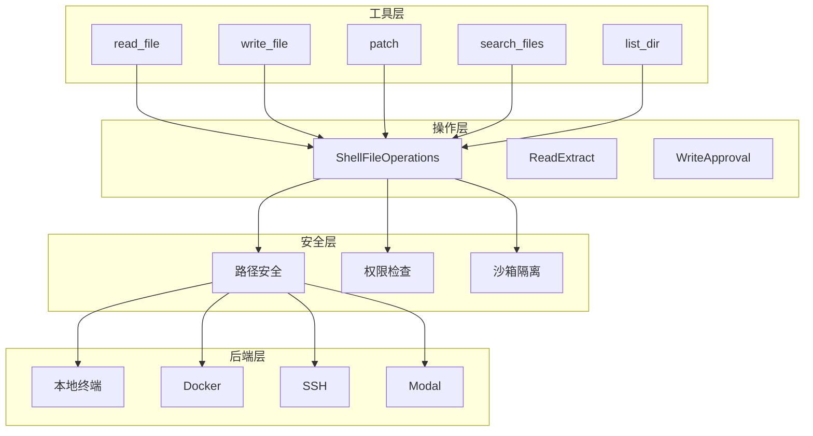

# 文件操作工具

<cite>
**本文引用的文件**
- [tools/file_operations.py](file://tools/file_operations.py)
- [tools/file_tools.py](file://tools/file_tools.py)
- [tools/read_extract.py](file://tools/read_extract.py)
- [tools/write_approval.py](file://tools/write_approval.py)
</cite>

## 目录
1. [简介](#简介)
2. [架构总览](#架构总览)
3. [核心工具详解](#核心工具详解)
4. [安全验证机制](#安全验证机制)
5. [大文件处理](#大文件处理)
6. [并发访问控制](#并发访问控制)
7. [最佳实践](#最佳实践)

## 简介

文件操作工具是Sparkii Agent的核心工具集，提供文件读写、编辑、搜索等功能。这些工具支持多种终端后端（本地、Docker、SSH、Singularity、Modal、Daytona、Vercel Sandbox），通过统一的接口提供跨平台的文件操作能力。

**核心工具：**
- `read_file` - 读取文件内容
- `write_file` - 写入文件内容
- `patch` - 编辑文件内容
- `search_files` - 搜索文件内容
- `list_dir` - 列出目录内容

**关键特性：**
- **跨平台支持**：支持多种终端后端
- **安全验证**：路径遍历防护和权限检查
- **大文件处理**：流式读取和分块处理
- **并发控制**：基于路径的冲突检测

## 架构总览



**图示来源**
- [tools/file_operations.py:1-50](file://tools/file_operations.py#L1-L50)
- [tools/file_tools.py](file://tools/file_tools.py)

## 核心工具详解

### 1. read_file工具

读取文件内容，支持行范围选择和编码指定。

**参数定义：**
```python
READ_FILE_SCHEMA = {
    "name": "read_file",
    "description": "Read file contents with optional line range",
    "parameters": {
        "type": "object",
        "properties": {
            "path": {
                "type": "string",
                "description": "File path to read"
            },
            "start_line": {
                "type": "integer",
                "description": "Start line number (1-based)"
            },
            "end_line": {
                "type": "integer",
                "description": "End line number (inclusive)"
            },
            "encoding": {
                "type": "string",
                "description": "File encoding (default: utf-8)"
            }
        },
        "required": ["path"]
    }
}
```

**使用示例：**
```python
# 读取整个文件
result = read_file({"path": "/path/to/file.py"})

# 读取指定行范围
result = read_file({
    "path": "/path/to/file.py",
    "start_line": 10,
    "end_line": 50
})

# 指定编码
result = read_file({
    "path": "/path/to/file.txt",
    "encoding": "gbk"
})
```

**返回值格式：**
```json
{
    "content": "文件内容...",
    "total_lines": 100,
    "file_size": 12345,
    "truncated": false,
    "line_ending": "\n"
}
```

### 2. write_file工具

写入文件内容，支持自动创建目录。

**参数定义：**
```python
WRITE_FILE_SCHEMA = {
    "name": "write_file",
    "description": "Write content to a file",
    "parameters": {
        "type": "object",
        "properties": {
            "path": {
                "type": "string",
                "description": "File path to write"
            },
            "content": {
                "type": "string",
                "description": "Content to write"
            },
            "encoding": {
                "type": "string",
                "description": "File encoding (default: utf-8)"
            },
            "create_dirs": {
                "type": "boolean",
                "description": "Create parent directories if needed"
            }
        },
        "required": ["path", "content"]
    }
}
```

**使用示例：**
```python
# 写入文件
result = write_file({
    "path": "/path/to/new_file.py",
    "content": "print('Hello, World!')",
    "create_dirs": true
})
```

**返回值格式：**
```json
{
    "success": true,
    "bytes_written": 21,
    "dirs_created": true,
    "verified": true
}
```

### 3. patch工具

编辑文件内容，支持查找替换和V4A patch模式。

**参数定义：**
```python
PATCH_SCHEMA = {
    "name": "patch",
    "description": "Edit file content using find-replace or V4A patch",
    "parameters": {
        "type": "object",
        "properties": {
            "path": {
                "type": "string",
                "description": "File path to edit"
            },
            "mode": {
                "type": "string",
                "enum": ["replace", "patch"],
                "description": "Edit mode"
            },
            "old_string": {
                "type": "string",
                "description": "Text to find (for replace mode)"
            },
            "new_string": {
                "type": "string",
                "description": "Replacement text (for replace mode)"
            },
            "patch": {
                "type": "string",
                "description": "V4A patch content (for patch mode)"
            },
            "replace_all": {
                "type": "boolean",
                "description": "Replace all occurrences"
            }
        },
        "required": ["path", "mode"]
    }
}
```

**使用示例：**
```python
# 查找替换
result = patch({
    "path": "/path/to/file.py",
    "mode": "replace",
    "old_string": "old_function()",
    "new_string": "new_function()"
})

# V4A patch模式
result = patch({
    "path": "/path/to/file.py",
    "mode": "patch",
    "patch": "*** Update File: /path/to/file.py\n--- old\n+++ new\n@@ -1,3 +1,3 @@\n-old line\n+new line"
})
```

### 4. search_files工具

搜索文件内容，支持正则表达式和文件过滤。

**参数定义：**
```python
SEARCH_FILES_SCHEMA = {
    "name": "search_files",
    "description": "Search for content in files",
    "parameters": {
        "type": "object",
        "properties": {
            "query": {
                "type": "string",
                "description": "Search query (regex supported)"
            },
            "path": {
                "type": "string",
                "description": "Directory to search in"
            },
            "glob": {
                "type": "string",
                "description": "File filter pattern"
            },
            "type": {
                "type": "string",
                "description": "File type filter"
            },
            "max_results": {
                "type": "integer",
                "description": "Maximum results to return"
            }
        },
        "required": ["query"]
    }
}
```

**使用示例：**
```python
# 搜索内容
result = search_files({
    "query": "TODO",
    "path": ".",
    "glob": "*.py"
})

# 正则表达式搜索
result = search_files({
    "query": "def\\s+\\w+\\(",
    "path": "./src"
})
```

### 5. list_dir工具

列出目录内容，支持递归和过滤。

**参数定义：**
```python
LIST_DIR_SCHEMA = {
    "name": "list_dir",
    "description": "List directory contents",
    "parameters": {
        "type": "object",
        "properties": {
            "path": {
                "type": "string",
                "description": "Directory path"
            },
            "recursive": {
                "type": "boolean",
                "description": "List recursively"
            },
            "pattern": {
                "type": "string",
                "description": "File pattern filter"
            },
            "max_depth": {
                "type": "integer",
                "description": "Maximum recursion depth"
            }
        },
        "required": ["path"]
    }
}
```

**使用示例：**
```python
# 列出当前目录
result = list_dir({"path": "."})

# 递归列出
result = list_dir({
    "path": "./src",
    "recursive": True,
    "pattern": "*.py",
    "max_depth": 3
})
```

## 安全验证机制

### 1. 路径遍历防护

```python
def _validate_file_path(file_path: str) -> Optional[str]:
    """Validate a file path for write_file/remove_file."""
    from tools.path_security import has_traversal_component
    
    if not file_path:
        return "file_path is required."
    
    normalized = Path(file_path)
    
    # 防止路径遍历
    if has_traversal_component(file_path):
        return "Path traversal ('..') is not allowed."
    
    # 检查允许的子目录
    if not normalized.parts or normalized.parts[0] not in ALLOWED_SUBDIRS:
        allowed = ", ".join(sorted(ALLOWED_SUBDIRS))
        return f"File must be under one of: {allowed}. Got: '{file_path}'"
    
    return None
```

### 2. 写入拒绝列表

```python
_HOME = str(Path.home())

WRITE_DENIED_PATHS = build_write_denied_paths(_HOME)
WRITE_DENIED_PREFIXES = build_write_denied_prefixes(_HOME)

def _is_write_denied(path: str) -> bool:
    """Return True if path is on the write deny list."""
    return _shared_is_write_denied(path)
```

**拒绝列表示例：**
```python
# 敏感系统文件
"/etc/passwd"
"/etc/shadow"
"~/.ssh/authorized_keys"

# 凭证文件
"~/.aws/credentials"
"~/.config/gcloud/credentials.db"
```

### 3. 权限检查

```python
def _check_write_permission(path: str) -> Optional[str]:
    """Check if write is allowed for the given path."""
    if _is_write_denied(path):
        return get_write_denied_error(path)
    
    # 检查文件是否存在且只读
    if os.path.exists(path) and not os.access(path, os.W_OK):
        return f"File '{path}' is read-only"
    
    return None
```

### 4. 沙箱隔离

```python
# 在沙箱环境中，文件操作被限制在特定目录
def _get_sandbox_root() -> Optional[Path]:
    """Return the sandbox root directory if running in sandbox."""
    sandbox_root = os.environ.get("SPARKII_SANDBOX_ROOT")
    if sandbox_root:
        return Path(sandbox_root)
    return None

def _is_in_sandbox(path: str) -> bool:
    """Check if path is within sandbox."""
    sandbox_root = _get_sandbox_root()
    if not sandbox_root:
        return False
    try:
        Path(path).resolve().relative_to(sandbox_root.resolve())
        return True
    except ValueError:
        return False
```

## 大文件处理

### 1. 流式读取

```python
def read_file_streaming(path: str, chunk_size: int = 8192) -> Iterator[str]:
    """Read file in chunks for memory efficiency."""
    with open(path, 'r', encoding='utf-8') as f:
        while True:
            chunk = f.read(chunk_size)
            if not chunk:
                break
            yield chunk
```

### 2. 行范围读取

```python
def read_file_lines(path: str, start_line: int = None, end_line: int = None) -> str:
    """Read specific line range from file."""
    with open(path, 'r', encoding='utf-8') as f:
        lines = f.readlines()
        
        # 调整行号（1-based）
        start = (start_line - 1) if start_line else 0
        end = end_line if end_line else len(lines)
        
        # 边界检查
        start = max(0, min(start, len(lines)))
        end = max(start, min(end, len(lines)))
        
        return ''.join(lines[start:end])
```

### 3. 分块写入

```python
def write_file_chunked(path: str, content: str, chunk_size: int = 8192) -> int:
    """Write file in chunks for large content."""
    bytes_written = 0
    with open(path, 'w', encoding='utf-8') as f:
        for i in range(0, len(content), chunk_size):
            chunk = content[i:i + chunk_size]
            f.write(chunk)
            bytes_written += len(chunk.encode('utf-8'))
    return bytes_written
```

### 4. 结果大小限制

```python
# 每个工具的结果大小限制
MAX_RESULT_SIZE_CHARS = 100_000  # 约100KB

def _truncate_result(result: str, max_size: int = MAX_RESULT_SIZE_CHARS) -> str:
    """Truncate result if it exceeds max size."""
    if len(result) <= max_size:
        return result
    
    # 保留开头和结尾
    half = max_size // 2
    return result[:half] + "\n\n... [truncated] ...\n\n" + result[-half:]
```

## 并发访问控制

### 1. 路径冲突检测

```python
_PATH_SCOPED_READERS = frozenset({"read_file", "search_files"})
_PATH_SCOPED_WRITERS = frozenset({"write_file", "patch"})

def _paths_overlap(left: Path, right: Path) -> bool:
    """Return True when two paths may refer to the same subtree."""
    left_parts = left.parts
    right_parts = right.parts
    if not left_parts or not right_parts:
        return bool(left_parts) == bool(right_parts) and bool(left_parts)
    common_len = min(len(left_parts), len(right_parts))
    return left_parts[:common_len] == right_parts[:common_len]
```

### 2. 批次规划

```python
def _plan_tool_batch_segments(tool_calls) -> List[tuple]:
    """Split a tool-call batch into parallel and sequential segments."""
    segments: list[list] = []
    current: list = []
    reserved_paths: list[tuple[Path, bool]] = []
    
    for tool_call in tool_calls:
        tool_name = tool_call.function.name
        
        # 路径作用域工具
        if tool_name in _PATH_SCOPED_TOOLS:
            scoped_paths = _extract_parallel_scope_paths(tool_name, function_args)
            is_writer = tool_name in _PATH_SCOPED_WRITERS
            
            # 检查路径冲突
            if any(
                (is_writer or existing_is_writer) and _paths_overlap(scoped_path, existing)
                for scoped_path in scoped_paths
                for existing, existing_is_writer in reserved_paths
            ):
                # 冲突：关闭当前并行段
                _close_parallel()
            
            reserved_paths.extend((p, is_writer) for p in scoped_paths)
            current.append(tool_call)
            continue
        
        # 其他工具处理...
```

### 3. 并行安全工具

```python
_PARALLEL_SAFE_TOOLS = frozenset({
    "read_file",
    "search_files",
    "session_search",
    "skill_view",
    "skills_list",
    "web_extract",
    "web_search",
    "vision_analyze",
})
```

## 最佳实践

### 1. 文件读取最佳实践

```python
# 读取整个文件
result = read_file({"path": "src/main.py"})

# 读取特定函数（假设在第50-100行）
result = read_file({
    "path": "src/main.py",
    "start_line": 50,
    "end_line": 100
})

# 处理大文件
if result.get("truncated"):
    # 分块读取
    for i in range(0, result["total_lines"], 1000):
        chunk = read_file({
            "path": "src/main.py",
            "start_line": i + 1,
            "end_line": i + 1000
        })
        process_chunk(chunk["content"])
```

### 2. 文件编辑最佳实践

```python
# 使用patch进行精确编辑
result = patch({
    "path": "src/config.py",
    "mode": "replace",
    "old_string": "DEBUG = False",
    "new_string": "DEBUG = True"
})

# 使用V4A patch进行多文件编辑
result = patch({
    "path": "src/",
    "mode": "patch",
    "patch": """*** Update File: src/main.py
--- old
+++ new
@@ -10,3 +10,3 @@
-old_value = 1
+new_value = 2

*** Update File: src/config.py
--- old
+++ new
@@ -5,2 +5,2 @@
-DEBUG = False
+DEBUG = True
"""
})
```

### 3. 安全文件操作

```python
# 避免写入敏感文件
# 错误示例
write_file({"path": "/etc/passwd", "content": "..."})  # 会被拒绝

# 正确示例
write_file({
    "path": "~/.myapp/config.json",
    "content": json.dumps(config, indent=2)
})

# 检查写入权限
result = write_file({"path": "protected_file.txt", "content": "..."})
if result.get("error"):
    print(f"Write failed: {result['error']}")
```

### 4. 批量文件操作

```python
# 批量搜索和替换
files_to_update = ["file1.py", "file2.py", "file3.py"]

for file_path in files_to_update:
    # 读取文件
    content = read_file({"path": file_path})
    
    # 执行替换
    new_content = content["content"].replace("old_func", "new_func")
    
    # 写回文件
    write_file({
        "path": file_path,
        "content": new_content
    })
```

## 结论

文件操作工具为Sparkii Agent提供了强大、安全、高效的文件操作能力。通过跨平台支持、安全验证机制、大文件处理和并发控制，系统能够满足各种复杂的文件操作需求。开发者可以通过简单的API进行文件读写、编辑和搜索，同时享受完善的安全保护和性能优化。
