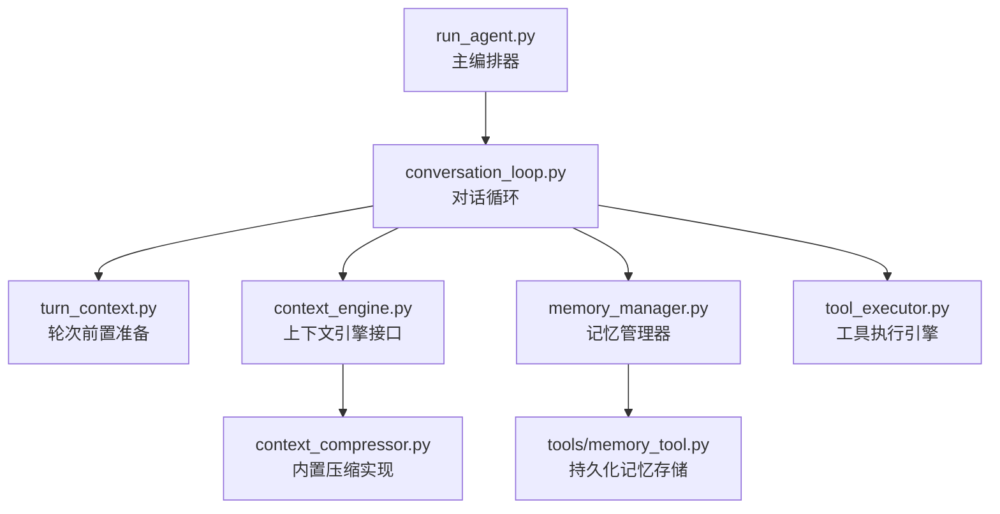
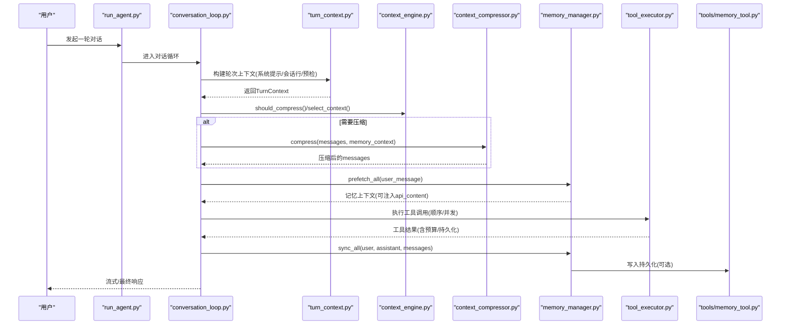
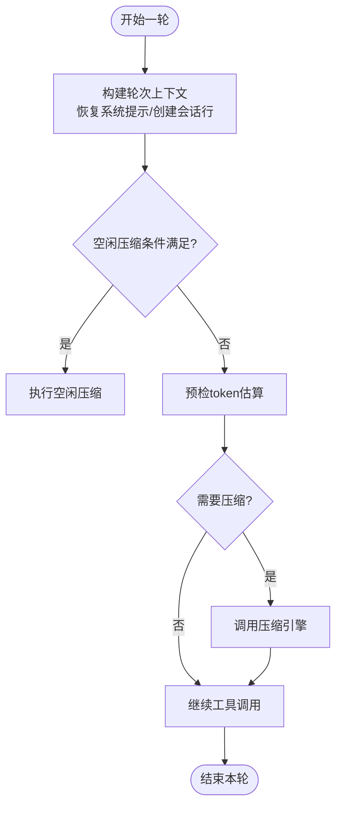
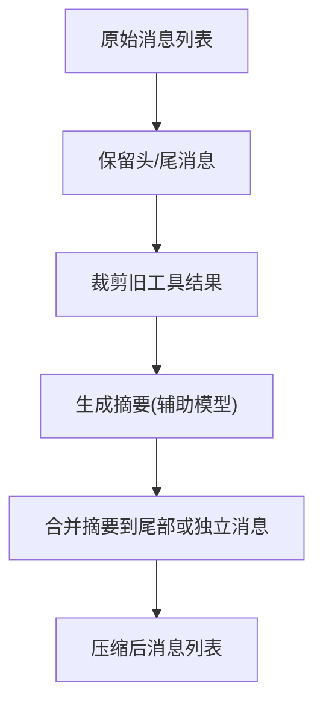
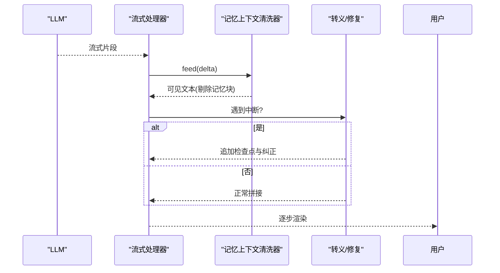
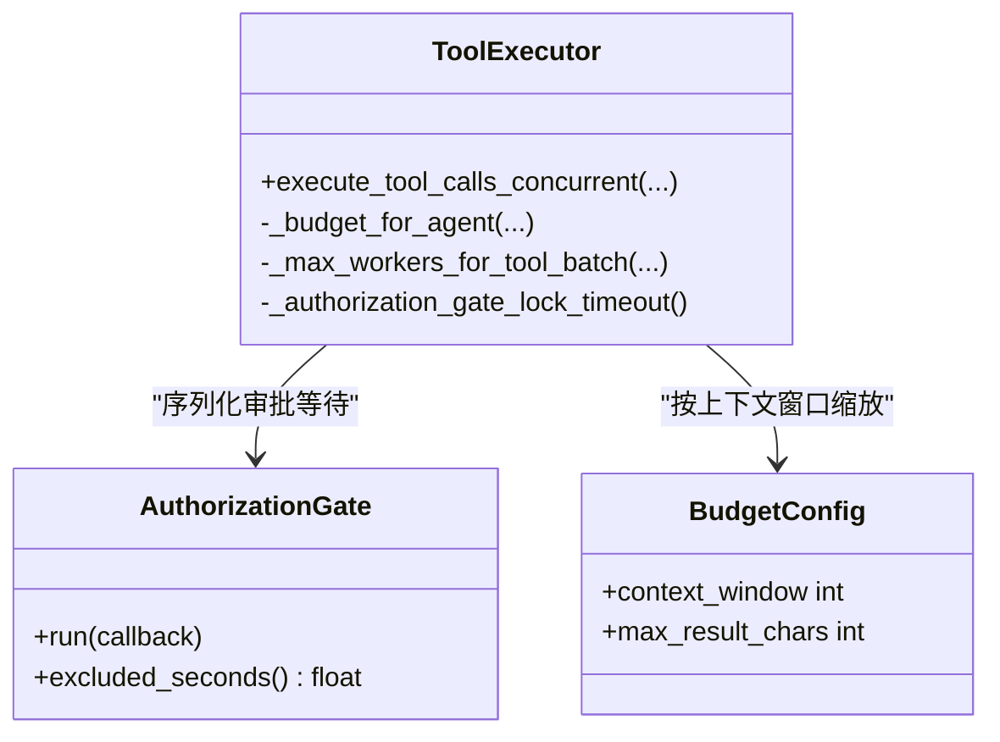
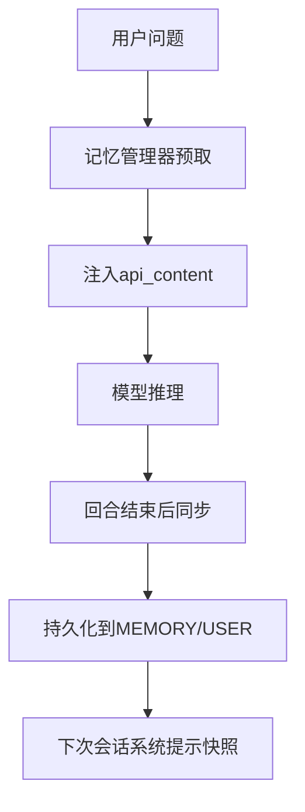
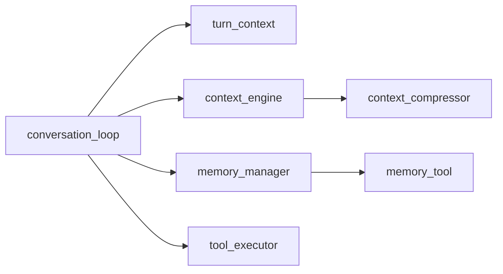

# 核心概念

<cite>
**本文引用的文件**
- [agent/conversation_loop.py](file://agent/conversation_loop.py)
- [agent/turn_context.py](file://agent/turn_context.py)
- [agent/context_engine.py](file://agent/context_engine.py)
- [agent/context_compressor.py](file://agent/context_compressor.py)
- [agent/memory_manager.py](file://agent/memory_manager.py)
- [tools/memory_tool.py](file://tools/memory_tool.py)
- [agent/tool_executor.py](file://agent/tool_executor.py)
- [run_agent.py](file://run_agent.py)
</cite>

## 目录
1. [简介](#简介)
2. [项目结构](#项目结构)
3. [核心组件](#核心组件)
4. [架构总览](#架构总览)
5. [详细组件分析](#详细组件分析)
6. [依赖关系分析](#依赖关系分析)
7. [性能考量](#性能考量)
8. [故障排查指南](#故障排查指南)
9. [结论](#结论)
10. [附录](#附录)

## 简介
本文件面向Hermes Agent的核心概念，系统性解释AI代理如何工作：对话管理、工具调用机制、上下文处理与记忆系统。重点覆盖会话生命周期、消息历史管理、上下文压缩算法、流式响应处理；工具执行引擎的安全沙箱隔离、并行执行机制与结果缓存策略；短期/长期记忆、用户画像构建与技能自动创建过程。文档既为初学者提供清晰概念，也为高级用户提供实现细节与技术深度。

## 项目结构
围绕“对话轮次”的编排，Hermes将原本集中在主入口的大块逻辑拆分为多个职责清晰的模块：
- 对话循环与轮次编排：conversation_loop、turn_context
- 上下文管理与压缩：context_engine、context_compressor
- 记忆系统：memory_manager（外部/内置提供者）、memory_tool（持久化存储）
- 工具执行：tool_executor（顺序/并发调度、授权门控、预算控制）
- 主入口与协调：run_agent（作为高层编排器，委托上述模块）

图表来源
- [run_agent.py:1-200](file://run_agent.py#L1-L200)
- [agent/conversation_loop.py:1-120](file://agent/conversation_loop.py#L1-L120)
- [agent/turn_context.py:1-120](file://agent/turn_context.py#L1-L120)
- [agent/context_engine.py:1-120](file://agent/context_engine.py#L1-L120)
- [agent/context_compressor.py:1-120](file://agent/context_compressor.py#L1-L120)
- [agent/memory_manager.py:1-120](file://agent/memory_manager.py#L1-L120)
- [tools/memory_tool.py:1-120](file://tools/memory_tool.py#L1-L120)
- [agent/tool_executor.py:1-120](file://agent/tool_executor.py#L1-L120)

章节来源
- [agent/conversation_loop.py:1-120](file://agent/conversation_loop.py#L1-L120)
- [agent/turn_context.py:1-120](file://agent/turn_context.py#L1-L120)
- [agent/context_engine.py:1-120](file://agent/context_engine.py#L1-L120)
- [agent/context_compressor.py:1-120](file://agent/context_compressor.py#L1-L120)
- [agent/memory_manager.py:1-120](file://agent/memory_manager.py#L1-L120)
- [tools/memory_tool.py:1-120](file://tools/memory_tool.py#L1-L120)
- [agent/tool_executor.py:1-120](file://agent/tool_executor.py#L1-L120)
- [run_agent.py:1-200](file://run_agent.py#L1-L200)

## 核心组件
- 对话循环（conversation_loop）：驱动单条用户请求的完整流程，包括模型调用、工具调度、重试、压缩、后置钩子与后台记忆/技能回顾提示。
- 轮次上下文（turn_context）：封装每轮的前置准备（系统提示恢复、会话行创建、预检压缩、外部记忆预取、崩溃恢复持久化等），并产出供循环消费的数据结构。
- 上下文引擎（context_engine）：抽象上下文管理策略（何时压缩、如何压缩、是否暴露工具、跟踪token使用）。
- 上下文压缩器（context_compressor）：内置实现，负责摘要生成、DAG构建、工具输出裁剪、滚动微压缩等。
- 记忆管理器（memory_manager）：统一接入内置与外部记忆提供者，负责系统提示注入、预取、同步与工具注册。
- 记忆工具（memory_tool）：文件级持久化记忆（MEMORY.md/USER.md），支持增删改、批操作、容量限制与安全扫描。
- 工具执行引擎（tool_executor）：顺序/并发执行工具，包含授权门控、预算控制、结果持久化与回调。

章节来源
- [agent/conversation_loop.py:1-120](file://agent/conversation_loop.py#L1-L120)
- [agent/turn_context.py:383-432](file://agent/turn_context.py#L383-L432)
- [agent/context_engine.py:89-129](file://agent/context_engine.py#L89-L129)
- [agent/context_compressor.py:1-120](file://agent/context_compressor.py#L1-L120)
- [agent/memory_manager.py:364-401](file://agent/memory_manager.py#L364-L401)
- [tools/memory_tool.py:148-179](file://tools/memory_tool.py#L148-L179)
- [agent/tool_executor.py:758-800](file://agent/tool_executor.py#L758-L800)

## 架构总览
下图展示从用户输入到模型响应、工具执行、上下文压缩与记忆更新的端到端流程。

图表来源
- [agent/conversation_loop.py:1-120](file://agent/conversation_loop.py#L1-L120)
- [agent/turn_context.py:412-432](file://agent/turn_context.py#L412-L432)
- [agent/context_engine.py:133-190](file://agent/context_engine.py#L133-L190)
- [agent/context_compressor.py:100-160](file://agent/context_compressor.py#L100-L160)
- [agent/memory_manager.py:525-545](file://agent/memory_manager.py#L525-L545)
- [agent/tool_executor.py:758-800](file://agent/tool_executor.py#L758-L800)
- [tools/memory_tool.py:390-447](file://tools/memory_tool.py#L390-L447)

## 详细组件分析

### 对话管理与会话生命周期
- 会话启动：在轮次前置阶段创建或恢复会话行，确保后续压缩/归档能正确引用父会话。
- 系统提示：优先从会话DB恢复缓存的系统提示，若缺失或运行时环境变化则重建并持久化，保证前缀缓存命中。
- 轮次边界：每轮重置重试计数、迭代预算、工具护栏状态；记录当前任务ID与轮次ID，便于追踪与诊断。
- 空闲压缩：当会话长时间无活动且上下文超过阈值时，触发空闲压缩以减少后续轮次的读取成本。

图表来源
- [agent/turn_context.py:697-800](file://agent/turn_context.py#L697-L800)
- [agent/context_engine.py:349-383](file://agent/context_engine.py#L349-L383)

章节来源
- [agent/turn_context.py:412-800](file://agent/turn_context.py#L412-L800)
- [agent/conversation_loop.py:548-760](file://agent/conversation_loop.py#L548-L760)

### 消息历史管理与上下文压缩
- 历史保护：始终保留系统提示与头部若干非系统消息，尾部保留最近N条消息，避免关键上下文丢失。
- 工具输出裁剪：在进入LLM摘要前先裁剪旧工具结果，降低输入体积。
- 滚动微压缩：对频繁出现的中间片段进行增量摘要更新，减少重复计算。
- 失败回退：当摘要不可用时，采用轻量回退策略保持连续性锚点。

图表来源
- [agent/context_compressor.py:100-160](file://agent/context_compressor.py#L100-L160)
- [agent/context_compressor.py:230-317](file://agent/context_compressor.py#L230-L317)
- [agent/context_compressor.py:487-513](file://agent/context_compressor.py#L487-L513)

章节来源
- [agent/context_compressor.py:100-513](file://agent/context_compressor.py#L100-L513)
- [agent/context_engine.py:162-211](file://agent/context_engine.py#L162-L211)

### 流式响应处理与中断恢复
- 流式清理：在流式输出中剥离内部记忆上下文标记，防止泄露至UI。
- 中断恢复：当用户修正或中断时，将可见响应与纠正信息以安全角色交替方式追加，避免破坏模板交替校验。
- 断点续传：通过api_content侧车字段保证重放与缓存前缀稳定。

图表来源
- [agent/memory_manager.py:182-345](file://agent/memory_manager.py#L182-L345)
- [agent/conversation_loop.py:195-273](file://agent/conversation_loop.py#L195-L273)
- [agent/turn_context.py:88-120](file://agent/turn_context.py#L88-L120)

章节来源
- [agent/memory_manager.py:182-345](file://agent/memory_manager.py#L182-L345)
- [agent/conversation_loop.py:195-273](file://agent/conversation_loop.py#L195-L273)
- [agent/turn_context.py:88-120](file://agent/turn_context.py#L88-L120)

### 工具执行引擎：安全沙箱、并行执行与结果缓存
- 安全沙箱：在执行前进行插件拦截与护栏决策，阻止危险命令或越权调用；对破坏性命令创建检查点。
- 并行执行：使用线程池并发执行工具调用，按序收集结果；对图像生成等慢操作限制并发度。
- 结果缓存与预算：根据上下文窗口动态调整工具结果预算，避免单次结果过大导致溢出；支持增量持久化以保证崩溃恢复。

图表来源
- [agent/tool_executor.py:78-111](file://agent/tool_executor.py#L78-L111)
- [agent/tool_executor.py:391-468](file://agent/tool_executor.py#L391-L468)
- [agent/tool_executor.py:758-800](file://agent/tool_executor.py#L758-L800)

章节来源
- [agent/tool_executor.py:78-111](file://agent/tool_executor.py#L78-L111)
- [agent/tool_executor.py:391-468](file://agent/tool_executor.py#L391-L468)
- [agent/tool_executor.py:758-800](file://agent/tool_executor.py#L758-L800)

### 记忆系统：短期/长期记忆、用户画像与技能自动创建
- 短期记忆（预取）：每轮开始前异步预取相关上下文，注入到当前用户消息的api_content，提升相关性。
- 长期记忆（持久化）：通过memory_tool维护MEMORY.md与USER.md，支持增删改与批操作，容量限制与安全扫描。
- 用户画像：USER.md用于记录用户偏好、沟通风格与工作习惯，注入系统提示快照，跨会话稳定。
- 技能自动创建：记忆管理器可将外部记忆提供者的工具模式注入到代理的工具表面，支持按需启用/禁用。

图表来源
- [agent/memory_manager.py:525-545](file://agent/memory_manager.py#L525-L545)
- [agent/memory_manager.py:638-694](file://agent/memory_manager.py#L638-L694)
- [tools/memory_tool.py:390-447](file://tools/memory_tool.py#L390-L447)
- [tools/memory_tool.py:682-693](file://tools/memory_tool.py#L682-L693)

章节来源
- [agent/memory_manager.py:525-694](file://agent/memory_manager.py#L525-L694)
- [tools/memory_tool.py:390-447](file://tools/memory_tool.py#L390-L447)
- [tools/memory_tool.py:682-693](file://tools/memory_tool.py#L682-L693)

## 依赖关系分析
- conversation_loop依赖turn_context完成轮次前置，依赖context_engine决定是否压缩，依赖memory_manager进行记忆预取与同步，依赖tool_executor执行工具调用。
- context_compressor作为context_engine的具体实现，提供压缩能力。
- memory_manager聚合多个记忆提供者，并将工具模式注入到代理工具集。
- tool_executor与memory_tool协作，确保工具结果与记忆数据的一致性与安全性。

图表来源
- [agent/conversation_loop.py:1-120](file://agent/conversation_loop.py#L1-L120)
- [agent/turn_context.py:412-432](file://agent/turn_context.py#L412-L432)
- [agent/context_engine.py:89-129](file://agent/context_engine.py#L89-L129)
- [agent/context_compressor.py:1-120](file://agent/context_compressor.py#L1-L120)
- [agent/memory_manager.py:364-401](file://agent/memory_manager.py#L364-L401)
- [tools/memory_tool.py:148-179](file://tools/memory_tool.py#L148-L179)
- [agent/tool_executor.py:758-800](file://agent/tool_executor.py#L758-L800)

章节来源
- [agent/conversation_loop.py:1-120](file://agent/conversation_loop.py#L1-L120)
- [agent/turn_context.py:412-432](file://agent/turn_context.py#L412-L432)
- [agent/context_engine.py:89-129](file://agent/context_engine.py#L89-L129)
- [agent/context_compressor.py:1-120](file://agent/context_compressor.py#L1-L120)
- [agent/memory_manager.py:364-401](file://agent/memory_manager.py#L364-L401)
- [tools/memory_tool.py:148-179](file://tools/memory_tool.py#L148-L179)
- [agent/tool_executor.py:758-800](file://agent/tool_executor.py#L758-L800)

## 性能考量
- 上下文压缩：通过工具输出裁剪、滚动微压缩与失败回退，降低LLM调用成本与延迟。
- 并行工具执行：合理设置并发上限，针对慢操作（如图像生成）限制并发，避免后端过载。
- 记忆预取超时：外部记忆提供者预取设置超时，避免阻塞主流程。
- 系统提示缓存：通过会话DB恢复与静态前缀重建，提高前缀缓存命中率，减少重复计算。

[本节为通用指导，不直接分析具体文件]

## 故障排查指南
- 压缩失败：检查摘要访问/配额错误分类，确认是否因认证或配额问题导致；必要时降级为回退策略。
- 工具执行被阻断：查看授权门控与护栏决策日志，确认是否被插件或策略阻止；检查破坏性命令的检查点。
- 记忆写入失败：检测文件漂移或读取失败，遵循错误提示进行修复；避免覆盖未解析内容。
- 流式输出异常：确认记忆上下文清洗器正常工作，避免内部标记泄露；检查中断恢复路径是否正确追加检查点。

章节来源
- [agent/context_compressor.py:73-95](file://agent/context_compressor.py#L73-L95)
- [agent/tool_executor.py:482-662](file://agent/tool_executor.py#L482-L662)
- [tools/memory_tool.py:91-145](file://tools/memory_tool.py#L91-L145)
- [agent/memory_manager.py:182-345](file://agent/memory_manager.py#L182-L345)

## 结论
Sparkii Agent通过模块化设计实现了健壮的对话管理、高效的上下文压缩、安全的工具执行与灵活的记忆系统。其核心在于将复杂流程拆解为可测试、可替换的组件，并通过严格的边界约束（如系统提示缓存、工具护栏、记忆清洗）保障稳定性与性能。对于初学者，建议从对话循环与记忆系统入手；对于高级用户，可深入上下文压缩算法与工具执行引擎的并发与预算控制。

[本节为总结，不直接分析具体文件]

## 附录
- 使用模式示例：
  - 在每轮开始前调用记忆管理器预取上下文，并将其注入到用户消息的api_content。
  - 在工具调用前后设置进度回调与检查点，确保副作用可恢复。
  - 在会话结束时触发记忆同步，将重要事实持久化到MEMORY/USER文件。
- 代码片段路径参考：
  - 轮次前置与系统提示恢复：[agent/turn_context.py:697-800](file://agent/turn_context.py#L697-L800)
  - 上下文压缩触发与执行：[agent/context_compressor.py:100-160](file://agent/context_compressor.py#L100-L160)
  - 记忆预取与同步：[agent/memory_manager.py:525-694](file://agent/memory_manager.py#L525-L694)
  - 工具并发执行与授权门控：[agent/tool_executor.py:391-468](file://agent/tool_executor.py#L391-L468)

[本节为附录，不直接分析具体文件]