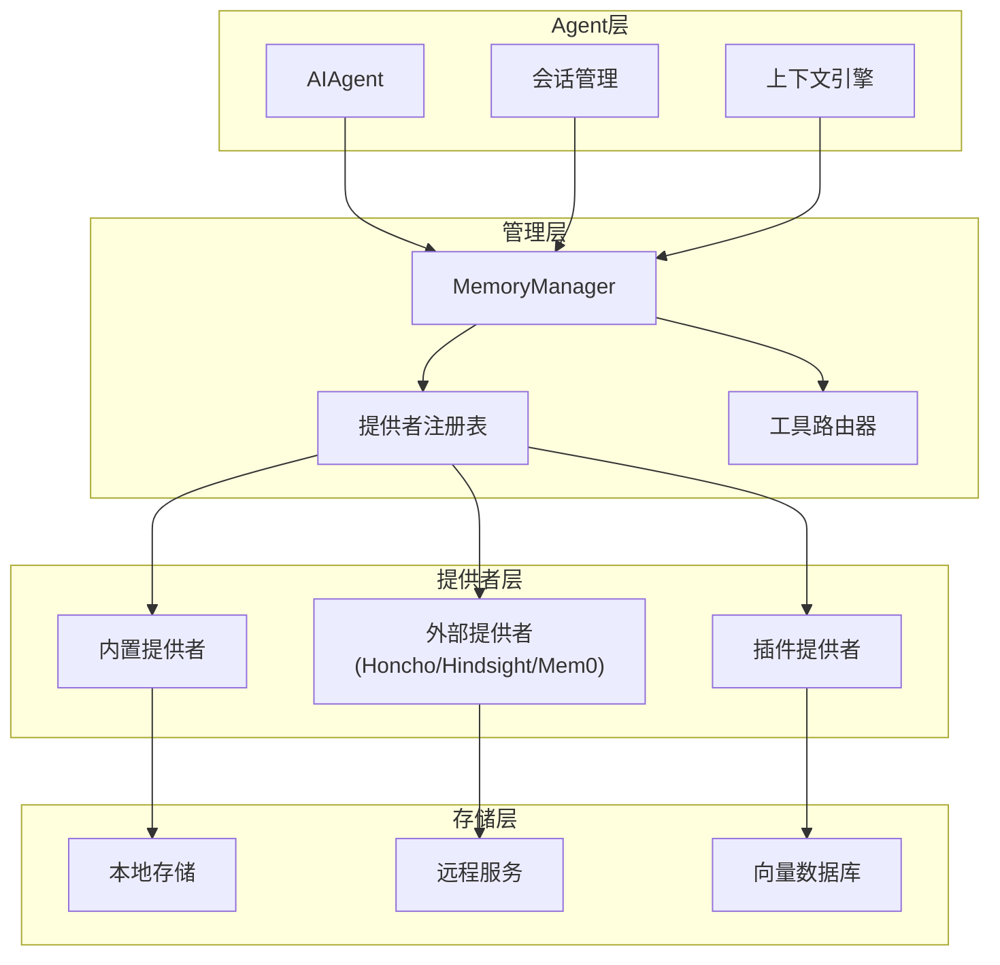

# 记忆系统架构

<cite>
**本文引用的文件**
- [agent/memory_manager.py](file://agent/memory_manager.py)
- [agent/memory_provider.py](file://agent/memory_provider.py)
</cite>

## 目录
1. [简介](#简介)
2. [架构总览](#架构总览)
3. [核心组件](#核心组件)
4. [提供者注册机制](#提供者注册机制)
5. [生命周期管理](#生命周期管理)
6. [异步处理机制](#异步处理机制)
7. [线程安全设计](#线程安全设计)
8. [最佳实践](#最佳实践)

## 简介

Sparkii Agent的记忆系统是一个可扩展的记忆管理框架，负责为Agent提供跨会话的持久化记忆能力。系统采用提供者模式，支持内置和外部记忆提供者，通过MemoryManager统一管理。

**核心特性：**
- **提供者模式**：支持多种记忆后端
- **单例管理**：MemoryManager集中管理所有提供者
- **异步处理**：后台线程处理同步和预取
- **线程安全**：完善的锁机制保护共享状态

## 架构总览



**图示来源**
- [agent/memory_manager.py:1-50](file://agent/memory_manager.py#L1-L50)
- [agent/memory_provider.py:1-50](file://agent/memory_provider.py#L1-L50)

## 核心组件

### MemoryManager类

```python
class MemoryManager:
    """Orchestrates the built-in provider plus at most one external provider."""
    
    def __init__(self, *, external_prefetch_timeout: Optional[float] = None) -> None:
        self._providers: List[MemoryProvider] = []
        self._tool_to_provider: Dict[str, MemoryProvider] = {}
        self._has_external: bool = False
        self._external_prefetch_timeout = (
            _EXTERNAL_PREFETCH_TIMEOUT_S
            if external_prefetch_timeout is None
            else float(external_prefetch_timeout)
        )
        self._external_prefetch_threads: Dict[str, threading.Thread] = {}
        self._external_prefetch_lock = threading.Lock()
        self._sync_executor: Optional[ThreadPoolExecutor] = None
        self._sync_executor_lock = threading.Lock()
        self._background_futures: Dict[Future, str] = {}
        self._shutting_down = False
```

**关键属性：**
- `_providers`: 已注册的提供者列表
- `_tool_to_provider`: 工具名到提供者的映射
- `_has_external`: 是否已有外部提供者
- `_external_prefetch_timeout`: 外部提供者预取超时
- `_sync_executor`: 后台同步执行器
- `_shutting_down`: 关闭标志

### MemoryProvider抽象类

```python
class MemoryProvider(ABC):
    """Abstract base class for memory providers."""
    
    @property
    @abstractmethod
    def name(self) -> str:
        """Short identifier for this provider."""
        pass
    
    @abstractmethod
    def is_available(self) -> bool:
        """Return True if this provider is configured and ready."""
        pass
    
    @abstractmethod
    def initialize(self, session_id: str, **kwargs) -> None:
        """Initialize for a session."""
        pass
    
    def system_prompt_block(self) -> str:
        """Return text to include in the system prompt."""
        return ""
    
    def prefetch(self, query: str, *, session_id: str = "") -> str:
        """Recall relevant context for the upcoming turn."""
        return ""
    
    def sync_turn(self, user_content: str, assistant_content: str, 
                  *, session_id: str = "", messages=None) -> None:
        """Persist a completed turn to the backend."""
        pass
    
    @abstractmethod
    def get_tool_schemas(self) -> List[Dict[str, Any]]:
        """Return tool schemas this provider exposes."""
        pass
    
    def handle_tool_call(self, tool_name: str, args: Dict[str, Any], **kwargs) -> str:
        """Handle a tool call for one of this provider's tools."""
        raise NotImplementedError(...)
    
    def shutdown(self) -> None:
        """Clean shutdown."""
        pass
```

## 提供者注册机制

### 1. 注册流程

```python
def add_provider(self, provider: MemoryProvider) -> None:
    """Register a memory provider."""
    is_builtin = provider.name == "builtin"
    
    if not is_builtin:
        if self._has_external:
            existing = next(
                (p.name for p in self._providers if p.name != "builtin"), "unknown"
            )
            logger.warning(
                "Rejected memory provider '%s' — external provider '%s' is "
                "already registered. Only one external memory provider is "
                "allowed at a time.",
                provider.name, existing,
            )
            return
        self._has_external = True
    
    self._providers.append(provider)
    
    # 工具名到提供者的映射
    from toolsets import _SPARKII_CORE_TOOLS
    _core_tool_names = set(_SPARKII_CORE_TOOLS)
    
    for raw_schema in provider.get_tool_schemas():
        schema = normalize_tool_schema(raw_schema)
        if schema is None:
            continue
        tool_name = schema["name"]
        
        # 检查核心工具冲突
        if tool_name in _core_tool_names:
            logger.warning(
                "Memory provider '%s' tool '%s' shadows a reserved core "
                "tool name; registration ignored.",
                provider.name, tool_name,
            )
            continue
        
        if tool_name and tool_name not in self._tool_to_provider:
            self._tool_to_provider[tool_name] = provider
        elif tool_name in self._tool_to_provider:
            logger.warning(
                "Memory tool name conflict: '%s' already registered by %s",
                tool_name, self._tool_to_provider[tool_name].name,
            )
    
    logger.info("Memory provider '%s' registered (%d tools)", 
                provider.name, len(provider.get_tool_schemas()))
```

### 2. 外部提供者限制

```python
# 只允许一个外部提供者
if not is_builtin:
    if self._has_external:
        existing = next(
            (p.name for p in self._providers if p.name != "builtin"), "unknown"
        )
        logger.warning(
            "Rejected memory provider '%s' — external provider '%s' is "
            "already registered. Only one external memory provider is "
            "allowed at a time. Configure which one via memory.provider "
            "in config.yaml.",
            provider.name, existing,
        )
        return
    self._has_external = True
```

**设计原因：**
- 防止工具Schema膨胀
- 避免冲突的内存后端
- 简化配置和管理

### 3. 工具Schema标准化

```python
def normalize_tool_schema(schema: Any) -> Optional[Dict[str, Any]]:
    """Return a function-tool dict with a resolvable top-level name."""
    if not isinstance(schema, dict):
        return None
    
    # 处理已包装的OpenAI工具格式
    if schema.get("type") == "function" and isinstance(schema.get("function"), dict):
        schema = schema["function"]
        if not isinstance(schema, dict):
            return None
    
    name = schema.get("name", "")
    if not name or not isinstance(name, str):
        return None
    
    return schema
```

## 生命周期管理

### 1. 初始化

```python
def initialize_all(self, session_id: str, **kwargs) -> None:
    """Initialize all providers."""
    if "sparkii_home" not in kwargs:
        from sparkii_constants import get_sparkii_home
        kwargs["sparkii_home"] = str(get_sparkii_home())
    
    for provider in self._providers:
        try:
            provider.initialize(session_id=session_id, **kwargs)
        except Exception as e:
            logger.warning("Memory provider '%s' initialize failed: %s", 
                          provider.name, e)
```

### 2. 系统提示构建

```python
def build_system_prompt(self) -> str:
    """Collect system prompt blocks from all providers."""
    blocks = []
    for provider in self._providers:
        try:
            block = provider.system_prompt_block()
            if block and block.strip():
                blocks.append(block)
        except Exception as e:
            logger.warning(
                "Memory provider '%s' system_prompt_block() failed: %s",
                provider.name, e,
            )
    return "\n\n".join(blocks)
```

### 3. 会话结束处理

```python
def on_session_end(self, messages: List[Dict[str, Any]]) -> None:
    """Notify all providers of session end."""
    for provider in self._providers:
        try:
            provider.on_session_end(messages)
        except Exception as e:
            logger.warning(
                "Memory provider '%s' on_session_end failed: %s",
                provider.name, e,
                exc_info=True,
            )
```

### 4. 关闭流程

```python
def shutdown_all(self) -> None:
    """Shut down all providers (reverse order for clean teardown)."""
    self._drain_sync_executor()
    
    for provider in reversed(self._providers):
        try:
            provider.shutdown()
        except Exception as e:
            logger.warning(
                "Memory provider '%s' shutdown failed: %s",
                provider.name, e,
            )

def _drain_sync_executor(self) -> None:
    """Give queued FIFO work a bounded chance, then abandon explicitly."""
    with self._sync_executor_lock:
        self._shutting_down = True
        executor = self._sync_executor
        self._sync_executor = None
        # ... 等待和超时处理
```

## 异步处理机制

### 1. 预取机制

```python
def prefetch_all(self, query: str, *, session_id: str = "") -> str:
    """Collect prefetch context from all providers."""
    clean_query = self._strip_skill_scaffolding(query)
    if not clean_query:
        return ""
    
    parts = []
    for provider in self._providers:
        try:
            result = self._prefetch_provider(provider, clean_query, session_id=session_id)
            if result and result.strip():
                parts.append(result)
        except Exception as e:
            logger.debug("Memory provider '%s' prefetch failed: %s", provider.name, e)
    
    return "\n\n".join(parts)

def _prefetch_provider(self, provider: MemoryProvider, query: str, 
                       *, session_id: str = "") -> str:
    """Prefetch from a provider with timeout handling."""
    if provider.name == "builtin":
        return provider.prefetch(query, session_id=session_id)
    
    # 外部提供者使用线程超时
    result_box: Dict[str, str] = {}
    error_box: Dict[str, Exception] = {}
    
    def _run() -> None:
        try:
            result_box["value"] = provider.prefetch(query, session_id=session_id) or ""
        except Exception as exc:
            error_box["value"] = exc
    
    thread = threading.Thread(
        target=_run,
        daemon=True,
        name=f"memory-prefetch-{provider.name}",
    )
    
    with self._external_prefetch_lock:
        existing = self._external_prefetch_threads.get(provider.name)
        if existing is not None and existing.is_alive():
            logger.debug("Memory provider '%s' prefetch is still running; skipping", 
                        provider.name)
            return ""
        self._external_prefetch_threads[provider.name] = thread
        thread.start()
    
    thread.join(self._external_prefetch_timeout)
    if thread.is_alive():
        logger.warning("Memory provider '%s' prefetch timed out after %.1fs", 
                      provider.name, self._external_prefetch_timeout)
        return ""
    
    if error_box:
        raise error_box["value"]
    return result_box.get("value", "")
```

### 2. 同步机制

```python
def sync_all(self, user_content: str, assistant_content: str, 
             *, session_id: str = "", messages=None) -> None:
    """Sync a completed turn to all providers."""
    providers = list(self._providers)
    if not providers:
        return
    
    clean_user_content = self._strip_skill_scaffolding(user_content)
    if not clean_user_content:
        return
    user_content = clean_user_content
    
    def _run() -> None:
        for provider in providers:
            try:
                if messages is not None and self._provider_sync_accepts_messages(provider):
                    provider.sync_turn(user_content, assistant_content, 
                                      session_id=session_id, messages=messages)
                else:
                    provider.sync_turn(user_content, assistant_content, 
                                      session_id=session_id)
            except Exception as e:
                logger.warning("Memory provider '%s' sync_turn failed: %s", 
                              provider.name, e)
    
    self._submit_background(_run)
```

### 3. 后台执行器

```python
def _submit_background(self, fn, *, kind: str = "write") -> None:
    """Queue fn on the serialized worker and track its durability class."""
    executor = self._get_sync_executor()
    if executor is None:
        if self._shutting_down:
            logger.warning("Memory manager is shutting down; rejecting late %s task", kind)
            return
        try:
            fn()
        except Exception as e:
            logger.debug("Inline memory background task failed: %s", e)
        return
    
    try:
        with self._sync_executor_lock:
            if self._shutting_down:
                logger.warning("Memory manager is shutting down; rejecting late %s task", kind)
                return
            future = executor.submit(fn)
            self._background_futures[future] = kind
        future.add_done_callback(self._forget_background_future)
    except RuntimeError:
        if self._shutting_down:
            return
        try:
            fn()
        except Exception as e:
            logger.debug("Inline memory background task failed: %s", e)
```

## 线程安全设计

### 1. 锁机制

```python
class MemoryManager:
    def __init__(self):
        self._external_prefetch_lock = threading.Lock()
        self._sync_executor_lock = threading.Lock()
```

### 2. 原子操作

```python
def _submit_background(self, fn, *, kind: str = "write") -> None:
    try:
        with self._sync_executor_lock:
            if self._shutting_down:
                return
            future = executor.submit(fn)
            self._background_futures[future] = kind
        # 回调在锁外添加，避免死锁
        future.add_done_callback(self._forget_background_future)
    except RuntimeError:
        # 处理执行器关闭的情况
        pass
```

### 3. 优雅关闭

```python
def _drain_sync_executor(self) -> None:
    """Give queued FIFO work a bounded chance, then abandon explicitly."""
    with self._sync_executor_lock:
        self._shutting_down = True
        executor = self._sync_executor
        self._sync_executor = None
        tracked = dict(self._background_futures)
    
    if executor is None:
        return
    
    # 关闭提交，但不取消正在执行的任务
    executor.shutdown(wait=False, cancel_futures=False)
    
    # 等待已跟踪的任务完成
    _, pending = wait(tuple(tracked), timeout=_SYNC_DRAIN_TIMEOUT_S)
    
    if not pending:
        return
    
    # 记录被放弃的任务
    abandoned_writes = 0
    abandoned_prefetches = 0
    for future in pending:
        kind = tracked[future]
        if future.cancel():
            if kind == "prefetch":
                abandoned_prefetches += 1
            else:
                abandoned_writes += 1
    
    logger.warning(
        "Memory shutdown drain timed out; abandoning %d queued write(s) "
        "and %d queued prefetch(es)",
        abandoned_writes, abandoned_prefetches,
    )
```

## 最佳实践

### 1. 实现自定义提供者

```python
from agent.memory_provider import MemoryProvider

class MyMemoryProvider(MemoryProvider):
    @property
    def name(self) -> str:
        return "my-provider"
    
    def is_available(self) -> bool:
        # 检查配置和依赖
        return os.environ.get("MY_MEMORY_API_KEY") is not None
    
    def initialize(self, session_id: str, **kwargs) -> None:
        # 初始化连接和资源
        self.client = MyMemoryClient(
            api_key=os.environ["MY_MEMORY_API_KEY"],
            session_id=session_id,
        )
    
    def prefetch(self, query: str, *, session_id: str = "") -> str:
        # 检索相关记忆
        results = self.client.search(query, limit=5)
        return "\n".join(r.content for r in results)
    
    def sync_turn(self, user_content: str, assistant_content: str, 
                  *, session_id: str = "") -> None:
        # 保存对话轮次
        self.client.add_memory(
            content=f"User: {user_content}\nAssistant: {assistant_content}",
            metadata={"session_id": session_id},
        )
    
    def get_tool_schemas(self) -> List[Dict[str, Any]]:
        return [{
            "name": "memory_search",
            "description": "Search through memory",
            "parameters": {
                "type": "object",
                "properties": {
                    "query": {"type": "string", "description": "Search query"}
                },
                "required": ["query"]
            }
        }]
    
    def handle_tool_call(self, tool_name: str, args: Dict[str, Any], **kwargs) -> str:
        if tool_name == "memory_search":
            results = self.client.search(args["query"])
            return json.dumps({"results": [r.to_dict() for r in results]})
        raise NotImplementedError(f"Unknown tool: {tool_name}")
    
    def shutdown(self) -> None:
        # 清理资源
        if hasattr(self, 'client'):
            self.client.close()
```

### 2. 配置提供者

```yaml
# config.yaml
memory:
  provider: my-provider
  
  my-provider:
    api_key: ${MY_MEMORY_API_KEY}
    endpoint: https://api.mymemory.com
    max_results: 10
```

### 3. 注册提供者

```python
# 在Agent初始化时
from agent.memory_manager import MemoryManager

memory_manager = MemoryManager()

# 注册内置提供者
from agent.builtin_memory_provider import BuiltinMemoryProvider
memory_manager.add_provider(BuiltinMemoryProvider())

# 注册外部提供者
from plugins.memory.my_provider import MyMemoryProvider
memory_manager.add_provider(MyMemoryProvider())
```

## 结论

Sparkii Agent的记忆系统通过提供者模式和集中式管理，为Agent提供了强大而灵活的记忆能力。系统支持多种记忆后端，通过异步处理和线程安全设计，确保了高性能和可靠性。开发者可以通过实现MemoryProvider接口快速集成自定义记忆后端。
