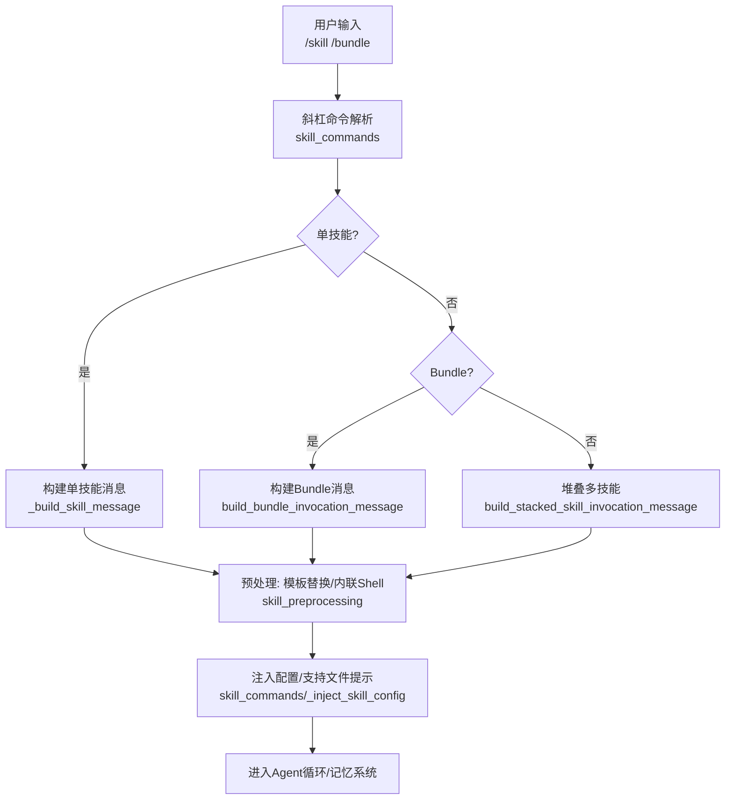
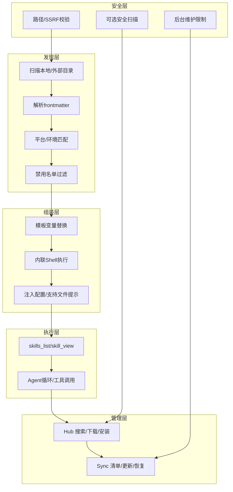
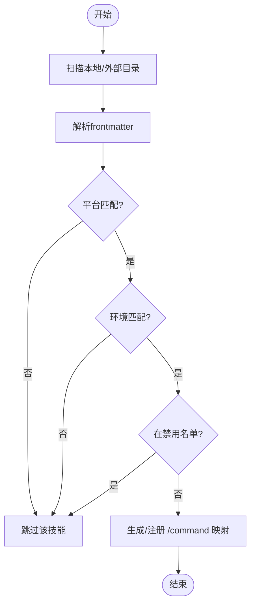
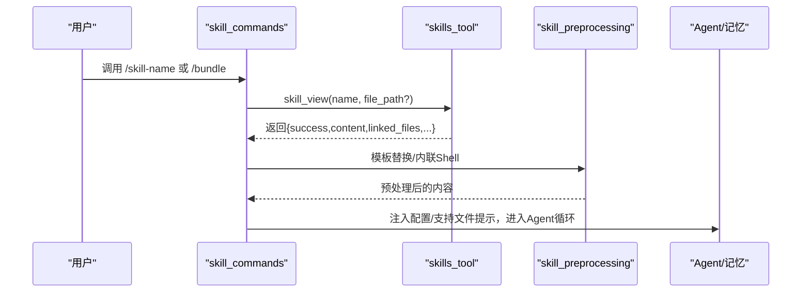
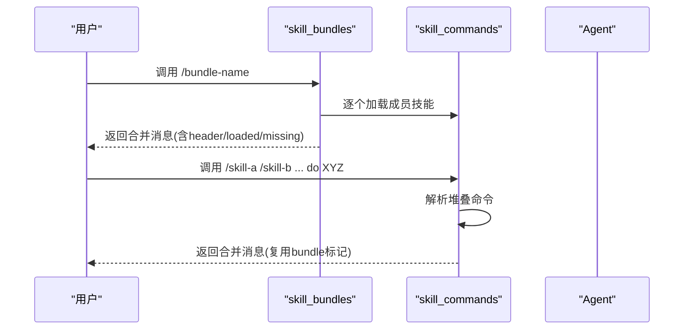
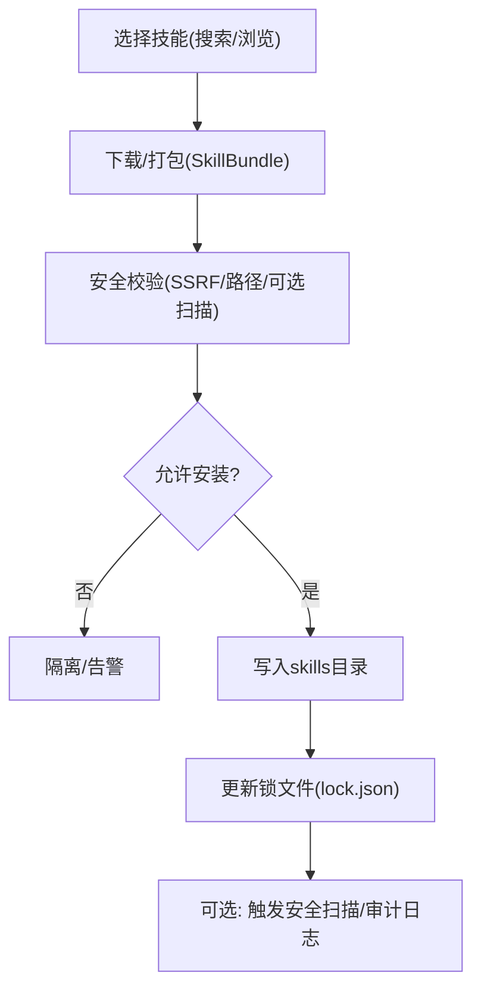
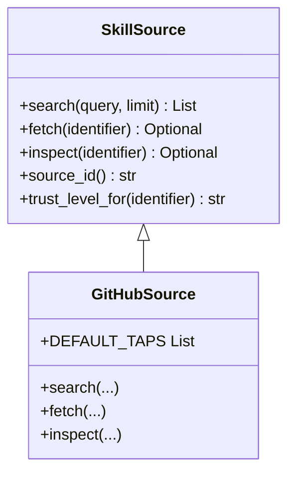
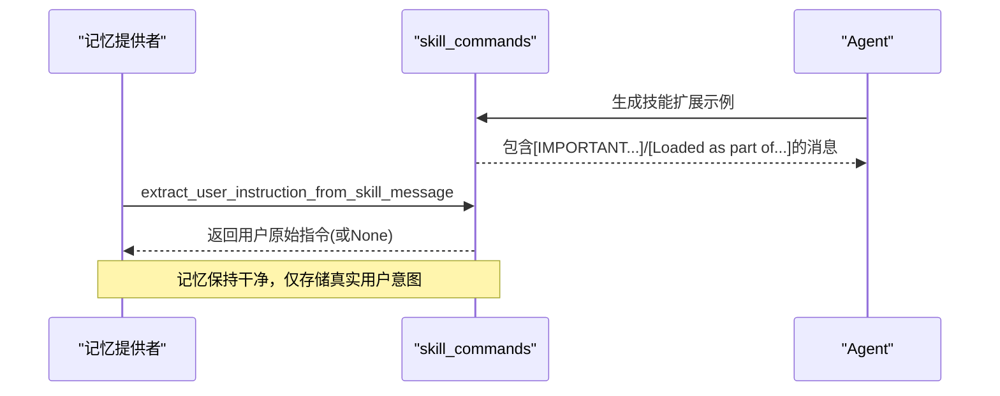
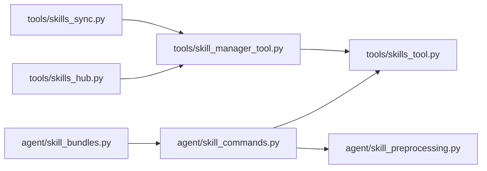

# 技能学习系统

<cite>
**本文引用的文件**
- [agent/skill_bundles.py](file://agent/skill_bundles.py)
- [agent/skill_commands.py](file://agent/skill_commands.py)
- [agent/skill_preprocessing.py](file://agent/skill_preprocessing.py)
- [agent/skill_utils.py](file://agent/skill_utils.py)
- [tools/skills_tool.py](file://tools/skills_tool.py)
- [tools/skill_manager_tool.py](file://tools/skill_manager_tool.py)
- [tools/skills_hub.py](file://tools/skills_hub.py)
- [tools/skills_sync.py](file://tools/skills_sync.py)
</cite>

## 目录
1. [简介](#简介)
2. [项目结构](#项目结构)
3. [核心组件](#核心组件)
4. [架构总览](#架构总览)
5. [详细组件分析](#详细组件分析)
6. [依赖关系分析](#依赖关系分析)
7. [性能考虑](#性能考虑)
8. [故障排查指南](#故障排查指南)
9. [结论](#结论)
10. [附录](#附录)

## 简介
本文件面向 Hermes Agent 的“技能学习系统”，系统性说明技能的自动发现、执行框架、组合编排、生命周期管理、安全机制以及与记忆系统的集成。文档既适合初学者理解基本概念与使用方法，也为高级用户提供插件化扩展与内部实现细节。

## 项目结构
技能系统围绕“本地/外部技能目录 + 技能清单/索引 + 工具层 + 包管理器/同步器”展开：
- 技能定义与加载：SKILL.md（YAML frontmatter）+ 支持文件（references/templates/scripts/assets）
- 自动发现：扫描本地与外部目录，解析 frontmatter，过滤平台与环境相关性，生成斜杠命令映射
- 执行框架：将 SKILL.md 内容预处理后注入到模型消息中，附带配置、支持文件提示等
- 组合编排：Bundle YAML 一次加载多个技能；支持多技能堆叠调用
- 生命周期：安装/更新/卸载由 Hub 与 Sync 管理，使用清单与锁文件追踪来源与版本
- 安全：路径校验、SSRF 防护、可选的安全扫描、后台维护限制
- 记忆集成：从技能扩展示例中抽取用户指令，避免把完整技能体写入记忆

**图表来源**
- [agent/skill_commands.py:271-371](file://agent/skill_commands.py#L271-L371)
- [agent/skill_bundles.py:253-368](file://agent/skill_bundles.py#L253-L368)
- [agent/skill_preprocessing.py:39-145](file://agent/skill_preprocessing.py#L39-L145)

**章节来源**
- [agent/skill_commands.py:1-800](file://agent/skill_commands.py#L1-L800)
- [agent/skill_bundles.py:1-439](file://agent/skill_bundles.py#L1-L439)
- [agent/skill_preprocessing.py:1-145](file://agent/skill_preprocessing.py#L1-L145)

## 核心组件
- 技能发现与斜杠命令注册：扫描本地与外部技能目录，解析 frontmatter，按平台与环境过滤，生成 /command 映射
- 技能消息构建与预处理：模板变量替换、内联 Shell 执行、配置注入、支持文件提示
- Bundle 与堆叠调用：一次性加载多个技能或连续多个 /skill 命令
- 技能工具与列表：skills_list/skill_view 提供渐进式披露（元数据→全文→支持文件）
- 技能管理器：创建/编辑/删除/写文件，含权限与安全守卫
- 技能仓库与同步：Hub 搜索/下载/安装，Sync 维护内置/官方可选技能清单与更新
- 安全与合规：路径校验、SSRF 防护、可选安全扫描、后台维护限制

**章节来源**
- [tools/skills_tool.py:673-781](file://tools/skills_tool.py#L673-L781)
- [agent/skill_commands.py:374-467](file://agent/skill_commands.py#L374-L467)
- [agent/skill_bundles.py:168-244](file://agent/skill_bundles.py#L168-L244)
- [tools/skill_manager_tool.py:523-700](file://tools/skill_manager_tool.py#L523-L700)
- [tools/skills_hub.py:476-753](file://tools/skills_hub.py#L476-L753)
- [tools/skills_sync.py:675-800](file://tools/skills_sync.py#L675-L800)

## 架构总览
技能系统采用“分层+可插拔”的架构：
- 发现层：扫描目录、解析 frontmatter、平台/环境匹配、禁用名单过滤
- 组装层：将 SKILL.md 与上下文（配置、支持文件、会话ID）拼装为模型消息
- 执行层：通过工具接口（skills_tool）按需加载，结合 Agent 循环执行
- 管理层：Hub/Sync 负责获取、安装、更新、卸载与溯源
- 安全层：路径校验、SSRF、可选扫描、后台维护限制

**图表来源**
- [agent/skill_utils.py:226-387](file://agent/skill_utils.py#L226-L387)
- [agent/skill_preprocessing.py:39-145](file://agent/skill_preprocessing.py#L39-L145)
- [tools/skills_tool.py:673-781](file://tools/skills_tool.py#L673-L781)
- [tools/skills_hub.py:294-338](file://tools/skills_hub.py#L294-L338)
- [tools/skill_manager_tool.py:301-421](file://tools/skill_manager_tool.py#L301-L421)

## 详细组件分析

### 自动发现与斜杠命令注册
- 扫描范围：本地 skills 目录与配置的 external_dirs
- 解析规则：读取 SKILL.md 的 YAML frontmatter，提取 name/description/platforms/environments 等
- 过滤策略：
  - 平台匹配：根据 sys.platform 与 Termux 特殊处理
  - 环境匹配：kanban/docker/s6 等运行时相关
  - 禁用名单：全局与平台级 disabled 列表
- 斜杠命令映射：规范化名称为 slug，避免与核心命令冲突，去重并记录描述

**图表来源**
- [agent/skill_commands.py:374-467](file://agent/skill_commands.py#L374-L467)
- [agent/skill_utils.py:226-387](file://agent/skill_utils.py#L226-L387)
- [tools/skills_tool.py:673-781](file://tools/skills_tool.py#L673-L781)

**章节来源**
- [agent/skill_commands.py:374-467](file://agent/skill_commands.py#L374-L467)
- [agent/skill_utils.py:226-387](file://agent/skill_utils.py#L226-L387)
- [tools/skills_tool.py:673-781](file://tools/skills_tool.py#L673-L781)

### 技能执行框架：参数验证、错误处理、结果缓存
- 参数与路径安全：
  - skill_view 对 name/file_path 进行相对路径与遍历检查，拒绝绝对路径与 ..
  - 支持文件路径白名单（references/templates/scripts/assets/examples）
- 错误处理：
  - 内联 Shell 超时/失败返回友好标记，不中断整体消息构建
  - 前端/后端异常捕获并降级（如无法读取配置时仍继续）
- 结果缓存：
  - 技能列表缓存：基于目录签名与 TTL，减少重复扫描
  - 配置/外部目录缓存：基于 config.yaml mtime/size 键值缓存

**图表来源**
- [tools/skills_tool.py:180-204](file://tools/skills_tool.py#L180-L204)
- [agent/skill_preprocessing.py:65-125](file://agent/skill_preprocessing.py#L65-L125)
- [agent/skill_commands.py:271-371](file://agent/skill_commands.py#L271-L371)

**章节来源**
- [tools/skills_tool.py:180-204](file://tools/skills_tool.py#L180-L204)
- [agent/skill_preprocessing.py:65-125](file://agent/skill_preprocessing.py#L65-L125)
- [tools/skills_tool.py:673-781](file://tools/skills_tool.py#L673-L781)

### 技能组合与编排：Bundle 与堆叠调用
- Bundle：YAML 声明一组技能，一次加载，合并为一条用户消息，包含缺失/禁用提示
- 堆叠调用：连续多个 /skill 前缀被解析为“堆叠技能包”，最多支持固定数量
- 行为一致性：两者均复用相同标记以便记忆系统正确抽取用户指令

**图表来源**
- [agent/skill_bundles.py:253-368](file://agent/skill_bundles.py#L253-L368)
- [agent/skill_commands.py:616-744](file://agent/skill_commands.py#L616-L744)

**章节来源**
- [agent/skill_bundles.py:253-368](file://agent/skill_bundles.py#L253-L368)
- [agent/skill_commands.py:616-744](file://agent/skill_commands.py#L616-L744)

### 生命周期管理：安装、更新、卸载与版本控制
- 安装：
  - Hub 从 GitHub/官方源拉取技能包，进行 SSRF 与路径校验，写入 quarantine 或直接安装
  - 记录锁文件（lock.json）中的 install_path、content_hash、trust_level、source 等
- 更新：
  - Sync 对比 bundled/optional 源与用户目录，增量复制/更新，尊重用户修改
  - 恢复重命名/重新分类的技能，清理孤立备份
- 卸载：
  - Hub 管理已安装技能，删除时校验路径安全性，防止误删
- 版本控制：
  - 使用 content_hash 与 manifest 跟踪来源与变更，支持回滚/修复

**图表来源**
- [tools/skills_hub.py:294-338](file://tools/skills_hub.py#L294-L338)
- [tools/skills_hub.py:645-708](file://tools/skills_hub.py#L645-L708)
- [tools/skills_sync.py:675-800](file://tools/skills_sync.py#L675-L800)

**章节来源**
- [tools/skills_hub.py:294-338](file://tools/skills_hub.py#L294-L338)
- [tools/skills_hub.py:645-708](file://tools/skills_hub.py#L645-L708)
- [tools/skills_sync.py:675-800](file://tools/skills_sync.py#L675-L800)

### 安全机制：可信度与第三方技能保护
- 路径与资源安全：
  - 拒绝绝对路径与遍历组件，限制支持文件子目录
  - SSRF 防护：URL 白名单与访问策略检查，禁止自动跟随重定向
- 信任等级：
  - builtin/trusted/community，来自官方/可信仓库或社区
- 安全扫描：
  - 可选 guard_agent_created，对代理创建的技能进行扫描与阻断
- 后台维护限制：
  - 背景审查分支仅允许对受控技能进行变更，阻止对外部/受保护/未认领技能的自动修改

**图表来源**
- [tools/skills_hub.py:476-753](file://tools/skills_hub.py#L476-L753)
- [tools/skills_hub.py:294-338](file://tools/skills_hub.py#L294-L338)
- [tools/skill_manager_tool.py:97-149](file://tools/skill_manager_tool.py#L97-L149)
- [tools/skill_manager_tool.py:301-421](file://tools/skill_manager_tool.py#L301-L421)

**章节来源**
- [tools/skills_hub.py:294-338](file://tools/skills_hub.py#L294-L338)
- [tools/skills_hub.py:476-753](file://tools/skills_hub.py#L476-L753)
- [tools/skill_manager_tool.py:97-149](file://tools/skill_manager_tool.py#L97-L149)
- [tools/skill_manager_tool.py:301-421](file://tools/skill_manager_tool.py#L301-L421)

### 与记忆系统的集成：历史经验优化技能选择与执行效率
- 指令抽取：从技能扩展示例中准确提取用户原始指令，避免将完整技能体存入记忆
- 使用统计：每次激活技能时 bump_use，用于 Curator 生命周期管理与推荐
- 预览与标题：describe_skill_invocation 将扩展示例还原为用户可见的简洁标题

**图表来源**
- [agent/skill_commands.py:73-166](file://agent/skill_commands.py#L73-L166)
- [agent/skill_commands.py:569-613](file://agent/skill_commands.py#L569-L613)

**章节来源**
- [agent/skill_commands.py:73-166](file://agent/skill_commands.py#L73-L166)
- [agent/skill_commands.py:569-613](file://agent/skill_commands.py#L569-L613)

## 依赖关系分析
- agent 层与 tools 层解耦：
  - agent 负责消息构建、预处理、命令解析
  - tools 提供技能列表、查看、管理、仓库与同步
- 关键耦合点：
  - skill_commands 依赖 tools.skills_tool 的 SKILLS_DIR 与 skill_view
  - skill_bundles 复用 _load_skill_payload 与 _build_skill_message
  - 安全与扫描通过 tools.skills_guard 可选接入

**图表来源**
- [agent/skill_commands.py:192-229](file://agent/skill_commands.py#L192-L229)
- [agent/skill_bundles.py:284-338](file://agent/skill_bundles.py#L284-L338)
- [tools/skill_manager_tool.py:154-173](file://tools/skill_manager_tool.py#L154-L173)
- [tools/skills_hub.py:645-708](file://tools/skills_hub.py#L645-L708)
- [tools/skills_sync.py:675-800](file://tools/skills_sync.py#L675-L800)

**章节来源**
- [agent/skill_commands.py:192-229](file://agent/skill_commands.py#L192-L229)
- [agent/skill_bundles.py:284-338](file://agent/skill_bundles.py#L284-L338)
- [tools/skill_manager_tool.py:154-173](file://tools/skill_manager_tool.py#L154-L173)
- [tools/skills_hub.py:645-708](file://tools/skills_hub.py#L645-L708)
- [tools/skills_sync.py:675-800](file://tools/skills_sync.py#L675-L800)

## 性能考虑
- 扫描与列表缓存：基于目录签名与 TTL，避免频繁磁盘 IO
- 配置与外部目录缓存：基于 config.yaml 的 mtime/size 键值缓存，降低启动开销
- 渐进式披露：先返回元数据，再按需加载全文与支持文件，减少 token 消耗
- 内联 Shell 输出截断：防止长输出撑爆上下文

**章节来源**
- [tools/skills_tool.py:91-104](file://tools/skills_tool.py#L91-L104)
- [tools/skills_tool.py:673-781](file://tools/skills_tool.py#L673-L781)
- [agent/skill_preprocessing.py:21-23](file://agent/skill_preprocessing.py#L21-L23)

## 故障排查指南
- 技能未生效：
  - 检查是否被平台/环境过滤或禁用名单排除
  - 确认斜杠命令是否与核心命令冲突
- Bundle 加载部分缺失：
  - 查看返回的 missing/disabled 列表，确认对应技能是否存在或被禁用
- 内联 Shell 失败：
  - 检查 bash 可用性与超时设置，关注错误标记
- Hub 安装失败：
  - 检查 URL 安全策略、SSRF 拦截、重定向限制
  - 查看 quarantine 与审计日志
- 后台维护被拒绝：
  - 确认是否为受保护/外部/未认领技能，遵循 adopt 流程

**章节来源**
- [agent/skill_commands.py:374-467](file://agent/skill_commands.py#L374-L467)
- [agent/skill_bundles.py:253-368](file://agent/skill_bundles.py#L253-L368)
- [agent/skill_preprocessing.py:65-125](file://agent/skill_preprocessing.py#L65-L125)
- [tools/skills_hub.py:294-338](file://tools/skills_hub.py#L294-L338)
- [tools/skill_manager_tool.py:301-421](file://tools/skill_manager_tool.py#L301-L421)

## 结论
Hermes 技能学习系统通过“发现—组装—执行—管理—安全”的分层架构，实现了高可扩展、安全可控的技能生态。Bundle 与堆叠调用提升了复杂工作流的编排能力；Hub 与 Sync 提供了稳定的生命周期管理；与记忆系统的深度集成确保了用户体验与系统效率。对于初学者，可从基础技能的使用与 Bundle 编排入手；对于高级用户，可深入插件化扩展、安全扫描与后台维护策略。

## 附录
- 快速上手示例（以路径引用代替代码片段）：
  - 列出技能：参考 [tools/skills_tool.py:789-800](file://tools/skills_tool.py#L789-L800)
  - 查看技能全文：参考 [tools/skills_tool.py:180-204](file://tools/skills_tool.py#L180-L204)
  - 创建/编辑/删除技能：参考 [tools/skill_manager_tool.py:523-700](file://tools/skill_manager_tool.py#L523-L700)
  - 安装/更新/卸载技能：参考 [tools/skills_hub.py:645-708](file://tools/skills_hub.py#L645-L708)、[tools/skills_sync.py:675-800](file://tools/skills_sync.py#L675-L800)
  - 构建单/多技能消息：参考 [agent/skill_commands.py:569-744](file://agent/skill_commands.py#L569-L744)、[agent/skill_bundles.py:253-368](file://agent/skill_bundles.py#L253-L368)