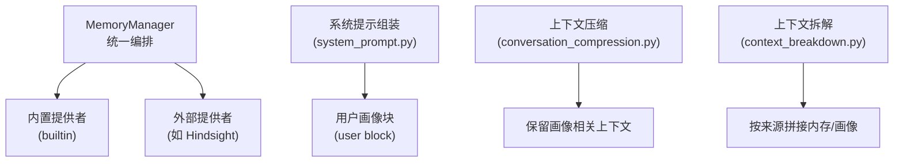
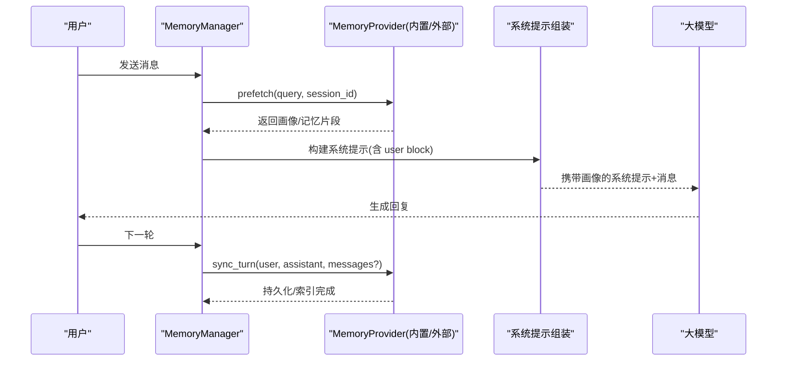
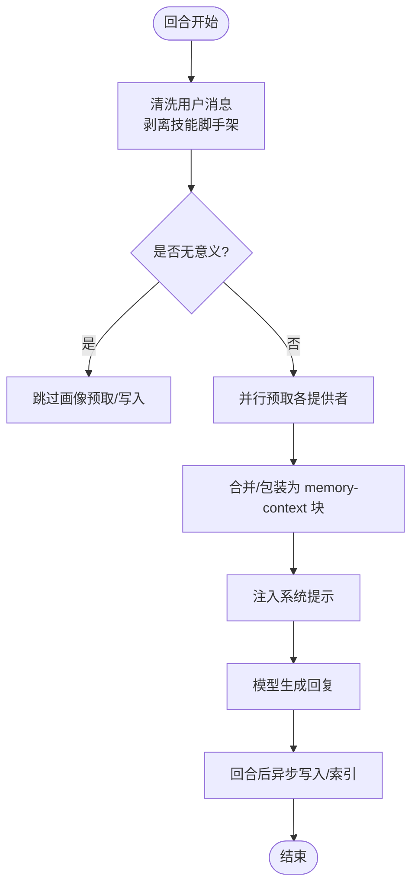
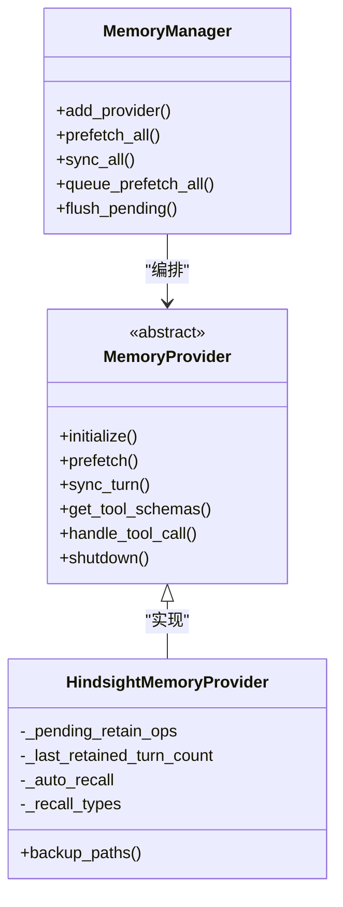
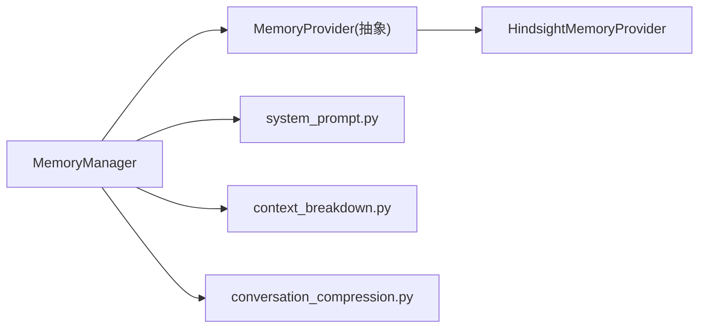

# 用户画像系统

<cite>
**本文引用的文件**
- [memory_manager.py](file://agent/memory_manager.py)
- [memory_provider.py](file://agent/memory_provider.py)
- [__init__.py（记忆插件发现）](file://plugins/memory/__init__.py)
- [config_schema.py（通用配置模式）](file://plugins/memory/config_schema.py)
- [hindsight/__init__.py](file://plugins/memory/hindsight/__init__.py)
- [hindsight/config_schema.py](file://plugins/memory/hindsight/config_schema.py)
- [system_prompt.py](file://agent/system_prompt.py)
- [context_breakdown.py](file://agent/context_breakdown.py)
- [conversation_compression.py](file://agent/conversation_compression.py)
- [prompt_builder.py](file://agent/prompt_builder.py)
</cite>

## 目录
1. [简介](#简介)
2. [项目结构](#项目结构)
3. [核心组件](#核心组件)
4. [架构总览](#架构总览)
5. [详细组件分析](#详细组件分析)
6. [依赖关系分析](#依赖关系分析)
7. [性能考量](#性能考量)
8. [故障排查指南](#故障排查指南)
9. [结论](#结论)
10. [附录：操作示例路径](#附录：操作示例路径)

## 简介
本文件面向 Hermes Agent 的“用户画像系统”，系统性说明其数据模型、构建算法、更新机制、隐私保护、在对话中的应用以及与记忆系统的协同方式。文档既为初学者提供概念性入门，也为高级用户提供数据处理与隐私保护的实现细节与优化建议。

## 项目结构
Hermes 的用户画像能力以“记忆提供者”插件体系为核心，通过统一的 MemoryManager 编排内置与外部记忆后端；系统提示组装时会将“用户画像”块注入到系统提示中，从而驱动个性化回复。

图表来源
- [memory_manager.py:364-503](file://agent/memory_manager.py#L364-L503)
- [system_prompt.py:525-537](file://agent/system_prompt.py#L525-L537)
- [context_breakdown.py:73-109](file://agent/context_breakdown.py#L73-L109)
- [conversation_compression.py:184-212](file://agent/conversation_compression.py#L184-L212)

章节来源
- [memory_manager.py:364-503](file://agent/memory_manager.py#L364-L503)
- [system_prompt.py:525-537](file://agent/system_prompt.py#L525-L537)
- [context_breakdown.py:73-109](file://agent/context_breakdown.py#L73-L109)
- [conversation_compression.py:184-212](file://agent/conversation_compression.py#L184-L212)

## 核心组件
- MemoryProvider（抽象基类）：定义生命周期与工具接口，包括 initialize、prefetch、sync_turn、get_tool_schemas、handle_tool_call、shutdown 等，以及可选钩子 on_session_end、on_pre_compress、on_memory_write 等。
- MemoryManager（编排器）：注册并管理多个提供者（仅允许一个外部提供者），负责系统提示拼装、预取上下文、回合后同步、后台任务调度与超时控制。
- 插件发现与加载：扫描内置与用户安装的 memory 插件，按名称选择激活的提供者，支持声明式配置模式。
- 具体提供者（如 Hindsight）：实现长期记忆、知识图谱、多策略检索、标签与观察层、异步写入与读取可见性等。

章节来源
- [memory_provider.py:81-192](file://agent/memory_provider.py#L81-L192)
- [memory_manager.py:364-503](file://agent/memory_manager.py#L364-L503)
- [__init__.py（记忆插件发现）:90-216](file://plugins/memory/__init__.py#L90-L216)
- [hindsight/__init__.py:681-800](file://plugins/memory/hindsight/__init__.py#L681-L800)

## 架构总览
下图展示从“回合前预取”到“回合后同步”的完整流程，以及系统提示如何包含用户画像块。

图表来源
- [memory_manager.py:525-694](file://agent/memory_manager.py#L525-L694)
- [system_prompt.py:525-537](file://agent/system_prompt.py#L525-L537)

## 详细组件分析

### 数据模型与存储结构
- 提供者抽象：MemoryProvider 定义了统一的读写与工具接口，屏蔽不同后端差异。
- 插件配置模式：通过 ProviderConfigSchema 声明字段类型、是否机密、默认值与作用域，由通用 UI 渲染与 API 读写。
- 具体提供者（Hindsight）：
  - 支持云/本地模式、银行（bank）隔离、预算（recall budget）、标签（retain tags）、观察层（observations）与证据溯源。
  - 会话级文档 ID、追加写入（update_mode='append'）与异步写入队列，保障跨进程/会话的一致性与可见性。
  - 可配置召回类型（observation 为主，避免重复证据占用 token）。

章节来源
- [memory_provider.py:81-192](file://agent/memory_provider.py#L81-L192)
- [config_schema.py:43-104](file://plugins/memory/config_schema.py#L43-L104)
- [hindsight/__init__.py:681-800](file://plugins/memory/hindsight/__init__.py#L681-L800)
- [hindsight/config_schema.py:12-76](file://plugins/memory/hindsight/config_schema.py#L12-L76)

### 画像构建算法（从对话提取特征与意图）
- 回合后写入：MemoryManager.sync_all 将用户与助手消息经清理（剥离技能脚手架）后，调用各提供者的 sync_turn 进行持久化与索引。
- 预取召回：MemoryManager.prefetch_all 在每个回合前对每个提供者发起 prefetch，合并结果并以 fenced 块注入系统提示，供模型理解当前画像。
- 文本过滤：is_trivial_prompt 过滤无意义的简短输入，避免污染画像。
- 插件侧 NLP：Hindsight 在 retain/recall/reflect 中执行结构化事实抽取、实体解析、多策略检索与重排，形成“观察层”作为画像的核心表征。

图表来源
- [memory_manager.py:507-545](file://agent/memory_manager.py#L507-L545)
- [memory_manager.py:638-694](file://agent/memory_manager.py#L638-L694)
- [memory_provider.py:61-79](file://agent/memory_provider.py#L61-L79)
- [hindsight/__init__.py:305-354](file://plugins/memory/hindsight/__init__.py#L305-L354)

章节来源
- [memory_manager.py:507-545](file://agent/memory_manager.py#L507-L545)
- [memory_manager.py:638-694](file://agent/memory_manager.py#L638-L694)
- [memory_provider.py:61-79](file://agent/memory_provider.py#L61-L79)
- [hindsight/__init__.py:305-354](file://plugins/memory/hindsight/__init__.py#L305-L354)

### 画像更新机制（增量、冲突与版本）
- 增量更新：Hindsight 在支持 update_mode='append' 的后端上仅发送新增对话段，减少冗余与覆盖风险；不支持时回退为每进程唯一 document_id 以避免跨进程覆盖。
- 冲突解决：通过“观察层”聚合多源事实，结合证据计数与新鲜度信号，降低冲突与噪声；标签与观察范围（per_tag/combined/all_combinations）控制合并粒度。
- 版本管理：通过 /version 探测后端能力，决定写入策略；同时维护 last_retained_turn_count 以增量发送新段落。
- 顺序保证：MemoryManager 使用单工作线程串行化所有提供者的写入，确保 turn N 先于 turn N+1 落地。

图表来源
- [memory_manager.py:364-780](file://agent/memory_manager.py#L364-L780)
- [memory_provider.py:81-192](file://agent/memory_provider.py#L81-L192)
- [hindsight/__init__.py:681-800](file://plugins/memory/hindsight/__init__.py#L681-L800)

章节来源
- [memory_manager.py:364-780](file://agent/memory_manager.py#L364-L780)
- [hindsight/__init__.py:177-252](file://plugins/memory/hindsight/__init__.py#L177-L252)
- [hindsight/__init__.py:681-800](file://plugins/memory/hindsight/__init__.py#L681-L800)

### 隐私保护机制
- 最小暴露：系统提示中的“用户画像块”仅包含必要的上下文信息，并通过 fenced 块与系统注记明确区分“回忆内容”与“用户输入”。
- 安全存储：Hindsight 本地模式的配置文件与密钥文件采用严格权限（0600）写入与校验，防止越权访问。
- 作用域隔离：插件发现与加载支持“内置优先、用户安装次之”，且用户插件使用独立命名空间，避免模块冲突与泄露。
- 工具白名单：MemoryManager 拒绝与核心工具名冲突的提供者工具，避免被误用或劫持。
- 会话/角色隔离：初始化参数包含 agent_identity、agent_workspace、platform、user_id 等，用于画像的作用域与审计。

章节来源
- [memory_manager.py:174-179](file://agent/memory_manager.py#L174-L179)
- [memory_manager.py:430-465](file://agent/memory_manager.py#L430-L465)
- [__init__.py（记忆插件发现）:37-58](file://plugins/memory/__init__.py#L37-L58)
- [hindsight/__init__.py:565-620](file://plugins/memory/hindsight/__init__.py#L565-L620)
- [memory_provider.py:100-121](file://agent/memory_provider.py#L100-L121)

### 画像在对话中的应用
- 系统提示注入：system_prompt.py 在组装系统提示时，会加入“用户画像块”（user block），使模型基于画像提供个性化回复。
- 上下文拆解：context_breakdown.py 将内存块与用户画像块分别剥离与拼接，便于调试与压缩。
- 压缩保护：conversation_compression.py 识别并保留内置记忆/画像相关内容，避免关键画像信息在压缩中被丢弃。

章节来源
- [system_prompt.py:525-537](file://agent/system_prompt.py#L525-L537)
- [context_breakdown.py:73-109](file://agent/context_breakdown.py#L73-L109)
- [conversation_compression.py:184-212](file://agent/conversation_compression.py#L184-L212)

### 与记忆系统的协同
- 统一入口：MemoryManager 同时管理内置与外部记忆提供者，对外暴露一致的 prefetch/sync 接口。
- 工具扩展：inject_memory_provider_tools 将提供者的工具（如 hindsight_retain/recall/reflect）注入到模型可用的工具集中，使模型能主动查询/写入画像。
- 压缩钩子：on_pre_compress 允许提供者提取即将被压缩的消息洞察，并在压缩摘要中保留。

章节来源
- [memory_manager.py:110-156](file://agent/memory_manager.py#L110-L156)
- [memory_provider.py:258-281](file://agent/memory_provider.py#L258-L281)
- [hindsight/__init__.py:305-354](file://plugins/memory/hindsight/__init__.py#L305-L354)

## 依赖关系分析
- 低耦合：MemoryProvider 抽象解耦了具体实现；MemoryManager 仅依赖接口，不关心后端细节。
- 插件化：通过 plugins/memory 目录扫描动态加载，支持内置与用户安装两种来源，避免硬编码。
- 运行时约束：仅允许一个外部提供者，防止工具 schema 膨胀与冲突。

图表来源
- [memory_manager.py:364-503](file://agent/memory_manager.py#L364-L503)
- [memory_provider.py:81-192](file://agent/memory_provider.py#L81-L192)
- [hindsight/__init__.py:681-800](file://plugins/memory/hindsight/__init__.py#L681-L800)

章节来源
- [memory_manager.py:364-503](file://agent/memory_manager.py#L364-L503)
- [memory_provider.py:81-192](file://agent/memory_provider.py#L81-L192)

## 性能考量
- 并发与超时：外部提供者的 prefetch 使用独立线程并设置超时，避免阻塞主流程。
- 后台序列化：所有 sync_turn 通过单工作线程串行执行，保证顺序且不阻塞响应路径。
- 增量写入：Hindsight 在支持 append 的后端上仅发送新增段落，显著降低网络与计算开销。
- 召回预算：可通过 recall_budget 控制召回规模，平衡个性化与 token 消耗。
- 流式清理：StreamingContextScrubber 处理分片场景下的 memory-context 围栏，避免泄漏内部上下文。

章节来源
- [memory_manager.py:547-595](file://agent/memory_manager.py#L547-L595)
- [memory_manager.py:698-780](file://agent/memory_manager.py#L698-L780)
- [hindsight/__init__.py:177-252](file://plugins/memory/hindsight/__init__.py#L177-L252)
- [memory_manager.py:182-345](file://agent/memory_manager.py#L182-L345)

## 故障排查指南
- 提供者不可用：检查 is_available 与配置项（如 API key、mode、api_url），确认插件已正确加载。
- 预取超时：若外部提供者 prefetch 超时，将被跳过并记录警告；可调整 external_prefetch_timeout。
- 写入失败：sync_turn 异常会被捕获并记录，不影响当前回合；可通过 flush_pending 等待队列清空。
- 权限问题：本地模式下配置文件需 0600 权限，否则可能抛出权限错误。
- 工具冲突：若提供者工具名与核心工具冲突，会被拒绝并记录警告，需重命名提供者工具。

章节来源
- [memory_manager.py:498-503](file://agent/memory_manager.py#L498-L503)
- [memory_manager.py:580-588](file://agent/memory_manager.py#L580-L588)
- [memory_manager.py:688-694](file://agent/memory_manager.py#L688-L694)
- [hindsight/__init__.py:583-620](file://plugins/memory/hindsight/__init__.py#L583-L620)
- [memory_manager.py:430-465](file://agent/memory_manager.py#L430-L465)

## 结论
Hermes 的用户画像系统以插件化的记忆提供者为核心，通过 MemoryManager 统一编排，在回合前后完成画像的预取与更新，并将画像注入系统提示以实现个性化回复。系统在增量写入、冲突消解、版本探测与隐私保护方面具备完善的工程实践，兼顾性能与可靠性。配合记忆系统与上下文压缩，可在长对话中持续增强用户体验。

## 附录：操作示例路径
以下为创建、查询与更新用户画像的关键代码位置（不包含具体代码内容）：
- 创建/写入画像（回合后同步）
  - [memory_manager.py:638-694](file://agent/memory_manager.py#L638-L694)
  - [hindsight/__init__.py:305-354](file://plugins/memory/hindsight/__init__.py#L305-L354)
- 查询/预取画像（回合前召回）
  - [memory_manager.py:525-545](file://agent/memory_manager.py#L525-L545)
  - [hindsight/__init__.py:326-354](file://plugins/memory/hindsight/__init__.py#L326-L354)
- 注入系统提示（应用画像）
  - [system_prompt.py:525-537](file://agent/system_prompt.py#L525-L537)
- 配置与发现
  - [__init__.py（记忆插件发现）:90-216](file://plugins/memory/__init__.py#L90-L216)
  - [config_schema.py:43-104](file://plugins/memory/config_schema.py#L43-L104)
  - [hindsight/config_schema.py:12-76](file://plugins/memory/hindsight/config_schema.py#L12-L76)