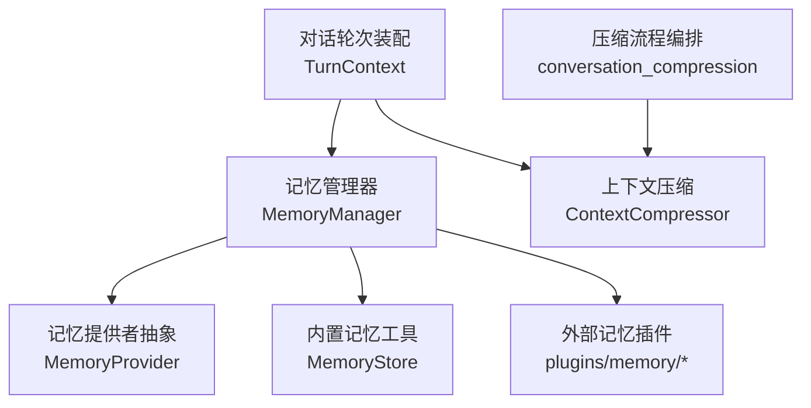
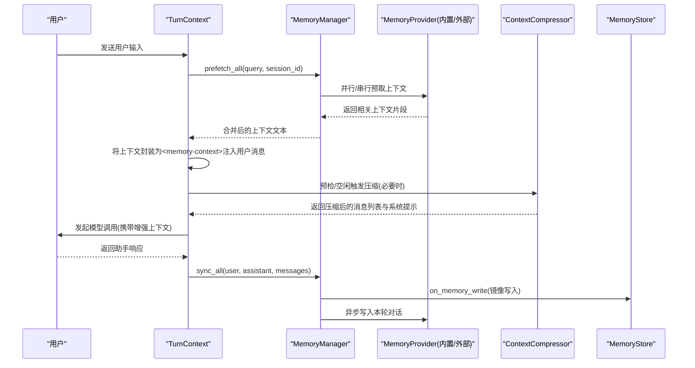
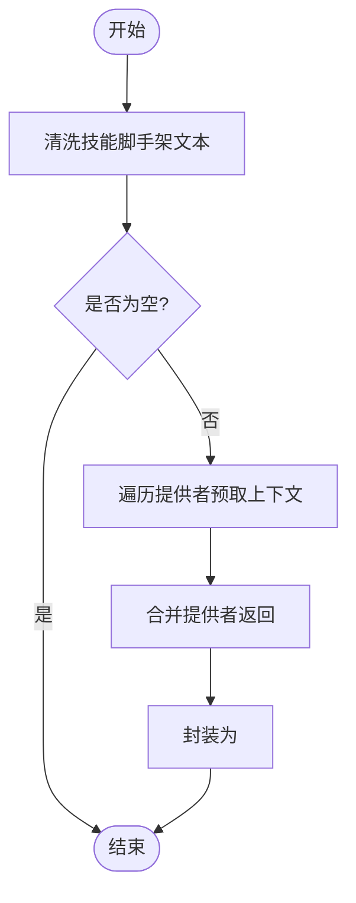
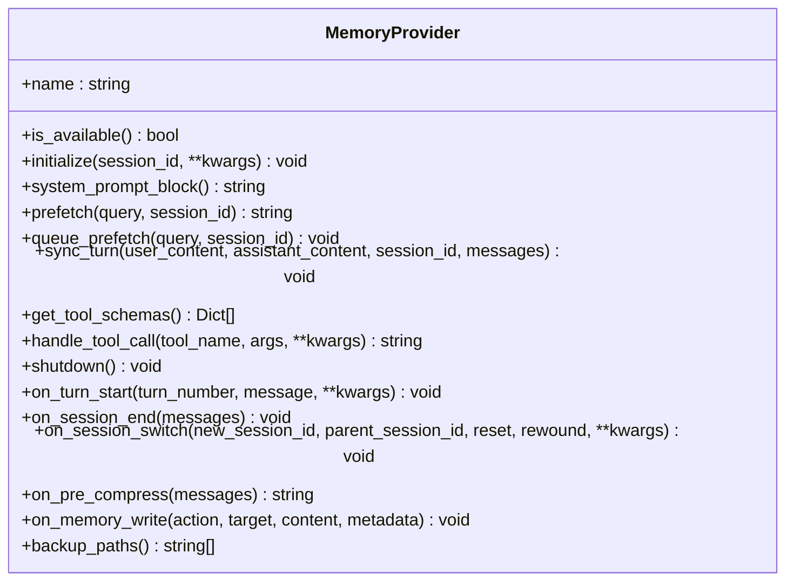
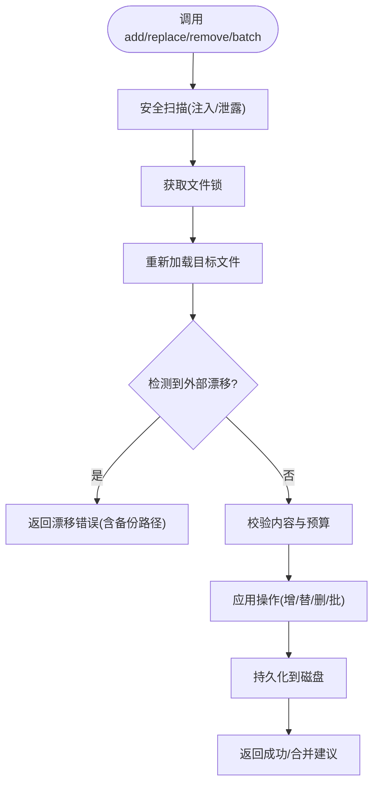
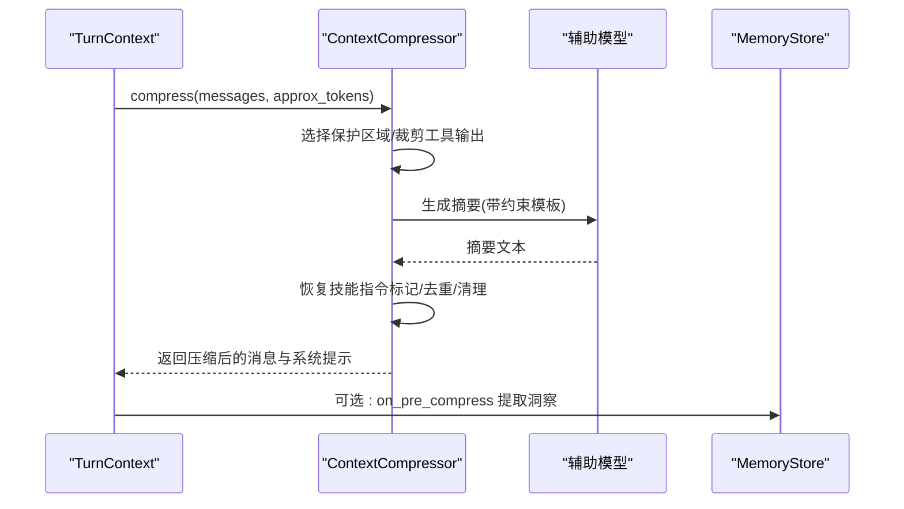
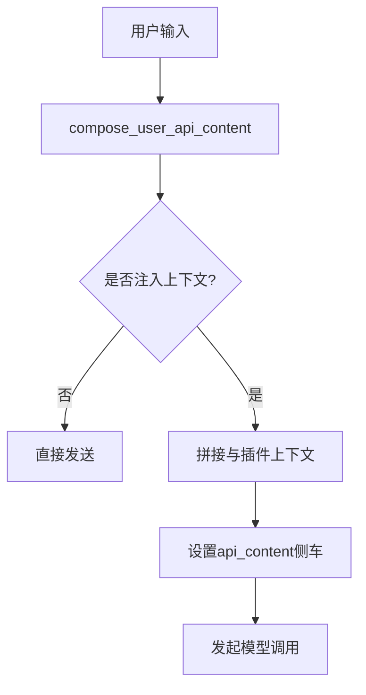
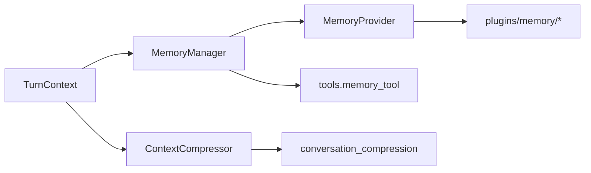

# 短期记忆系统

<cite>
**本文引用的文件**
- [agent/memory_manager.py](file://agent/memory_manager.py)
- [agent/memory_provider.py](file://agent/memory_provider.py)
- [tools/memory_tool.py](file://tools/memory_tool.py)
- [agent/context_compressor.py](file://agent/context_compressor.py)
- [agent/conversation_compression.py](file://agent/conversation_compression.py)
- [agent/turn_context.py](file://agent/turn_context.py)
</cite>

## 目录
1. [简介](#简介)
2. [项目结构](#项目结构)
3. [核心组件](#核心组件)
4. [架构总览](#架构总览)
5. [详细组件分析](#详细组件分析)
6. [依赖关系分析](#依赖关系分析)
7. [性能考量](#性能考量)
8. [故障排查指南](#故障排查指南)
9. [结论](#结论)
10. [附录](#附录)

## 简介
本文件面向Sparkii Agent的“短期记忆”能力，系统性说明会话级记忆的存储机制、上下文维护策略、消息历史缓存与上下文窗口管理，以及短期记忆的生命周期。文档还解释上下文压缩算法如何优化内存使用（文本摘要、冗余去除、关键信息保留），并描述多轮对话中的状态保持与历史依赖处理。为初学者提供概念性入门，为高级用户提供数据结构与算法实现要点，同时给出查询、更新、清理操作的代码路径指引，以及与工具系统的集成方式。

## 项目结构
围绕短期记忆的关键模块分布在以下位置：
- 记忆编排与提供者注册：agent/memory_manager.py
- 记忆提供者抽象接口：agent/memory_provider.py
- 持久化记忆工具（MEMORY.md/USER.md）：tools/memory_tool.py
- 上下文压缩与摘要：agent/context_compressor.py
- 压缩流程编排与超时控制：agent/conversation_compression.py
- 每轮对话前置装配与注入点：agent/turn_context.py

图表来源
- [agent/memory_manager.py:364-545](file://agent/memory_manager.py#L364-L545)
- [agent/memory_provider.py:81-188](file://agent/memory_provider.py#L81-L188)
- [tools/memory_tool.py:148-179](file://tools/memory_tool.py#L148-L179)
- [agent/context_compressor.py:1-18](file://agent/context_compressor.py#L1-L18)
- [agent/conversation_compression.py:1-50](file://agent/conversation_compression.py#L1-L50)
- [agent/turn_context.py:53-85](file://agent/turn_context.py#L53-L85)

章节来源
- [agent/memory_manager.py:364-545](file://agent/memory_manager.py#L364-L545)
- [agent/memory_provider.py:81-188](file://agent/memory_provider.py#L81-L188)
- [tools/memory_tool.py:148-179](file://tools/memory_tool.py#L148-L179)
- [agent/context_compressor.py:1-18](file://agent/context_compressor.py#L1-L18)
- [agent/conversation_compression.py:1-50](file://agent/conversation_compression.py#L1-L50)
- [agent/turn_context.py:53-85](file://agent/turn_context.py#L53-L85)

## 核心组件
- 记忆管理器（MemoryManager）
  - 负责注册/编排一个内置提供者与最多一个外部提供者；统一构建系统提示块；在每轮前预取上下文；在每轮后异步同步对话；暴露提供者工具Schema供模型调用。
- 记忆提供者抽象（MemoryProvider）
  - 定义生命周期钩子：initialize、system_prompt_block、prefetch、queue_prefetch、sync_turn、get_tool_schemas、handle_tool_call、shutdown；以及可选钩子：on_turn_start、on_session_end、on_session_switch、on_pre_compress、on_memory_write等。
- 内置记忆工具（MemoryStore）
  - 以文件为后端（MEMORY.md/USER.md），提供add/replace/remove/batch操作；维持“冻结快照”用于系统提示注入，保证prefix cache稳定；具备内容安全扫描与容量限制。
- 上下文压缩（ContextCompressor / conversation_compression）
  - 对长对话进行自动压缩：保护头尾、中间段摘要、工具输出裁剪、技能指令防丢失、失败冷却与重试、微压缩与批量压缩、提交围栏与超时控制。
- 轮次装配（TurnContext）
  - 组装用户消息、注入外部记忆预取结果、触发预检查压缩、记录当前用户消息索引、重置流式清理器等。

章节来源
- [agent/memory_manager.py:364-545](file://agent/memory_manager.py#L364-L545)
- [agent/memory_provider.py:81-188](file://agent/memory_provider.py#L81-L188)
- [tools/memory_tool.py:148-179](file://tools/memory_tool.py#L148-L179)
- [agent/context_compressor.py:1-18](file://agent/context_compressor.py#L1-L18)
- [agent/conversation_compression.py:1-50](file://agent/conversation_compression.py#L1-L50)
- [agent/turn_context.py:53-85](file://agent/turn_context.py#L53-L85)

## 架构总览
短期记忆贯穿“每轮对话”的前置与后置阶段，并与上下文压缩协同工作，确保在有限上下文窗口内维持高质量对话。

图表来源
- [agent/turn_context.py:53-85](file://agent/turn_context.py#L53-L85)
- [agent/memory_manager.py:525-694](file://agent/memory_manager.py#L525-L694)
- [agent/context_compressor.py:1-18](file://agent/context_compressor.py#L1-L18)
- [agent/conversation_compression.py:1-50](file://agent/conversation_compression.py#L1-L50)
- [tools/memory_tool.py:148-179](file://tools/memory_tool.py#L148-L179)

## 详细组件分析

### 记忆管理器 MemoryManager
- 职责
  - 注册提供者：仅允许一个外部提供者，避免工具Schema膨胀与冲突。
  - 系统提示拼装：收集各提供者的静态提示块。
  - 预取上下文：每轮前从所有提供者召回相关上下文，过滤无意义输入（如简短问候）。
  - 异步同步：每轮后将对话写入提供者，避免阻塞主循环。
  - 工具暴露：聚合提供者的工具Schema，注入到Agent的工具集。
- 关键行为
  - 外部提供者预取采用线程+超时，防止卡死主流程。
  - 写路径通过单工作线程序列化，保证顺序。
  - 支持flush_pending等待后台任务完成。
- 数据流
  - 输入：用户消息、session_id
  - 输出：合并的上下文字符串（被封装为<memory-context>注入）
  - 副作用：异步写入各提供者、暴露工具Schema

图表来源
- [agent/memory_manager.py:507-545](file://agent/memory_manager.py#L507-L545)
- [agent/memory_manager.py:347-361](file://agent/memory_manager.py#L347-L361)

章节来源
- [agent/memory_manager.py:364-545](file://agent/memory_manager.py#L364-L545)
- [agent/memory_manager.py:597-694](file://agent/memory_manager.py#L597-L694)
- [agent/memory_manager.py:782-800](file://agent/memory_manager.py#L782-L800)

### 记忆提供者抽象 MemoryProvider
- 生命周期
  - initialize：连接资源、预热
  - system_prompt_block：静态提示块
  - prefetch：快速召回（可基于缓存）
  - queue_prefetch：为下一轮预取排队
  - sync_turn：非阻塞写入本轮对话
  - get_tool_schemas/handle_tool_call：暴露与执行工具
  - shutdown：优雅关闭
- 可选钩子
  - on_turn_start：每轮开始回调
  - on_session_end：会话结束时提取总结
  - on_session_switch：会话ID切换时更新内部状态
  - on_pre_compress：压缩前提取需保留的洞察
  - on_memory_write：镜像内置记忆工具的写入
  - backup_paths：备份额外磁盘路径

图表来源
- [agent/memory_provider.py:81-188](file://agent/memory_provider.py#L81-L188)
- [agent/memory_provider.py:193-358](file://agent/memory_provider.py#L193-L358)

章节来源
- [agent/memory_provider.py:81-188](file://agent/memory_provider.py#L81-L188)
- [agent/memory_provider.py:193-358](file://agent/memory_provider.py#L193-L358)

### 内置记忆工具 MemoryStore
- 设计要点
  - 双存储：MEMORY.md（代理笔记）、USER.md（用户画像）
  - 冻结快照：系统提示在加载时冻结，会话中不变更，保障prefix cache稳定
  - 安全扫描：加载与写入时检测注入/泄露模式，命中则替换为占位或拒绝写入
  - 容量限制：按字符计数限制，超限引导“合并/删除”操作
  - 原子写入：文件锁+原子替换，避免并发破坏
- 操作
  - add：追加条目（跳过漂移校验，但需能读取原文件）
  - replace/remove：精确匹配替换或删除（检测外部漂移）
  - apply_batch：批处理，最终预算校验，全部成功或全部回滚
  - format_for_system_prompt：返回冻结快照用于系统提示

图表来源
- [tools/memory_tool.py:148-179](file://tools/memory_tool.py#L148-L179)
- [tools/memory_tool.py:390-670](file://tools/memory_tool.py#L390-L670)
- [tools/memory_tool.py:682-748](file://tools/memory_tool.py#L682-L748)

章节来源
- [tools/memory_tool.py:148-179](file://tools/memory_tool.py#L148-L179)
- [tools/memory_tool.py:390-670](file://tools/memory_tool.py#L390-L670)
- [tools/memory_tool.py:682-748](file://tools/memory_tool.py#L682-L748)

### 上下文压缩 ContextCompressor 与 conversation_compression
- 目标
  - 在长对话中保护头部与尾部，对中间段进行摘要，减少请求token数，避免超出上下文窗口。
- 关键策略
  - 结构化摘要模板：跟踪已解决/待解决问题，历史部分标题替代“下一步/剩余工作”，避免误读为活跃指令
  - 工具输出裁剪：先做廉价预处理再LLM摘要
  - 技能指令防丢失：识别skill_view调用与最近加载的技能，生成标记并在摘要后恢复
  - 失败冷却与重试：避免频繁失败的摘要导致抖动
  - 微压缩与批量压缩：滚动式与整批式结合
  - 提交围栏与超时：确保会话状态变更的原子性与可取消性
- 数据流
  - 输入：消息列表、系统提示、近似token估算
  - 输出：压缩后的消息列表、活动系统提示
  - 副作用：通知插件/记忆提供者（on_pre_compress/on_session_switch），持久化摘要标记

图表来源
- [agent/context_compressor.py:1-18](file://agent/context_compressor.py#L1-L18)
- [agent/context_compressor.py:100-180](file://agent/context_compressor.py#L100-L180)
- [agent/context_compressor.py:556-770](file://agent/context_compressor.py#L556-L770)
- [agent/conversation_compression.py:445-691](file://agent/conversation_compression.py#L445-L691)

章节来源
- [agent/context_compressor.py:100-180](file://agent/context_compressor.py#L100-L180)
- [agent/context_compressor.py:556-770](file://agent/context_compressor.py#L556-L770)
- [agent/conversation_compression.py:445-691](file://agent/conversation_compression.py#L445-L691)

### 轮次装配 TurnContext 与注入点
- 作用
  - 组装每轮的用户消息，注入外部记忆预取结果（封装为<memory-context>）
  - 触发预检查压缩（空闲/阈值）
  - 重置流式清理器，避免跨轮污染
  - 记录当前用户消息索引，便于压缩后定位
- 注入机制
  - compose_user_api_content：将外部预取上下文与插件上下文拼接到用户消息的API副本
  - substitute_api_content/drop_stale_api_content：在需要时替换或丢弃侧车字段，保证一致性

图表来源
- [agent/turn_context.py:53-85](file://agent/turn_context.py#L53-L85)
- [agent/turn_context.py:88-131](file://agent/turn_context.py#L88-L131)

章节来源
- [agent/turn_context.py:53-85](file://agent/turn_context.py#L53-L85)
- [agent/turn_context.py:88-131](file://agent/turn_context.py#L88-L131)

## 依赖关系分析
- 耦合关系
  - MemoryManager 依赖 MemoryProvider 抽象与 tools.memory_tool 的 on_memory_write 镜像
  - TurnContext 依赖 MemoryManager 的预取结果与 conversation_compression 的压缩能力
  - ContextCompressor 依赖辅助模型与模型元数据估算，与 conversation_compression 协作完成超时与提交围栏
- 外部依赖
  - 外部记忆插件（plugins/memory/*）通过 MemoryProvider 接入，受限于“仅一个外部提供者”
  - 工具系统通过 MemoryManager.get_all_tool_schemas 暴露记忆工具给模型

图表来源
- [agent/memory_manager.py:364-545](file://agent/memory_manager.py#L364-L545)
- [agent/turn_context.py:53-85](file://agent/turn_context.py#L53-L85)
- [agent/context_compressor.py:1-18](file://agent/context_compressor.py#L1-L18)
- [agent/conversation_compression.py:1-50](file://agent/conversation_compression.py#L1-L50)

章节来源
- [agent/memory_manager.py:364-545](file://agent/memory_manager.py#L364-L545)
- [agent/turn_context.py:53-85](file://agent/turn_context.py#L53-L85)
- [agent/context_compressor.py:1-18](file://agent/context_compressor.py#L1-L18)
- [agent/conversation_compression.py:1-50](file://agent/conversation_compression.py#L1-L50)

## 性能考量
- 预取与同步
  - 外部提供者预取使用线程+超时，避免阻塞主循环；同步写入走单工作线程序列化，降低竞争与乱序风险
  - 背景任务在关闭时等待一定时间，避免进程挂起
- 上下文压缩
  - 保护头尾、裁剪工具输出、技能指令防丢失，减少无效token
  - 失败冷却与重试，避免反复失败导致的抖动
  - 微压缩与批量压缩结合，平衡实时性与成本
- 冻结快照
  - MemoryStore的系统提示快照在会话中不变，提升prefix cache命中率

[本节为通用性能讨论，不直接分析具体文件]

## 故障排查指南
- 外部提供者预取超时
  - 现象：某提供者预取耗时过长被跳过
  - 处理：检查网络/服务可用性；调整external_prefetch_timeout；确认提供者实现是否阻塞
  - 参考路径
    - [agent/memory_manager.py:547-595](file://agent/memory_manager.py#L547-L595)
- 同步写入失败
  - 现象：sync_turn抛出异常，日志记录警告
  - 处理：检查提供者实现；确认消息格式；必要时降级或重试
  - 参考路径
    - [agent/memory_manager.py:638-694](file://agent/memory_manager.py#L638-L694)
- 记忆工具写入漂移
  - 现象：replace/remove检测到外部漂移，返回错误并给出备份路径
  - 处理：根据备份路径整合内容；使用memory工具逐步修正
  - 参考路径
    - [tools/memory_tool.py:91-119](file://tools/memory_tool.py#L91-L119)
    - [tools/memory_tool.py:449-518](file://tools/memory_tool.py#L449-L518)
- 压缩失败与冷却
  - 现象：摘要失败进入冷却期，后续压缩被阻止
  - 处理：等待冷却；检查辅助模型配置/配额；必要时手动触发压缩
  - 参考路径
    - [agent/conversation_compression.py:445-691](file://agent/conversation_compression.py#L445-L691)
    - [agent/context_compressor.py:73-95](file://agent/context_compressor.py#L73-L95)

章节来源
- [agent/memory_manager.py:547-595](file://agent/memory_manager.py#L547-L595)
- [agent/memory_manager.py:638-694](file://agent/memory_manager.py#L638-L694)
- [tools/memory_tool.py:91-119](file://tools/memory_tool.py#L91-L119)
- [tools/memory_tool.py:449-518](file://tools/memory_tool.py#L449-L518)
- [agent/conversation_compression.py:445-691](file://agent/conversation_compression.py#L445-L691)
- [agent/context_compressor.py:73-95](file://agent/context_compressor.py#L73-L95)

## 结论
Sparkii Agent的短期记忆系统通过MemoryManager协调内置与外部记忆提供者，在每轮对话前后进行上下文召回与写入，并结合上下文压缩在有限窗口内维持高质量对话。MemoryStore提供稳定的系统提示注入与安全的持久化能力；ContextCompressor通过结构化摘要、工具输出裁剪与技能指令保护，有效降低内存压力。整体设计在保证性能的同时，提供了可扩展的记忆生态与健壮的容错机制。

[本节为总结性内容，不直接分析具体文件]

## 附录
- 短期记忆生命周期（从会话开始到结束）
  - 初始化：MemoryProvider.initialize建立资源
  - 每轮前：TurnContext调用MemoryManager.prefetch_all，注入<memory-context>
  - 每轮后：MemoryManager.sync_all异步写入，MemoryStore.on_memory_write镜像写入
  - 会话结束：MemoryProvider.on_session_end提取总结
  - 会话切换：MemoryProvider.on_session_switch更新内部状态
  - 压缩前：MemoryProvider.on_pre_compress提取洞察
- 查询、更新、清理操作（代码路径）
  - 查询：MemoryManager.prefetch_all -> provider.prefetch
    - 参考：[agent/memory_manager.py:525-545](file://agent/memory_manager.py#L525-L545)
  - 更新：MemoryStore.add/replace/remove/apply_batch
    - 参考：[tools/memory_tool.py:390-670](file://tools/memory_tool.py#L390-L670)
  - 清理：MemoryStore.remove或batch remove；压缩过程自动裁剪冗余
    - 参考：[tools/memory_tool.py:520-560](file://tools/memory_tool.py#L520-L560)
    - 参考：[agent/context_compressor.py:556-770](file://agent/context_compressor.py#L556-L770)
- 与工具系统集成
  - 暴露记忆工具Schema：MemoryManager.get_all_tool_schemas -> inject_memory_provider_tools
    - 参考：[agent/memory_manager.py:782-800](file://agent/memory_manager.py#L782-L800)
  - 通过工具调用增强上下文：模型可调用记忆工具进行查询/更新，进而提升对话质量
    - 参考：[agent/memory_manager.py:110-156](file://agent/memory_manager.py#L110-L156)

章节来源
- [agent/memory_manager.py:525-545](file://agent/memory_manager.py#L525-L545)
- [tools/memory_tool.py:390-670](file://tools/memory_tool.py#L390-L670)
- [tools/memory_tool.py:520-560](file://tools/memory_tool.py#L520-L560)
- [agent/context_compressor.py:556-770](file://agent/context_compressor.py#L556-L770)
- [agent/memory_manager.py:782-800](file://agent/memory_manager.py#L782-L800)
- [agent/memory_manager.py:110-156](file://agent/memory_manager.py#L110-L156)