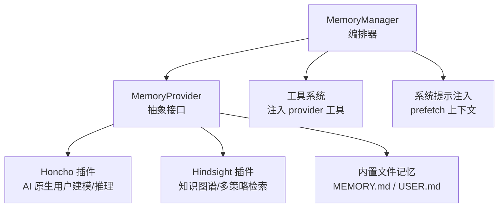
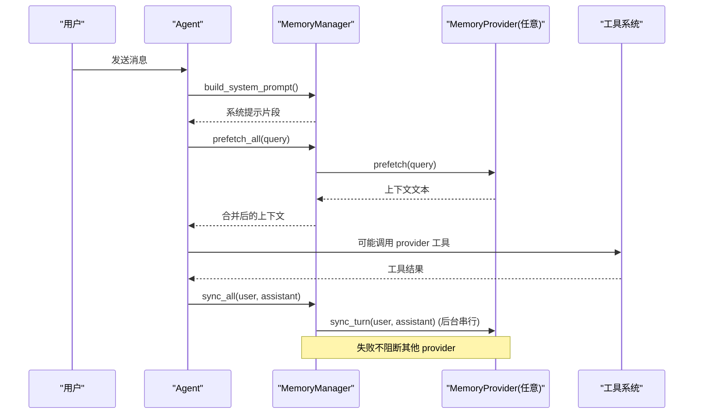
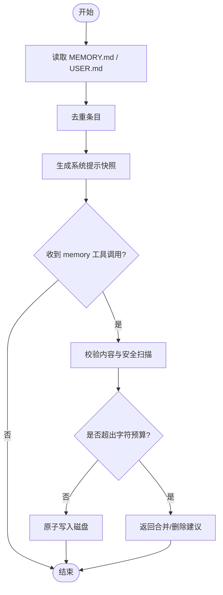
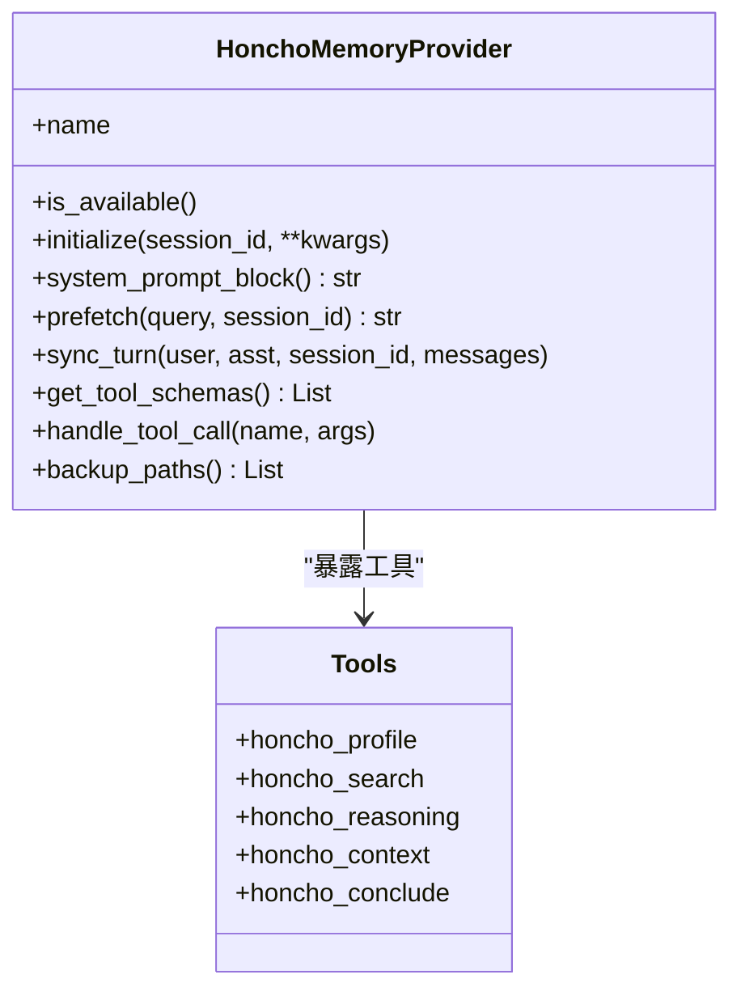
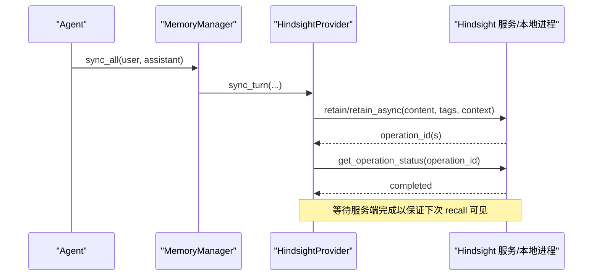
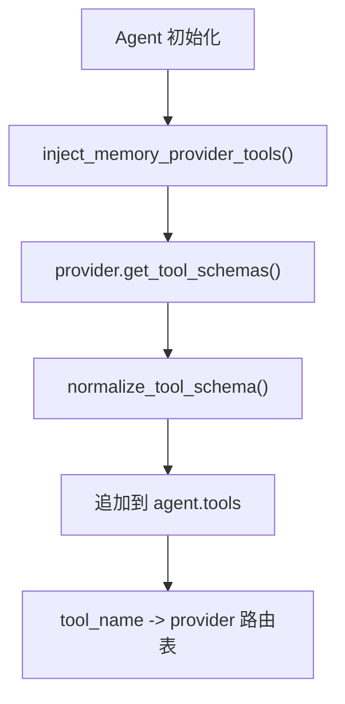
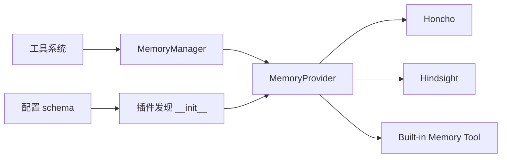

# 记忆系统设计

<cite>
**本文引用的文件**
- [agent/memory_manager.py](file://agent/memory_manager.py)
- [agent/memory_provider.py](file://agent/memory_provider.py)
- [plugins/memory/__init__.py](file://plugins/memory/__init__.py)
- [plugins/memory/config_schema.py](file://plugins/memory/config_schema.py)
- [plugins/memory/honcho/__init__.py](file://plugins/memory/honcho/__init__.py)
- [plugins/memory/hindsight/__init__.py](file://plugins/memory/hindsight/__init__.py)
- [tools/memory_tool.py](file://tools/memory_tool.py)
</cite>

## 目录
1. [简介](#简介)
2. [项目结构](#项目结构)
3. [核心组件](#核心组件)
4. [架构总览](#架构总览)
5. [详细组件分析](#详细组件分析)
6. [依赖关系分析](#依赖关系分析)
7. [性能考量](#性能考量)
8. [故障排查指南](#故障排查指南)
9. [结论](#结论)
10. [附录](#附录)

## 简介
本文件为 Sparkii Agent 的记忆系统提供系统化、可操作的设计与实现文档。内容覆盖短期与长期记忆的存储机制（向量索引、语义搜索、数据持久化）、用户画像构建流程、技能自动创建与学习机制、记忆压缩与去重策略、以及记忆系统与工具系统的集成方式。文档同时面向初学者解释概念，并为高级用户提供数据结构与算法层面的细节与图示。

## 项目结构
记忆系统由“编排层 + 抽象接口 + 插件实现 + 内置工具”四部分组成：
- 编排层：MemoryManager 负责注册/调度多个 MemoryProvider，统一注入系统提示、预取上下文、同步对话轮次。
- 抽象接口：MemoryProvider 定义生命周期、工具暴露、会话钩子等契约。
- 插件实现：Honcho（AI 原生跨会话用户建模与推理）与 Hindsight（知识图谱、实体解析、多策略检索）作为两种长期记忆后端；Builtin（基于文件的短期记忆）通过 tools/memory_tool.py 暴露。
- 配置与发现：plugins/memory/__init__.py 扫描并加载插件；config_schema.py 声明各插件的配置字段与存储后端。

**图表来源**
- [agent/memory_manager.py:364-503](file://agent/memory_manager.py#L364-L503)
- [agent/memory_provider.py:81-188](file://agent/memory_provider.py#L81-L188)
- [plugins/memory/honcho/__init__.py:237-231](file://plugins/memory/honcho/__init__.py#L237-L231)
- [plugins/memory/hindsight/__init__.py:681-800](file://plugins/memory/hindsight/__init__.py#L681-L800)
- [tools/memory_tool.py:148-240](file://tools/memory_tool.py#L148-L240)

**章节来源**
- [agent/memory_manager.py:1-108](file://agent/memory_manager.py#L1-L108)
- [plugins/memory/__init__.py:1-46](file://plugins/memory/__init__.py#L1-L46)
- [plugins/memory/config_schema.py:1-20](file://plugins/memory/config_schema.py#L1-L20)

## 核心组件
- MemoryManager：单点集成入口，管理一个内置 provider 和最多一个外部 provider；负责系统提示拼接、每轮前预取、每轮后异步同步、工具模式开关与超时保护。
- MemoryProvider：抽象基类，定义 is_available/initialize/system_prompt_block/prefetch/sync_turn/get_tool_schemas/handle_tool_call/shutdown 等生命周期方法，以及 on_turn_start/on_session_end/on_session_switch/on_pre_compress/on_delegation 等可选钩子。
- 插件发现与配置：按名称扫描 plugins/memory 与用户目录，支持 plugin.yaml 描述、CLI 命令注册、配置 schema 渲染与读写。
- 内置记忆工具：以文件形式持久化 MEMORY.md（代理笔记）与 USER.md（用户画像），提供 add/replace/remove/batch 操作，带字符预算、去重、安全扫描与原子写入。

**章节来源**
- [agent/memory_manager.py:364-800](file://agent/memory_manager.py#L364-L800)
- [agent/memory_provider.py:81-358](file://agent/memory_provider.py#L81-L358)
- [plugins/memory/__init__.py:146-462](file://plugins/memory/__init__.py#L146-L462)
- [plugins/memory/config_schema.py:43-145](file://plugins/memory/config_schema.py#L43-L145)
- [tools/memory_tool.py:148-800](file://tools/memory_tool.py#L148-L800)

## 架构总览
记忆系统在对话循环中的关键路径：
- 系统提示组装：收集所有 provider 的 system_prompt_block，形成静态提示片段。
- 每轮前预取：对每个 provider 调用 prefetch（或 queue_prefetch），将结果包装为 <memory-context> 块注入到模型输入中；外部 provider 预取有超时保护。
- 每轮后同步：在后台线程串行执行 sync_turn，确保写顺序稳定，避免阻塞用户响应。
- 工具暴露：provider 可通过 get_tool_schemas 暴露工具（如搜索、画像、推理、结论写入），由 MemoryManager 注入到 agent 的工具集。

**图表来源**
- [agent/memory_manager.py:486-545](file://agent/memory_manager.py#L486-L545)
- [agent/memory_manager.py:638-694](file://agent/memory_manager.py#L638-L694)
- [agent/memory_provider.py:123-188](file://agent/memory_provider.py#L123-L188)

**章节来源**
- [agent/memory_manager.py:486-794](file://agent/memory_manager.py#L486-L794)

## 详细组件分析

### 短期记忆：内置文件存储（MEMORY.md / USER.md）
- 存储机制：两个文件分别承载代理个人笔记与用户画像；会话启动时读取并生成“冻结快照”注入系统提示，会话内修改立即落盘但不改变当前快照，下一会话再刷新。
- 数据去重与预算：条目去重、字符级预算限制；超限时引导模型进行合并/删除；批量操作支持原子提交与最终预算校验。
- 安全与一致性：内容扫描拦截注入/外泄模式；文件锁保证并发安全；外部漂移检测防止覆盖未兼容格式的内容；原子写入避免部分更新。
- 查询与更新：通过 memory_tool 暴露 add/replace/remove/apply_batch；错误返回包含当前条目预览与使用量提示。

**图表来源**
- [tools/memory_tool.py:203-240](file://tools/memory_tool.py#L203-L240)
- [tools/memory_tool.py:390-670](file://tools/memory_tool.py#L390-L670)

**章节来源**
- [tools/memory_tool.py:1-24](file://tools/memory_tool.py#L1-L24)
- [tools/memory_tool.py:148-800](file://tools/memory_tool.py#L148-L800)

### 长期记忆：Honcho 插件（AI 原生用户建模与推理）
- 用户画像构建：维护 peer card（简短事实集合）、representation（结构化表征）、summary（会话摘要）；首次对话预热基础上下文，后续按 cadence 刷新。
- 语义搜索与推理：提供 honcho_search（混合语义+关键词检索原始消息片段）、honcho_reasoning（自然语言问答，内部运行 LLM 综合回答）、honcho_context（一次性快照）。
- 持久化与迁移：支持 per-session 或共享策略；会话初始化时可迁移本地 memories 文件到远程 session；支持结论（conclusion）持久化用于长期画像。
- 注入模式：context/tools/hybrid 三种模式；tools-only 不自动注入，需显式调用工具；hybrid 同时提供自动注入与工具能力。

**图表来源**
- [plugins/memory/honcho/__init__.py:237-231](file://plugins/memory/honcho/__init__.py#L237-L231)
- [plugins/memory/honcho/__init__.py:343-562](file://plugins/memory/honcho/__init__.py#L343-L562)
- [plugins/memory/honcho/__init__.py:627-697](file://plugins/memory/honcho/__init__.py#L627-L697)
- [plugins/memory/honcho/__init__.py:699-800](file://plugins/memory/honcho/__init__.py#L699-L800)

**章节来源**
- [plugins/memory/honcho/__init__.py:1-800](file://plugins/memory/honcho/__init__.py#L1-L800)

### 长期记忆：Hindsight 插件（知识图谱、实体解析、多策略检索）
- 存储与索引：支持云端 API 与本地嵌入模式；通过 bank（知识库）组织数据；保留标签、观察范围、源信息等元数据；支持 append 模式去重与增量写入。
- 检索策略：hindsight_recall（语义+关键词+实体图遍历+重排）、hindsight_reflect（跨记忆综合推理）、hindsight_retain（结构化事实入库）。
- 会话与文档：per-process/document_id 控制写入行为；当 API 不支持 append 时回退到唯一 document_id 以避免覆盖；后台事件循环与队列保障异步写入与状态可见性。
- 配置与健壮性：支持 profile-scoped 与 legacy 配置；嵌入式守护进程健康检查与空闲超时；端口健康宽限时间可调。

**图表来源**
- [plugins/memory/hindsight/__init__.py:681-800](file://plugins/memory/hindsight/__init__.py#L681-L800)
- [plugins/memory/hindsight/__init__.py:177-252](file://plugins/memory/hindsight/__init__.py#L177-L252)
- [plugins/memory/hindsight/__init__.py:255-294](file://plugins/memory/hindsight/__init__.py#L255-L294)

**章节来源**
- [plugins/memory/hindsight/__init__.py:1-800](file://plugins/memory/hindsight/__init__.py#L1-L800)

### 记忆压缩、去重与存储空间优化
- 短期记忆压缩：MEMORY.md/USER.md 条目去重、字符预算限制；超限引导模型合并/删除；批量操作一次提交，减少多次往返。
- 长期记忆优化：
  - Honcho：基础上下文缓存（representation/card/summary）按 cadence 刷新；dialectic 深度与启发式级别控制成本；首次对话预热提升首条回复质量。
  - Hindsight：append 模式增量写入；observation 层聚合去重；recall_types 默认仅 observation 以减少冗余证据；标签与观察范围精细化控制。
- 系统提示稳定性：内置记忆采用“冻结快照”策略，会话内修改不影响当前提示，保持前缀缓存稳定。

**章节来源**
- [tools/memory_tool.py:203-240](file://tools/memory_tool.py#L203-L240)
- [plugins/memory/honcho/__init__.py:699-800](file://plugins/memory/honcho/__init__.py#L699-L800)
- [plugins/memory/hindsight/__init__.py:754-800](file://plugins/memory/hindsight/__init__.py#L754-L800)

### 技能自动创建与学习机制
- 技能指令剥离：MemoryManager 在 prefetch/sync 前剥离 /skill 或 /bundle 的脚手架内容，仅保留用户真实指令，避免污染记忆存储。
- 经验提取：
  - Honcho：通过 honcho_conclude 持久化结论，形成跨会话的稳定画像；reasoning 工具可在复杂问题上生成综合答案。
  - Hindsight：retain 结构化事实，结合实体解析与知识图谱，便于后续检索与推理；reflect 工具跨记忆合成回答。
- 学习闭环：每轮后 sync_turn 将对话写入后端；下一轮 prefetch 召回相关上下文；工具调用进一步细化画像与结论。

**章节来源**
- [agent/memory_manager.py:507-545](file://agent/memory_manager.py#L507-L545)
- [plugins/memory/honcho/__init__.py:184-231](file://plugins/memory/honcho/__init__.py#L184-L231)
- [plugins/memory/hindsight/__init__.py:305-354](file://plugins/memory/hindsight/__init__.py#L305-L354)

### 记忆系统与工具系统的集成
- 工具注入：MemoryManager.inject_memory_provider_tools 从 provider 获取工具 schema 并注入 agent 工具集；支持启用/禁用 toolset 与冲突检测。
- 工具路由：add_provider 时建立 tool_name → provider 映射；核心工具名保留优先，避免被覆盖。
- 流式清理：StreamingContextScrubber 处理分片流中的 <memory-context> 标记，防止内存上下文泄漏到 UI。

**图表来源**
- [agent/memory_manager.py:110-156](file://agent/memory_manager.py#L110-L156)
- [agent/memory_manager.py:404-470](file://agent/memory_manager.py#L404-L470)
- [agent/memory_manager.py:174-361](file://agent/memory_manager.py#L174-L361)

**章节来源**
- [agent/memory_manager.py:110-156](file://agent/memory_manager.py#L110-L156)
- [agent/memory_manager.py:404-470](file://agent/memory_manager.py#L404-L470)
- [agent/memory_manager.py:174-361](file://agent/memory_manager.py#L174-L361)

## 依赖关系分析
- MemoryManager 依赖 MemoryProvider 抽象；具体实现由插件目录动态加载。
- 插件发现：plugins/memory/__init__.py 扫描 bundled 与用户插件，支持 register 模式与直接继承 MemoryProvider。
- 配置：config_schema.py 声明字段类型、存储后端（flat_json/honcho_host_block）与 UI 渲染规则。
- 工具系统：tools/memory_tool.py 提供内置记忆工具；provider 工具通过 MemoryManager 注入。

**图表来源**
- [plugins/memory/__init__.py:146-462](file://plugins/memory/__init__.py#L146-L462)
- [plugins/memory/config_schema.py:43-145](file://plugins/memory/config_schema.py#L43-L145)
- [agent/memory_manager.py:110-156](file://agent/memory_manager.py#L110-L156)

**章节来源**
- [plugins/memory/__init__.py:146-462](file://plugins/memory/__init__.py#L146-L462)
- [plugins/memory/config_schema.py:43-145](file://plugins/memory/config_schema.py#L43-L145)
- [agent/memory_manager.py:110-156](file://agent/memory_manager.py#L110-L156)

## 性能考量
- 预取超时：外部 provider 预取设置超时，避免阻塞主循环；首次对话可等待有限时间以提升首条回复质量。
- 后台串行写入：MemoryManager 使用单工作线程序列化 provider 写入，保证顺序且避免竞争；异常不阻断其他 provider。
- 缓存与节流：Honcho 基础上下文缓存按 cadence 刷新；Hindsight 使用 append 模式与 observation 层减少冗余。
- 流式清理：StreamingContextScrubber 避免分片边界导致的上下文泄漏。
- 资源释放：DaemonThreadPoolExecutor 确保网络阻塞不会阻止解释器退出；Hindsight 事件循环复用避免泄漏。

**章节来源**
- [agent/memory_manager.py:42-48](file://agent/memory_manager.py#L42-L48)
- [agent/memory_manager.py:547-595](file://agent/memory_manager.py#L547-L595)
- [agent/memory_manager.py:698-757](file://agent/memory_manager.py#L698-L757)
- [plugins/memory/honcho/__init__.py:699-800](file://plugins/memory/honcho/__init__.py#L699-L800)
- [plugins/memory/hindsight/__init__.py:255-294](file://plugins/memory/hindsight/__init__.py#L255-L294)

## 故障排查指南
- 预取超时：若外部 provider 预取超时，日志会记录跳过；检查网络连接与 provider 健康状态。
- 工具冲突：若 provider 工具名与核心工具冲突，会被拒绝并记录警告；请重命名 provider 工具。
- 文件漂移：内置记忆检测到外部漂移时拒绝写入并生成备份；需手动整合后再重试。
- 权限问题：Hindsight 嵌入式环境文件需 owner-only 权限；写入失败时会尝试修复或抛出异常。
- 会话切换：provider 的 on_session_switch 钩子用于重置/更新会话状态；若出现数据错乱，检查该钩子实现。

**章节来源**
- [agent/memory_manager.py:547-595](file://agent/memory_manager.py#L547-L595)
- [agent/memory_manager.py:430-470](file://agent/memory_manager.py#L430-L470)
- [tools/memory_tool.py:91-145](file://tools/memory_tool.py#L91-L145)
- [plugins/memory/hindsight/__init__.py:565-620](file://plugins/memory/hindsight/__init__.py#L565-L620)
- [agent/memory_provider.py:214-256](file://agent/memory_provider.py#L214-L256)

## 结论
Sparkii Agent 的记忆系统通过清晰的编排层与抽象接口，实现了短期与长期记忆的解耦与扩展。内置文件记忆提供稳定、安全的短期存储；Honcho 与 Hindsight 提供强大的长期记忆能力，涵盖用户画像、语义检索与推理。MemoryManager 确保高可用与高性能，工具系统集成使代理能够主动管理与利用记忆。通过压缩、去重与预算控制，系统在用户体验与资源消耗之间取得平衡。

## 附录
- 快速上手：
  - 启用内置记忆：无需额外配置，会话启动即加载 MEMORY.md/USER.md。
  - 启用 Honcho：配置 api_key/base_url，选择 recall_mode（context/tools/hybrid）。
  - 启用 Hindsight：配置 mode（cloud/local）、bank_id、budget 等。
- 常用操作：
  - 查询用户画像：使用对应 provider 的工具（如 honcho_profile/honcho_context）。
  - 保存结论：使用 honcho_conclude 或 hindsight_retain。
  - 管理短期记忆：使用 memory_tool 的 add/replace/remove/apply_batch。

[无章节来源，因为本节为概览性说明]