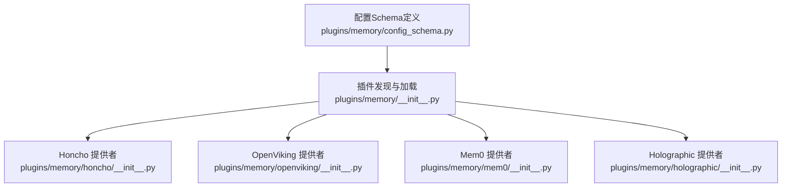
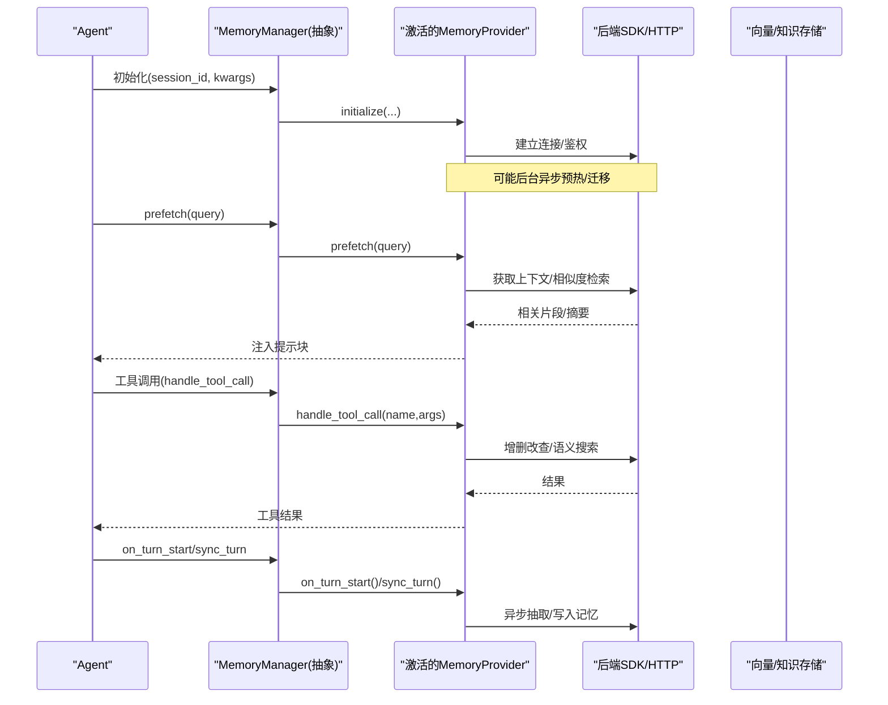
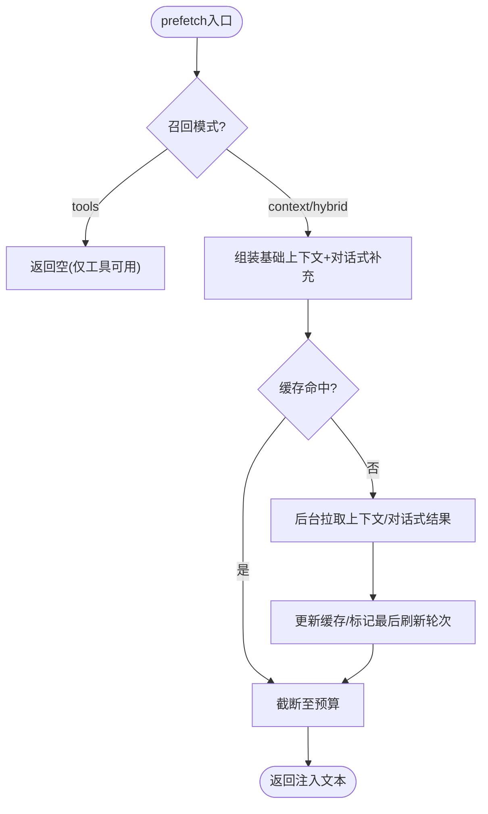
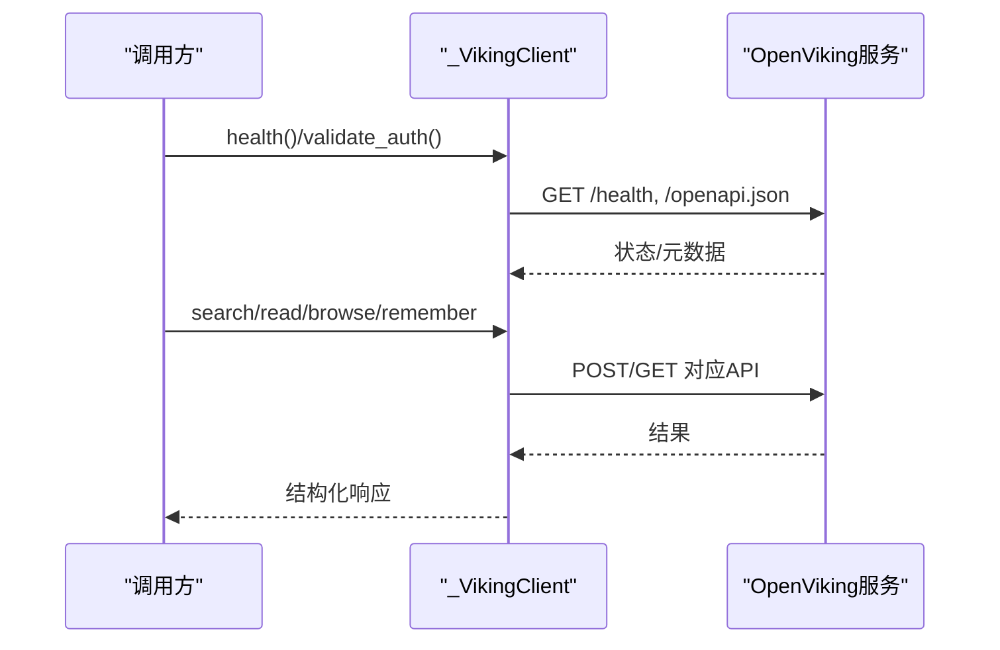
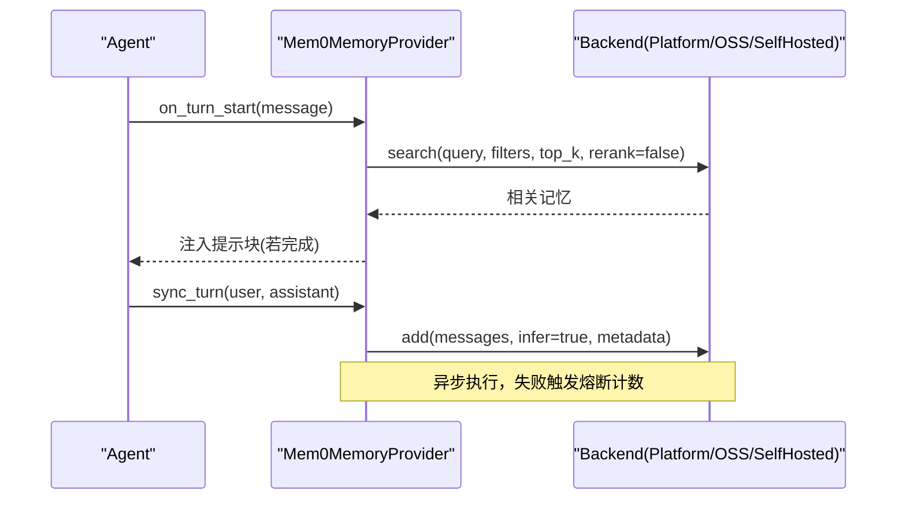
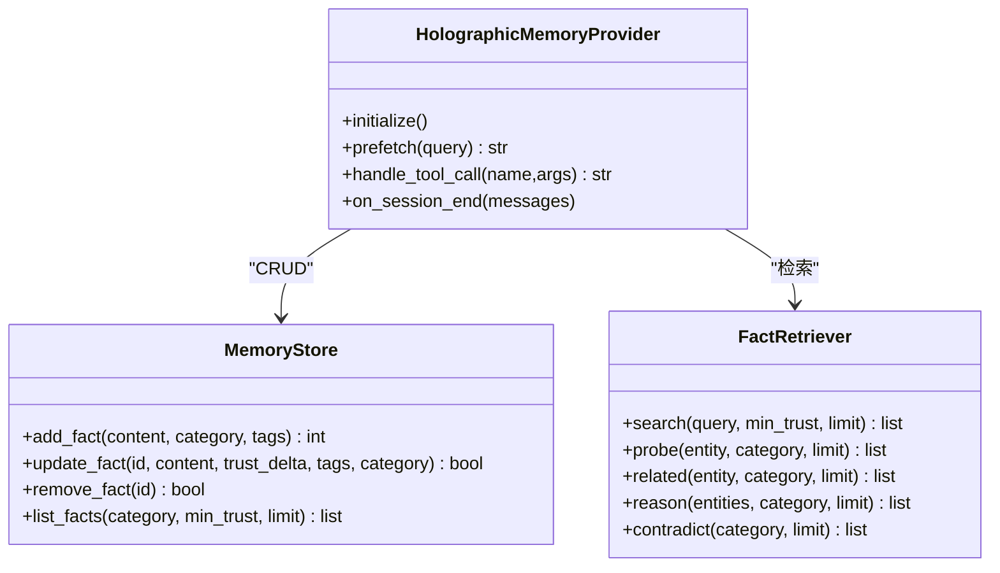
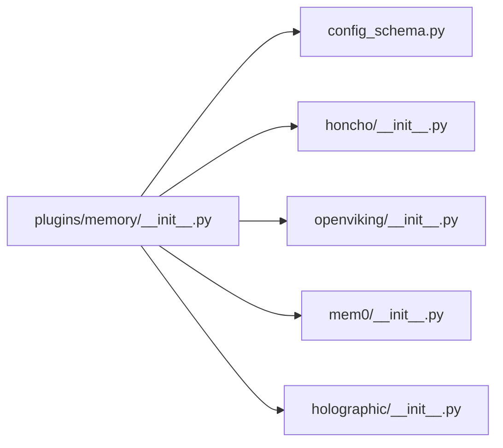

# 向量索引系统

<cite>
**本文引用的文件**
- [plugins/memory/__init__.py](file://plugins/memory/__init__.py)
- [plugins/memory/config_schema.py](file://plugins/memory/config_schema.py)
- [plugins/memory/honcho/__init__.py](file://plugins/memory/honcho/__init__.py)
- [plugins/memory/openviking/__init__.py](file://plugins/memory/openviking/__init__.py)
- [plugins/memory/mem0/__init__.py](file://plugins/memory/mem0/__init__.py)
- [plugins/memory/holographic/__init__.py](file://plugins/memory/holographic/__init__.py)
</cite>

## 目录
1. [简介](#简介)
2. [项目结构](#项目结构)
3. [核心组件](#核心组件)
4. [架构总览](#架构总览)
5. [详细组件分析](#详细组件分析)
6. [依赖关系分析](#依赖关系分析)
7. [性能与优化](#性能与优化)
8. [故障排查指南](#故障排查指南)
9. [结论](#结论)
10. [附录：使用示例与最佳实践](#附录使用示例与最佳实践)

## 简介
本文件面向Sparkii Agent的“向量索引系统”，系统性说明向量数据库集成、语义检索、索引构建与维护策略，并对比不同存储后端（Honcho、OpenViking、Mem0）的差异与性能特点。文档同时为初学者提供向量数据库基础概念，并为高级用户提供索引算法、并发与容错、以及性能优化的细节。

## 项目结构
Sparkii通过统一的MemoryProvider插件体系接入多种记忆/向量存储后端。每个后端以独立子目录实现，并在统一入口中注册与发现。配置层采用声明式schema，便于UI渲染与跨平台管理。

图表来源
- [plugins/memory/__init__.py:146-227](file://plugins/memory/__init__.py#L146-L227)
- [plugins/memory/config_schema.py:94-145](file://plugins/memory/config_schema.py#L94-L145)

章节来源
- [plugins/memory/__init__.py:1-462](file://plugins/memory/__init__.py#L1-L462)
- [plugins/memory/config_schema.py:1-145](file://plugins/memory/config_schema.py#L1-L145)

## 核心组件
- MemoryProvider抽象与插件发现：负责扫描、加载、选择唯一激活的后端，并提供统一工具接口与生命周期钩子。
- 配置Schema：声明各后端的可配置字段、类型、作用域与存储位置，驱动通用UI与读写逻辑。
- 具体后端实现：
  - Honcho：AI原生记忆，支持对话式推理、混合检索、持久化结论与上下文快照。
  - OpenViking：文件系统风格的知识库，分层上下文加载与语义搜索。
  - Mem0：服务端事实抽取与语义检索，支持云端与自托管模式。
  - Holographic：结构化事实存储，实体解析与HRR组合检索。

章节来源
- [plugins/memory/__init__.py:146-227](file://plugins/memory/__init__.py#L146-L227)
- [plugins/memory/config_schema.py:94-145](file://plugins/memory/config_schema.py#L94-L145)
- [plugins/memory/honcho/__init__.py:237-336](file://plugins/memory/honcho/__init__.py#L237-L336)
- [plugins/memory/openviking/__init__.py:473-633](file://plugins/memory/openviking/__init__.py#L473-L633)
- [plugins/memory/mem0/__init__.py:117-188](file://plugins/memory/mem0/__init__.py#L117-L188)
- [plugins/memory/holographic/__init__.py:39-91](file://plugins/memory/holographic/__init__.py#L39-L91)

## 架构总览
下图展示从Agent到各记忆后端的调用路径，包括预取注入、工具调用、会话同步与结果返回。

图表来源
- [plugins/memory/honcho/__init__.py:343-562](file://plugins/memory/honcho/__init__.py#L343-L562)
- [plugins/memory/openviking/__init__.py:287-467](file://plugins/memory/openviking/__init__.py#L287-L467)
- [plugins/memory/mem0/__init__.py:337-515](file://plugins/memory/mem0/__init__.py#L337-L515)
- [plugins/memory/holographic/__init__.py:156-227](file://plugins/memory/holographic/__init__.py#L156-L227)

## 详细组件分析

### Honcho 提供者
- 角色与能力
  - 提供跨会话用户建模、对话式推理、混合检索、持久化结论与上下文快照。
  - 支持context/tools/hybrid三种召回模式，具备首句等待与后台预热机制。
- 关键流程
  - 初始化：读取配置、解析会话键、创建或获取远程会话、可选迁移与预冷。
  - 预取：按周期刷新基础上下文与对话式补充，支持线程安全缓存与超时控制。
  - 工具：profile/search/reasoning/context/conclude等。
- 错误与健壮性
  - 后台初始化失败不阻塞主流程；认证失败记录一次性提示；网络异常降级。

图表来源
- [plugins/memory/honcho/__init__.py:699-800](file://plugins/memory/honcho/__init__.py#L699-L800)

章节来源
- [plugins/memory/honcho/__init__.py:237-336](file://plugins/memory/honcho/__init__.py#L237-L336)
- [plugins/memory/honcho/__init__.py:343-562](file://plugins/memory/honcho/__init__.py#L343-L562)
- [plugins/memory/honcho/__init__.py:699-800](file://plugins/memory/honcho/__init__.py#L699-L800)

### OpenViking 提供者
- 角色与能力
  - 基于文件系统风格的知识库（viking://），分层上下文（L0/L1/L2）、自动记忆抽取、语义搜索与资源摄取。
- HTTP客户端与健康检查
  - 轻量HTTP封装，支持租户/代理身份头、重试与错误标准化。
- 工具集
  - viking_search/viking_read/viking_browse/viking_remember/viking_forget/viking_add_resource。
- 典型流程
  - 健康探测→身份识别→会话/资源操作→分层读取→搜索结果返回。

图表来源
- [plugins/memory/openviking/__init__.py:287-467](file://plugins/memory/openviking/__init__.py#L287-L467)
- [plugins/memory/openviking/__init__.py:473-633](file://plugins/memory/openviking/__init__.py#L473-L633)

章节来源
- [plugins/memory/openviking/__init__.py:287-467](file://plugins/memory/openviking/__init__.py#L287-L467)
- [plugins/memory/openviking/__init__.py:473-633](file://plugins/memory/openviking/__init__.py#L473-L633)

### Mem0 提供者
- 角色与能力
  - 服务端事实抽取与语义检索，支持Platform（云端）与OSS（自托管）两种模式。
  - 提供mem0_search/add/update/delete工具，支持rerank（平台模式）。
- 预取与同步
  - 在回合开始时后台预取相关记忆，回合结束时异步将对话内容推送至服务端进行抽取与入库。
- 容错
  - 熔断器：连续失败达到阈值后暂停调用一段时间，降低雪崩风险。

图表来源
- [plugins/memory/mem0/__init__.py:337-515](file://plugins/memory/mem0/__init__.py#L337-L515)

章节来源
- [plugins/memory/mem0/__init__.py:117-188](file://plugins/memory/mem0/__init__.py#L117-L188)
- [plugins/memory/mem0/__init__.py:337-515](file://plugins/memory/mem0/__init__.py#L337-L515)

### Holographic 提供者
- 角色与能力
  - 结构化事实存储，实体解析、信任评分、时间衰减与HRR组合检索。
  - 工具fact_store支持add/search/probe/related/reason/contradict/update/remove/list。
- 自动抽取
  - 会话结束时可自动从对话中提取偏好与决策类事实。
- 本地存储
  - 基于SQLite，支持关闭时显式释放连接，避免锁竞争。

图表来源
- [plugins/memory/holographic/__init__.py:113-227](file://plugins/memory/holographic/__init__.py#L113-L227)

章节来源
- [plugins/memory/holographic/__init__.py:113-227](file://plugins/memory/holographic/__init__.py#L113-L227)
- [plugins/memory/holographic/__init__.py:228-367](file://plugins/memory/holographic/__init__.py#L228-L367)

## 依赖关系分析
- 插件发现与加载：统一入口扫描内置与用户安装目录，优先内置；按需导入模块并实例化Provider。
- 配置Schema：纯数据描述，由Web层渲染与读写，避免引入运行时依赖。
- 后端耦合：各Provider通过自身SDK或HTTP访问后端，对外暴露一致的MemoryProvider接口。

图表来源
- [plugins/memory/__init__.py:146-227](file://plugins/memory/__init__.py#L146-L227)
- [plugins/memory/config_schema.py:94-145](file://plugins/memory/config_schema.py#L94-L145)

章节来源
- [plugins/memory/__init__.py:146-227](file://plugins/memory/__init__.py#L146-L227)
- [plugins/memory/config_schema.py:94-145](file://plugins/memory/config_schema.py#L94-L145)

## 性能与优化
- 批量插入与增量更新
  - Mem0：会话结束后异步批量推送消息进行服务端抽取与入库，减少主路径延迟。
  - Honcho：后台会话初始化与预冷，首次请求可等待有限时长，后续走缓存。
  - OpenViking：资源上传与处理可异步等待，支持分批读取与层级摘要。
- 索引压缩与上下文预算
  - Honcho：对注入内容做预算截断，避免超出模型上下文限制。
  - OpenViking：分层读取（abstract/overview/full）控制token消耗。
  - Holographic：信任评分与时间衰减过滤低价值事实，减少噪声。
- 并发与容错
  - Honcho/Mem0：多线程后台任务（预热/同步/预取），配合超时与锁保护。
  - Mem0：熔断器防止级联失败；OpenViking：健康探测与身份重试。
- 建议
  - 根据场景选择模式：快速事实用Mem0/Honcho搜索，复杂推理用Honcho reasoning或OpenViking deep模式。
  - 合理设置top_k、rerank、recall_limit等参数，平衡召回率与延迟。
  - 定期维护：清理过期事实、重建索引（如Holographic的重建向量）。

[本节为通用指导，无需特定文件引用]

## 故障排查指南
- 无法启用提供者
  - 检查配置是否满足is_available条件（如API Key、Endpoint、后端可用性）。
  - 参考各Provider的is_available与initialize日志定位问题。
- 预取无结果或过慢
  - 确认召回模式与注入频率；检查后台预热线程是否启动；关注超时与预算截断。
- 工具调用失败
  - 查看handle_tool_call的错误分支与后端返回；注意熔断器状态与重试策略。
- 连接/鉴权错误
  - OpenViking：检查端点、租户头与API Key；必要时启用可信身份重试。
  - Honcho：关注认证失败的一次性提示与后台初始化错误。
  - Mem0：区分平台/自托管/OSS模式，核对host/api_key与vector store可达性。

章节来源
- [plugins/memory/honcho/__init__.py:306-336](file://plugins/memory/honcho/__init__.py#L306-L336)
- [plugins/memory/openviking/__init__.py:440-467](file://plugins/memory/openviking/__init__.py#L440-L467)
- [plugins/memory/mem0/__init__.py:227-293](file://plugins/memory/mem0/__init__.py#L227-L293)

## 结论
Sparkii通过统一的MemoryProvider抽象与声明式配置，将多种向量/知识存储后端无缝接入Agent工作流。不同后端在语义检索、上下文组织与性能特征上各有侧重：Honcho擅长对话式推理与跨会话建模；OpenViking提供分层知识与文件系统式浏览；Mem0强调服务端抽取与语义检索；Holographic聚焦结构化事实与组合检索。结合批量写入、预算控制、并发与熔断等优化手段，可在保证体验的同时提升检索质量与系统稳定性。

[本节为总结性内容，无需特定文件引用]

## 附录：使用示例与最佳实践
- 创建与查询索引（概念性步骤）
  - 选择并激活一个MemoryProvider（如mem0/honcho/openviking/holographic）。
  - 通过工具接口写入事实或记忆（例如mem0_add、viking_remember、fact_store add）。
  - 使用语义搜索工具检索相关记忆（例如mem0_search、viking_search、honcho_search）。
  - 在需要时进行更新或删除（例如mem0_update/delete、fact_store update/remove）。
- 最佳实践
  - 明确场景：快速事实检索优先选Mem0/Honcho搜索；复杂推理选Honcho reasoning或OpenViking deep。
  - 控制成本：设置合理的top_k、rerank、recall_limit与注入预算。
  - 维护质量：定期清理过时事实，利用信任评分与时间衰减保持知识库健康。
  - 监控与容错：关注健康检查、熔断器与错误日志，及时恢复后端服务。

[本节为概念性指导，无需特定文件引用]